# 2.3　变量间的相关关系

87

# CHAPTER 2.3 变量间的关系

## 2.3.1 变量之间的相关关系

在学校里，老师对学生经常这样说：“如果你的数学成绩好，那么你的物理学习就不会有什么大问题。”按照这种说法，似乎学生的物理成绩与数学成绩之间存在着一种相关关系，这种说法有没有根据呢？

我们的学习经验可知，物理成绩确实与数学成绩有一定的关系，但除此以外，还存在其他影响物理成绩的因素，例如，是否喜欢物理，用在物理学习上的时间等等。当我们主要考虑数学成绩对物理成绩的影响时，就是要考察这两者之间的相关关系。

我们还可以举出现实生活中存在的许多相关关系的问题，例如：

1. 商品销售收入与广告支出经费之间的关系。商品销售收入与广告支出经费有着密切的联系，但商品销售收入不仅与广告支出多少有关，还与商品质量、居民收入等因素有关。

2. 粮食产量与施肥量之间的关系。在一定范围内，施肥量越大，粮食产量就越高，但是，施肥量并不是决定粮食产量的唯一因素，因为粮食产量还要受到土壤质量、降雨量、田间管理水平等因素的影响。

3. 人体内的脂肪含量与年龄之间的关系。在一定年龄段内，随着年龄的增长，人体内的脂肪含量会增加，但人体内的脂肪含量还与饮食习惯、体育锻炼等有关，可能还与个人的先天体质有关。

应当说，对于上述各种问题中的两个变量之间的相关关系，75

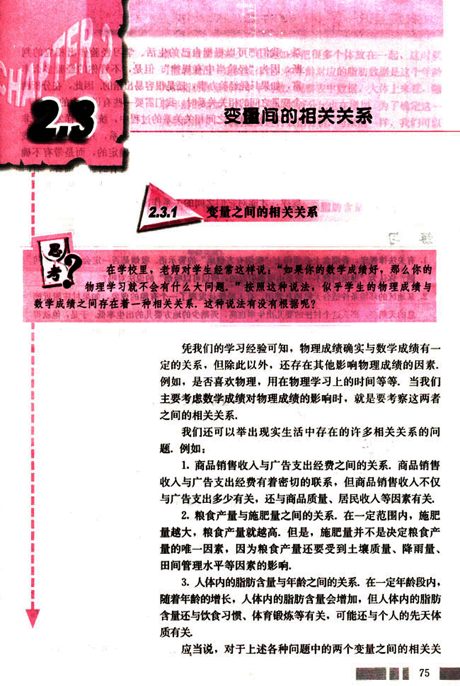
88

# CHAPTER 2

普通高中课程标准实验教科书 数学 3

系,我们都可以根据自己的生活、学习经验作出相应的判断,因为“经验当中有规律”,但是,不管你的经验多么丰富,如果只凭经验办事,还是很容易出错的。因此,在分析两个变量之间的相关关系时,我们需要一些有说服力的方法。在寻找变量之间相关关系的过程中,统计同样发挥着非常重要的作用,因为上面提到的这种关系,并不像匀速直线运动中时间与路程的关系那样是完全确定的,而是带有不确定性,这就需要通过收集大量的数据(有时通过调查,有时通过实验),在对数据进行统计分析的基础上,发现其中的规律,才能对它们之间的关系作出判断。

## 练习

1. 有关法律规定，香烟盒上必须印上“吸烟有害健康”的警示语，吸烟是否一定会引起健康问题？你认为“健康问题不一定是由吸烟引起的，所以可以吸烟”的说法对吗？

2. 某地区的环境条件适合天鹅栖息繁衍，有人经统计发现了一个有趣的现象，如果村庄附近栖息的天鹅多，那么这个村庄的婴儿出生率也高，天鹅少的地方婴儿的出生率低，于是，他就得出一个结论：天鹅能够带来孩子，你认为这样得到的结论可靠吗？如何证明这个结论的可靠性？

## 2.3.2 两个变量的线性相关

在一次对人体脂肪含量和年龄关系的研究中，研究人员获得了一组样本数据：

表 2-3 人体的脂肪百分比和年龄

| 年龄 | 23 | 27 | 39 | 41 | 45 | 49 | 50 |
|---|---|---|---|---|---|---|---|
| 脂肪 | 9.5 | 17.8 | 21.2 | 25.9 | 27.5 | 26.3 | 28.2 |
| 年龄 | 53 | 54 | 56 | 57 | 58 | 60 | 61 |
| 脂肪 | 29.6 | 30.2 | 31.4 | 30.8 | 33.5 | 35.2 | 34.6 |

根据上述数据，人体的脂肪含量与年龄之间有怎样的关系？

一般地，对于某个人来说，他的体内脂肪不一定随年龄
76

89

# 第二章 统计

## 第二节

增长而增加或减少，但是如果把很多个体放在一起，这时就
可能表现出一定的规律性。各年龄对应的脂肪数据是这个年龄
人群脂肪含量的样本平均数。观察表中数据，大体上来看，随
着年龄的增加，人体中脂肪的百分比也在增加。为了确定这一
关系的细节，我们需要进行数据分析，与以前一样，我们可以
作统计图、表，通过作统计图、表，可以使我们对两个变量之
间的关系有一个直观上的印象和判断。

下面要作的图叫做散点图(scatterplot)，对于表2-3中的
数据，我们假设人的年龄影响体内脂肪含量，于是，按照习
惯，以x轴表示年龄，以y轴表示脂肪含量，得到相应的散
点图（图2.3-1）。

[图2.3-1](images/2.3-1.png)

从散点图我们可以看出，年龄越大，体内脂肪含量越高，
图中点的趋势表明两个变量之间确实存在一定的关系，这个
图支持了我们从数据表中得出的结论。

另外，这些点散布的位置也是值得注意的，它们散布在
从左下角到右上角的区域。对于两个变量的这种相关关系，我
们将它称为**正相关**。还有一些变量，例如汽车的重量和汽车每
消耗1L汽油所行驶的平均路程，成**负相关**，汽车越重，每
消耗1L汽油所行驶的平均路程就越短，这时的点散布在从左
上角到右下角的区域内。

(1) 两个变量成负相关关系时，散点图有什么特点？

(2) 你能举出一些生活中的变量成正相关或成负相关的例子吗？

77

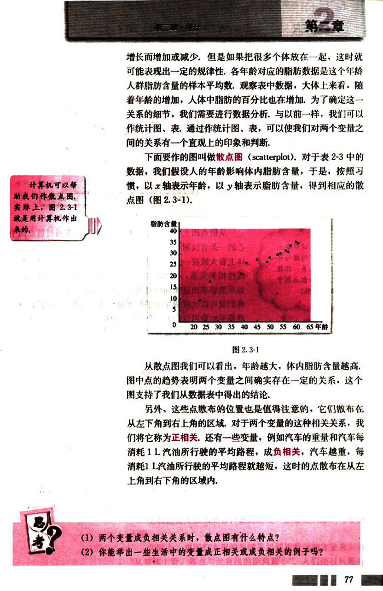
90

# CHAPTER 2

普通高中课程标准实验教科书 数学 3

接下来，需要进一步考虑的问题是，当人的年龄增加时，体内脂肪含量到底是以什么方式增加的呢？

脂肪含量
40
35
30
25
20
15
10
5
0
20 25 30 35 40 45 50 55 60 65 年龄

图 2.3-2

从散点图上可以看出，这些点大致分布在通过散点图中心的—条直线附近（图2.3-2）。如果散点图中点的分布从整体上看大致在一条直线附近，我们就称这两个变量之间具有线性相关关系，这条直线叫做**回归直线**(regression line)。如果能够求出这条回归直线的方程（简称回归方程），那么我们就可以比较清楚地了解年龄与体内脂肪含量的相关性，就像平均数可以作为一个变量的数据的代表一样，这条直线可以作为两个变量具有线性相关关系的代表。

那么，我们应当如何具体求出这个回归方程呢？

有的同学可能会想，我可以采用测量的方法，先画出一条直线，测量出各点与它的距离，然后移动直线，到达一个使距离的和最小的位置，测量出此时的斜率和截距，就可得到回归方程了（图2.3-3）。但是，这样做可靠吗？

有的同学可能还会想，在图中选择这样的两点画直线，使得直线两侧的点的个数基本相同（图2.3-4）。同样地，这样做能保证各点与此直线在整体上是最接近的吗？

还有的同学会想，在散点图中多取几组点，确定出几条直线的方程（图2.3-5），再分别求出各条直线的斜率、截距的平均数，将这两个平均数当成回归方程的斜率和截距。

同学们不妨去实践一下，看看这些方法是不是真的可行？

78

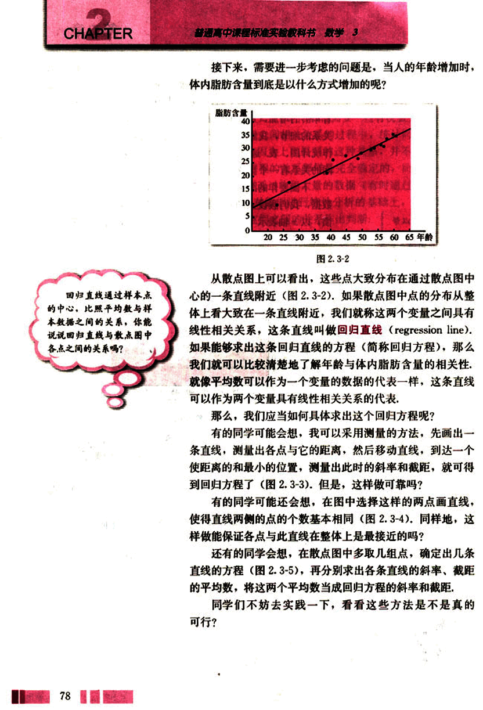
91

# 第二章 统计

## “回归”

“回归”这个词是由英国著名的统计学家Francis Galton提出来的。1889年，他在研究祖先与后代身高之间的关系时发现，身材较高的父母，他们的孩子也较高，但这些孩子的平均身高并没有他们父母的平均身高高；身材较矮的父母，他们的孩子也较矮，但这些孩子的平均身高却比他们父母的平均身高高。Galton把这种后代的身高向中间值靠近的趋势称为“回归现象”，后来，人们把由一个变量的变化去推测另一个变量的变化的方法称为回归方法。

## 图表

上面这些方法虽然有一定的道理，但总让人感到可靠性不强。

实际上，求回归方程的关键是如何用数学的方法来刻画“从整体上看，各点与此直线的距离最小”。人们经过长期的
79

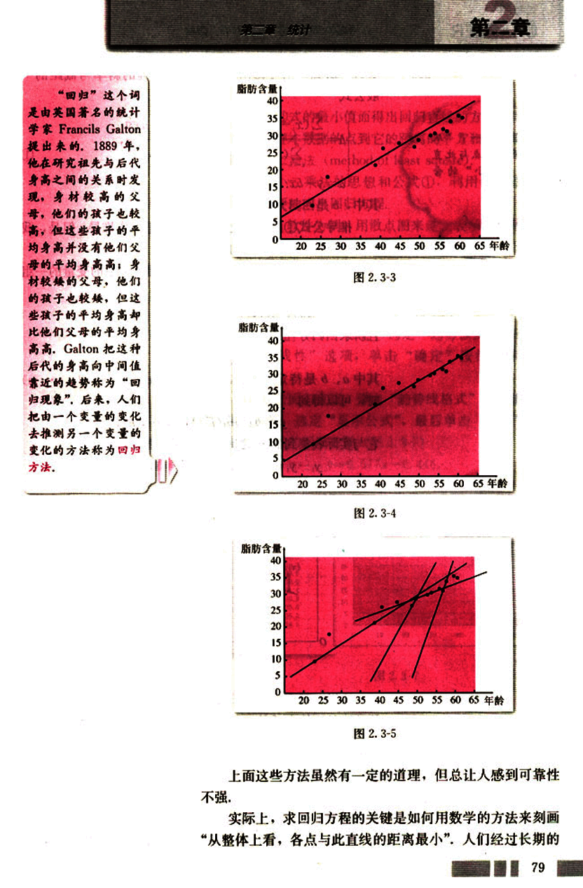
92

# CHAPTER 2

你能解释一下“从整体上看，各点与此直线的距离最小”的含义吗？

实践与研究，已经得出了计算回归方程的斜率与截距的一般公式

$\begin{cases}
b = \frac{\sum_{i=1}^{n}(x_i - \overline{x})(y_i - \overline{y})}{\sum_{i=1}^{n}(x_i - \overline{x})^2} \\
a = \overline{y} - b\overline{x}
\end{cases}$ ①

其中，*b*是回归方程的斜率，*a*是截距。

推导公式①的计算比较复杂，这里不作推导，但是，我们可以解释一下得出它的原理。

假设我们已经得到两个具有线性相关关系的变量的一组数据

( *x*1, *y*1 ), ( *x*2, *y*2 ), …, ( *xn*, *yn* ),

且所求回归方程是

*y* = *bx* + *a*,

其中 *a*、*b* 是待定参数，当变量 *x* 取 *xi* ( *i* = 1, 2, …, *n* ) 时，可以得到

*ŷi* = *bxi* + *a* (*i* = 1, 2, …, *n* ),

它与实际收集到的 *yi* 之间的偏差是（图 2.3-6）

*yi* − *ŷi* = (*yi* − (*bxi* + *a*) ) (*i* = 1, 2, …, *n*).

[图2.3-6](images/2.3-6.png)

这样，用这 *n* 个偏差的和来刻画“各点与此直线的整体偏差”是比较合适的。由于 (*yi* − *ŷi*) 可正可负，为了避免相互抵消，可以考虑用 ∑| *yi* − *ŷi* | 来代替，但由于它含有绝对值，运算不太方便，所以改用

*Q* = (*y*1 − *bx*1 − *a*)2 + (*y*2 − *bx*2 − *a*)2 + … + (*yn* − *bxn* − *a*)2 ②

来刻画 *n* 个点与回归直线在整体上的偏差。

这样，问题就归结为：当 *a*、*b* 取什么值时 *Q* 最小，即

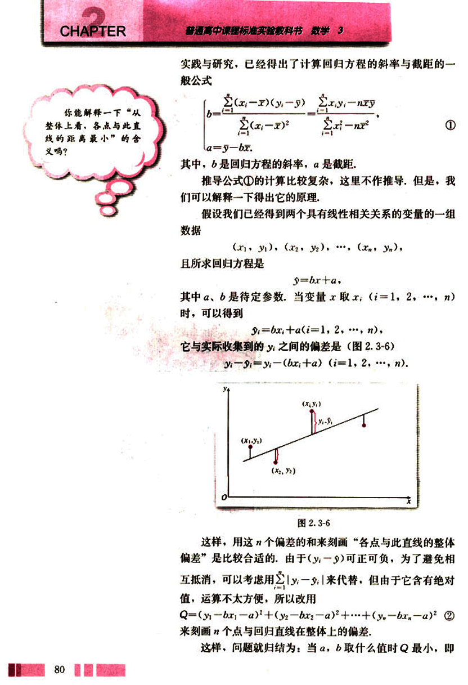
93

# 第二章 统计

## 总体偏差最小

总体偏差最小，经过数学上求最小值的运算，a，b的值由公式①给出。

通过求②式的最小值而得出回归直线的方法，即求回归直线，使得样本数据的点到它的距离的平方和最小，这一方法叫做最小二乘法 (method of least square)。

根据最小二乘法的思想和公式①，利用计算器或计算机，可以方便地求出回归方程。

以Excel 软件为例，用散点图来建立表示人体的脂肪含量与年龄的相关关系的线性回归方程，具体步骤如下：

(1) 在Excel中选定表示人体的脂肪含量与年龄的相关关系的散点图（如图2.3-1所示），在菜单中选定“图表”中的“添加趋势线”选项，弹出“添加趋势线”对话框。

(2) 单击“类型”标签，选定“趋势预测/回归分析类型”中的“线性”选项，单击“确定”按钮，得到回归直线。

(3) 双击回归直线，弹出“趋势线格式”对话框，单击“选项”标签，选定“显示公式”，最后单击“确定”按钮，得到回归直线的回归方程（图2.3-7）

$y = 0.577x - 0.448$

[图2.3-7](images/图2.3-7.png)

81

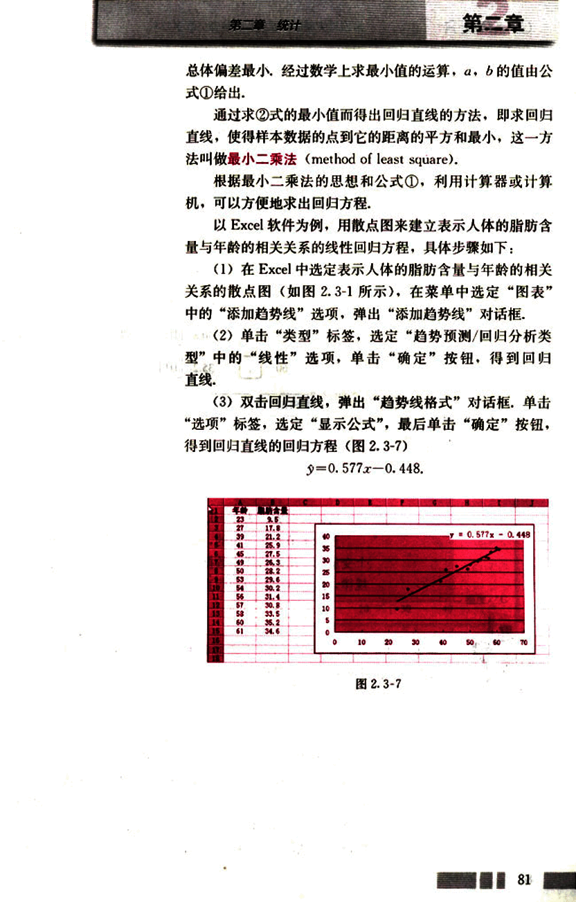
94

# CHAPTER 2

普通高中课程标准实验教科书 数学 3

用计算器求这个回归方程的过程如下：

MODE 3 1 (进入回归计算模式)

SHIFT CLR 1 (清除统计存储器)

|     |     |     |     |
| --- | --- | --- | --- |
| 23  | 9.5 DT | 27  | 17.8 DT |
| 39  | 21.2 DT | 41  | 25.9 DT |
| 45  | 27.5 DT | 49  | 26.3 DT |
| 50  | 28.2 DT | 53  | 29.6 DT |
| 54  | 30.2 DT | 56  | 31.4 DT |
| 57  | 30.8 DT | 58  | 33.5 DT |
| 60  | 35.2 DT | 61  | 34.6 DT |

SHIFT S-VAR → 1 (计算参数a)

-0.448

SHIFT S-VAR → 2 (计算参数b)

0.577

所以回归方程为 $\hat{y} = 0.577x - 0.448$。

正像本节开头所说的，我们从人体脂肪含量与年龄这两个变量的一组随机样本数据中，找到了它们之间关系的一个规律，这个规律是由回归直线来反映的。

将表2-3中的年龄作为x代入上述回归方程，看看得出的数值与真实数值之间的关系，从中你体会到什么？

利用回归直线，我们可以进行预测，如果我们知道了某个人的年龄，就可以利用回归方程来预测他的体内脂肪含量的百分比，例如，某人37岁，我们预测他的体内脂肪含量在20.87% (0.576 × 37 - 0.446 = 20.87%) 附近的可能性比较大，不过，我们不能说他的体内脂肪含量一定是20.87%。事实上，这个20.87%是对年龄为37岁的人群中

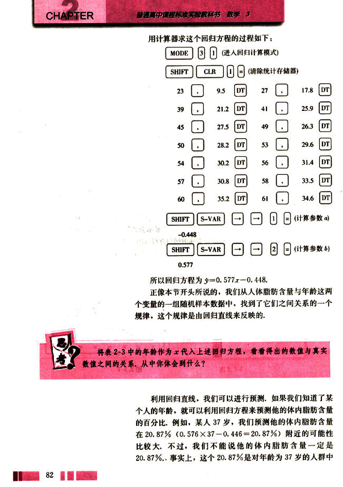
95

# 第二章 统计

的大部分人的体内脂肪含量所作出的估计，

## 例

有一个同学家开了一个小卖部，他为了研究气温对热饮销售的影响，经过统计；得到一个卖出的热饮杯数与当天气温的对比表：

表2-4

| 摄氏温度/℃ | -5 | 0 | 4 | 7 | 12 | 15 | 19 | 23 | 27 | 31 | 36 |
|---|---|---|---|---|---|---|---|---|---|---|---|
| 热饮杯数 | 156 | 150 | 132 | 128 | 130 | 116 | 104 | 89 | 93 | 76 | 54 |

(1) 画出散点图；

(2) 从散点图中发现气温与热饮销售杯数之间关系的一般规律；

(3) 求回归方程；

(4) 如果某天的气温是2℃，预测这天卖出的热饮杯数。

解：(1) 散点图如图2.3-8所示：

[图2.3-8](images/2.3-8.png)

(2) 从图2.3-8看到，各点散布在从左上角到右下角的区域里，因此，气温与热饮销售杯数之间成负相关，即气温越高，卖出去的热饮杯数越少。

(3) 从散点图可以看出，这些点大致分布在一条直线的附近，因此，可用公式①求出回归方程的系数。

利用计算器容易求得回归方程

$y = -2.352x + 147.767$

(4) 当$x = 2$时，$y = 143.063$。因此，某天的气温为2℃时，这天大约可以卖出143杯热饮。

83

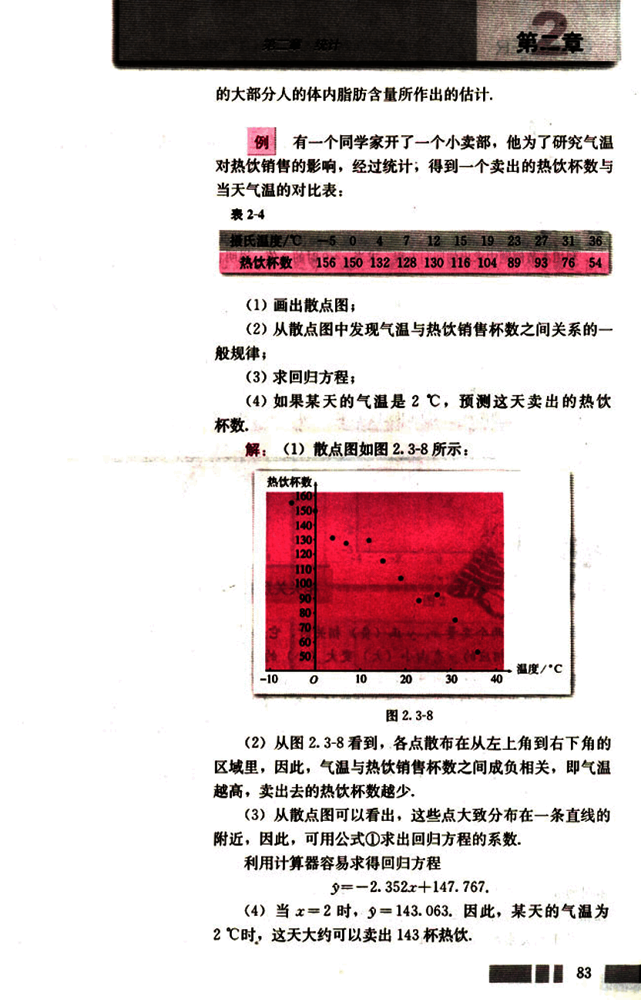
96

# CHAPTER 2

普通高中课程标准实验教科书 数学 3

气温为 2 ℃时小卖部一定能够卖出 143 杯左右热饮吗？为什么？

## 练习

1. 利用本节例题中求出的回归方程，求当 x = 0 时的 y 值，说明它为什么与实际卖出的热饮杯数不一样。

2. 下表给出了某些地区的鸟的种类数与这些地区的海拔高度 (m)。分析这些数据，看一看鸟的种类数与海拔高度是否有关。

| 地区 | A | B | C | D | E | F | G | H | I | J | K |
|---|---|---|---|---|---|---|---|---|---|---|---|
| 种类数 | 36 | 30 | 37 | 11 | 11 | 13 | 17 | 13 | 29 | 4 | 15 |
| 海拔/m | 1 250 | 1 158 | 1 067 | 457 | 701 | 731 | 610 | 670 | 1 493 | 762 | 549 |

## 阅读

### 相关关系的强与弱

我们知道，两个变量 x、y 正(负)相关时，它们就有相同(反)的变化趋势，即当 x 由小变大时，相应的 y 有由小(大)变大(小)的趋势，因此可以用回归直线来描述这种关系。与此相关的一个问题是：如何描述 x 和 y 之间的这种线性关系的强弱？例如，物理成绩与数学成绩正相关，但数学成绩能够在多大程度上决定物理成绩？这就是相关强弱的问题。类似的还有吸烟与健康的负相关强度，父母身高与子女身高的正相关强度，农作物的产量与施肥量的正相关强度等。

统计中用相关系数 r 来衡量两个变量之间线性关系的强弱，若相应于变量 x 的取值 $x_i$，变量 y 的观测值为 $y_i$ (1 ≤ i ≤ n)，则两个变量的相关系数的计算公式为

$r = \frac{\sum_{i=1}^{n}(x_i - \bar{x})(y_i - \bar{y})}{\sqrt{\sum_{i=1}^{n}(x_i - \bar{x})^2 \sum_{i=1}^{n}(y_i - \bar{y})^2}}$

不同的相关性可以从散点图上直观地反映出来。图 1、图 2 反映了变量 x、y 之间很强的线性相关关系，而图 4 中的两个变量的线性相关程度很弱。

对于相关系数 r，首先值得注意的是它的符号，当为正时，表明变量 x、y 正相关；
84

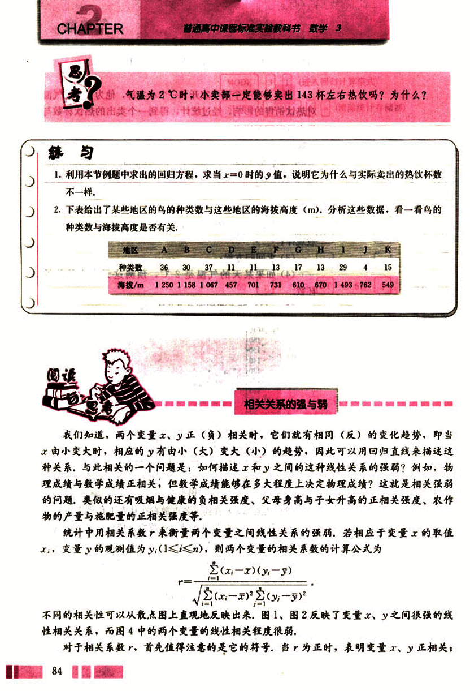
97

# 第二章 统计

当r为负时，表明变量x，y负相关，反映在散点图上，图1中的变量x，y正相关，这时
的r为正，图2中的变量x，y负相关，这时的r为负。

另一个值得注意的是r的大小，统计学认为，对于变量x，y，如果r∈ [-1，
-0.75]，那么负相关很强；如果r∈ [0.75，1]，那么正相关很强；如果r∈(-0.75，
-0.30]或r∈ [0.30，0.75)，那么相关性一般；如果r∈ [-0.25，0.25]，那么相关性较
弱，反映在散点图上，图1的r=0.97，这些点有明显的从左下角到右上角沿直线分布趋
势，这时用线性回归模型描述两个变量之间的关系效果很好；图2的r=-0.85，这些点
也有明显的从左上角到右下角沿直线分布趋势，这时用线性回归模型描述两个变量之间的
关系也有好的效果；图3的r=0.24，这些点的分布几乎没有什么规则，这时不能用线性
回归模型描述两个变量之间的关系；图4的r=-0.05，两个变量之间几乎没有什么关系，
这时就更不能用线性回归模型描述两个变量之间的关系。

你能试着对自己身边的某个问题，确定两个变量，通过收集数据，计算相关系数，然
后分析一下能否用线性回归模型来拟合它们之间的关系吗？

[图1](images/图1.png)
[图2](images/图2.png)
[图3](images/图3.png)
[图4](images/图4.png)

85

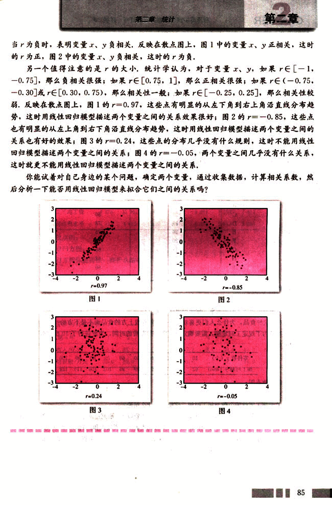
98

# CHAPTER 2

## 习题 2.3

**A 组**

1. “名师出高徒”可以解释为教师的水平越高，学生的水平也越高，那么，教师的水平与学生的水平成什么相关关系？你能举出更多的描述生活中两个变量的相关关系的成语吗？

2. 有时候，一些东西吃起来口味越好，对我们的身体越有害，下表给出了不同类型的某种食品的数据，第一列表示此种食品所含热量的百分比，第二列数据表示由一些美食家以百分制给出的对此种食品口味的评价：

| 品牌 | 所含热量的百分比 | 口味纪录 |
|---|---|---|
| A | 25 | 89 |
| B | 34 | 89 |
| C | 20 | 80 |
| D | 19 | 78 |
| E | 26 | 75 |
| F | 20 | 71 |
| G | 19 | 65 |
| H | 24 | 62 |
| I | 19 | 60 |
| J | 13 | 52 |

(1) 作出这些数据的散点图。

(2) 作出回归直线。

(3) 关于两个变量之间的关系，你能得出什么结论？

(4) 对于这种食品，为什么人们更喜欢吃位于回归直线上方的食品而不是下方的？

3. 一个车间为了规定工时定额，需要确定加工零件所花费的时间，为此进行了10次试验，收集数据如下：

| 零件数 x (个) | 10 | 20 | 30 | 40 | 50 | 60 | 70 | 80 | 90 | 100 |
|---|---|---|---|---|---|---|---|---|---|---|
| 加工时间 y (min) | 62 | 68 | 75 | 81 | 89 | 95 | 102 | 108 | 115 | 122 |

(1) 画出散点图；

(2) 求回归方程；

(3) 关于加工零件的个数与加工时间，你能得出什么结论？

4. 影响消费水平的原因是很多的，其中重要的一项是工资收入，研究这两个变量的关系的一个方法是通过随机抽样的方法，在全国范围内收集被调查者的工资收入和他们的消费状况，下面的数据来自国家统计局公布的统计年鉴（2000年版），是祖国大陆31个省、自治区、直辖市的职工平均工资与居民消费水平（单位：元）。

86

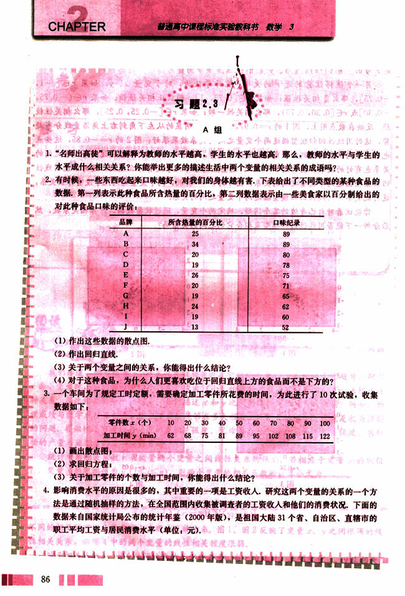
99

# 第二章 统计

## 省、区、市  职工平均工资  居民消费水平

| 省、区、市 | 北京 | 天津 | 河北 | 山西 | 内蒙古 | 辽宁 | 吉林 | 黑龙江 |
|---|---|---|---|---|---|---|---|---|
| 职工平均工资 | 14 054 | 11 056 | 7 022 | 6 065 | 6.342 | 7 895 | 7 158 | 7 094 |
| 居民消费水平 | 7 040 | 7 346 | 5 033 | 3 932 | 3 765 | 6 366 | 5 216 | 5 632 |

续表

| 省、区、市 | 上海 | 江苏 | 浙江 | 安徽 | 福建 | 江西 | 山东 | 河南 |
|---|---|---|---|---|---|---|---|---|
| 职工平均工资 | 16 641 | 9 171 | 11 201 | 6 516 | 9 490 | 6 749 | 7 656 | 6 494 |
| 居民消费水平 | 11 943 | 6 239 | 7 985 | 4 985 | 6 255 | 3 482 | 6 060 | 4 214 |

续表

| 省、区、市 | 湖北 | 湖南 | 广东 | 广西 | 海南 | 重庆 | 四川 | 贵州 |
|---|---|---|---|---|---|---|---|---|
| 职工平均工资 | 6 991 | 9 269 | 12 245 | 6 776 | 6 865 | 7 182 | 7 249 | 6 595 |
| 居民消费水平 | 5 292 | 5 290 | 8 987 | 4 987 | 4 700 | 6 190 | 4 876 | 4 334 |

续表

| 省、区、市 | 云南 | 西藏 | 陕西 | 甘肃 | 青海 | 宁夏 | 新疆 |
|---|---|---|---|---|---|---|---|
| 职工平均工资 | 8 276 | 12 962 | 6 931 | 7 427 | 9 081 | 7 392 | 7 611 |
| 居民消费水平 | 4 933 | 4 685 | 4 520 | 4 615 | 4 384 | 3 813 | 3 988 |

(1) 画出散点图;

(2) 求出回归方程;

(3) 从回归方程你能得出一些什么结论?

## B 组

1. 有人收集了 10 年中某城市的居民年收入（即此城市所有居民在一年内的收入的总和）与某种商品的销售额的有关数据：

| 第n年 | 1 | 2 | 3 | 4 | 5 | 6 | 7 | 8 | 9 | 10 |
|---|---|---|---|---|---|---|---|---|---|---|
| 年收入/亿元 | 32.2 | 31.1 | 32.9 | 35.8 | 37.1 | 38.0 | 39.0 | 43.0 | 44.6 | 46.0 |
| 商品销售额/万元 | 25.0 | 30.0 | 34.0 | 37.0 | 39.0 | 41.0 | 42.0 | 44.0 | 48.0 | 51.0 |

(1) 画出散点图;

(2) 求出回归方程;

(3) 如果这座城市居民的年收入达到 40 亿元，估计这种商品的销售额是多少。

2. 生活中有许多变量之间的关系是值得我们去研究的，例如，关于我们自己的身体，身高与体重之间是否存在某种相关性呢？请从你自己的班里抽取适当的样本，然后再收集好数据，对它们的相关性进行讨论。

87

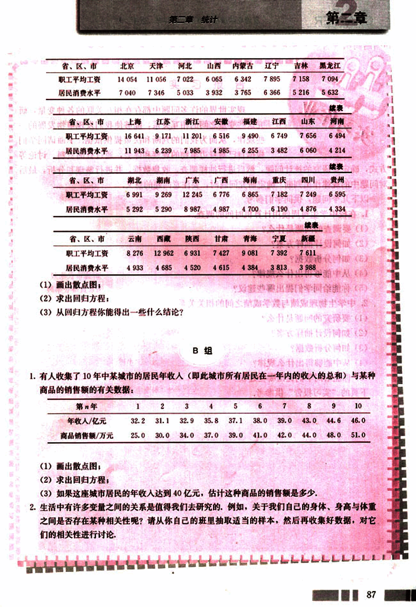
