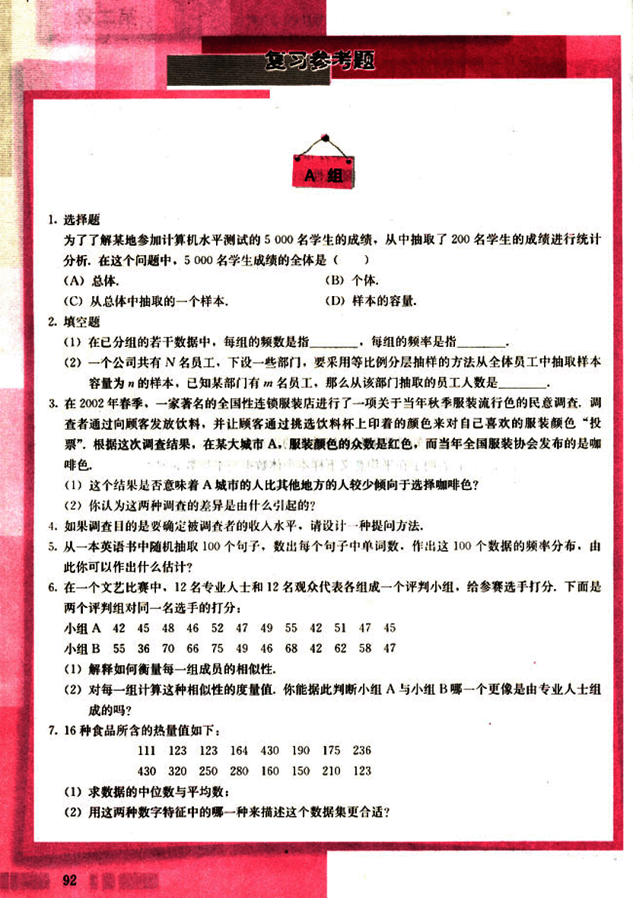
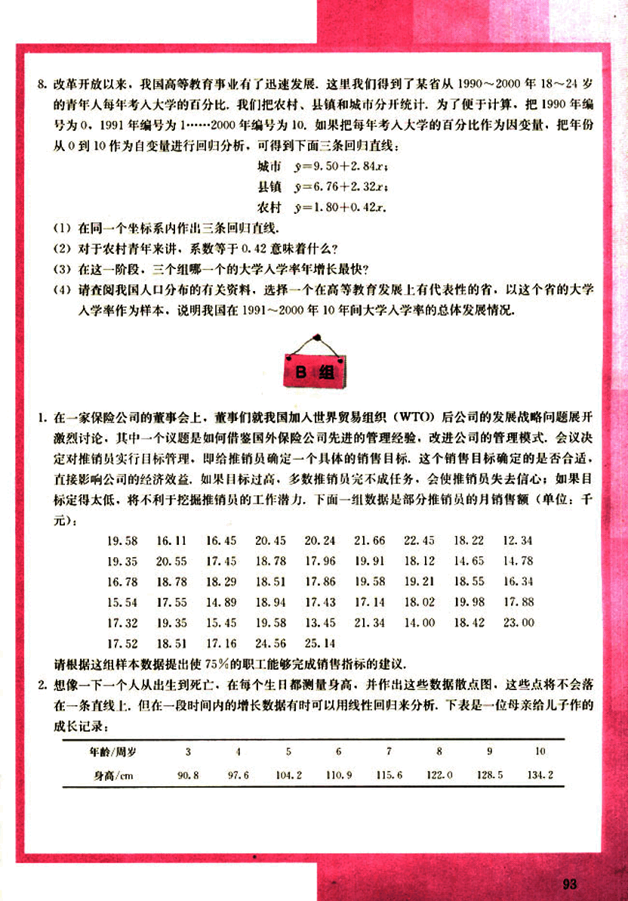
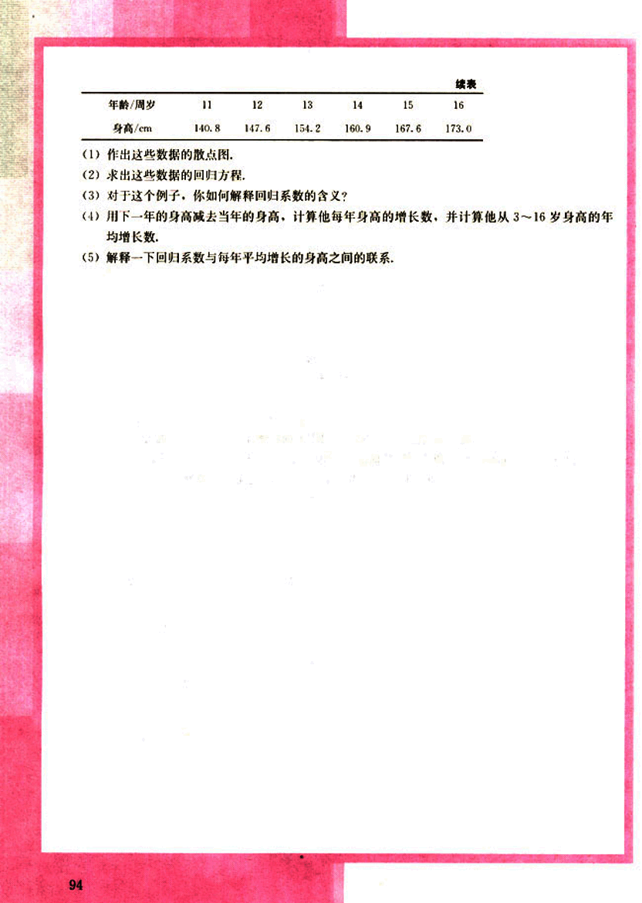

# 复习参考题

104

# 复习参考题

## A组

1. **选择题**

为了了解某地参加计算机水平测试的 5000 名学生的成绩，从中抽取了 200 名学生的成绩进行统计分析。在这个问题中，5000 名学生成绩的全体是 ( )

(A) 总体.
(C) 从总体中抽取的一个样本.

(B) 个体.
(D) 样本的容量.

2. **填空题**

(1) 在已分组的若干数据中，每组的频数是指 ______，每组的频率是指 ______。

(2) 一个公司共有名员工，下设一些部门，要采用等比例分层抽样的方法从全体员工中抽取样本容量为 $n$ 的样本，已知某部门有名员工，那么从该部门抽取的员工人数是 ______。

3. 在 2002 年春季，一家著名的全国性连锁服装店进行了一项关于当年秋季服装流行色的民意调查，调查者通过向顾客发放饮料，并让顾客通过挑选饮料杯上印着的颜色来对自己喜欢的服装颜色“投票”，根据这次调查结果，在某大城市 A，服装颜色的众数是红色，而当年全国服装协会发布的是咖啡色。

(1) 这个结果是否意味着 A 城市的人比其他地方的人较少倾向于选择咖啡色？

(2) 你认为这两种调查的差异是由什么引起的？

4. 如果调查目的是要确定被调查者的收入水平，请设计一种提问方法。

5. 从一本英语书中随机抽取 100 个句子，数出每个句子中单词数，作出这 100 个数据的频率分布，由此你可以作出什么估计？

6. 在一个文艺比赛中，12 名专业人士和 12 名观众代表各组成一个评判小组，给参赛选手打分，下面是两个评判组对同一名选手的打分：

小组 A | 42 | 45 | 48 | 46 | 52 | 47 | 49 | 55 | 42 | 51 | 47 | 45
---|---|---|---|---|---|---|---|---|---|---|---|
小组 B | 55 | 36 | 70 | 66 | 75 | 49 | 46 | 68 | 42 | 62 | 58 | 47

(1) 解释如何衡量每一组成员的相似性。

(2) 对每一组计算这种相似性的度量值，你能据此判断小组 A 与小组 B 哪一个更像是由专业人士组成的吗？

7. 16 种食品所含的热量值如下：

111 | 123 | 123 | 164 | 430 | 190 | 175 | 236
---|---|---|---|---|---|---|
430 | 320 | 250 | 280 | 160 | 150 | 210 | 123

(1) 求数据的<u>中位数</u>与<u>平均数</u>：

(2) 用这两种数字特征中的哪一种来描述这个数据集更合适？

92

105

# 某省1990-2000年18-24岁青年人大学入学率分析

8.改革开放以来，我国高等教育事业有了迅速发展，这里我们得到了某省从1990～2000年18～24岁的青年人每年考入大学的百分比，我们把农村、县镇和城市分开统计，为了便于计算，把1990年编号为0，1991年编号为1……2000年编号为10。如果把每年考入大学的百分比作为因变量，把年份从0到10作为自变量进行回归分析，可得到下面三条回归直线：

城市  $y = 9.50 + 2.84x$;

县镇  $y = 6.76 + 2.32x$;

农村  $y = 1.80 + 0.42x$.

(1) 在同一个坐标系内作出三条回归直线；

(2) 对于农村青年来讲，系数等于0.42意味着什么？

(3) 在这一阶段，三个组哪一个的大学入学率年增长最快？

(4) 请查阅我国人口分布的有关资料，选择一个在高等教育发展上有代表性的省，以这个省的大学入学率作为样本，说明我国在1991～2000年10年间大学入学率的总体发展情况。

# 保险公司推销员销售目标设定

1. 在一家保险公司的董事会上，董事们就我国加入世界贸易组织(WTO)后公司的发展战略问题展开激烈讨论，其中一个议题是如何借鉴国外保险公司先进的管理经验，改进公司的管理模式，会议决定对推销员实行目标管理，即给推销员确定一个具体的销售目标，这个销售目标确定的是否合适，直接影响公司的经济效益，如果目标过高，多数推销员完不成任务，会使推销员失去信心；如果目标定得太低，将不利于挖掘推销员的工作潜力，下面一组数据是部分推销员的月销售额(单位：千元)：

| 19.58 | 16.11 | 16.45 | 20.45 | 20.24 | 21.66 | 22.45 | 18.22 | 12.34 |
|---|---|---|---|---|---|---|---|---|
| 19.35 | 20.55 | 17.45 | 18.78 | 17.96 | 19.91 | 18.12 | 14.65 | 14.78 |
| 16.78 | 18.78 | 18.29 | 18.51 | 17.86 | 19.58 | 19.21 | 18.55 | 16.34 |
| 15.54 | 17.55 | 14.89 | 18.94 | 17.43 | 17.14 | 18.02 | 19.98 | 17.88 |
| 17.32 | 19.35 | 15.45 | 19.58 | 13.45 | 21.34 | 14.00 | 18.42 | 23.00 |
| 17.52 | 18.51 | 17.16 | 24.56 | 25.14 |  |  |  |  |

请根据这组样本数据提出使75%的职工能够完成销售指标的建议。

# 儿童身高增长记录及线性回归分析

2. 想象一下一个人从出生到死亡，在每个生日都测量身高，并作出这些数据散点图，这些点将不会落在一条直线上，但在一段时间内的增长数据有时可以用线性回归来分析，下表是一位母亲给儿子作的成长记录：

| 年龄/周岁 | 3 | 4 | 5 | 6 | 7 | 8 | 9 | 10 |
|---|---|---|---|---|---|---|---|---|
| 身高/cm | 90.8 | 97.6 | 104.2 | 110.9 | 115.6 | 122.0 | 128.5 | 134.2 |

93

106

# 续表

| 年齡/周岁 | 11 | 12 | 13 | 14 | 15 | 16 |
|---|---|---|---|---|---|---|
| 身高/cm | 140.8 | 147.6 | 154.2 | 160.9 | 167.6 | 173.0 |

(1) 作出这些数据的散点图。

(2) 求出这些数据的回归方程。

(3) 对于这个例子，你如何解释回归系数的含义？

(4) 用下一年的身高减去当年的身高，计算他每年身高的增长数，并计算他从 3～16 岁身高的年均增长数。

(5) 解释一下回归系数与每年平均增长的身高之间的联系。

