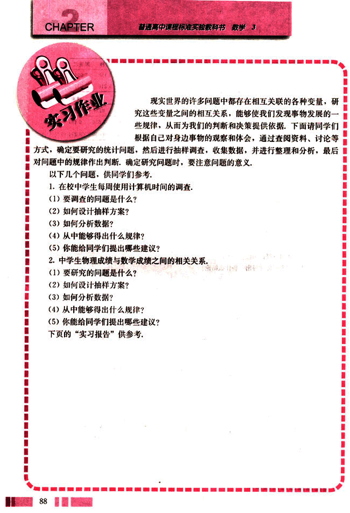
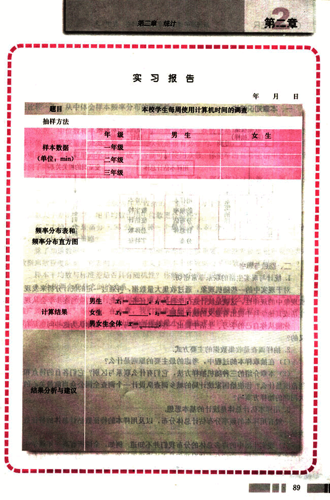

# 实习作业

100

# CHAPTER 2

## 实习作业

现实世界的许多问题中都存在相互关联的各种变量，研究这些变量之间的相互关系，能够使我们发现事物发展的一些规律，从而为我们的判断和决策提供依据。下面请同学们根据自己对身边事物的观察和体会，通过查阅资料、讨论等方式，确定要研究的统计问题，然后进行抽样调查，收集数据，并进行整理和分析，最后对问题中的规律作出判断。确定研究问题时，要注意问题的意义。

以下几个问题，供同学们参考：

1. 在校中学生每周使用计算机时间的调查。
    (1) 要调查的问题是什么？
    (2) 如何设计抽样方案？
    (3) 如何分析数据？
    (4) 从中能够得出什么规律？
    (5) 你能给同学们提出哪些建议？

2. 中学生物理成绩与数学成绩之间的相关关系。
    (1) 要研究的问题是什么？
    (2) 如何设计抽样方案？
    (3) 如何分析数据？
    (4) 从中能够得出什么规律？
    (5) 你能给同学们提出哪些建议？

下页的“实习报告”供参考。

101

# 实习报告

年月日

## 题目

从中学生每周使用计算机时间的调查

## 抽样方法

## 样本数据 (单位: min)

| 年级 | 男生 | 女生 |
|---|---|---|
| 一 年级 |  |  |
| 二 年级 |  |  |
| 三 年级 |  |  |

## 频率分布表和频率分布直方图

(此处为图片或图表，无法转换为markdown)

## 计算结果

**男生:**  $\overline{x}=$_____, $s=$_____

**女生:**  $\overline{x}=$_____, $s=$_____

**男生女生全体:** $\overline{x}=$_____, $s=$_____

## 结果分析与建议

(此处为文字描述，无法转换为markdown)

89

