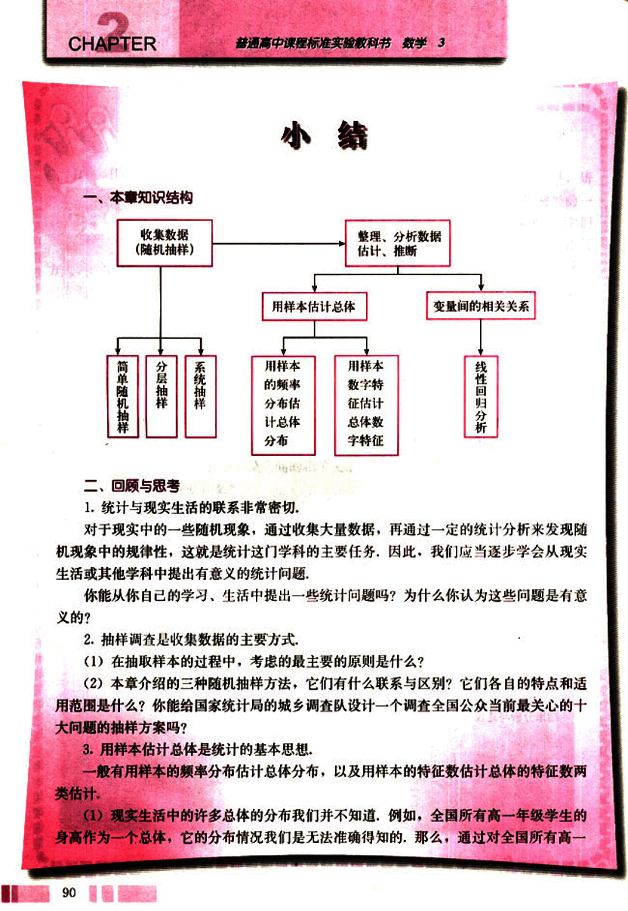
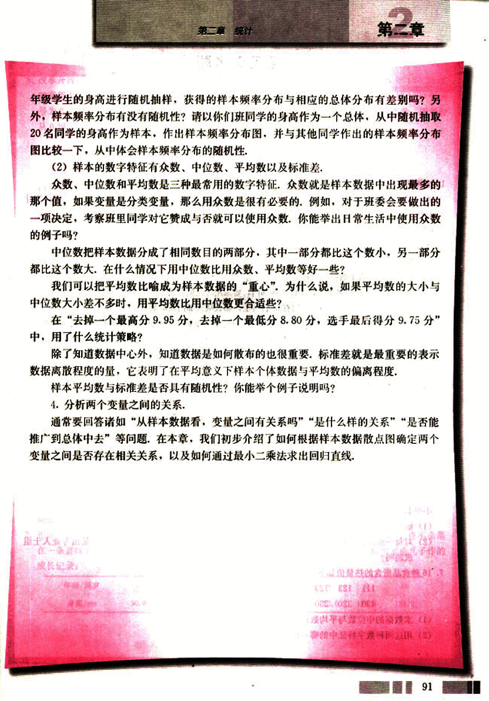

# 小结

102

# CHAPTER 2

## 小结

### 一、本章知识结构

[diagram](images/diagram.png)

### 二、回顾与思考

1. 统计与现实生活的联系非常密切。对于现实中的一些随机现象，通过收集大量数据，再通过一定的统计分析来发现随机现象中的规律性，这就是统计这门学科的主要任务。因此，我们应当逐步学会从现实生活或其他学科中提出有意义的统计问题。

你能从你自己的学习、生活中提出一些统计问题吗？为什么你认为这些问题是有意义的？

2. 抽样调查是收集数据的主要方式。

(1) 在抽取样本的过程中，考虑的最主要的原则是什么？

(2) 本章介绍的三种随机抽样方法，它们有什么联系与区别？它们各自的特点和适用范围是什么？你能给国家统计局的城乡调查队设计一个调查全国公众当前最关心的十大问题的抽样方案吗？

3. 用样本估计总体是统计的基本思想。

一般有用样本的频率分布估计总体分布，以及用样本的特征数估计总体的特征数两类估计。

(1) 现实生活中的许多总体的分布我们并不知道，例如，全国所有高一年级学生的身高作为一个总体，它的分布情况我们是无法准确得知的。那么，通过对全国所有高一

90

103

# 第二章 统计

## 第二章

年级学生的身高进行随机抽样，获得的样本频率分布与相应的总体分布有差别吗？另外，样本频率分布有没有随机性？请以你们班同学的身高作为一个总体，从中随机抽取20名同学的身高作为样本，作出样本频率分布图，并与其他同学作出的样本频率分布图比较一下，从中体会样本频率分布的随机性。

(2) 样本的数字特征有众数、中位数、平均数以及标准差。

众数、中位数和平均数是三种最常用的数字特征。众数就是样本数据中出现最多的那个值，如果变量是分类变量，那么用众数是很有必要的。例如，对于班委会要做出的—项决定，考察班里同学对它赞成与否就可以使用众数。你能举出日常生活中使用众数的例子吗？

中位数把样本数据分成了相同数目的两部分，其中一部分都比这个数小，另一部分都比这个数大。在什么情况下用中位数比用众数、平均数等好一些？

我们可以把平均数比喻成为样本数据的“重心”，为什么说，如果平均数的大小与中位数大小差不多时，用平均数比用中位数更合适些？

在“去掉一个最高分9.95分，去掉一个最低分8.80分，选手最后得分9.75分”中，用了什么统计策略？

除了知道数据中心外，知道数据是如何散布的也很重要。标准差就是最重要的表示数据离散程度的量，它表明了在平均意义下样本个体数据与平均数的偏离程度。

样本平均数与标准差是否具有随机性？你能举个例子说明吗？

4. 分析两个变量之间的关系。

通常要回答诸如“从样本数据看，变量之间有关系吗？”“是什么样的关系？”“是否能推广到总体中去”等问题。在本章，我们初步介绍了如何根据样本数据散点图确定两个变量之间是否存在相关关系，以及如何通过最小二乘法求出回归直线。

91

