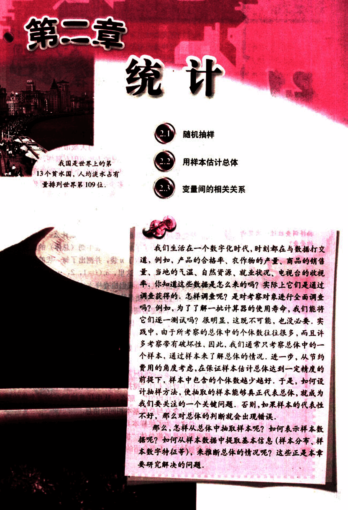

# 第2章　统计

54

# 2

##  缺水量 / 108m3

| 上海 | 广州 | 南京 | 北京 | 武汉 | 天津 | 成都 | 沈阳 | 哈尔滨 |
|---|---|---|---|---|---|---|---|---|
| 27 | 14 | 10 | 8 | 8 | 7 | 6 | 5 | 5 |

我国土地沙漠化问题非常严重，全国沙漠化土地总面积已超过 1.74 × 104 km2，并以每年约为 3.4 × 103 km2 的速度扩张。

你知道这些数据是怎么来的吗？

55

# 第二章 统计

我国是世界上的第13个贫水国，人均淡水占有量排列世界第109位：

## 2.1 随机抽样

## 2.2 用样本估计总体

## 2.3 变量间的相关关系

我们生活在一个数字化时代，时刻都在与数据打交道，例如，产品的合格率、农作物的产量、商品的销售量、当地的气温、自然资源、就业状况、电视台的收视率，你知道这些数据是怎么来的吗？实际上它们是通过调查获得的，怎样调查呢？是对考察对象进行全面调查吗？例如，为了了解一批计算器的使用寿命，我们能将它们逐一测试吗？很明显，这既不可能，也没必要，实践中，由于所考察的总体中的个体数往往很多，而且许多考察带有破坏性，因此，我们通常只考察总体中的一个样本，通过样本来了解总体的情况，进一步，从节约费用的角度考虑，在保证样本估计总体达到一定精度的前提下，样本中包含的个体数越少越好，于是，如何设计抽样方法，使抽取的样本能够真正代表总体，就成为我们要关注的一个关键问题，否则，如果样本的代表性不好，那么对总体的判断就会出现错误。

那么，怎样从总体中抽取样本呢？如何表示样本数据呢？如何从样本数据中提取基本信息（样本分布、样本数字特征等），来推断总体的情况呢？这些正是本章要研究解决的问题。

