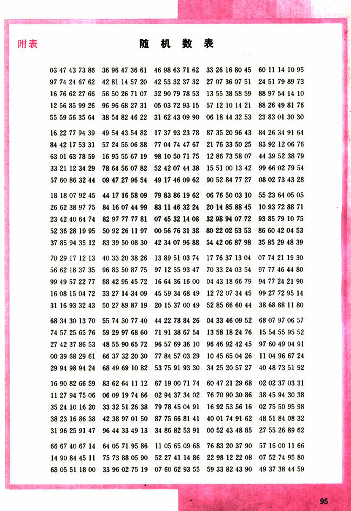
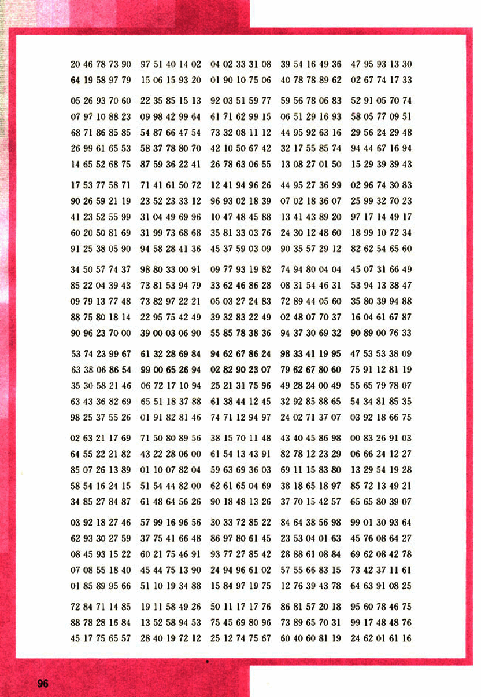
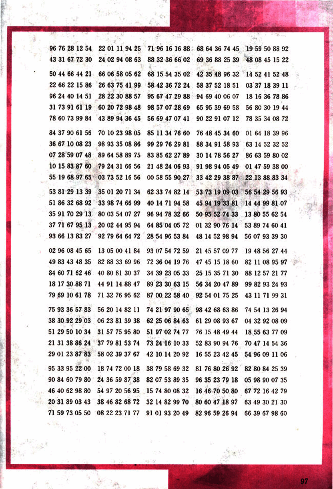

# 随机数表

107

# 附表

## 随机数表

| 03 | 47 | 43 | 73 | 86 | 36 | 96 | 47 | 36 | 61 | 46 | 98 | 63 | 71 | 62 | 33 | 26 | 16 | 80 | 45 | 60 | 11 | 14 | 10 | 95 |
|---|---|---|---|---|---|---|---|---|---|---|---|---|---|---|---|---|---|---|---|---|---|---|---|---|
| 97 | 74 | 24 | 67 | 62 | 42 | 81 | 14 | 57 | 20 | 42 | 53 | 32 | 37 | 32 | 27 | 07 | 36 | 07 | 51 | 24 | 51 | 79 | 89 | 73 |
| 16 | 76 | 62 | 27 | 66 | 56 | 50 | 26 | 71 | 07 | 32 | 90 | 79 | 78 | 53 | 13 | 55 | 38 | 58 | 59 | 88 | 97 | 54 | 14 | 10 |
| 12 | 56 | 85 | 99 | 26 | 96 | 96 | 68 | 27 | 31 | 05 | 03 | 72 | 93 | 15 | 57 | 12 | 10 | 14 | 21 | 88 | 26 | 49 | 81 | 76 |
| 55 | 59 | 56 | 35 | 64 | 38 | 54 | 82 | 46 | 22 | 31 | 62 | 43 | 09 | 90 | 06 | 18 | 44 | 32 | 53 | 23 | 83 | 01 | 30 | 30 |
| 16 | 22 | 77 | 94 | 39 | 49 | 54 | 43 | 54 | 82 | 17 | 37 | 93 | 23 | 78 | 87 | 35 | 20 | 96 | 43 | 84 | 26 | 34 | 91 | 64 |
| 84 | 42 | 17 | 53 | 31 | 57 | 24 | 55 | 06 | 88 | 77 | 04 | 74 | 47 | 67 | 21 | 76 | 33 | 50 | 25 | 83 | 92 | 12 | 06 | 76 |
| 63 | 01 | 63 | 78 | 59 | 16 | 95 | 55 | 67 | 19 | 98 | 10 | 50 | 71 | 75 | 12 | 86 | 73 | 58 | 07 | 44 | 39 | 52 | 38 | 79 |
| 33 | 21 | 12 | 34 | 29 | 78 | 64 | 56 | 07 | 82 | 52 | 42 | 07 | 44 | 38 | 15 | 51 | 00 | 13 | 42 | 99 | 66 | 02 | 79 | 54 |
| 57 | 60 | 86 | 32 | 44 | 09 | 47 | 27 | 96 | 54 | 49 | 17 | 46 | 09 | 62 | 90 | 52 | 84 | 77 | 27 | 08 | 02 | 73 | 43 | 28 |
| 18 | 18 | 07 | 92 | 45 | 44 | 17 | 16 | 58 | 09 | 79 | 83 | 86 | 19 | 62 | 06 | 76 | 50 | 03 | 10 | 55 | 23 | 64 | 05 | 05 |
| 26 | 62 | 38 | 97 | 75 | 84 | 16 | 07 | 44 | 99 | 83 | 11 | 46 | 32 | 24 | 20 | 14 | 85 | 88 | 45 | 10 | 93 | 72 | 88 | 71 |
| 23 | 42 | 40 | 64 | 74 | 82 | 97 | 77 | 77 | 81 | 07 | 45 | 32 | 14 | 08 | 32 | 98 | 94 | 07 | 72 | 93 | 85 | 79 | 10 | 75 |
| 52 | 36 | 28 | 19 | 95 | 50 | 92 | 26 | 11 | 97 | 00 | 56 | 76 | 31 | 38 | 80 | 22 | 02 | 53 | 53 | 86 | 60 | 42 | 04 | 53 |
| 37 | 85 | 94 | 35 | 12 | 83 | 39 | 50 | 08 | 30 | 42 | 34 | 07 | 96 | 88 | 54 | 42 | 06 | 87 | 98 | 35 | 85 | 29 | 48 | 39 |
| 70 | 29 | 17 | 12 | 13 | 40 | 33 | 20 | 38 | 26 | 13 | 89 | 51 | 03 | 74 | 17 | 76 | 37 | 13 | 04 | 07 | 77 | 21 | 19 | 30 |
| 56 | 62 | 18 | 37 | 35 | 86 | 96 | 83 | 50 | 87 | 97 | 12 | 55 | 93 | 47 | 70 | 33 | 24 | 03 | 54 | 97 | 74 | 46 | 44 | 80 |
| 99 | 49 | 57 | 22 | 77 | 88 | 42 | 95 | 45 | 72 | 16 | 64 | 36 | 16 | 00 | 04 | 43 | 18 | 66 | 79 | 94 | 77 | 24 | 21 | 90 |
| 16 | 08 | 15 | 04 | 72 | 33 | 27 | 14 | 34 | 09 | 45 | 59 | 34 | 68 | 49 | 12 | 72 | 07 | 34 | 45 | 99 | 27 | 72 | 95 | 14 |
| 31 | 16 | 93 | 32 | 43 | 50 | 27 | 89 | 87 | 19 | 20 | 15 | 37 | 00 | 49 | 52 | 85 | 66 | 60 | 44 | 38 | 68 | 88 | 11 | 80 |
| 68 | 34 | 30 | 13 | 70 | 55 | 74 | 30 | 77 | 40 | 44 | 22 | 78 | 84 | 26 | 04 | 33 | 46 | 09 | 52 | 68 | 07 | 97 | 06 | 57 |
| 74 | 57 | 25 | 65 | 76 | 59 | 29 | 97 | 68 | 60 | 71 | 91 | 38 | 67 | 54 | 13 | 58 | 18 | 24 | 76 | 15 | 54 | 55 | 95 | 52 |
| 27 | 42 | 37 | 86 | 53 | 48 | 55 | 90 | 65 | 72 | 96 | 57 | 69 | 36 | 10 | 96 | 46 | 92 | 42 | 45 | 97 | 60 | 49 | 04 | 91 |
| 00 | 39 | 68 | 29 | 61 | 66 | 37 | 32 | 20 | 30 | 77 | 84 | 57 | 03 | 29 | 10 | 45 | 65 | 04 | 26 | 11 | 04 | 96 | 67 | 24 |
| 29 | 94 | 98 | 94 | 24 | 68 | 49 | 69 | 10 | 82 | 53 | 75 | 91 | 93 | 30 | 34 | 25 | 20 | 57 | 27 | 40 | 48 | 73 | 51 | 92 |
| 16 | 90 | 82 | 66 | 59 | 83 | 62 | 64 | 11 | 12 | 67 | 19 | 00 | 71 | 74 | 60 | 47 | 21 | 29 | 68 | 02 | 02 | 37 | 03 | 31 |
| 11 | 27 | 94 | 75 | 06 | 06 | 09 | 19 | 74 | 66 | 02 | 94 | 37 | 34 | 02 | 76 | 70 | 90 | 30 | 86 | 16 | 92 | 53 | 56 | 16 |
| 35 | 24 | 10 | 16 | 20 | 33 | 32 | 51 | 26 | 38 | 79 | 78 | 45 | 04 | 91 | 16 | 92 | 53 | 56 | 16 | 38 | 45 | 94 | 30 | 38 |
| 38 | 23 | 16 | 86 | 38 | 42 | 38 | 97 | 01 | 50 | 87 | 75 | 66 | 81 | 41 | 40 | 01 | 74 | 91 | 62 | 48 | 51 | 84 | 08 | 32 |
| 31 | 96 | 25 | 91 | 47 | 96 | 44 | 33 | 49 | 13 | 34 | 86 | 82 | 53 | 91 | 00 | 52 | 43 | 48 | 85 | 27 | 55 | 26 | 89 | 62 |
| 66 | 67 | 40 | 67 | 14 | 64 | 05 | 71 | 95 | 86 | 11 | 05 | 65 | 09 | 68 | 76 | 83 | 20 | 37 | 90 | 57 | 16 | 00 | 11 | 66 |
| 14 | 90 | 84 | 45 | 11 | 75 | 73 | 88 | 05 | 90 | 52 | 27 | 41 | 14 | 86 | 22 | 98 | 12 | 22 | 08 | 07 | 52 | 74 | 95 | 80 |
| 68 | 05 | 51 | 18 | 00 | 33 | 96 | 02 | 75 | 19 | 07 | 60 | 62 | 93 | 55 | 59 | 33 | 82 | 43 | 90 | 49 | 37 | 38 | 44 | 59 |

95

108

# Untitled

20 46 78 73 90  97 51 40 14 02  04 02 33 31 08  39 54 16 49 36  47 95 93 13 30
64 19 58 97 79  15 06 15 93 20  01 90 10 75 06  40 78 78 89 62  02 67 74 17 33
05 26 93 70 60  22 35 85 15 13  92 03 51 59 77  59 56 29 16 93  52 91 05 70 74
07 97 10 88 23  09 98 42 99 64  61 71 62 99 15  06 51 29 16 93  58 05 77 09 51
68 71 86 85 85  54 87 66 47 54  73 32 08 11 12  44 95 92 63 16  29 56 24 29 48
26 99 61 65 53  58 37 78 80 70  42 10 50 67 42  32 17 55 85 74  94 44 67 16 94
14 65 52 68 75  87 59 36 22 41  26 78 63 06 55  13 08 27 01 50  15 29 39 39 43
17 53 77 58 71  71 41 61 50 72  12 41 94 96 26  44 95 27 36 99  02 96 74 30 83
90 26 59 21 19  23 52 23 33 12  96 93 02 18 39  07 02 18 36 07  25 99 32 70 23
41 23 52 55 99  31 04 49 69 96  10 47 48 45 88  13 41 43 89 20  97 17 14 49 17
60 20 50 81 69  31 99 73 68 68  35 81 33 03 76  24 30 12 48 60  18 99 10 72 34
91 25 38 05 90  94 58 28 41 36  45 37 59 03 09  90 35 57 29 12  82 62 54 65 60
34 50 57 74 37  98 80 33 00 91  09 77 93 19 82  74 94 80 04 04  45 07 31 66 49
85 22 04 39 43  73 81 53 94 79  33 62 46 86 28  08 31 54 46 31  53 94 13 38 47
09 79 13 77 48  73 82 97 22 21  05 03 27 24 83  72 89 44 05 60  35 80 39 94 88
88 75 80 18 14  22 95 75 42 49  39 32 83 22 49  02 48 07 70 37  16 04 61 67 87
90 96 23 70 00  39 00 03 06 90  55 85 78 38 36  94 37 30 69 32  90 89 00 76 33
53 74 23 99 67  61 32 28 69 84  94 62 67 86 24  98 33 41 19 95  47 53 53 38 09
35 30 58 21 46  06 72 17 10 94  02 82 90 23 07  79 62 67 80 60  75 91 12 81 19
63 43 36 82 69  65 51 18 37 88  25 21 31 75 96  49 28 24 00 49  55 65 79 78 07
98 25 37 55 26  01 91 82 81 46  61 38 44 12 45  32 92 85 88 65  54 34 81 85 35
02 63 21 17 69  71 50 80 89 56  38 15 70 11 48  43 40 45 86 98  00 83 26 91 03
64 55 22 21 82  43 22 28 06 00  61 54 13 43 91  82 78 12 23 29  06 66 24 12 27
85 07 26 13 89  01 10 07 82 04  59 63 69 36 03  69 11 15 83 80  13 29 54 19 28
58 54 16 24 15  51 54 44 82 00  62 61 65 04 69  38 18 65 18 97  85 72 13 49 21
34 85 27 84 87  61 48 64 56 26  90 18 48 13 26  37 70 15 42 57  65 65 80 39 07
03 92 18 27 46  57 99 16 96 56  30 33 72 85 22  84 64 38 56 98  99 01 30 93 64
62 93 30 27 59  37 75 41 66 48  86 97 80 61 45  23 53 04 01 63  45 76 08 64 27
08 45 93 15 22  60 21 75 46 91  93 77 27 85 42  28 88 61 08 84  69 62 08 42 78
07 08 55 18 40  45 44 75 13 90  24 94 96 61 02  57 55 66 83 15  73 42 37 11 61
01 85 89 95 66  51 10 19 34 88  15 84 97 19 75  12 76 39 43 78  64 63 91 08 25
72 84 71 14 85  19 11 58 49 26  50 11 17 17 76  86 81 57 20 18  95 60 78 46 75
88 78 28 16 84  13 52 58 94 53  75 45 69 80 96  73 89 65 70 31  99 17 48 48 76
45 17 75 65 57  28 40 19 72 12  25 12 74 75 67  60 40 60 81 19  24 62 01 61 16

109

# Untitled

96 76 28 12 54  22 01 11 94 25  71 96 16 16 88  68 64 36 74 45  19 59 50 88 92
43 31 67 72 30  24 02 94 08 63  88 32 36 66 02  69 36 88 25 39  48 08 45 15 22
50 44 66 44 21  66 06 58 05 62  68 15 54 35 02  42 35 48 96 32  14 52 41 52 48
22 66 22 15 86  26 63 75 41 99  58 42 36 72 24  58 37 52 18 51  03 37 18 39 11
96 24 40 14 51  28 22 30 88 57  95 67 47 29 88  94 69 40 06 07  18 16 36 78 86
31 73 91 61 19  60 20 72 98 48  98 57 07 28 69  65 95 39 69 58  56 80 30 19 44
78 60 73 99 84  43 89 94 36 45  56 69 47 07 41  90 22 91 07 12  78 35 34 08 72
84 37 90 61 56  70 10 23 98 05  85 11 34 76 60  76 48 45 34 60  01 64 18 39 96
36 67 10 08 23  98 93 35 08 86  99 29 76 29 81  88 34 91 58 93  63 14 52 32 52
07 28 59 07 48  89 64 58 89 75  83 85 62 27 89  30 14 78 56 27  86 63 59 80 02
10 15 83 87 60  79 24 31 66 56  21 48 24 06 93  91 98 94 05 49  01 47 59 38 00
55 19 68 97 65  03 73 52 16 56  00 58 55 90 27  33 42 29 38 87  22 13 88 83 34
53 81 29 13 39  35 01 20 71 34  62 33 74 82 14  53 73 19 09 03  56 54 29 56 93
51 86 32 68 92  33 98 74 66 99  40 14 71 94 58  45 94 19 33 81  14 44 99 81 07
35 91 70 29 13  80 03 54 07 27  96 94 78 32 66  50 95 52 74 33  13 80 55 62 54
37 71 67 95 13  20 02 44 95 94  64 85 04 05 72  01 32 90 76 14  53 89 74 60 41
93 66 13 83 27  92 79 64 64 72  28 54 96 53 84  48 14 52 98 94  56 07 93 39 30
02 96 08 45 65  13 05 00 41 84  93 07 54 72 59  21 45 57 09 77  19 48 56 27 44
49 83 43 48 35  82 88 33 69 96  72 36 04 19 76  47 45 15 18 60  82 11 08 95 97
84 60 71 62 46  40 80 81 30 37  34 39 23 05 33  25 15 35 71 30  88 12 57 21 77
18 17 30 88 71  44 91 14 88 47  89 23 30 63 15  56 34 20 47 89  99 82 93 24 93
79 69 10 61 78  71 32 76 95 62  87 00 22 58 40  92 54 01 75 25  43 11 71 99 31
75 93 36 57 83  56 20 14 82 11  74 21 97 90 65  98 42 68 63 86  74 54 13 26 94
38 30 92 29 03  06 23 81 39 38  62 25 06 84 63  61 29 08 93 67  04 32 92 08 09
51 29 50 10 34  31 57 75 95 80  51 97 02 74 77  76 15 48 49 44  18 55 63 77 09
21 31 38 86 24  37 79 81 53 74  73 24 16 10 33  52 83 90 94 76  70 47 14 54 36
29 01 23 87 83  58 02 39 37 67  42 10 14 20 92  16 55 23 42 45  54 96 09 11 06
95 33 95 22 00  18 74 72 00 18  38 79 58 69 32  81 76 80 26 92  82 80 84 25 39
90 84 60 79 80  24 36 59 87 38  82 07 53 89 35  96 35 23 79 18  05 98 90 07 35
46 40 62 98 80  54 97 20 56 95  15 74 80 08 32  16 46 70 50 80  67 72 16 42 79
20 31 89 03 43  38 46 82 68 72  32 14 82 99 70  80 60 47 18 97  63 49 30 21 30
71 59 73 05 50  08 22 23 71 77  91 01 93 20 49  82 96 59 26 94  66 39 67 98 60

97

