# 3.1　随机事件的概率

112

# CHAPTER 3

## 3.1 随机事件的概率

### 3.1.1 随机事件的概率

日常生活中，有些问题是很难给予准确无误的回答的。例如，你明天什么时间起床？7：20在某公共汽车站候车的人有多少？12：10在学校食堂用餐的人有多少？你购买的本期福利彩票是否能中奖？等等，显然，这些问题的结果都是不确定的、偶然的，很难给予准确的回答。

客观世界中，有些事情的发生是偶然的，有些事情的发生是必然的，而且偶然与必然之间往往有某种内在联系，例如，北京地区一年四季的变化有着确定的、必然的规律，但是北京地区一年里哪一天最热，哪一天最冷，哪一天降雨量最大，哪一天降雪量最大等又是不确定的、偶然的，又如，一方面，某种水稻种子发芽后，在一定的条件（温度、水分、土壤、阳光）下，一定会经历分蘖、生长、颖花、结穗、成熟等过程，这个生长规律是确定的；另一方面，在这个过程中，每一粒发芽种子的分蘖数是多少，结穗率是多少，茎秆高是多少，结穗实粒有多少，不实率是多少，粒重又是多少，这些却都是不确定的，农业生产实践告诉我们，在一定的条件S（温度、水分、土壤、阳光）下，发芽种子一定会分蘖，像这种在一定的条件S（温度、水分、土壤、阳光）下，必然会发生的事件（发芽种子的分蘖）称为必然事件。但是，在一定的条件S（温度、水分、土壤、阳光）下，一粒发芽种子会分多少蘖，是1支、2支，还是3支……这些又是无法确定的，像这种在条件S下，不能事先预测结果的事件称为随机事件。另外，“发芽的种子不分蘖”这一事件一定不会发生，像这种在条件S下一定不会发生的事件称为不可能

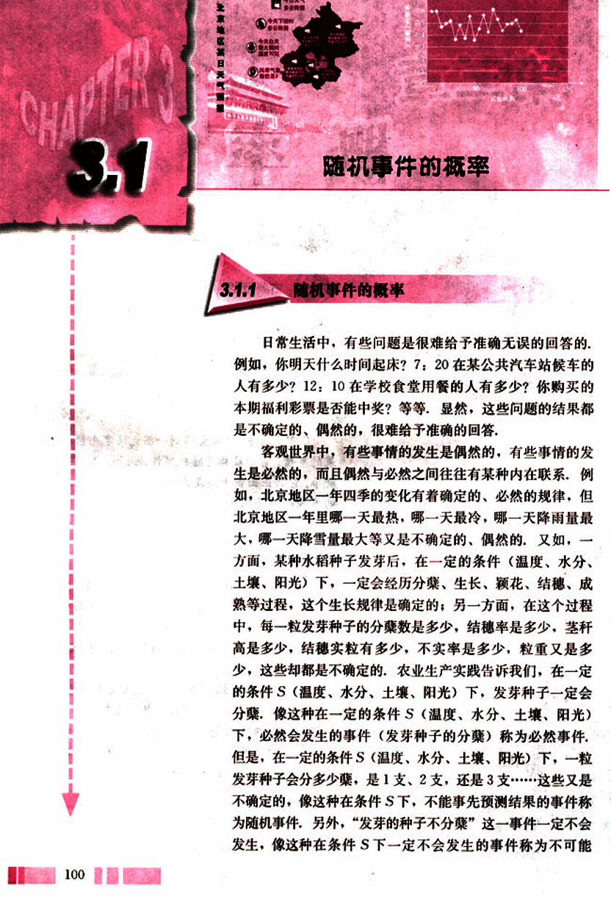
113

# 第三章 概率

## 事件

一般地，我们把在条件 *S* 下，一定会发生的事件，叫做相对于条件 *S* 的**必然事件**(certain event)，简称必然事件；

在条件 *S* 下，一定不会发生的事件，叫做相对于条件 *S* 的**不可能事件**(impossible event)，简称不可能事件；

必然事件与不可能事件统称为相对于条件 *S* 的**确定事件**，简称确定事件；

在条件 *S* 下可能发生也可能不发生的事件，叫做相对于条件 *S* 的**随机事件**(random event)，简称随机事件；

确定事件和随机事件统称为事件，一般用大写字母 A、B、C……表示。

## 思考

你能举出一些现实生活中的随机事件、必然事件、不可能事件的实例吗？

对于随机事件，知道它发生的可能性大小是非常重要的，它能为我们的决策提供关键性的依据，那么，如何才能获得随机事件发生的可能性的大小呢？

要了解随机事件发生的可能性大小，最直接的方法就是试验（观察）。

下面我们来做抛掷一枚硬币的试验，观察它落地时哪个面朝上。

第一步：全班每人各取一枚同样的硬币，做 10 次掷硬币的试验，每人记录下试验结果，填在下表中：

| 姓名 | 试验次数 | 正面朝上的次数 | 正面朝上的比例 |
|---|---|---|---|

与其他同学的试验结果比较，你的结果和他们一致吗？为什么会出现这样的情况？

101

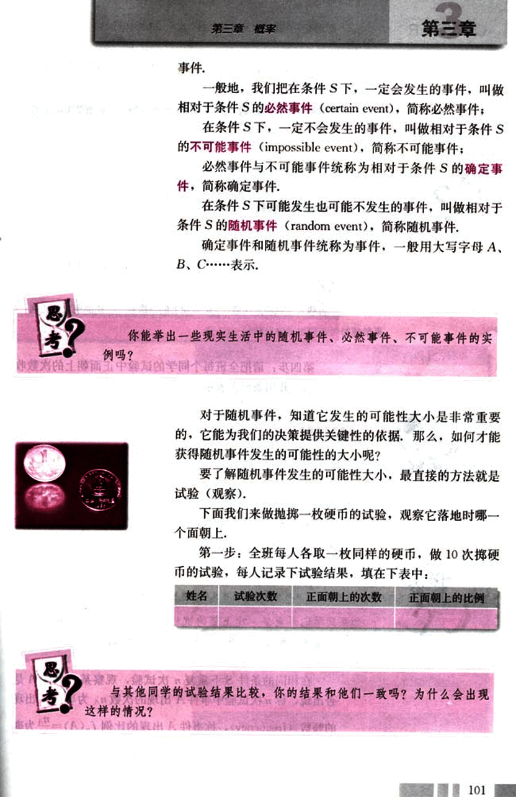
114

# CHAPTER 3

## 第二步：每个小组把本组同学的试验结果统计一下，填入下表：

| 组次 | 试验总次数 | 正面朝上的总次数 | 正面朝上的比例 |
|---|---|---|---|

与其他小组的试验结果比较，各组的结果一致吗？为什么？

## 第三步：请一个同学把全班同学的试验结果统计一下，填入下表：

| 班级 | 试验总次数 | 正面朝上的总次数 | 正面朝上的比例 |
|---|---|---|---|

## 第四步：请把全班每个同学的试验中正面朝上的次数收集起来，并用条形图表示。

这个条形图有什么特点？

## 第五步：请同学们找出掷硬币时“正面朝上”这个事件发生的规律性。

如果同学们再重复一次上面的试验，全班的汇总结果还会和这次的汇总结果一致吗？如果不一致，你能说出原因吗？

在相同的条件S下重复n次试验，观察某一事件A是否出现，称n次试验中事件A出现的次数为事件A出现的频数 (frequency)，称事件A出现的比例 $f(A) = \frac{n_A}{n}$ 为事件A出现的频率 (relative frequency).

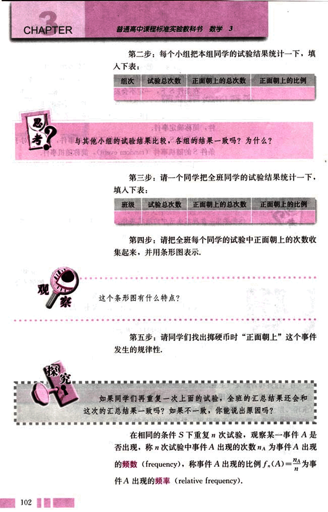
115

# 第三章 概率

## 思考

频率的取值范围是什么？

可以用计算机模拟掷硬币试验，以下是一次计算机模拟掷硬币的试验。

[image](images/image.png)

## 表 3-1  计算机模拟掷硬币的试验结果

| 试验次数 | 正面朝上的频数 | 正面朝上的频率 |
|---|---|---|
| 5 | 4 | 0.8 |
| 10 | 6 | 0.6 |
| 15 | 6 | 0.4 |
| 20 | 14 | 0.7 |
| 25 | 11 | 0.44 |
| 30 | 16 | 0.533 333 |
| 35 | 18 | 0.514 286 |
| 40 | 20 | 0.5 |
| 45 | 20 | 0.444 444 |
| 50 | 20 | 0.4 |
| 55 | 26 | 0.472 727 |
| 60 | 31 | 0.516 667 |
| 65 | 30 | 0.461 538 |
| 70 | 35 | 0.5 |
| 75 | 34 | 0.453 333 |
| 80 | 38 | 0.475 |
| 85 | 43 | 0.505 882 |
| 90 | 46 | 0.511 111 |
| 95 | 56 | 0.589 474 |
| 100 | 53 | 0.53 |

103

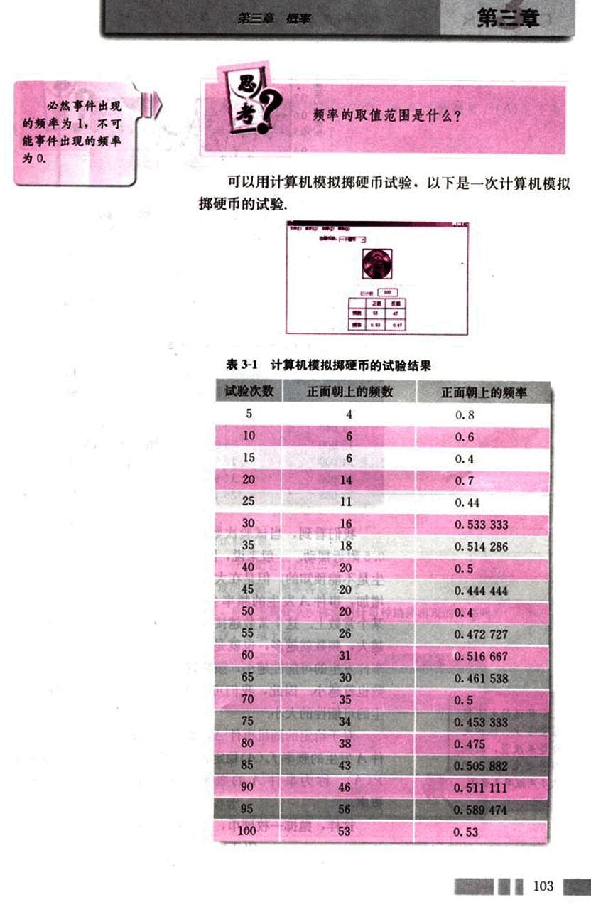
116

# CHAPTER 3

普通高中课程标准实验教科书 数学 3

## 掷硬币的频率图

[image](images/frequency_graph.png)

## 历史上一些掷硬币的试验结果

表 3-2 历史上一些掷硬币的试验结果

| 试验次数 ($n$) | 正面朝上的次数 (频数 $m$) | 正面朝上的频率 ($m/n$) |
|---|---|---|
| 2 048 | 1 061 | 0.518 1 |
| 4 040 | 2 048 | 0.506 9 |
| 12 000 | 6 019 | 0.501 6 |
| 24 000 | 12 012 | 0.500 5 |
| 30 000 | 14 984 | 0.499 6 |
| 72 088 | 36 124 | 0.501 1 |

我们看到，当试验次数很多时，出现正面的频率值在 0.5 附近摆动。一般来说，随机事件 A 在每次试验中是否发生是不能预知的，但是在大量重复试验后，随着试验次数的增加，事件 A 发生的频率会逐渐稳定在区间 $[0, 1]$ 中的某个常数上。这个常数越接近于 1，表明事件 A 发生的频率越大，频数就越多，也就是它发生的可能性越大；反过来，事件 A 发生的可能性越小，频数就越少，频率就越小，这个常数也就越小。因此，我们可以用这个常数来度量事件 A 发生的可能性的大小。

对于给定的随机事件 A，如果随着试验次数的增加，事件 A 发生的频率 $f(A)$ 稳定在某个常数上，把这个常数记作 $P(A)$，称为事件 A 的概率 (probability)，简称为 A 的概率。

这样，抛掷一枚硬币，正面朝上的概率为 0.5，即
$P(\text{正面朝上}) = 0.5$

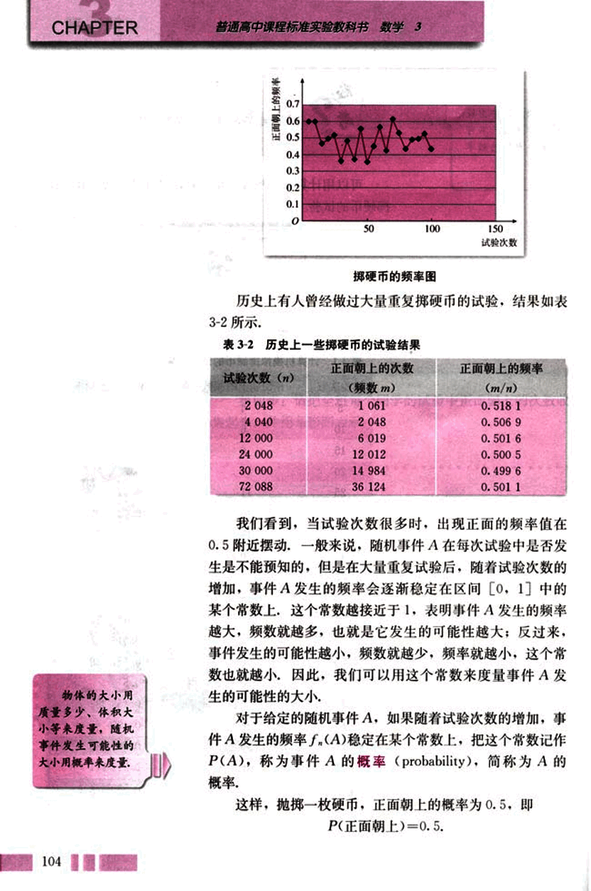
117

# 第三章 概率

## 思考

事件A发生的频率 *f(A)* 是不是不变的？事件A的概率 *P(A)* 是不是不变的？它们之间有什么区别与联系？

## 本章内容

本章中我们研究的是那些在相同条件下可以进行大量重复试验的随机事件，它们都具有频率稳定性。

任何事件的概率是 0~1 之间的一个数，它度量该事件发生的可能性。小概率（接近 0）事件很少发生，而大概率（接近 1）事件则经常发生。例如，对每个人来讲，他买一张体育彩票中特等奖的概率就是小概率事件，他买 10000 张体育彩票至少有一张中奖（中几等奖都算中奖）的概率是很大的。知道随机事件的概率的大小有利于我们做出正确的决策。

## 练习

1. 做同时掷两枚硬币的试验，观察试验结果。

   (1) 试验可能出现的结果有几种？分别把它们表示出来。
   (2) 做 100 次试验，每种结果出现的频数、频率各是多少？与其他几名同学的试验结果汇总，你会发现什么？你能估计每种结果出现的概率吗？

2. 做掷骰子试验，掷一个骰子 100 次，并填下表：

| 试验的总次数 | 频数 | 频率 |
|---|---|---|
| 出现数字 1 | 100 |  |
| 出现数字 5 |  |  |
| 出现的数字小于 7 |  |  |
| 出现的数字大于 7 |  |  |
| 出现的数字为偶数 |  |  |
| 出现的数字为奇数 |  |  |

105

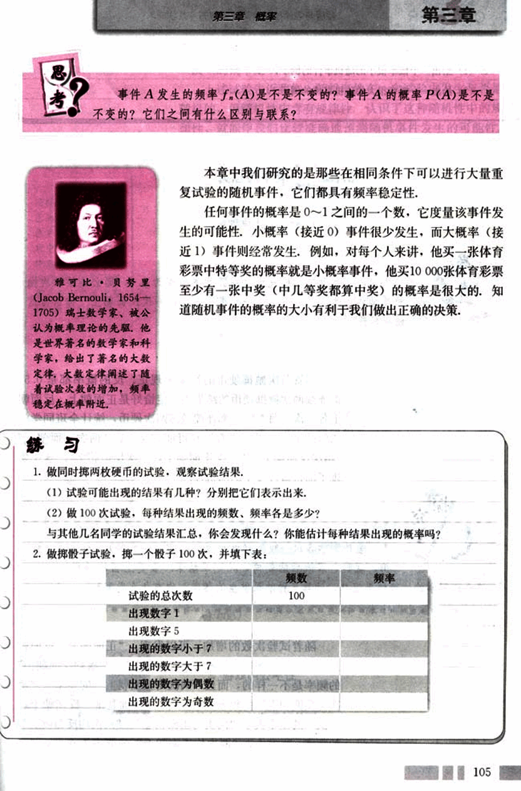
118

# CHAPTER

普通高中课程标准实验教科书 数学 3

3. (1) 给出一个概率很小的随机事件的例子;

(2) 给出一个概率很大的随机事件的例子;

## 3.1.2 概率的意义

1. 概率的正确理解

有人说，既然抛掷一枚硬币出现正面的概率为0.5，那么连续两次抛掷一枚质地均匀的硬币，一定是一次正面朝上，一次反面朝上，你认为这 种想法正确吗？

尽管每次抛掷硬币的结果出现正、反的概率都是 0.5，但连续两次抛掷硬币的结果不一定恰好是正面朝上、反面朝上各一次。每个同学都连续抛掷两次硬币，统计全班同学的试验结果，可以发现有三种可能的结果：“两次正面朝上”、“两次反面朝上”、“一次正面朝上，一次反面朝上”，这正体现了随机事件发生的随机性。

全班同学各取一枚同样的硬币（一角、一元等），连续两次抛掷，观察它落地后的朝向，并记录结果，重复上面的过程 10 次。将全班同学的试验结果汇总，计算三种结果发生的频率，你有什么发现？

随着试验次数的增加，可以发现，“正面朝上、反面朝上各一次”的频率与“两次均正面朝上”、“两次均反面朝上”的频率是不一样的，而且“两次均正面朝上”的频率与“两次均反面朝上”的频率大致相等；“正面朝上、反面朝上各一次”的频率大于“两次均正面朝上”（“两次均反面朝上”）的频率，事实上，“两次均正面朝上”的概率为 0.25，“两

106

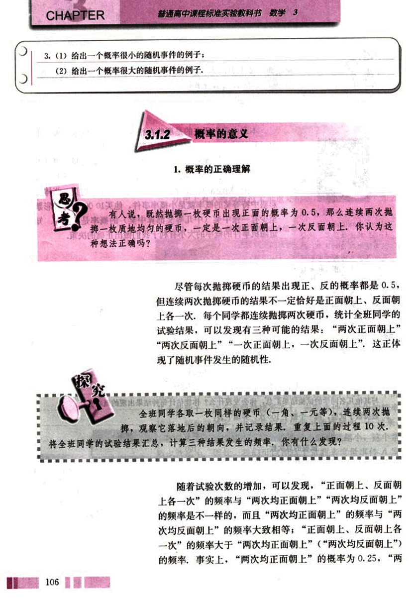
119

# 第三章 概率

## 次均反面朝上”的概率也为0.25，“正面朝上、反面朝上各一次”的概率是0.5.

上述试验告诉我们，随机事件在一次试验中发生与否是随机的，但随机性中含有规律性。认识了这种随机性中的规律性，就能使我们比较准确地预测随机事件发生的可能性。例如，做连续抛掷两枚硬币的试验100次，可以预见：“两个正面朝上”大约出现25次；“两个反面朝上”大约出现25次；“正面朝上、反面朝上各一个”大约出现50次。出现“正面朝上、反面朝上各一个”的机会比出现“两个正面朝上”或“两个反面朝上”的机会大。

## 思考

如果某种彩票的中奖概率为$\frac{1}{1000}$，那么买1000张这种彩票一定能中奖吗？（假设该彩票有足够多的张数。）

有的同学可能认为，中奖概率为$\frac{1}{1000}$，那么买1000张彩票就一定能中奖，但这种想法是不正确的。

实际上，买1000张彩票相当于做1000次试验，因为每次试验的结果都是随机的，所以做1000次的结果也是随机的。这就是说，每张彩票既可能中奖也可能不中奖，因此1000张彩票中可能没有一张中奖，也可能有一张、两张……中奖。

虽然中奖张数是随机的，但这种随机性中具有规律性。随着试验次数的增加，即随着买的彩票张数的增加，大约有$\frac{1}{1000}$的彩票中奖。实际上，买1000张彩票中奖的概率为$1 - (1 - \frac{999}{1000})^{1000} \approx 0.6323$。没有一张中奖也是有可能的，其概率近似为0.367 7.

## 2. 游戏的公平性

在一场乒乓球比赛前，要决定由谁先发球，你注意到裁判是怎样确定发球权的吗？

下面就是常用的一种方法：裁判员拿出一个抽签器，它

107

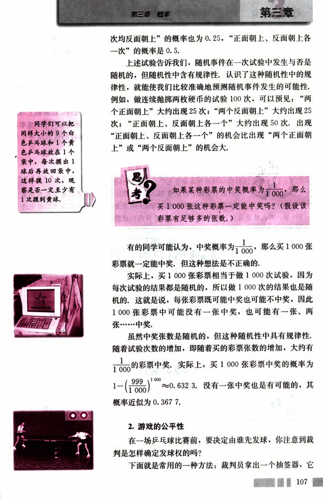
120

# CHAPTER 3

这是一个像大硬币似的均匀塑料圆板，一面是红圈，一面是绿圈，然后随意指定一名运动员，要他猜上抛的抽签器落到球台上时，是红圈那面朝上还是绿圈那面朝上，如果他猜对了，就由他先发球，否则，由另一方先发球。为什么要这样做呢？

这样做体现了公平性，它使得两名运动员的先发球机会是等可能的，用概率的语言描述，就是两个运动员取得发球权的概率都是0.5。这是因为抽签器上抛后，红圈朝上与绿圈朝上的概率都是0.5，因此任何一名运动员猜中的概率都是0.5，也就是每个运动员取得先发球权的概率均为0.5。所以这个规则是公平的。

某中学高一年级有12个班，要从中选2个班代表学校参加某项活动，由于某种原因，一班必须参加，另外再从二至十二班中选1个班。有人提议用如下的方法：掷两个骰子得到的点数和是几，就选几班，你认为这种方法公平吗？

|       | 1点 | 2点 | 3点 | 4点 | 5点 | 6点 |
| :---- | :---- | :---- | :---- | :---- | :---- | :---- |
| 1点   | 2    | 3    | 4    | 5    | 6    | 7    |
| 2点   | 3    | 4    | 5    | 6    | 7    | 8    |
| 3点   | 4    | 5    | 6    | 7    | 8    | 9    |
| 4点   | 5    | 6    | 7    | 8    | 9    | 10   |
| 5点   | 6    | 7    | 8    | 9    | 10   | 11   |
| 6点   | 7    | 8    | 9    | 10   | 11   | 12   |

两个骰子的点数和

## 3. 决策中的概率思想

如果连续10次掷一枚骰子，结果都是出现1点，你认为这枚骰子的质地均匀吗？为什么？

利用刚学过的概率知识我们可以进行推断，如果它是均匀的，通过试验和观察，可以发现出现各个面的可能性都应

108

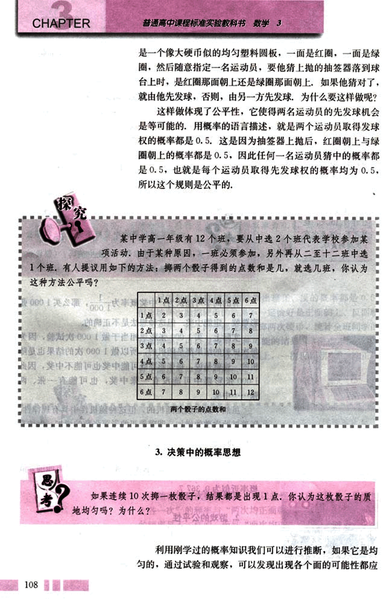
121

# 第三章 概率

## 在一次试验中几乎不可能发生的事件称为小概率事件

## 该是 $\frac{1}{6}$，从而连续 10 次出现 1 点的概率为 $(\frac{1}{6})^{10}$ ≈ 0.000 000 001 653 8。这在一次试验（即连续 10 次投掷一枚骰子）中是几乎不可能发生的，而当骰子不均匀时，特别是当 6 点的那面比较重时（例如灌了铅或水银），会使出现 1 点的概率最大，更有可能连续 10 次出现 1 点。

现在我们面临两种可能的决策：一种是这枚骰子的质地均匀，另一种是这枚骰子的质地不均匀。当连续 10 次投掷这枚骰子，结果都是出现 1 点，这时我们更愿意接受第二种情况：这枚骰子靠近 6 点的那面比较重，原因是在第二种假设下，更有可能出现 10 个 1 点。

如果我们面临的是从多个可选答案中挑选正确答案的决策任务，那么“使得样本出现的可能性最大”可以作为决策的准则，例如对上述思考题所作的推断，这种判断问题的方法称为**极大似然法**。极大似然法是统计中重要的统计思想方法之一。

如果我们的判断结论能够使得样本出现的可能性最大，那么判断正确的可能性也最大。这种判断问题的方法称为**似然法**。似然法是统计中重要的统计思想方法之一。

## 4. 天气预报的概率解释

某地气象局预报说，明天本地降水概率为 70%。你认为下面两个解释中哪一个能代表气象局的观点？

(1) 明天本地有 70% 的区域下雨，30% 的区域不下雨；

(2) 明天本地下雨的机会是 70%。

(1) 显然是不正确的，因为 70% 的概率是说降水的概率，而不是说 70% 的区域降水。正确的选择是 (2)。

生活中，我们经常听到这样的议论：“天气预报说昨天降水概率为 90%，结果连一点雨都没下，天气预报也太不准确了。”学了概率后，你能给出解释吗？

109

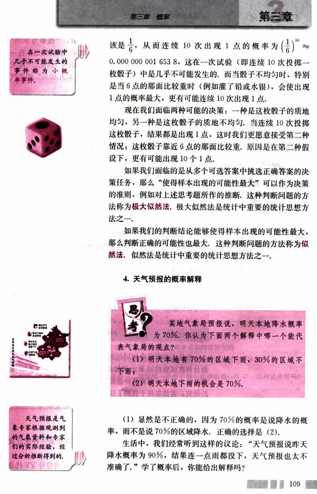
122

# CHAPTER 3

## 天气预报的“降水”

天气预报的“降水”是一个随机事件，“概率为90%”指明了“降水”这个随机事件发生的概率，我们知道：在一次试验中，概率为90%的事件也可能不出现，因此，“昨天没有下雨”并不能说明“昨天的降水概率为90%”的天气预报是错误的。

你能根据频率与概率的关系，通过观察收集数据来判断气象局做出的“降水概率为90%”预报是否正确吗？

## 5. 试验与发现

奥地利遗传学家孟德尔1856年开始用豌豆作试验，这个试验大约持续了七八年的时间，他把黄色和绿色的豌豆杂交，第一年收获的豌豆都是黄色的，第二年，当他把第一年收获的黄色豌豆再种下时，收获的豌豆既有黄色的又有绿色的，同样他把圆形和皱皮豌豆杂交，第一年所收获的都是圆形豌豆，连一粒皱皮豌豆也没有，第二年，当他把这种杂交圆形豌豆再种下时，得到的却既有圆形豌豆，又有皱皮豌豆，类似地，他把长茎的豌豆与短茎的豌豆杂交，第一年长出来的都是长茎的豌豆，另外的那种特征则完全消失了，当他把这种杂交长茎豌豆再种下时，得到的却既有长茎豌豆，又有短茎豌豆。试验的具体数据如下：

| 性状             | 显性       | 隐性       | 显性：隐性 |
|-----------------|-------------|-------------|-------------|
| 子叶的颜色       | 黄色 6 022 | 绿色 2 001 | 3.01:1     |
| 种子的性状       | 圆形 5 474 | 皱皮 1 850 | 2.96:1     |
| 茎的高度         | 长茎 787    | 短茎 277    | 2.84:1     |

为什么表面完全相同的豌豆会长出这样不同的后代呢？而且每次试验的结果比例如此稳定？比例都接近3:1。孟德尔认为其中一定有某种遗传规律，经过长期的、坚持不懈的研究，孟德尔终于找到了这种规律，这一发现为近代遗传学奠定了基础，孟德尔本人也成了遗传学的奠基人。

## 6. 遗传机理中的统计规律

孟德尔从豌豆实验中洞察到的遗传规律是一种统计规律，下面给出简单的解释：

纯黄色和纯绿色的豌豆均有两个特征（用符号YY代表

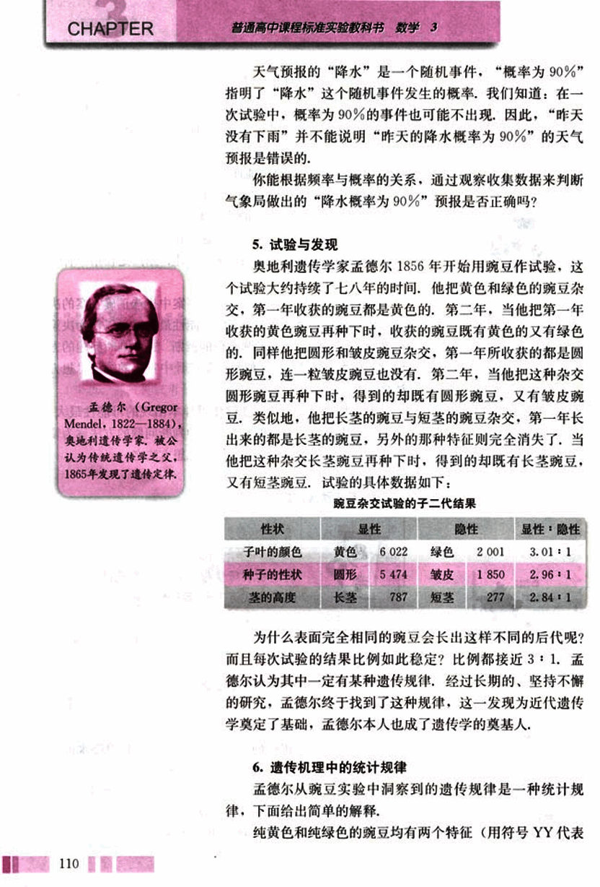
123

# 第三章 概率

## 纯黄色豌豆的两个特征，符号 yy 代表纯绿色豌豆的两个特征：

纯黄色的豌豆 YY
纯绿色的豌豆 yy

当这两种豌豆杂交时，下一代是从父母辈中各随机地选取一个特征，于是第一年收获的豌豆的特征为：

第一代（第一年收获的豌豆）Yy

当把第一代杂交豌豆再种下时，下一代同样是从父母辈中各随机地选取一个特征，所以第二代的豌豆的特征如下：

第二代（第二年收获的豌豆）YY、Yy、yy

这里对于豌豆的颜色来说，Y 是显性因子，y 是隐性因子，当显性因子与隐性因子组合时，表现显性因子的特性，即 YY、Yy 都呈黄色；当两个隐性因子组合时才表现隐性因子的特性，即 yy 呈绿色。由于下一代的两个特征是从父母辈中各随机选取的，因此在第二代中 YY、yy 出现的概率都是 $\frac{1}{4}$，Yy 出现的概率是 $\frac{2}{4}$，所以黄色豌豆 (YY、Yy) : 绿色豌豆 (yy) ≈ 3 : 1。这与连续掷一枚硬币的试验相同，两次均出现反面的概率为 $\frac{1}{4}$，至少出现一次正面的概率为 $\frac{3}{4}$。在多次试验中，至少出现一次正面的次数：两次均出现反面的次数 ≈ 3 : 1。

## 练习

1. 在网上或报纸中找出使用概率的例子，并说明这个概率是如何被使用的。
2. 在乒乓球、排球等比赛中，裁判员还用哪些方法决定谁先发球？这些方法公平吗？
3. “一个骰子掷一次得到 2 的概率是 $\frac{1}{6}$，这说明一个骰子掷 6 次会出现一次 2”，这种说法对吗？说说你的理由。

111

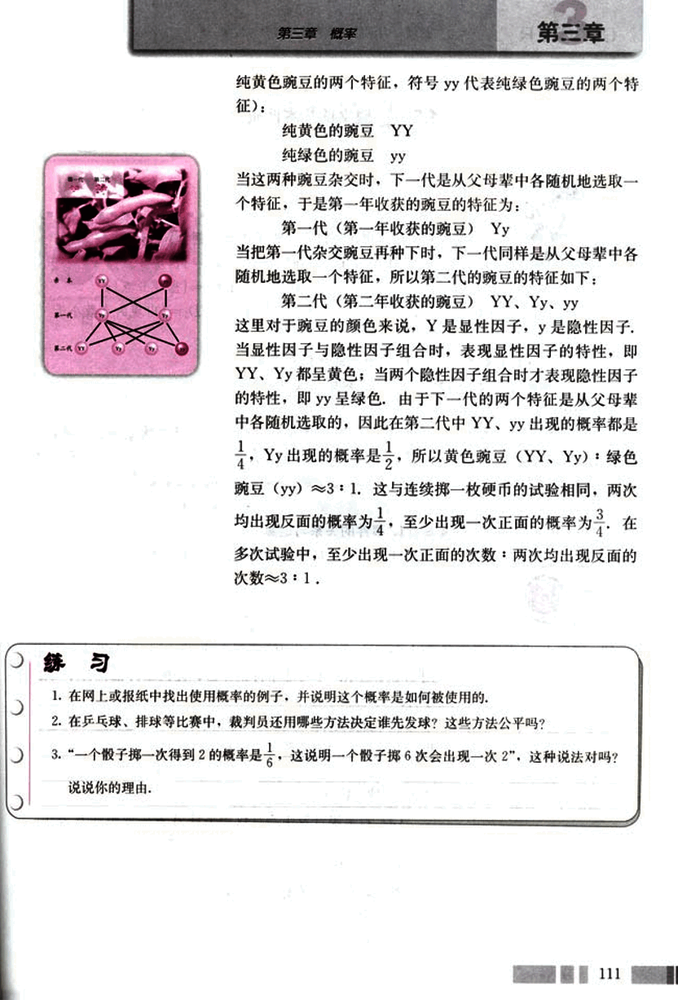
124

# CHAPTER 3.1.3 概率的基本性质

在掷骰子试验中，可以定义许多事件，例如：
$C_1$={出现1点}; $C_2$={出现2点}; $C_3$={出现3点};
$C_4$={出现4点}; $C_5$={出现5点}; $C_6$={出现6点};
$D_1$={出现的点数不大于1}; $D_2$={出现的点数大于3}; $D_3$={出现的点数小于5};
$E$={出现的点数小于7}; $F$={出现的点数大于6};
$G$={出现的点数为偶数}; $H$={出现的点数为奇数}

你能写出这个试验中出现的其他一些事件吗？类比集合与集合的关系、运算，你能发现它们之间的关系与运算吗？

## 1. 事件的关系与运算

(1) 显然，如果事件 $C_1$ 发生，则事件 H 一定发生，这时我们说事件 H 包含事件 $C_1$，记作 $H \supset C_1$。

一般地，对于事件 A 与事件 B，如果事件 A 发生，则事件 B 一定发生，这时称事件 B 包含事件 A（或称事件 A 包含于事件 B），记作 $B \supset A$（或 $A \subset B$）。与集合类比，可用图 3.1-1 表示。不可能事件记作 $\emptyset$，任何事件都包含不可能事件。

(2) 如果事件 $C_1$ 发生，那么事件 $D_1$ 一定发生，反过来也对，这时我们说这两个事件相等，记作 $C_1 = D_1$。

一般地，若 $B \supset A$，且 $A \supset B$，那么称事件 A 与事件 B 相等，记作 A = B。

(3) 若某事件发生当且仅当事件 A 发生或事件 B 发生，则称此事件为事件 A 与事件 B 的并事件（或和事件），记作 $A \cup B$（或 A + B）。

例如，在掷骰子的试验中，事件 $C_1 \cup C_5$ 表示出现 1 点或 5 点这个事件，即 $C_1 \cup C_5$ = {出现 1 点或 5 点}。

(4) 若某事件发生当且仅当事件 A 发生且事件 B 发生，

[图3.1-1](images/3.1-1.png)

112
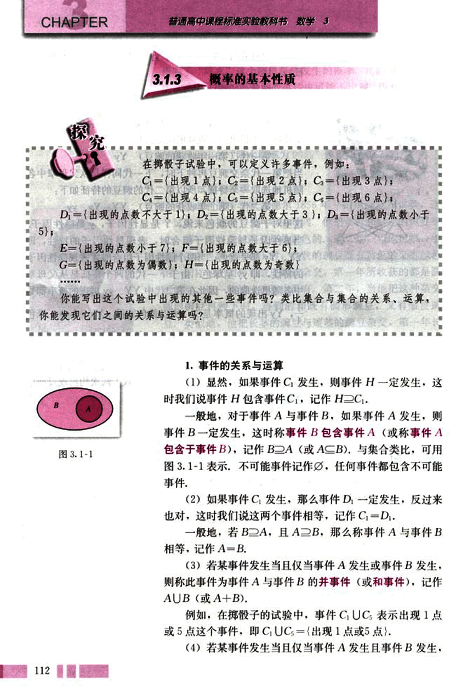
125

# 第三章 概率

## 第三章

则称此事件为事件A与事件B的交事件(或积事件),记作A∩B(或AB),如图3.1-2.

例如,在掷骰子的试验中,D₂∩D₃=C₁.

(5)若A∩B为不可能事件(A∩B=∅),那么称事件A与事件B互斥,其含义是:事件A与事件B在任何一次试验中不会同时发生,如图3.1-3.

例如,上述试验中的事件C₁与事件C₂互斥,事件G与事件H互斥.

(6)若A∩B为不可能事件,A∪B为必然事件,那么称事件A与事件B互为对立事件,其含义是:事件A与事件B在任何一次试验中有且仅有一个发生.

例如,在掷骰子试验中,G∩H为不可能事件,G∪H为必然事件,所以G与H互为对立事件.

事件的关系、运算与集合的关系、运算十分类似,在它们之间可以建立一个对应关系,如事件A与B之并对应于两个集合的并A∪B,事件A与B之交对应于两个集合的交A∩B……因此,可以从集合的观点来看待事件,请同学们找出事件与集合之间的其他对应关系.

## 2. 概率的几个基本性质

(1)由于事件的频数总是小于或等于试验的次数,所以频率在0～1之间,从而任何事件的概率在0～1之间,即

0 ≤ P(A) ≤ 1.

(2)在每次试验中,必然事件一定发生,因此它的频率为1,从而必然事件的概率为1.例如,在掷骰子试验中,由于出现的点数最大是6,因此P(E)=1.

(3)在每次试验中,不可能事件一定不出现,因此它的频率为0,从而不可能事件的概率为0.例如,在掷骰子试验中,P(F)=0.

(4)当事件A与事件B互斥时,A∪B发生的频数等于A发生的频数与B发生的频数之和,从而A∪B的频率f(A∪B)=f(A)+f(B).

由此得到概率的加法公式:

113

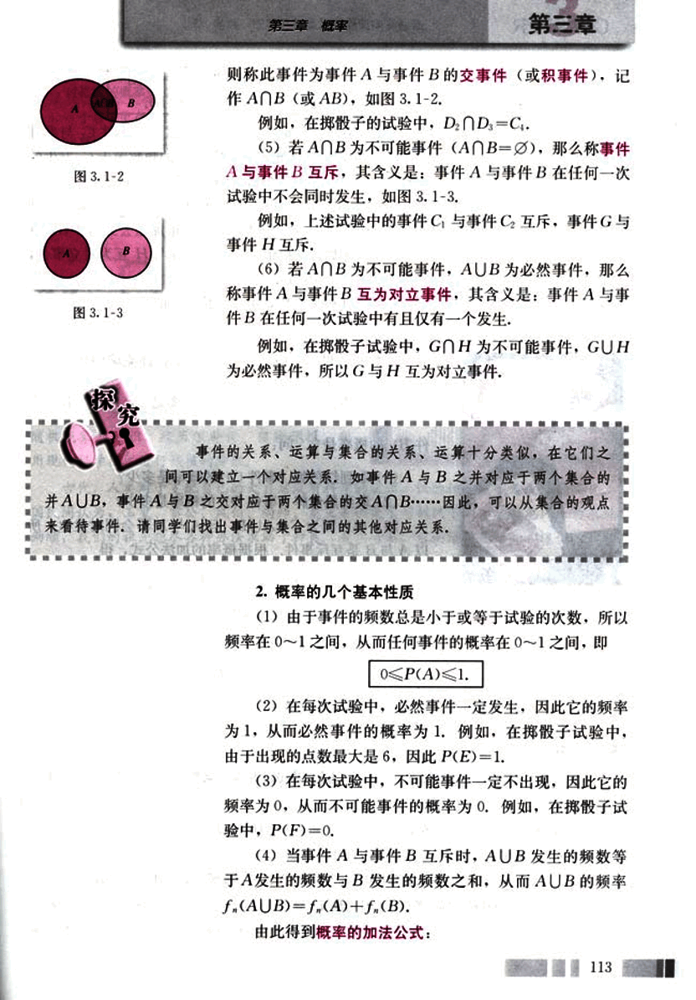
126

# CHAPTER 3

如果事件A与事件B互斥，则
P(A∪B) = P(A) + P(B).

例如，在掷骰子时，由于在一次试验中事件C₁与事件
C₂不会同时发生，因此，C₁∪C₂发生的频数等于C₁发生的
频数与C₂发生的频数之和，P(C₁∪C₂) = P(C₁) + P(C₂).

(5)特别地，若事件B与事件A互为对立事件，则
A∪B为必然事件，P(A∪B) = 1. 再由加法公式得P(A) =
1 - P(B). 例如，在掷骰子试验中，G与H互为对立事件，
因此P(G) = 1 - P(H).

利用上述概率性质，可以简化概率的计算。

## 例

如果从不包括大小王的52张扑克牌中随机抽取
一张，那么取到红心（事件A）的概率是$\frac{1}{4}$，取到方片（事
件B）的概率是$\frac{1}{4}$，问：

(1) 取到红色牌（事件C）的概率是多少？
(2) 取到黑色牌（事件D）的概率是多少？

解：(1) 因为C = A∪B，且A与B不会同时发生，所
以A与B是互斥事件，根据概率的加法公式，得

P(C) = P(A) + P(B) = $\frac{1}{2}$

(2) C与D也是互斥事件，又由于C∪D为必然事件，
所以C与D互为对立事件，所以

P(D) = 1 - P(C) = $\frac{1}{2}$.

## 练习

1. 如果某人在某种比赛（这种比赛不会出现“和”的情况）中赢的概率是0.3，那么他输的概率
是多少？

2. 利用简单随机抽样的方法抽查了某校200名学生，其中戴眼镜的学生有123人。若在这个学校
随机调查一名学生，问他戴眼镜的概率近似值是多少？

3. 某工厂为了节约用电，规定每天的用电量指标为1000千瓦时。按照上个月的用电记录，30天中
有12天的用电量超过指标。若第二个月仍没有具体的节电措施，试求该月的第一天用电量超
114

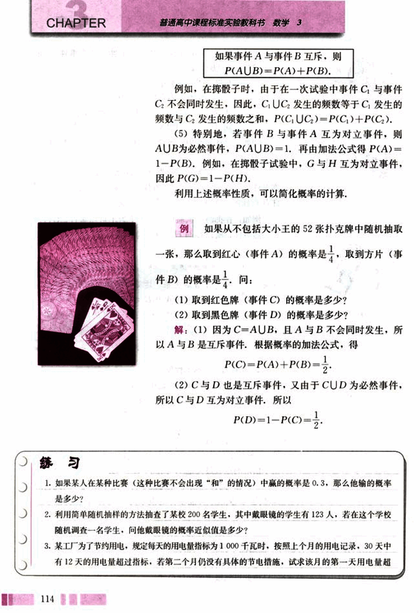
127

# 第三章 概率

## 过指标的概率近似值

4. 一个袋子里有 5 个红球，3 个白球，4 个绿球，2 个黑球。如果随机地摸出一个球，记 A = {摸出黑球}，B = {摸出红球}，C = {摸出白球}，D = {摸出绿球}，请同学们有放回地重复摸球 100 次，求下面事件的频率：

(1) A;

(2) B∪C;

(3) D.

## 天气变化的认识过程

在人类与大自然的较量中，经常面对影响人类生存、反复无常的天气变化，人们对这种随机现象的认识，经历了神化、经验预报、利用现代科学技术进行预报的阶段。

古代，人类对于支配自己的大自然没有科学的认识，认为神灵主宰着天气的变化，中国民间认为，玉皇、雷公、风伯、雨师、龙王等神灵主司刮风下雨、雷鸣电闪，为求风调雨顺，我们的祖先想尽各种办法求助于神灵。现在看来，求雨活动是无知和迷信的，但可以理解的是，这是人们在对大自然束手无策时所做的事情。人类不甘于受自然支配的本能是人类认识与改造世界的动力。

人类对天气变化经历了漫长的认识过程，积累了丰富的气象经验，这些经验的获得实际上有意无意地应用了概率与统计方面的知识。千百年来，我国劳动人民在生产实践中根据云的形状、走向、速度、厚度、颜色等的变化，总结了丰富的“看云识天气”的经验，并将这些经验编成谚语，如“天上钩钩云，地上雨淋淋”“炮台云，雨淋淋”“云交云，雨淋淋”……三国时期，诸葛亮曾经运用自身丰富的气象观测经验，提前三天准确地预报出一场大雾，并在 大雾的掩护下，不费吹灰之力，演出了一场“草船借箭”的好戏，令世人惊叹。

近代天气预报已有 100 多年历史，它建立在对遍布世界各地的气象观测台的观测数据的统计与分析的基础上。自从有电报和互联网后，各地同时间观测的气象资料能及时集中到各国的气象中心，根据这些天气资料，利用动力学方程可以确定未来一段时间内的气压、温度、湿度、风力等分布的情况，从而对天气进行预报，这称作动力学预报：但是，影响天气变化的因素多种多样，目前的动力学方程只考虑了一些主要因素，因此做出的天气预报还有较大的误差，不能直接用于预报。

统计预报以概率论为基础，其基本思路是：将预报量 P 同其他一些气象要素 (X，……，Xn) 进行统计分析，建立起回归方程，利用统计决策作出预报。将动力学预报与统

115

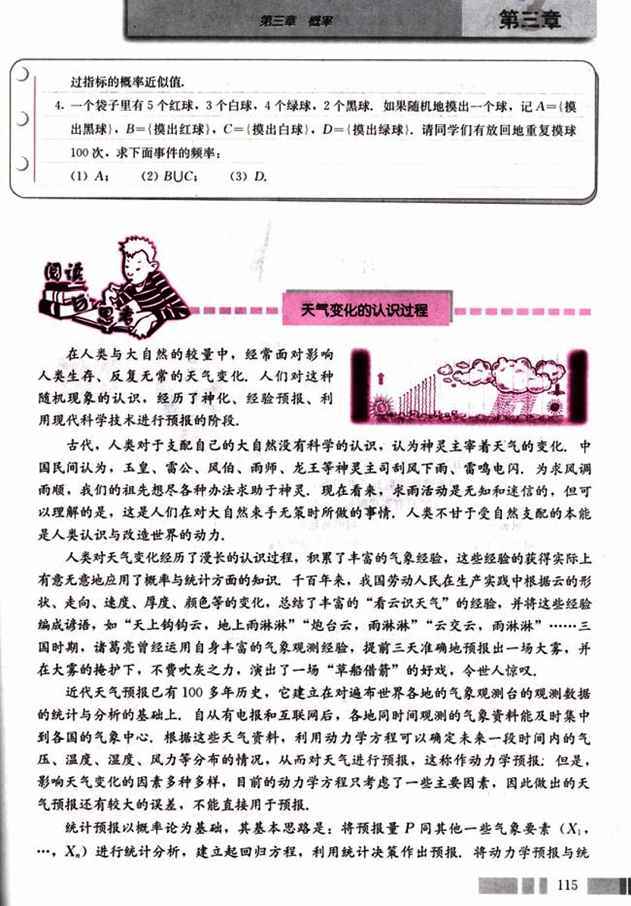
128

# CHAPTER 3

普通高中课程标准实验教科书 数学 3

计预报相结合,可以提高预报效果.

随着人们对气象研究的深入,人们对影响天气变化的因素的认识会越来越深入,使天气预报的准确率越来越高.

## 习题 3.1

### A 组

1. 有一粒红骰子和一粒黑骰子,如果同时掷这两粒骰子,分别试验20次和100次,下列事件出现的频率各是多少?

(1) 黑骰子的点数不小于红骰子的点数 (事件 A);

(2) 两粒骰子的总和大于 9 (事件 B);

(3) 红骰子的点数小于 3 (事件 C);

(4) 红骰子的点数小于 3 或者两粒骰子的总和大于 9 (事件 D). (事件 B 与事件 C 是互斥事件吗?)

2. 在一个实验中,一种血清被注射到 500 只豚鼠体内,最初,这些豚鼠中 150 只有圆形细胞,250 只有椭圆形细胞,100 只有不规则形状细胞,被注射这种血清之后,没有一个具有圆形细胞的豚鼠被感染,50 个具有椭圆形细胞的豚鼠被感染,具有不规则形状细胞的豚鼠全部被感染,根据试验结果,估计具有下列类型的细胞的豚鼠被这种血清感染的概率:

(1) 圆形细胞;

(2) 椭圆形细胞;

(3) 不规则形状细胞.

3. 李老师在某大学连续 3 年主讲经济学院的高等数学,下表是李老师这门课 3 年来的考试成绩分布:

| 成绩 | 人数 |
|---|---|
| 90 分以上 | 43 |
| 80~89 分 | 182 |
| 70~79 分 | 260 |
| 60~69 分 | 90 |
| 50~59 分 | 62 |
| 50 分以下 | 8 |

经济学院一年级的学生王小慧下学期将修李老师的高等数学课,用已有的信息估计她得以下分数的概率:

(1) 90 分以上;

(2) 60~69 分;

(3) 60 分以上.

116

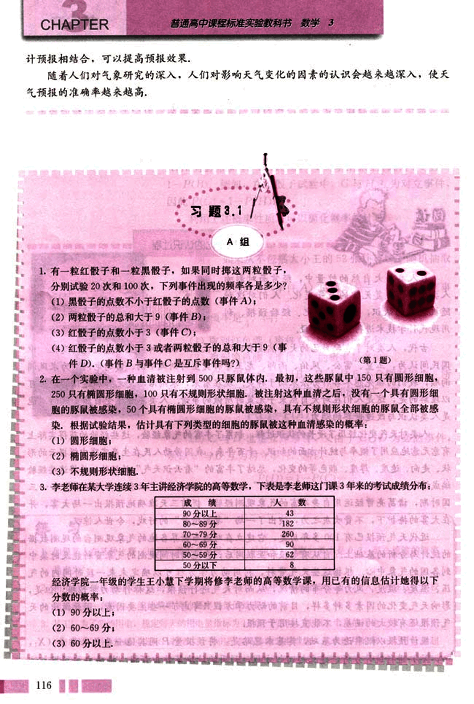
129

# 第三章 概率

## 4.

某人捡到不规则形状的五面体石块，他在每个面上作了记号，投掷了100次，并且记录了每个面落在桌面上的次数（如下表）。如果再投掷一次，请估计石块的第4面落在桌面上的概率是多少？

| 石块的面 | 频数 |
|---|---|
| 1 | 32 |
| 2 | 18 |
| 3 | 15 |
| 4 | 13 |
| 5 | 22 |

## 5.

在一个袋子中放9个白球，1个红球，摇匀后随机摸球：

(1) 每次摸出球后记下球的颜色然后放回袋中；

(2) 每次摸出球后不放回袋中；

在两种情况下分别做10次试验，求每种情况下第4次摸到红球的频率，两个频率相差得远吗？两个事件的概率一样吗？第4次摸到红球的频率与第1次摸到红球的频率相差得远吗？请说明原因。

## 1.

统计全班同学的生日，将数据填入下表：

| 月份 | 频数 | 频率 |
|---|---|---|
| 一月 |  |  |
| 二月 |  |  |
| 三月 |  |  |
| 四月 |  |  |
| 五月 |  |  |
| 六月 |  |  |
| 七月 |  |  |
| 八月 |  |  |
| 九月 |  |  |
| 十月 |  |  |
| 十一月 |  |  |
| 十二月 |  |  |
| 合计 |  |  |

(1) 同学们的生日在每个月的频数一样吗？

(2) 收集全年级同学生日的数据，你能得到一个人在每个月出生是等可能的结论吗？

## 2.

从一本英文（小说类）书里随机翻一页，然后数出在这一页里元音字母的数目和字母的总数，把数据填入下表：

| 元音字母 | 频数 | 频率 |
|---|---|---|
| A |  |  |
| E |  |  |
| I |  |  |
| O |  |  |
| U |  |  |
| 这页字母总数 |  |  |

利用这个频率预测在另外一页中元音字母“E”的数目，然后数出这页中元音字母“E”的数目，你的预测与实际数目接近吗？

117

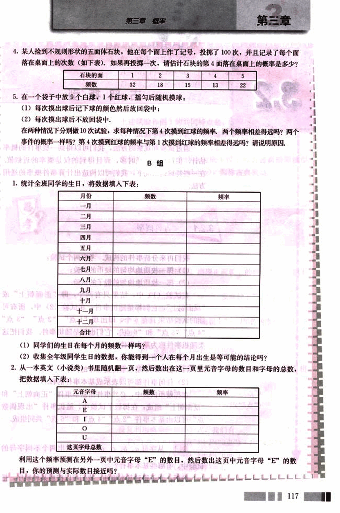
