# 3.2　古典概型

130

# 3.2 古典概型

通过试验和观察的方法，我们可以得到一些事件的概率估计，但这种方法耗时多，而且得到的仅是概率的近似值。在一些特殊的情况下，我们可以构造出计算事件概率的通用方法。

## 3.2.1 古典概型

我们再来分析事件的构成，考察两个试验：
(1)掷一枚质地均匀的硬币的试验；
(2)掷一枚质地均匀的骰子的试验。

在试验(1)中，结果只有两个，即“正面朝上”或“反面朝上”，它们都是随机事件；在试验(2)中，所有可能 的试验结果只有6个，即出现“1点”“2点”“3点”“4点”“5点”和“6点”，它们也都是随机事件，我们把这类随机事件称为基本事件(elementary event)。

基本事件有如下特点：
(1)任何两个基本事件是互斥的；
(2)任何事件都可以表示成基本事件的和。

在掷硬币试验中，必然事件由基本事件“正面朝上”和“反面朝上”组成；在掷骰子试验中，随机事件“出现偶数点”可以由基本事件“2点”“4点”和“6点”共同组成。

例1 从字母a、b、c、d中任意取出两个不同字母的试验中，有哪些基本事件？

分析：为了得到基本事件，我们可以按照某种顺序，把

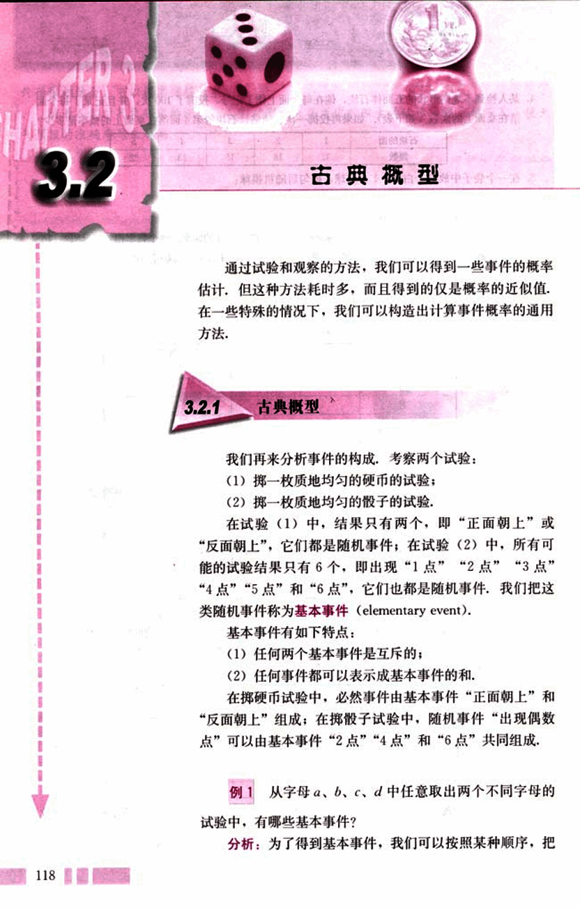
131

# 第三章 概率

所有可能的结果都列出来.

解:所求的基本事件共有6个:

A={a, b}, B={a, c}, C={a, d},
D={b, c}, E={b, d},
F={c, d}.

上述试验和例1的共同特点是:

(1)试验中所有可能出现的基本事件只有有限个;
(2)每个基本事件出现的可能性相等.

我们将具有这两个特点的概率模型称为古典概率模型(classical models of probability),简称古典概型.

在古典概型下,基本事件出现的概率是多少?随机事件出现的概率如何计算?

对于掷均匀硬币试验,出现正面朝上的概率与反面朝上的概率相等,即

P(“正面朝上”)=P(“反面朝上”).

由概率的加法公式,得

P(“正面朝上”)+P(“反面朝上”)=P(必然事件)=1.

因此

P(“正面朝上”)=P(“反面朝上”)=$\frac{1}{2}$.

对于掷质地均匀的骰子试验,出现各个点的概率相等,即

P(“1点”)=P(“2点”)=P(“3点”)
=P(“4点”)=P(“5点”)
=P(“6点”).

反复利用概率的加法公式,我们有

P(“1点”)+P(“2点”)+P(“3点”)+P(“4点”)
+P(“5点”)+P(“6点”)
=P(必然事件)=1.

所以

119

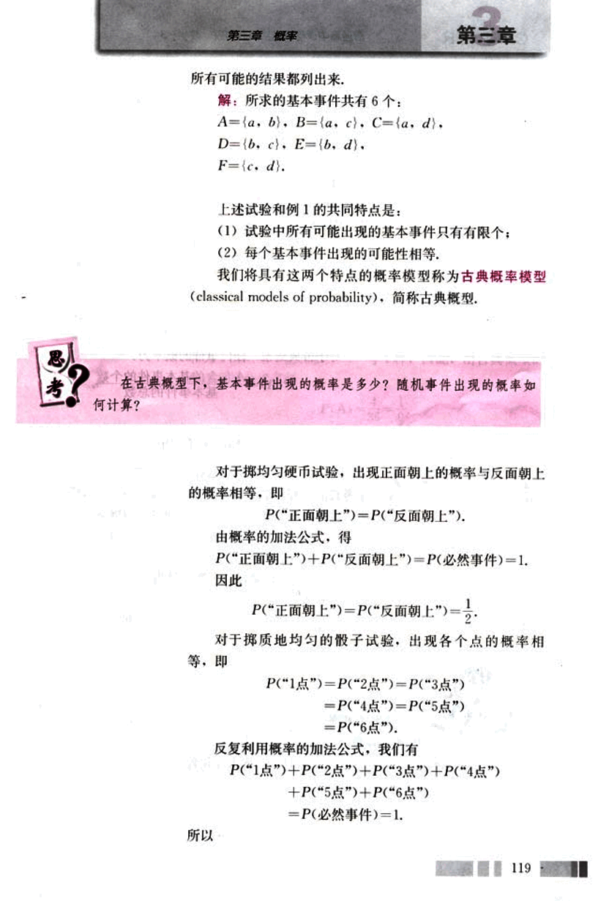
132

# CHAPTER 3

P(“1点”)=P(“2点”)=P(“3点”)
=P(“4点”)=P(“5点”)
=P(“6点”)
=$\frac{1}{6}$

进一步地，利用加法公式还可以计算这个试验中任何一个事件的概率，例如，
P(“出现偶数点”)=P(“2点”)+P(“4点”)+P(“6点”)
=$\frac{1}{6}$+$\frac{1}{6}$+$\frac{1}{6}$
=$\frac{3}{6}$=$\frac{1}{2}$

P(“出现偶数点”)=“出现偶数点”所包含的基本事件的个数
基本事件的总数

对于古典概型，任何事件的概率为：
P(A)=$\frac{A包含的基本事件的个数}{基本事件的总数}$

例2 单选题是标准化考试中常用的题型，一般是从
A、B、C、D四个选项中选择一个正确答案，如果考生掌握
了考查的内容，他可以选择唯一正确的答案，假设考生不会
做，他随机地选择一个答案，问他答对的概率是多少？

解：这是一个古典概型，因为试验的可能结果只有
4个：选择A，选择B，选择C，选择D，即基本事件共有
4个，考生随机地选择一个答案是指选择A、B、C、D的可能性是相等的，由古典概型的概率计算公式得：
P(“答对”)=$\frac{\text{“答对”所包含的基本事件的个数}}{4}$=$\frac{1}{4}$=0.25.

在标准化的考试中既有单选题又有多选题，多选题是从A、
B、C、D四个选项中选出所有正确的答案，同学们可能有一种感
觉，如果不知道正确答案，多选题更难猜对，这是为什么？

例3 同时掷两个骰子，计算：

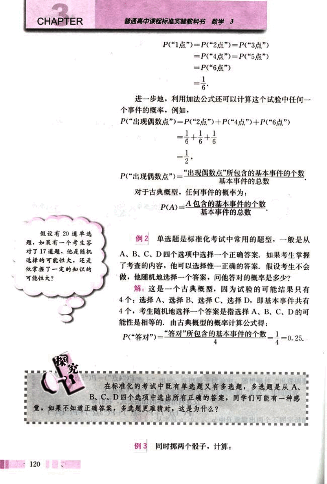
133

# 第三章 概率

(1) 一共有多少种不同的结果？

(2) 其中向上的点数之和是 5 的结果有多少种？

(3) 向上的点数之和是 5 的概率是多少？

解：(1) 掷一个骰子的结果有 6 种，我们把两个骰子标上记号 1、2 以便区分，由于 1 号骰子的每一个结果都可与 2 号骰子的任意一个结果配对，组成同时掷两个骰子的一个结果，因此同时掷两个骰子的结果共有 36 种。

(2) 在上面的所有结果中，向上的点数之和为 5 的结果有

(1, 4), (2, 3), (3, 2), (4, 1),

其中第一个数表示 1 号骰子的结果，第二个数表示 2 号骰子的结果。

(3) 由于所有 36 种结果是等可能的，其中向上点数之和为 5 的结果（记为事件 A）有 4 种，因此，由古典概型的概率计算公式可得

$P(A) = \frac{4}{36} = \frac{1}{9}$

你能列出这 36 个结果吗？

思考？

为什么要把两个骰子标上记号？如果不标记号会出现什么情况？你能解释其中的原因吗？

如果不标上记号，类似于 (1, 2) 和 (2, 1) 的结果将没有区别。这时，所有可能的结果将是 (1, 1)、(1, 2)、(1, 3)、(1, 4)、(1, 5)、(1, 6)、(2, 2)、(2, 3)、(2, 4)、(2, 5)、(2, 6)、(3, 3)、(3, 4)、(3, 5)、(3, 6)、(4, 4)、(4, 5)、(4, 6)、(5, 5)、(5, 6)、(6, 6) 共有 21 种，和是 5 的结果有 2 个，它们是 (1, 4)、(2, 3)，所求概率为

$P(A) = \frac{2}{21}$

两个答案都是利用古典概型的概率计算公式得到的，为什么会出现不同结果呢？这就需要考察两种解法是否满足古典概型的要求，可以发现，第一种解法中给出的基本事件是等可能发生的，但第二种解法中构造的 21 个基本事件不是等可能发生的。

121

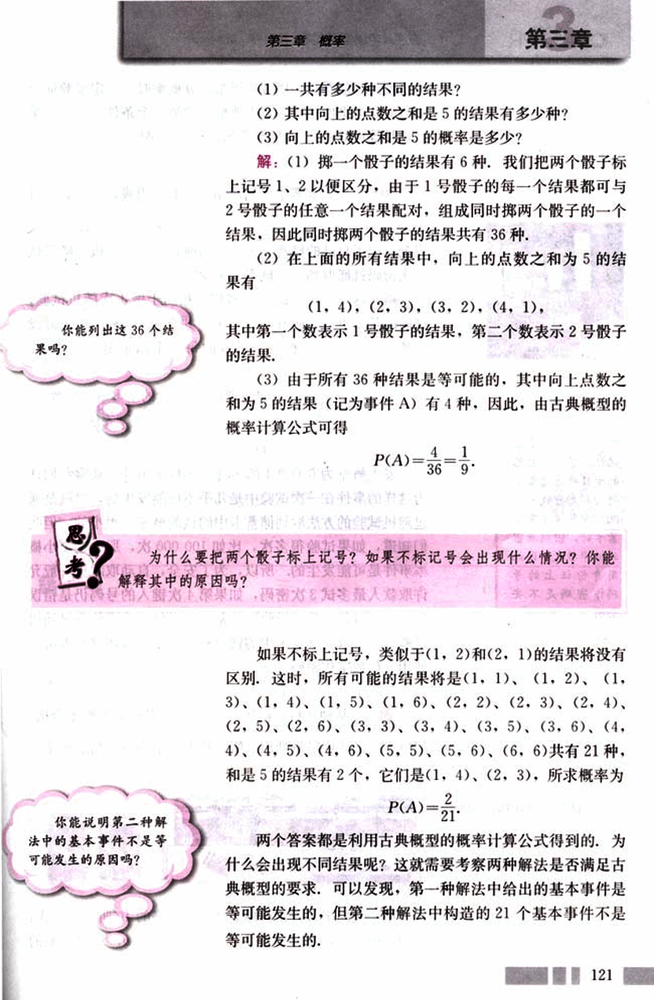
134

# CHAPTER 3

普通高中课程标准实验教科书 数学 3

由此我们看到，用古典概型计算概率时，一定要验证所构造的基本事件是否满足古典概型的第二个条件（每个结果出现是等可能的），否则计算出的概率将是错误的。

## 例4

假设储蓄卡的密码由4个数字组成，每个数字可以是0, 1, 2, …, 9十个数字中的任意一个，假设一个人完全忘记了自己的储蓄卡密码，问他到自动取款机上随机试一次密码就能取到钱的概率是多少？

解：这个人随机试一个密码，相当于做1次随机试验，试验的基本事件（所有可能结果）共有10000种，由于假设是随机地试密码，相当于试验的每一个结果是等可能的，所以

$P(\text{“能取到钱”}) = \frac{\text{“能取到钱”所包含的基本事件个数}}{10\ 000} = \frac{1}{10\ 000} = 0.000\ 1.$

发生概率为0.000 1的事件是小概率事件，通常我们认为这样的事件在一次试验中是几乎不可能发生的，也就是通过随机试验的方法取到储蓄卡中的钱的概率是很小的，但是我们知道，如果试验很多次，比如100 000次，那么这个小概率事件是可能发生的，所以，为了安全，自动取款机一般允许取款人最多试3次密码，如果第4次键入的号码仍是错误的，那么取款机将“没收”储蓄卡。另外，为了使通过随机试验的方法取到储蓄卡中的钱的概率更小，现在储蓄卡可以使用6位数字作密码，

## 例5

某种饮料每箱装12听，如果其中有2听不合格，问质检人员从中随机抽出2听，检测出不合格产品的概率有多大？

[image](images/example5.png)

解：我们把每听饮料标上号码，合格的10听分别记作：1, 2, …, 10, 不合格的2听分别记作a, b, 只要检测的

122

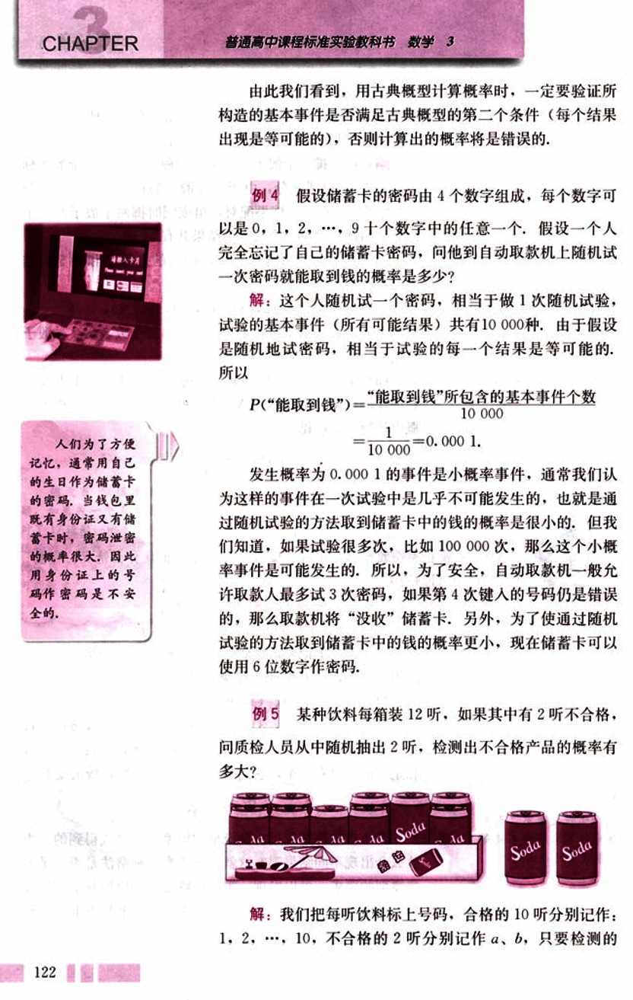
135

# 第三章 概率

##  你能具体列出这66个基本事件吗？

##  你能列出查出不合格产品所包含的基本事件吗？

2听中有1听不合格，就表示查出了不合格产品。
我们采用每次抽1听，分两次抽取样品的方法抽样，并按抽取顺序($x, y$)记录结果，由于是随机抽取的，$x$有12种可能，$y$有11种可能，但($x, y$)与($y, x$)是相同的，所以试验的所有结果有$12 \times 11 \div 2 = 66$ (种)。下面计算检测出不合格产品这个事件包含的基本事件个数。

分两种情况：1听不合格和2听都不合格。

1听不合格：合格产品从10听中选1听，不合格产品从2听中选1听，所以包含的基本事件数为$10 \times 2 = 20$。

2听都不合格：包含的基本事件数为1。

所以检测出不合格产品这个事件包含的基本事件数为$20 + 1 = 21$。因此检测出不合格产品的概率为$\approx 0.318$。

随着检测听数的增加，查出不合格产品的概率怎样变化？为什么质检人员一般都采用抽查的方法而不采用逐个检查的方法？

## 练习

1. 在20瓶饮料中，有2瓶已过了保质期，从中任取1瓶，取到已过保质期的饮料的概率是多少？

2. 在夏令营的7名成员中，有3名同学已去过北京，从这7名同学中任选2名同学，选出的这2名同学恰是已去过北京的概率是多少？

3. 5本不同的语文书，4本不同的数学书，从中任意取出2本，取出的书恰好都是数学书的概率为多少？

# 3.2.2  (整数值)随机数(random numbers)的产生

在第一节中，同学们做了大量重复的试验，有的同学可能觉得这样做试验花费的时间太多了，有没有其他方法可以代替试验呢？

下面我们介绍一种如何用计算器产生你指定的两个整数

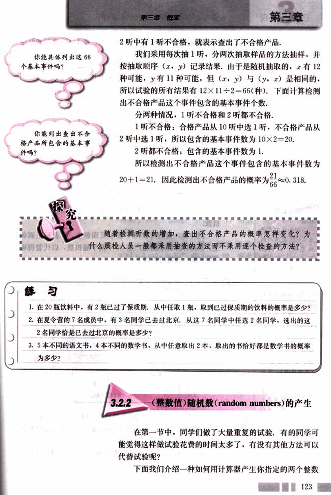
136

# CHAPTER 3

普通高中课程标准实验教科书 数学 3

之间的取整数值的随机数，例如，要产生1～25之间的取整
数值的随机数，按键过程如下：

PRB → → → →  RAND RANDI
                                     STAT DEG

ENTER     RANDI(1, 25)
                   STAT DEG

ENTER     RANDI(1, 25)   3.
                   STAT DEG

以后反复按ENTER键，就可以不断产生你需要的随机数。

## 随机数与伪随机数

例如我们要产生
1～25之间的随机
整数，我们把
25个大小形状相
同的小球分别标上
1，2，3，……，24，
25，放入一个袋
中，把它们充分搅
拌，然后从中摸出
一个，这个球上的
数就称为随机数。
计算机或计算器产
生的随机数是依照
确定算法产生的
数，具有周期性
（周期很长），它们
具有类似随机数的
性质，因此，计算
机产生的并不是真
正的随机数，我们
称它们为伪随机数。

124

PRB → → → →  RAND RANDI
                                     STAT DEG

ENTER     RANDI(0, 1)
                   STAT DEG

ENTER     RANDI(0, 1)   0.
                   STAT DEG

我们也可以用计算机产生随机数，而且可以直接统计出
频数和频率，下面以掷硬币为例给出计算机产生随机数的
方法。

每个具有统计功能的软件都有随机函数，以Excel软件
为例，打开Excel软件，执行下面的步骤：

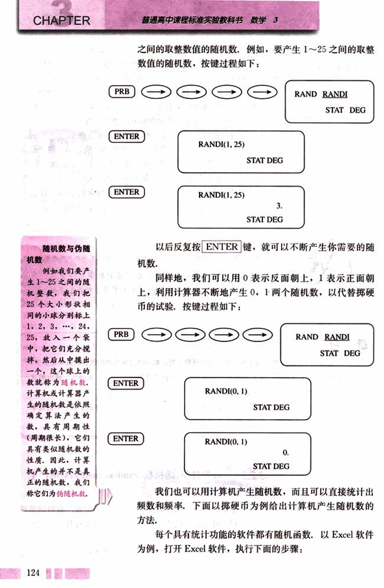
137

# 第三章 概率

## 随机函数

RANDBETWEEN (a, b) 产生从整数 a 到整数 b 的取整数值的随机数。

1. 选定 A1 格，键入 “=RANDBETWEEN (0, 1)0”，按 Enter 键，则在此格中的数是随机产生的 0 或 1。

2. 选定 A1 格，按 Ctrl+C 快捷键，然后选定要随机产生 0、1 的格，比如 A2 至 A100，按 Ctrl+V 快捷键，则在 A2 至 A100 的数均为随机产生的 0 或 1，这样我们很快就得到了 100 个随机产生的 0，1，相当于做了 100 次随机试验。

3. 选定 C1 格，键入频数函数 “=FREQUENCY (A1: A100, 0.5)”，按 Enter 键，则此格中的数是统计 A1 至 A100 中，比 0.5 小的数的个数，即出现的频数，也就是反面朝上的频数。

4. 选定 D1 格，键入 “=1-C1/100”，按 Enter 键，在此格中的数是这 100 次试验中出现 1 的频率，即正面朝上的频率。

同时可以画频率折线图，它更直观地告诉我们：频率在概率附近波动。

[冯·诺伊曼](images/冯·诺伊曼.png) (J. von Neuman, 1903-1957) 是 20 世纪最伟大的数学家之一，他在博弈论的提出和第一台电子计算机的研制中都作出了巨大贡献。

正面朝上的频率

125

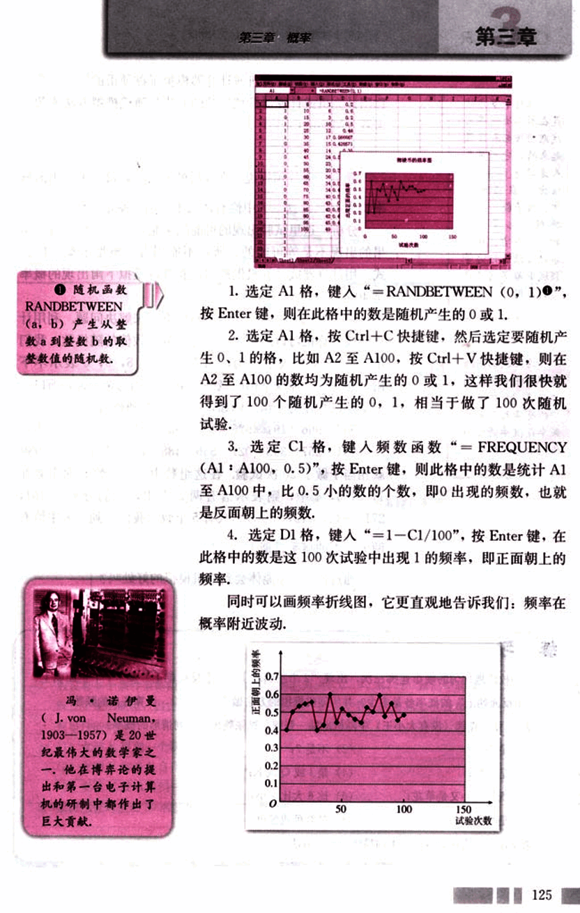
138

# CHAPTER 3

## 蒙特卡罗方法

蒙特卡罗方法是在第二次世界大战期间兴起和发展起来的，它的奠基人是冯·诺伊曼，该方法在应用物理、原子能、固体物理、化学、生物、生态学、社会学以及经济行为等领域中都得到了广泛的应用。

这里我们用随机模拟的方法得到的仅是20次试验中恰有两天下雨的频率或概率的近似值，而不是概率。

## 上面我们用计算机或计算器模拟了掷硬币的试验，我们称用计算机或计算器模拟试验的方法为随机模拟方法或蒙特卡罗(Monte Carlo)方法。

### 例 6

天气预报说，在今后的三天中，每一天下雨的概率均为40%，这三天中恰有两天下雨的概率是多少？

**分析:** 这里试验出现的可能结果是有限个，但是每个结果的出现不是等可能的，所以不能用古典概型求概率的公式，用计算器或计算机做模拟试验可以模拟下雨出现的概率是40%。

**解:** 我们通过设计模拟试验的方法来解决问题，利用计算器或计算机可以产生0到9之间取整数值的随机数，我们用1，2，3，4表示下雨，用5，6，7，8，9，0表示不下雨，这样可以体现下雨的概率是40%，因为是3天，所以每三个随机数作为一组，例如，产生20组随机数：

| 907 | 966 | 191 | 925 | 271 | 932 | 812 | 458 | 569 | 683 |
|---|---|---|---|---|---|---|---|---|---|
| 431 | 257 | 393 | 027 | 556 | 488 | 730 | 113 | 537 | 989 |

就相当于做了20次试验，在这组数中，如果恰有两个数在1，2，3，4中，则表示恰有两天下雨，它们分别是191，271，932，812，393，即共有5个数，我们得到三天中恰有两天下雨的概率近似为$\frac{5}{20} = 25\%$。

通过例6，你能体会到随机模拟的好处吗？

## 练习

1. 将一枚质地均匀的硬币连掷三次，出现“2个正面朝上、1个反面朝上”和“1个正面朝上、2个反面朝上”的概率各是多少？并用随机模拟的方法做100次试验，计算各自的频数。

2. 从52张扑克牌（没有大小王）中随机地抽一张牌，这张牌出现下列情形的概率：

(1) 是7；
(2) 不是7；
(3) 是方片；
(4) 是J或Q或K；
(5) 既是红心又是草花；
(6) 比6大比9小；
(7) 是红色；
(8) 是红色或黑色。

请设计一种用计算机模拟上面摸牌试验的方法。

126

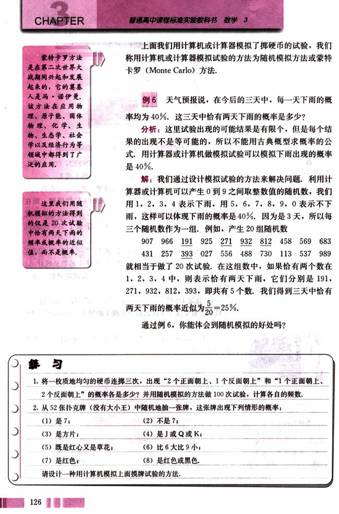
139

# 第三章 概率

3.盒中仅有4个白球和5个黑球,从中任意取出一个球,

(1)“取出的球是黄球”是什么事件?它的概率是多少?

(2)“取出的球是白球”是什么事件?它的概率是多少?

(3)“取出的球是白球或是黑球”是什么事件?它的概率是多少?

(4)设计一个计算机模拟上面取球的试验，

4.(1)掷两粒骰子,计算出现点数总和为7的概率;

(2)利用随机模拟的方法,试验200次,计算出现点数总和为7的频率;

(3)所得频率与概率相差大吗?为什么会有这种差异?

# 习题3.2

## A组

1.下面有三个游戏规则,袋子中分别装有球,从袋中无放回地取球,分别计算甲获胜的概率,哪个游戏是公平的?

| 游戏1 | 游戏2 | 游戏3 |
|---|---|---|
| 1个红球和1个白球 | 2个红球和2个白球 | 3个红球和1个白球 |
| 取1个球 | 取1个球,再取1个球 | 取1个球,再取1个球 |
| 取出的球是红球→甲胜 | 取出的两个球同色→甲胜 | 取出的两个球同色→甲胜 |
| 取出的球是白球→乙胜 | 取出的两个球不同色→乙胜 | 取出的两个球不同色→乙胜 |

2.假设有5个条件很类似的女孩,把她们分别记为A,C,J,K,S.她们应聘秘书工作,但只有三个秘书职位,因此5人中仅有三人被录用.如果5个人被录用的机会相等,分别计算下列事件的概率:

(1)女孩K得到一个职位:

(2)女孩K和S各自得到一个职位;

(3)女孩K或S得到一个职位,

3. 某班主任对全班50名学生进行了作业量多少的调查,数据如下表:

127

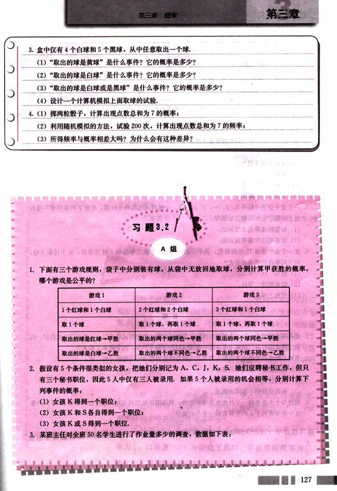
140

# CHAPTER 3

普通高中课程标准实验教科书 数学 3

|         | 认为作业多 | 认为作业不多 | 总数 |
| :------- | :---------- | :------------ | :---- |
| 喜欢电脑游戏 | 18         | 9            | 27   |
| 不喜欢电脑游戏 | 8          | 15           | 23   |
| 列总数       | 26         | 24           | 50   |

如果校长随机地问这个班的一名学生，下面事件发生的概率是多少？
(1) 认为作业多；
(2) 喜欢电脑游戏并认为作业不多。

4. a、b、c、d、e五位同学按任意次序站成一排，试求下列事件的概率：
(1) a在边上；
(2) a和b都在边上；
(3) a或b在边上；
(4) a和b都不在边上；
(5) a正好在中间。

5. 一个盒子里装有标号1，2，…，10的标签，今随机地选取两张标签，根据下列条件求两张标签上的数字为相邻整数的概率：
(1) 标签的选取是无放回的；
(2) 标签的选取是有放回的。

6. 在一个盒中装有15枝圆珠笔，其中7枝一等品，5枝二等品和3枝三等品，从中任取3枝，问下列事件的概率有多大？
(1) 恰有一枝一等品；
(2) 恰有两枝一等品；
(3) 没有三等品。

## B组

1. 某人有5把钥匙，其中2把能打开门，现随机地取1把钥匙试着开门，不能开门的就扔掉，问第三次才能打开门的概率是多少？如果试过的钥匙不扔掉，这个概率又是多少？

2. 某城市的电话号码是8位数，如果从电话号码本中任指一个电话号码，求：
(1) 头两位数码都是8的概率；
(2) 头两位数码都不超过8的概率；
(3) 头两位数码不相同的概率。

3. 假设每个人在任何一个月出生是等可能的，利用随机模拟的方法，估计在一个有10个人的集体中至少有两个人的生日在同一个月的概率？

128

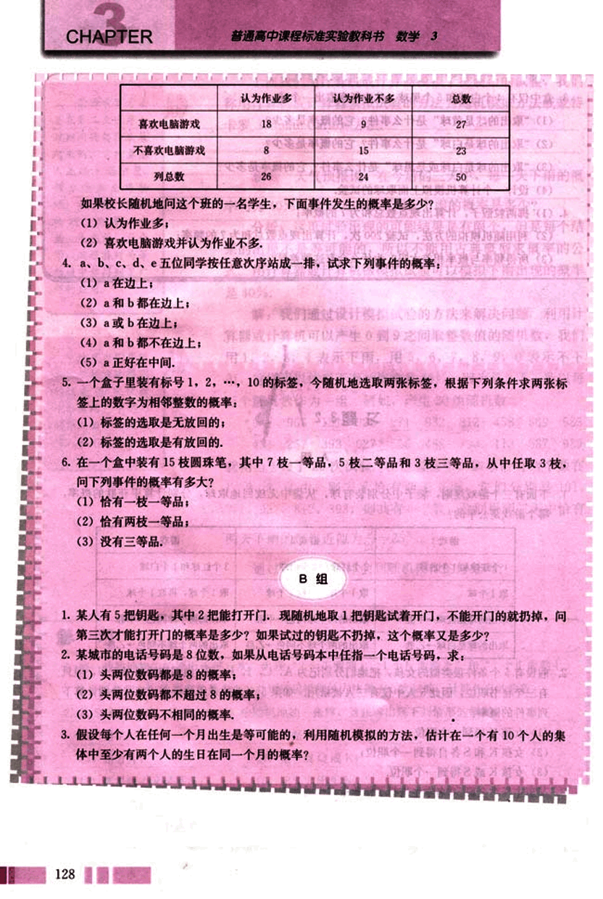
