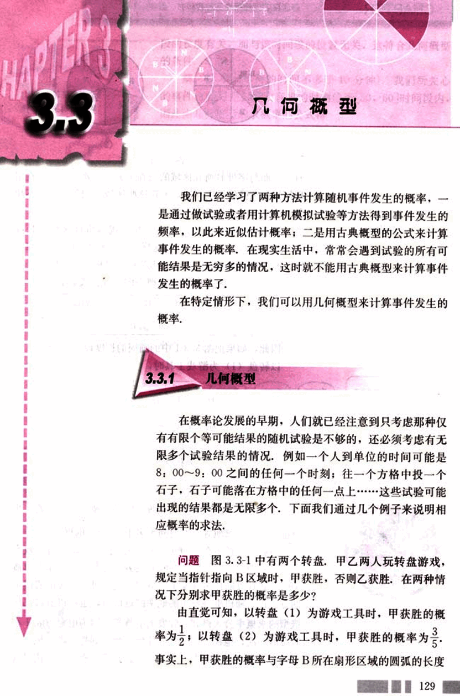
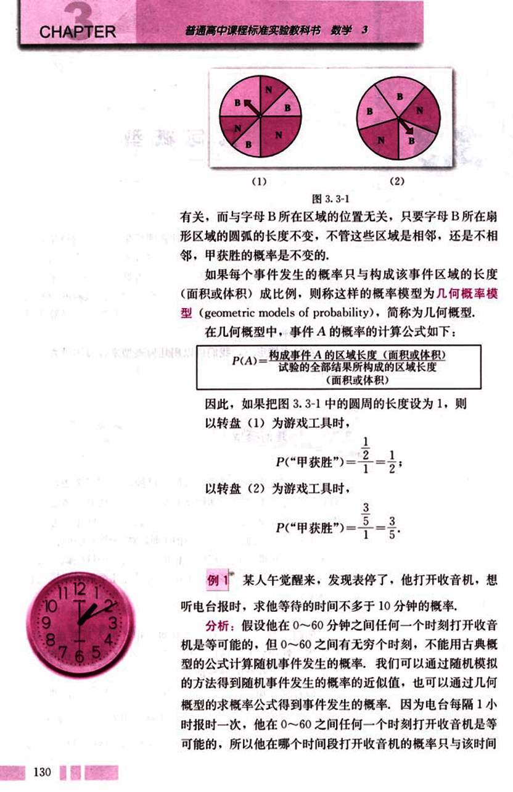
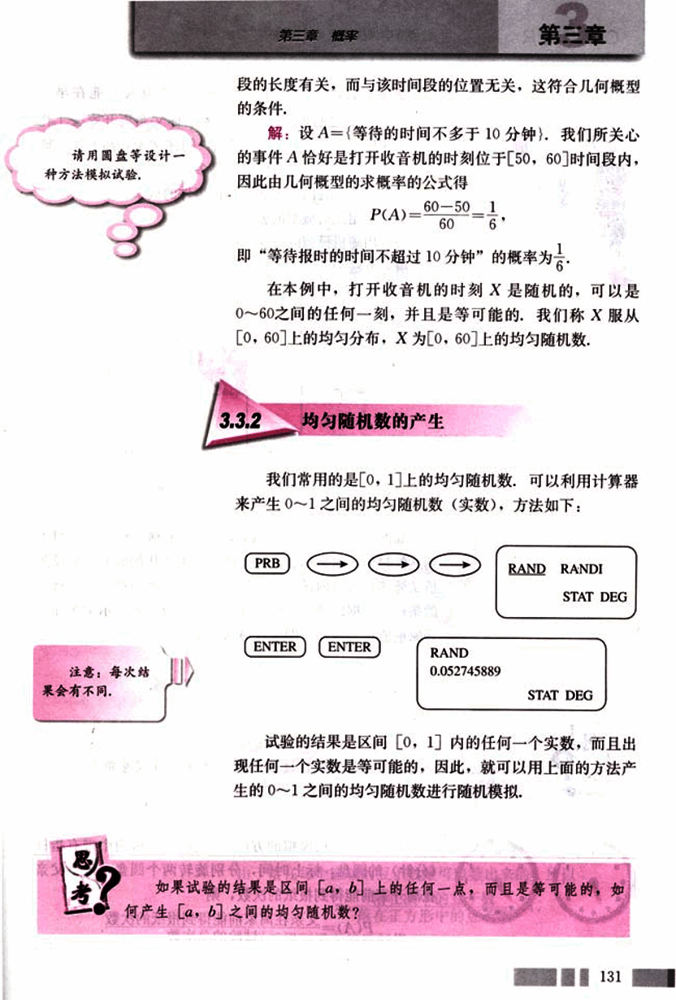
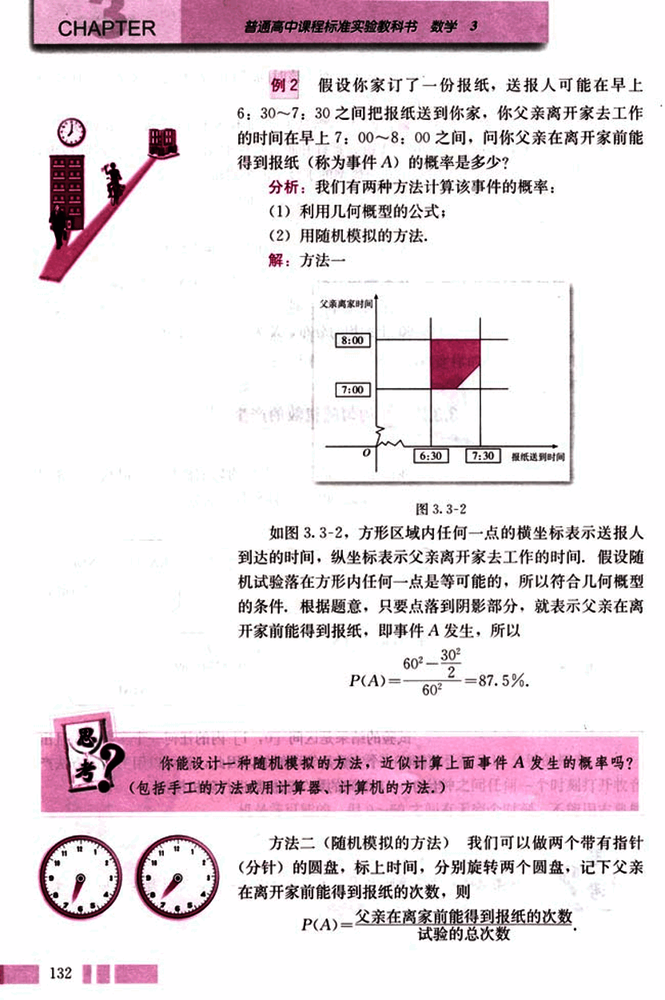
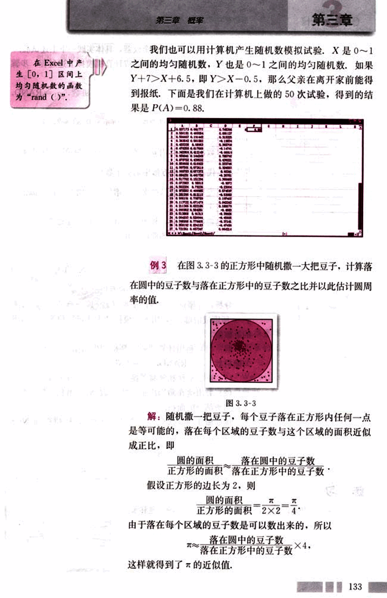
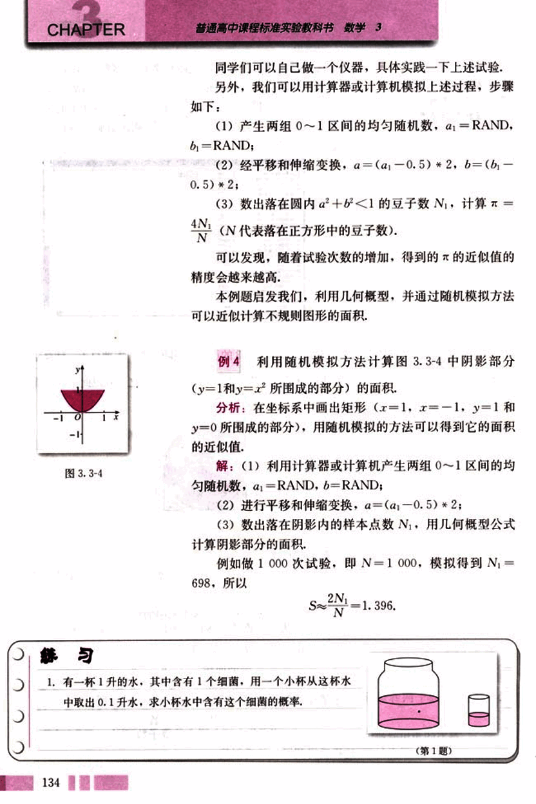
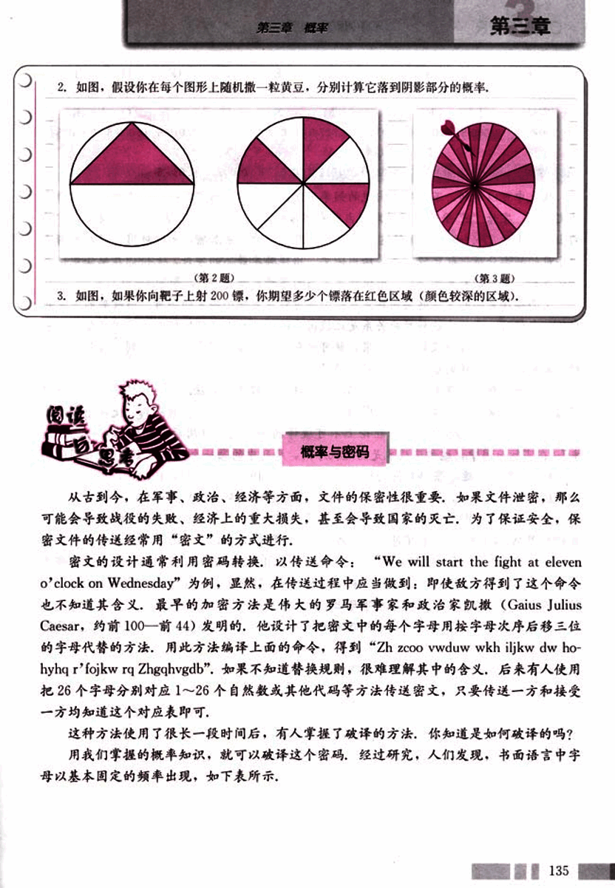
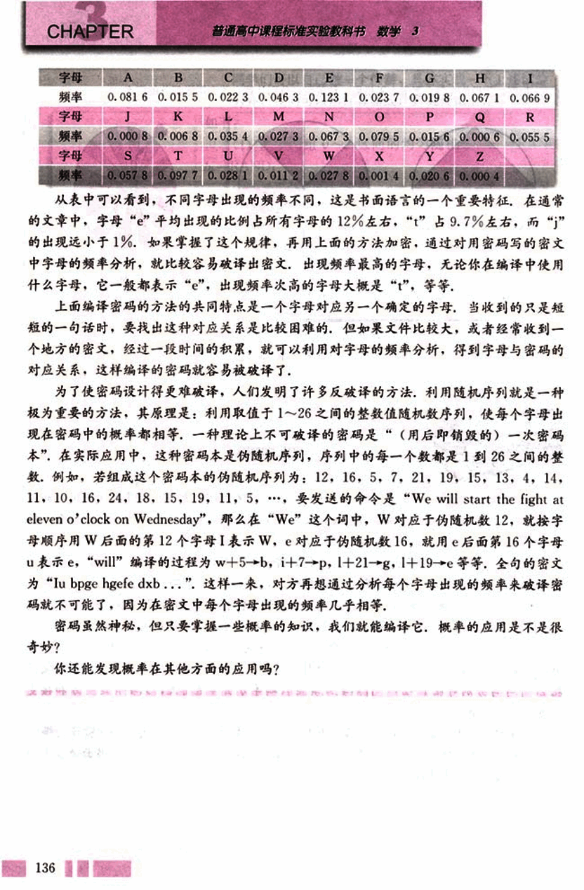
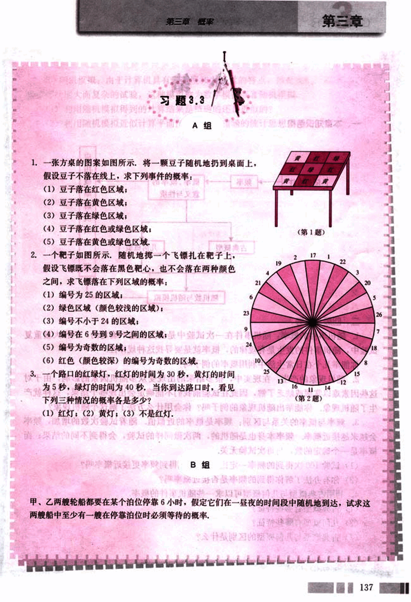

# 3.3　几何概型

141

# 3.3 几何概型

我们已经学习了两种方法计算随机事件发生的概率，一是通过做试验或者用计算机模拟试验等方法得到事件发生的频率，以此来近似估计概率；二是用古典概型的公式来计算事件发生的概率。在现实生活中，常常会遇到试验的所有可能结果是无穷多的情况，这时就不能用古典概型来计算事件发生的概率了。

在特定情形下，我们可以用几何概型来计算事件发生的概率。

## 3.3.1 几何概型

在概率论发展的早期，人们就已经注意到只考虑那种仅有有限个等可能结果的随机试验是不够的，还必须考虑有无限多个试验结果的情况。例如一个人到单位的时间可能是8:00~9:00之间的任何一个时刻；往一个方格中投一个石子，石子可能落在方格中的任何一点上……这些试验可能出现的结果都是无限多个，下面我们通过几个例子来说明相应概率的求法。

**问题** 图3.3-1中有两个转盘，甲乙两人玩转盘游戏，规定当指针指向B区域时，甲获胜，否则乙获胜。在两种情况下分别求甲获胜的概率是多少？

由直觉可知，以转盘(1)为游戏工具时，甲获胜的概率为$\frac{1}{4}$；以转盘(2)为游戏工具时，甲获胜的概率为$\frac{3}{5}$。事实上，甲获胜的概率与字母B所在扇形区域的圆弧的长度成正比。

142

# CHAPTER 3

## 图3.3-1

有关，而与字母B所在区域的位置无关，只要字母B所在扇形区域的圆弧的长度不变，不管这些区域是相邻，还是不相邻，甲获胜的概率是不变的。

如果每个事件发生的概率只与构成该事件区域的长度（面积或体积）成比例，则称这样的概率模型为几何概率模型(geometric models of probability)，简称为几何概型。

在几何概型中，事件A的概率的计算公式如下：

$P(A) = \frac{构成事件A的区域长度(面积或体积)}{试验的全部结果所构成的区域长度(面积或体积)}$

因此，如果把图3.3-1中的圆周的长度设为1，则

以转盘(1)为游戏工具时，

$P( “甲获胜” ) = \frac{\frac{1}{2}}{1} = \frac{1}{2}$；

以转盘(2)为游戏工具时，

$P( “甲获胜” ) = \frac{\frac{3}{5}}{1} = \frac{3}{5}$。

## 例1

某人午觉醒来，发现表停了，他打开收音机，想听电台报时，求他等待的时间不多于10分钟的概率。

**分析：**假设他在0～60分钟之间任何一个时刻打开收音机是等可能的，但0～60之间有无穷个时刻，不能用古典概型的公式计算随机事件发生的概率，我们可以通过随机模拟的方法得到随机事件发生的概率的近似值，也可以通过几何概型的求概率公式得到事件发生的概率，因为电台每隔1小时报时一次，他在0～60之间任何一个时刻打开收音机是等可能的，所以他在哪个时间段打开收音机的概率只与该时间

---

143

# 第三章 概率

## 段的长度有关，而与该时间段的位置无关，这符合几何概型的条件。

**解：**设A={等待的时间不多于10分钟}，我们所关心的事件A恰好是打开收音机的时刻位于[50, 60]时间段内，因此由几何概型的求概率的公式得

$P(A) = \frac{60 - 50}{60} = \frac{1}{6}$

即“等待报时的时间不超过10分钟”的概率为$\frac{1}{6}$。

在本例中，打开收音机的时刻X是随机的，可以是0~60之间的任何一刻，并且是等可能的，我们称X服从[0, 60]上的均匀分布，X为[0, 60]上的均匀随机数。

## 3.3.2 均匀随机数的产生

我们常用的是[0, 1]上的均匀随机数，可以利用计算器来产生0~1之间的均匀随机数（实数），方法如下：

PRB → → →

ENTER ENTER

RAND
0.052745889

RAND RANDI
STAT DEG

STAT DEG

**注意：**每次结果会有不同。

试验的结果是区间[0, 1]内的任何一个实数，而且出现任何一个实数是等可能的，因此，就可以用上面的方法产生的0~1之间的均匀随机数进行随机模拟。

**思考**

如果试验的结果是区间[a, b]上的任何一点，而且是等可能的，如何产生[a, b]之间的均匀随机数？

131

144

# CHAPTER

普通高中课程标准实验教科书 数学 3

## 例2

假设你家订了一份报纸，送报人可能在早上6:30~7:30之间把报纸送到你家，你父亲离开家去工作的时间在早上7:00~8:00之间，问你父亲在离开家前能得到报纸（称为事件A）的概率是多少？

分析：我们有两种方法计算该事件的概率：

(1) 利用几何概型的公式；
(2) 用随机模拟的方法。

解：方法一

父亲离家时间
8:00
7:00
0
6:30 7:30 报纸送到时间

图3.3-2

如图3.3-2，方形区域内任何一点的横坐标表示送报人到达的时间，纵坐标表示父亲离开家去工作的时间，假设随机试验落在方形内任何一点是等可能的，所以符合几何概型的条件，根据题意，只要点落到阴影部分，就表示父亲在离开家前能得到报纸，即事件A发生，所以

$P(A) = \frac{30^2}{60^2} = \frac{30^2}{2 \times 60^2} = 87.5\%$.

你能设计一种随机模拟的方法，近似计算上面事件A发生的概率吗？（包括手工的方法或用计算器、计算机的方法。）

方法二（随机模拟的方法） 我们可以做两个带有指针（分针）的圆盘，标上时间，分别旋转两个圆盘，记下父亲在离开家前能得到报纸的次数，则

$P(A) = \frac{父亲在离家前能得到报纸的次数}{试验的总次数}$

---

145

# 第三章 概率

## 在Excel中产生[0,1]区间上均匀随机数的函数为“rand()”.

我们也可以用计算机产生随机数模拟试验.X是0~1之间的均匀随机数,Y也是0~1之间的均匀随机数.如果Y+7>X+6.5,即Y>X-0.5,那么父亲在离开家前能得到报纸.下面是我们在计算机上做的50次试验,得到的结果是P(A)=0.88.

[excel_table](images/excel_table.png)

## 例3

在图3.3-3的正方形中随机撒一大把豆子,计算落在圆中的豆子数与落在正方形中的豆子数之比并以此估计圆周率的值.

[image](images/3.3-3.png)

**图 3.3-3**

解:随机撒一把豆子,每个豆子落在正方形内任何一点是等可能的,落在每个区域的豆子数与这个区域的面积近似成正比,即

$\frac{圆的面积}{正方形的面积} \approx \frac{落在圆中的豆子数}{落在正方形中的豆子数}$

假设正方形的边长为2,则

$\frac{圆的面积}{正方形的面积} = \frac{\pi}{4}$

由于落在每个区域的豆子数是可以数出来的,所以

$\pi \approx \frac{落在圆中的豆子数}{落在正方形中的豆子数} \times 4$

这样就得到了π的近似值.

133

146

# CHAPTER 3

同学们可以自己做一个仪器，具体实践一下上述试验，另外，我们可以用计算器或计算机模拟上述过程，步骤如下：

(1)产生两组0～1区间的均匀随机数，$a_1$=RAND，$b_1$=RAND；

(2)经平移和伸缩变换，$a = (a_1 - 0.5) * 2$，$b = (b_1 - 0.5) * 2$；

(3)数出落在圆内$a^2 + b^2 < 1$的豆子数$N_1$，计算$\pi \approx \frac{4N_1}{N}$（N代表落在正方形中的豆子数）。

可以发现，随着试验次数的增加，得到的$\pi$的近似值的精度会越来越高。

本例题启发我们，利用几何概型，并通过随机模拟方法可以近似计算不规则图形的面积。

## 例 4

利用随机模拟方法计算图[3.3-4](images/3.3-4.png)中阴影部分($y = 1$和$y = x^2$所围成的部分)的面积。

**分析:** 在坐标系中画出矩形($x = 1$，$x = -1$，$y = 1$和$y = 0$所围成的部分)，用随机模拟的方法可以得到它的面积的近似值。

**解:** (1)利用计算器或计算机产生两组0～1区间的均匀随机数，$a_1$=RAND，$b_1$=RAND；

(2)进行平移和伸缩变换，$a = (a_1 - 0.5) * 2$；

(3)数出落在阴影内的样本点数$N_1$，用几何概型公式计算阴影部分的面积。

例如做1000次试验，即N = 1000，模拟得到$N_1 = 698$，所以

$S \approx \frac{2N_1}{N} = 1.396$。

## 练习

1. 有一杯1升的水，其中含有1个细菌，用一个小杯从这杯水中取出0.1升水，求小杯水中含有这个细菌的概率。

[图1](images/1.png)

134

147

# 第三章 概率

2. 如图，假设你在每个图形上随机撒一粒黄豆，分别计算它落到阴影部分的概率。

(第2题)  (第3题)

3. 如图，如果你向靶子上射200镖，你期望多少个镖落在红色区域（颜色较深的区域）。

## 概率与密码

从古到今，在军事、政治、经济等方面，文件的保密性很重要，如果文件泄密，那么可能会导致战役的失败、经济上的重大损失，甚至会导致国家的灭亡。为了保证安全，保密文件的传送经常用“密文”的方式进行。

密文的设计通常利用密码转换，以传送命令：“We will start the fight at eleven o'clock on Wednesday”为例，显然，在传送过程中应当做到：即使敌方得到了这个命令也不知道其含义。最早的加密方法是伟大的罗马军事家和政治家凯撒(Gaius Julius Caesar，约前100——前44)发明的，他设计了把密文中的每个字母用按字母次序后移三位 的字母代替的方法。用此方法编译上面的命令，得到“Zhzcoo vwduw wkh iljkw dw hohyhq r'fojkw rq Zhgqhvgdb”。如果不知道替换规则，很难理解其中的含义。后来有人使用把26个字母分别对应1～26个自然数或其他代码等方法传送密文，只要传送一方和接受一方均知道这个对应表即可。

这种方法使用了很长一段时间后，有人掌握了破译的方法，你知道是如何破译的吗？用我们掌握的概率知识，就可以破译这个密码，经过研究，人们发现，书面语言中字母以基本固定的频率出现，如下表所示。

135

148

# CHAPTER 3

## 字母频率表

| 字母 | 频率 | 字母 | 频率 | 字母 | 频率 | 字母 | 频率 | 字母 | 频率 | 字母 | 频率 | 字母 | 频率 | 字母 | 频率 |
|---|---|---|---|---|---|---|---|---|---|---|---|---|---|---|
| A | 0.081 6 | B | 0.015 5 | C | 0.022 3 | D | 0.046 3 | E | 0.123 1 | F | 0.023 7 | G | 0.019 8 | H | 0.067 1 | I | 0.066 9 |
| J | 0.000 8 | K | 0.006 8 | L | 0.035 4 | M | 0.027 3 | N | 0.067 3 | O | 0.079 5 | P | 0.015 6 | Q | 0.000 6 | R | 0.055 5 |
| S | 0.057 8 | T | 0.097 7 | U | 0.028 1 | V | 0.011 2 | W | 0.027 8 | X | 0.001 4 | Y | 0.020 6 | Z | 0.000 4 |

从表中可以看到，不同字母出现的频率不同，这是书面语言的一个重要特征。在通常的文章中，字母“e”平均出现的比例占所有字母的12%左右，“t”占9.7%左右，而“j”的出现远小于1%。如果掌握了这个规律，再用上面的方法加密，通过对用密码写的密文中字母的频率分析，就比较容易破译出密文。出现频率最高的字母，无论你在编译中使用什么字母，它一般都表示“e”，出现频率次高的字母大概是“t”，等等。

上面编译密码的方法的共同特点是一个字母对应另一个确定的字母，当收到的只是短短的一句话时，要找出这种对应关系是比较困难的，但如果文件比较大，或者经常收到一个地方的密文，经过一段时间的积累，就可以利用对字母的频率分析，得到字母与密码的对应关系，这样编译的密码就容易被破译了。

为了使密码设计得更难破译，人们发明了许多反破译的方法。利用随机序列就是一种极为重要的方法，其原理是：利用取值于1～26之间的整数值随机数序列，使每个字母出现在密码中的概率都相等。一种理论上不可破译的密码是“(用后即销毁的)一次密码本”，在实际应用中，这种密码本是伪随机序列，序列中的每一个数都是1到26之间的整数。例如，若组成这个密码本的伪随机序列为：12, 16, 5, 7, 21, 19, 15, 13, 4, 14, 11, 10, 16, 24, 18, 15, 19, 11, 5,…，要发送的命令是“We will start the fight at eleven o'clock on Wednesday”，那么在“We”这个词中，W对应于伪随机数12，就按字母顺序用W后面的第12个字母I表示W，e对应于伪随机数16，就用e后面第16个字母u表示e，“will”编译的过程为w+5→b，i+7→p，l+21→g，l+19→e等等，全句的密文为“Iu bpge hgefe dxb…”。这样一来，对方再想通过分析每个字母出现的频率来破译密码就不可能了，因为在密文中每个字母出现的频率几乎相等。

密码虽然神秘，但只要掌握一些概率的知识，我们就能破译它。概率的应用是不是很奇妙？

你还能发现概率在其他方面的应用吗？

136

149

# 第三章 概率

## 第三章

## 习题 3.3

### A 组

1. 一张方桌的图案如图所示，将一颗豆子随机地扔到桌面上，假设豆子不落在线上，求下列事件的概率：
(1) 豆子落在红色区域；
(2) 豆子落在黄色区域；
(3) 豆子落在绿色区域；
(4) 豆子落在红色或绿色区域；
(5) 豆子落在黄色或绿色区域。

2. 一个靶子如图所示，随机地掷一个飞镖扎在靶子上，假设飞镖既不会落在黑色靶心，也不会落在两种颜色之间，求飞镖落在下列区域的概率：
(1) 编号为 25 的区域；
(2) 绿色区域（颜色较浅的区域）；
(3) 编号不小于 24 的区域；
(4) 编号在 6 号到 9 号之间的区域；
(5) 编号为奇数的区域；
(6) 红色（颜色较深）的编号为奇数的区域。

3. 一个路口的红绿灯，红灯的时间为 30 秒，黄灯的时间为 5 秒，绿灯的时间为 40 秒，当你到达路口时，看见下列三种情况的概率各是多少？
(1) 红灯； (2) 黄灯； (3) 不是红灯。

### B 组

甲、乙两艘轮船都要在某个泊位停靠 6 小时，假定它们在一昼夜的时间段中随机地到达，试求这两艘船中至少有一艘在停靠泊位时必须等待的概率。

