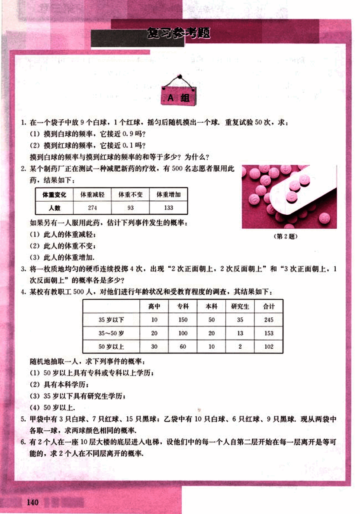
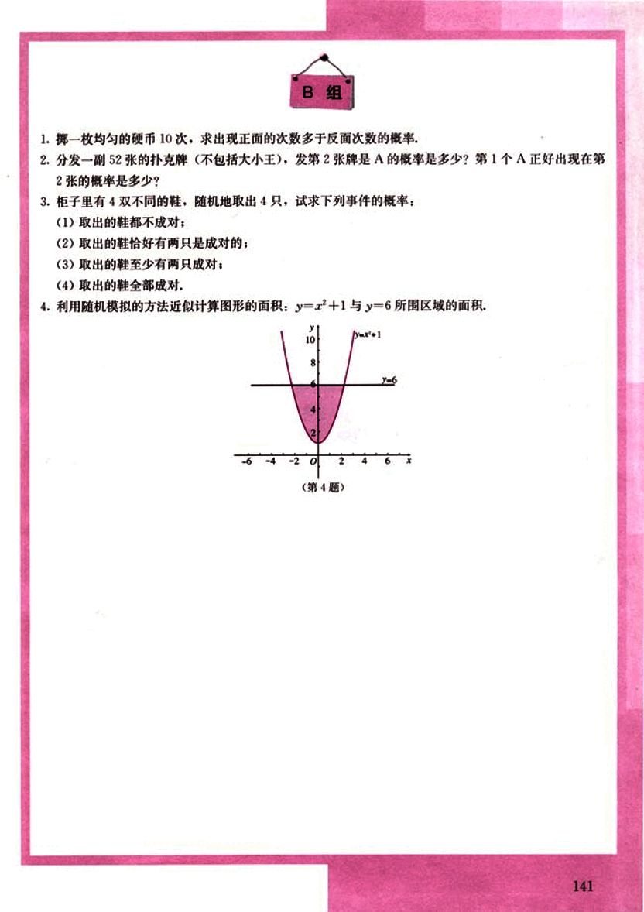

# 复习参考题

152

# 复习参考题

## A组

1. 在一个袋子中放9个白球，1个红球，摇匀后随机摸出一个球，重复试验50次，求：
(1) 摸到白球的频率，它接近0.9吗？
(2) 摸到红球的频率，它接近0.1吗？

摸到白球的频率与摸到红球的频率的和等于多少？为什么？

2. 某个制药厂正在测试一种减肥新药的疗效，有500名志愿者服用此药，结果如下：

| 体重变化 | 体重减轻 | 体重不变 | 体重增加 |
|---|---|---|---|
| 人数 | 274 | 93 | 133 |

如果另有一人服用此药，估计下列事件发生的概率：
(1) 此人的体重减轻；
(2) 此人的体重不变；
(3) 此人的体重增加。

(第2题)

3. 将一枚质地均匀的硬币连续投掷4次，出现“2次正面朝上，2次反面朝上”和“3次正面朝上，1次反面朝上”的概率各是多少？

4. 某校有教职工500人，对他们进行年龄状况和受教育程度的调查，其结果如下：

|  | 高中 | 专科 | 本科 | 研究生 | 合计 |
|---|---|---|---|---|---|
| 35岁以下 | 10 | 150 | 50 | 35 | 245 |
| 35～50岁 | 20 | 100 | 20 | 13 | 153 |
| 50岁以上 | 30 | 60 | 10 | 2 | 102 |

随机地抽取一人，求下列事件的概率：
(1) 50岁以上具有专科或专科以上学历；
(2) 具有本科学历；
(3) 35岁以下具有研究生学历；
(4) 50岁以上。

5. 甲袋中有3只白球，7只红球，15只黑球；乙袋中有10只白球，6只红球，9只黑球，现从两袋中各取一球，求两球颜色相同的概率。

6. 有2个人在一座10层大楼的底层进入电梯，设他们中的每一个人自第二层开始在每一层离开是等可能的，求2个人在不同层离开的概率。

140

153

# B组

1. 掷一枚均匀的硬币10次，求出现正面的次数多于反面次数的概率。

2. 分发一副52张的扑克牌（不包括大小王），发第2张牌是A的概率是多少？第1个A正好出现在第2张的概率是多少？

3. 柜子里有4双不同的鞋，随机地取出4只，试求下列事件的概率：
    (1) 取出的鞋都不成对；
    (2) 取出的鞋恰好有两只是成对的；
    (3) 取出的鞋至少有两只成对；
    (4) 取出的鞋全部成对。

4. 利用随机模拟的方法近似计算图形的面积：$y = x^2 + 1$与$y = 6$所围区域的面积。

(第4题)

141

