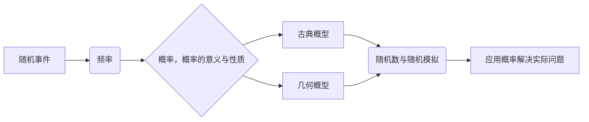
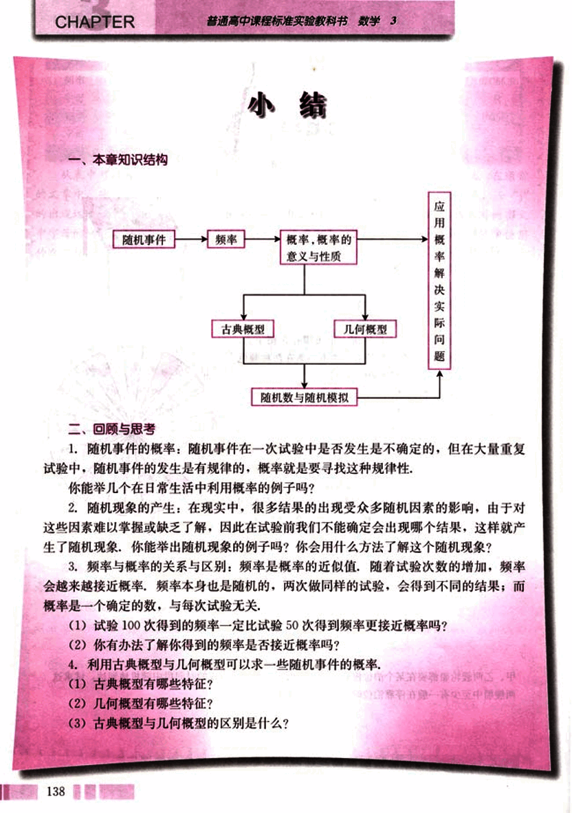
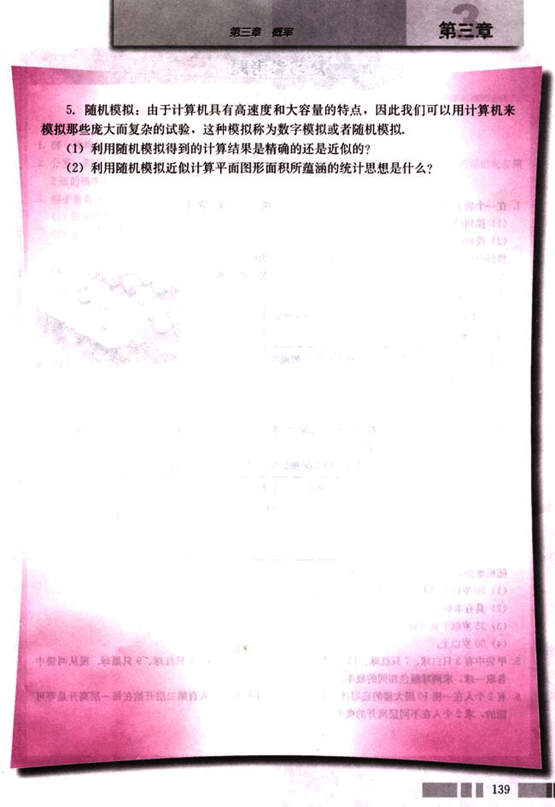

# 小结

150

# 小结

## 一、本章知识结构

## 二、回顾与思考

1. 随机事件的概率：随机事件在一次试验中是否发生是不确定的，但在大量重复试验中，随机事件的发生是有规律的，概率就是要寻找这种规律性。

你能举几个在日常生活中利用概率的例子吗？

2. 随机现象的产生：在现实中，很多结果的出现受众多随机因素的影响，由于对这些因素难以掌握或缺乏了解，因此在试验前我们不能确定会出现哪个结果，这样就产生了随机现象，你能举出随机现象的例子吗？你会用什么方法了解这个随机现象？

3. 频率与概率的关系与区别：频率是概率的近似值，随着试验次数的增加，频率会越来越接近概率，频率本身也是随机的，两次做同样的试验，会得到不同的结果；而概率是一个确定的数，与每次试验无关。

(1) 试验100次得到的频率一定比试验50次得到频率更接近概率吗？

(2) 你有办法了解你得到的频率是否接近概率吗？

4. 利用古典概型与几何概型可以求一些随机事件的概率。

(1) 古典概型有哪些特征？

(2) 几何概型有哪些特征？

(3) 古典概型与几何概型的区别是什么？

138

151

# 第三章 概率

## 5. 随机模拟

由于计算机具有高速度和大容量的特点，因此我们可以用计算机来模拟那些庞大而复杂的试验，这种模拟称为数字模拟或者随机模拟。

(1) 利用随机模拟得到的计算结果是精确的还是近似的？

(2) 利用随机模拟近似计算平面图形面积所蕴涵的统计思想是什么？

139

