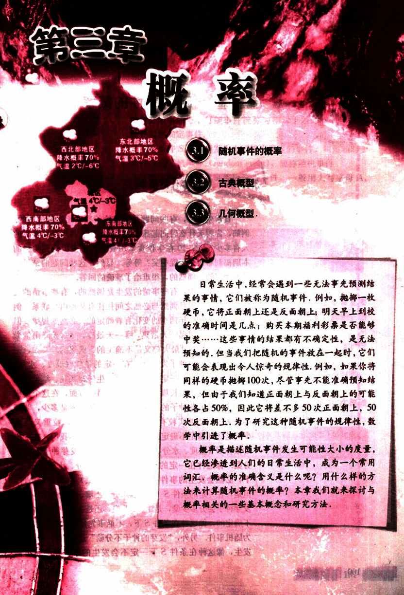

# 第3章　概率

110

# 飞镖的命中点，摇奖机摇出的号码都是随机的，概率论就是研究随机现象规律的科学，现已被广泛应用于科学和工农业生产等诸多领域，例如，天气预报、台风预报等都离不开概率。

111

# 第三章 概率

## 3.1 随机事件的概率

## 3.2 古典概型

## 3.3 几何概型

日常生活中，经常会遇到一些无法事先预测结果的事情，它们被称为随机事件，例如，抛掷一枚硬币，它将正面朝上还是反面朝上；明天早上到校的准确时间是几点；购买本期福利彩票是否能够中奖……这些事情的结果都有不确定性，是无法预知的，但当我们将随机的事件放在一起时，它们可能会表现出令人惊奇的规律性，例如，如果你将同样的硬币抛掷100次，尽管事先不能准确预知结果，但由于我们知道正面朝上与反面朝上的可能性各占50%，因此它将差不多50次正面朝上，50次反面朝上。为了研究这种随机事件的规律性，数学中引进了概率。

概率是描述随机事件发生可能性大小的度量，它已经渗透到人们的日常生活中，成为一个常用词汇。概率的准确含义是什么呢？用什么样的方法来计算随机事件的概率？本章我们就来探讨与概率相关的一些基本概念和研究方法。

