# 0 封面

2

# 普通高中课程标准实验教科书
## 数学 4  必修

人民教育出版社 课程教材研究所 编著
中学数学课程教材研究开发中心

[laptop](images/laptop.png)

经全国中小学教材审定委员会 2004年初审通过

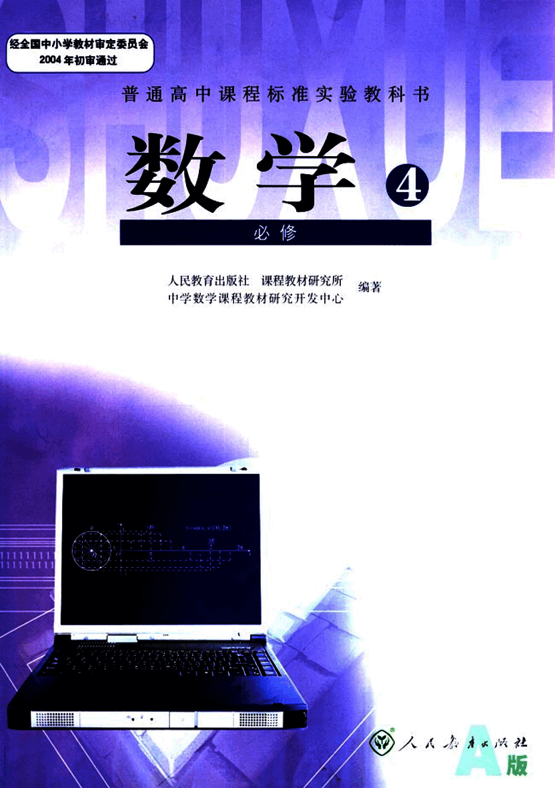
3

# 数学 4

必修

人民教育出版社 课程教材研究所 编著
中学数学课程教材研究开发中心

[laptop](images/laptop.png)

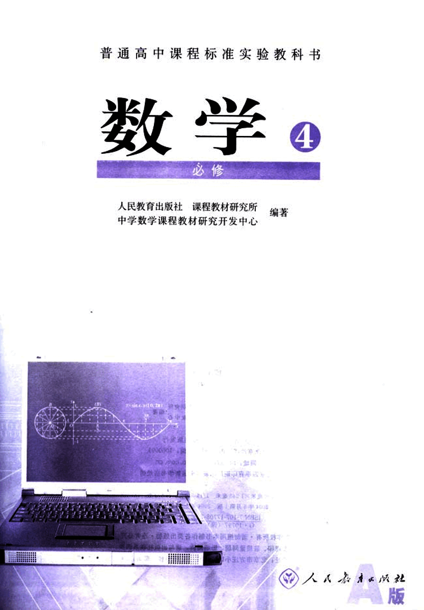
4

# 主编：刘绍学
## 副主编：钱珮玲 章建跃

### 本册主编：章建跃
### 主要编者：章建跃 任子朝 张劲松 蒋佩锦
### 责任编辑：章建跃
### 美术编辑：王俊宏 王艾
### 封面设计：林荣桓

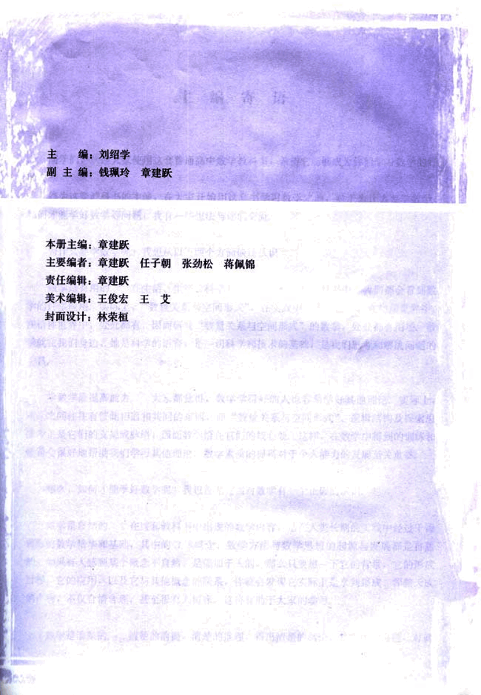
5

# 本册导引

我们根据《普通高中数学课程标准(实验)》编写了这套实验教科书。

本书是高中数学必修课程5个模块中的一个，包括三角函数、平面向量与三角恒等变换等三章内容。三角函数是一类基本的、重要的函数，在数学、其他科学以及生产实践中都有广泛的应用；三角函数的学习是对函数概念的深化；平面向量有着极其丰富的实际背景，是近代数学中重要和基本的概念之一，它是沟通代数、几何与三角函数的一种工具；三角恒等变换在数学中有一定的应用，对发展我们的推理能力和运算能力都有好处。

在数学1中，同学们学习了函数的一些基本概念，并学了指数函数、对数函数、幂函数等具体函数。与这些函数比较，三角函数是刻画现实世界中存在的那些具有周期性变化现象的数学模型。在本章中，同学们将通过实例，学习三角函数及其基本性质，体会三角函数在解决具有周期变化规律的问题中的作用。

从解析几何的学习中，同学们可以感受到代数方法（数及其运算）在研究几何问题中的作用和有效性；通过本章的学习可以发现，向量方法（向量及其运算）是研究几何的另一个好工具。在本章中，同学们将在了解向量的实际背景的基础上，学习平面向量及其运算的一些基本知识，用向量的语言和方法来表述和解决数学、物理中的一些问题，从中可以看出向量这一工具的强大力量。

在过去的学习中，同学们曾经接触过大量“只变其形不变其质”的代数变换，这种变换是解决数学问题的重要手段；三角变换也是“只变其形不变其质”的，这种变换也是解决问题所必需的。在本章中，同学们将运用向量的方法推导基本的三角恒等变换公式，由此出发导出其他的三角恒等变换公式，并运用这些公式进行简单的恒等变换。

学习始于疑问，在本书中，我们将通过适当的问题情景，引出需要学习的数学内容，然后在“观察”“思考”“探究”等活动中，引导同学们自己发现问题、提出问题，通过亲身实践、主动思维，经历不断的从具体到抽象、从特殊到一般的抽象概括活动来理解和掌握数学基础知识，打下坚实的数学基础。

学而不思则罔，只有通过自己的独立思考，并掌握科学的思维方法才能真正学会数学。在本书中，我们将利用数学内容之间的内在联系，特别是蕴涵在数学知识中的数学思想方法，启发和引导同学们学习类比、推广、特殊化、化归等数学思考的常用逻辑方法，使同学们学会数学思考与推理，不断提高数学思维能力。

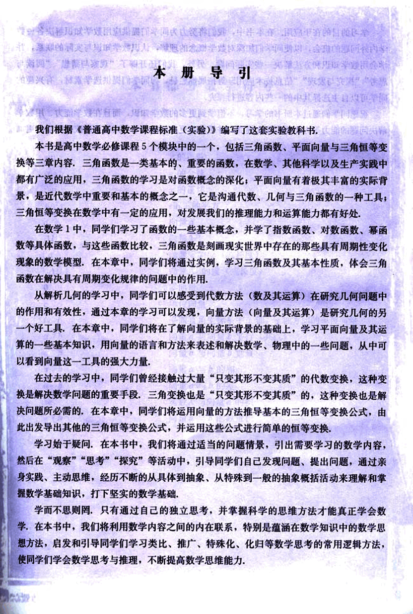
6

# 学习的目的在于应用

学习的目的在于应用。在本书中，我们将努力为同学们提供应用数学知识解决各种数学内外问题的机会，以使同学们加深对数学概念的理解，认识数学知识与实际的联系，并学会用数学知识和方法解决一些实际问题。另外，我们还开辟了“观察与猜想”、“阅读与思考”、“探究与发现”、“信息技术应用”等拓展性栏目，为同学们提供选学素材，有兴趣的同学可以自主选择其中的一些内容进行探究。

祝愿同学们通过本册书的学习，不但学到更多的数学知识，而且在数学能力、用数学解决问题的能力等方面都有较大提高，并培养起更高的数学学习兴趣，形成对数学的更加全面的认识。

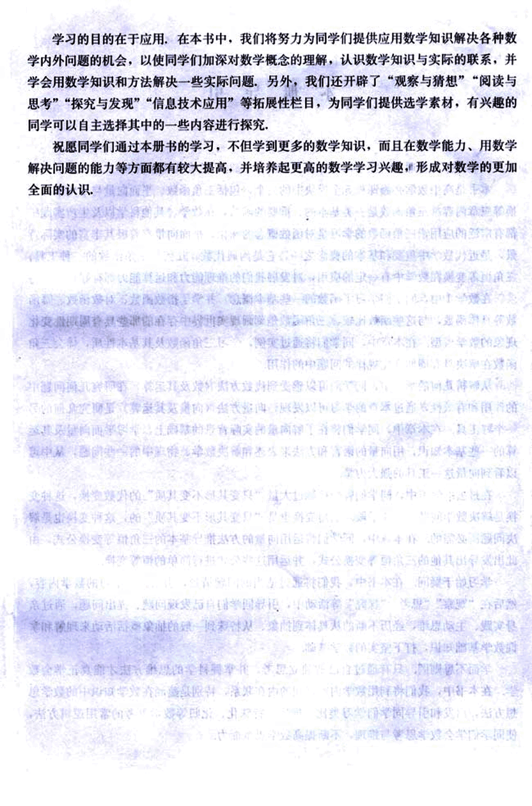
7

# 本书部分数学符号

sin x  x的正弦
cos x  x的余弦
tan x  x的正切
sin²x  sin x的平方
a 向量a
$\overline{AB}$ 向量AB
|a| 向量a的模(或长度)
|$ \overline{AB} $| 向量AB的模(或长度)
0 零向量
e 单位向量
i, j 平面直角坐标系中x轴,y轴方向的单位向量
a//b 向量a与向量b平行(共线)
$a \perp b$ 向量a与向量b垂直
a + b 向量a与b的和
a - b 向量a与b的差
λa 实数λ与向量的积
a · b 向量a与b的数量积

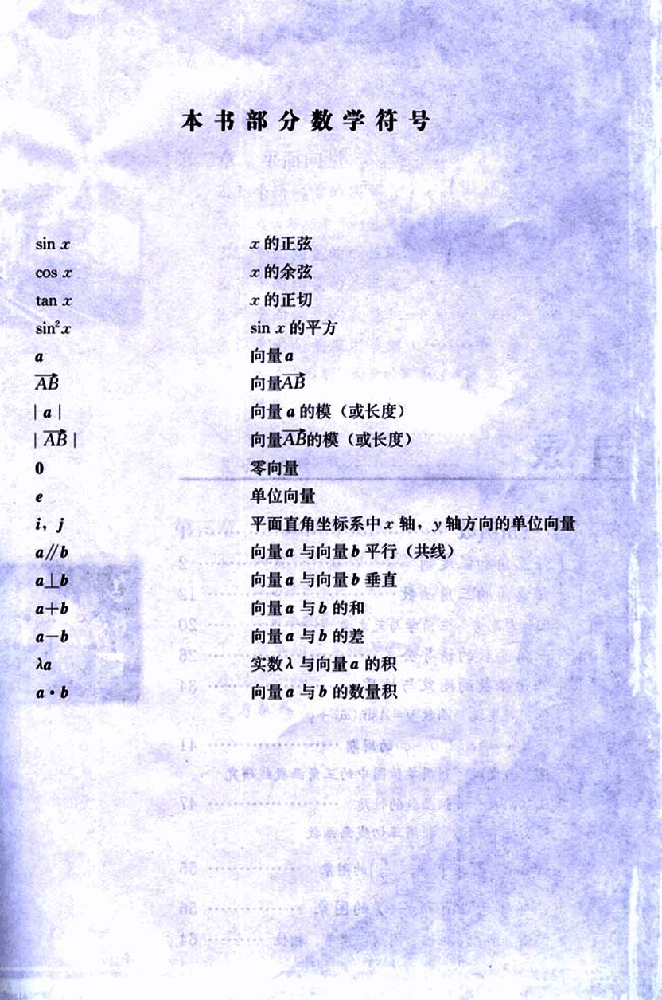
8

# 普通高中课程标准实验教科书
## 数学 4
### 必修
#### A版

人民教育出版社 课程教材研究所 编著
中学数学课程教材研究开发中心 

人人教育出版社 出版发行
(北京沙滩后街55号 邮编:100009)
网址: http://www.pep.com.cn
北京四季青印刷厂印装 全国新华书店经销

开本: 890毫米×1240毫米 1/16 印张: 11 字数: 211 000
2004年5月第1版 2004年10月第1次印刷
ISBN 7-107-17708-7 定价: 11.70元
G・10797 (课)

著作权所有,请勿擅用本书制作各类出版物・违者必究
如发现印、装质量问题,影响阅读,请与出版社联系调换。
(联系地址:北京市方庄小区芳城园三区13号楼 邮编:100078)

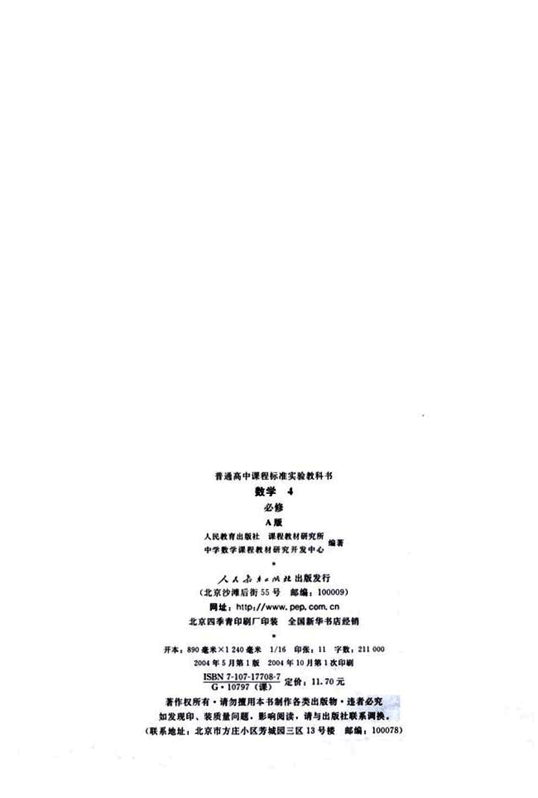
9

# 主编寄语

同学们，欢迎大家使用这套普通高中数学教科书，希望它能够成为你们学习数学的好朋友。

作为这套教科书的主编，在大家开始用这套书学习数学之前，对于为什么要学数学，如何才能学好数学等问题，我有一些想法与你们交流。

## 为什么学数学？

我想从以下两个方面谈谈认识。

### 数学是有用的

在生活、生产、科学和技术中，在这套教科书中，我们都会看到数学的许多应用。实际上，“数量关系与空间形式”，在实践中，在理论中，在物质世界中，在精神世界中，处处都有，因而研究“数量关系与空间形式”的数学，处处都有用场。数学就在我们身边，她是科学的语言，是一切科学和技术的 基础，是我们思考和解决问题的工具。

### 数学能提高能力

大家都觉得，数学学得好的人也容易学好其他理论。实际上，理论之间往往有彼此相通和共同的东西，而“数量关系与空间形式”、逻辑结构及探索思维等正是它们的支架或脉络，因而数学恰在它们的核心处。这样，在数学中得到的训练和修养会很好地帮助我们学习其他理论，数学素质的提高对于个人能力的发展至关重要。

## 如何才能学好数学？

我想首先应当对数学有一个正确的认识。

### 数学是自然的

在这套教科书中出现的数学内容，是在人类长期的实践中经过千锤百炼的数学精华和基础，其中的数学概念、数学方法与数学思想的起源与发展都是自然的。如果有人感到某个概念不自然，是强加于人的，那么只要想一下它的背景，它的形成过程，它的应用，以及它与其他概念的联系，你就会发现它实际上是水到渠成、浑然天成的产物，不仅合情合理，甚至很有人情味，这将有助于大家的学习。

### 数学是清楚的

清楚的前提，清楚的推理，得出清楚的结论，数学中的命题，对就

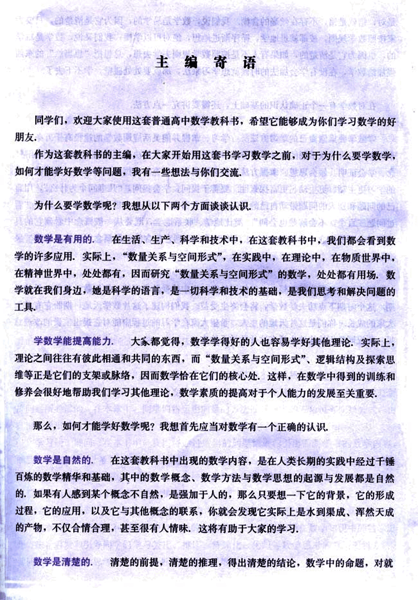
10

# 对数学学习的几点看法

是对，错就是错，不存在丝毫的含糊。我们说，数学是易学的，因为它是清楚的，只要大家按照数学规则，按部就班地学，循序渐进地想，绝对可以学懂；我们又说，数学是难学的，也因为它是清楚的，如果有人不是按照数学规则去学去想，总想把“想当然”的东西强加给数学，在没有学会加法的时候就想学习乘法，那就要处处碰壁，学不下去了。

## 正确的学习方法

在对数学有一个正确认识的基础上，还需要讲究一点方法。

学数学要摸索自己的学习方法。学习、掌握并能灵活应用数学的途径有千万条，每个人都可以有与众不同的数学学习方法。做习题、用数学解决各种问题是必需的；理解概念、学会证明、领会思想、掌握方法也是必需的；还要充分发挥问题的作用，问题使我们的学习更主动、更生动、更富探索性。要善于提问，学会提问，“凡事问个为什么”，用自己的问题和别人的问题带动自己的学习。在这套书中，我们一有机会就提问题，希望“看过问题三百个，不会解题也会问”。类比地学、联系地学，既要从一般概念中看到它的具体背景，不使概念“空洞”，又要在具体例子中想到它蕴含的一般概念，以使事物有“灵魂”。

## 数学学习的最佳时期

同学们，学数学趁年轻！你们正处在一生中接受数学训练、打好数学基础的最佳时期，这个时期下点功夫学数学，将会终生受益。我们构建了这片数学天地，期盼它有益于大家的成长。你们是这片天地的主人，希望大家在学习的过程中能对它提出宝贵的改进意见。预祝同学们愉快地生活在这片数学天地中。

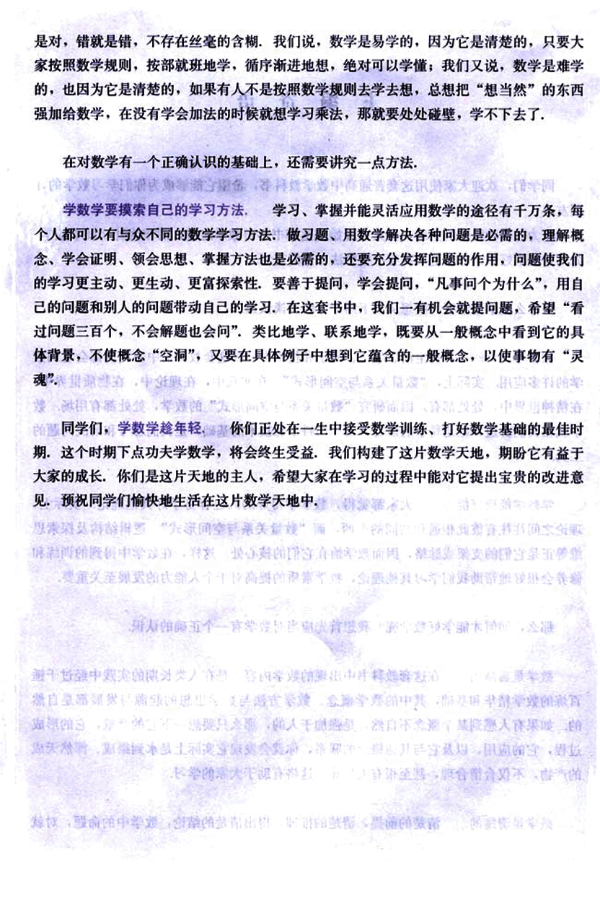
11

# 目录

# 第一章 三角函数

1.1 任意角和弧度制  2
1.2 任意角的三角函数  12
阅读与思考 三角学与天文学  20
1.3 三角函数的诱导公式  26
1.4 三角函数的图象与性质  34
探究与发现 函数y=Asin(ωx+φ)及  
函数y=Acos(ωx+φ)的周期  41
探究与发现 利用单位圆中的三角函数线研究
正弦函数、余弦函数的性质  47
信息技术应用 利用正切线画函数
$y=tan x, x∈(-\frac{\pi}{2}, \frac{\pi}{2})$的图象  55
1.5 函数y=Asin(ωx+φ)的图象  56
阅读与思考 振幅、周期、频率、相位  64

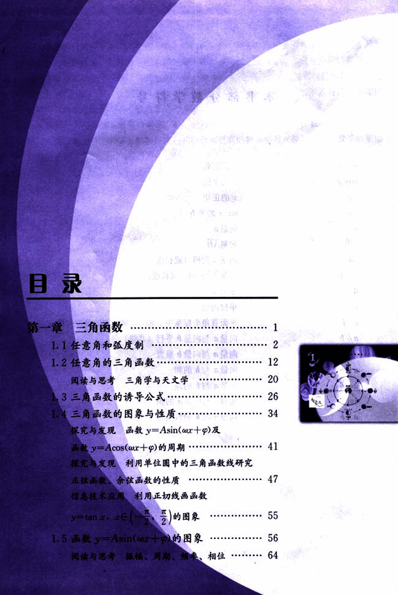
12

# 第二章 平面向量

2.1 平面向量的实际背景及基本概念  84
阅读与思考 向量及向量符号的由来  90
2.2 平面向量的线性运算  91
2.3 平面向量的基本定理及坐标表示  105
2.4 平面向量的数量积  116
2.5 平面向量应用举例  123
阅读与思考 向量的运算(运算律)与图形性质  128
小结  130
复习参考题  132

# 第三章 三角恒等变换

3.1 两角和与差的正弦、余弦和正切公式  138
信息技术应用 利用信息技术制作三角函数表  151
3.2 简单的三角恒等变换  154
小结  160
复习参考题  161

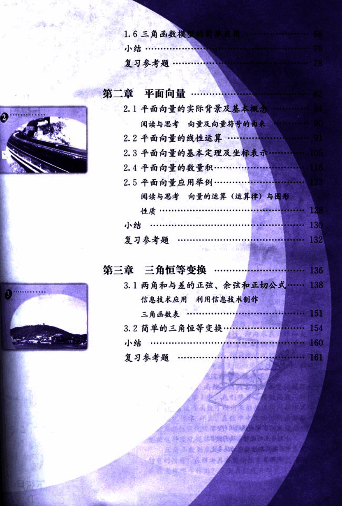
