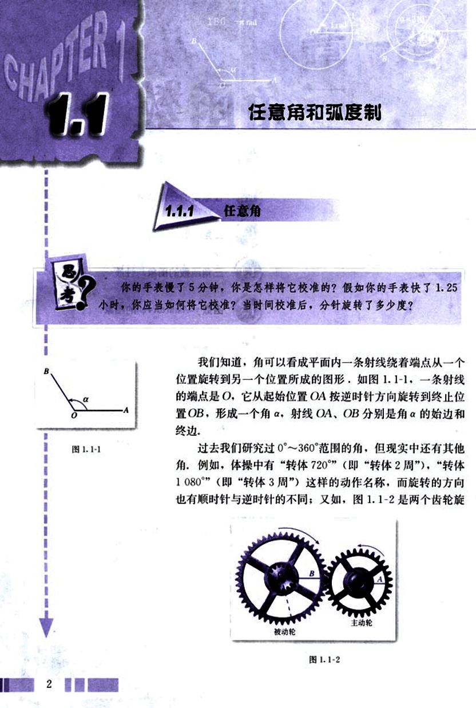
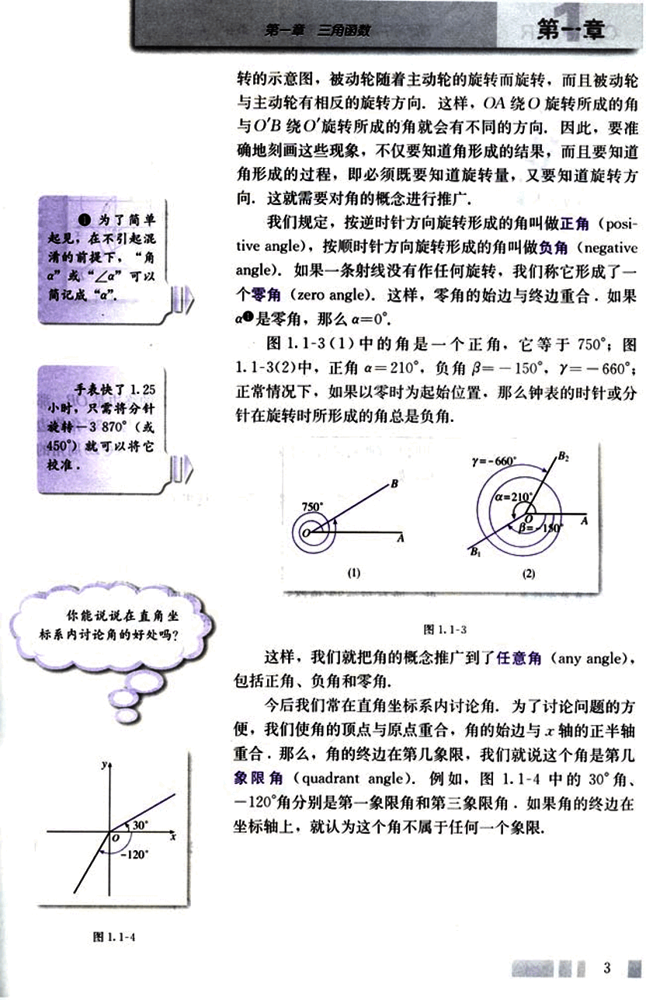
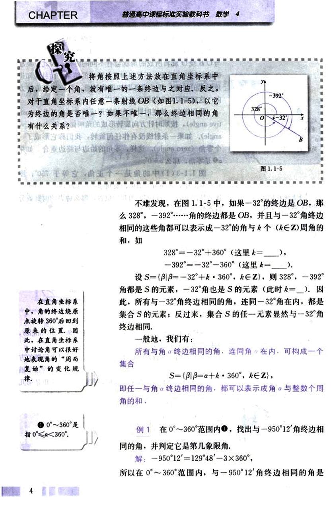
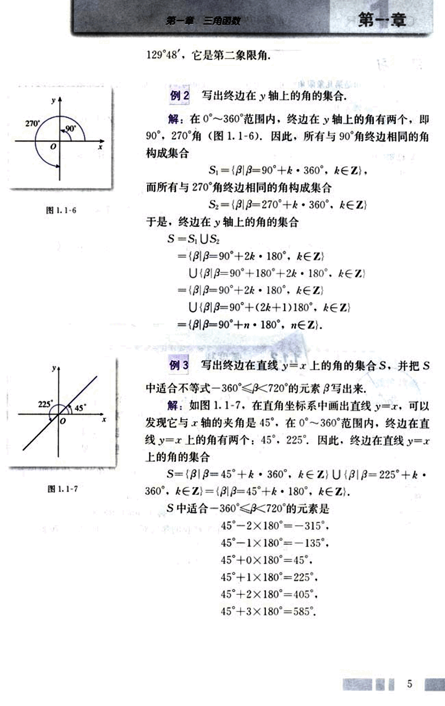

# 1.1.1 任意角

14

# CHAPTER 1
## 1.1 任意角和弧度制

### 1.1.1 任意角

你的手表慢了5分钟，你是怎样将它校准的？假如你的手表快了1.25小时，你应当如何将它校准？当时间校准后，分针旋转了多少度？

我们知道，角可以看成平面内一条射线绕着端点从一个位置旋转到另一个位置所成的图形，如图1.1-1。一条射线的端点是O，它从起始位置OA按逆时针方向旋转到终止位置OB，形成一个角α，射线OA、OB分别是角α的始边和终边。

过去我们研究过0°～360°范围的角，但现实中还有其他角。例如，体操中有“转体720°”（即“转体2周”），“转体1080°”（即“转体3周”）这样的动作名称，而旋转的方向也有顺时针与逆时针的不同；又如，图1.1-2是两个齿轮旋转。

2

15

# 第一章 三角函数

## 第一节

● 为了简单起见,在不引起混淆的前提下,“角a”或“∠a”可以简记成“a”.

手表快了1.25小时,只需将分针旋转-3870°(或450°)就可以将它校准。

你能说说在直角坐标系内讨论角的好处吗？

转的示意图，被动轮随着主动轮的旋转而旋转，而且被动轮与主动轮有相反的旋转方向。这样，OA绕O旋转所成的角与O'B绕O'旋转所成的角就会有不同的方向，因此，要准确地刻画这些现象，不仅要知道角形成的结果，而且要知道角形成的过程，即必须既要知道旋转量，又要知道旋转方向，这就需要对角的概念进行推广。

我们规定，按逆时针方向旋转形成的角叫做正角(positive angle)，按顺时针方向旋转形成的角叫做负角(negative angle)。如果一条射线没有作任何旋转，我们称它形成了一个零角(zero angle)。这样，零角的始边与终边重合。如果α是零角，那么α=0°。

图1.1-3(1)中的角是一个正角，它等于750°；图1.1-3(2)中，正角α=210°，负角β=-150°，γ=-660°；正常情况下，如果以零时为起始位置，那么钟表的时针或分针在旋转时所形成的角总是负角。

[图1.1-3](images/1.1-3.png)

这样，我们就把角的概念推广到了任意角(any angle)，包括正角、负角和零角。

今后我们常在直角坐标系内讨论角。为了讨论问题的方便，我们使角的顶点与原点重合，角的始边与x轴的正半轴重合，那么，角的终边在第几象限，我们就说这个角是第几象限角(quadrant angle)。例如，图1.1-4中的30°角、-120°角分别是第一象限角和第三象限角。如果角的终边在坐标轴上，就认为这个角不属于任何一个象限。

[图1.1-4](images/1.1-4.png)

3

16

# CHAPTER

普通高中课程标准实验教科书 数学 4

## 探究

将角按照上述方法放在直角坐标系中后，给定一个角，就有唯一的一条终边与之对应，反之，对于直角坐标系内任意一条射线OB（如图1.1-5），以它为终边的角是否唯一？如果不唯一，那么终边相同的角有什么关系？

[图1.1-5](images/1.1-5.png)

不难发现，在图1.1-5中，如果-32°的终边是OB，那么328°，-392°……角的终边都是OB，并且与-32°角终边相同的这些角都可以表示成-32°的角与k个($k∈Z$)周角的和，如

328° = -32° + 360° (这里k = ____),

-392° = -32° - 360° (这里k = ____).

设S = {$β | β = -32° + k \cdot 360°$, $k∈Z$}, 则328°，-392°角都是S的元素，-32°角也是S的元素（此时k = __）。因此，所有与-32°角终边相同的角，连同-32°角在内，都是集合S的元素；反过来，集合S的任一元素显然与-32°角终边相同。

一般地，我们有：

所有与角$α$终边相同的角，连同角$α$在内，可构成一个集合

S = {$β | β = α + k \cdot 360°$, $k∈Z$},

即任一与角$α$终边相同的角，都可以表示成角$α$与整数个周角的和。

## 例1

在0°~360°范围内，找出与-950°12′角终边相同的角，并判定它是第几象限角。

解：-950°12′ = 129°48′ - 3 × 360°，

所以在0°~360°范围内，与-950°12′角终边相同的角是

17

# 第一章 三角函数

129°48′,它是第二象限角.

## 例2 写出终边在y轴上的角的集合.

解:在0°~360°范围内,终边在y轴上的角有两个,即90°, 270°角(图1.1-6),因此,所有与90°角终边相同的角构成集合
$S_1 = \{\beta|\beta = 90° + k \cdot 360°，k \in Z\}$，
而所有与270°角终边相同的角构成集合
$S_2 = \{\beta|\beta = 270° + k \cdot 360°，k \in Z\}$
图1.1-6
于是,终边在y轴上的角的集合
$S = S_1 \cup S_2$
$= \{\beta|\beta = 90° + 2k \cdot 180°，k \in Z\}$
$\cup \{\beta|\beta = 90° + 180° + 2k \cdot 180°，k \in Z\}$
$= \{\beta|\beta = 90° + 2k \cdot 180°，k \in Z\}$
$\cup \{\beta|\beta = 90° + (2k+1)180°，k \in Z\}$
$= \{\beta|\beta = 90° + n \cdot 180°，n \in Z\}$.

## 例3 写出终边在直线y=x上的角的集合S,并把S中适合不等式-360°<β<720°的元素β写出来.

解:如图1.1-7,在直角坐标系中画出直线y=x,可以发现它与x轴的夹角是45°,在0°~360°范围内,终边在直线y=x上的角有两个:45°,225°,因此,终边在直线y=x上的角的集合
$S = \{\beta|\beta = 45° + k \cdot 360°，k \in Z\} \cup \{\beta|\beta = 225° + k \cdot 360°，k \in Z\} = \{\beta|\beta = 45° + k \cdot 180°，k \in Z\}$.
S中适合-360°<β<720°的元素是
$45° - 2 \times 180° = -315°,$
$45° - 1 \times 180° = -135°,$
$45° + 0 \times 180° = 45°,$
$45° + 1 \times 180° = 225°,$
$45° + 2 \times 180° = 405°,$
$45° + 3 \times 180° = 585°.$

图1.1-7
5

