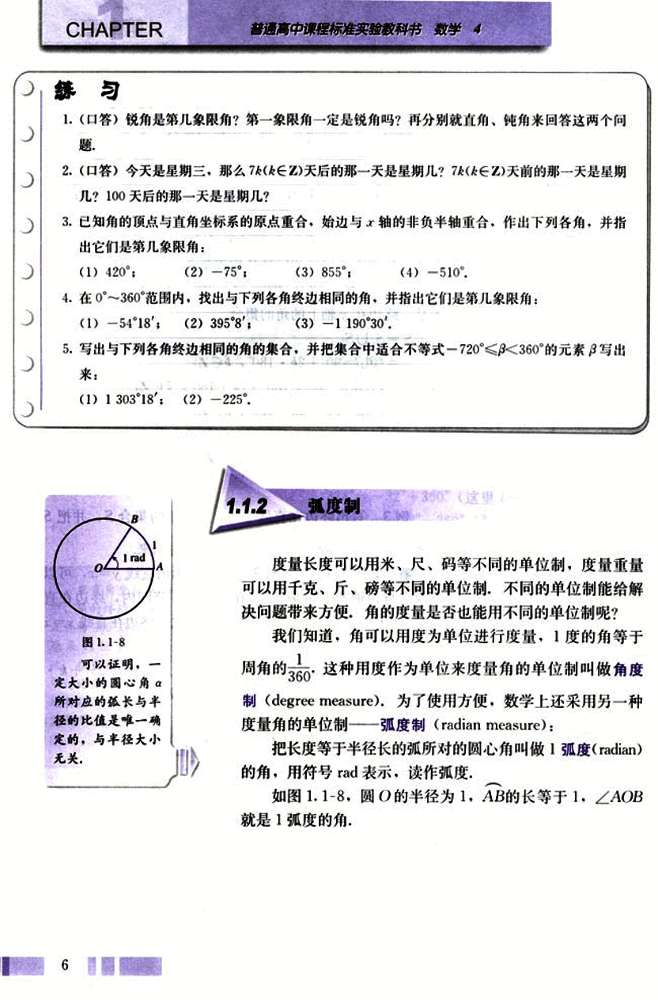
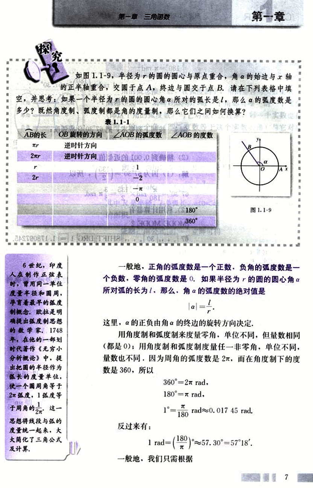
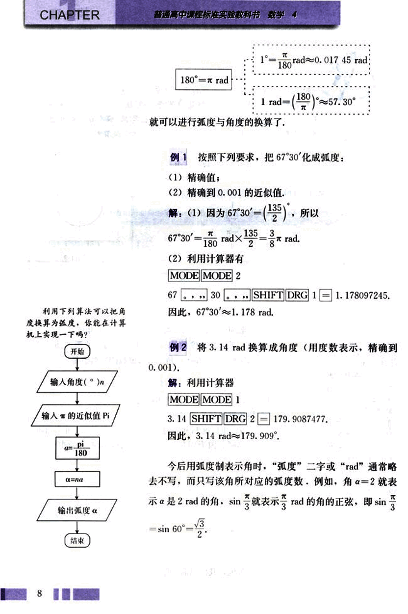
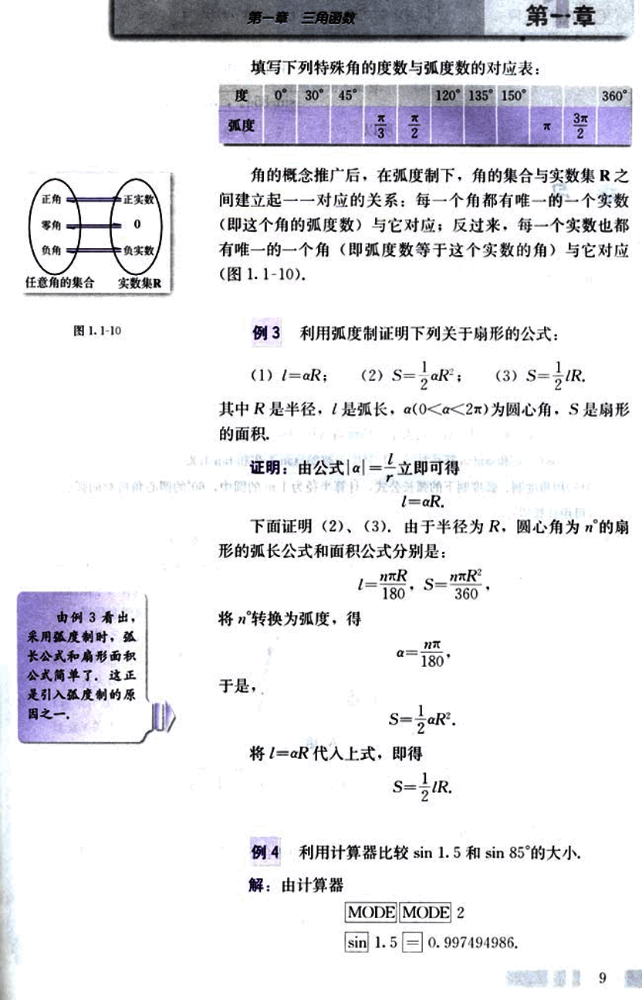
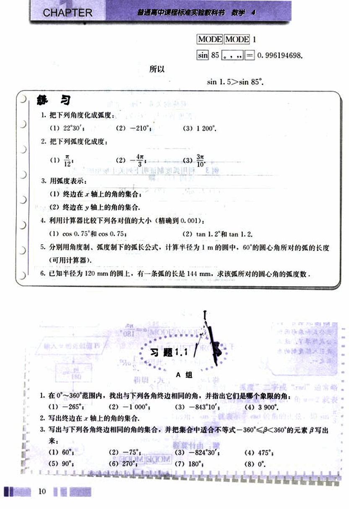
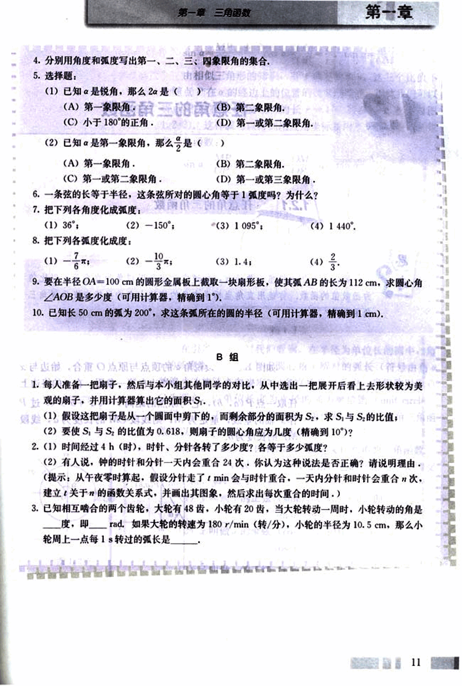

# 1.1.2 弧度制

18

# CHAPTER 练习

1. (口答)锐角是第几象限角？第一象限角一定是锐角吗？再分别就直角、钝角来回答这两个问题。

2. (口答)今天是星期三，那么7k(k∈Z)天后的那一天是星期几？7k(k∈Z)天前的那一天是星期几？100天后的那一天是星期几？

3. 已知角的顶点与直角坐标系的原点重合，始边与x轴的非负半轴重合，作出下列各角，并指出它们是第几象限角：
(1) 420°； (2) -75°； (3) 855°； (4) -510°。

4. 在0°～360°范围内，找出与下列各角终边相同的角，并指出它们是第几象限角：
(1) -54°18′； (2) 395°8′； (3) -1 190°30′。

5. 写出与下列各角终边相同的角的集合，并把集合中适合不等式 -720° < β < 360° 的元素写出来：
(1) 1 303°18′； (2) -225°。

# 1.1.2 弧度制

度量长度可以用米、尺、码等不同的单位制，度量重量可以用千克、斤、磅等不同的单位制，不同的单位制能解决问题带来方便，角的度量是否也能用不同的单位制呢？

我们知道，角可以用度为单位进行度量，1度的角等于周角的$\frac{1}{360}$。这种用度作为单位来度量角的单位制叫做角度制(degree measure)。为了使用方便，数学上还采用另一种度量角的单位制——弧度制(radian measure)：

把长度等于半径长的弧所对的圆心角叫做1弧度(radian)的角，用符号 rad 表示，读作弧度。

如图 1.1-8，圆O的半径为1，AB的长等于1，∠AOB 就是1弧度的角。

6

19

# 第一章 三角函数
# 第一章

如图1.1-9,半径为r的圆的圆心与原点重合，角α的始边与x轴的正半轴重合，交圆于点A，终边与圆交于点B.请在下列表格中填空，并思考：如果一个半径为r的圆的圆心角α所对的弧长是l，那么α的弧度数是多少？既然角度制、弧度制都是角的度量制，那么它们之间如何换算？

表1.1-1

| AB的长 | OB旋转的方向 | ∠AOB的弧度数 | ∠AOB的度数 |
|---|---|---|---|
| πr | 逆时针方向 | 1 | 180° |
| 2r | 逆时针方向 | 2 | 360° |
| r | 逆时针方向 | $\frac{1}{2}$ | 90° |
| 2r | 反时针方向 | $-\frac{\pi}{2}$ | -90° |

[图1.1-9](images/1.1-9.png)

6世纪，印度人在制作正弦表时，曾用同一单位度量半径和圆周，孕育着最早的弧度制概念，欧拉是明确提出弧度制思想的数学家，1748年，在他的一部划时代著作《无穷小分析概论》中，提出把圆的半径作为弧长的度量单位，使一个圆周角等于2π弧度，1弧度等于周角的$\frac{1}{2\pi}$，这一思想将线段与弧的度量统一起来，大大简化了三角公式及计算。

一般地，正角的弧度数是一个正数，负角的弧度数是一个负数，零角的弧度数是0.如果半径为r的圆的圆心角α所对弧的长为l，那么，角α的弧度数的绝对值是

$|α| = \frac{l}{r}$

这里，α的正负由α的终边的旋转方向决定。

用角度制和弧度制来度量零角，单位不同，但量数相同（都是0）；用角度制和弧度制度量任一非零角，单位不同，量数也不同。因为周角的弧度数是2π，而在角度制下的度数是360，所以

360° = 2π rad.

180° = π rad.

1° = $\frac{\pi}{180}$ rad ≈0.017 45 rad.

反过来有：

1 rad = ($\frac{180}{\pi}$)° ≈57.30° = 57°18′.

一般地，我们只需根据
7

20

# CHAPTER

普通高中课程标准实验教科书 数学 4

180°=π rad

1° = $\frac{π}{180}$ rad ≈ 0.017 45 rad

1 rad = $(\frac{180}{π})°$ ≈ 57.30°

就可以进行弧度与角度的换算了。

## 例 1

按照下列要求，把67°30′化成弧度：

(1) 精确值；

(2) 精确到0.001的近似值.

解：(1) 因为67°30′= $(\frac{135}{2})°$，所以

67°30′ = $\frac{π}{180}$ rad × $\frac{135}{2}$ = $\frac{3}{8}$π rad.

(2) 利用计算器有

MODE MODE 2

67 ... ... 30 ... ... SHIFT DRG 1 = 1.178097245.

因此，67°30′ ≈ 1.178 rad.

## 例 2

将 3.14 rad 换算成角度（用度数表示，精确到 0.001）。

解：利用计算器

MODE MODE 1

3.14 SHIFT DRG 2 = 179.9087477.

因此，3.14 rad ≈ 179.909°.

今后用弧度制表示角时，“弧度”二字或 “rad” 通常略去不写，而只写该角所对应的弧度数。例如，α = 2 就表示 α 是 2 rad 的角，sin $\frac{π}{3}$ 表示 $\frac{π}{3}$ rad 的角的正弦，即 sin $\frac{π}{3}$ = sin 60° = $\frac{\sqrt{3}}{2}$。

8

21

# 第一章 三角函数

## 第一节

填写下列特殊角的度数与弧度数的对应表：

| 度 | 0° | 30° | 45° | 120° | 135° | 150° | 360° |
|---|---|---|---|---|---|---|---|
| 弧度 |  |  |  | $\frac{\pi}{3}$ | $\frac{2\pi}{3}$ | $\frac{\pi}{2}$ | $2\pi$ |

角的概念推广后，在弧度制下，角的集合与实数集R之间建立起一一对应的关系：每一个角都有唯一的一个实数（即这个角的弧度数）与它对应；反过来，每一个实数也都 有唯一的一个角（即弧度数等于这个实数的角）与它对应（图 1.1-10）。

[图1.1-10](images/1.1-10.png)

## 例3

利用弧度制证明下列关于扇形的公式：

(1) $l = aR$;

(2) $S = \frac{1}{2}aR^2$;

(3) $S = \frac{1}{2}lR$.

其中R是半径，l是弧长，$a(0 < a < 2\pi)$为圆心角，S是扇形的面积。

证明：由公式$|a| = \frac{l}{R}$ 立即可得

$l = aR$.

下面证明 (2)、(3)。由于半径为R，圆心角为n的扇形的弧长公式和面积公式分别是：

$l = \frac{n\pi R}{180}$,  $S = \frac{n\pi R^2}{360}$.

将n转换为弧度，得

$a = \frac{n\pi}{180}$.

于是，

$S = \frac{1}{2}aR^2$.

将 $l = aR$ 代入上式，即得

$S = \frac{1}{2}lR$.

## 例4

利用计算器比较sin 1.5 和 sin 85°的大小。

解：由计算器

MODE MODE 2

sin 1.5 = 0.997494986.

9

22

# 练习

1. 把下列角度化成弧度：
(1) 22°30′；
(2) -210°；
(3) 1 200°.

2. 把下列弧度化成度：
(1) $\frac{\pi}{12}$；
(2) $\frac{4\pi}{3}$；
(3) $\frac{3\pi}{10}$

3. 用弧度表示：
(1) 终边在x轴上的角的集合；
(2) 终边在y轴上的角的集合。

4. 利用计算器比较下列各对值的大小（精确到0.001）：
(1) cos 0.75°和 cos 0.75；
(2) tan 1.2°和 tan 1.2。

5. 分别用角度制、弧度制下的弧长公式，计算半径为1 m的圆中，60°的圆心角所对的弧的长度
(可用计算器)。

6. 已知半径为120 mm的圆上，有一条弧的长是144 mm，求该弧所对的圆心角的弧度数。

# 习题 1.1 A组

1. 在0°～360°范围内，找出与下列各角终边相同的角，并指出它们是哪个象限的角：
(1) -265°； (2) -1000°； (3) -843°10′； (4) 3 900°。

2. 写出终边在x轴上的角的集合。

3. 写出与下列各角终边相同的角的集合，并把集合中适合不等式 -360° < β < 360° 的元素写出来：
(1) 60°； (2) -75°； (3) -824°30′； (4) 475°； (5) 90°； (6) 270°； (7) 180°； (8) 0°。

23

# 第一章 三角函数

## 第一章

4. 分别用角度和弧度写出第一、二、三、四象限角的集合。

5. 选择题：

(1) 已知 $α$ 是锐角，那么 $2α$ 是 (  )

(A) 第一象限角； (B) 第二象限角；
(C) 小于 180° 的正角； (D) 第一或第二象限角。

(2) 已知 $α$ 是第一象限角，那么 $2α$ 是 (  )

(A) 第一象限角； (B) 第二象限角；
(C) 第一或第二象限角； (D) 第一或第三象限角。

6. 一条弦的长等于半径，这条弦所对的圆心角等于 1 弧度吗？为什么？

7. 把下列各角度化成弧度：

(1) 36°；  (2) -150°； (3) 1 095°； (4) 1 440°。

8. 把下列各弧度化成度：

(1) $-\frac{7}{6}π$； (2) $-\frac{10}{3}π$； (3) 1.4； (4) $\frac{2}{3}π$。

9. 要在半径 OA = 100 cm 的圆形金属板上截取一块扇形板，使其弧 AB 的长为 112 cm，求圆心角∠AOB 是多少度（可用计算器，精确到 1°）。

10. 已知长 50 cm 的弧为 200°，求这条弧所在的圆的半径（可用计算器，精确到 1 cm）。

## B 组

1. 每人准备一把扇子，然后与本小组其他同学的对比，从中选出一把展开后看上去形状较为美观的扇子，并用计算器算出它的面积 S₁。

(1) 假设这把扇子是从一个圆面中剪下的，而剩余部分的面积为 S₂，求 S₁ 与 S₂ 的比值；

(2) 要使 S₁ 与 S₂ 的比值为 0.618，则扇子的圆心角应为几度（精确到 10°）？

2. (1) 时间经过 4 h（时），时针、分针各转了多少度？各等于多少弧度？

(2) 有人说，钟的时针和分针一天内会重合 24 次，你认为这种说法是否正确？请说明理由。（提示：从午夜零时算起，假设分针走了 t min 会与时针重合，一天内分针和时针会重合 n 次，建立关于 t 的函数关系式，并画出其图象，然后求出每次重合的时间。）

3. 已知相互啮合的两个齿轮，大轮有 48 齿，小轮有 20 齿，当大轮转动一周时，小轮转动的角是 ______ 度，即 ______ rad。如果大轮的转速为 180 r/min（转/分），小轮的半径为 10.5 cm，那么小轮周上一点每 1 s 转过的弧长是 ______。

11

