# 1.2　任意角的三角函数

24

# 1.2 任意角的三角函数

## 1.2.1 任意角的三角函数

我们已经学过锐角三角函数，知道它们都是以锐角为自变量，以比值为函数值的函数。你能用直角坐标系中角的终边上点的坐标来表示锐角三角函数吗？

如图 1.2-1，设锐角α的顶点与原点O重合，始边与x轴的正半轴重合，那么它的终边在第一象限。在α的终边上任取一点P(a, b), 它与原点的距离 $r = \sqrt{a^2 + b^2} > 0$。过P作x轴的垂线，垂足为M，则线段OM的长度为a，线段MP的长度为b。

[image](images/1.2-1.png)

图 1.2-1

根据初中学过的三角函数定义，我们有

12
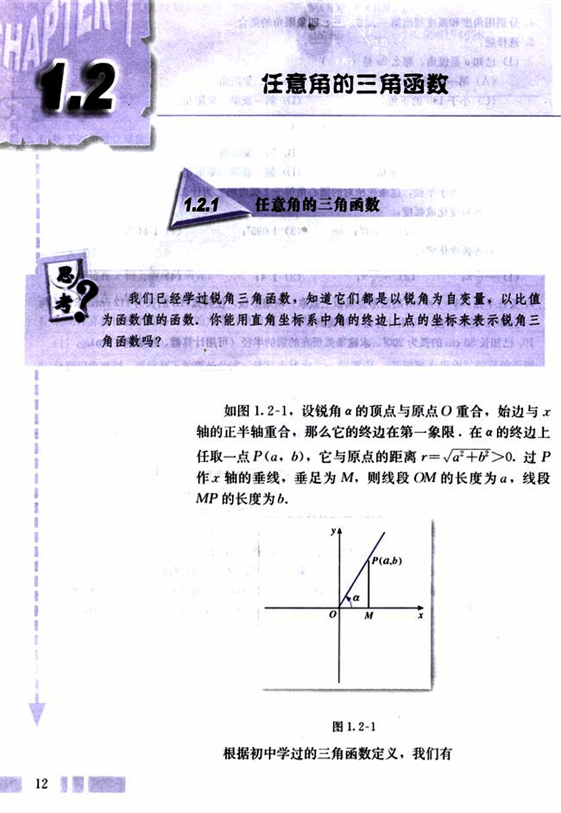
25

# 第一章 三角函数

sin α = MP/OP = b/r, cos α = OM/OP = a/r, tan α = MP/OM = b/a

由相似三角形的知识，对于确定的角α，这三个比值不会随点P在α的终边上的位置的改变而改变，因此我们可以将点P取在使线段OP的长r=1的特殊位置上（如图1.2-2）。这样就可以得到用直角坐标系内点的坐标表示的锐角三角函数：

sin α = MP/OP = b, cos α = OM/OP = a, tan α = MP/OM = b/a

[图1.2-2](images/1.2-2.png)

在引进弧度制时我们看到，在半径为单位长的圆中，角α的弧度数的绝对值等于圆心角所对的弧长（符号由α的终边的旋转方向决定）。在直角坐标系中，我们称以原点O为圆心，以单位长度为半径的圆为单位圆 (unit circle)。这样，上述P点就是α的终边与单位圆的交点。锐角三角函数可以用单位圆上点的坐标表示。

同样的，我们可以利用单位圆定义任意角的三角函数。

如图1.2-3，设α是一个任意角，它的终边与单位圆交于点P(x, y), 那么：

(1) y叫α的正弦(sine)，记作sin α，即 sin α = y;

(2) x叫α的余弦(cosine)，记作cos α，即 cos α = x;

(3) y/x叫α的正切(tangent)，记作tan α，即 tan α = y/x (x ≠ 0).

可以看出，当 α = π/2 + kπ (k∈Z) 时，α的终边在y轴上。

[图1.2-3](images/1.2-3.png)

13

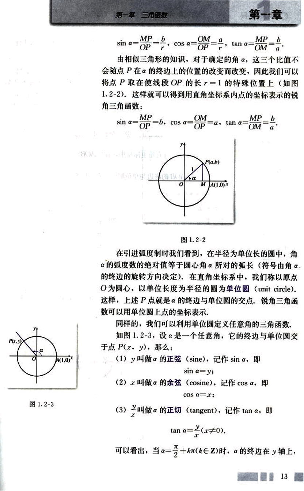
26

# CHAPTER

这时点P的横坐标x等于0，所以tanα=无意义。除此以外，对于确定的角α，上述三个值都是唯一确定的，所以，正弦、余弦、正切都是以角为自变量，以单位圆上点的坐标或坐标的比值为函数值的函数，我们将它们统称为三角函数(trigonometric function)。由于角的集合与实数集之间可以建立一一对应关系，三角函数可以看成是自变量为实数的函数。

## 例1

求$\frac{5\pi}{3}$的正弦、余弦和正切值.

解：在直角坐标系中，作∠AOB=$\frac{5\pi}{3}$(如图1.2-4)。易知∠AOB的终边与单位圆的交点坐标为($\frac{1}{2}$,$-\frac{\sqrt{3}}{2}$)，所以，

sin$\frac{5\pi}{3}$=$-\frac{\sqrt{3}}{2}$，

cos$\frac{5\pi}{3}$=$\frac{1}{2}$，

tan$\frac{5\pi}{3}$=$-\sqrt{3}$。

[图1.2-4](images/1.2-4.png)


## 例2

已知角α的终边经过点$P_0$(-3,-4)，求角α的正弦、余弦和正切值.

分析：如图1.2-5，由△OMP ∽ △OMP$_0$，可求出相应的三角函数值.

[图1.2-5](images/1.2-5.png)

解：由已知可得：

$OP_0$=$\sqrt{(-3)^2+(-4)^2}$=5.

14

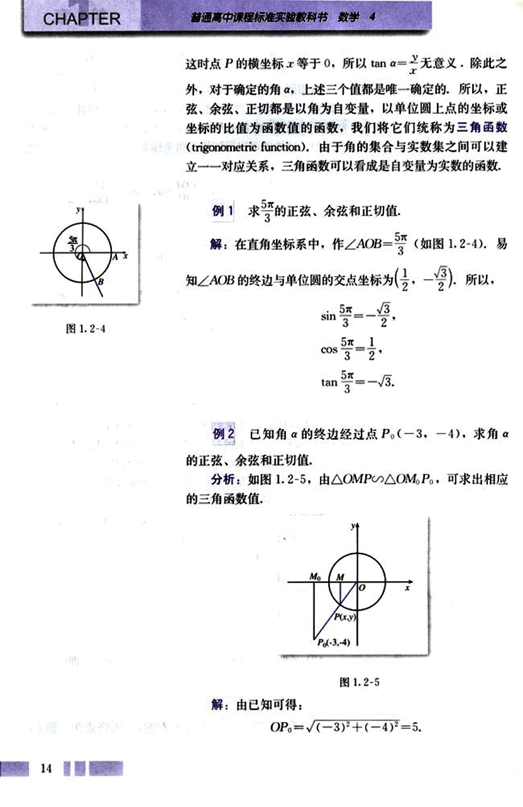
27

# 第一章 三角函数

## 第一节

如图1.2-5,设角α的终边与单位圆交于点P(x, y)。分别过点P、P<sub>0</sub>作x轴的垂线MP、M<sub>0</sub>P<sub>0</sub>,则

|M<sub>0</sub>P<sub>0</sub>| = 4，|MP| = -y，

|OM| = 3，|OM| = -x，

△OMP ≅ △OM<sub>0</sub>P<sub>0</sub>。

于是，

sin α = y = -$\frac{MP}{OP}$ = -$\frac{|M_0P_0|}{|OP_0|}$ = -$\frac{4}{5}$；

cos α = x = -$\frac{OM}{OP}$ = -$\frac{|OM_0|}{|OP_0|}$ = -$\frac{3}{5}$；

tan α = $\frac{y}{x}$ = $\frac{sin α}{cos α}$ = $\frac{4}{3}$。

请根据上述任意角的三角函数定义，先将正弦、余弦、正切函数在弧度制下的定义域填入下表1.2-1，再将这三种函数的值在各象限的符号填入图1.2-6中的括号。

| 三角函数 | 定义域 |
|---|---|
| sin α |  |
| cos α |  |
| tan α |  |

[图1.2-6](images/1.2-6.png)


## 例3

求证：当且仅当下列不等式组成立时，角θ为第三象限角。

$\begin{cases}
sin θ < 0 \\
tan θ > 0
\end{cases}$  ① ②

**证明：**我们证明如果①②式都成立，那么θ为第三象限角。

因为①式 sin θ < 0 成立，所以θ角的终边可能位于第三或第四象限，也可能位于y轴的非正半轴上；

又因为②式 tan θ > 0 成立，所以θ角的终边可能位于第一或第三象限。

15

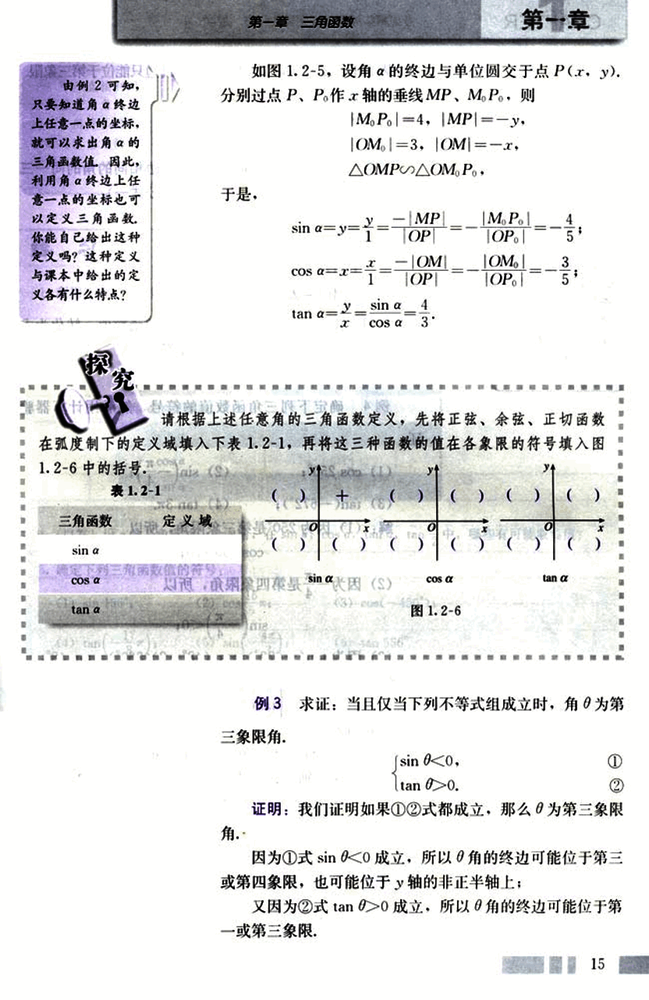
28

# CHAPTER

普通高中课程标准实验教科书 数学 4

因为①，②式都成立，所以角的终边只能位于第三象限，于是角为第三象限角。
反过来请同学们自己证明。

由三角函数的定义，可以知道：终边相同的角的同一三角函数的值相等，由此得到一组公式(公式一)：

```
sin(α+k•2π) = sin α,
cos(α+k•2π) = cos α,
tan(α+k•2π) = tan α,
其中k∈Z.
```

利用公式一，可以把求任意角的三角函数值，转化为求0到2π（或0°到360°）角的三角函数值。

## 例4  确定下列三角函数值的符号，然后用计算器验证：

(1) cos 250°；
(2) sin($-\frac{\pi}{4}$)；
(3) tan(-672°)；
(4) tan 3π.

解：(1)因为250°是第三象限角，所以 cos 250°<0；

(2)因为$-\frac{\pi}{4}$是第四象限角，所以 sin($-\frac{\pi}{4}$)<0；

(3)因为tan(-672°)=tan(48°-2×360°)=tan 48°，而48°是第一象限角，所以 tan(-672°)>0；

(4)因为 tan 3π=tan(π+2π)=tan π，而π的终边在x轴上，所以 tan π=0.

用计算器验证请同学们自己完成。

## 例5 求下列三角函数值：

(1) sin 1 480°10′； (2) cos $\frac{9\pi}{4}$； (3) tan($-\frac{11\pi}{6}$).

16

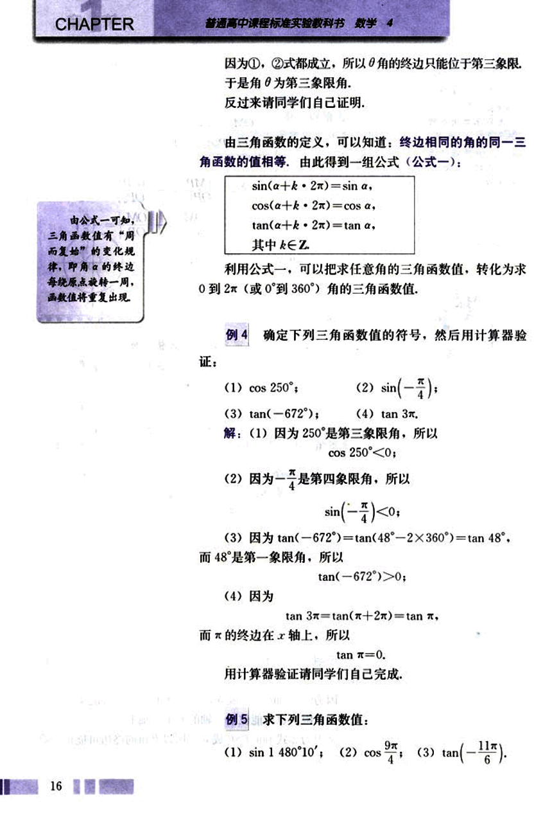
29

# 第一章 三角函数

## 练习

1. 利用三角函数的定义求$\frac{7\pi}{6}$的三个三角函数值.

2. 已知角$\theta$的终边过点$P(-12, 5)$，求$\theta$的三角函数值.

3. 填表：

| 角$\alpha$ | 0° | 90° | 180° | 270° | 360° |
|---|---|---|---|---|---|
| 角$\alpha$的弧度数 |  |  |  |  |  |
| $\sin\alpha$ |  |  |  |  |  |
| $\cos\alpha$ |  |  |  |  |  |
| $\tan\alpha$ |  |  |  |  |  |


4. (口答)设$\alpha$是三角形的一个内角，在$\sin\alpha$，$\cos\alpha$，$\tan\alpha$，$\tan\frac{\alpha}{2}$中，哪些有可能取负值？

5. 确定下列三角函数值的符号：

(1) $\sin 156^\circ$;  (2) $\cos\frac{16}{5}\pi$;  (3) $\cos(-450^\circ)$;

(4) $\tan(-\frac{17}{8}\pi)$;  (5) $\sin(-\frac{4\pi}{3})$;  (6) $\tan 556^\circ$.


6. 选择 ①$\sin\theta>0$，②$\sin\theta<0$，③$\cos\theta>0$，④$\cos\theta<0$，⑤$\tan\theta>0$ 与 ⑥“$\tan\theta<0$”中适当的关系式的序号填空：

(1) 角$\theta$为第一象限角当且仅当 _______;

(2) 角$\theta$为第二象限角当且仅当 _______;

(3) 角$\theta$为第三象限角当且仅当 _______;

(4) 角$\theta$为第四象限角当且仅当 _______;


7. 求下列三角函数值(可用计算器)：

(1) $\cos 1109^\circ$;  (2) $\tan\frac{19\pi}{3}$;

(3) $\sin(-1050^\circ)$;  (4) $\tan(-\frac{31\pi}{4})$.


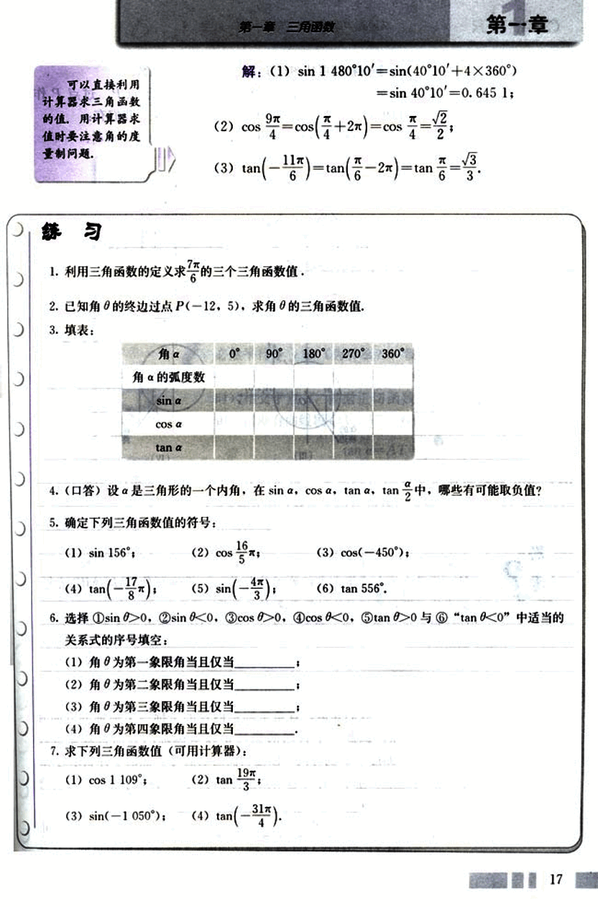
30

# CHAPTER

普通高中课程标准实验教科书 数学 4

下面我们再从图形角度认识一下三角函数.

如图1.2-7. 角 $\alpha$ 的终边与单位圆交于点 P. 过点 P 作 x 轴的垂线, 垂足为 M. 根据三角函数定义, 我们有:

$|MP| = |y| = |\sin \alpha|$; $|OM| = |x| = |\cos \alpha|$.


图 1.2-7

思考？

(1) 为了去掉上述等式中的绝对值符号, 能否给线段 OM, MP 规定一个适当的方向, 使它们的取值与点 P 的坐标一致？

(2) 你能借助单位圆, 找到一条如 OM, MP 一样的线段来表示角 $\alpha$ 的正切吗？


我们知道, 直角坐标系内点的坐标与坐标轴的方向有关. 因此一个自然的想法是以坐标轴的方向来规定线段 OM, MP 的方向, 以使它们的取值与 P 点的坐标联系起来. 当角 $\alpha$ 的终边不在坐标轴上时, 以 O 为始点, M 为终点, 规定:

当线段 OM 与 x 轴同向时, OM 的方向为正向, 且有正值 x; 当线段 OM 与 x 轴反向时, OM 的方向为负向, 且有


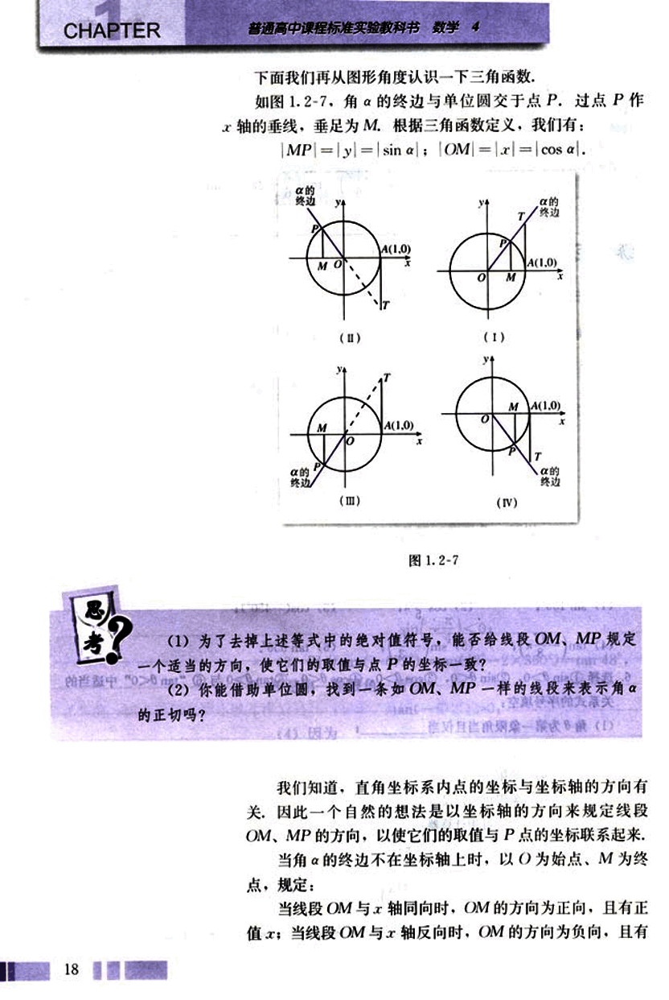
31

# 第一章 三角函数

## 第一节

负值x. 其中x为P点的横坐标,这样,无论哪一种情况都有

$OM = x = \cos α$

同理,当角α的终边不在坐标轴上时,以M为始点、P为终点,规定:

当线段MP与y轴同向时,MP的方向为正向,且有正值y;当线段MP与y轴反向时,MP的方向为负向,且有负值y.其中y为P点的纵坐标,这样,无论哪一种情况都有

$MP = y = \sin α$

像OM、OP这种被看作带有方向的线段,叫做有向线段(directed line segment).

那么,如何用有向线段来表示角α的正切呢?

如图 1.2-7, 过点A(1,0)作单位圆的切线,这条切线必然平行于y轴(为什么?),设它与α的终边(当α为第一、四象限角时)或其反向延长线(当α为第二、三象限角时)相交于点T.根据正切函数的定义与相似三角形的知识,借助有向线段OA、AT,我们有

$\tan α = \frac{AT}{OA} = \frac{y}{x}$ ①

我们把这三条与单位圆有关的有向线段MP、OM、AT,分别叫做角α的正弦线、余弦线、正切线,统称为三角函数线.

当角α的终边与x轴重合时,正弦线、正切线分别变成一个点,此时角α的正弦值和正切值都为0;当角α的终边与y轴重合时,余弦线变成一个点,正切线不存在,此时角α的正切值不存在.

## 练习

1. 你能从单位圆中的三角函数线出发得出三角函数的哪些性质?
2. 作出下列各角的正弦线、余弦线、正切线:
    (1) $\frac{\pi}{3}$   (2) $\frac{5\pi}{6}$   (3) $-\frac{2\pi}{3}$   (4) $-\frac{13\pi}{6}$
3. 作一个以5为单位长度的圆,然后分别作出225°, 330°角的正弦线、余弦线、正切线,量出它们的长度,从而写出这些角的正弦值、余弦值、正切值.
4. 你认为三角函数线对认识三角函数概念有哪些作用?

19

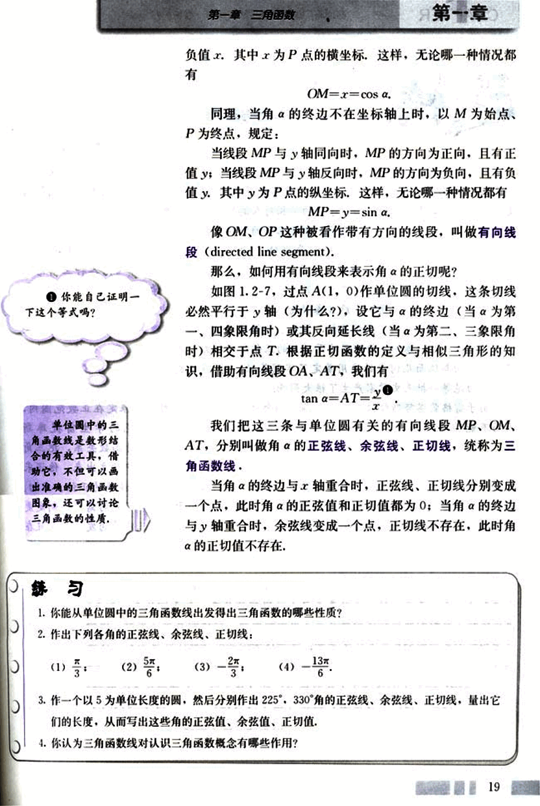
32

# CHAPTER 1

# 三角学与天文学

三角学的起源、发展与天文学密不可分，它是天文观察结果推算的一种方法。在1450年以前的三角学主要是球面三角，这不但是因为航海、历法推算以及天文观测等人类实践活动的需要，而且也因为宇宙的奥秘对人类的巨大吸引力，这种“量天的学问”确实太诱人了。后来，由于间接测量、测绘工作的需要而出现了平面三角。

在欧洲，最早将三角学从天文学中独立出来的数学家是德国人雷格蒙塔努斯 (J. Regiomontanus, 1436–1476)，他在1464年完成的5卷本的著作《论各种三角形》，是欧洲第一部独立于天文学的三角学著作。这部著作首次对三角学做出了完整、独立的阐述，前2卷论述平面三角学，后3卷讨论球面三角学。前2卷中，他采用印度人的正弦，即弧的半弦，明确使用了正弦函数，讨论了一般三角形的正弦定理，提出了求三角形边长的代数解法；后3卷中，给出了球面三角的正弦定理和关于边的余弦定理。他的工作为三角学在平面与球面几何中的应用奠定了牢固基础，对16世纪的数学家产生了极大影响，也对哥白尼等一批天文学家产生了很大影响。

由于雷格蒙塔努斯仅仅采用正弦函数和余弦函数，而且函数值也限定在正数范围内，因而不能推出应有的三角公式，导致计算的困难。后来，哥白尼的学生雷提库斯 (G. J. Rhaeticus, 1514–1576) 将传统的弧与弦的关系改进为角的三角函数关系，把三角函数定义为直角三角形的边长之比，从而使平面三角学从球面三角学中独立出来。他还采用了六个函数(正弦、余弦、正切、余切、正割、余割)，制定了更为精确的正弦、正切、正割表。这些工作都极大推进了三角学的发展。实际上，由于天文学研究的需要，制定更加精确的三角函数表一直是数学家奋斗的目标，这不但大大推动了三角学的发展，而且在某种程度上还导致了对数的发明。

法国数学家韦达 (F. Vieta, 1540–1603) 所做的平面三角与球面三角系统化工作，使得三角学得到进一步发展。他总结了前人的三角学研究成果，将解平面直角三角形和斜三角形的公式汇集在一起，还补充了自己发现的新公式，如正切公式、和差化积公式等。他将解斜三角形的问题转化为解直角三角形的问题，对球面直角三角形，他给出了计算的方法和一套完整的公式及其记忆法则，并将这套公式表示成了代数形式，这是非常重要的工作。

16世纪，三角学从天文学中分离出来，成为数学的一个独立分支。后来，在微积分、物理学的研究和应用(如对振动、声音传播等的研究)中，三角学又找到了新的用武之地。

20

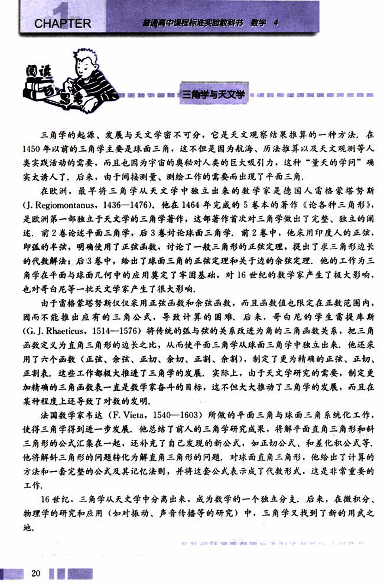
33

# 第一章 三角函数
## 1.2.2 同角三角函数的基本关系

探
究

三角函数是以单位圆上点的坐标来定义的，你能从圆的几何性质出发，讨论一下同一个角的不同三角函数之间的关系吗？

如图1.2-8，以正弦线MP、余弦线OM和半径OP三者的长构成直角三角形，而且OP=1. 由勾股定理有

因此

即

OM² + MP² = 1,

x² + y² = 1,

sin²α + cos²α = 1.

[图1.2-8](images/1.2-8.png)

今后，除特殊注明外，我们假定三角恒等式是在使两边都有意义的情况下的恒等式。

根据三角函数的定义，当α≠kπ + π/2 (k∈Z)时，有

sin α / cos α = tan α.

这就是说，同一个角α的正弦、余弦的平方和等于1，商等于α的正切。

21

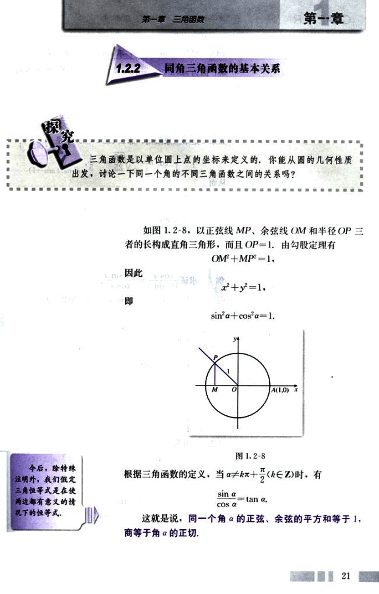
34

# CHAPTER

普通高中课程标准实验教科书 数学 4

## 例 6

已知 $\sin a = \frac{3}{5}$，求 $\cos a$，$\tan a$ 的值.

解：因为 $\sin a < 0$，$\sin a \ne -1$，所以 $a$ 是第三或第四象限角.

由 $\sin^2 a + \cos^2 a = 1$ 得

$\cos^2 a = 1 - \sin^2 a = 1 - (-\frac{3}{5})^2 = \frac{16}{25}$

如果 $a$ 是第三象限角，那么 $\cos a < 0$ . 于是

$\cos a = -\sqrt{\frac{16}{25}} = -\frac{4}{5}$

从而

$\tan a = \frac{\sin a}{\cos a} = (-\frac{3}{5}) \times (-\frac{5}{4}) = \frac{3}{4}$

如果 $a$ 是第四象限角，那么

$\cos a = \frac{4}{5}$，$\tan a = -\frac{3}{4}$


## 例 7

求证 $\frac{\cos x}{1 - \sin x} = \frac{1 + \sin x}{\cos x}$

证法 1：由 $\cos x \ne 0$，知 $\sin x \ne -1$，所以 $1 + \sin x \ne 0$，

左边 = $\frac{\cos x (1 + \sin x)}{(1 - \sin x)(1 + \sin x)} = \frac{\cos x (1 + \sin x)}{1 - \sin^2 x} = \frac{\cos x (1 + \sin x)}{\cos^2 x} = \frac{1 + \sin x}{\cos x}$ = 右边.

所以原式成立.

证法 2：因为

$(1 - \sin x)(1 + \sin x) = 1 - \sin^2 x = \cos^2 x$

$= \cos x \cos x$

且 $1 - \sin x \ne 0$，$\cos x \ne 0$，所以

$\frac{\cos x}{1 - \sin x} = \frac{1 + \sin x}{\cos x}$

从例 6 可以看出，证明一个三角恒等式的方法多种多样，你能总结一下吗？

22

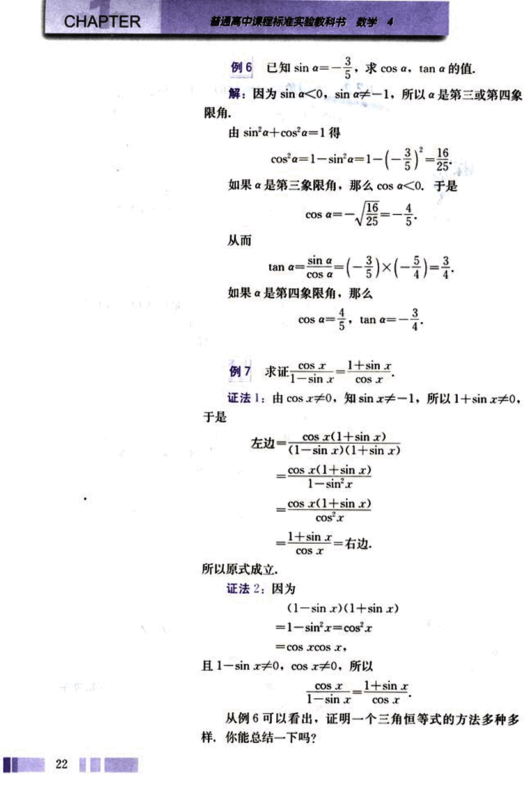
35

# 第一章 三角函数
## 第一章

### 练习

1. 已知 $cos\ a = -\frac{4}{5}$，且 $\alpha$ 为第三象限角，求 $sin\ \alpha$，$tan\ \alpha$ 的值。

2. 已知 $tan\ \varphi = \sqrt{3}$，求 $sin\ \varphi$，$cos\ \varphi$ 的值。

3. 已知 $sin\ \theta = 0.35$，求 $cos\ \theta$，$tan\ \theta$ 的值（计算结果保留两个有效数字）。

4. 化简：

(1) $cos\ \theta tan\ \theta$；

(2) $\frac{2cos^2\alpha - 1}{1 - 2sin^2\alpha}$；

5. 求证：

(1) $sin^4\alpha - cos^4\alpha = sin^2\alpha - cos^2\alpha$；

(2) $sin^4\alpha + sin^2\alpha cos^2\alpha + cos^4\alpha = 1$。

### 习题 1.2

#### A 组

1. 用定义法、公式以及计算器等求下列角的三个三角函数值：

(1) $-\frac{17\pi}{3}$； (2) $\frac{21\pi}{4}$； (3) $\frac{23\pi}{6}$； (4) $1500^\circ$。

2. 已知角 $\alpha$ 的终边上有一点的坐标是 P(3a, 4a)，其中 a≠0，求 $sin\ \alpha$，$cos\ \alpha$，$tan\ \alpha$ 的三角函数值。

3. 计算：

(1) $6sin(-90^\circ) + 3sin\ 0^\circ - 8sin\ 270^\circ + 12cos\ 180^\circ$；

(2) $10cos\ 270^\circ + 4sin\ 0^\circ + 9tan\ 0^\circ + 15cos\ 360^\circ$；

(3) $2cos\frac{\pi}{2} - tan\frac{\pi}{4} + \frac{3}{4}tan^2\frac{\pi}{6} - sin\frac{\pi}{6} + cos\frac{\pi}{6} + sin\frac{3\pi}{2}$；

(4) $sin^2\frac{3\pi}{2} + cos^2\frac{\pi}{2} - tan^2\frac{\pi}{3}$。

4. 化简：

(1) $asin\ 0^\circ + bcos\ 90^\circ + ctan\ 180^\circ$；


23

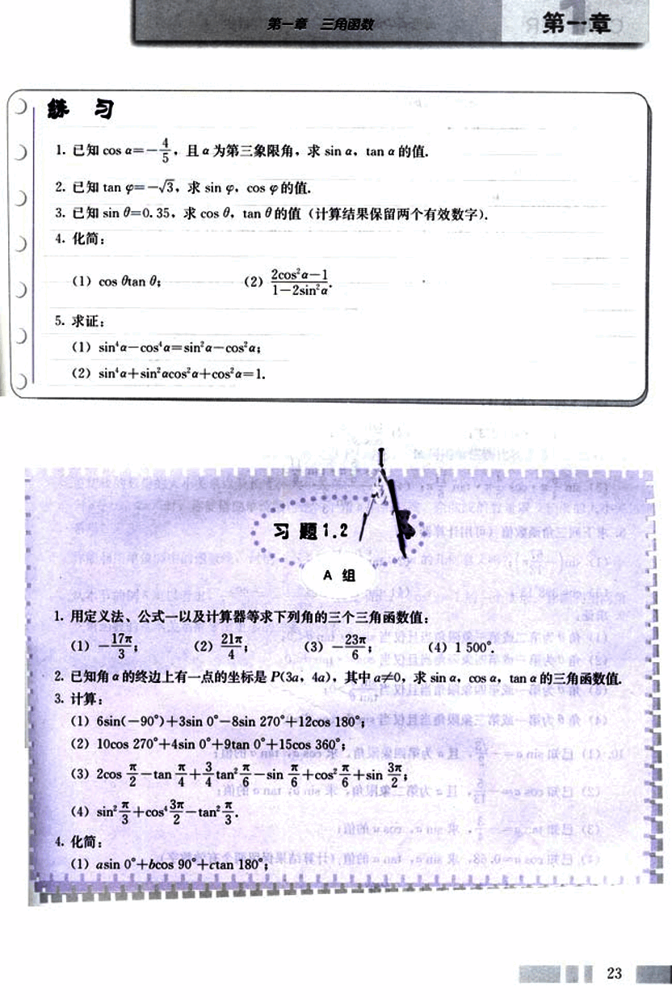
36

# CHAPTER 1

普通高中课程标准实验教科书 数学 4

(2) $-p\cos180^\circ + q\sin90^\circ - 2pq\cos0^\circ$;

(3) $a^2\cos2x - b^2\sin^2\frac{3\pi}{2} + ab\cos x - ab\sin\frac{\pi}{2}\sin x$;

(4) $m\tan\theta + n\cos\frac{\pi}{2} - p\sin\pi - q\cos\frac{3\pi}{2} - r\sin2\pi$.

5. 根据下列条件求函数$f(x) = \sin(x + \frac{\pi}{4}) + 2\sin(x - \frac{\pi}{4}) - 4\cos2x + 3\cos(x + \frac{3\pi}{4})$的值：

(1) $x = \frac{\pi}{4}$;

(2) $x = \frac{3\pi}{4}$.

6. 确定下列三角函数值的符号：

(1) $\sin186^\circ$;

(2) $\tan505^\circ$;

(3) $\sin7.6\pi$;

(4) $\tan(-\frac{23\pi}{4})$;

(5) $\cos940^\circ$;

(6) $\cos(-\frac{59}{17}\pi)$.

7. 确定下列式子的符号：

(1) $\tan125^\circ \cdot \sin273^\circ$;

(2) $\tan108^\circ$;

(3) $\sin\frac{5\pi}{4} \cdot \cos\frac{4\pi}{11} \cdot \tan\frac{11\pi}{6}$;

(4) $\frac{\cos\frac{5\pi}{6} \cdot \tan\frac{11\pi}{6}}{\sin\frac{\pi}{3}}$.

8. 求下列三角函数值(可用计算器)：

(1) $\sin(-\frac{67}{12}\pi)$;

(2) $\tan(-\frac{15}{4}\pi)$;

(3) $\cos398^\circ13'$;

(4) $\tan766^\circ15'$.

9. 求证：

(1) $\theta$为第二或第三象限角当且仅当$\sin\theta \cdot \tan\theta < 0$;

(2) $\theta$为第三或第四象限角当且仅当$\cos\theta \cdot \tan\theta < 0$;

(3) $\theta$为第一或第四象限角当且仅当$\frac{\sin\theta}{\tan\theta} > 0$;

(4) $\theta$为第一或第三象限角当且仅当$\sin\theta \cdot \cos\theta > 0$.

10. (1) 已知$\sin\alpha = -\frac{\sqrt{3}}{2}$，且$\alpha$为第四象限角，求$\cos\alpha$，$\tan\alpha$的值；

(2) 已知$\cos\alpha = -\frac{5}{13}$，且$\alpha$为第二象限角，求$\sin\alpha$，$\tan\alpha$的值；

(3) 已知$\tan\alpha = -\frac{4}{3}$，求$\sin\alpha$，$\cos\alpha$的值；

(4) 已知$\cos\alpha = 0.68$，求$\sin\alpha$，$\tan\alpha$的值（计算结果保留两个有效数字）.

11. 已知$\sin x = -\frac{1}{3}$，求$\cos x$，$\tan x$的值。

24

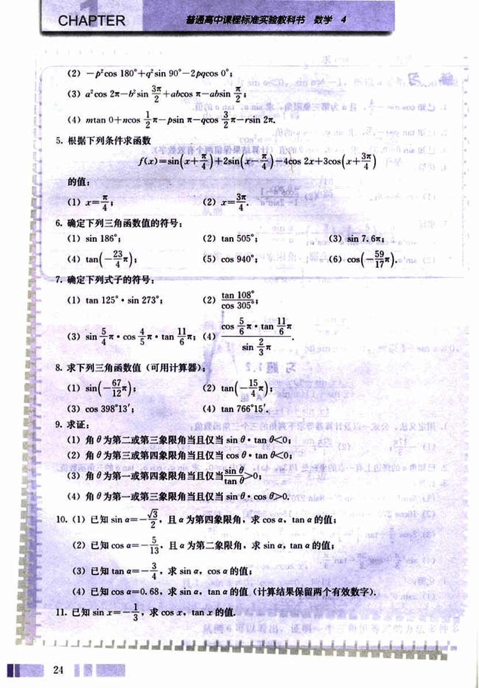
37

# 第一章 三角函数

12. 已知 tan α = √3, π < α < $\frac{3π}{2}$ , 求 cos α - sin α 的值.

13. 求证:

(1) $\frac{1-2sin x cos x}{cos^2 x - sin^2 x} = \frac{1-tan x}{1+tan x}$

(2) tan²α - sin²α = tan²α sin²α;

(3) (cos β - 1)² + sin²β = 2 - 2cos β;

(4) sin²x + cos²x = 1 - 2sin x cos²x.


B 组

1. 化简 (1 + tan²α)cos²α.

2. 化简 $\frac{\sqrt{1+sin α} }{\sqrt{1-sin α}} \cdot \frac{\sqrt{1-sin α}}{\sqrt{1+sin α}}$ , 其中 α 为第二象限角.

3. 已知 tan α = 2, 求 $\frac{sin α + cos α}{sin α - cos α}$ 的值.

4. 设 α ∈ (0, $\frac{π}{2}$ ), 角 α 的终边与单位圆的交点 P(x, y). 试利用单位圆比较正弦线、余弦线、正切线的数量的大小关系以及长度的大小关系.

当 α ∈ (0, 2π) 时, 你能借助单位圆讨论一下 α 的正弦线、余弦线的数量以及长度的大小关系吗?

你能利用单位圆中的函数线, 讨论一下关系式 $\frac{sin α}{cos α}$ = tan α 的几何意义吗?

5. 从本节的例 6 可以看出, $\frac{cos x}{1-sin x} = \frac{1+sin x}{cos x}$ 就是 sin²x + cos²x = 1 的一个变形, 你能利用同角三角函数的基本关系推导出更多的关系式吗?

25

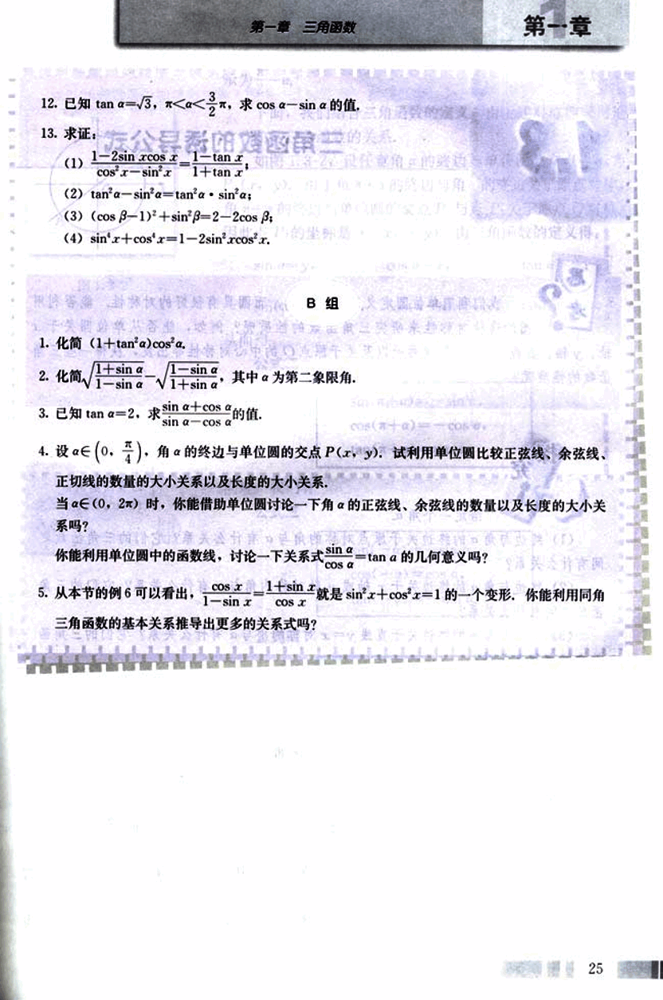
