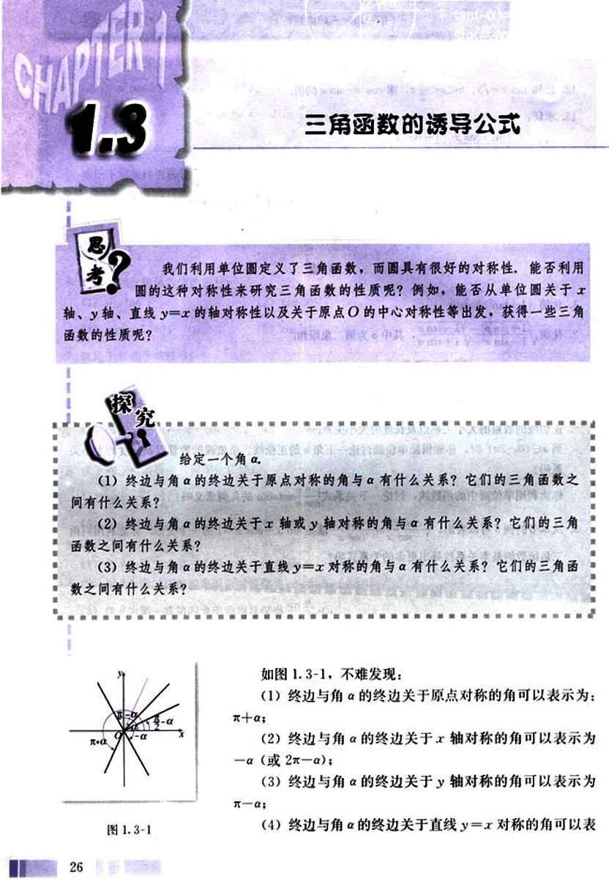
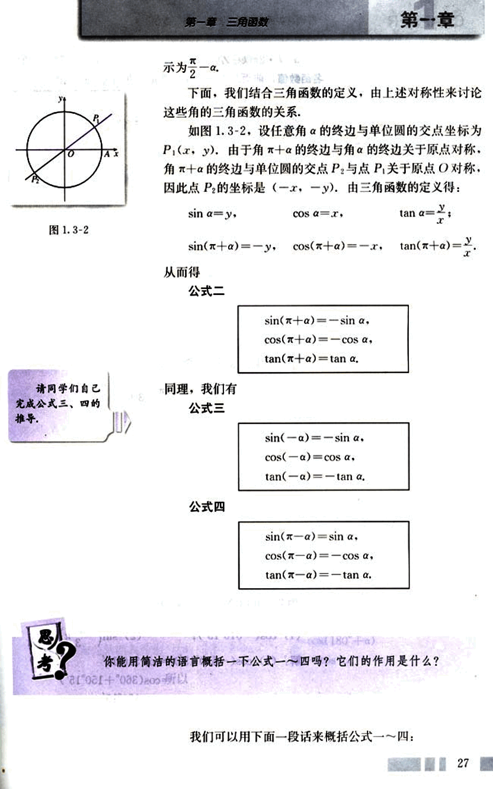
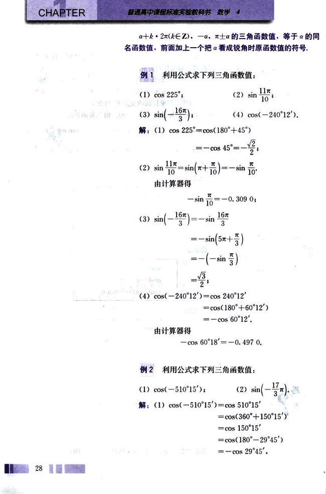
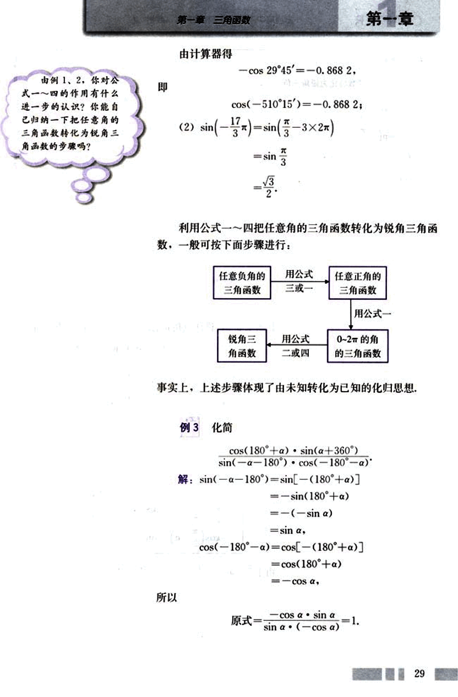
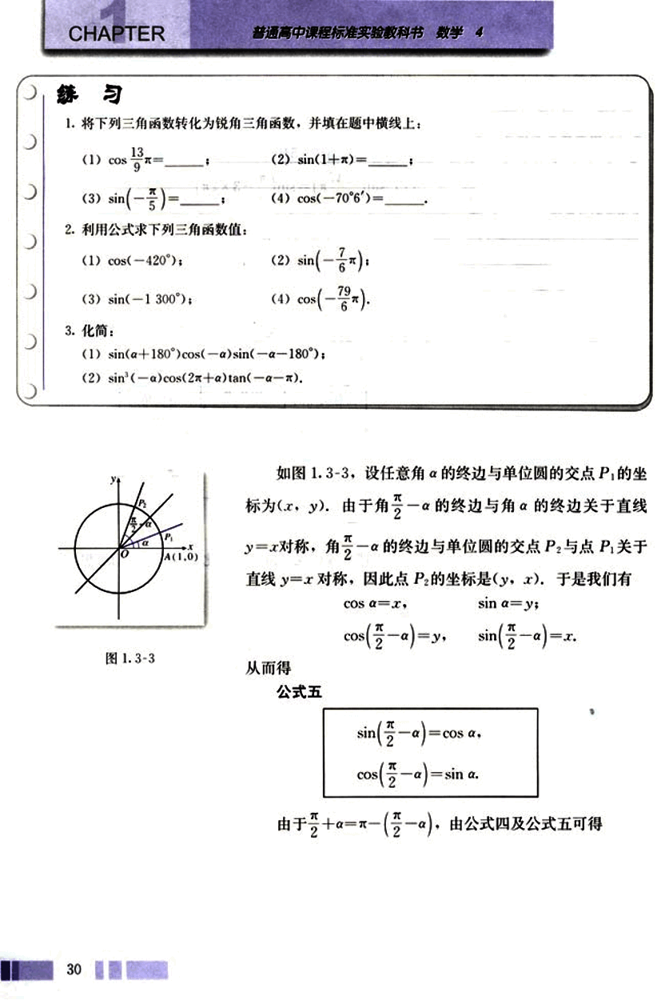
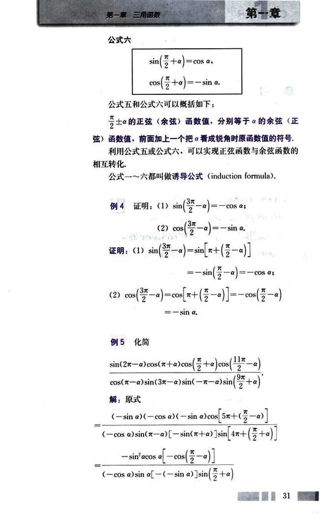
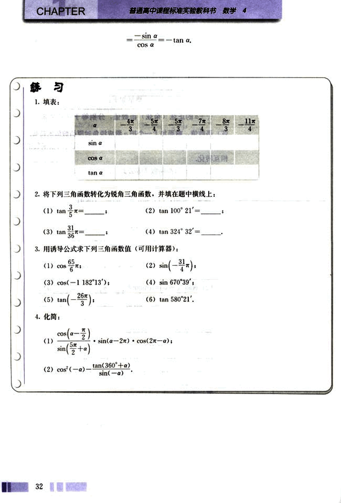
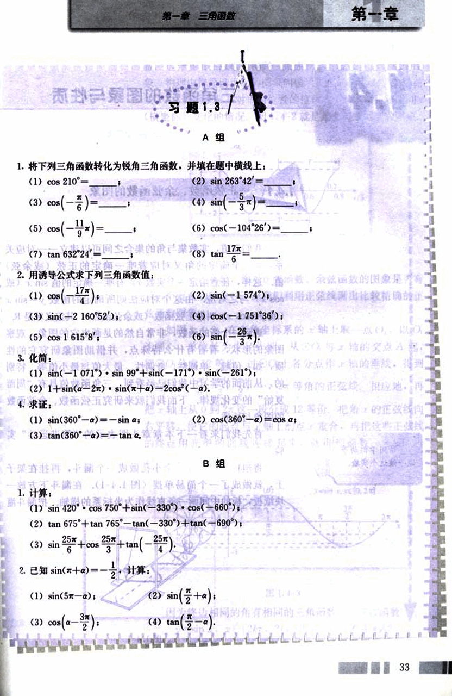

# 1.3　三角函数的诱导公式

38

# CHAPTER 1

## 1.3 三角函数的诱导公式

思考？

我们利用单位圆定义了三角函数，而圆具有很好的对称性，能否利用圆的这种对称性来研究三角函数的性质呢？例如，能否从单位圆关于x轴、y轴、直线y=x的轴对称性以及关于原点的中心对称性等出发，获得一些三角函数的性质呢？

探究！

给定一个角α.

(1) 终边与角α的终边关于原点对称的角与α有什么关系？它们的三角函数之间有什么关系？

(2) 终边与角α的终边关于x轴或y轴对称的角与α有什么关系？它们的三角函数之间有什么关系？

(3) 终边与角α的终边关于直线y=x对称的角与α有什么关系？它们的三角函数之间有什么关系？

图1.3-1

如图1.3-1，不难发现：

(1) 终边与角α的终边关于原点对称的角可以表示为：π+α；

(2) 终边与角α的终边关于x轴对称的角可以表示为-α (或2π-α)；

(3) 终边与角α的终边关于y轴对称的角可以表示为π-α；

(4) 终边与角α的终边关于直线y=x对称的角可以表

39

# 第一章 三角函数

## 第一章

示为$\frac{\pi}{2}-α$

下面，我们结合三角函数的定义，由上述对称性来讨论这些角的三角函数的关系。

如图1.3-2，设任意角α的终边与单位圆的交点坐标为$P_1(x, y)$，由于角$\pi + \alpha$的终边与角α的终边关于原点对称，角$\pi + \alpha$的终边与单位圆的交点$P_2$与点$P_1$关于原点对称，因此点$P_2$的坐标是$(-x, -y)$。由三角函数的定义得：

$\sin α = y$,  $\cos α = x$,  $\tan α = \frac{y}{x}$；

$\sin(\pi + α) = -y$,  $\cos(\pi + α) = -x$,  $\tan(\pi + α) = \frac{y}{x}$。

从而得

**公式二**

$\sin(\pi + α) = -\sin α$

$\cos(\pi + α) = -\cos α$

$\tan(\pi + α) = \tan α$

同理，我们有

**公式三**

$\sin(-α) = -\sin α$

$\cos(-α) = \cos α$

$\tan(-α) = -\tan α$

**公式四**

$\sin(\pi - α) = \sin α$

$\cos(\pi - α) = -\cos α$

$\tan(\pi - α) = -\tan α$

你能用简洁的语言概括一下公式一～四吗？它们的作用是什么？

我们可以用下面一段话来概括公式一～四：

27

40

# CHAPTER

普通高中课程标准实验教科书 数学 4

a + k ⋅ 2π(k∈Z), −α, π ± α 的三角函数值，等于 α 的同名函数值，前面加上一个把 α 看成锐角时原函数值的符号。

## 例 1

利用公式求下列三角函数值：

(1) cos 225°；

(2) sin $\frac{11\pi}{10}$；

(3) sin($-\frac{16\pi}{3}$)；

(4) cos(−240°12′).

解：(1) cos 225° = cos(180° + 45°)

= −cos 45° = $-\frac{\sqrt{2}}{2}$；

(2) sin $\frac{11\pi}{10}$ = sin($\pi + \frac{\pi}{10}$) = −sin $\frac{\pi}{10}$

由计算器得

−sin $\frac{\pi}{10}$ = −0.309 0；

(3) sin($-\frac{16\pi}{3}$) = −sin $\frac{16\pi}{3}$

= −sin($5\pi + \frac{\pi}{3}$)

= −(−sin $\frac{\pi}{3}$)

= $\frac{\sqrt{3}}{2}$；

(4) cos(−240°12′) = cos 240°12′

= cos(180° + 60°12′)

= −cos 60°12′.

由计算器得

−cos 60°18′ = −0.497 0.

## 例 2

利用公式求下列三角函数值：

(1) cos(−510°15′)；

(2) sin($-\frac{17\pi}{3}$).

解：(1) cos(−510°15′) = cos 510°15′

= cos(360° + 150°15′)

= cos 150°15′

= cos(180° − 29°45′)

= −cos 29°45′，

41

# 第一章 三角函数

## 由例1、2，你对公式一～四的作用有什么进一步的认识？你能自己归纳一下把任意角的三角函数转化为锐角三角函数的步骤吗？

## 由计算器得

-cos 29°45′ = -0.868 2,

cos(-510°15′) = -0.868 2;

(2)  sin($-\frac{17}{3}\pi$) = sin($\frac{\pi}{3}$ - 3 × 2$\pi$) = sin$\frac{\pi}{3}$ = $\frac{\sqrt{3}}{2}$

## 利用公式一～四把任意角的三角函数转化为锐角三角函数，一般可按下面步骤进行：

| 任意负角的三角函数 | 用公式三或一 | 任意正角的三角函数 |
|---|---|---|
| 锐角三角函数 | 用公式二或四 | 0～2$\pi$的角的三角函数 |

事实上，上述步骤体现了由未知转化为已知的化归思想。

## 例3 化简

$\frac{cos(180^\circ + a) \cdot sin(a + 360^\circ)}{sin(-a - 180^\circ) \cdot cos(-180^\circ - a)}$

解: sin(-a - 180°) = sin[-(180° + a)] = -sin(180° + a) = -(-sin a) = sin a,

cos(-180° - a) = cos[-(180° + a)] = cos(180° + a) = -cos a,

所以

原式 = $\frac{-cos a \cdot sin a}{sin a \cdot (-cos a)} = 1$.

29

42

# CHAPTER 练习

1. 将下列三角函数转化为锐角三角函数，并填在题中横线上：

(1) $\cos\frac{13}{9}$ = ______;

(2) $\sin(1+π)$ = ______;

(3) $\sin(-\frac{π}{5})$ = ______;

(4) $\cos(-70^\circ6')$ = ______.

2. 利用公式求下列三角函数值：

(1) $\cos(-420^\circ)$;

(2) $\sin(-\frac{7}{6}π)$;

(3) $\sin(-1300^\circ)$;

(4) $\cos(-\frac{79}{6}π)$.

3. 化简：

(1) $\sin(a+180^\circ)\cos(-a)\sin(-a-180^\circ)$;

(2) $\sin^3(-a)\cos(2x+a)\tan(-a-π)$.

[图1.3-3](images/1.3-3.png)

如图 1.3-3，设任意角 $a$ 的终边与单位圆的交点 $P$ 的坐标为 $(x, y)$。由于角 $\frac{π}{2}-a$ 的终边与角 $a$ 的终边关于直线 $y = x$ 对称，角 $\frac{π}{2}-a$ 的终边与单位圆的交点 $P_2$ 与点 $P$ 关于直线 $y = x$ 对称，因此点 $P_2$ 的坐标是 $(y, x)$。于是我们有

$\cos a = x$,   $\sin a = y$;

$\cos(\frac{π}{2}-a) = y$,  $\sin(\frac{π}{2}-a) = x$.

从而得

**公式五**

$\sin(\frac{π}{2}-a) = \cos a$,

$\cos(\frac{π}{2}-a) = \sin a$.

由于 $\frac{π}{2} + a = π - (\frac{π}{2} - a)$，由公式四及公式五可得

30

43

# 第一章 三角函数

## 公式六

sin($\frac{\pi}{2}$ + α) = cos α,

cos($\frac{\pi}{2}$ + α) = -sin α.

公式五和公式六可以概括如下：

$\frac{\pi}{2}$ ± α 的正弦（余弦）函数值，分别等于 α 的余弦（正弦）函数值，前面加上一个把 α 看成锐角时原函数值的符号。

利用公式五或公式六，可以实现正弦函数与余弦函数的相互转化。

公式一～六都叫做诱导公式 (induction formula).

## 例 4

证明：(1) sin($\frac{3\pi}{2}$ - α) = -cos α;

(2) cos($\frac{3\pi}{2}$ - α) = -sin α.

证明：(1) sin($\frac{3\pi}{2}$ - α) = sin[π + ($\frac{\pi}{2}$ - α)]

= -sin($\frac{\pi}{2}$ - α) = -cos α;

(2) cos($\frac{3\pi}{2}$ - α) = cos[π + ($\frac{\pi}{2}$ - α)] = -cos($\frac{\pi}{2}$ - α)

= -sin α.

## 例 5 化简

$\frac{sin(2\pi - \alpha)cos(\pi + \alpha)cos(\frac{\pi}{2} + \alpha)cos(\frac{11\pi}{2} - \alpha)}{cos(\pi - \alpha)sin(3\pi - \alpha)sin(-\pi - \alpha)sin(\frac{9\pi}{2} + \alpha)}$

解：原式

$\frac{(-sin\alpha)(-cos\alpha)(-sin\alpha)cos[5\pi + (\frac{\pi}{2} - \alpha)]}{(-cos\alpha)sin(\pi - \alpha)[-sin(\pi + \alpha)]sin[4\pi + (\frac{\pi}{2} + \alpha)]}$

$\frac{-sin^2\alpha cos\alpha [-cos(\frac{\pi}{2} - \alpha)]}{(-cos\alpha)sin\alpha[-(-sin\alpha)]sin(\frac{\pi}{2} + \alpha)}$

31

44

# CHAPTER

$-\frac{\sin\alpha}{\cos\alpha} = -\tan\alpha$

## 练习

1. 填表:

| α          | $\frac{4\pi}{3}$ | $\frac{5\pi}{4}$ | $\frac{5\pi}{3}$ | $\frac{7\pi}{4}$ | $\frac{8\pi}{3}$ | $\frac{11\pi}{4}$ |
|--------------|-----------------|-----------------|-----------------|-----------------|-----------------|-----------------|
| $\sin\alpha$ |                 |                 |                 |                 |                 |                 |
| $\cos\alpha$ |                 |                 |                 |                 |                 |                 |
| $\tan\alpha$ |                 |                 |                 |                 |                 |                 |

2. 将下列三角函数转化为锐角三角函数，并填在题中横线上：

(1) $\tan\frac{3\pi}{5}$ = _______;

(2) $\tan 100^\circ 21'$ = _______;

(3) $\tan\frac{31\pi}{36}$ = _______;

(4) $\tan 324^\circ 32'$ = _______;

3. 用诱导公式求下列三角函数值(可用计算器)：

(1) $\cos\frac{65\pi}{6}$ ;

(2) $\sin(-\frac{31\pi}{4})$;

(3) $\cos(-1182^\circ 13')$;

(4) $\sin 670^\circ 39'$;

(5) $\tan(-\frac{26\pi}{3})$;

(6) $\tan 580^\circ 21'$;

4. 化简：

(1) $\frac{\cos(\frac{\pi}{2}-\alpha)}{\sin(\frac{5\pi}{2}+\alpha)} \cdot \sin(\alpha-2\pi) \cdot \cos(2\pi-\alpha)$;

(2) $\cos^2(-\alpha)\frac{\tan(360^\circ+\alpha)}{\sin(-\alpha)}$;

45

# 第一章 三角函数

## 习题 1.3

### A 组

1. 将下列三角函数转化为锐角三角函数，并填在题中横线上：
    (1) cos 210°= ______
    (2) sin 263°42′= ______
    (3) cos($-\frac{6}{5}\pi$)= ______
    (4) sin($-\frac{5}{3}\pi$)= ______
    (5) cos($-\frac{11}{9}\pi$)= ______
    (6) cos(-104°26′)= ______
    (7) tan 632°24′= ______
    (8) tan $\frac{17\pi}{6}$= ______

2. 用诱导公式求下列三角函数值：
    (1) cos($-\frac{17\pi}{4}$)；
    (2) sin(-1 574°)；
    (3) sin(-2 160°52′)；
    (4) cos(-1 751°36′)；
    (5) cos 1 615°8′；
    (6) sin($-\frac{26\pi}{3}$)；

3. 化简：
    (1) sin(-1 071°) · sin 99° + sin(-171°) · sin(-261°)；
    (2) 1 + sin(2α) · sin(x + α) - 2cos²(-α)；

4. 求证：
    (1) sin(360° - α) = -sin α；
    (2) cos(360° - α) = cos α；
    (3) tan(360° - α) = -tan α；

### B 组

1. 计算：
    (1) sin 420° · cos 750° + sin(-330°) · cos(-660°)；
    (2) tan 675° + tan 765° - tan(-330°) + tan(-690°)；
    (3) sin $\frac{25\pi}{6}$ + cos $\frac{25\pi}{3}$ + tan($-\frac{25\pi}{4}$)；

2. 已知 sin(x + α) = $-\frac{2}{11}$，计算：
    (1) sin(5π - α)；
    (2) sin($\frac{\pi}{2}$ + α)；
    (3) cos(α - $\frac{3\pi}{2}$)；
    (4) tan($\frac{\pi}{2}$ - α)；

---

