# 1.4　三角函数的图像与性质

46

# CHAPTER 1

# 1.4 三角函数的图象与性质

## 1.4.1 正弦函数、余弦函数的图象

我们知道，实数集与角的集合之间可以建立一一对应关系，而一个确定的角又对应着唯一确定的正弦（或余弦）值。这样，任意给定一个实数$x$，有唯一确定的值$\sin x$(或$\cos x$)与之对应，由这个对应法则所确定的函数$y = \sin x$（或$y = \cos x$）叫做正弦函数（或余弦函数），其定义域是$R$。

遇到一个新的函数，非常自然的是画出它的图象，观察图象的形状，看看有什么特殊点，并借助图象研究它的性质，如：值域、单调性、奇偶性、最大值与最小值等。特别的，从前面的学习中我们已经看到，三角函数值具有“周而复始”的变化规律，下面我们就来研究正弦函数、余弦函数的图象与性质。

首先我们来看一下本章章头图表示的“简谐运动”实验。

将塑料瓶底部扎一个小孔做成一个漏斗，再挂在架子上，就做成了一个简易单摆（图1.4-1）。在漏斗下方放一块纸板，板的中间画一条直线作为坐标系的横轴，把漏斗灌

[图1.4-1](images/1.4-1.png)

34

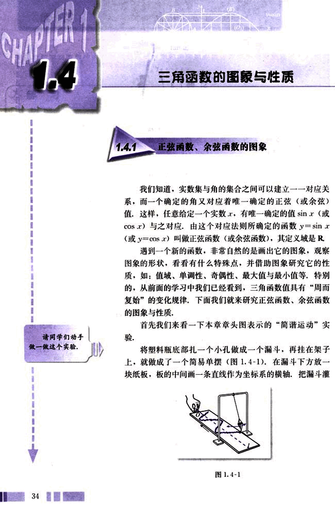
47

# 第一章 三角函数

## 第一章

上细沙并拉离平衡位置，放手使它摆动，同时匀速拉动纸板，这样就可在纸板上得到一条曲线，它就是简谐运动的图像，物理中把简谐运动的图像叫做“正弦曲线”或“余弦曲线”，它表示了漏斗对平衡位置的位移S（纵坐标）随时间t（横坐标）变化的情况。图1.4-2就是某个简谐运动的图像。

有了上述实验，你对正弦函数、余弦函数的图像是否有了一个直观的印象？下面我们利用正弦线画出比较精确的正弦函数图像。

如图1.4-3，在直角坐标系的x轴上取一点$O_1$，以$O_1$为圆心，单位长为半径作圆，从$O_1O$与x轴的交点A起，把$\stackrel{\frown}{O_1O}$分成12等份，过$O_1O$上各分点作x轴的垂线，得到对应于$0，\frac{\pi}{6}，\frac{\pi}{3}，\frac{\pi}{2}，…，2\pi$等角的正弦线，相应地，再把x轴上从0到$2\pi$这一段分成12等份，把角的正弦线向右平移，使它的起点与x轴上的点x重合，再把这些正弦线的终点用光滑的曲线连接起来，就得到函数$y = \sin x$，$x \in [0, 2\pi]$的图像。

因为终边相同的角有相同的三角函数值，所以函数$y = \sin x$，$x \in [2k\pi, 2(k+1)\pi)$，$k \in Z$且$k \ne 0$的图像，与函数

35

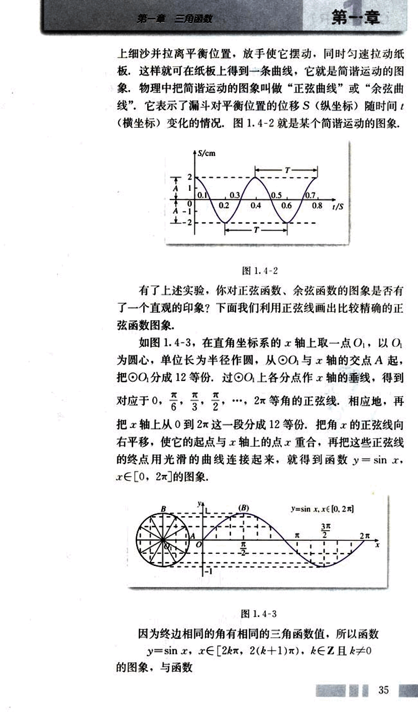
48

# CHAPTER

普通高中课程标准实验教科书 数学 4

## y=sin x, x∈[0, 2π)

的图象的形状完全一致. 于是我们只要将函数

## y=sin x, x∈[0, 2π)

的图象向左、向右平行移动(每次2π个单位长度),就可以得到正弦函数

## y=sin x, x∈R

的图象(图1.4-4).

[image1](images/image1.png)

你能根据诱导公式,以正弦函数的图象为基础,通过适当的图形变换得到余弦函数的图象吗?

## 由诱导公式六我们有

y = cos x = sin($\frac{π}{2}$ + x),

而函数

## y = sin($\frac{π}{2}$ + x), x∈R

的图象可以通过将正弦函数

## y = sin x, x∈R

的图象向左平移$\frac{π}{2}$个单位长度而得到(图1.4-4).

正弦函数的图象和余弦函数的图象分别叫做正弦曲线(sine curve)和余弦曲线(cosine curve).

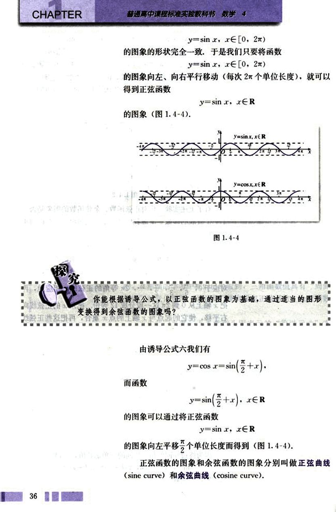
49

# 第一章 三角函数
## 第一节

在作出正弦函数的图象时，应抓住哪些关键点？

观察图1.4-3. 在函数 $y = \sin x$，$x \in [0, 2\pi]$ 的图像上，起关键作用的点有以下五个：

$(0, 0)$，$(\frac{\pi}{2}, 1)$，$(\pi, 0)$，$(\frac{3\pi}{2}, -1)$，$(2\pi, 0)$.

事实上，描出这五个点后，函数 $y = \sin x$，$x \in [0, 2\pi]$ 的图像形状就基本上确定了。因此，在精确度要求不太高时，我们常常先找出这五个关键点，再用光滑的曲线将它们连接起来，就得到函数的简图。这种近似的“五点（画图）法”是非常实用的。

类似于正弦函数图像的五个关键点，你能找出余弦函数的五个关键点吗？请将它们的坐标填入下表，然后作出 $y = \cos x$，$x \in [0, 2\pi]$ 的简图。

[image](images/image.png)

## 例1

画出下列函数的简图：

(1) $y = 1 + \sin x$，$x \in [0, 2\pi]$;

(2) $y = -\cos x$，$x \in [0, 2\pi]$.

解：(1) 按五个关键点列表：

| x     | 0     | $\frac{\pi}{2}$ | $\pi$   | $\frac{3\pi}{2}$ | $2\pi$  |
|-------|--------|-----------------|---------|-----------------|---------|
| $\sin x$ | 0     | 1               | 0       | -1              | 0       |
| $1 + \sin x$ | 1     | 2               | 1       | 0              | 1       |

37

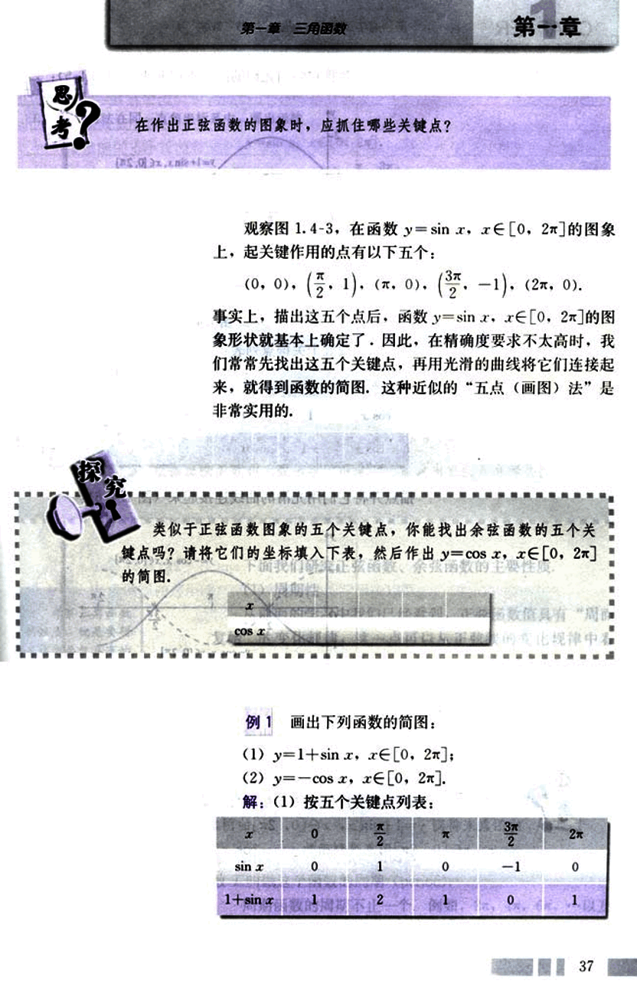
50

# CHAPTER

普通高中课程标准实验教科书 数学 4

描点并将它们用光滑的曲线连接起来（图1.4-5）：

(2)按五个关键点列表：

|  x  | 0 |  π/2  |  π  |  3π/2  |  2π  |
|---|---|---|---|---|---|
| cos x | 1 | 0 | -1 | 0 | 1 |
| -cos x | -1 | 0 | 1 | 0 | -1 |

描点并将它们用光滑的曲线连接起来（图1.4-6）：

你能否从函数图象变换的角度出发，利用函数 y=sin x, x∈[0, 2π] 的图象来得到 y=1+sin x, x∈[0, 2π] 的图象？同样的，能否从函数 y= cos x, x∈[0, 2π] 图象得到函数 y=-cos x, x∈[0, 2π] 的图象？

---

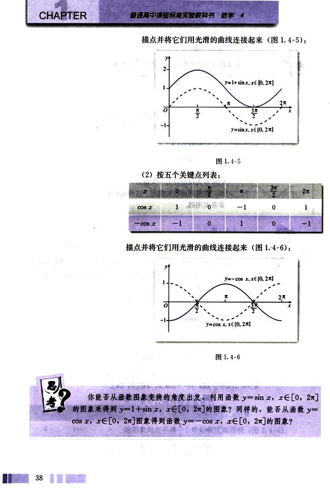
51

# 第一章 三角函数

## 练习

1. 用多种方法在同一直角坐标系中，画出函数
$y = \sin x, x \in [0, 2\pi]$，
$y = \cos x, x \in [-\frac{\pi}{2}, \frac{3\pi}{2}]$
的图像。通过观察两条曲线，说出它们的异同。

2. 想一想函数 $y = \sin (x - \frac{3\pi}{2})$ 和 $y = \cos x$ 的图像，并在同一直角坐标系中，画出它们的草图。

## 1.4.2 正弦函数、余弦函数的性质

根据正弦函数和余弦函数的图像，你能说出它们具有哪些性质？

下面我们研究正弦函数、余弦函数的主要性质。

(1) 周期性

从前面的学习中我们已经看到，正弦函数值具有“周而复始”的变化规律，这一点可以从正弦线的变化规律中看出，还可以从诱导公式
$\sin(x + 2k\pi) = \sin x (k \in Z)$
中得到反映，即当自变量 x 的值增加 2π 的整数倍时，函数值重复出现。数学上，用周期性这个概念来定量地刻画这种“周而复始”的变化规律。

对于函数 $f(x)$，如果存在一个非零常数 T，使得当 x 取定义域内的每一个值时，都有
$f(x + T) = f(x)$，
那么函数 $f(x)$ 就叫做周期函数 (periodic function)，非零常数 T 叫做这个函数的周期 (period)。

周期函数的周期不止一个。例如，$2\pi$，$4\pi$，$6\pi$，…以及 $-2\pi$，$-4\pi$，$-6\pi$，…都是正弦函数的周期。事实上，任何…
39

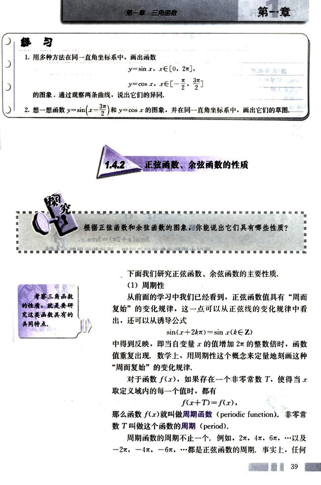
52

# CHAPTER

一个常数 $2k\pi(k \in Z 且 k \neq 0)$ 都是它的周期.

如果在周期函数 $f(x)$ 的所有周期中存在一个最小的正数，那么这个最小正数就叫做 $f(x)$ 的最小正周期 (minimal positive period)。例如，正弦函数的最小正周期是 $2\pi$。

根据上述定义，我们有：

正弦函数是周期函数。$2k\pi (k \in Z 且 k \neq 0)$ 都是它的周期，最小正周期是 $2\pi$。

类似地，请同学们自己探索一下余弦函数的周期性，并将得到的结果填在横线上：

## 例 2  求下列函数的周期：

(1) $y = 3\cos x$,  $x \in R$;

(2) $y = \sin 2x$,  $x \in R$;

(3) $y = 2\sin(\frac{1}{2}x - \frac{\pi}{6})$,  $x \in R$.

解：

(1) 因为

$3\cos(x + 2\pi) = 3\cos x$,

所以由周期函数的定义可知，原函数的周期为 $2\pi$。

(2) 因为

$\sin 2(x + \pi) = \sin(2x + 2\pi) = \sin 2x$,

所以由周期函数的定义可知，原函数的周期为 $\pi$。

(3) 因为

$2\sin[\frac{1}{2}(x + 4\pi) - \frac{\pi}{6}] = 2\sin[(\frac{1}{2}x - \frac{\pi}{6}) + 2\pi]$

$= 2\sin(\frac{1}{2}x - \frac{\pi}{6})$.

所以由周期函数的定义可知，原函数的周期为 $4\pi$。

你能从例 2 的解答过程中归纳一下这些函数的周期与解析式中哪些量有关吗？

40

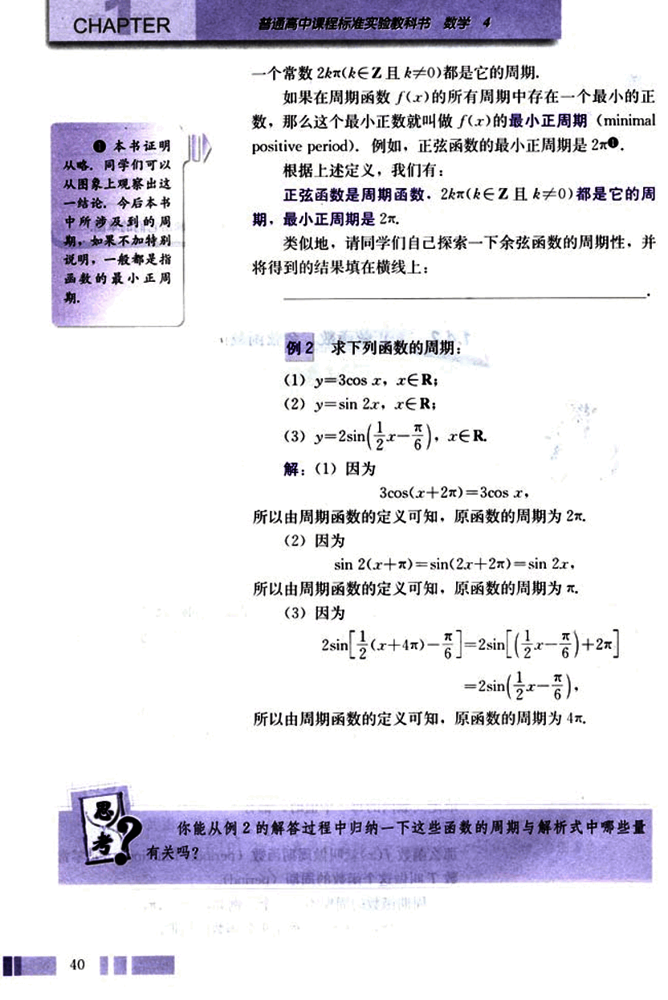
53

# 第一章 三角函数

## 练习

1. 等式 $\sin(30^\circ + 120^\circ) = \sin 30^\circ$ 是否成立？如果这个等式成立，能否说 120° 是正弦函数 $y = \sin x$，$x \in R$ 的一个周期？为什么？

2. 求下列函数的周期：
    (1) $y = \sin \frac{x}{3}$,  $x \in R$;
    (2) $y = \cos 4x$, $x \in R$;
    (3) $y = \frac{1}{2}\cos x$, $x \in R$;
    (4) $y = \sin(x + \frac{\pi}{3})$, $x \in R$.

3. 你认为我们应当如何利用函数的周期性来认识周期函数的其他性质？

## 函数 $y = A\sin(\omega x + \varphi)$ 及函数 $y = A\cos(\omega x + \varphi)$ 的周期

从前面的例子中可以看出，函数
$y = A\sin(\omega x + \varphi)$, $x \in R$

及函数
$y = A\cos(\omega x + \varphi)$, $x \in R$

(其中 $A$, $\omega$, $\varphi$ 为常数，且 $A \ne 0$, $\omega > 0$) 的周期仅与自变量的系数有关。那么，如何用自变量的系数表示上述函数的周期呢？

事实上，令 $z = \omega x + \varphi$，那么 $x \in R$ 必须并且只需 $z \in R$，且函数 $y = A\sin z$, $z \in R$ 及函数 $y = A\cos z$, $z \in R$ 的周期都是 $2\pi$。由于

$z + 2\pi = (\omega x + \varphi) + 2\pi = \omega (x + \frac{2\pi}{\omega}) + \varphi$.

所以自变量 $x$ 只要并且至少要增加到 $x + \frac{2\pi}{\omega}$，函数值才能重复出现，即

41

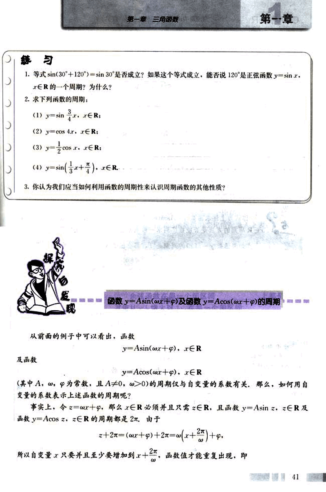
54

# CHAPTER

普通高中课程标准实验教科书 数学 4

## 是使等式

$T = \frac{2\pi}{\omega}$

成立的最小正数，从而，函数

及函数

的周期 $T = \frac{2\pi}{\omega}$。

$Asin[\omega(x+T)]+\varphi = Asin(\omega x+\varphi)$，

$Acos[\omega(x+T)]+\varphi = Acos(\omega x+\varphi)$

$y = Asin(\omega x + \varphi), x \in R$

$y = Acos(\omega x + \varphi), x \in R$

根据这个结论，我们可以由这类函数的解析式直接写出函数的周期。

## 思考

你认为上述求函数 $y = Asin(\omega x + \varphi)$，$x \in R$ 及函数 $y = Acos(\omega x + \varphi)$，$x \in R$ 周期的方法是否能推广到求一般周期函数的周期上去？即命题：

“如果函数 $y = f(x)$ 的周期是 $T$，那么函数 $y = f(\omega x)$ 的周期是 $\frac{T}{\omega}$”

是否成立？

(2) 奇偶性

观察正弦曲线和余弦曲线，可以看到正弦曲线关于原点 O 对称，余弦曲线关于 y 轴对称。

由诱导公式 $sin(-x) = -sinx$，$cos(-x) = cosx$ 可知：

正弦函数是奇函数，余弦函数是偶函数。

(3) 单调性

我们可以先在正弦函数的一个周期的区间上（如 $[-\frac{\pi}{2}, \frac{3\pi}{2}]$）讨论它的单调性，再利用它的周期性，将单调性扩展到整个定义域。

观察图 1.4-7，可以看到：

当 x 由 $-\frac{\pi}{2}$ 增大到 $\frac{\pi}{2}$ 时，曲线逐渐上升，$sinx$ 的值由 -1 增大到 1；当 x 由 $\frac{\pi}{2}$ 增大到 $\frac{3\pi}{2}$ 时，曲线逐渐下降，$sinx$

42

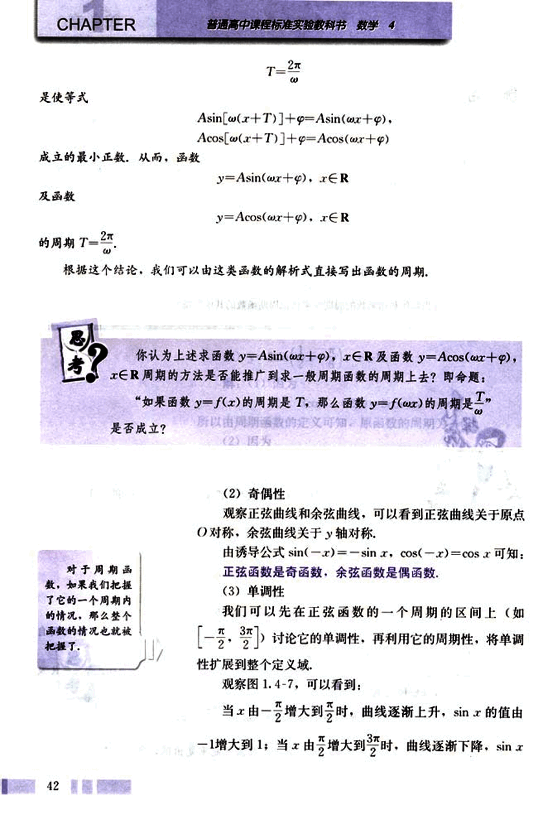
55

# 第一章 三角函数

## 第一章

的值由1减小到-1. 这个变化情况如下表所示：

| x       | $-\frac{\pi}{2}$ | … | 0     | … | $\frac{\pi}{2}$ | … | π       | … | $\frac{3\pi}{2}$ |
|---------|-----------------|----|-------|----|-----------------|----|---------|----|-----------------|
| sin x   | -1              |    | 0     |    | 1              |    | 0       |    | -1              |

这就是说，正弦函数 y = sin x 在区间 $[-\frac{\pi}{2}, \frac{\pi}{2}]$ 上是增函数，在区间 $[\frac{\pi}{2}, \frac{3\pi}{2}]$ 上是减函数。

由正弦函数的周期性可知：

正弦函数在每一个闭区间 $[-\frac{\pi}{2} + 2k\pi, \frac{\pi}{2} + 2k\pi]$ (k∈Z) 上都是增函数，其值从-1增大到1；在每一个闭区间 $[\frac{\pi}{2} + 2k\pi, \frac{3\pi}{2} + 2k\pi]$ 上都是减函数，其值从1减小到-1。

类似地，在余弦函数的一个周期上(如 $[-\pi, \pi]$)，观察曲线，将看到的函数值的变化情况填入下表：

| x       | -π      | … | $-\frac{\pi}{2}$ | … | 0     | … | $\frac{\pi}{2}$ | … | π       |
|---------|----------|----|-----------------|----|-------|----|-----------------|----|----------|
| cos x   |          |    |                 |    |       |    |                 |    |          |

由余弦函数的周期性可知：

余弦函数在每一个闭区间 ______ 上都是增函数，其值从-1增大到1；在每一个闭区间 ______ 上都是减函数，其值从1减小到-1。

(4) 最大值与最小值

从上述对正弦函数、余弦函数的单调性的讨论中容易得到：

正弦函数当且仅当 x = ______ 时取得最大值 1；

当且仅当 x = ______ 时取得最小值 -1；

余弦函数当且仅当 x = ______ 时取得最大值 1；

当且仅当 x = ______ 时取得最小值 -1。

例 3 下列函数有最大值、最小值吗？如果有，请写出取最大值、最小值时的自变量 x 的集合，并说出最大值、最小值分别是什么。

43

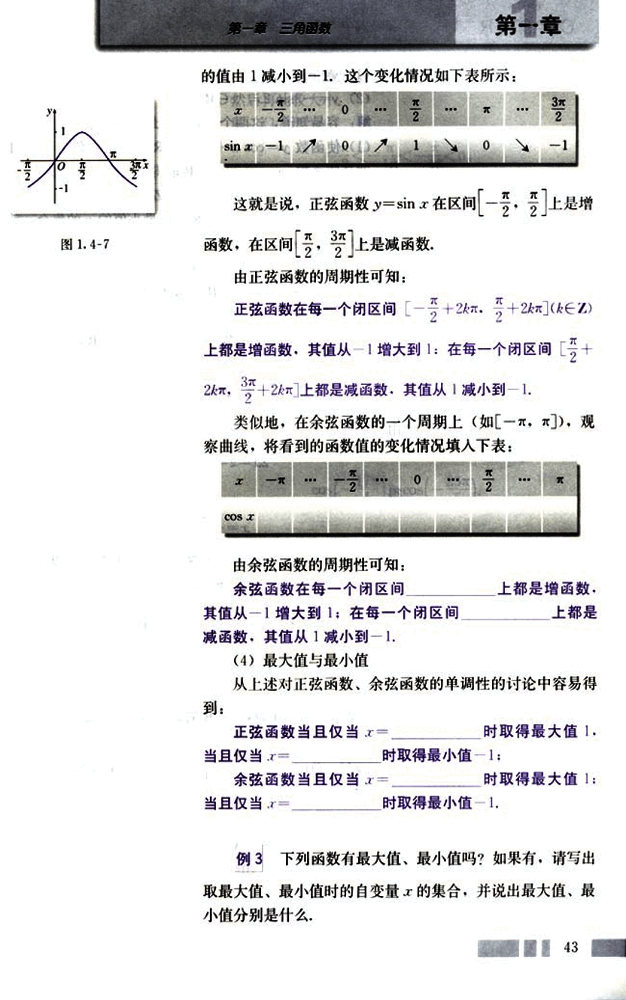
56

# CHAPTER

## 普通高中课程标准实验教科书 数学 4

(1)  y = cos x + 1, x ∈ R;

(2)  y = -3sin 2x, x ∈ R.

解:容易知道，这两个函数都有最大值、最小值。

(1) 使函数 y = cos x + 1, x ∈ R 取得最大值的 x 的集合，就是使函数 y = cos x, x ∈ R 取得最大值的 x 的集合 {x | x = 2kπ, k ∈ Z};

使函数 y = cos x + 1, x ∈ R 取得最小值的 x 的集合，就是使函数 y = cos x, x ∈ R 取得最小值的 x 的集合 {x | x = (2k + 1)π, k ∈ Z}.

函数 y = cos x + 1, x ∈ R 的最大值是 1 + 1 = 2; 最小值是 -1 + 1 = 0.

(2) 令 z = 2x, 使函数 y = -3sin z, z ∈ R 取得最大值的 z 的集合是

{$z | z = -\frac{\pi}{2} + 2kπ, k ∈ Z$}.

由

2x = z = $-\frac{\pi}{2}$ + 2kπ,

得

x = $-\frac{\pi}{4}$ + kπ.

因此使函数 y = -3sin 2x, x ∈ R 取得最大值的 x 的集合是

{$x | x = -\frac{\pi}{4} + kπ, k ∈ Z$}.

同理，使函数 y = -3sin 2x, x ∈ R 取得最小值的 x 的集合是

{$x | x = \frac{\pi}{4} + kπ, k ∈ Z$}.

函数 y = -3sin 2x, x ∈ R 的最大值是 3，最小值是 -3.

## 例 4

利用三角函数的单调性，比较下列各组数的大小：

(1) sin($-\frac{\pi}{18}$) 与 sin($-\frac{\pi}{10}$);

(2) cos($-\frac{23\pi}{5}$) 与 cos($-\frac{17\pi}{4}$).

分析：利用三角函数的单调性比较两个同名三角函数值

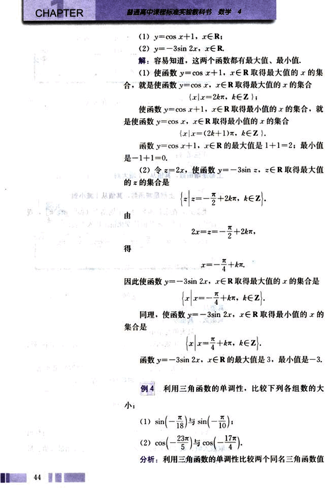
57

# 第一章 三角函数

## 第一章

的大小，可以先用诱导公式将已知角化为同一单调区间内的
角，然后再比较大小。

解：(1) 因为

$-\frac{\pi}{2} < -\frac{\pi}{10} < -\frac{\pi}{18} < 0$。

正弦函数 $y = \sin x$ 在区间 $[-\frac{\pi}{2}, 0]$ 上是增函数，所以

$\sin(-\frac{\pi}{18}) < \sin(-\frac{\pi}{10})$。

(2) $\cos(-\frac{23\pi}{5}) = \cos\frac{23\pi}{5} = \cos\frac{3\pi}{5}$，

$\cos(-\frac{17\pi}{4}) = \cos\frac{17\pi}{4} = \cos\frac{\pi}{4}$。

因为 $0 < \frac{\pi}{4} < \frac{3\pi}{5} < \pi$，且函数 $y = \cos x$，$x \in [0, \pi]$ 是减
函数，所以

$\cos\frac{\pi}{4} > \cos\frac{3\pi}{5}$，

即

$\cos(-\frac{17\pi}{4}) > \cos(-\frac{23\pi}{5})$。

你能求 $y = \sin(\frac{\pi}{3} - \frac{1}{2}x)$，$x \in [-2\pi, 2\pi]$ 的单调递增
区间吗？

例 5 求函数 $y = \sin(\frac{1}{2}x + \frac{\pi}{3})$，$x \in [-2\pi, 2\pi]$ 的单调
递增区间。

分析：我们可以利用正弦函数的单调性来求所给函数的
单调区间。

解：令 $z = \frac{1}{2}x + \frac{\pi}{3}$。函数 $y = \sin z$ 的单调递增区间是

$[-\frac{\pi}{2} + 2k\pi, \frac{\pi}{2} + 2k\pi]$。

由

$-\frac{\pi}{2} + 2k\pi \le \frac{1}{2}x + \frac{\pi}{3} \le \frac{\pi}{2} + 2k\pi$，

得

$-\frac{5\pi}{3} + 4k\pi \le x \le \frac{\pi}{3} + 4k\pi$，$k \in Z$。

取 $k = 0$，得 $-\frac{5\pi}{3} \le x \le \frac{\pi}{3}$，而

$[-\frac{5\pi}{3}, \frac{\pi}{3}] \subset [-2\pi, 2\pi]$。

45

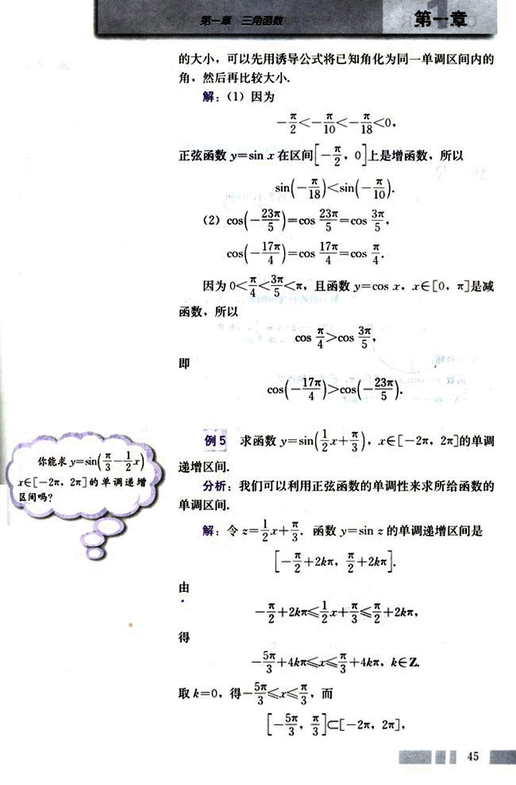
58

# CHAPTER

因此，函数 $y = sin(1(\frac{1}{2}x + \frac{\pi}{3}))$，$x \in [-2\pi, 2\pi]$ 的单调递增区间是 $[-\frac{5\pi}{3}, \frac{\pi}{3}]$。

# 练习

1. 观察正弦曲线和余弦曲线，写出满足下列条件的区间：
(1) sin x > 0;
(2) sin x < 0;
(3) cos x > 0;
(4) cos x < 0.

2. 下列各等式能否成立？为什么？
(1) 2cos x = 3;
(2) sin²x = 0.5.

3. 求使下列函数取得最大值、最小值的自变量的集合，并写出最大值、最小值各是多少：
(1) y = 2sin x,  x∈R;
(2) y = 2 - cos $\frac{x}{3}$, x∈R.

4. 选择题：
函数 y = 4sin x, x ∈ [-π, π] 的单调性是 (  )
(A) 在 [-π, 0] 上是增函数，在 [0, π] 上是减函数.
(B) 在 [-π, -$\frac{\pi}{2}$] 上是增函数，在 [-$\frac{\pi}{2}$, $\frac{\pi}{2}$] 及 [$\frac{\pi}{2}$, π] 上是减函数.
(C) 在 [0, π] 上是增函数，在 [-π, 0] 上是减函数.
(D) 在 [$\frac{\pi}{2}$, π] 及 [-π, -$\frac{\pi}{2}$] 上是增函数，在 [-$\frac{\pi}{2}$, $\frac{\pi}{2}$] 上是减函数.

5. 利用三角函数的单调性，比较下列各组中两个三角函数值的大小：
(1) sin 250° 与 sin 260°;
(2) cos $\frac{15\pi}{8}$ 与 cos $\frac{14\pi}{9}$;
(3) cos 515° 与 cos 530°;
(4) sin(-$\frac{54}{7}\pi$) 与 sin(-$\frac{63}{8}\pi$).

6. 求函数 y = 3sin(2x + $\frac{\pi}{4}$), x ∈ [0, π] 的单调递减区间.

46

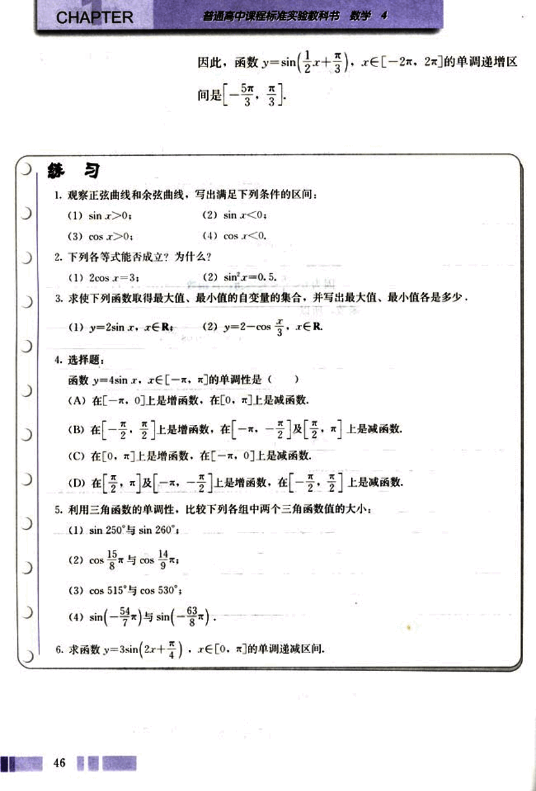
59

# 第一章 三角函数

## 利用单位圆中的三角函数线研究正弦函数、余弦函数的性质

单位圆中的三角函数线直观地表现了三角函数中的自变量与函数值之间的关系，是研究三角函数性质的好工具，用三角函数线研究三角函数的性质体现了数形结合的思想方法，有利于我们从整体上把握有关性质。

如图1，在直角坐标系uOv中，角x的顶点与原点重合，始边与Ou轴重合，终边与单位圆交于点P(u, v)。过P作Ou轴的垂线，交Ou轴于M，分别得正弦线MP、余弦线OM。

当角x的终边绕原点从Ou轴的正半轴开始，按照逆时针方向旋转时，正弦线MP按照

0–1–0–1–0…

的规律周而复始地变化着；同时，余弦线OM按照

1–0–1–0–1…

的规律周而复始地变化着。

由正弦线、余弦线的上述变化规律，可得正弦函数、余弦函数的许多性质，例如：

(1) 周期性：自变量每增加2π（角x旋转一周），正弦函数值(MP)、余弦函数值(OM)重复出现；

(2) 奇偶性：角x与角–x对应的正弦线关于Ou轴对称，余弦线重合，因此正弦函数为奇函数，余弦函数为偶函数；

(3) 单调性：

| 角x                     | $\frac{\pi}{2}$+2kπ→0→$\frac{\pi}{2}$+2kπ | $\frac{\pi}{2}$+2kπ→π+2kπ→$\frac{3\pi}{2}$+2kπ |
| ----------------------- | ----------------------------------- | ----------------------------------- |
| 正弦线MP                | –1→0→1                             | 1→0→–1                             |
| sin x                    | 增函数                               | 减函数                               |

| 角x                     | 2kπ→$\frac{\pi}{2}$+2kπ→π+2kπ | π+2kπ→$\frac{3\pi}{2}$+2kπ→2π+2kπ |
| ----------------------- | ----------------------------------- | ----------------------------------- |
| 余弦线OM                | 1→0→–1                             | –1→0→1                             |
| cos x                    | 减函数                               | 增函数                               |

[图1](images/图1.png)
47

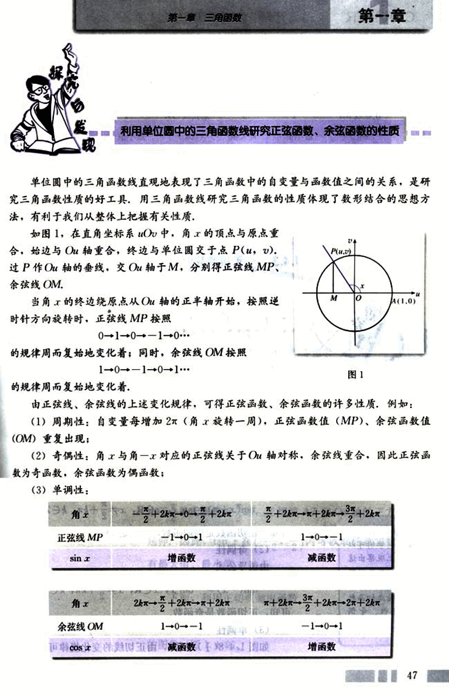
60

# CHAPTER

普通高中课程标准实验教科书 数学 4

(4)最大值、最小值:

| 角 x     |  $\frac{π}{2}$ + 2kπ | $\frac{π}{2}$ + 2kπ | 角 x     |  $\frac{π}{2}$ + 2kπ | 2kπ      |
| -------- | -------------- | -------------- | -------- | -------------- | ---------- |
| 正弦线 MP |     -1          |      1          | 余弦线 OM |     -1          |     1       |
| sin x    | 最小值         | 最大值         | cos x    | 最小值         | 最大值     |

你能借助单位圆中的三角函数线，讨论一下诱导公式等三角函数的其他性质吗？

1.4.3 正切函数的性质与图象

你能否根据研究正弦函数、余弦函数的图象与性质的经验，以同样的方法研究正切函数的图象与性质？

有了前面的知识准备，我们可以从一个新的角度来研究正切函数的性质。

(1)周期性

由诱导公式

tan(x+π) = tan x,  x∈R, x≠$\frac{π}{2}$ + kπ, k∈Z

可知，正切函数是周期函数，周期是π。

(2)奇偶性

由诱导公式

tan(-x) = -tan x, x∈R, x≠$\frac{π}{2}$ + kπ, k∈Z

可知，正切函数是奇函数。

(3)单调性

如图1.4-8(Ⅰ)(Ⅱ)，由正切线的变化规律可以得出，

48

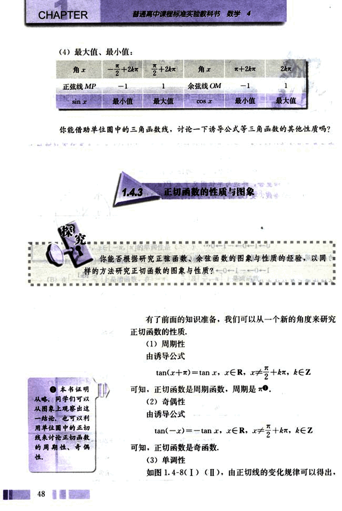
61

# 第一章 三角函数
## 第一章

正切函数在$(-\frac{\pi}{2}, \frac{\pi}{2})$内是增函数，又由正切函数的周期性可知，正切函数在开区间$(-\frac{\pi}{2} + k\pi, \frac{\pi}{2} + k\pi)$，$k \in Z$内都是增函数.

(Ⅱ) (Ⅰ)

(Ⅲ) (Ⅳ)

图 1.4-8

(4) 值域

如图 1.4-8 (Ⅰ)，当 $x$ 大于 $-\frac{\pi}{2}$ 且无限接近 $-\frac{\pi}{2}$ 时，正切线 AT 向 $Oy$ 轴的负方向无限延伸；如图 1.4-8 (Ⅱ) 当 $x$ 小于 $\frac{\pi}{2}$ 且无限接近 $\frac{\pi}{2}$ 时，正切线 AT 向 $Oy$ 轴的正方向无限延伸。因此，$\tan x$ 在 $(-\frac{\pi}{2}, \frac{\pi}{2})$ 内可以取任意实数，但没有最大值、最小值。

因此，正切函数的值域是实数集 R.

下面，利用正切线画出函数

$y = \tan x, x \in (-\frac{\pi}{2}, \frac{\pi}{2})$

的图像（图 1.4-9）.

49

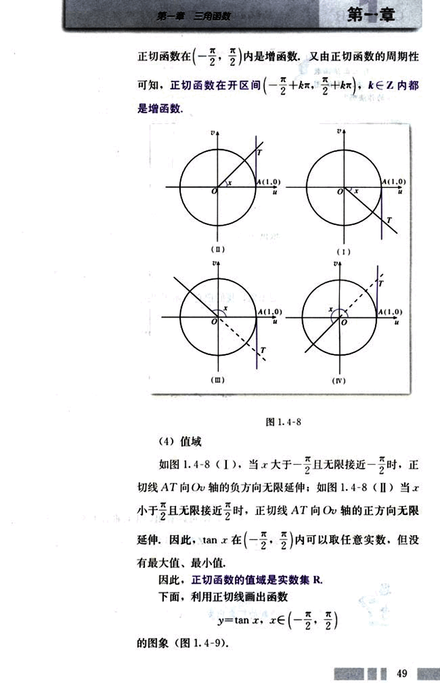
62

# CHAPTER

普通高中课程标准实验教科书 数学 4

你能类比正弦函数图象的作法，说说图1.4-9的作法吗？

根据正切函数的周期性，只要把上述图象向左、右扩展，就可以得到正切函数

$y = tan x, x∈R, x≠\frac{π}{2} + kn, k∈Z$

的图象，我们把它叫做正切曲线（图1.4-10）.

从图1.4-10可以看出，正切曲线是被相互平行的直线

$x = \frac{π}{2} + kn, k∈Z$

所隔开的无穷多支曲线组成的。

你能从正切函数的图象出发，讨论它的性质吗？

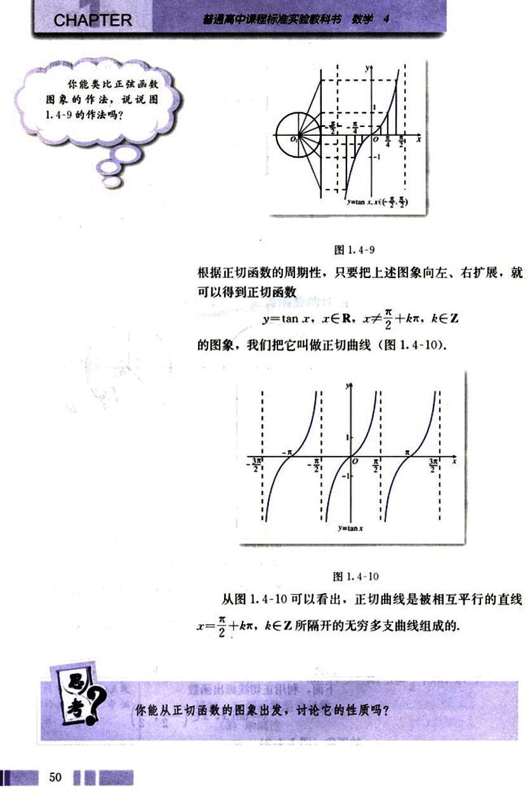
63

# 第一章 三角函数

## 例6

求函数 $y = tan(\frac{\pi}{2}(x + \frac{\pi}{3}))$ 的定义域、周期和单调区间.

解：函数的自变量 $x$ 应满足

$\frac{\pi}{2}x + \frac{\pi^2}{3} \neq k\pi + \frac{\pi}{2}, k \in Z.$

即

$x \neq 2k + \frac{1}{3}, k \in Z.$

所以，函数的定义域是 $\{x|x \neq 2k + \frac{1}{3}, k \in Z\}.$

由于

$f(x) = tan(\frac{\pi}{2}(x + \frac{\pi}{3})) = tan(\frac{\pi}{2}x + \frac{\pi^2}{3} + \pi)$

$= tan[\frac{\pi}{2}(x + 2) + \frac{\pi}{3}] = f(x + 2).$

因此函数的周期为 2.

由 $-\frac{\pi}{2} + k\pi < \frac{\pi}{2}x + \frac{\pi^2}{3} < \frac{\pi}{2} + k\pi, k \in Z$ 解得

$-\frac{5}{3} + 2k < x < \frac{1}{3} + 2k, k \in Z.$

因此，函数的单调递增区间是

$(-\frac{5}{3} + 2k, \frac{1}{3} + 2k), k \in Z.$

## 练习

1. 根据图 1.4-9，写出利用正切线画函数 $y = tan \ x, x \in (-\frac{\pi}{2}, \frac{\pi}{2})$ 图象的方法.

2. 观察正切曲线，写出满足下列条件的 $x$ 值的范围：

(1) $tan \ x > 0;$      (2) $tan \ x = 0;$      (3) $tan \ x < 0.$

3. 求函数 $y = tan \ 3x$ 的定义域.

4. 求下列函数的周期：

(1) $y = tan \ 2x, x \neq \frac{\pi}{4} + \frac{k\pi}{2} (k \in Z);$

(2) $y = 5tan \frac{x}{2}, x \neq (2k + 1)\pi (k \in Z).$

51

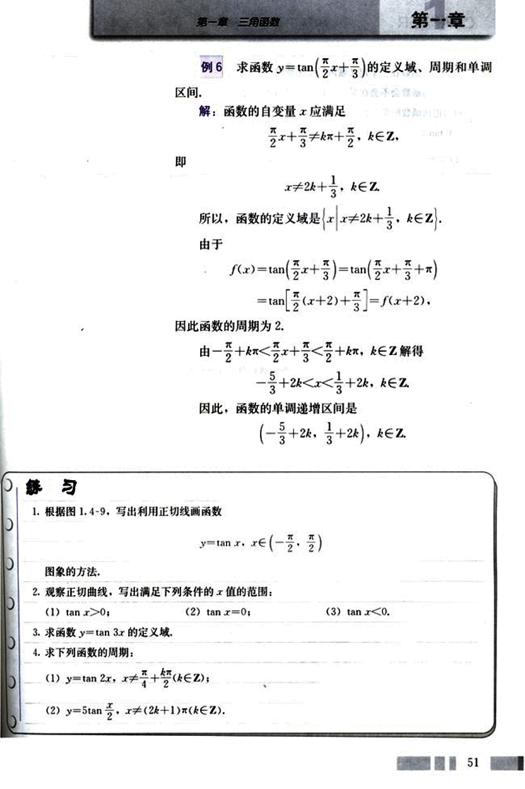
64

# CHAPTER 1

5. (1)正切函数在整个定义域内是增函数吗？为什么？

(2)正切函数会不会在某一区间内是减函数？为什么？

6. 利用正切函数的单调性比较下列各组中两个正切值的大小：

(1) tan 138° 与 tan 143°；

(2) tan($\frac{-13}{4}$) 与 tan($\frac{-17}{5}$)；

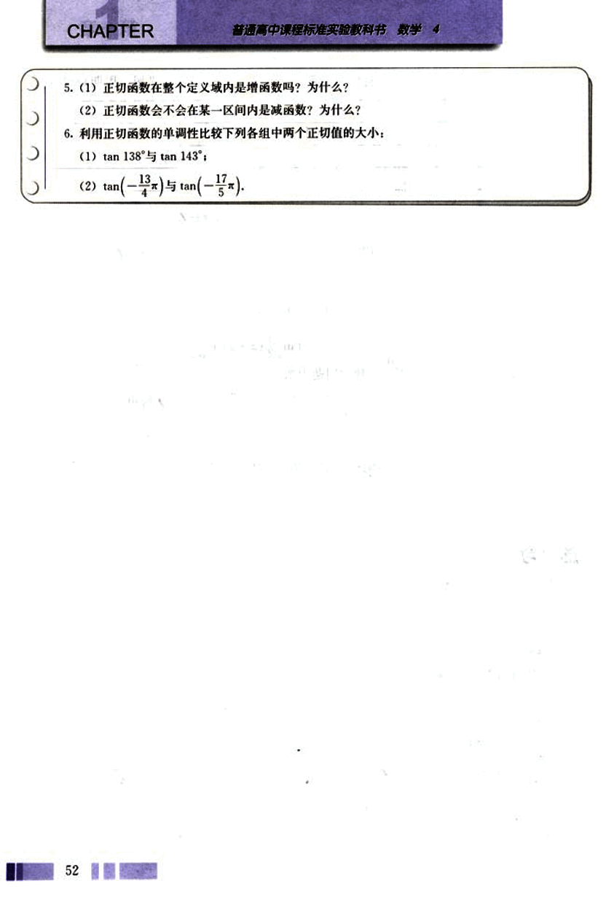
65

# 第一章 三角函数

## 习题 1.4 A组

1. 画出下列函数的简图：
(1)  y = 1 - sin x,  x ∈ [0, 2π];
(2)  y = 3cos x + 1, x ∈ [0, 2π].

2. 求使下列函数取得最大值、最小值的自变量 x 的集合，并分别写出最大值、最小值是什么：
(1)  y = 1 - $\frac{1}{2}$cos x, x ∈ R;
(2)  y = 3sin(2x + $\frac{π}{4}$), x ∈ R;
(3)  y = -$\frac{3}{2}$cos($\frac{1}{6}$x - $\frac{π}{6}$), x ∈ R;
(4)  y = $\frac{1}{2}$sin($\frac{1}{2}$x + $\frac{π}{3}$), x ∈ R.

3. 求下列函数的周期：
(1)  y = sin $\frac{x}{2}$, x ∈ R;
(2)  y = $\frac{1}{2}$cos 4x, x ∈ R.

4. 利用函数的单调性比较下列各组中两个三角函数值的大小：
(1) sin 103°15′ 与 sin 164°30′;
(2) cos($-\frac{47π}{10}$) 与 cos($-\frac{44π}{9}$);
(3) sin 508° 与 sin 144°;
(4) cos 760° 与 cos(-770°).

5. 求下列函数的单调区间：
(1) y = 1 + sin x, x ∈ R;
(2) y = -cos x, x ∈ R.

6. 求函数 y = -tan(x + $\frac{π}{6}$) + 2 的定义域.

7. 求函数 y = tan(2x - $\frac{π}{3}$), x ≠ $\frac{π}{12}$ + $\frac{5π}{2}$k (k ∈ Z) 的周期.

8. 利用正切函数的单调性比较下列各组中两个函数值的大小：
(1) tan(-$\frac{1}{5}$π) 与 tan(-$\frac{3}{7}$π);
(2) tan 1519° 与 tan 1493°;
(3) tan 6$\frac{π}{11}$ 与 tan(-5$\frac{3}{11}$π);
(4) tan $\frac{7π}{8}$ 与 tan $\frac{π}{6}$.

9. 根据正切函数的图象，写出使下列不等式成立的 x 的集合：
(1) 1 + tan x ≥ 0;
(2) tan x - √3 ≥ 0.

10. 容易知道，正弦函数 y = sin x 是奇函数，正弦曲线关于原点对称，即原点是正弦曲线的对称中心，除原点外，正弦曲线还有其他对称中心吗？如果有，对称中心的坐标是什么？另外，正弦曲线是轴对称图形吗？如果是，对称轴的方程是什么？

53

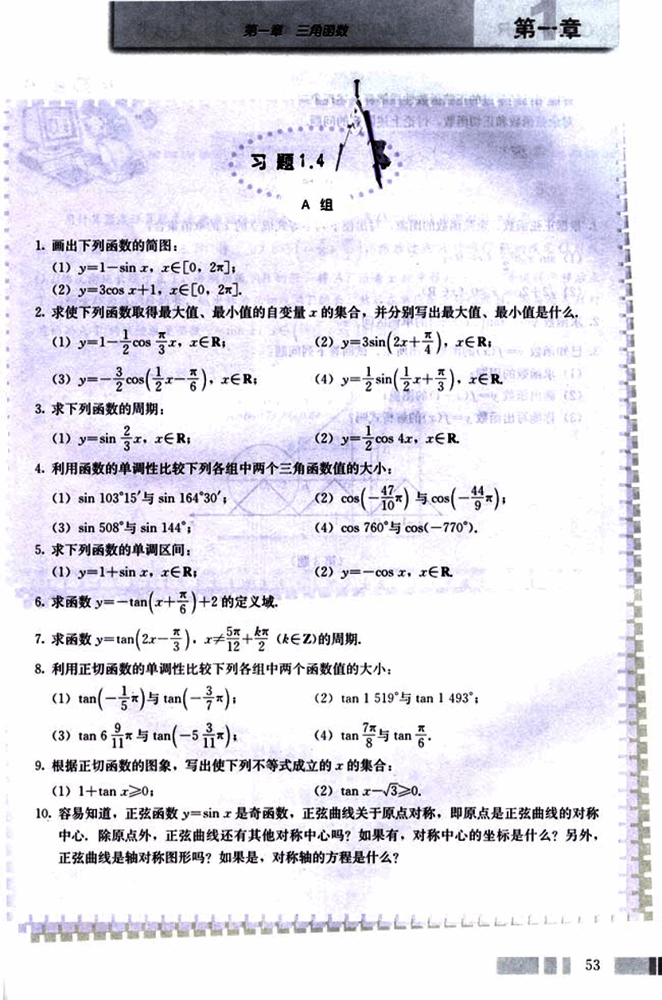
66

# CHAPTER

普通高中课程标准实验教科书 数学 4

你能用已经学过的正弦函数性质解释上述现象吗？
对余弦函数和正切函数，讨论上述同样的问题。

B组

1. 根据正弦函数、余弦函数的图象，写出使下列不等式成立的x的取值集合：
(1) $\sin x \ge \frac{\sqrt{3}}{2}$ ($x \in R$);
(2) $\sqrt{2} + 2\cos x \ge 0$ ($x \in R$).

2. 求函数 $y = -\tan(2x - \frac{3\pi}{4})$ 的单调区间.

3. 已知函数 $y = f(x)$ 的图象如图所示，试回答下列问题：
(1) 求函数的周期；
(2) 画出函数 $y = f(x+1)$ 的图象；
(3) 你能写出函数 $y = f(x)$ 的解析式吗？

[image](images/graph.png)

(第3题)

54

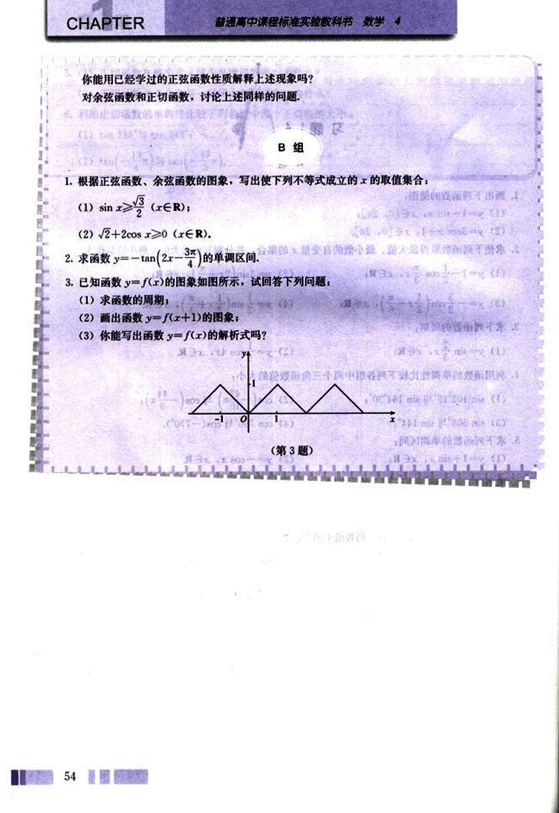
67

# 第一章 三角函数
## 第一章

### 利用正切线画函数 $y = \tan x, x \in (-\frac{\pi}{2}, \frac{\pi}{2})$ 的图像

用计算器或计算机在直角坐标系的x轴上任意取一点O，以O为圆心作单位圆，交x轴于点A，在圆O上任取一点B，作$\angle AOB \in (-\frac{\pi}{2}, \frac{\pi}{2})$，然后过点A作圆O的切线交OB或OB的反向延长线于点T，并测出弧AB的长，将AT沿着x轴平移到A1T1，并使得平移后点T1的横坐标为弧AB的长，纵坐标为正切线AT的长。然后在单位圆上移动点B，则与动点B对应的动点T1的轨迹就是函数$y = \tan x, x \in (-\frac{\pi}{2}, \frac{\pi}{2})$的图像。

$r = 1.00 \quad T_1: (0.73, 0.89)$
弧$AB = 0.73 \quad AT = 0.89$

[image](images/image.png)

55

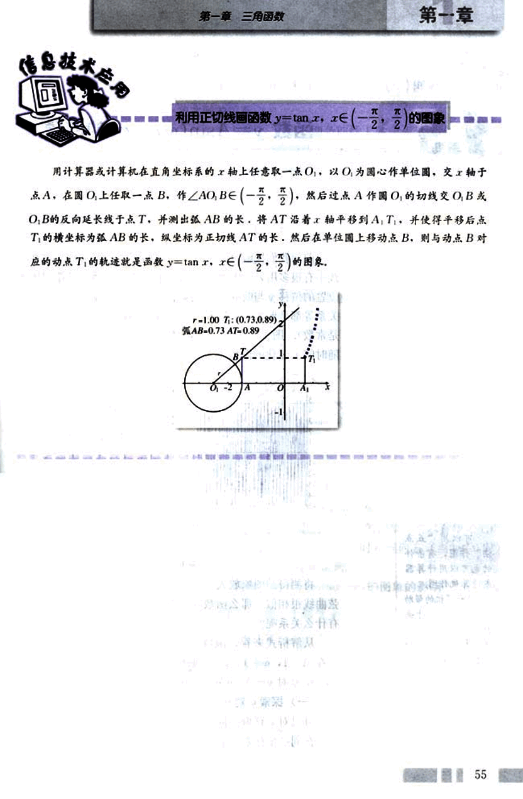
