# 1.5　函数y=Asin（ωx+φ）的图像

68

# CHAPTER 1

## 1.5 函数y=Asin(ωx+φ)的图象

前面我们接触过形如y=Asin(ωx+φ)的函数，它在实践中有很多用处。例如，在物理中，简谐运动中单摆对平衡位置的位移y与时间x的关系、交流电的电流y与时间x的关系等都是形如y=Asin(ωx+φ)的函数（其中A，ω，φ都是常数）。图1.5-1(1)是某次实验测得的交流电的电流y随时间x变化的图象。

[图1.5-1(1)](images/1.5-1-1.png)
[图1.5-1(2)](images/1.5-1-2.png)

可以用“五点法”作图，有条件的也可以用计算器或计算机作图。

在计算机的帮助下，A，ω，φ对函数y=Asin(ωx+φ)的图象变化的影响能直观地得到反映。

将测得的图象放大（如图1.5-1(2)），可以看出它和正弦曲线很相似，那么函数y=Asin(ωx+φ)与函数y=sinx有什么关系呢？

从解析式来看，函数y=sinx就是函数y=Asin(ωx+φ)在A=1，ω=1，φ=0时的情况。现在，我们就来探索A，ω，φ对y=Asin(ωx+φ)的图象的影响。

(一)探索对y=sin(x+φ)，x∈R的图象的影响。

可以对φ取不同的值，利用计算器或计算机作出这些函数在同一坐标系中的图象，观察它们与y=sinx的图象之

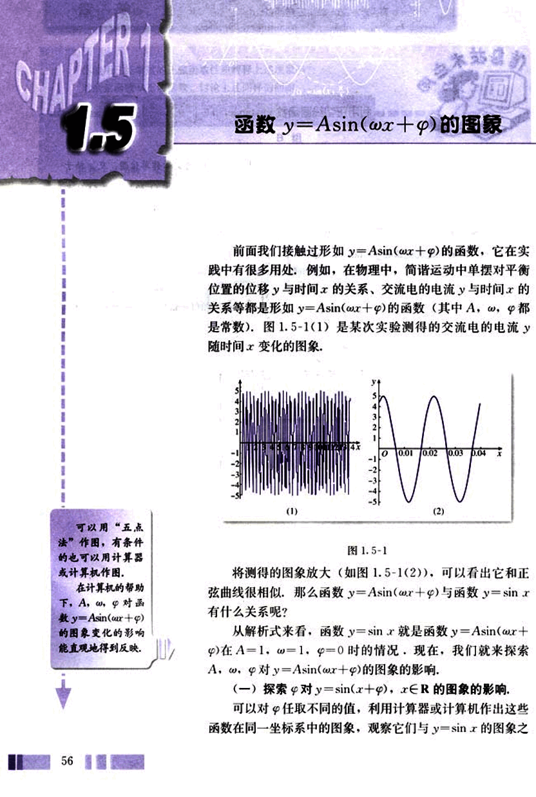
69

# 第一章 三角函数
## 第一节

间的关系.

这里，我们不妨来观察 y = sin(x + $\frac{\pi}{3}$) 和 y = sin x 的图像之间的关系.

如图 1.5-2，分别在两条曲线上各恰当地选取一个纵坐标相同的点，沿两条曲线同时移动这两点，并保持它们的纵坐标相等，观察它们横坐标的关系，可以发现，对于同一个 y 值，y = sin(x + $\frac{\pi}{3}$) 的图像上的点的横坐标总是等于 y = sin x 的图像上对应点的横坐标减去 $\frac{\pi}{3}$。这说明，y = sin(x + $\frac{\pi}{3}$) 的图像，可以看作是把正弦曲线 y = sin x 上所有的点向左平行移动 $\frac{\pi}{3}$ 个单位长度而得到.

[图1.5-2](images/1.5-2.png)

通过实验可以看到，当 φ 取其他的值也有类似的情况. 因此，y = sin(x + φ) (其中 φ ≠ 0) 的图像，可以看作是把正弦曲线上所有的点向左 (当 φ > 0 时) 或向右 (当 φ < 0 时) 平行移动 |φ| 个单位长度而得到.

(二) 探索 ω 对 y = sin(ωx + φ) 的图像的影响.

为了研究方便，不妨令 φ = $\frac{\pi}{3}$。此时，可以对 ω 任取不同的值，利用计算器或计算机作出这些函数在同一坐标系中的图像，观察它们与 y = sin(x + $\frac{\pi}{3}$) 的图像之间的关系.

这里，我们不妨来观察 y = sin(2x + $\frac{\pi}{3}$) 的图像和 y = sin(x + $\frac{\pi}{3}$) 的图像之间的关系.

57

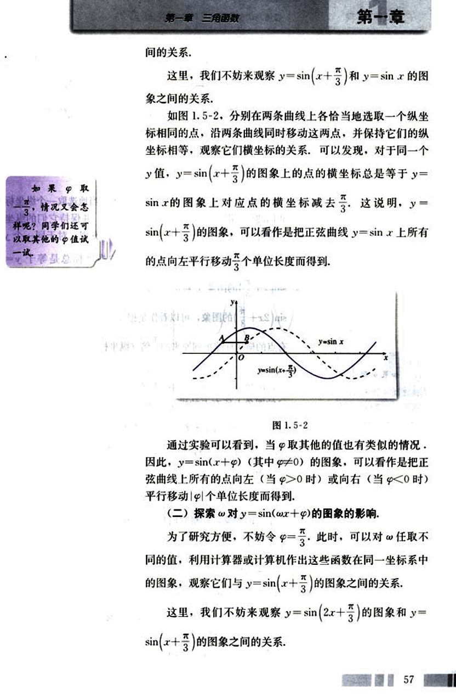
70

# CHAPTER 1

普通高中课程标准实验教科书 数学 4

# 图 1.5-3

[image](images/image.png)

如图 1.5-3，分别在两条曲线上各恰当地选取一个纵坐标相同的点，沿两条曲线同时移动这两点，并保持它们的纵坐标相等，观察它们横坐标的关系，可以发现，对于同一个 y 值，$y = \sin(2x + \frac{\pi}{3})$ 的图象上的点的横坐标总是等于 $y = \sin(x + \frac{\pi}{3})$ 的图象上对应点的横坐标的 $\frac{1}{2}$ 倍。这说明，$y = \sin(2x + \frac{\pi}{3})$ 的图象，可以看作是把 $y = \sin(x + \frac{\pi}{3})$ 的图象上所有点的横坐标缩短到原来的 $\frac{1}{2}$ 倍（纵坐标不变）而得到的。

通过实验可以看到，当 ω 取其他值时也有类似情况，因此，函数 $y = \sin(\omega x + \varphi)$ 的图象，可以看作是把 $y = \sin(x + \varphi)$ 的图象上所有点的横坐标缩短（当 ω>1 时）或伸长（当 0<ω<1 时）到原来的 $\frac{1}{\omega}$ 倍（纵坐标不变）而得到的。

### (三) 探索 A 对 y=Asin(ωx+φ) 的图象的影响

为了研究方便，不妨令 ω=2，φ=$\frac{\pi}{3}$。此时，可以对 A 任取不同的值，利用计算器或计算机作出这些函数在同一坐标系中的图象，观察它们与 $y = \sin(2x + \frac{\pi}{3})$ 的图象之间的关系。

这里，我们不妨来观察 y=3sin(2x+$\frac{\pi}{3}$) 的图象和 y=sin(2x+$\frac{\pi}{3}$) 的图象之间的关系。

如图 1.5-4，分别在两条曲线上各取一个横坐标相同的点，沿两条曲线同时移动这两点，并使它们的横坐标保持相同，观察它们纵坐标的关系，可以发现，对于同一个 x 值，

58

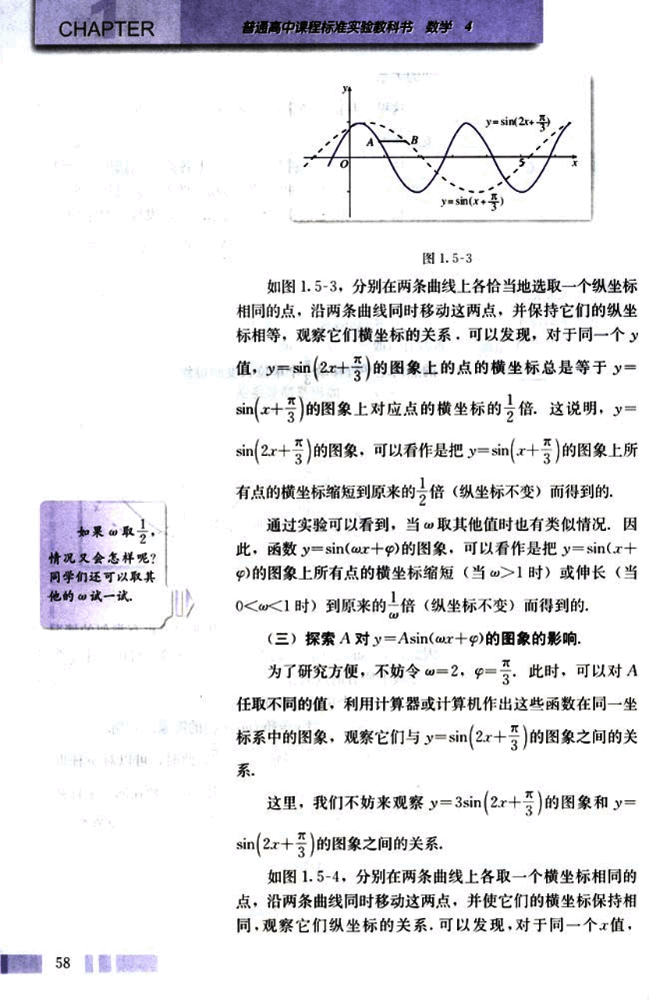
71

# 第一章 三角函数

## 如果取A=$\frac{1}{3}$，情况又会怎样呢？同学们还可以取其他的A值试一试。

函数 $y=3\sin(2x+\frac{\pi}{3})$ 的图象上的点的纵坐标等于函数 $y=\sin(2x+\frac{\pi}{3})$ 的图象上点的纵坐标的3倍，这说明，$y=3\sin(2x+\frac{\pi}{3})$ 的图象，可以看作是把 $y=\sin(2x+\frac{\pi}{3})$ 的图象上所有的点的纵坐标伸长到原来的3倍（横坐标不变）而得到的。

[图1.5-4](images/1.5-4.png)

通过实验可以看到，A取其他值时也有类似的情况。因此，函数 $y=A\sin(\omega x+\varphi)$ 的图象，可以看作是把 $y=\sin(\omega x+\varphi)$ 上所有点的纵坐标伸长（当A>1时）或缩短（当0<A<1时）到原来的A倍（横坐标不变）而得到。从而，函数 $y=A\sin(\omega x+\varphi)$ 的值域是[-A, A]，最大值是A，最小值是-A。

## 例1 画出函数 $y=2\sin(\frac{1}{3}x-\frac{\pi}{6})$ 的简图。

**解：**先把正弦曲线上所有点向右平行移动6个单位长度，得到 $y=\sin(x-\frac{\pi}{6})$ 的图象；再把后者所有点的横坐标伸长到原来的3倍（纵坐标不变），得到 $y=\sin(\frac{1}{3}x-\frac{\pi}{6})$ 的

59

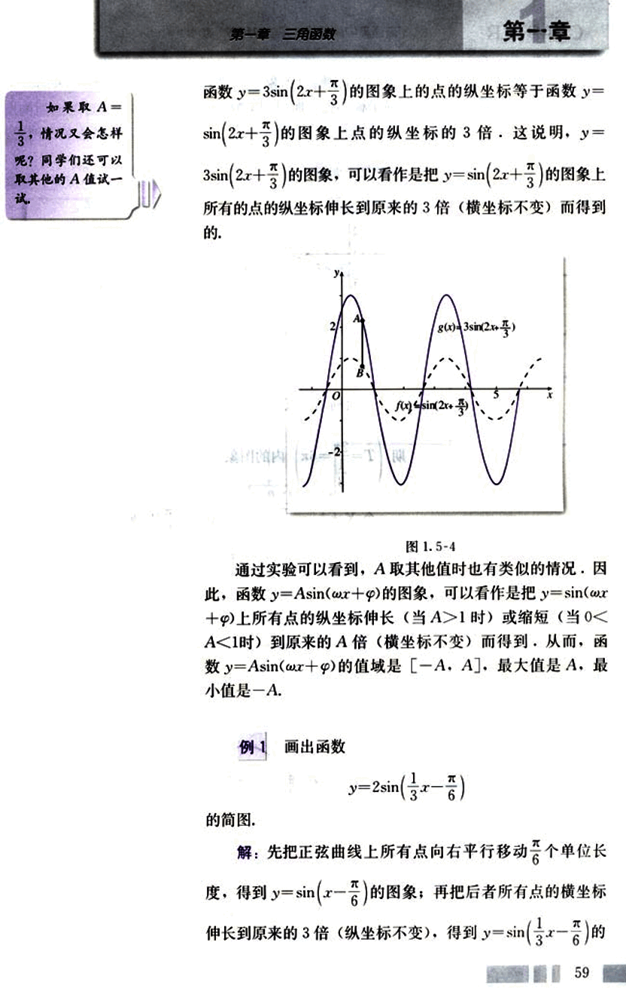
72

# CHAPTER

普通高中课程标准实验教科书 数学 4

图象：再把所得图象上所有点的纵坐标伸长到原来的2倍（横坐标不变）而得到函数

$y = 2\sin(\frac{1}{3}x - \frac{\pi}{6})$

的图象，如图1.5-5.

[image](images/1.5-5.png)

图 1.5-5

下面利用“五点法”画函数 $y = 2\sin(\frac{1}{3}x - \frac{\pi}{6})$ 在一个周期 $(\frac{2\pi}{\frac{1}{3}} = 6\pi)$ 内的图象。

令 $X = \frac{1}{3}x - \frac{\pi}{6}$，则 $x = 3(X + \frac{\pi}{6})$。列表：

| X     | 0       | $\frac{\pi}{2}$ | $\pi$     | $\frac{3\pi}{2}$ | $2\pi$    |
|-------|----------|---------------|-----------|---------------|-----------|
| x     | $\frac{\pi}{2}$ | $\frac{7\pi}{6}$ | $\frac{7\pi}{2}$ | $\frac{13\pi}{6}$ | $\frac{13\pi}{2}$ |
| y     | 0       | 2             | 0         | -2            | 0         |

描点画图（图1.5-6）：

[image](images/1.5-6.png)

图 1.5-6

现在我们知道了 A，ω，φ 对函数 y = Asin(ωx + φ) (A > 0，ω > 0) 的图象变化的影响情况。一般地，函数 y =

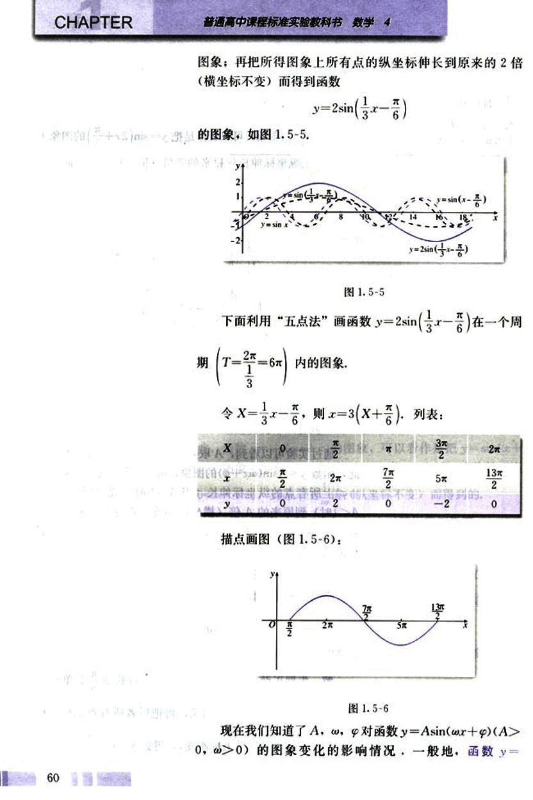
73

# 第一章 三角函数
## 第一章

Asin($\omega$x+$\varphi$) (其中A>0, $\omega$>0) 的图象，可以看作用下面的方法得到：先画出函数y=sinx的图象；再把正弦曲线向左(右)平移|$$\varphi$$|个单位长度，得到函数y=sin(x+$\varphi$)的图象；然后使曲线上各点的横坐标变为原来的$\frac{1}{\omega}$倍，得到函数y=sin($\omega$x+$\varphi$)的图象；最后把曲线上各点的纵坐标变为原来的A倍，这时的曲线就是函数y=Asin($\omega$x+$\varphi$)的图象。

这一过程的步骤如下：

步骤1

步骤2

步骤3

步骤4

这一过程体现了由简单到复杂，由特殊到一般的化归思想。

61

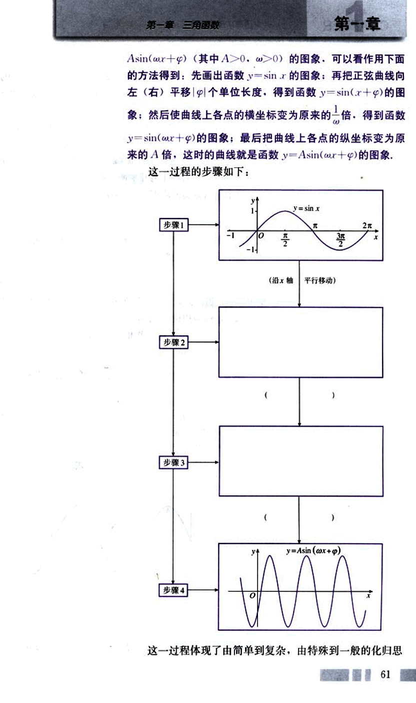
74

# CHAPTER

普通高中课程标准实验教科书 数学 4

## 想

现在，我们再次回到本章开头提到的“简谐运动的图像”，可以证明，这个图像所对应的函数解析式有如下形式：

$y = Asin(\omega x + \varphi), x \in [0, +\infty)$

其中$A > 0, \omega \ge 0$。物理中，描述简谐运动的物理量，如振幅、周期和频率等都与这个解析式中的常数有关：

A就是这个简谐运动的振幅(amplitude of vibration)，它是做简谐运动的物体离开平衡位置的最大距离；

这个简谐运动的周期(period)是

$T = \frac{2\pi}{\omega}$

这是做简谐运动的物体往复运动一次所需要的时间；

这个简谐运动的频率(frequency)由公式

$f = \frac{1}{T} = \frac{\omega}{2\pi}$

给出，它是做简谐运动的物体在单位时间内往复运动的次数；

$\omega x + \varphi$称为相位(phase)；

$x = 0$时的相位称为初相(initial phase)。

## 例2

图1.5-7是某简谐运动的图像，试根据图像回答下列问题：

(1)这个简谐运动的振幅、周期与频率各是多少？

(2)从O点算起，到曲线上的哪一点，表示完成了一次往复运动？如从A点算起呢？

(3)写出这个简谐运动的函数表达式。

[image](images/image.png)

图1.5-7

解：(1)从图像上可以看到，这个简谐运动的振幅为

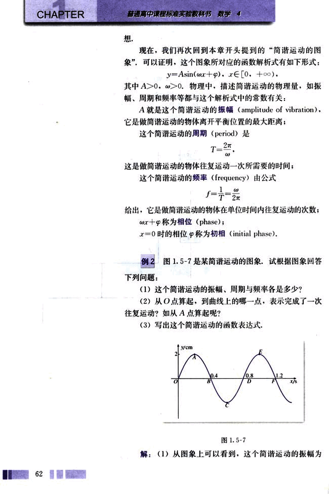
75

# 第一章 三角函数

2 cm; 周期 0.8 s; 频率为 $\frac{5}{4}$

(2) 如果从 O 点算起，到曲线上的 D 点，表示完成了
一次往复运动；如果从 A 点算起，则到曲线上的 E 点，表
示完成了一次往复运动。

(3) 设这个简谐运动的函数表达式为
$y = A\sin(\omega x + \varphi)$ , $x \in [0, +\infty)$

那么，A = 2; 由 $\omega = \frac{2\pi}{T} = \frac{2\pi}{0.8} = \frac{5\pi}{2}$; 由图象知初相 $\varphi = 0$。
于是所求函数表达式是
$y = 2\sin(\frac{5\pi}{2}x)$ , $x \in [0, +\infty)$。

## 练习

1. 画出下列函数在长度为一个周期的闭区间上的简图（有条件的请用计算器或计算机检验）：

(1) $y = \frac{1}{2}\sin x$;

(2) $y = \sin 3x$;

(3) $y = \sin(x - \frac{\pi}{3})$;

(4) $y = 2\sin(2x - \frac{\pi}{4})$。

2. 选择题：已知函数 $y = 3\sin(x + \frac{\pi}{5})$ 的图象为 C。

(1) 为了得到函数 $y = 3\sin(x - \frac{\pi}{5})$ 的图象，只要把 C 上所有的点 ( )。

(A) 向右平行移动 $\frac{\pi}{5}$ 个单位长度；

(B) 向左平行移动 $\frac{\pi}{5}$ 个单位长度；

(C) 向右平行移动 $\frac{2\pi}{5}$ 个单位长度；

(D) 向左平行移动 $\frac{2\pi}{5}$ 个单位长度；

(2) 为了得到函数 $y = 3\sin(2x + \frac{\pi}{5})$ 的图象，只要把 C 上所有的点 ( )。

(A) 横坐标伸长到原来的 2 倍，纵坐标不变

(B) 横坐标缩短到原来的 $\frac{1}{2}$ 倍，纵坐标不变

(C) 纵坐标伸长到原来的 2 倍，横坐标不变

(D) 纵坐标缩短到原来的 $\frac{1}{2}$ 倍，横坐标不变

63

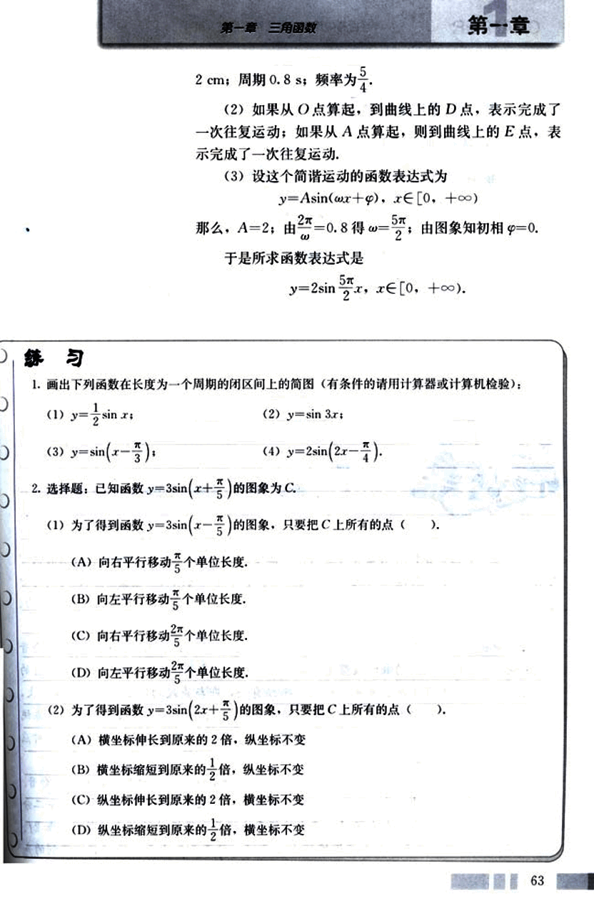
76

# CHAPTER

##  普通高中课程标准实验教科书 数学 4

(3)为了得到函数y = 4sin(x + $\frac{\pi}{5}$)的图象，只要把C上所有的点( )。

(A)横坐标伸长到原来的$\frac{4}{5}$倍，纵坐标不变
(B)横坐标缩短到原来的$\frac{3}{4}$倍，纵坐标不变
(C)纵坐标伸长到原来的$\frac{4}{3}$倍，横坐标不变
(D)纵坐标缩短到原来的$\frac{3}{4}$倍，横坐标不变

3. 函数y = $\frac{2}{3}$sin($\frac{1}{2}$x - $\frac{\pi}{4}$)的振幅、周期和频率各是多少？它的图象与正弦曲线有什么关系？

4. 函数y = sin(x + $\frac{\pi}{12}$), x ∈ [0, +∞)的初相是多少？它的图象与正弦曲线有什么关系？

## 振幅、周期、频率、相位

人体是一个包含各种周期运动的生物体，医学上把周期为24小时的生理运动称为中周期运动，如血压、血糖浓度的变化；小于24小时的叫短周期运动，如心跳、脉搏每分钟50-70次，呼吸每分钟16-24次；大于24小时叫长周期运动，如人的情绪、体力、智力等。

声音中也包含着正弦函数，声音是由于物体的振动产生的能引起听觉的波，每一个音都是由纯音合成的，纯音的数学模型是函数y = Asin ωt。音调、响度、音长和音色等音的四要素都与正弦函数及其参数有关，响度与振幅有关，即与声波的能量有关，振幅越大，响度越大；音长也与振幅有关，声音消失过程是由于声波在传播过程中受阻尼振动，系统的机械能随时间逐渐减小，振动的振幅也逐渐减小；音调与声波的振动频率是一一对应的，频率低的声音低沉，频率高的声音尖利。

平时我们听到的每一个音都不只是一个音在响，而是许多个音的结合，称为复合音。复合音的产生是因为发声体在全段振动，产生频率为f的基音的同时，其各部分，如二分之一、三分之一、四分之一也在振动，产生的频率恰好是全段振动的频率的倍数，如2f、3f、4f等，这些音叫谐音，因为其振幅较小，我们一般不易听出来，所以我们听到的声音
64

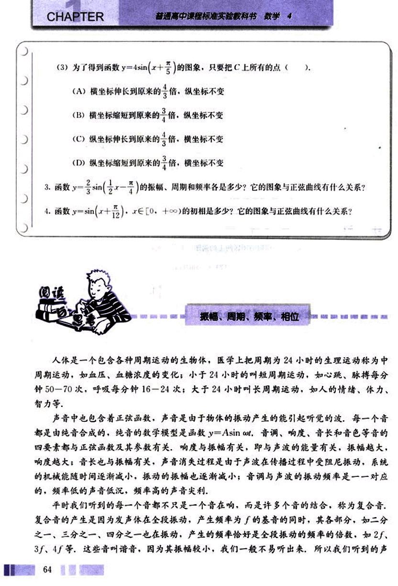
77

# 第一章 三角函数

## 第一章

音的函数是 $y = sinx + \frac{1}{2}sin2x + \frac{1}{3}sin3x + \frac{1}{4}sin4x + ...$

音色一般由基音和谐音的混合作用所决定，不同乐器，不同人发出的音调可以相同，但音色不同，人们由此分辨出不同的声音。

周期函数产生了美妙的音乐！

## 习题 1.5  A 组

1. 选择题：

(1) 为了得到函数 $y = cos(x + \frac{1}{3})$，$x∈R$ 的图象，只需把余弦曲线上所有的点 ( )

(A) 向左平行移动 $\frac{1}{3}$ 个单位长度。
(B) 向右平行移动 $\frac{1}{3}$ 个单位长度。
(C) 向左平行移动 $\frac{1}{3}$ 个单位长度。
(D) 向右平行移动 $\frac{1}{3}$ 个单位长度。

(2) 为了得到函数 $y = cos\frac{x}{5}$，$x∈R$ 的图象，只需把余弦曲线上所有的点 ( )

(A) 横坐标伸长到原来的 5 倍，纵坐标不变。
(B) 横坐标缩短到原来的 $\frac{1}{5}$ 倍，纵坐标不变。

65

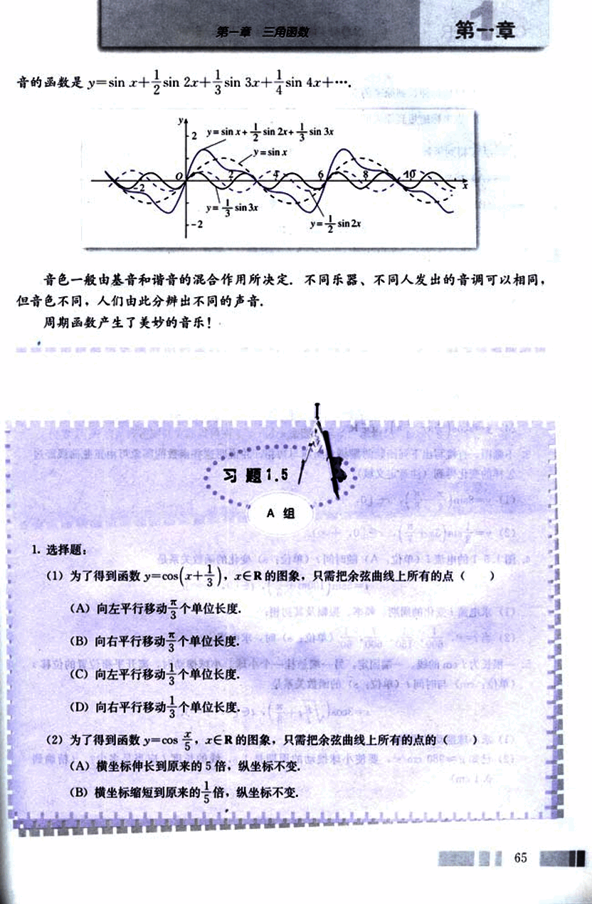
78

# CHAPTER 1

(C)纵坐标伸长到原来的5倍，横坐标不变。

(D)纵坐标缩短到原来的$\frac{1}{5}$倍，横坐标不变。

(3)为了得到函数$y = \frac{1}{4}\cos x$，$x \in R$的图象，只需把余弦曲线上所有的点的( )

(A)横坐标伸长到原来的4倍，纵坐标不变。

(B)横坐标缩短到原来的$\frac{1}{4}$倍，纵坐标不变。

(C)纵坐标伸长到原来的4倍，横坐标不变。

(D)纵坐标缩短到原来的$\frac{1}{4}$倍，横坐标不变。

2. 画出下列函数在长度为一个周期的闭区间上的简图（有条件的可用计算器或计算机作图检验）：

(1) $y = 4\sin \frac{1}{2}x$，$x \in R$;

(2) $y = \frac{1}{2}\cos 3x$，$x \in R$;

(3) $y = 3\sin(2x + \frac{\pi}{6})$，$x \in R$;

(4) $y = 2\cos(\frac{1}{2}x - \frac{\pi}{4})$，$x \in R$.

3. 不画图，直接写出下列函数的振幅、周期与初相，并说明这些函数的图象可由正弦曲线经过怎样的变化得到（注意定义域）：

(1) $y = 8\sin(\frac{4}{8}x - \frac{\pi}{8})$，$x \in [0, +\infty)$;

(2) $y = \frac{1}{3}\sin(3x + \frac{\pi}{7})$，$x \in [0, +\infty)$.

4. 图1.5-1的电流(单位：A)随时间t(单位：s)变化的函数关系是

$i = 5\sin(100\pi t + \frac{\pi}{3})$，$t \in [0, +\infty]$.

(1)求电流变化的周期、频率、振幅及其初相；

(2)当$t = 0$，$\frac{1}{600}$，$\frac{1}{150}$，$\frac{7}{600}$，$\frac{1}{60}$ (单位：s)时，求电流i.

5. 一根长为l cm的线，一端固定，另一端悬挂一个小球，小球摆动时，离开平衡位置的位移s(单位：cm)与时间t(单位：s)的函数关系是

$s = 3\cos(\sqrt{\frac{g}{l}}t + \frac{\pi}{3})$，$t \in [0, +\infty)$.

(1)求小球摆动的周期；

(2)已知g≈980 cm/s²，要使小球摆动的周期是1 s，线的长度l应是 多少？（精确到0.1 cm）

66

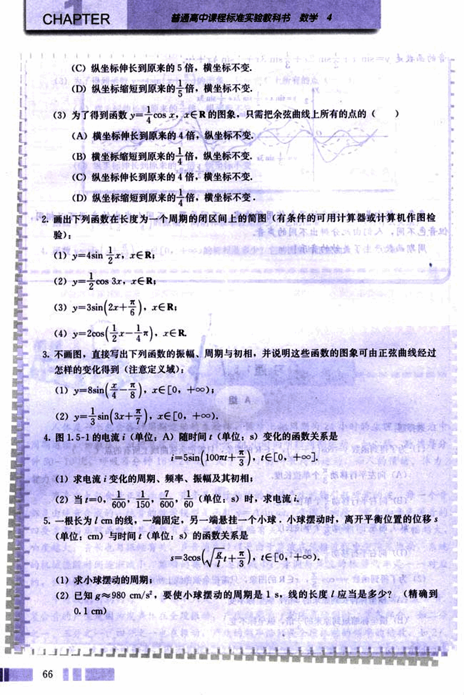
79

# 第一章 三角函数
## 第一章

**B 组**

1. 弹簧振子的振动是简谐运动，下表给出了振子在完成一次全振动的过程中的时间 $t$ 与位移 $S$ 之间的对应数据，根据这些数据求出这个振子的振动函数解析式。

| $t$ | 0 | $t_0$ | $2t_0$ | $3t_0$ | $4t_0$ | $5t_0$ | $6t_0$ | $7t_0$ | $8t_0$ | $9t_0$ | $10t_0$ | $11t_0$ | $12t_0$ |
|---|---|---|---|---|---|---|---|---|---|---|---|---|---|
| $S$ | -20.0 | -17.8 | -10.1 | 0.1 | 10.3 | 17.7 | 20.0 | 17.7 | 10.3 | 0.1 | -10.1 | -17.8 | -20.0 |

2. 弹簧挂着的小球作上下运动，它在 $t$ 秒时相对于平衡位置（就是静止时的位置）的高度 $h$ 厘米由下列关系式确定：

$h = 2\sin(\frac{\pi}{4}t + \frac{\pi}{4})$

以 $t$ 为横坐标，$h$ 为纵坐标，作出这个函数在一个周期的闭区间上的图像，并回答下列问题：

(1) 小球在开始振动时（即 $t=0$）的位置在哪里？
(2) 小球的最高点和最低点与平衡位置的距离分别是多少？
(3) 经过多少时间小球往复运动一次？
(4) 每秒钟小球能往复振动多少次？

3. 如图，点 P 是半径为 r cm 的砂轮边缘上的一个质点，它从初始位置 $P_0$ 开始，按逆时针方向以角速度 $\omega$ rad/s 做圆周运动。求点 P 的纵坐标 $y$ 关于时间 $t$ 的函数关系，并求点 P 的运动周期和频率。

[第3题](images/3.png)

67

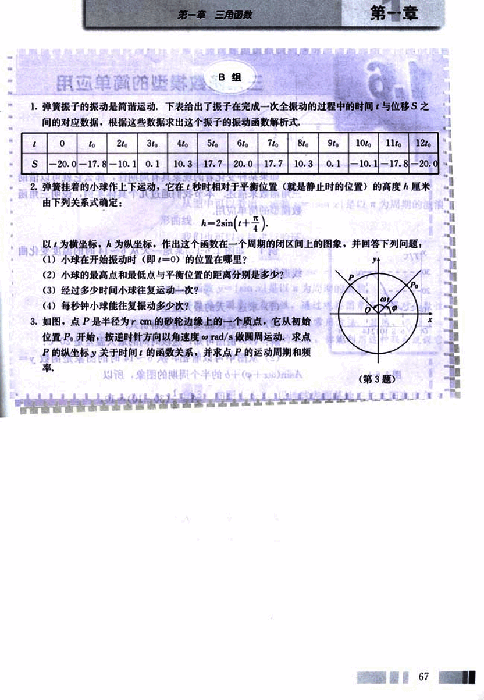
