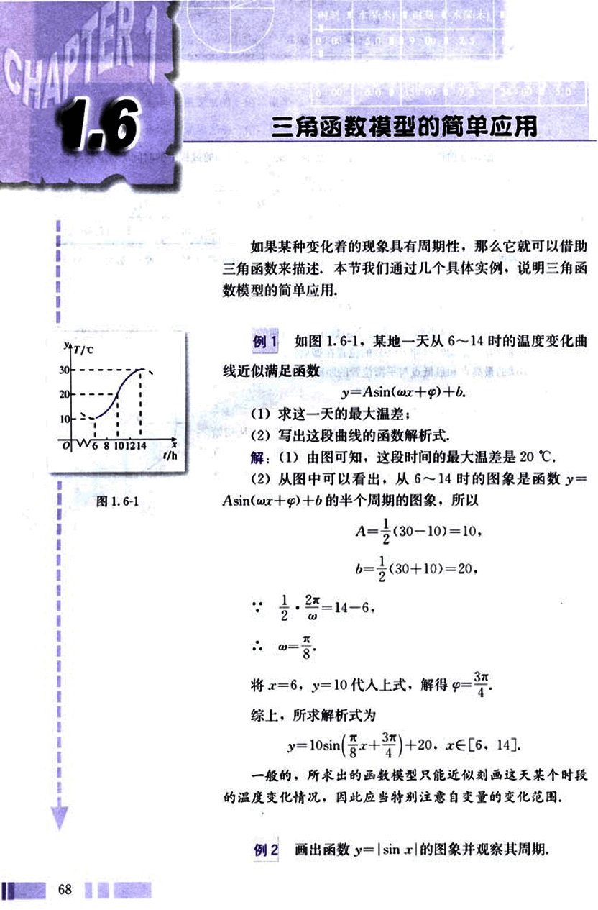
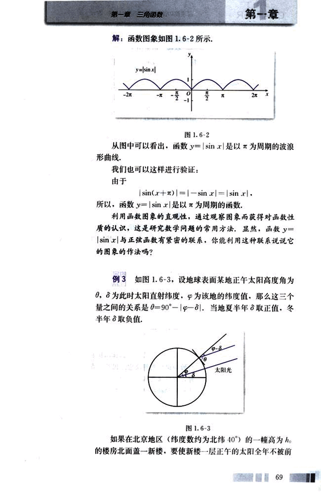
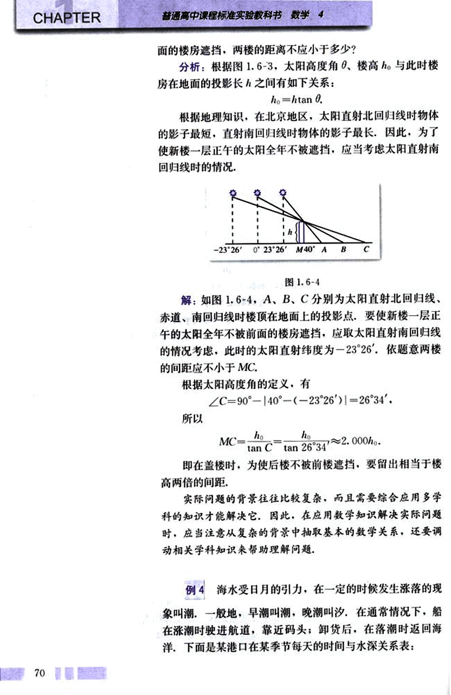
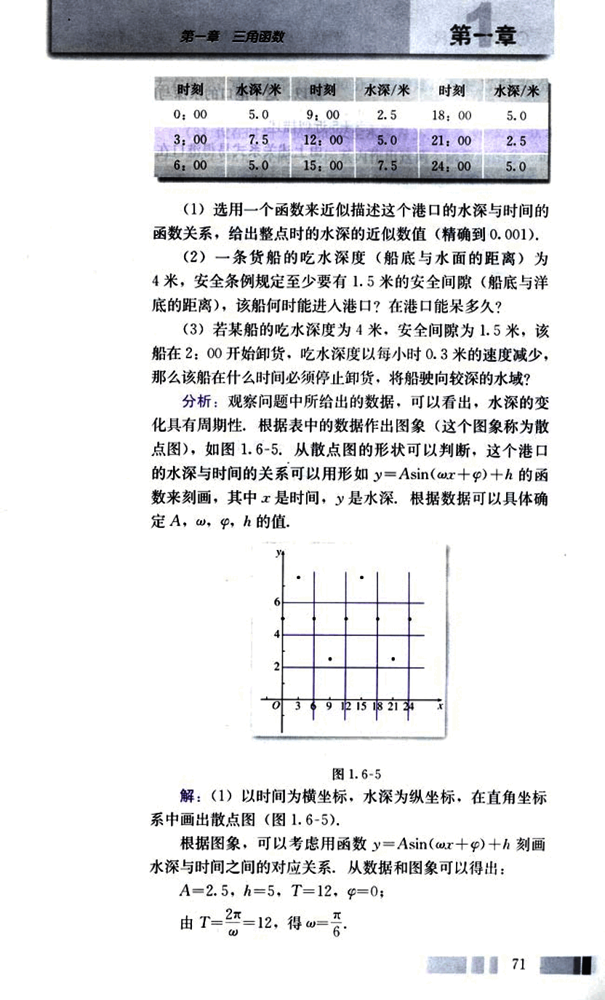
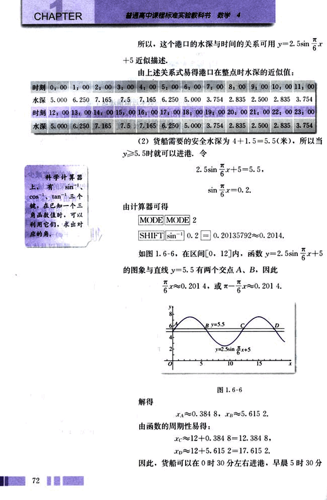
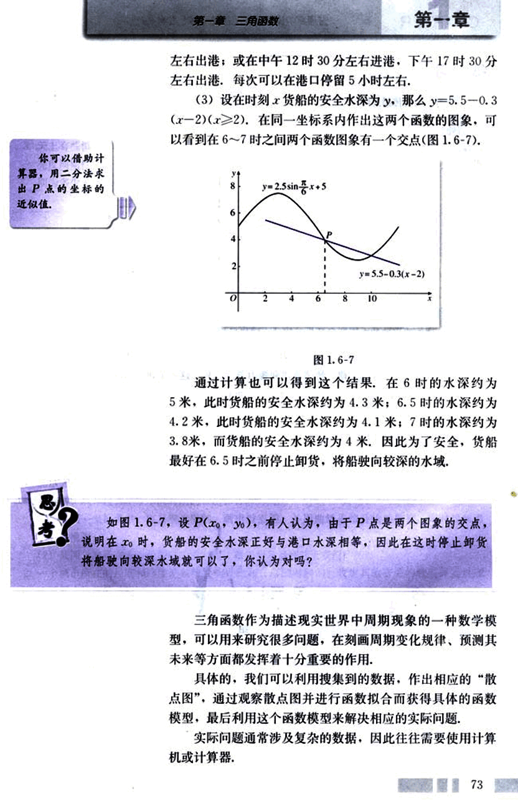
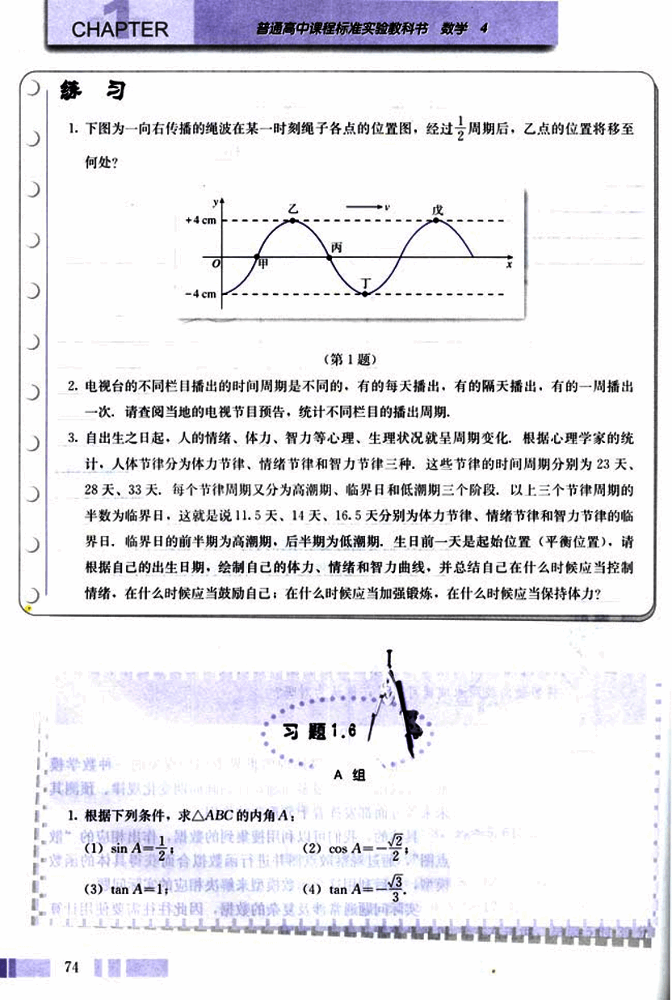
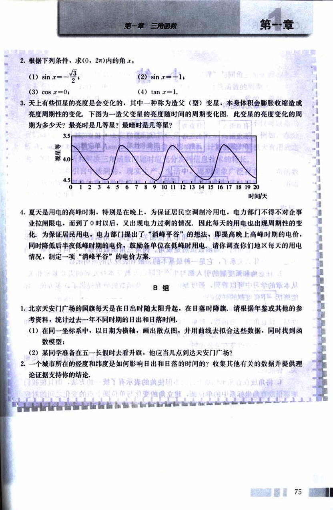

# 1.6　三角函数模型的简单应用

80

# CHAPTER 1

## 1.6 三角函数模型的简单应用

如果某种变化着的现象具有周期性，那么它就可以借助三角函数来描述，本节我们通过几个具体实例，说明三角函数模型的简单应用。

**例 1** 如图 1.6-1，某地一天从 6～14 时的温度变化曲线近似满足函数  
$y = A\sin(\omega x + \varphi) + b$。

(1) 求这一天的最大温差；

(2) 写出这段曲线的函数解析式。

解：(1) 由图可知，这段时间的最大温差是 20 ℃。

(2) 从图中可以看出，从 6～14 时的图象是函数 $y = A\sin(\omega x + \varphi) + b$ 的半个周期的图象，所以

$A = \frac{1}{2}(30 - 10) = 10$，

$b = \frac{1}{2}(30 + 10) = 20$，

$\because \frac{1}{2} \cdot \frac{2\pi}{\omega} = 14 - 6$，

$\therefore \omega = \frac{\pi}{8}$

将 $x = 6$，$y = 10$ 代入上式，解得 $\varphi = \frac{3\pi}{4}$。

综上，所求解析式为

$y = 10\sin(\frac{\pi}{8}x + \frac{3\pi}{4}) + 20$，$x \in [6, 14]$。

一般的，所求出的函数模型只能近似刻画这天某个时段的温度变化情况，因此应当特别注意自变量的变化范围。

**例 2** 画出函数 $y = \sin|x|$ 的图象并观察其周期。

[图1.6-1](images/1.6-1.png)

68

81

# 第一章 三角函数

## 解：函数图象如图 1.6-2 所示。

[图1.6-2](images/1.6-2.png)

从图中可以看出，函数 $y=|sin x|$ 是以 $\pi$ 为周期的波浪形曲线。

我们也可以这样进行验证：

由于

$|sin(x+\pi)| = |-sin x| = |sin x|$

所以，函数 $y=|sin x|$ 是以 $\pi$ 为周期的函数。

利用函数图象的直观性，通过观察图象而获得对函数性质的认识，这是研究数学问题的常用方法。显然，函数 $y=|sin x|$ 与正弦函数有紧密的联系。你能利用这种联系说说它的图象的作法吗？

## 例 3 如图 1.6-3，设地球表面某地正午太阳高度角为 $\theta$，$\delta$ 为此时太阳直射纬度，$\varphi$ 为该地的纬度值，那么这三个量之间的关系是 $\theta = 90^\circ - |\varphi - \delta|$。当地夏半年 $\delta$ 取正值，冬半年 $\delta$ 取负值。

[图1.6-3](images/1.6-3.png)

如果在北京地区（纬度数约为北纬 40°）的一幢高为 $h_0$ 的楼房北面盖一新楼，要使新楼一层正午的太阳全年不被前

69

82

# CHAPTER

普通高中课程标准实验教科书 数学 4

面的楼房遮挡，两楼的距离不应小于多少？

分析：根据图1.6-3，太阳高度角θ，楼高 *ho* 与此时楼房在地面的投影长之间有如下关系：

*ho* = *h*tan θ

根据地理知识，在北京地区，太阳直射北回归线时物体的影子最短，直射南回归线时物体的影子最长，因此，为了使新楼一层正午的太阳全年不被遮挡，应当考虑太阳直射南回归线时的情况。

[image](images/image.png)

图 1.6-4

解：如图 1.6-4，A、B、C 分别为太阳直射北回归线、赤道、南回归线时楼顶在地面上的投影点，要使新楼一层正午的太阳全年不被前面的楼房遮挡，应取太阳直射南回归线的情况考虑，此时的太阳直射纬度为 -23°26′，依题意两楼的间距应不小于 MC。

根据太阳高度角的定义，有

∠C = 90° - |40° - (-23°26′)| = 26°34′

所以

MC = *ho*/tan C = *ho*/tan 26°34′ ≈ 2.000*ho*

即在盖楼时，为使后楼不被前楼遮挡，要留出相当于楼高两倍的间距。

实际问题的背景往往比较复杂，而且需要综合应用多学科的知识才能解决它，因此，在应用数学知识解决实际问题时，应当注意从复杂的背景中抽取基本的数学关系，还要调动相关学科知识来帮助理解问题。

## 例 4

海水受日月的引力，在一定的时候发生涨落的现象叫潮，一般地，早潮叫潮，晚潮叫汐，在通常情况下，船在涨潮时驶进航道，靠近码头；卸货后，在落潮时返回海洋，下面是某港口在某季节每天的时间与水深关系表：

---

83

# 第一章 三角函数

## 第一节

| 时刻 | 水深/米 | 时刻 | 水深/米 | 时刻 | 水深/米 |
|---|---|---|---|---|---|
| 0:00 | 5.0 | 9:00 | 2.5 | 18:00 | 5.0 |
| 3:00 | 7.5 | 12:00 | 5.0 | 21:00 | 2.5 |
| 6:00 | 5.0 | 15:00 | 7.5 | 24:00 | 5.0 |

(1)选用一个函数来近似描述这个港口的水深与时间的函数关系，给出整点时的水深的近似数值(精确到0.001)。

(2)一条货船的吃水深度(船底与水面的距离)为4米，安全条例规定至少要有1.5米的安全间隙(船底与洋底的距离)，该船何时能进入港口？在港口能呆多久？

(3)若某船的吃水深度为4米，安全间隙为1.5米，该船在2:00开始卸货，吃水深度以每小时0.3米的速度减少，那么该船在什么时间必须停止卸货，将船驶向较深的水域？

分析：观察问题中所给出的数据，可以看出，水深的变化具有周期性，根据表中的数据作出图象(这个图象称为散点图)，如图1.6-5. 从散点图的形状可以判断，这个港口的水深与时间的关系可以用形如 $y = A\sin(\omega x + \varphi) + h$ 的函数来刻画，其中x是时间，y是水深，根据数据可以具体确定A，ω，φ，h的值。

解：(1)以时间为横坐标，水深为纵坐标，在直角坐标系中画出散点图(图1.6-5)。

根据图象，可以考虑用函数 $y = A\sin(\omega x + \varphi) + h$ 刻画水深与时间之间的对应关系，从数据和图象可以得出：

$A = 2.5$，$h = 5$，$T = 12$，$\varphi = 0$；

由 $T = \frac{2\pi}{\omega} = 12$，得 $\omega = \frac{\pi}{6}$；

71

84

# CHAPTER

普通高中课程标准实验教科书 数学 4

所以，这个港口的水深与时间的关系可用 $y = 2.5\sin\frac{\pi}{6}x + 5$ 近似描述。

由上述关系式易得港口在整点时水深的近似值：

| 时刻 | 0:00 | 1:00 | 2:00 | 3:00 | 4:00 | 5:00 | 6:00 | 7:00 | 8:00 | 9:00 | 10:00 | 11:00 |
|---|---|---|---|---|---|---|---|---|---|---|---|---|
| 水深 | 5.000 | 6.250 | 7.165 | 7.5 | 7.165 | 6.250 | 5.000 | 3.754 | 2.835 | 2.500 | 2.835 | 3.754 |

| 时刻 | 12:00 | 13:00 | 14:00 | 15:00 | 16:00 | 17:00 | 18:00 | 19:00 | 20:00 | 21:00 | 22:00 | 23:00 |
|---|---|---|---|---|---|---|---|---|---|---|---|---|
| 水深 | 5.000 | 6.250 | 7.165 | 7.5 | 7.165 | 6.250 | 5.000 | 3.754 | 2.835 | 2.500 | 2.835 | 3.754 |

(2) 货船需要的安全水深为 4 + 1.5 = 5.5(米)，所以当 $y \ge 5.5$ 时就可以进港，令

$2.5\sin\frac{\pi}{6}x + 5 = 5.5$

$\sin\frac{\pi}{6}x = 0.2$

由计算器可得

`MODE MODE 2`

`SHIFT $\sin^{-1}$ 0.2 = 0.20135792 ≈ 0.2014`

如图 1.6-6，在区间 [0, 12] 内，函数 $y = 2.5\sin\frac{\pi}{6}x + 5$ 的图像与直线 y = 5.5 有两个交点 A、B，因此

$\frac{\pi}{6}x \approx 0.2014$ 或 $-\frac{\pi}{6}x \approx 0.2014$

[图1.6-6](images/1.6-6.png)

解得

$x_A \approx 0.384 \ 8$,  $x_B \approx 5.615 \ 2$

由函数的周期性易得：

$x_C \approx 12 + 0.384 \ 8 = 12.384 \ 8$

$x_D \approx 12 + 5.615 \ 2 = 17.615 \ 2$

因此，货船可以在 0 时 30 分左右进港，早晨 5 时 30 分

72

85

# 第一章 三角函数

## 第一章

左右出港;或在中午12时30分左右进港,下午17时30分左右出港,每次可以在港口停留5小时左右。

(3)设在时刻$x$货船的安全水深为$y$，那么$y=5.5-0.3(x-2)(x≥2)$，在同一坐标系内作出这两个函数的图象，可以看到在6～7时之间两个函数图象有一个交点(图1.6-7).

通过计算也可以得到这个结果，在6时的水深约为5米，此时货船的安全水深约为4.3米；6.5时的水深约为4.2米，此时货船的安全水深约为4.1米；7时的水深约为3.8米，而货船的安全水深约为4米。因此为了安全，货船最好在6.5时之前停止卸货，将船驶向较深的水域。

如图1.6-7，设$P(x_0, y_0)$，有人认为，由于P点是两个图象的交点，说明在$x_0$时，货船的安全水深正好与港口水深相等，因此在这时停止卸货将船驶向较深水域就可以了，你认为对吗？

三角函数作为描述现实世界中周期现象的一种数学模型，可以用来研究很多问题，在刻画周期变化规律、预测其未来等方面都发挥着十分重要的作用。

具体的，我们可以利用搜集到的数据，作出相应的“散点图”，通过观察散点图并进行函数拟合而获得具体的函数模型，最后利用这个函数模型来解决相应的实际问题。

实际问题通常涉及复杂的数据，因此往往需要使用计算机或计算器。

73

86

# 练习

1. 下图为一向右传播的绳波在某一时刻绳子各点的位置图，经过$\frac{1}{2}$周期后，乙点的位置将移至何处？

(第1题)

2. 电视台的不同栏目播出的时间周期是不同的，有的每天播出，有的隔天播出，有的一个周期播出一次，请查阅当地的电视节目预告，统计不同栏目的播出周期。

3. 自出生之日起，人的情绪、体力、智力等心理、生理状况就呈周期变化，根据心理学家的统计，人体节律分为体力节律、情绪节律和智力节律三种，这些节律的时间周期分别为23天，28天，33天，每个节律周期又分为高潮期、临界日和低潮期三个阶段，以上三个节律周期的半数为临界日，这就是说11.5天、14天、16.5天分别为体力节律、情绪节律和智力节律的临界日，临界日的前半期为高潮期，后半期为低潮期，生日前一天是起始位置（平衡位置），请根据自己的出生日期，绘制自己的体力、情绪和智力曲线，并总结自己在什么时候应当控制情绪，在什么时候应当鼓励自己；在什么时候应当加强锻炼，在什么时候应当保持体力？

# 习题 1.6

## A组

1. 根据下列条件，求△ABC的内角A：

(1) $\sin A = \frac{1}{2}$

(2) $\cos A = -\frac{\sqrt{2}}{2}$

(3) $\tan A = 1$

(4) $\tan A = \frac{\sqrt{3}}{3}$

87

# 第一章 三角函数

## 第一章

2. 根据下列条件，求(0，2π)内的角x：

(1) sin x = -√3/2

(3) cos x = 0;

(2) sin x = -1;

(4) tan x = 1.

3. 天上有些恒星的亮度是会变化的，其中一种称为造父(型)变星，本身体积会膨胀收缩造成亮度周期性的变化，下图为一造父变星的亮度随时间的周期变化图，此变星的亮度变化的周期为多少天？最亮时是几等星？最暗时是几等星？

[image](images/graph.png)

4. 夏天是用电的高峰时期，特别是在晚上，为保证居民空调制冷用电，电力部门不得不对企事业拉闸限电，而到了0时以后，又出现电力过剩的情况，因此每天的用电也出现周期性的变化，为保证居民用电，电力部门提出了“消峰平谷”的想法，即提高晚上高峰时期的电价，同时降低后半夜低峰时期的电价，鼓励各单位在低峰时用电，请你调查你们地区每天的用电情况，制定一项“消峰平谷”的电价方案。

B组

1. 北京天安门广场的国旗每天是在日出时随太阳升起，在日落时降旗，请根据年鉴或其他的参考资料，统计过去一年不同时期的日出和日落时间，

(1) 在同一坐标系中，以日期为横轴，画出散点图，并用曲线去拟合这些数据，同时找到函数模型；

(2) 某同学准备在五一长假时去看升旗，他应当几点到达天安门广场？

2. 一个城市所在的经度和纬度是如何影响日出和日落的时间的？收集其他有关的数据并提供理论证据支持你的结论。

