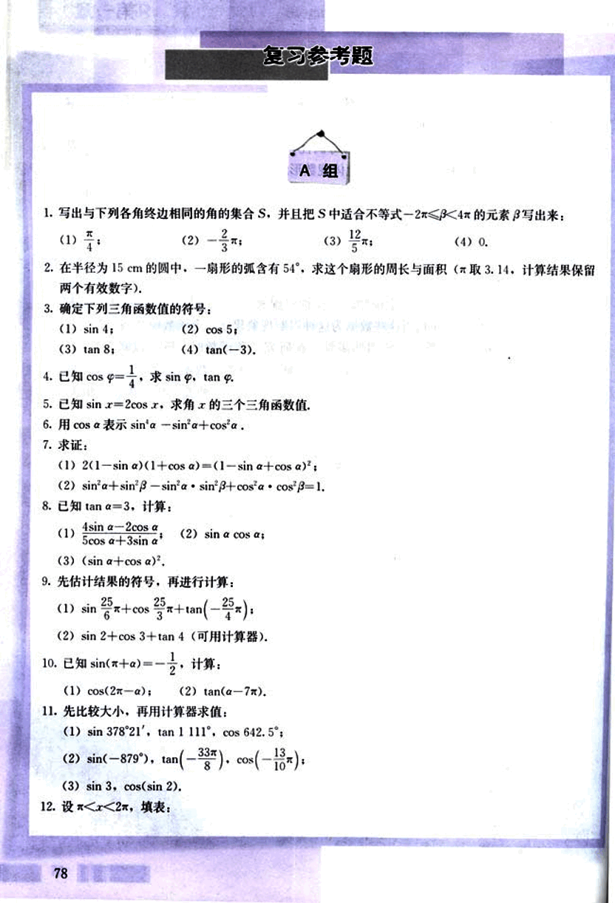
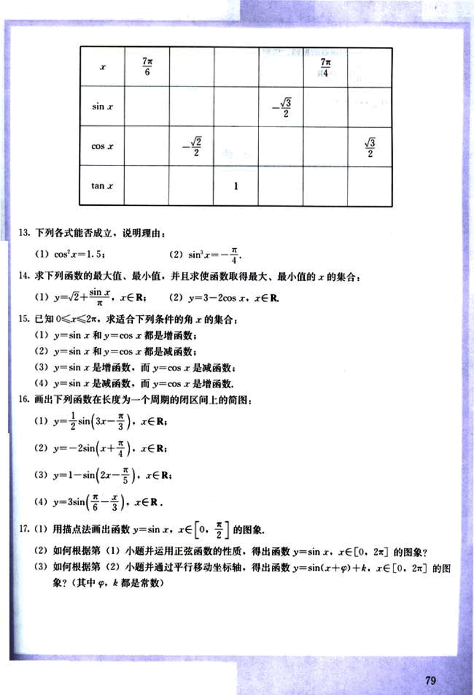
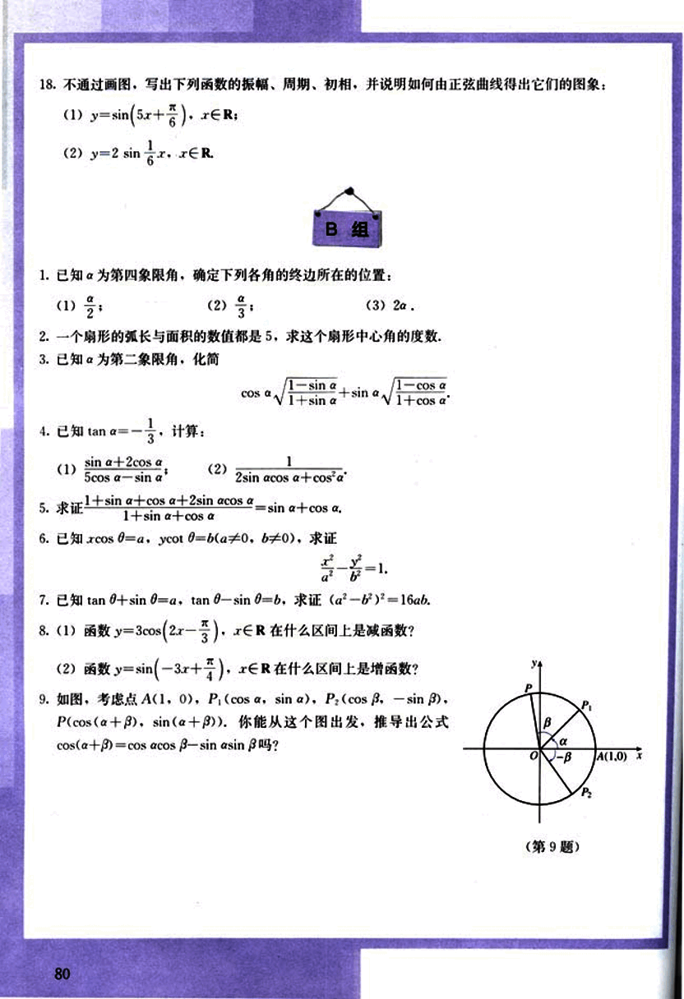
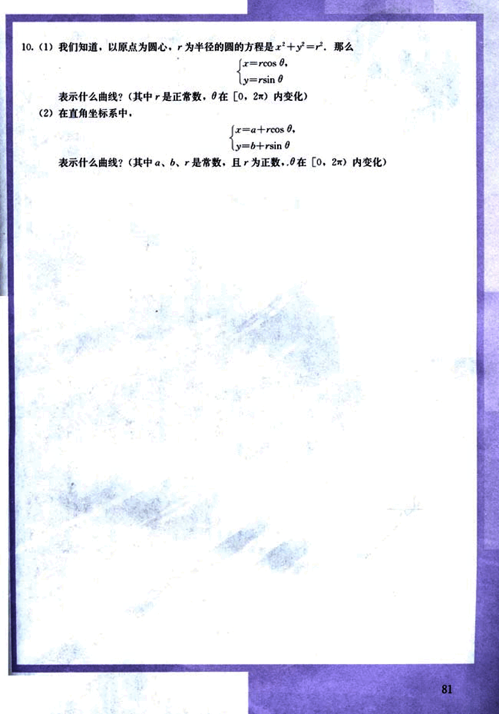

# 复习参考题

90

# 复习参考题
## A组

1. 写出与下列各角终边相同的角的集合S，并且把S中适合不等式$-2\pi \le x < 4\pi$的元素写出来：
    (1) $\frac{\pi}{4}$;
    (2) $-\frac{2}{3}\pi$;
    (3) $\frac{5}{12}\pi$;
    (4) 0.

2. 在半径为15 cm的圆中，一扇形的弧含有54°，求这个扇形的周长与面积（$\pi$取3.14，计算结果保留两个有效数字）。

3. 确定下列三角函数值的符号：
    (1) sin 4;
    (2) cos 5;
    (3) tan 8;
    (4) tan(-3).

4. 已知 cos $\varphi = \frac{1}{4}$，求 sin $\varphi$，tan $\varphi$。

5. 已知 sin x = 2cos x，求角x的三个三角函数值。

6. 用cos a表示 sin a - sin²a + cos²a。

7. 求证：
    (1) 2(1 - sin a)(1 + cos a) = (1 - sin a + cos a)²;
    (2) sin²a + sin²β - sin a · sin²β + cos a · cos²β = 1.

8. 已知 tan a = 3，计算：
    (1) $\frac{4\sin a - 2\cos a}{5\cos a + 3\sin a}$;
    (2) sin a cos a;
    (3) (sin a + cos a)²;

9. 先估计结果的符号，再进行计算：
    (1) $\sin \frac{25}{6}\pi + \cos \frac{25}{3}\pi + \tan (-\frac{25}{4}\pi)$;
    (2) sin 2 + cos 3 + tan 4 (可用计算器)。

10. 已知 sin(x + a) = $-\frac{1}{2}$，计算：
    (1) cos(2π - a);
    (2) tan(a - 7π)。

11. 先比较大小，再用计算器求值：
    (1) sin 378°21′，tan 1111°，cos 642.5°;
    (2) sin(-879°), tan($-\frac{3\pi}{8}$), cos($-\frac{13}{10}\pi$);
    (3) sin 3, cos(sin 2)。

12. 设 $\pi < x < 2\pi$，填表：

78

91

# 练习题

## 填空题

| x       | $\frac{7\pi}{6}$ | $\frac{7\pi}{4}$ |
|---------|-----------------|-----------------|
| $\sin x$ |                 | $-\frac{\sqrt{3}}{2}$ |
| $\cos x$ | $-\frac{\sqrt{2}}{2}$ |                 |
| $\tan x$ | 1               |                 |

## 判断题

13. 下列各式能否成立，说明理由：

(1) $\cos^2 x = 1.5$;

(2) $\sin^2 x = -\frac{\pi}{4}$.

## 求值题

14. 求下列函数的最大值、最小值，并且求使函数取得最大、最小值的 $x$ 的集合：

(1) $y = \sqrt{2} + \sin x$, $x \in R$;

(2) $y = 3 - 2\cos x$, $x \in R$.

## 解方程题

15. 已知 $0 \le x \le 2\pi$，求适合下列条件的 $x$ 的集合：

(1) $y = \sin x$ 和 $y = \cos x$ 都是增函数；

(2) $y = \sin x$ 和 $y = \cos x$ 都是减函数；

(3) $y = \sin x$ 是增函数，而 $y = \cos x$ 是减函数；

(4) $y = \sin x$ 是减函数，而 $y = \cos x$ 是增函数.

## 画图题

16. 画出下列函数在长度为一个周期的闭区间上的简图：

(1) $y = \frac{1}{2}\sin(3x - \frac{\pi}{3})$, $x \in R$;

(2) $y = -2\sin(x + \frac{\pi}{4})$, $x \in R$;

(3) $y = 1 - \sin(2x - \frac{\pi}{5})$, $x \in R$;

(4) $y = 3\sin(\frac{\pi}{6} - \frac{x}{3})$, $x \in R$.

## 应用题

17. (1) 用描点法画出函数 $y = \sin x$, $x \in [0, \frac{\pi}{2}]$ 的图象.

(2) 如何根据第 (1) 小题并运用正弦函数的性质，得出函数 $y = \sin x$, $x \in [0, 2\pi]$ 的图象？

(3) 如何根据第 (2) 小题并通过平行移动坐标轴，得出函数 $y = \sin(x + \varphi) + k$, $x \in [0, 2\pi]$ 的图象？(其中 $\varphi$, $k$ 都是常数)

92

# 不通过画图，写出下列函数的振幅、周期、初相，并说明如何由正弦曲线得出它们的图像：

(1)  y = sin(5x + π/6),  x ∈ R;

(2)  y = 2 sin (x/6), x ∈ R.

## B组

1. 已知 α 为第四象限角，确定下列各角的终边所在的位置：

(1) α/2;

(2) α/3;

(3) 2α.

2. 一个扇形的弧长与面积的数值都是 5，求这个扇形中心角的度数。

3. 已知 α 为第二象限角，化简

cos α √(1 - sin α)/(1 + sin α) + sin α √(1 - cos α)/(1 + cos α)

4. 已知 tan α = -1/3，计算：

(1) (sin α + 2cos α)/(5cos α - sin α);

(2) 1/(2sin α cos α + cos²α)

5. 求证  (1 + sin α + cos α + 2sin α cos α)/(1 + sin α + cos α) = sin α + cos α.

6. 已知 xcos θ = a, ycot θ = b (a ≠ 0, b ≠ 0)，求证  x²/a² - y²/b² = 1.

7. 已知 tan θ + sin θ = a, tan θ - sin θ = b, 求证 (a² - b²)² = 16ab.

8. (1) 函数 y = 3cos(2x - π/3), x ∈ R 在什么区间上是减函数？

(2) 函数 y = sin(-3x + π/4), x ∈ R 在什么区间上是增函数？

9. 如图，考虑点 A(1, 0), P₁(cos α, sin α), P₂(cos β, -sin β), P(cos(α + β), sin(α + β))，你能从这个图出发，推导出公式 cos(α + β) = cos α cos β - sin α sin β 吗？

[第9题](images/image.png)

80

93

# 10.

(1) 我们知道，以原点为圆心，$r$ 为半径的圆的方程是 $x^2 + y^2 = r^2$。那么

$\begin{cases}
x = r\cos\theta \\
y = r\sin\theta
\end{cases}$

表示什么曲线？(其中 $r$ 是正数，$\theta$ 在 $[0, 2\pi)$ 内变化)

(2) 在直角坐标系中，

$\begin{cases}
x = a + r\cos\theta \\
y = b + r\sin\theta
\end{cases}$

表示什么曲线？(其中 $a$，$b$，$r$ 是常数，且 $r$ 为正数，$\theta$ 在 $[0, 2\pi)$ 内变化)

