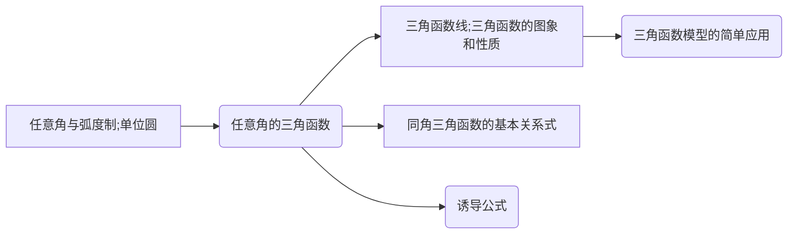
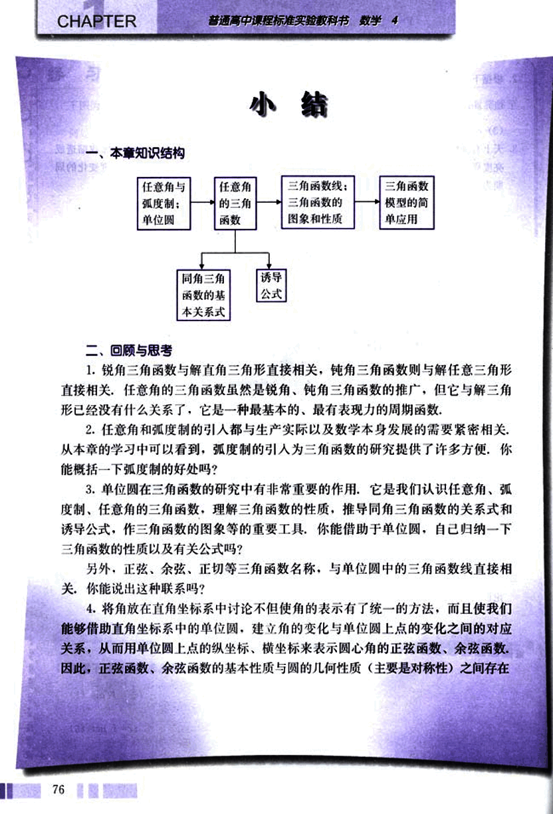
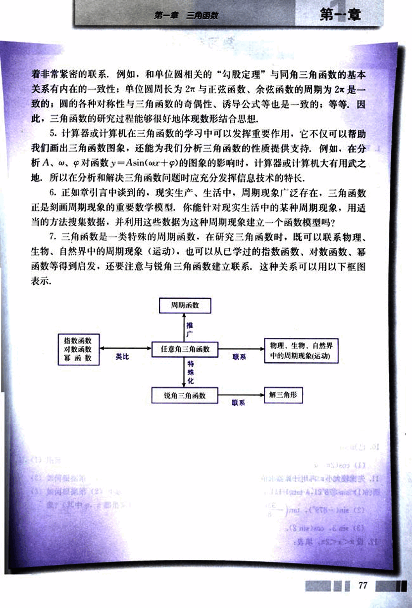

# 小结

88

# 小结

## 一、本章知识结构

## 二、回顾与思考

1. 锐角三角函数与解直角三角形直接相关，钝角三角函数则与解任意三角形直接相关，任意角的三角函数虽然是锐角、钝角三角函数的推广，但它与解三角形已经没有什么关系了，它是一种最基本的、最有表现力的周期函数。

2. 任意角和弧度制的引入都与生产实际以及数学本身发展的需要紧密相关，从本章的学习中可以看到，弧度制的引入为三角函数的研究提供了许多方便，你能概括一下弧度制的好处吗？

3. 单位圆在三角函数的研究中有非常重要的作用，它是我们认识任意角、弧度制、任意角的三角函数，理解三角函数的性质，推导同角三角函数的关系式和诱导公式，作三角函数的图象等的重要工具，你能借助于单位圆，自己归纳一下三角函数的性质以及有关公式吗？

另外，正弦、余弦、正切等三角函数名称，与单位圆中的三角函数线直接相关，你能说出这种联系吗？

4. 将角放在直角坐标系中讨论不但使角的表示有了统一的方法，而且使我们能够借助直角坐标系中的单位圆，建立角的变化与单位圆上点的变化之间的对应关系，从而用单位圆上点的纵坐标、横坐标来表示圆心角的正弦函数、余弦函数。因此，正弦函数、余弦函数的基本性质与圆的几何性质（主要是对称性）之间存在

89

# 第一章 三角函数

## 第一章

着非常紧密的联系，例如，和单位圆相关的“勾股定理”与同角三角函数的基本关系有内在的一致性；单位圆周长为2π与正弦函数、余弦函数的周期为2π是一致的；圆的各种对称性与三角函数的奇偶性、诱导公式等也是一致的；等等，因此，三角函数的研究过程能够很好地体现数形结合思想。

5. 计算器或计算机在三角函数的学习中可以发挥重要作用，它不仅可以帮助我们画出三角函数图像，还能为我们分析三角函数的性质提供支持。例如，在分析A、ω、φ对函数y=Asin(ωx+φ)的图像的影响时，计算器或计算机大有用武之地，所以在分析和解决三角函数问题时应充分发挥信息技术的特长。

6. 正如引言中谈到的，现实生产、生活中，周期现象广泛存在，三角函数正是刻画周期现象的重要数学模型。你能针对现实生活中的某种周期现象，用适当的方法搜集数据，并利用这些数据为这种周期现象建立一个函数模型吗？

7. 三角函数是一类特殊的周期函数，在研究三角函数时，既可以联系物理、生物、自然界中的周期现象（运动），也可以从已学过的指数函数、对数函数、幂函数等得到启发，还要注意与锐角三角函数建立联系，这种关系可以用以下框图表示。

| 指数函数 | 对数函数 | 幂函数 | 任意角三角函数 | 物理、生物、自然界中的周期现象（运动） |
|---|---|---|---|---|
| 类比 |  | 联系 | 特殊化 |  |
|  |  |  | 锐角三角函数 | 解三角形 |
|  |  |  | 联系 |  |

77

