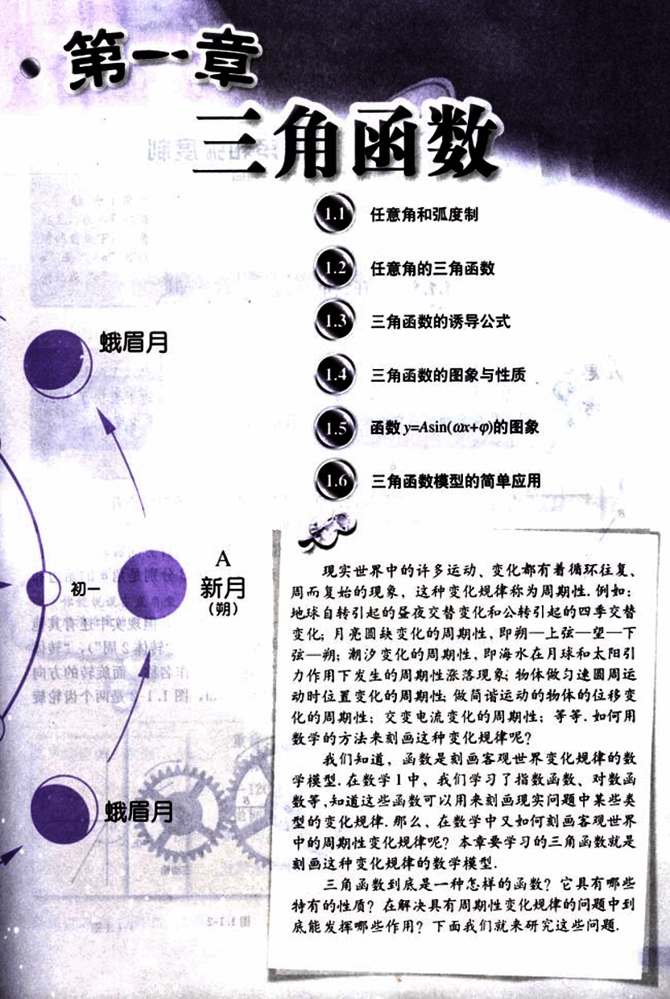

# 第1章　三角函数

13

# 第一章 三角函数

1.1 任意角和弧度制
1.2 任意角的三角函数
1.3 三角函数的诱导公式
1.4 三角函数的图象与性质
1.5 函数 y=Asin(ωx+φ) 的图象
1.6 三角函数模型的简单应用

现实世界中的许多运动、变化都有着循环往复、周而复始的现象，这种变化规律称为周期性。例如：地球自转引起的昼夜交替变化和公转引起的四季交替变化；月亮圆缺变化的周期性，即朔——上弦——望——下弦——朔；潮汐变化的周期性，即海水在月球和太阳引力作用下发生的周期性涨落现象；物体做匀速圆周运动时位置变化的周期性；做简谐运动的物体的位移变化的周期性；交变电流变化的周期性；等等，如何用数学的方法来刻画这种变化规律呢？

我们知道，函数是刻画客观世界变化规律的数学模型。在数学1中，我们学习了指数函数、对数函数等，知道这些函数可以用来刻画现实问题中某些类型的变化规律，那么，在数学中又如何刻画客观世界中的周期性变化规律呢？本章要学习的三角函数就是刻画这种变化规律的数学模型。

三角函数到底是一种怎样的函数？它具有哪些特有的性质？在解决具有周期性变化规律的问题中到底能发挥哪些作用？下面我们就来研究这些问题。

