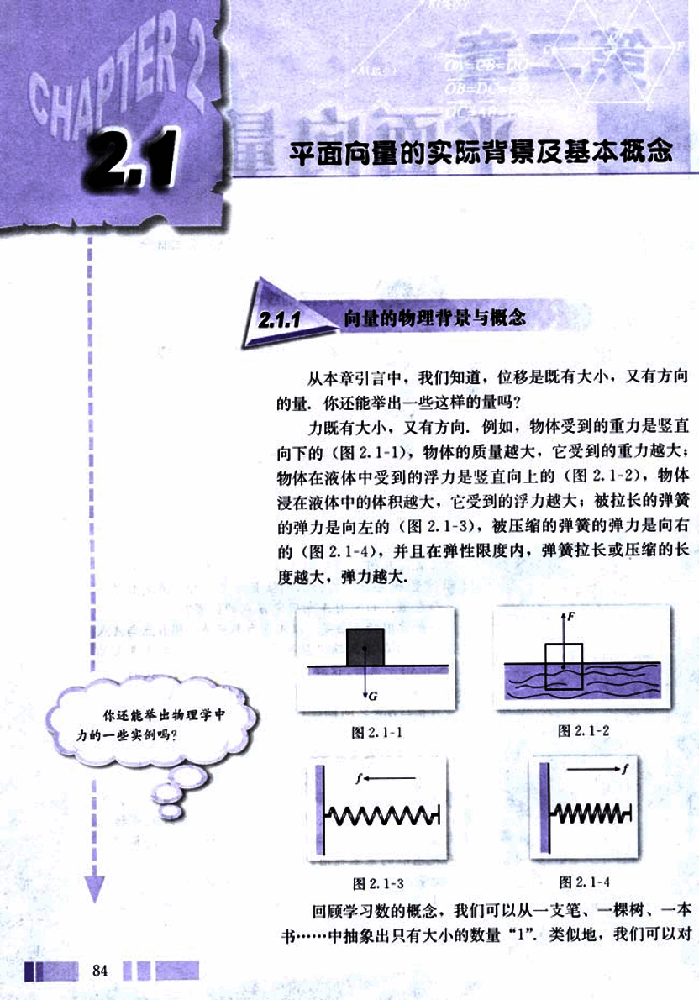
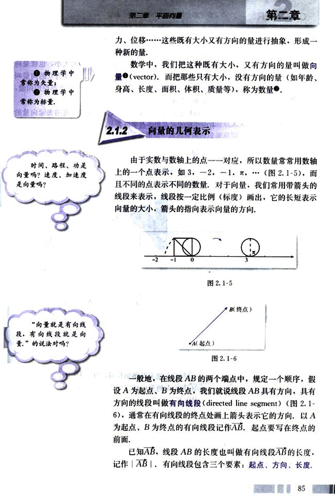
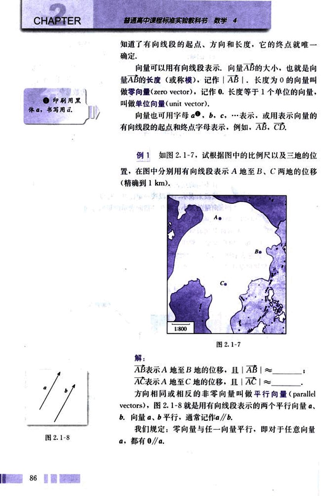
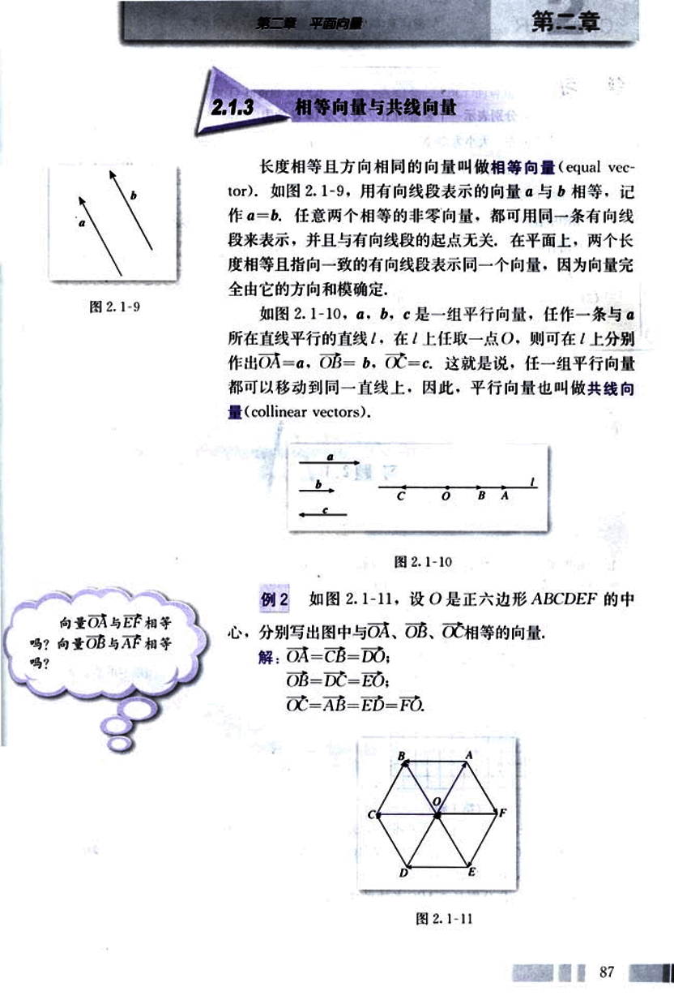
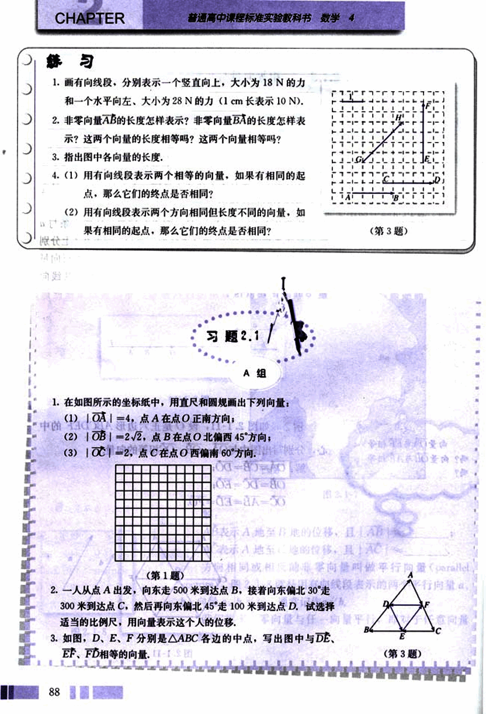
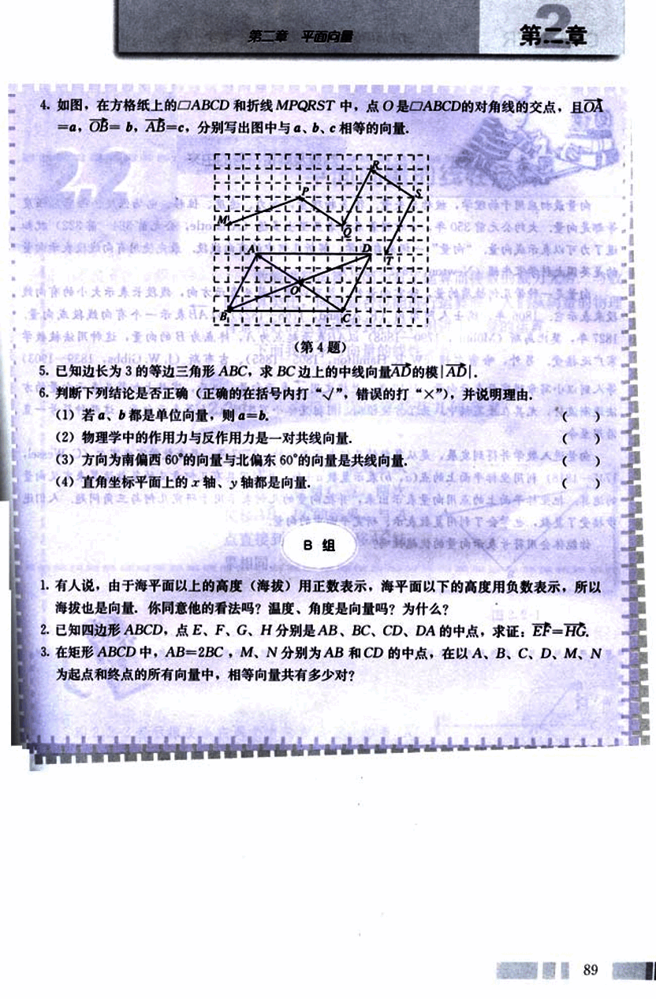
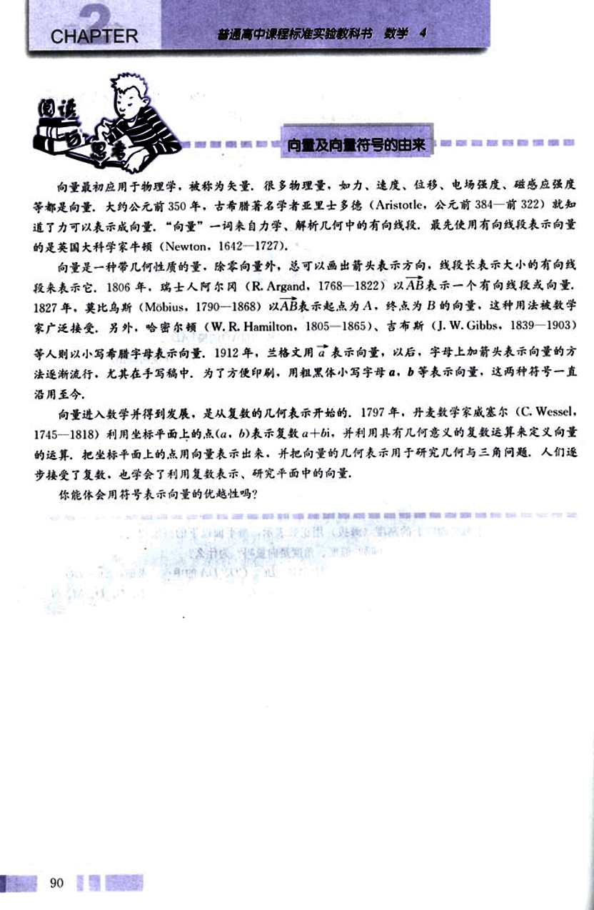

# 2.1　平面向量的实际背景及基本概念

96

# CHAPTER 2

## 2.1 平面向量的实际背景及基本概念

### 2.1.1 向量的物理背景与概念

从本章引言中，我们知道，位移是既有大小，又有方向的量，你还能举出一些这样的量吗？

力既有大小，又有方向，例如，物体受到的重力是竖直向下的（图2.1-1），物体的质量越大，它受到的重力越大；物体在液体中受到的浮力是竖直向上的（图2.1-2），物体浸在液体中的体积越大，它受到的浮力越大；被拉长的弹簧的弹力是向左的（图2.1-3），被压缩的弹簧的弹力是向右的（图2.1-4），并且在弹性限度内，弹簧拉长或压缩的长度越大，弹力越大。

[图2.1-1](images/2.1-1.png) [图2.1-2](images/2.1-2.png)
[图2.1-3](images/2.1-3.png) [图2.1-4](images/2.1-4.png)

回顾学习数的概念，我们可以从一支笔、一棵树、一本书……中抽象出只有大小的数量“1”。类似地，我们可以对
84

97

# 第二章 平面向量

## 第二章

物理学中常称为矢量；

物理学中常称为标量.

力、位移……这些既有大小又有方向的量进行抽象，形成一种新的量。

数学中，我们把这种既有大小，又有方向的量叫做**向量** (vector)，而把那些只有大小，没有方向的量（如年龄、身高、长度、面积、体积、质量等），称为**数量**。

时间、路程、功是向量吗？速度、加速度是向量吗？

## 2.1.2 向量的几何表示

由于实数与数轴上的点一一对应，所以数量常常用数轴上的一个点表示，如 3，-2，-1，π……（图 2.1-5），而 且不同的点表示不同的数量。对于向量，我们常用带箭头的线段来表示，线段按一定比例（标度）画出，它的长短表示向量的大小，箭头的指向表示向量的方向。

[图2.1-5](images/2.1-5.png)

[图2.1-6](images/2.1-6.png)

一般地，在线段 AB 的两个端点中，规定一个顺序，假设 A 为起点，B 为终点，我们就说线段 AB 具有方向，具有方向的线段叫做**有向线段** (directed line segment)（图 2.1-6），通常在有向线段的终点处画上箭头表示它的方向，以 A 为起点，B 为终点的有向线段记作 $\overrightarrow{AB}$，起点要写在终点的前面。

已知 $\overrightarrow{AB}$，线段 AB 的长度也叫做有向线段 $\overrightarrow{AB}$ 的长度，记作 $| \overrightarrow{AB} |$。有向线段包含三个要素：起点、方向、长度。

85

98

# CHAPTER 2

知道了有向线段的起点、方向和长度，它的终点就唯一确定。

向量可以用有向线段表示，向量$\vec{AB}$的大小，也就是向量$\vec{AB}$的长度（或称模），记作$| \vec{AB} |$。长度为0的向量叫做零向量（zero vector），记作$\vec{0}$。长度等于1个单位的向量，叫做单位向量（unit vector）。

向量也可用字母$\vec{a}$，$\vec{b}$，$\vec{c}$，…表示，或用表示向量的有向线段的起点和终点字母表示，例如，$\vec{AB}$，$\vec{CD}$。

## 例1

如图2.1-7，试根据图中的比例尺以及三地的位置，在图中分别用有向线段表示A地至B、C两地的位移（精确到1 km）。

[image](images/2.1-7.png)

解：

$\vec{AB}$表示A地至B地的位移，且$| \vec{AB} |$ ≈ ______；

$\vec{AC}$表示A地至C地的位移，且$| \vec{AC} |$ ≈ ______。

方向相同或相反的非零向量叫做平行向量（parallel vectors），图2.1-8就是用有向线段表示的两个平行向量$\vec{a}$、$\vec{b}$。向量$\vec{a}$、$\vec{b}$平行，通常记作$\vec{a} // \vec{b}$。

我们规定：零向量与任一向量平行，即对于任意向量$\vec{a}$，都有$\vec{0} // \vec{a}$。

[image](images/2.1-8.png)

99

# 2.1.3 相等向量与共线向量

长度相等且方向相同的向量叫做相等向量(equal vector). 如图2.1-9, 用有向线段表示的向量$\vec{a}$与$\vec{b}$相等, 记作$\vec{a}$=$\vec{b}$. 任意两个相等的非零向量, 都可用同一条有向线段来表示, 并且与有向线段的起点无关. 在平面上, 两个长度相等且指向一致的有向线段表示同一个向量, 因为向量完全由它的方向和模确定.

如图2.1-10, $\vec{a}$, $\vec{b}$, $\vec{c}$是一组平行向量, 任作一条与$\vec{a}$所在直线平行的直线$l$, 在$l$上任取一点O, 则可在$l$上分别作出$\vec{OA}$=$\vec{a}$, $\vec{OB}$=$\vec{b}$, $\vec{OC}$=$\vec{c}$. 这就是说, 任一组平行向量都可以移动到同一直线上. 因此, 平行向量也叫做共线向量(collinear vectors).

[图2.1-9](images/2.1-9.png)
[图2.1-10](images/2.1-10.png)

例2 如图2.1-11, 设O是正六边形ABCDEF 的中心, 分别写出图中与$\vec{OA}$，$\vec{OB}$，$\vec{OC}$相等的向量.

解: $\vec{OA}$=$\vec{CB}$=$\vec{DO}$;

$\vec{OB}$=$\vec{DC}$=$\vec{EO}$;

$\vec{OC}$=$\vec{AB}$=$\vec{ED}$=$\vec{FO}$.

[图2.1-11](images/2.1-11.png)

100

# CHAPTER

普通高中课程标准实验教科书 数学 4

## 第一节 向量

1. 画有向线段，分别表示一个竖直向上，大小为 18 N 的力和一个水平向左，大小为 28 N 的力 (1 cm 长表示 10 N).

2. 非零向量 $\vec{AB}$ 的长度怎样表示？非零向量 $\vec{BA}$ 的长度怎样表示？这两个向量的长度相等吗？这两个向量相等吗？

3. 指出图中各向量的长度。

4. (1) 用有向线段表示两个相等的向量，如果有相同的起点，那么它们的终点是否相同？

(2) 用有向线段表示两个方向相同但长度不同的向量，如果有相同的起点，那么它们的终点是否相同？

[image1](images/image1.png) (第3题)

## 习题 2.1 A组

1. 在如图所示的坐标纸中，用直尺和圆规画出下列向量：

(1) $| \vec{OA} | = 4$，点 A 在点 O 正南方向；

(2) $| \vec{OB} | = 2\sqrt{2}$，点 B 在点 O 北偏西 45°方向；

(3) $| \vec{OC} | = 2$，点 C 在点 O 西偏南 60°方向。

[image2](images/image2.png) (第1题)

2. 一人从点 A 出发，向东走 500 米到达点 B，接着向东偏北 30°走 300 米到达点 C，然后再向东偏北 45°走 100 米到达点 D。试选择适当的比例尺，用向量表示这个人的位移。

3. 如图，D、E、F 分别是 △ABC 各边的中点，写出图中与 $\vec{DE}$、$\vec{EF}$、$\vec{FD}$ 相等的向量。

[image3](images/image3.png) (第3题)

88

101

# 第二章 平面向量

## 第二章

4. 如图，在方格纸上的▱ABCD和折线MPQRST中，点O是▱ABCD的对角线的交点，且OA = a，OB = b，AB = c，分别写出图中与a，b，c相等的向量。

[diagram](images/diagram.png)

(第4题)

5. 已知边长为3的等边三角形ABC，求BC边上的中线向量AD的模|AD|.

6. 判断下列结论是否正确（正确的在括号内打“√”，错误的打“×”），并说明理由。
(1) 若a、b都是单位向量，则a = b.  (  )
(2) 物理学中的作用力与反作用力是一对共线向量. (  )
(3) 方向为南偏西60°的向量与北偏东60°的向量是共线向量. (  )
(4) 直角坐标平面上的x轴、y轴都是向量. (  )

## B组

1. 有人说，由于海平面以上的高度（海拔）用正数表示，海平面以下的高度用负数表示，所以海拔也是向量，你同意他的看法吗？温度、角度是向量吗？为什么？

2. 已知四边形ABCD，点E、F、G、H分别是AB、BC、CD、DA的中点，求证：EF = HG.

3. 在矩形ABCD中，AB = 2BC，M、N分别为AB和CD的中点，在以A、B、C、D、M、N为起点和终点的所有向量中，相等向量共有多少对？

89

102

# CHAPTER 2

# 向量及向量符号的由来

向量最初应用于物理学，被称为矢量，很多物理量，如力、速度、位移、电场强度、磁感应强度等都是向量。大约公元前350年，古希腊著名学者亚里士多德 (Aristotle，公元前384—前322) 就知道了力可以表示成向量，“向量”一词来自力学、解析几何中的有向线段，最先使用有向线段表示向量的是英国大科学家牛顿 (Newton，1642-1727)。

向量是一种带几何性质的量，除零向量外，总可以画出箭头表示方向，线段长表示大小的有向线段来表示它。1806年，瑞士人阿尔冈 (R. Argand，1768-1822) 以$\vec{AB}$表示一个有向线段或向量。1827年，莫比乌斯 (Möbius，1790-1868) 以$\vec{AB}$表示起点为A，终点为B的向量，这种用法被数学家广泛接受。另外，哈密尔顿 (W. R. Hamilton，1805-1865)、吉布斯 (J. W. Gibbs，1839-1903) 等人则以小写希腊字母表示向量。1912年，兰格文用$\vec{a}$表示向量，以后，字母上加箭头表示向量的办法逐渐流行，尤其在手写稿中，为了方便印刷，用粗黑体小写字母 a，b 等表示向量，这两种符号一直沿用至今。

向量进入数学并得到发展，是从复数的几何表示开始的。1797年，丹麦数学家威塞尔 (C. Wessel，1745-1818) 利用坐标平面上的点 (a，b) 表示复数 a+bi，并利用具有几何意义的复数运算来定义向量的运算，把坐标平面上的点用向量表示出来，并把向量的几何表示用于研究几何与三角问题，人们逐步接受了复数，也学会了利用复数表示、研究平面中的向量。

你能体会用符号表示向量的优越性吗？

90

