# 2.2　平面向量的线性运算

103

# 2.2 平面向量的线性运算

数能进行运算，因为有了运算而使数的威力无穷，与数的运算类比，向量是否也能进行运算呢？人们从向量的物理背景和数的运算中得到启发，引进了向量的运算。

下面我们学习向量的线性运算。

## 2.2.1 向量加法运算及其几何意义

如图 2.2-1，某对象从 A 点经 B 点到 C 点，两次位移 AB、BC 的结果，与 A 点直接到 C 点的位移 AC 结果相同。

[图2.2-1](images/2.2-1.png)

图 2.2-2 表示橡皮条在两个力的作用下，沿着 GC 的方向伸长了 EO；图 2.2-3 表示撤去 $F_1$ 和 $F_2$，用一个力 F 作用在橡皮条上，使橡皮条沿着相同的方向伸长相同的长度。

改变力 F 与 $F_1$、$F_2$ 的大小和方向，重复以上的实验，你能发现 F 与 $F_1$、$F_2$ 之间的关系吗？

[图2.2-2](images/2.2-2.png)
[图2.2-3](images/2.2-3.png)
[图2.2-4](images/2.2-4.png)

91

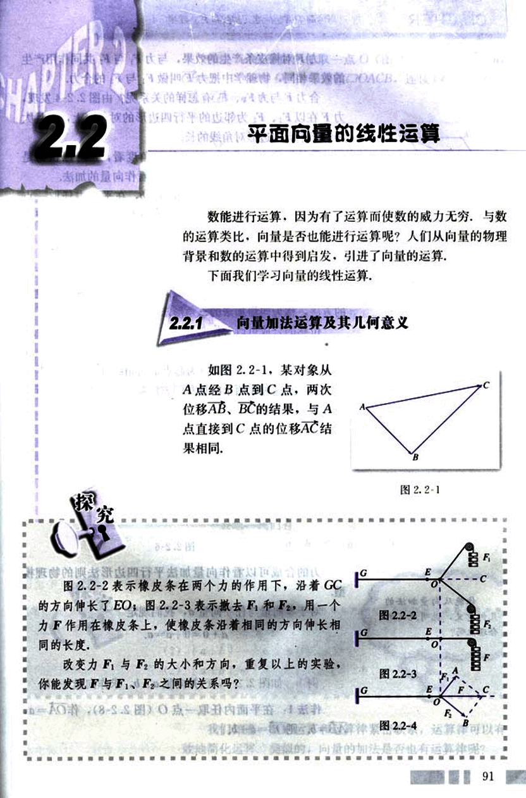
104

# CHAPTER 2

普通高中课程标准实验教科书 数学 4

力 $\bm{F}$ 对橡皮条产生的效果，与力 $\bm{F_1}$ 与 $\bm{F_2}$ 共同作用产生的效果相同，物理学中把力 $\bm{F}$ 叫做 $\bm{F_1}$ 与 $\bm{F_2}$ 的合力。

合力 $\bm{F}$ 与力 $\bm{F_1}$、$\bm{F_2}$ 有怎样的关系呢？由图 2.2-4 发现，力 $\bm{F}$ 在以 $\bm{F_1}$、$\bm{F_2}$ 为邻边的平行四边形的对角线上，并且大小等于平行四边形对角线的长。

数的加法启发我们，从运算的角度看，$\bm{F}$ 可以认为是 $\bm{F_1}$ 与 $\bm{F_2}$ 的和，即位移、力的合成可看作向量的加法。

如图 2.2-5，已知非零向量 $\bm{a}$、$\bm{b}$，在平面内任取一点 A，作 AB = $\bm{a}$，BC = $\bm{b}$，则向量 AC 叫做 $\bm{a}$ 与 $\bm{b}$ 的和，记作 $\bm{a}$ + $\bm{b}$，即

$\bm{a}$ + $\bm{b}$ = AB + BC = AC

求两个向量和的运算，叫做向量的加法，这种求向量和的方法，称为向量加法的三角形法则。

位移的合成可以看作向量加法三角形法则的物理模型。

* 如图 2.2-6，以同一点 O 为起点的两个已知向量 $\bm{a}$、$\bm{b}$ 为邻边作 □OACB，则以 O 为起点的对角线 OC 就是 $\bm{a}$ 与 $\bm{b}$ 的和。我们把这种作两个向量和的方法叫做向量加法的平行四边形法则。

你能从向量加法的几何意义，说明规定的合理性吗？

[图2.2-5](images/2.2-5.png)

[图2.2-6](images/2.2-6.png)

力的合成可以看作向量加法平行四边形法则的物理模型。

对于零向量与任一向量 $\bm{a}$，我们规定

$\bm{a}$ + $\bm{0}$ = $\bm{0}$ + $\bm{a}$ = $\bm{a}$

例 1  如图 2.2-7，已知向量 $\bm{a}$、$\bm{b}$，求作向量 $\bm{a}$ + $\bm{b}$。

作法 1：在平面内任取一点 O（图 2.2-8），作 OA = $\bm{a}$，AB = $\bm{b}$，则 OB = $\bm{a}$ + $\bm{b}$。

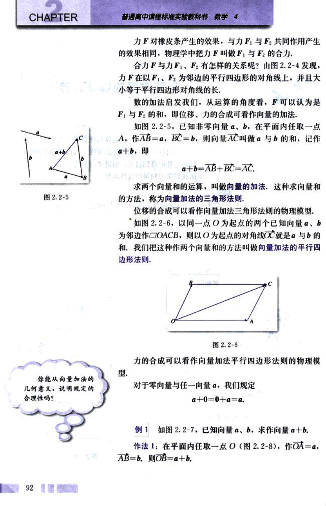
105

# 第二章 平面向量

## 作法2

在平面内任取一点O (图2.2-9), 作$\vec{OA} = a$, $\vec{OB} = b$. 以OA, OB为邻边做平行四边形OACB, 连接OC. 则$\vec{OC} = \vec{OA} + \vec{OB} = a + b$.

  

## 如图2.2-10, 当在数轴上表示两个共线向量时, 它们的加法与数的加法有什么关系?

由例1可知, 当a, b不共线时, $|a + b| < |a| + |b|$.

一般地, 我们有

$|a + b| ≤ |a| + |b|$.

## 探究

当向量a, b处于什么位置时,

(1) $|a + b| = |a| + |b|$;

(2) $|a + b| = ||a| - |b||$ (或$|b| - |a|$).

我们知道, 数的运算和运算律紧密联系, 运算律可以有效地简化运算, 类似的, 向量的加法是否也有运算律呢?

93

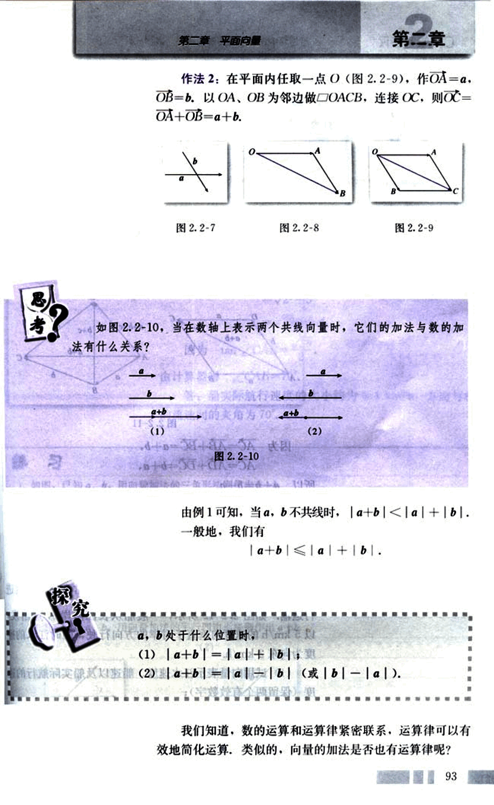
106

# CHAPTER

普通高中课程标准实验教科书 数学 4

## 探究

数的加法满足交换律与结合律，即对任意 $a, b∈R$，有
$a+b=b+a,$
$(a+b)+c=a+(b+c).$

任意向量 $a, b$ 的加法是否也满足交换律和结合律？请画图进行探索。

如图 2.2-11，作 $AB = a$，$AD = b$，以 AB，AD 为邻边
作□ABCD，则 $BC = \underline{~~~~~~~~~~}$，$DC = \underline{~~~~~~~~~~}$。

[diagram](images/diagram.png)

图 2.2-11

因为 $AC = AB + BC = a + b$，
$AC = AD + DC = b + a$，
所以 $a + b = b + a$。

由图 2.2-11，你能否验证
$(a + b) + c = a + (b + c)$？

综上所述，向量的加法满足交换律和结合律。

## 例 2

长江两岸之间没有大桥的地方，常常通过轮渡进行运输。如图 2.2-12 所示，一艘船从长江南岸 A 点出发，以 5 km/h 的速度向垂直于对岸的方向行驶，同时江水的速度为向东 2 km/h。

(1) 试用向量表示江水速度、船速以及船实际航行的速度（保留两个有效数字）；

(2) 求船实际航行的速度的大小与方向（用与江水速度间的夹角表示，精确到度）。

解：(1) 如图 2.2-13 所示，AD 表示船速，AB 表示水

94

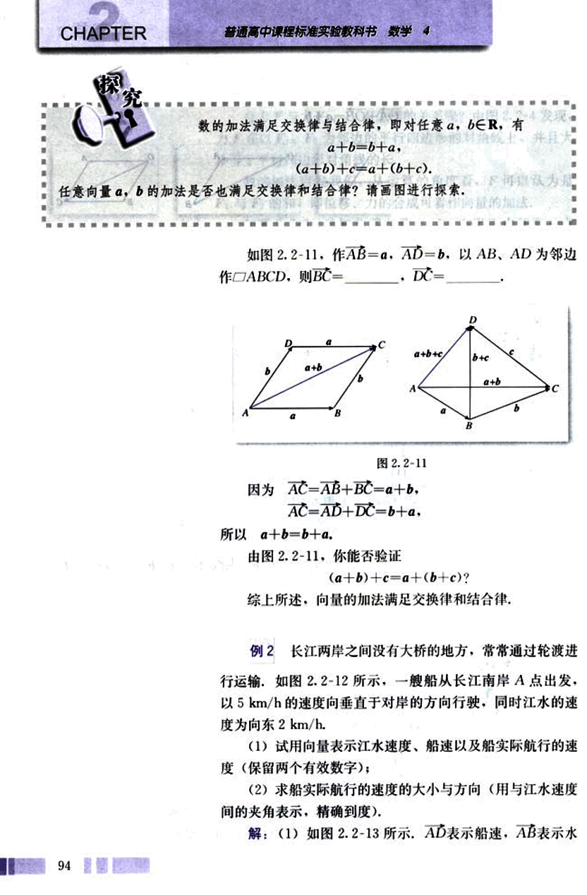
107

# 第二章 平面向量

## 第二章

速，以AD、AB为邻边作□ABCD，则AC表示船实际航行的速度。

图 2.2-12

图 2.2-13

(2) 在Rt△ABC中，|$\vec{AB}$|=2，|$\vec{BC}$|=5.

所以  |$\vec{AC}$|=$\sqrt{|\vec{AB}|^2+|\vec{BC}|^2}$

=$\sqrt{2^2+5^2}$

=$\sqrt{29}$≈5.4.

因为 tan∠CAB=$\frac{5}{2}$，

由计算器得 ∠CAB=70°.

答：船实际航行速度的大小约为5.4 km/h，方向与水的流速间的夹角为70°.

## 练习

1. 如图，已知$\vec{a}$、$\vec{b}$，用向量加法的三角形法则作出$\vec{a}$+$\vec{b}$.

(1) (2) (3) (4)

(第1题)

2. 如图，已知$\vec{a}$、$\vec{b}$，用向量加法的平行四边形法则作出$\vec{a}$+$\vec{b}$.

(1) (2)

(第2题)

95

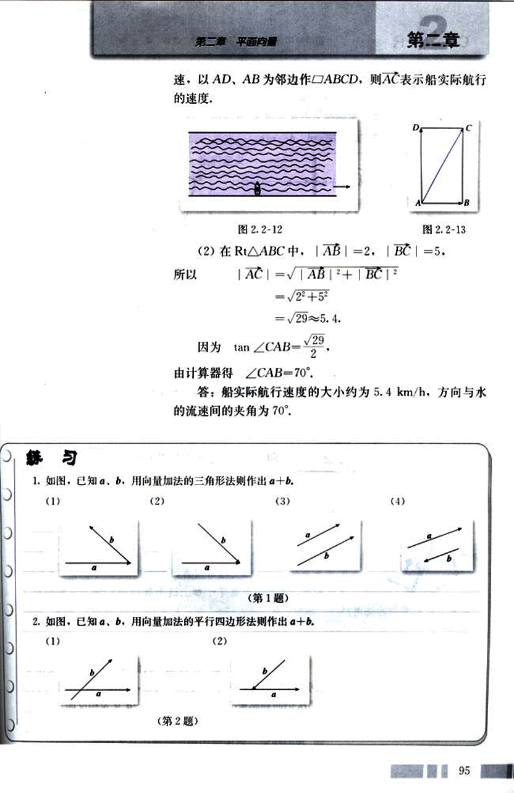
108

# CHAPTER 2

## 3.根据图示填空:

(1)  a+d= _______;

(2)  c+b= _______.

  (第3题)

 (第4题)

## 4.根据图示填空:

(1) a+b= _______;

(2) c+d= _______;

(3) a+b+d= _______;

(4) c+d+e= _______.

## 2.2.2 向量减法运算及其几何意义

向量是否有减法？如何理解向量的减法？

我们知道，减去一个数等于加上这个数的相反数。向量的减法是否也有类似的法则？

与数的相反数类似，我们规定，与$\bm{a}$长度相等，方向相反的向量，叫做$\bm{a}$的相反向量，记作$- \bm{a}$。由于方向反转两次仍回到原来的方向，因此$\bm{a}$和$- \bm{a}$互为相反向量，于是$-(- \bm{a}) = \bm{a}$。

我们规定，零向量的相反向量仍是零向量。

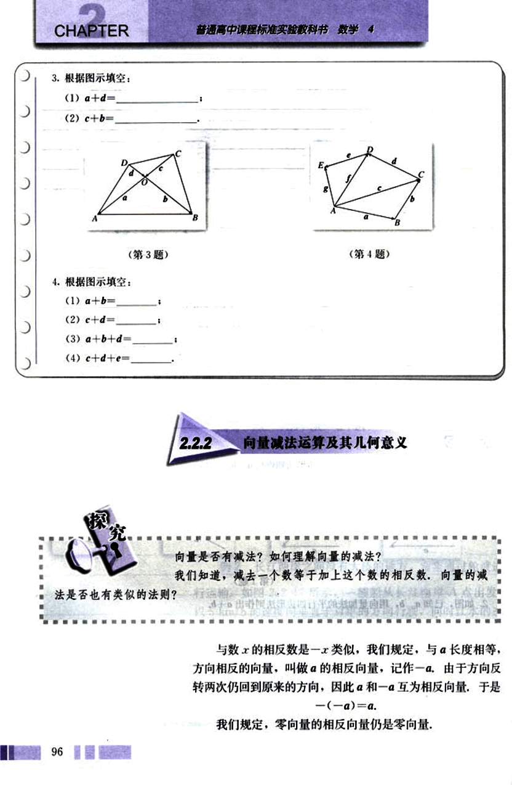
109

# 第二章 平面向量

## 第二章

任一向量与其相反向量的和是零向量，即
a + (-a) = (-a) + a = 0.

所以，如果a，b是互为相反的向量，那么
a = -b，b = -a，a + b = 0.

我们定义
a - b = a + (-b),

即减去一个向量相当于加上这个向量的相反向量.

如图 2.2-14，设向量 AB = b，AC = a，则 AD = -b，由
向量减法的定义知，

[图2.2-14](images/2.2-14.png)

AE = a + (-b) = a - b.

又
b + BC = a.
BC = a - b.

由此，我们得到 a - b 的作图方法.

如图 2.2-15，已知 a，b，在平面内任取一点 O，作
OA = a，OB = b，则 BA = a - b. 即 a - b 可以表示为从向量 b
的终点指向向量 a 的终点的向量，这是向量减法的几何意义.

[图2.2-15](images/2.2-15.png)

(1)在图 2.2-15 中，如果从 a 的终点到 b 的终点作向量，那么所得向
量是什么？

(2)改变图 2.2-15 中向量 a，b 的方向，使 a//b，怎样作出 a - b 呢？

例 3  如图 2.2-16(1)，已知向量 a，b，c，d，求作向
量 a - b，c - d.

作法：如图 2.2-16(2)，在平面内任取一点 O. 作 OA = a，
OB = b，OC = c，OD = d. 则

97

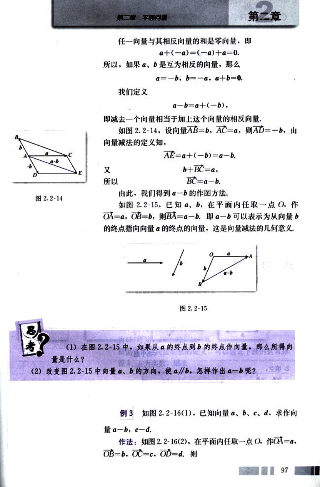
110

# CHAPTER

普通高中课程标准实验教科书 数学 4

图 2.2-16

$\vec{BA} = \vec{a} - \vec{b}.$
$\vec{DC} = \vec{c} - \vec{d}.$

例 4 如图 2.2-17，□ABCD中，$\vec{AB} = \vec{a}$，$\vec{AD} = \vec{b}$。

你能用$\vec{a}$，$\vec{b}$表示向量$\vec{AC}$，$\vec{DB}$吗？

解：由向量加法的平行四边形法则，我们知道

$\vec{AC} = \vec{a} + \vec{b}$；

同样，由向量的减法，知

$\vec{DB} = \vec{AB} - \vec{AD} = \vec{a} - \vec{b}$。

## 练习

1. 如图，已知$\vec{a}$，$\vec{b}$，求作$\vec{a} - \vec{b}$。

(1) (2) (3) (4)

(第1题)

2. 填空：

$\vec{AB} - \vec{AD} =$ ______；

$\vec{BA} - \vec{BC} =$ ______；

$\vec{BC} - \vec{BA} =$ ______；

$\vec{OB} - \vec{OA} =$ ______；

$\vec{OA} - \vec{OB} =$ ______；

3. 作图验证：$-(\vec{a} + \vec{b}) = -\vec{a} - \vec{b}$。

98

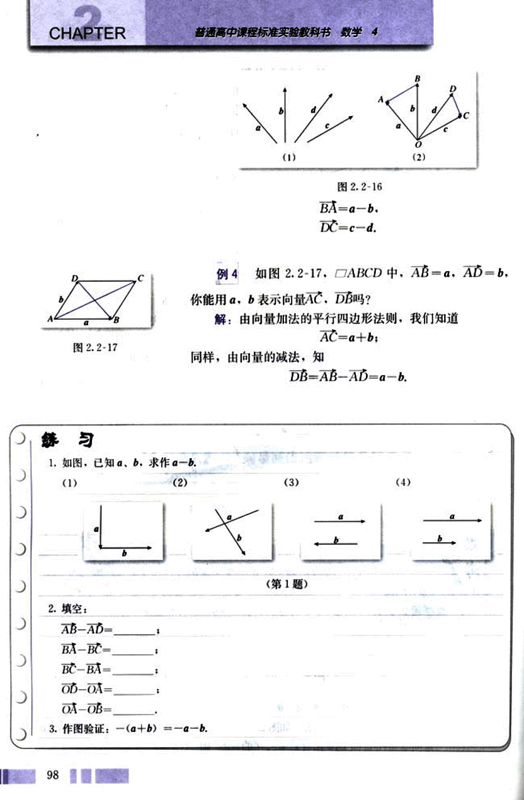
111

# 第二章 平面向量

## 2.2.3 向量数乘运算及其几何意义

已知非零向量$\vec{a}$，作出$\vec{a}$+$\vec{a}$+$\vec{a}$和($-\vec{a}$)+($-\vec{a}$)+($-\vec{a}$).你能说明它们的几何意义吗？

\begin{center}
\includegraphics[width=2cm]{images/2.2-18.png}
图2.2-18
\end{center}

由图2.2-18可知，$\vec{OC}$=$\vec{OA}$+$\vec{AB}$+$\vec{BC}$=$\vec{a}$+$\vec{a}$+$\vec{a}$.类似数的乘法，我们把$\vec{a}$+$\vec{a}$+$\vec{a}$记作3$\vec{a}$，即$\vec{OC}$=3$\vec{a}$.显然3$\vec{a}$的方向与$\vec{a}$的方向相同，3$\vec{a}$的长度是$\vec{a}$的长度的3倍，即|3$\vec{a}$|=3|$\vec{a}$|.

同样，由图2.2-18可知，$\vec{PN}$=$\vec{PQ}$+$\vec{QM}$+$\vec{MN}$=(–$\vec{a}$)+(–$\vec{a}$)+(–$\vec{a}$),即(–$\vec{a}$)+(–$\vec{a}$)+(–$\vec{a}$)=3(–$\vec{a}$),显然3(–$\vec{a}$)的方向与$\vec{a}$的方向相反，3(–$\vec{a}$)的长度是$\vec{a}$的长度的3倍，这样，3(–$\vec{a}$)=-3$\vec{a}$.

一般地，我们规定实数λ与向量$\vec{a}$的积是一个向量，这种运算叫做向量的数乘(multiplication of vector by scalar)，记作λ$\vec{a}$，它的长度与方向规定如下：

(1) |λ$\vec{a}$| = |λ||$\vec{a}$| ;

(2)当λ>0时，λ$\vec{a}$的方向与$\vec{a}$的方向相同；当λ<0时，λ$\vec{a}$的方向与$\vec{a}$的方向相反.

由(1)可知，λ=0时，λ$\vec{a}$=$\vec{0}$.

根据实数与向量的积的定义，可以验证下面的运算律，设λ，μ为实数，那么

(1) λ(μ$\vec{a}$)=(λμ)$\vec{a}$；

(2) (λ+μ)$\vec{a}$=λ$\vec{a}$+μ$\vec{a}$；

(3) λ($\vec{a}$+$\vec{b}$)=λ$\vec{a}$+λ$\vec{b}$.

特别地，我们有

(–λ)$\vec{a}$=–(λ$\vec{a}$)=λ(–$\vec{a}$).

λ($\vec{a}$-$\vec{b}$)=λ$\vec{a}$-λ$\vec{b}$.

99

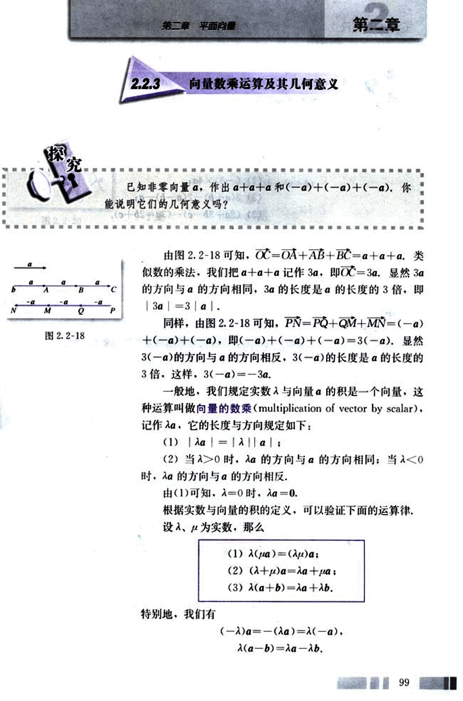
112

# CHAPTER

## 思考?

你能解释上述运算律的几何意义吗？

**例5** 计算：

(1) (-3) × 4a;

(2) 3(a + b) - 2(a - b) - a;

(3) (2a + 3b - c) - (3a - 2b + c).

**解:**

(1) 原式 = (-3 × 4)a = -12a;

(2) 原式 = 3a + 3b - 2a + 2b - a = 5b;

(3) 原式 = 2a + 3b - c - 3a + 2b - c 

= -a + 5b - 2c.

## 思考?

引入向量数乘运算后，你能发现数乘向量与原向量之间的位置关系吗？

对于向量 $a$($a \ne 0$)、$b$，如果有一个实数 $\lambda$，使 $b = \lambda a$，那么由向量数乘的定义知，$a$ 与 $b$ 共线。

反过来，已知向量 $a$ 与 $b$ 共线，$a \ne 0$，且向量的长度是向量 $a$ 的长度的 $\mu$ 倍，即 $|b| = \mu|a|$，那么当 $a$ 与 $b$ 同方向时，有 $b = \mu a$；当 $a$ 与 $b$ 反方向时，有 $b = -\mu a$。

综上，如果 $a$($a \ne 0$) 与 $b$ 共线，那么有且只有一个实数 $\lambda$，使 $b = \lambda a$。

**例6**  如图 [2.2-19](images/2.2-19.png)，已知任意两个非零向量 $a$、$b$，试作 $OA = a + b$，$OB = a + 2b$，$OC = a + 3b$。你能判断 A、B、C 三点之间的位置关系吗？为什么？

**分析:** 判断三点之间的位置关系，主要是看这三点是否共线。由于两点确定一条直线，如果能够判断第三点在这条直线上，那么就可以判断这三点共线。本题中，应用向量知识判断 A、B、C 三点是否共线，可以通过判断向量 AC、AB 是否共线，即是否存在 $\lambda$，使 $AC = \lambda AB$ 成立。

100

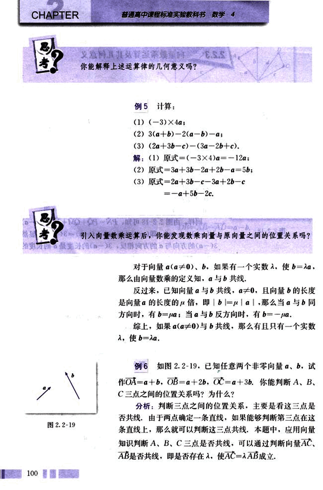
113

# 第二章 平面向量

## 第二章

解：分别作向量OA、OB、OC，过点A、C作直线AC（如图2.2-20）。观察发现，不论向量$\bold{a}$、$\bold{b}$怎样变化，点B始终在直线AC上，猜想A、B、C三点共线。

事实上，因为$\bold{AB}$=$\bold{OB}$-$\bold{OA}$

=$\bold{a}$+2$\bold{b}$-( $\bold{a}$+$\bold{b}$)

=$\bold{b}$.

而 $\bold{AC}$=$\bold{OC}$-$\bold{OA}$

=$\bold{a}$+3$\bold{b}$-( $\bold{a}$+$\bold{b}$)

=2$\bold{b}$,

于是 $\bold{AC}$=2$\bold{AB}$.

所以，A、B、C三点共线。

你能解释它的几何意义吗？

向量的加、减、数乘运算统称为向量的线性运算，对于任意向量$\bold{a}$、$\bold{b}$，以及任意实数λ₁、μ₁、λ₂、μ₂，恒有

λ₁(μ₁$\bold{a}$+μ₂$\bold{b}$)=λ₁μ₁$\bold{a}$+λ₁μ₂$\bold{b}$. ●

例7  如图2.2-21，□ABCD的两条对角线相交于点M，且$\bold{AB}$=$\bold{a}$，$\bold{AD}$=$\bold{b}$，你能用$\bold{a}$、$\bold{b}$表示$\bold{MA}$、$\bold{MB}$、$\bold{MC}$和$\bold{MD}$吗？

解：在□ABCD中，

$\bold{AC}$=$\bold{AB}$+$\bold{AD}$=$\bold{a}$+$\bold{b}$，

$\bold{DB}$=$\bold{AB}$-$\bold{AD}$=$\bold{a}$-$\bold{b}$.

又平行四边形的两条对角线互相平分，

∴ $\bold{MA}$=$\frac{1}{2}$$\bold{AC}$

=$\frac{1}{2}$($\bold{a}$+$\bold{b}$)

=$\frac{1}{2}$$\bold{a}$+$\frac{1}{2}$$\bold{b}$；

$\bold{MB}$=$\frac{1}{2}$$\bold{DB}$=$\frac{1}{2}$($\bold{a}$-$\bold{b}$)

=$\frac{1}{2}$$\bold{a}$-$\frac{1}{2}$$\bold{b}$；

$\bold{MC}$=$\frac{1}{2}$$\bold{AC}$=$\frac{1}{2}$$\bold{a}$+$\frac{1}{2}$$\bold{b}$；

$\bold{MD}$=-$\bold{MB}$=-$\frac{1}{2}$$\bold{DB}$=-$\frac{1}{2}$$\bold{a}$+$\frac{1}{2}$$\bold{b}$.

101

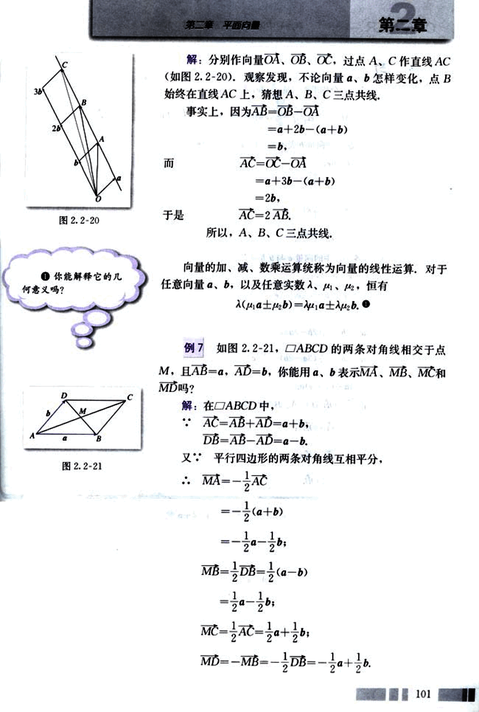
114

# CHAPTER 练习

1. 任画一向量e，分别求作向量a=4e，b=-4e.

2. 点C在线段AB上，且$\frac{AC}{CB} = \frac{5}{2}$，则AC=____AB，BC=____AB.

3. 把下列各小题中的向量b表示为实数与向量a的积：
(1) a=3e，b=6e；
(2) a=8e，b=-14e；
(3) $a = -\frac{2}{3}e$，$b = \frac{1}{3}e$；
(4) $a = -\frac{3}{4}e$，$b = -\frac{2}{3}e$.

4. 判断下列各小题中的向量a与b是否共线：
(1) a=-2e，b=2e；
(2) a=e1-e2，b=-2e1+2e2.

5. 化简：
(1) 5(3a-2b)+4(2b-3a)；
(2) $\frac{1}{2}(a-2b)-\frac{1}{4}(3a-2b)-\frac{1}{2}(a-b)$；
(3) (x+y)a-(x-y)a.

6. 已知向量$\vec{OA}$，$\vec{OB}$ (O，A，B三点不共线)，求作下列向量：
(1) $\vec{OM} = \frac{1}{2}(\vec{OA}+\vec{OB})$；
(2) $\vec{ON} = \frac{1}{2}(\vec{OA}-\vec{OB})$；
(3) $\vec{OG} = 3\vec{OA}+2\vec{OB}$.

102
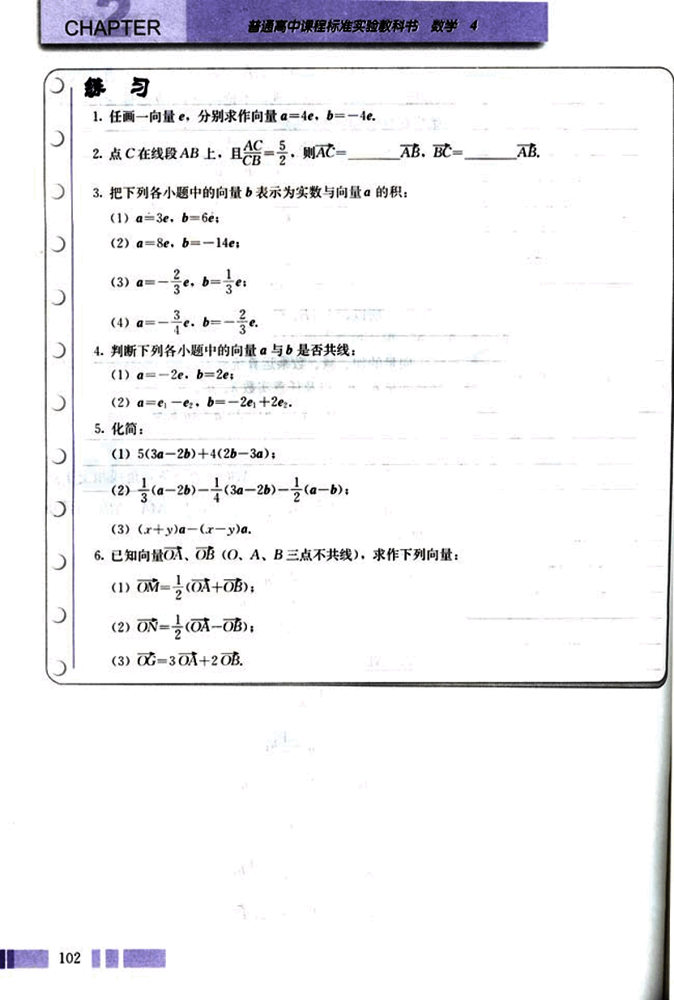
115

# 第二章 平面向量
## 第二章

## 习题2.2
### A组

1. 设a表示“向东走10km”，b表示“向西走5km”，c表示“向北走10km”，d表示“向南走5 km”。试说明下列向量的意义：
(1) a+a;
(2) a+b;
(3) a+c;
(4) b+d;
(5) b+c+b;
(6) d+a+d.

2. 一架飞机向北飞行300km，然后改变方向向西飞行400km，求飞机飞行的路程及两次位移的合成。

3. 一艘船以8 km/h的速度向垂直于对岸的方向行驶，同时河水的流速为2 km/h。求船实际航行的速度的大小与方向（精确到1°）。

4. 化简：
(1) AB+BC+CA;
(2) (AB+MB)+BO+OM;
(3) OA+OC+BO+CO;
(4) AB−AC+BD−CD;
(5) OA−OD+AD;
(6) AB−AD−DC;
(7) NQ+QP+MN−MP.

5. 作图验证：
(1) $\frac{1}{2}(a+b)+\frac{1}{2}(a-b)=a$;
(2) $\frac{1}{2}(a+b)-\frac{1}{2}(a-b)=b$.

6. 已知向量a，b，求作向量c，使a+b+c=0。表示a，b，c的有向线段能构成三角形吗？

7. 作图验证：b−a=−(a−b).

8. 已知a，b为两个非零向量，
(1) 求作向量a+b及a−b;
(2) 向量a，b成什么位置关系时，|a+b|=|a−b|（不要求证明）。

9. 化简：
(1) 5(3a−2b)+4(2b−3a);
(2) 6(a−3b+c)−4(−a+b−c);

103

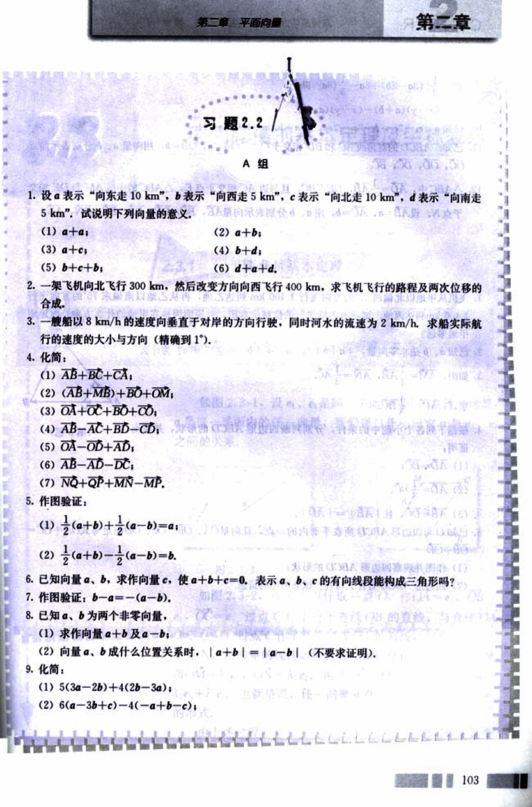
116

# CHAPTER 2

(3) $\frac{1}{2}[(3a-2b)+5a-\frac{1}{3}(6a-9b)]$

(4) $(x-y)(a+b)-(x-y)(a-b)$

10. 已知 $a=e_1+2e_2$, $b=3e_1-2e_2$, 求 $a+b$, $a-b$ 与 $3a-2b$.

11. 已知 $\square ABCD$ 的对角线 $AC$ 和 $BD$ 相交于 $O$, 且 $OA = \vec{a}$, $OB = \vec{b}$, 用向量 $\vec{a}$, $\vec{b}$ 分别表示向量 $\vec{OC}$, $\vec{OD}$, $\vec{DC}$, $\vec{BC}$.

12. $\triangle ABC$ 中, $AD = \frac{1}{4}AB$, $DE // BC$, 且与边 $AC$ 相交于点 $E$, $\triangle ABC$ 的中线 $AM$ 与 $DE$ 相交于点 $N$. 设 $AB = \vec{a}$, $AC = \vec{b}$, 用 $\vec{a}$, $\vec{b}$ 分别表示向量 $\vec{AE}$, $\vec{BC}$, $\vec{DE}$, $\vec{DB}$, $\vec{EC}$, $\vec{DN}$, $\vec{AN}$.

# B 组

1. 飞机从甲地以北偏西 15° 的方向飞行 1400 km 到达乙地, 再从乙地以南偏东 75° 的方向飞行 1400 km 到达丙地, 试画出飞机飞行的位移示意图, 并说明丙地在甲地的什么方向? 丙地距甲地多远?

2. 已知 $\vec{a}$，$\vec{b}$ 是非零向量，$| \vec{a} + \vec{b} |$ 与 $| \vec{a} | + | \vec{b} |$ 一定相等吗？为什么？

3. 如图, $AM = \frac{1}{3}AB$, $AN = \frac{1}{3}AC$.

求证: $MN = \frac{1}{3}BC$.

[image](images/image1.png)

4. 根据下列各个小题中的条件, 分别判断四边形 ABCD 的形状, 并给出证明:

(1) $\vec{AD} = \vec{BC}$;

(2) $\vec{AD} = \frac{1}{3}\vec{BC}$;

(3) $\vec{AB} = \vec{DC}$, 且 $| \vec{AB} | = | \vec{AD} |$.

5. 已知 O 为四边形 ABCD 所在平面内的一点, 且向量 $\vec{OA}$, $\vec{OB}$, $\vec{OC}$, $\vec{OD}$ 满足等式 $\vec{OA} + \vec{OC} = \vec{OB} + \vec{OD}$.

(1) 作图并观察四边形 ABCD 的形状;

(2) 四边形 ABCD 有什么特性? 试证明你的猜想.

104

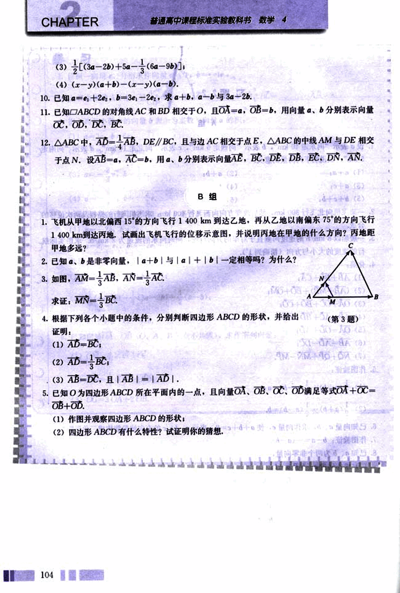
