# 2.3　平面向量的基本定理及坐标表示

117

# 平面向量的基本定理及坐标表示

## 2.3.1 平面向量基本定理

给定平面内任意两个向量 $\vec{e_1}$，$\vec{e_2}$，请你作出向量 $3\vec{e_1}+2\vec{e_2}$，$\vec{e_1}-2\vec{e_2}$。平面内的任一向量是否都可以用形如 $\lambda_1\vec{e_1}+\lambda_2\vec{e_2}$ 的向量表示呢？

如图 2.3-1，设 $\vec{e_1}$，$\vec{e_2}$ 是同一平面内两个不共线的向量，$\vec{a}$ 是这一平面内的任一向量，我们通过作图研究 $\vec{a}$ 与 $\vec{e_1}$，$\vec{e_2}$ 之间的关系。

[图2.3-1](images/2.3-1.png)

[图2.3-2](images/2.3-2.png)

如图 2.3-2，在平面内任取一点 O，作 $\vec{OA} = \vec{e_1}$，$\vec{OB} = \vec{e_2}$，$\vec{OC} = \vec{a}$。过点 C 作平行于直线 OB 的直线，与直线 OA 交于点 M；过点 C 作平行于直线 OA 的直线，与直线 OB 交于点 N。由向量的线性运算性质可知，存在实数 $\lambda_1$，$\lambda_2$，使得 $\vec{OM} = \lambda_1\vec{e_1}$，$\vec{ON} = \lambda_2\vec{e_2}$。由于 $\vec{OC} = \vec{OM} + \vec{ON}$，所以 $\vec{a} = \lambda_1\vec{e_1} + \lambda_2\vec{e_2}$。也就是说，任一向量 $\vec{a}$ 都可以表示成 $\lambda_1\vec{e_1} + \lambda_2\vec{e_2}$ 的形式。

由上述过程，可以发现，平面内任一向量都可以由这个平面内两个不共线的向量 $\vec{e_1}$，$\vec{e_2}$ 表示出来，当 $\vec{e_1}$，$\vec{e_2}$ 确定后，

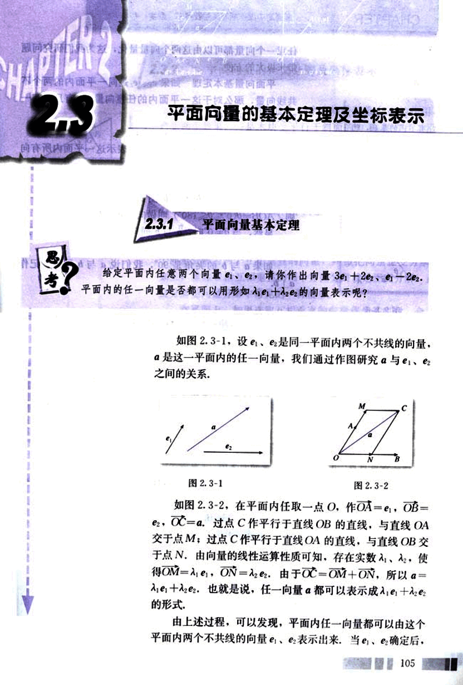
118

# CHAPTER 2

## 平面向量基本定理

任意一个向量都可以由这两个向量量化，这为我们研究问题带来极大的方便.

平面向量基本定理 如果$\vec{e_1}$、$\vec{e_2}$是同一平面内的两个不共线向量，那么对于这一平面内的任意向量$\vec{a}$，有且只有一对实数$\lambda_1$、$\lambda_2$，使

$\vec{a} = \lambda_1\vec{e_1} + \lambda_2\vec{e_2}$.

我们把不共线的向量$\vec{e_1}$、$\vec{e_2}$叫做表示这一平面内所有向量的一组基底(base).

不共线向量存在夹角，关于向量的夹角，我们规定：

已知两个非零向量$\vec{a}$和$\vec{b}$(图2.3-3)，作$OA = \vec{a}$，$OB = \vec{b}$，则$\angle AOB = \theta (0^\circ \le \theta \le 180^\circ)$叫做向量$\vec{a}$与$\vec{b}$的夹角.

显然，当$\theta = 0^\circ$时，$\vec{a}$与$\vec{b}$同向；当$\theta = 180^\circ$时，$\vec{a}$与$\vec{b}$反向.

如果$\vec{a}$与$\vec{b}$的夹角是$90^\circ$，我们说$\vec{a}$与$\vec{b}$垂直，记作$\vec{a} \perp \vec{b}$.

## 例1

已知向量$\vec{e_1}$、$\vec{e_2}$(图2.3-4)，求作向量$-2.5\vec{e_1} + 3\vec{e_2}$.

[图2.3-3](images/2.3-3.png)
[图2.3-4](images/2.3-4.png)
[图2.3-5](images/2.3-5.png)

**作法：**

1. 如图2.3-5，任取一点O，作$OA = -2.5\vec{e_1}$，$OB = 3\vec{e_2}$.
2. 作$\square OACB$.
$\vec{OC}$就是求作的向量.

## 思考

还有其他作法吗？

106

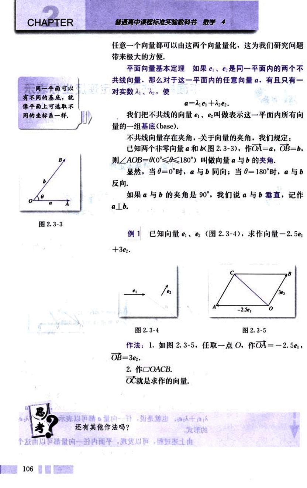
119

# 第二章 平面向量

## 2.3.2 平面向量的正交分解及坐标表示

如图 2.3-6，光滑斜面上一个木块受到重力 G 的作用，产生两个效果：一是木块受平行于斜面的力 F₁ 的作用，沿斜面下滑；二是木块产生垂直于斜面的压力 F₂。也就是说，重力 G 的效果等价于 F₁ 和 F₂ 的合力的效果，即 G = F₁ + F₂。G = F₁ + F₂ 叫做把重力 G 分解。

类似地，由平面向量的基本定理，对平面上的任意向量 α，均可以分解为不共线的两个向量 α₁ 和 α₂，使 α = λ₁α₁ + λ₂α₂。

在不共线的两个向量中，垂直是一种重要的情形。把一个向量分解为两个互相垂直的向量，叫做把向量正交分解。如上，重力 G 沿互相垂直的两个方向分解就是正交分解，正交分解是向量分解中常见的一种情形。

在平面上，如果选取互相垂直的向量作为基底时，会为我们研究问题带来方便。

我们知道，在平面直角坐标系中，每一个点都可用一对有序实数（即它的坐标）表示。对直角坐标平面内的每一个向量，如何表示呢？

如图 2.3-7，在平面直角坐标系中，分别取与 x 轴、y 轴方向相同的两个单位向量 i，j 作为基底，对于平面内的任意一个向量 a，由平面向量基本定理可知，有且只有一对实数 x，y，使得

a = xi + yj. ①

这样，平面内的任一向量 α 都可由 x，y 唯一确定，我们把有序数对 (x，y) 叫做向量 a 的坐标，记作

a = (x，y). ②

其中 x 叫做 a 在 x 轴上的坐标，y 叫做 a 在 y 轴上的坐标。②式叫做向量的坐标表示。

显然，i = (1，0)，j = (0，1)，0 = (0，0)。

如图 2.3-8，在直角坐标平面中，以原点 O 为起点作 OA = a，则点 A 的位置由向量 a 唯一确定。

107

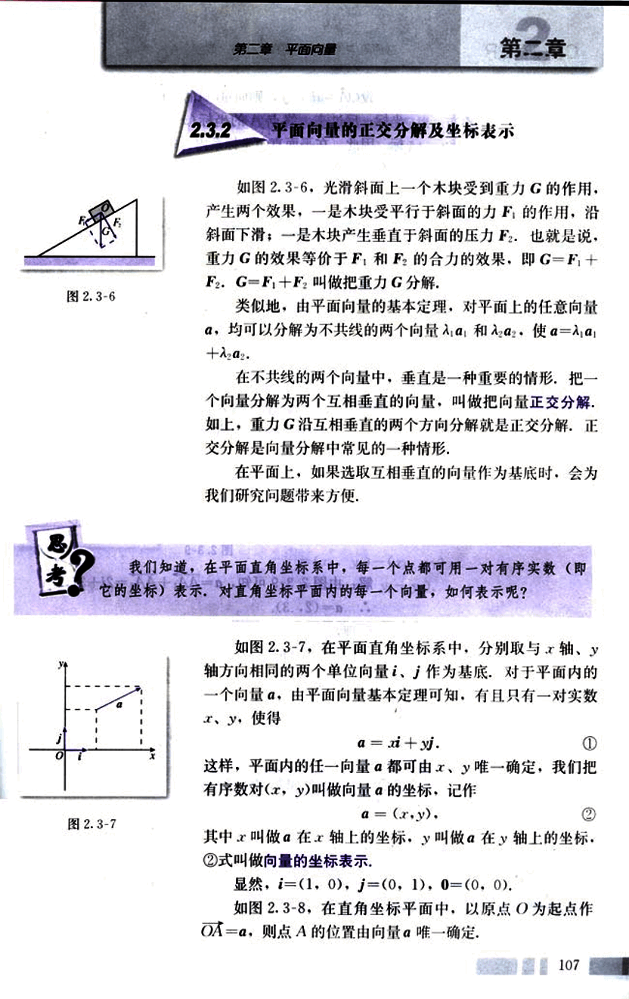
120

# CHAPTER 2

设$\vec{OA} = xi + yj$，则向量$\vec{OA}$的坐标$(x, y)$就是终点的坐标；反过来，终点的坐标$(x, y)$也就是向量$\vec{OA}$的坐标。因此，在平面直角坐标系内，每一个平面向量都可以用一个有序实数对唯一表示。

## 例2

如图2.3-9，分别用基底$i$、$j$表示向量$a$、$b$、$c$、$d$，并求出它们的坐标。

[图2.3-8](images/2.3-8.png)
[图2.3-9](images/2.3-9.png)

解：由图2.3-9可知，$a = \vec{AA_1} + \vec{AA_2} = 2i + 3j$，
$\therefore a = (2, 3)$。

同理，

$b = -2i + 3j = (-2, 3)$；

$c = -2i - 3j = (-2, -3)$；

$d = 2i - 3j = (2, -3)$。

## 2.3.3 平面向量的坐标运算

已知$a = (x_1, y_1)$，$b = (x_2, y_2)$，你能得出$a + b$，$a - b$，$\lambda a$的坐标吗？

108
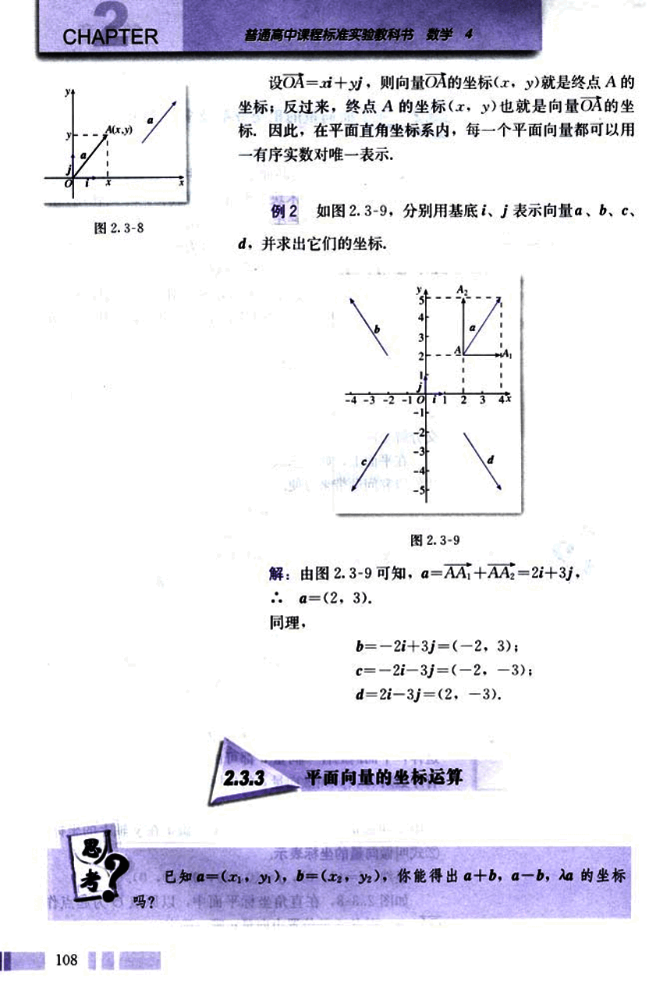
121

# 第二章 平面向量

## 第二节

a+b=(x₁i+y₁j)+(x₂i+y₂j),

由向量线性运算的结合律和分配律，可得

(x₁i+y₁j)+(x₂i+y₂j)
=(x₁+x₂)i+(y₁+y₂)j,

即

a+b=(x₁+x₂, y₁+y₂).

同理可得

a-b=(x₁-x₂, y₁-y₂).

这就是说，两个向量和（差）的坐标分别等于这两个向量相应坐标的和（差）。

**向量相应坐标的和（差）。**

即

λa=λ(x₁i+y₁j)=λx₁i+λy₁j.

λa=(λx₁, λy₁).

这就是说，实数与向量的积的坐标等于用这个实数乘原来向量的相应坐标。

**例3** 如图2.3-10，已知A(x₁, y₁)，B(x₂, y₂)，求$\vec{AB}$的坐标。

解：$\vec{AB}$=$\vec{OB}$-$\vec{OA}$

=(x₂, y₂)-(x₁, y₁)

=(x₂-x₁, y₂-y₁).

因此，一个向量的坐标等于表示此向量的有向线段的终点的坐标减去始点的坐标。

[图2.3-10](images/2.3-10.png)

**思考**

你能在图2.3-10中标出坐标为(x₂-x₁，y₂-y₁)的P点吗？

标出点P后，我们发现，向量$\vec{AB}$的坐标与以原点为始点，点P为终点的向量的坐标是相同的，这样就建立了向量的坐标与点的坐标之间的联系。

**例4** 已知a=(2, 1), b=(-3, 4), 求a+b, a-b, 3a+4b的坐标.

109

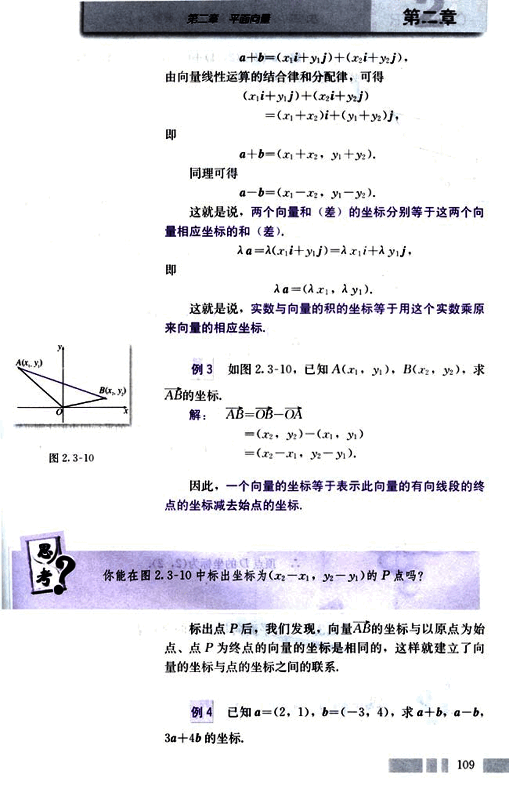
122

# CHAPTER

普通高中课程标准实验教科书 数学 4

## 图 2.3-11

[image1](images/image1.png)

## 图 2.3-12

[image2](images/image2.png)

解：$a + b = (2, 1) + (-3, 4) = (-1, 5)$；
$a - b = (2, 1) - (-3, 4) = (5, -3)$；
$3a + 4b = 3(2, 1) + 4(-3, 4)$
$= (6, 3) + (-12, 16)$
$= (-6, 19)$.

例 5 如图 2.3-11，已知 $\square ABCD$ 的三个顶点 A、B、C 的坐标分别是 $(-2, 1)$、$(-1, 3)$、$(3, 4)$，试求顶点 D 的坐标.

解法 1：如图 2.3-11，设顶点 D 的坐标为 $(x, y)$.
$\cdots AB = (-1 - (-2), 3 - 1) = (1, 2)$,
$DC = (3 - x, 4 - y)$,
由 $AB = DC$，得
$(1, 2) = (3 - x, 4 - y)$.
$\cdots \begin{cases} 1 = 3 - x \\ 2 = 4 - y \end{cases}$.
$\cdots \begin{cases} x = 2 \\ y = 2 \end{cases}$.
$\cdots$ 顶点 D 的坐标为 $(2, 2)$.

解法 2：如图 2.3-12，由向量加法的平行四边形法则可知
$BD = BA + AD = BA + BC$
$= (-2 - (-1), 1 - 3) + (3 - (-1), 4 - 3)$
$= (-1, -2) + (4, 1)$
$= (3, -1)$,
而 $OD = OB + BD$
$= (-1, 3) + (3, -1)$
$= (2, 2)$.
$\cdots$ 顶点 D 的坐标为 $(2, 2)$.

你能比较一下两种解法在思想方法上的异同点吗？

## 2.3.4 平面向量共线的坐标表示

如何用坐标表示两个共线向量？

110

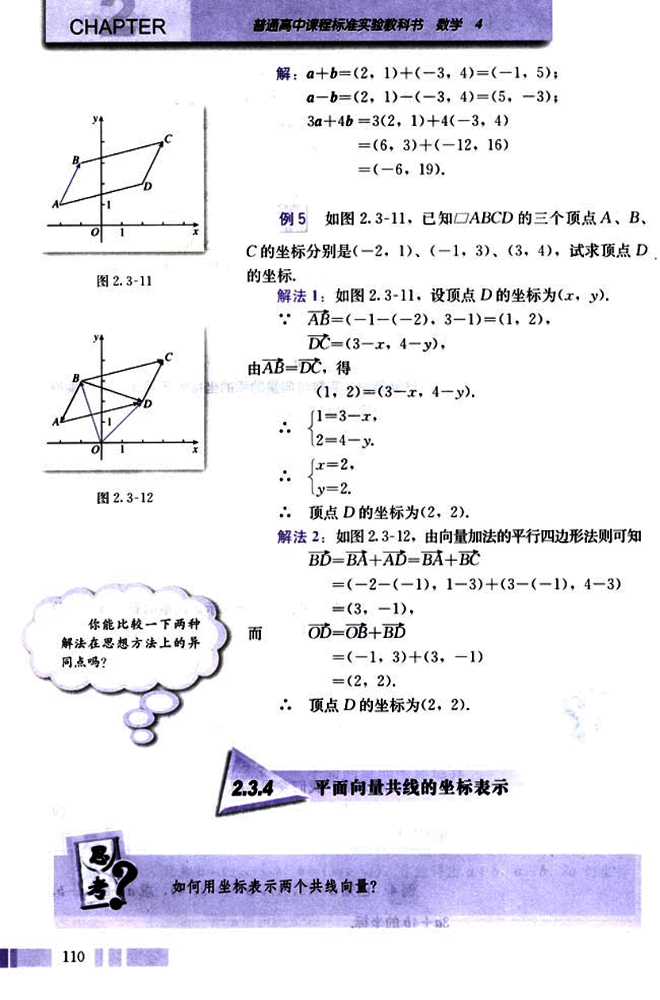
123

# 第二章 平面向量
## 第二章

设$a=(x_1, y_1)$, $b=(x_2, y_2)$，其中$b≠0$。我们知道，
$a$、$b$共线，当且仅当存在实数$\lambda$，使
$a = \lambda b$。
如果用坐标表示，可写为
$(x_1, y_1) = \lambda(x_2, y_2)$，
即
$\begin{cases} x_1 = \lambda x_2 \\ y_1 = \lambda y_2 \end{cases}$。
消去$\lambda$后得
$x_1y_2 - x_2y_1 = 0$。
这就是说，当且仅当
$x_1y_2 - x_2y_1 = 0$
时，向量$a$、$b$($b≠0$)共线。

## 例6

已知$a=(4, 2)$，$b=(6, y)$，且$a//b$，求$y$。

解：
$a//b$，
$4y - 2 \times 6 = 0$。
$y = 3$。

## 例7

已知$A(-1, -1)$，$B(1, 3)$，$C(2, 5)$，试判断$A$，$B$，$C$三点之间的位置关系。

[图](images/2.3-13.png)

解：在平面直角坐标系中作出$A$，$B$，$C$三点(图2.3-13)，观察图形，我们猜想$A$、$B$、$C$三点共线，下面给出证明。
$\vec{AB} = (1 - (-1), 3 - (-1)) = (2, 4)$，
$\vec{AC} = (2 - (-1), 5 - (-1)) = (3, 6)$，

111

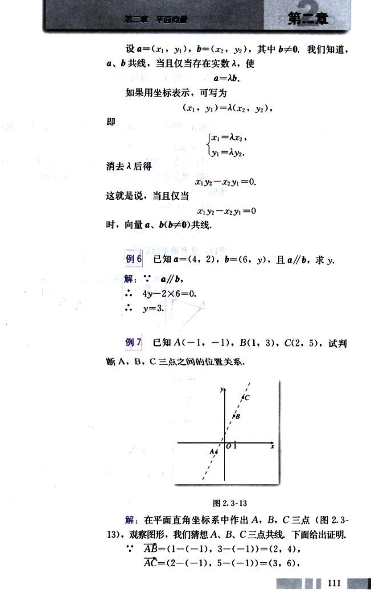
124

# CHAPTER

又 2×6 - 3×4 = 0，
： AB // AC.
∵ 直线 AB，直线 AC 有公共点 A，
∴ A，B，C 三点共线.

## 例 8

设点 P 是线段 $P_1P_2$ 上的一点，$P_1$，$P_2$ 的坐标分别
是 ($x_1$，$y_1$)，($x_2$，$y_2$).

(1) 当点 P 是线段 $P_1P_2$ 的中点时，求点 P 的坐标；

(2) 当点 P 是线段 $P_1P_2$ 的一个三等分点时，求点 P 的
坐标.

解：(1) 如图 2.3-14，由向量的线性运算可知

$\overrightarrow{OP} = \frac{1}{2}(\overrightarrow{OP_1} + \overrightarrow{OP_2}) = (\frac{x_1 + x_2}{2}，\frac{y_1 + y_2}{2})$.

所以，点 P 的坐标是 $(\frac{x_1 + x_2}{2}，\frac{y_1 + y_2}{2})$.

[图2.3-14](images/2.3-14.png)
[图2.3-15](images/2.3-15.png)

(2) 如图 2.3-15，当点 P 是线段 $P_1P_2$ 的一个三等分点
时，有两种情况，即 $\frac{P_1P}{P_1P_2} = \frac{1}{2}$ 或 $\frac{P_1P}{P_1P_2} = 2$.

如果 $\frac{P_1P}{P_1P_2} = \frac{1}{3}$，那么

$\overrightarrow{OP} = \overrightarrow{OP_1} + \overrightarrow{P_1P} = \overrightarrow{OP_1} + \frac{1}{3}\overrightarrow{P_1P_2}$

$= \overrightarrow{OP_1} + \frac{1}{3}(\overrightarrow{OP_2} - \overrightarrow{OP_1}) = \frac{2}{3}\overrightarrow{OP_1} + \frac{1}{3}\overrightarrow{OP_2}$

$= (\frac{2x_1 + x_2}{3}，\frac{2y_1 + y_2}{3})$.

即点 P 的坐标是 $(\frac{2x_1 + x_2}{3}，\frac{2y_1 + y_2}{3})$.

112
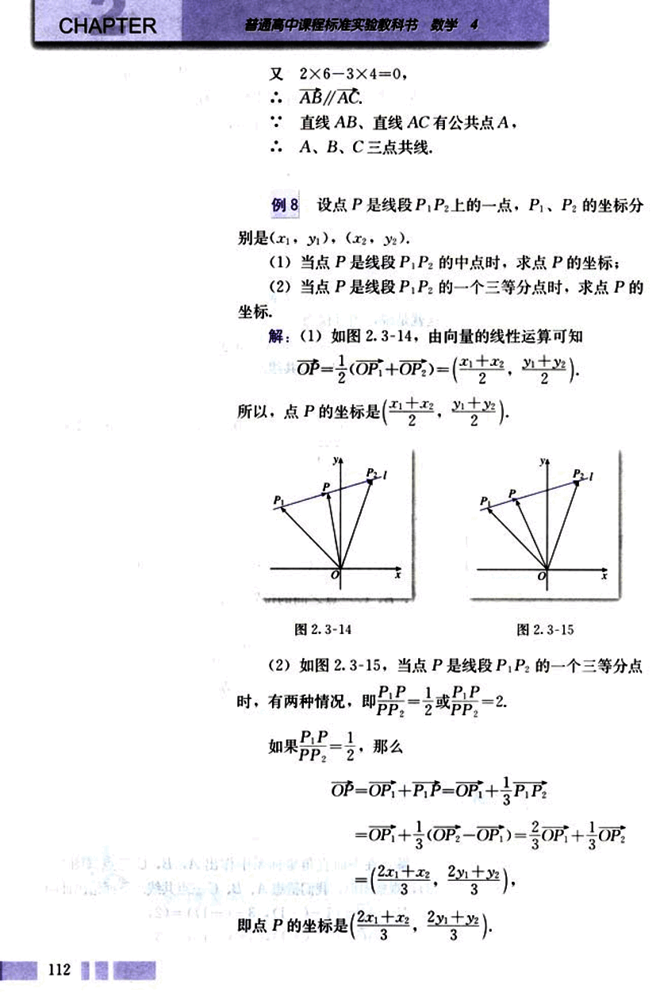
125

# 第二章 平面向量

## 探究

同理，如果 $\frac{P_1P}{PP_2} = 2$，那么点P的坐标是
$(\frac{x_1+2x_2}{3}, \frac{y_1+2y_2}{3})$.

如图2.3-16，当$\frac{P_1P}{PP_2} = \lambda$时，点P的坐标是什么？
[图2.3-16](images/2.3-16.png)

## 练习

1. 已知向量a、b的坐标，求a+b，a-b的坐标：
    (1) a=(-2, 4), b=(5, 2);
    (2) a=(4, 3), b=(-3, 8);
    (3) a=(2, 3), b=(-2, -3);
    (4) a=(3, 0), b=(0, 4).

2. 已知a=(3, 2), b=(0, -1), 求-2a+4b, 4a+3b的坐标.

3. 已知A、B两点的坐标，求$\overrightarrow{AB}$，$\overrightarrow{BA}$的坐标：
    (1) A(3, 5), B(6, 9);
    (2) A(-3, 4), B(6, 3);
    (3) A(0, 3), B(0, 5);
    (4) A(3, 0), B(8, 0).

4. 已知点A(0, 1), B(1, 0), C(1, 2), D(2, 1), 试判断$\overrightarrow{AB}$与$\overrightarrow{CD}$的位置关系，并给出证明.

5. 求线段AB的中点坐标：
    (1) A(2, 1) B(4, 3);
    (2) A(-1, 2), B(3, 6);
    (3) A(5, -4), B(3, -6).

6. 已知向量$\overrightarrow{OB}$=(2, 3), $\overrightarrow{OB}$=(6, -3), 点P是线段AB的三等分点，求点P的坐标.

7. 已知点P在线段AB的延长线上，且$|AP| = \frac{3}{2}|PB|$，求点P的坐标.

113

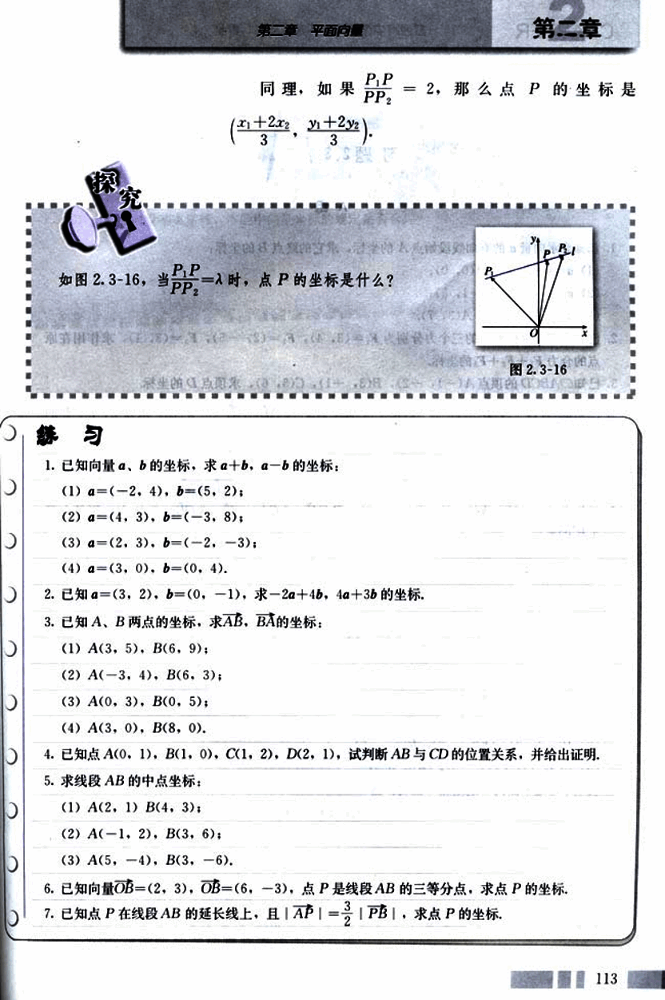
126

# 习题 2.3

## A 组

1. 已知表示向量的有向线段始点的坐标，求它的终点B的坐标：
    (1)  $\vec{a}$ = (-2, 1), A(0, 0);
    (2)  $\vec{a}$ = (1, 3), A(-1, 5);
    (3)  $\vec{a}$ = (-2, -5), A(3, 7).

2. 已知作用在坐标原点的三个力分别为 $F_1$ = (3, 4), $F_2$ = (2, -5), $F_3$ = (3, 1), 求作用在原点的合力 $F_1$ + $F_2$ + $F_3$ 的坐标.

3. 已知□ABCD 的顶点 A(-1, -2), B(3, -1), C(5, 6), 求顶点 D 的坐标.

4. 已知点 A(1, 1), B(-1, 5) 且 $\vec{AC} = \frac{1}{2}\vec{AB}$, $\vec{AD} = 2\vec{AB}$, $\vec{AE} = -\frac{1}{2}\vec{AB}$, 求点 C、D、E 的坐标.

5. x 为何值时，$\vec{a}$ = (2, 3) 与 $\vec{b}$ = (x, -6) 共线？

6. 已知 A(-2, -3), B(2, 1), C(1, 4), D(-7, -4), 试问 $\vec{AB}$ 与 $\vec{CD}$ 是否共线？

7. 已知点 O(0, 0), A(1, 2), B(-1, 3), 且 O'A' = 2OA, O'B' = 3OB, 求点 A'、B' 及向量 $\vec{A'B'}$ 的坐标.

## B 组

1. 已知点 O(0, 0), A(1, 2), B(4, 5), $\vec{OP} = \vec{OA} + \lambda \vec{AB}$. 当 $\lambda = 1, \frac{1}{2}, -2, 2$ 时，分别求点 P 的坐标.

2. 判断下列各点的位置关系，并给出证明：
    (1) A(1, 2), B(-3, -4), C(2, 3.5);
    (2) P(-1, 2), Q(0.5, 0), R(5, -6);
    (3) E(9, 1), F(1, -3), G(8, 0.5).

3. 设 $\vec{e_1}$, $\vec{e_2}$ 是平面内一组基底，证明：当 $\lambda_1 \vec{e_1} + \lambda_2 \vec{e_2} = \vec{0}$ 时，恒有 $\lambda_1 = \lambda_2 = 0$.

114

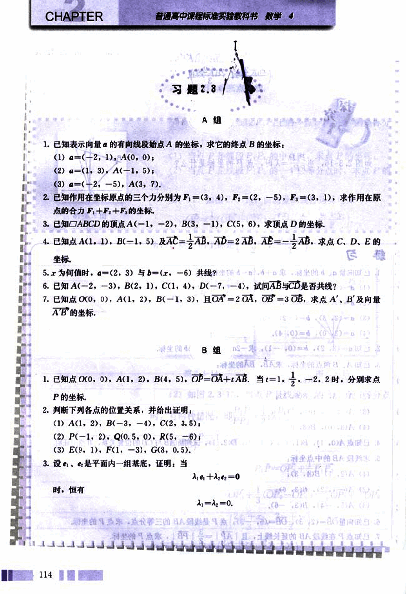
127

# 第二章 平面向量

## 4.

如图,设Ox、Oy是平面内相交成60°角的两条数轴, $e_1$、$e_2$分别是与x轴、y轴正方向同向的单位向量,若向量$\overrightarrow{OP} = xe_1 + ye_2$,则把有序数对(x,y)叫做向量$\overrightarrow{OP}$在坐标系xOy中的坐标,假设$\overrightarrow{OP} = 3e_1 + 2e_2$,

(1) 计算$|\overrightarrow{OP}|$的大小;

(2) 由平面向量基本定理,本题中向量坐标的规定是否合理?

[第4题](images/figure4.png)

115

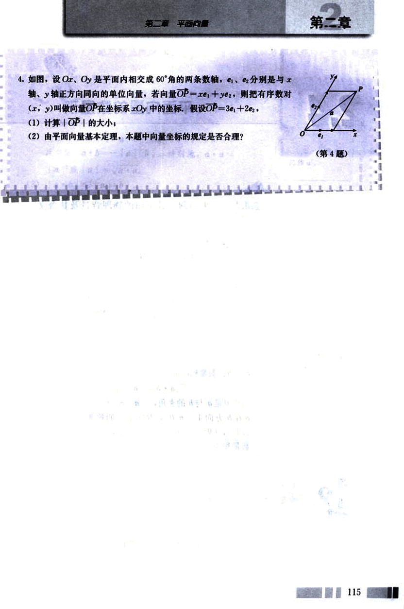
