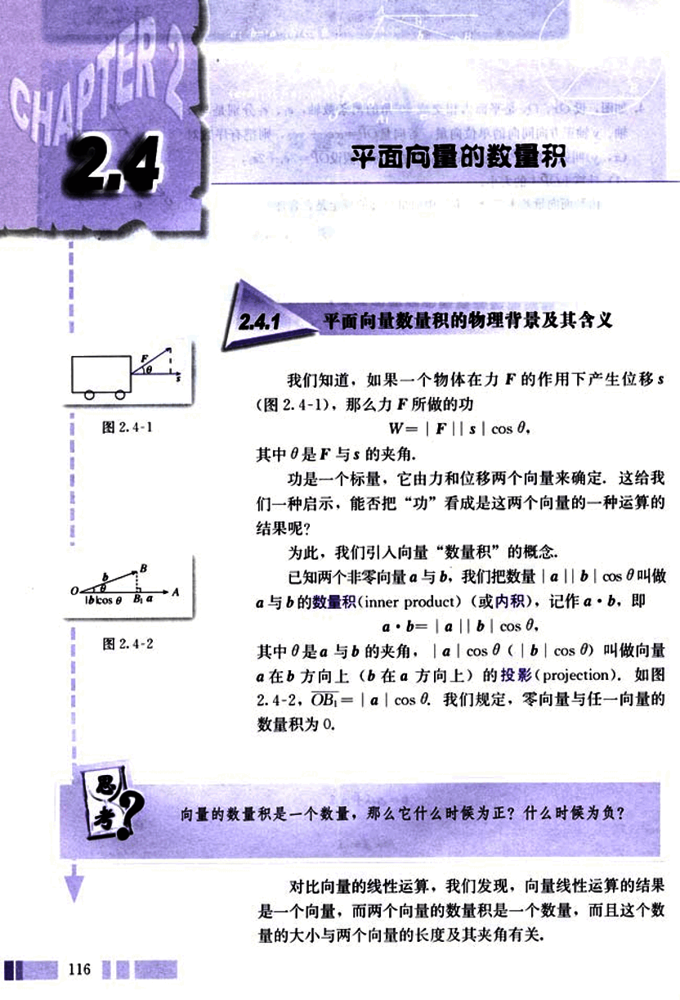
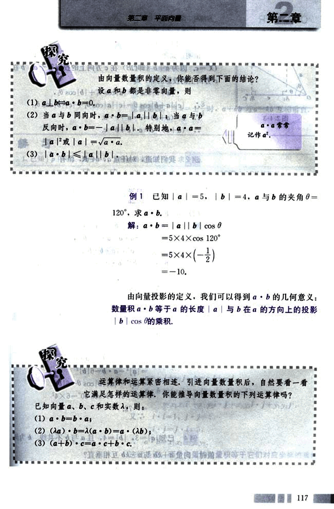
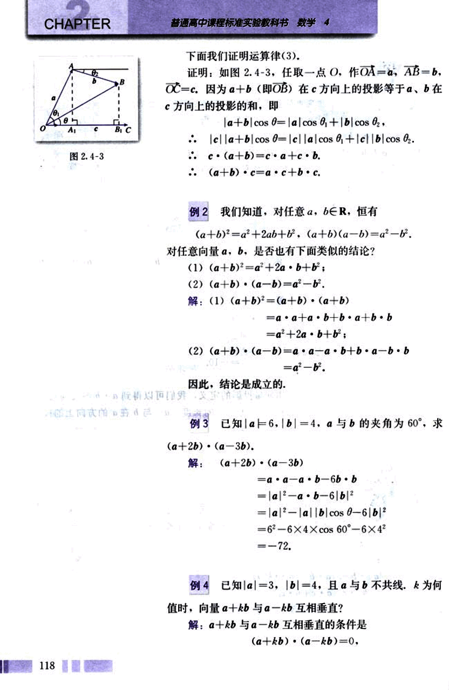
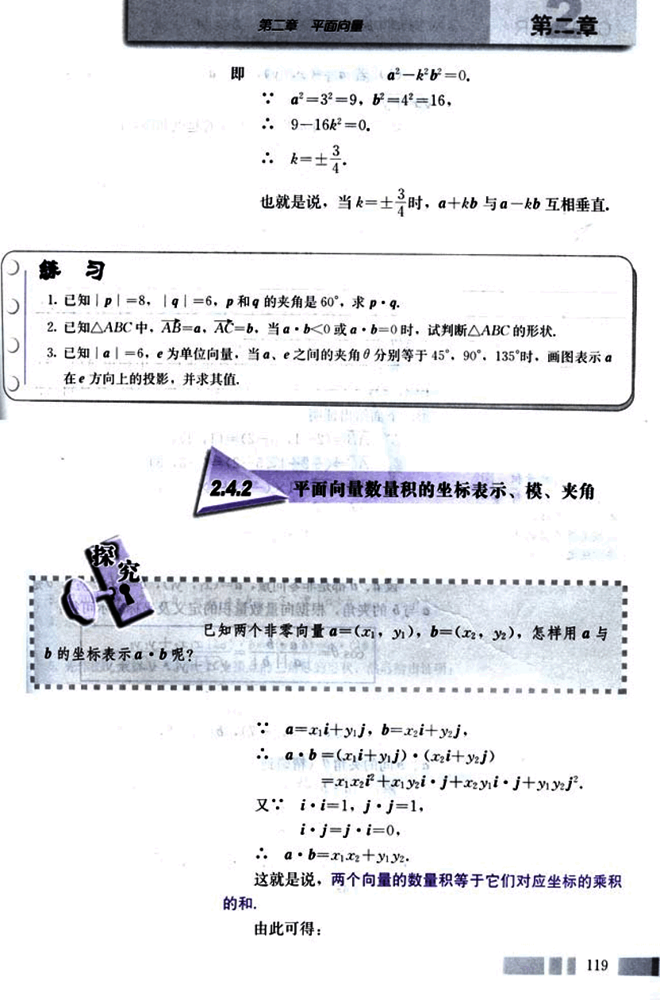
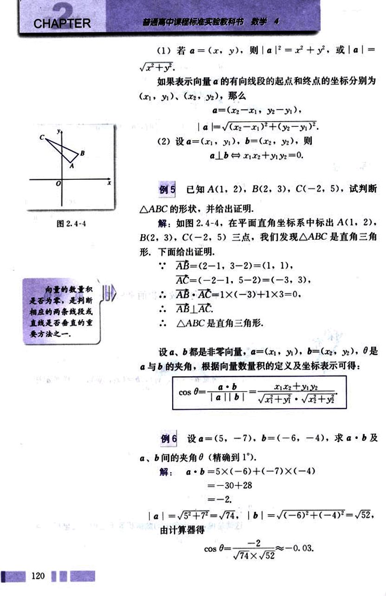
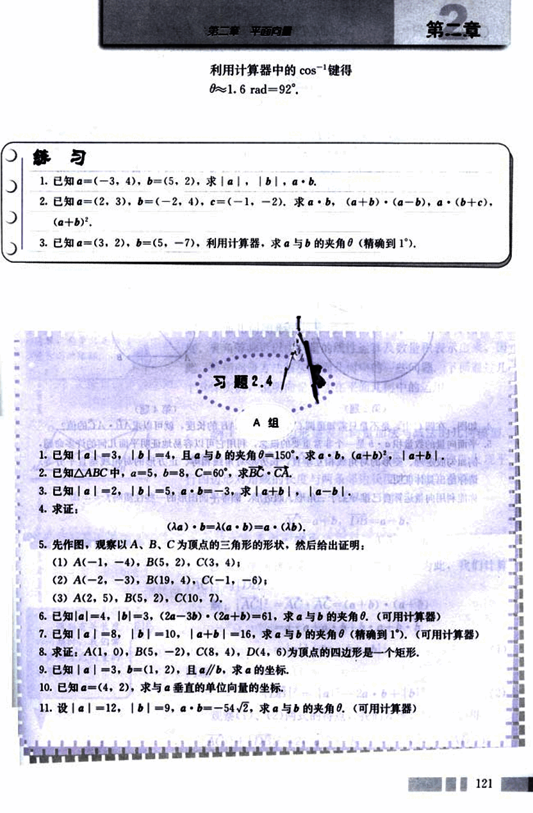
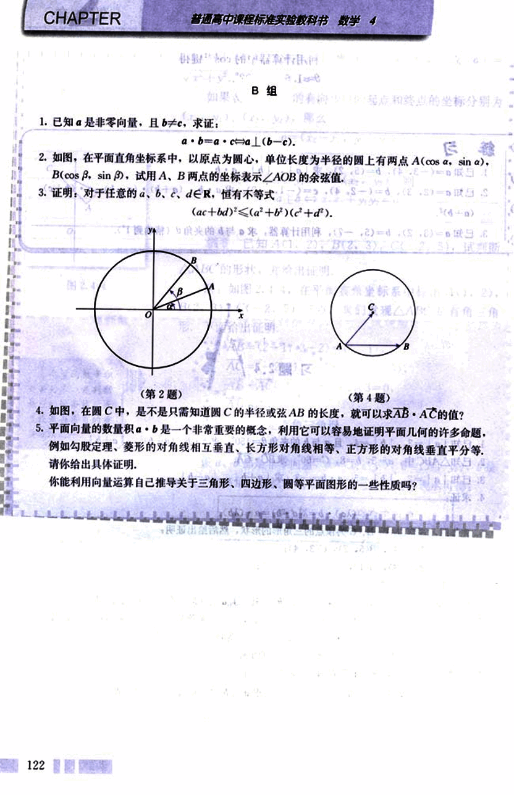

# 2.4　平面向量的数量积

128

# CHAPTER 2.4 平面向量的数量积

## 2.4.1 平面向量数量积的物理背景及其含义

我们知道，如果一个物体在力 $\bm{F}$ 的作用下产生位移 $\bm{s}$ (图 2.4-1)，那么力 $\bm{F}$ 所做的功
$W = |\bm{F}| |\bm{s}| \cos \theta,$

其中 $\theta$ 是 $\bm{F}$ 与 $\bm{s}$ 的夹角。

功是一个标量，它由力和位移两个向量来确定，这给我们一种启示，能否把“功”看成是这两个向量的一种运算的结果呢？

为此，我们引入向量“数量积”的概念，

已知两个非零向量 $\bm{a}$ 与 $\bm{b}$，我们把数量 $|\bm{a}| |\bm{b}| \cos \theta$ 叫做 $\bm{a}$ 与 $\bm{b}$ 的数量积 (inner product) (或内积)，记作 $\bm{a} \cdot \bm{b}$，即

$\bm{a} \cdot \bm{b} = |\bm{a}| |\bm{b}| \cos \theta,$

其中 $\theta$ 是 $\bm{a}$ 与 $\bm{b}$ 的夹角。$|\bm{a}| \cos \theta$ ($|\bm{b}| \cos \theta$) 叫做向量 $\bm{a}$ 在 $\bm{b}$ 方向上 ($\bm{b}$ 在 $\bm{a}$ 方向上) 的投影 (projection)。如图 2.4-2，$OB = |\bm{a}| \cos \theta$。我们规定，零向量与任一向量的数量积为 0。

向量的数量积是一个数量，那么它什么时候为正？什么时候为负？

对比向量的线性运算，我们发现，向量线性运算的结果是一个向量，而两个向量的数量积是一个数量，而且这个数量的大小与两个向量的长度及其夹角有关，

[图2.4-1](images/2.4-1.png)
[图2.4-2](images/2.4-2.png)

129

# 第二章 平面向量

## 探究

由向量数量积的定义，你能否得到下面的结论？

设$\vec{a}$和$\vec{b}$都是非零向量，则

(1) $\vec{a} \perp \vec{b} \Leftrightarrow \vec{a} \cdot \vec{b} = 0$

(2) 当$\vec{a}$与$\vec{b}$同向时，$\vec{a} \cdot \vec{b} = |\vec{a}| |\vec{b}|$；当$\vec{a}$与$\vec{b}$反向时，$\vec{a} \cdot \vec{b} = -|\vec{a}| |\vec{b}|$。特别地，$\vec{a} \cdot \vec{a} = |\vec{a}|^2$或$|\vec{a}| = \sqrt{\vec{a} \cdot \vec{a}}$

(3) $|\vec{a} \cdot \vec{b}| \le |\vec{a}| |\vec{b}|$

## 例1

已知$|\vec{a}| = 5$，$|\vec{b}| = 4$，$\vec{a}$与$\vec{b}$的夹角$\theta = 120^\circ$，求$\vec{a} \cdot \vec{b}$。

解：$\vec{a} \cdot \vec{b} = |\vec{a}| |\vec{b}| \cos \theta$

$= 5 \times 4 \times \cos 120^\circ$

$= 5 \times 4 \times (-\frac{1}{2})$

$= -10$

由向量投影的定义，我们可以得到$\vec{a} \cdot \vec{b}$的几何意义：数量积$\vec{a} \cdot \vec{b}$等于$\vec{a}$的长度$|\vec{a}|$与$\vec{b}$在$\vec{a}$的方向上的投影$|\vec{b}| \cos \theta$的乘积。

## 探究

运算律和运算紧密相连，引进向量数量积后，自然要看一看它满足怎样的运算律。你能推导向量数量积的下列运算律吗？

已知向量$\vec{a}$，$\vec{b}$，$\vec{c}$和实数$\lambda$，则：

(1) $\vec{a} \cdot \vec{b} = \vec{b} \cdot \vec{a}$；

(2) $(\lambda \vec{a}) \cdot \vec{b} = \lambda (\vec{a} \cdot \vec{b}) = \vec{a} \cdot (\lambda \vec{b})$；

(3) $(\vec{a} + \vec{b}) \cdot \vec{c} = \vec{a} \cdot \vec{c} + \vec{b} \cdot \vec{c}$

117

130

# CHAPTER 2

普通高中课程标准实验教科书 数学 4

## 下面我们证明运算律(3).

证明:如图 2.4-3, 任取一点 O, 作 OA = a, AB = b, OC = c. 因为 a + b (即 OB) 在 c 方向上的投影等于 a, b 在 c 方向上的投影的和, 即

|a + b| cos θ = |a| cos θ₁ + |b| cos θ₂ ,

|c||a + b| cos θ = |c||a| cos θ₁ + |c||b| cos θ₂ .

∴ c · (a + b) = c · a + c · b .

∴ (a + b) · c = a · c + b · c .

## 例 2

我们知道, 对任意 a, b ∈ R, 恒有

(a + b)² = a² + 2ab + b²,  (a + b)(a - b) = a² - b².

对任意向量 a, b, 是否也有下面类似的结论?

(1) (a + b)² = a² + 2a · b + b²;

(2) (a + b) · (a - b) = a² - b².

解: (1) (a + b)² = (a + b) · (a + b)

= a · a + a · b + b · a + b · b

= a² + 2a · b + b²;

(2) (a + b) · (a - b) = a · a - a · b + b · a - b · b

= a² - b².

因此, 结论是成立的.

## 例 3

已知 |a| = 6, |b| = 4, a 与 b 的夹角为 60°, 求

(a + 2b) · (a - 3b).

解: (a + 2b) · (a - 3b)

= a · a - a · b - 6b · b

= |a|² - a · b - 6|b|²

= |a|² - |a||b| cos θ - 6|b|²

= 6² - 6 × 4 × cos 60° - 6 × 4²

= -72.

## 例 4

已知 |a| = 3, |b| = 4, 且 a 与 b 不共线. k 为何值时, 向量 a + kb 与 a - kb 互相垂直?

解: a + kb 与 a - kb 互相垂直的条件是

(a + kb) · (a - kb) = 0.

131

# 第二章 平面向量

## 即
$a^2 - k^2b^2 = 0.$
$a^2 = 3^2 = 9, b^2 = 4^2 = 16,$
$9 - 16k^2 = 0.$
$k = \pm \frac{3}{4}$

也就是说，当$k = \pm \frac{3}{4}$时，$a + kb$与$a - kb$互相垂直.

## 练习
1. 已知$|p| = 8$, $|q| = 6$, $p$和$q$的夹角是$60^\circ$，求$p \cdot q$.
2. 已知$\triangle ABC$中，$AB = a$，$AC = b$。当$a \cdot b < 0$或$a \cdot b = 0$时，试判断$\triangle ABC$的形状.
3. 已知$|a| = 6$, $e$为单位向量，当$a$，$e$之间的夹角$\theta$分别等于$45^\circ$，$90^\circ$，$135^\circ$时，画图表示$a$在$e$方向上的投影，并求其值.

## 2.4.2 平面向量数量积的坐标表示、模、夹角

已知两个非零向量$a = (x_1, y_1)$，$b = (x_2, y_2)$，怎样用$a$与$b$的坐标表示$a \cdot b$呢？

$a = x_1i + y_1j$, $b = x_2i + y_2j$,
$a \cdot b = (x_1i + y_1j) \cdot (x_2i + y_2j)$
$= x_1x_2i \cdot i + x_1y_2i \cdot j + x_2y_1j \cdot i + y_1y_2j \cdot j$.

又∵$i \cdot i = 1$, $j \cdot j = 1$,
$i \cdot j = j \cdot i = 0$,

$a \cdot b = x_1x_2 + y_1y_2$.

这就是说，两个向量的数量积等于它们对应坐标的乘积的和.

由此可得：

119

132

# CHAPTER 2

## (1)

若 $a=(x, y)$，则 $|a|^2 = x^2 + y^2$，或 $|a| = \sqrt{x^2 + y^2}$。

如果表示向量 $\vec{a}$ 的有向线段的起点和终点的坐标分别为 $(x_1, y_1)$、$(x_2, y_2)$，那么

$\vec{a} = (x_2 - x_1, y_2 - y_1)$，

$|a| = \sqrt{(x_2 - x_1)^2 + (y_2 - y_1)^2}$。

## (2)

设 $a = (x_1, y_1)$，$b = (x_2, y_2)$，则

$a \perp b \Leftrightarrow x_1x_2 + y_1y_2 = 0$。

## 例 5

已知 A(1, 2), B(2, 3), C(-2, 5), 试判断 △ABC 的形状，并给出证明。

解：如图 2.4-4，在平面直角坐标系中标出 A(1, 2), B(2, 3), C(-2, 5) 三点，我们发现 △ABC 是直角三角形，下面给出证明。

$\vec{AB} = (2 - 1, 3 - 2) = (1, 1)$，

$\vec{AC} = (-2 - 1, 5 - 2) = (-3, 3)$，

$\vec{AB} \cdot \vec{AC} = 1 \times (-3) + 1 \times 3 = 0$，

$\therefore \vec{AB} \perp \vec{AC}$。

$\therefore$ △ABC 是直角三角形。

设 $a$、$b$ 都是非零向量，$a = (x_1, y_1)$，$b = (x_2, y_2)$，$\theta$ 是 $a$ 与 $b$ 的夹角，根据向量数量积的定义及坐标表示可得：

$\cos \theta = \frac{a \cdot b}{|a||b|} = \frac{x_1x_2 + y_1y_2}{\sqrt{x_1^2 + y_1^2} \cdot \sqrt{x_2^2 + y_2^2}}$

## 例 6

设 $a = (5, -7)$，$b = (-6, -4)$，求 $a \cdot b$ 及 $a$、$b$ 的夹角 $\theta$(精确到 1°)。

解：

$a \cdot b = 5 \times (-6) + (-7) \times (-4)$

$= -30 + 28$

$= -2$。

$|a| = \sqrt{5^2 + (-7)^2} = \sqrt{74}$，$|b| = \sqrt{(-6)^2 + (-4)^2} = \sqrt{52}$。

由计算器得

$\cos \theta = \frac{-2}{\sqrt{74} \times \sqrt{52}} \approx -0.03$。

120

133

# 第二章 平面向量

利用计算器中的cos⁻¹键得
θ≈1.6 rad = 92°.

## 练习

1. 已知a = (-3, 4), b = (5, 2), 求|a|, |b|, a·b.
2. 已知a = (2, 3), b = (-2, 4), c = (-1, -2), 求a·b, (a+b)·(a-b), a·(b+c), (a+b)².
3. 已知a = (3, 2), b = (5, -7), 利用计算器, 求a与b的夹角θ(精确到1°).

## 习题 2.4

1. 已知|a| = 3, |b| = 4, 且a与b的夹角θ = 150°, 求a·b, (a+b)², |a+b|.
2. 已知△ABC中, |a| = 5, |b| = 8, C = 60°, 求BC·CA.
3. 已知|a| = 2, |b| = 5, a·b = -3, 求|a+b|, |a-b|.
4. 求证:
(λα)·b = λ(a·b) = a·(λb).

5. 先作图, 观察以A, B, C为顶点的三角形的形状, 然后给出证明:
(1) A(-1, -4), B(5, 2), C(3, 4);
(2) A(-2, -3), B(19, 4), C(-1, -6);
(3) A(2, 5), B(5, 2), C(10, 7).

6. 已知|a| = 4, |b| = 3, (2a - 3b)·(2a + b) = 61, 求a与b的夹角θ.(可用计算器)
7. 已知|a| = 8, |b| = 10, |a + b| = 16, 求a与b的夹角θ(精确到1°).(可用计算器)
8. 求证: A(1, 0), B(5, -2), C(8, 4), D(4, 6)为顶点的四边形是一个矩形.
9. 已知|a| = 3, b = (1, 2), 且a//b, 求a的坐标.
10. 已知a = (4, 2), 求与a垂直的单位向量的坐标.
11. 设|a| = 12, |b| = 9, a·b = -54√2, 求a与b的夹角θ.(可用计算器)

121

134

# CHAPTER

普通高中课程标准实验教科书 数学 4

## B组

1. 已知$\vec{a}$是非零向量，且$\vec{b} \ne \vec{c}$，求证：
$\vec{a} \cdot \vec{b} = \vec{a} \cdot \vec{c} \Leftrightarrow \vec{a} \parallel (\vec{b} - \vec{c})$

2. 如图，在平面直角坐标系中，以原点为圆心，单位长度为半径的圆上有两点A(cos α, sin α), B(cos β, sin β)，试用A、B两点的坐标表示∠AOB的余弦值。

3. 证明：对于任意的a，b，c，d∈R，恒有不等式
$(ac+bd)^2 \le (a^2+b^2)(c^2+d^2)$.

[图1](images/图1.png)

(第2题)

(第4题)

4. 如图，在圆C中，是不是只需知道圆C的半径或弦AB的长度，就可以求∠ABC·AC的值？

5. 平面向量的数量积$\vec{a} \cdot \vec{b}$是一个非常重要的概念，利用它可以容易地证明平面几何的许多命题，例如勾股定理、菱形的对角线相互垂直、长方形对角线相等、正方形的对角线垂直平分等。请你给出具体证明。

你能利用向量运算自己推导关于三角形、四边形、圆等平面图形的一些性质吗？

122

