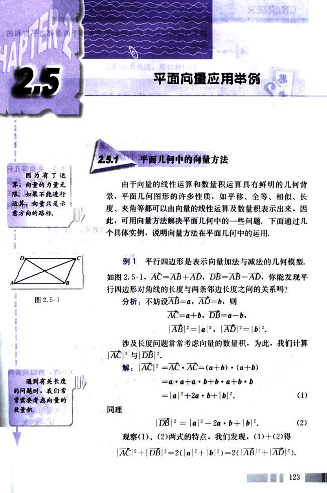
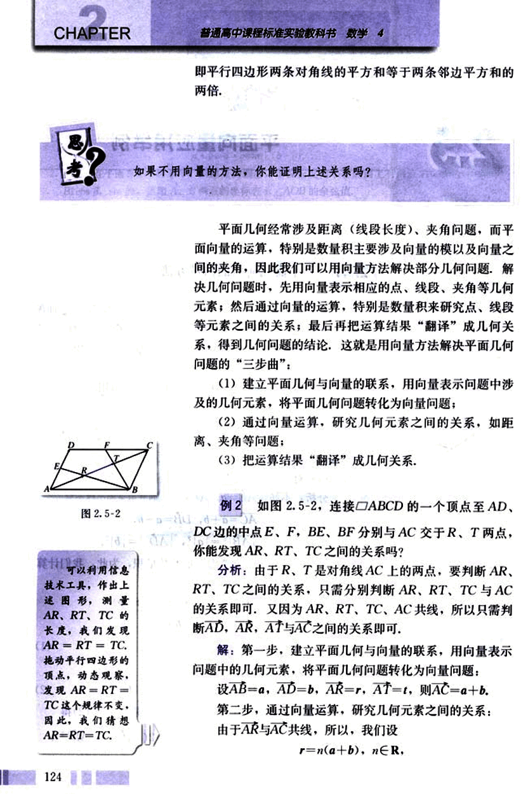
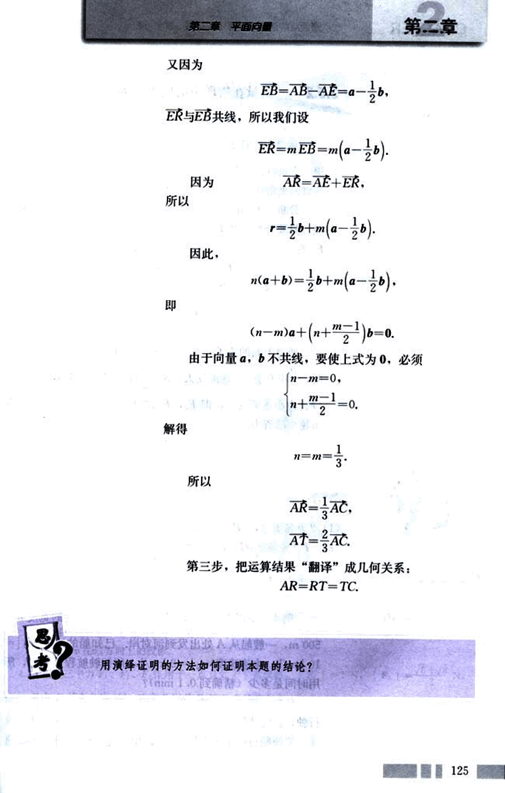
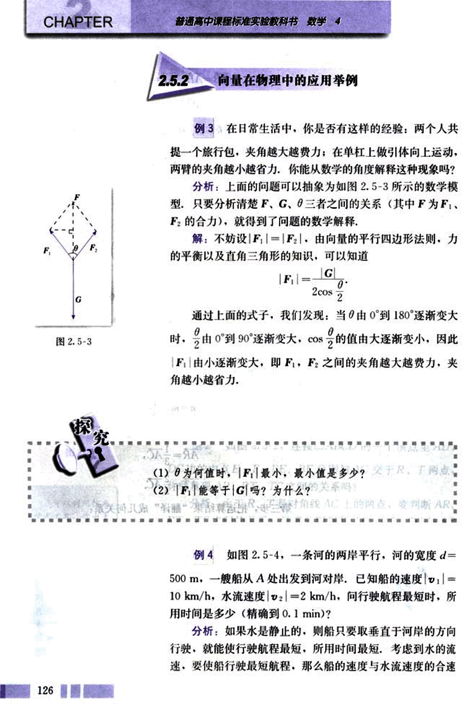
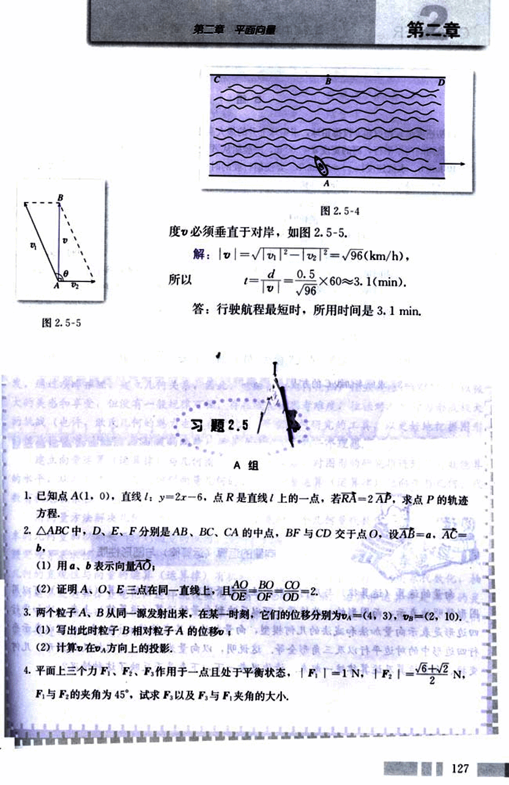
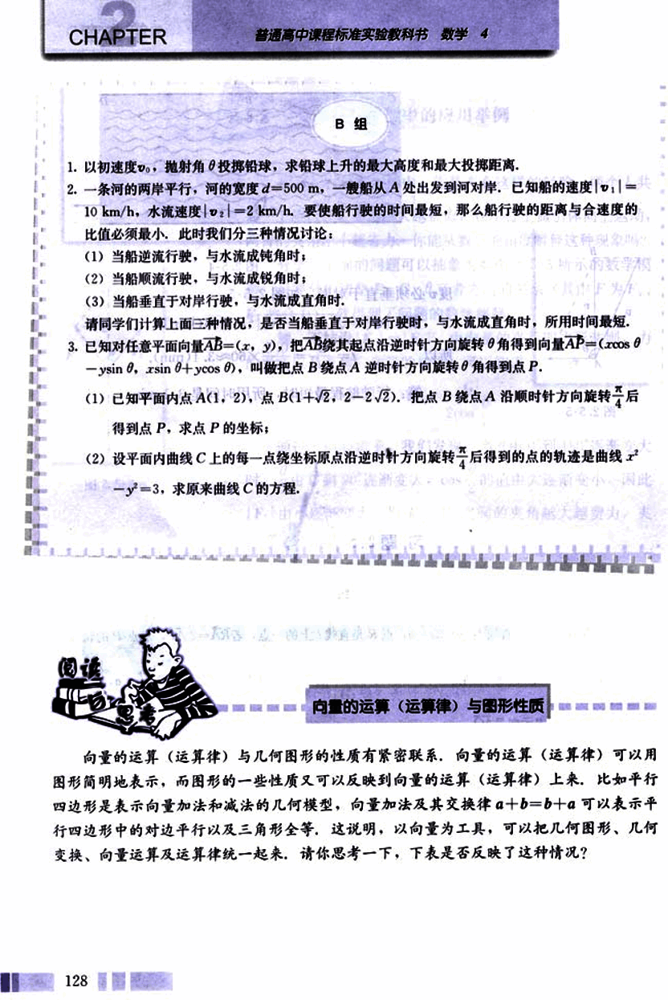
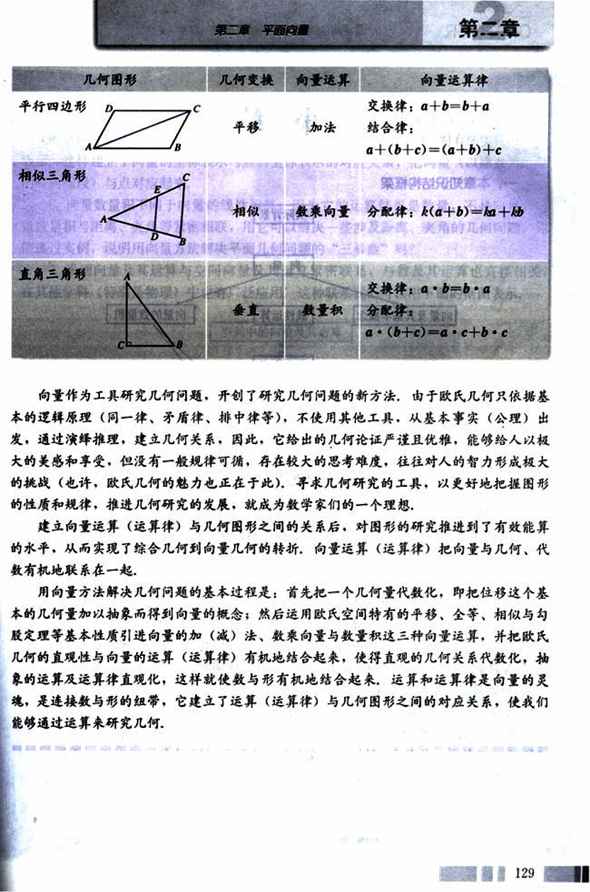

# 2.5　平面向量应用举例

135

# 2.5 平面向量应用举例

## 2.5.1 平面几何中的向量方法

由于向量的线性运算和数量积运算具有鲜明的几何背景，平面几何图形的许多性质，如平移、全等、相似、长度、夹角等都可以由向量的线性运算及数量积表示出来，因此，可用向量方法解决平面几何中的一些问题。下面通过几个具体实例，说明向量方法在平面几何中的运用。

**例1** 平行四边形是表示向量加法与减法的几何模型。

如图 2.5-1，$AC = AB + AD$，$DB = AB - AD$，你能发现平行四边形对角线的长度与两条邻边长度之间的关系吗？

**分析:** 不妨设 $AB = \vec{a}$，$AD = \vec{b}$。则

$AC = \vec{a} + \vec{b}$，$DB = \vec{a} - \vec{b}$。

$|AB|^2 = |\vec{a}|^2$，$|AD|^2 = |\vec{b}|^2$。

涉及长度问题常常考虑向量的数量积，为此，我们计算 $|AC|^2$ 与 $|DB|^2$。

**解:** $|AC|^2 = AC \cdot AC = (\vec{a} + \vec{b}) \cdot (\vec{a} + \vec{b})$

$= \vec{a} \cdot \vec{a} + \vec{a} \cdot \vec{b} + \vec{b} \cdot \vec{a} + \vec{b} \cdot \vec{b}$

$= |\vec{a}|^2 + 2\vec{a} \cdot \vec{b} + |\vec{b}|^2$。 (1)

**同理**

$|DB|^2 = |\vec{a}|^2 - 2\vec{a} \cdot \vec{b} + |\vec{b}|^2$。 (2)

观察 (1)、(2) 两式的特点，我们发现，(1) + (2) 得

$|AC|^2 + |DB|^2 = 2(|\vec{a}|^2 + |\vec{b}|^2) = 2(|AB|^2 + |AD|^2)$。

123

136

# CHAPTER

普通高中课程标准实验教科书 数学 4

即平行四边形两条对角线的平方和等于两条邻边平方和的两倍。

?
如果不用向量的方法，你能证明上述关系吗？

思考

平面几何经常涉及距离（线段长度）、夹角问题，而平面向量的运算，特别是数量积主要涉及向量的模以及向量之间的夹角，因此我们可以用向量方法解决部分几何问题。解决几何问题时，先用向量表示相应的点、线段、夹角等几何元素；然后通过向量的运算，特别是数量积来研究点、线段等元素之间的关系；最后再把运算结果“翻译”成几何关系，得到几何问题的结论。这就是用向量方法解决平面几何问题的“三步曲”：

(1) 建立平面几何与向量的联系，用向量表示问题中涉及的几何元素，将平面几何问题转化为向量问题；

(2) 通过向量运算，研究几何元素之间的关系，如距离、夹角等问题；

(3) 把运算结果“翻译”成几何关系。

## 例 2

如图 2.5-2，连接▱ABCD的一个顶点至AD、DC边的中点E、F，BE、BF分别与AC交于R、T两点，你能发现AR、RT、TC之间的关系吗？

**分析：**由于R、T是对角线AC上的两点，要判断AR、RT、TC之间的关系，只需分别判断AR、RT、TC与AC的关系即可。又因为AR、RT、TC、AC共线，所以只需判断AD，AR，AT与AC之间的关系即可。

**解：**第一步，建立平面几何与向量的联系，用向量表示问题中的几何元素，将平面几何问题转化为向量问题：

设AB = a，AD = b，AR = r，AT = t，则AC = a + b。

第二步，通过向量运算，研究几何元素之间的关系：

由于AR与AC共线，所以，我们设

r = n(a + b),  n∈R.

[图2.5-2](images/2.5-2.png)

124

137

# 第二章 平面向量

## 第二章

又因为  
$\overline{EB} = \overline{AB} - \overline{AE} = a - \frac{1}{2}b$.

ER与EB共线，所以我们设  
$\overline{ER} = m\overline{EB} = m(a - \frac{1}{2}b)$.

因为  
$\overline{AR} = \overline{AE} + \overline{ER}$.

所以  
$r = \frac{1}{2}b + m(a - \frac{1}{2}b)$.

因此，  
$n(a + b) = \frac{1}{2}b + m(a - \frac{1}{2}b)$.

即  
$(n - m)a + (n + \frac{m-1}{2})b = 0$.

由于向量a, b不共线，要使上式为0，必须
$\begin{cases} n - m = 0 \\ n + \frac{m - 1}{2} = 0 \end{cases}$.

解得  
$n = m = \frac{1}{3}$.

所以  
$\overline{AR} = \frac{1}{3}\overline{AC}$,  
$\overline{AT} = \frac{2}{3}\overline{AC}$.

第三步，把运算结果“翻译”成几何关系：  
$\overline{AR} = \overline{RT} = \overline{TC}$.

用演绎证明的方法如何证明本题的结论？

125

138

# CHAPTER

## 2.5.2 向量在物理中的应用举例

例3 在日常生活中，你是否有这样的经验：两个人共提一个旅行包，夹角越大越费力；在单杠上做引体向上运动，两臂的夹角越小越省力，你能从数学的角度解释这种现象吗？

分析：上面的问题可以抽象为如图2.5-3所示的数学模型，只要分析清楚 $\vec{F}$，$\vec{G}$，$\vec{\theta}$ 三者之间的关系（其中 $\vec{F}$ 为 $\vec{F_1}$，$\vec{F_2}$ 的合力），就得到了问题的数学解释。

解：不妨设 $|F_1| = |F_2|$，由向量的平行四边形法则，力的平衡以及直角三角形的知识，可以知道

$|F| = \frac{|G|}{2cos\frac{\theta}{2}}$

通过上面的式子，我们发现：当 $\theta$ 由 0° 到 180° 逐渐变大时，$\frac{\theta}{2}$ 由 0° 到 90° 逐渐变大，$cos\frac{\theta}{2}$ 的值由大逐渐变小，因此 $|F|$ 由小逐渐变大，即 $F_1$，$F_2$ 之间的夹角越大越费力，夹角越小越省力。

[图2.5-3](images/2.5-3.png)

(1) $\theta$ 为何值时，$|F|$ 最小，最小值是多少？

(2) $|F|$ 能等于 $|G|$ 吗？为什么？

例4 如图 2.5-4，一条河的两岸平行，河的宽度 $d = 500 m$。一艘船从 A 处出发到河对岸，已知船的速度 $|v_1| = 10 km/h$，水流速度 $|v_2| = 2 km/h$，问行驶航程最短时，所用时间是多少（精确到 0.1 min）？

分析：如果水是静止的，则船只要取垂直于河岸的方向行驶，就能使行驶航程最短，所用时间最短。考虑到水的流速，要使船行驶最短航程，那么船的速度与水流速度的合速度…

139

# 第二章 平面向量

## 第二章

度必须垂直于对岸，如图2.5-5.

解：$|v| = \sqrt{v_1^2 - v_2^2} = \sqrt{96} (km/h)$，

所以

$t = \frac{d}{|v|} = \frac{0.5}{\sqrt{96}} \times 60 \approx 3.1 (min)$.

答：行驶航程最短时，所用时间是3.1 min.

## 习题2.5

**A组**

1. 已知点A(1, 0), 直线l: y=2x-6, 点R是直线l上的一点，若RA=2AP，求点P的轨迹方程.

2. △ABC中，D、E、F分别是AB、BC、CA的中点，BF与CD交于点O，设AB=a，AC=b，

(1) 用a，b表示向量AO；

(2) 证明A、O、E三点在同一直线上，且$\frac{AO}{OE} = \frac{BO}{OF} = \frac{CO}{OD} = 2$.

3. 两个粒子A、B从同一源发射出来，在某一时刻，它们的位移分别为$\vec{v_A} = (4, 3)$，$\vec{v_B} = (2, 10)$，

(1) 写出此时粒子B相对粒子A的位移；

(2) 计算$\vec{v_B}$在$\vec{v_A}$方向上的投影.

4. 平面上三个力$F_1$、$F_2$、$F_3$作用于一点且处于平衡状态，$|F_1| = 1N$，$|F_2| = \frac{\sqrt{6} + \sqrt{2}}{2} N$，$F_1$与$F_2$的夹角为45°，试求$F_3$以及$F_3$与$F_1$夹角的大小.

140

# CHAPTER 2

普通高中课程标准实验教科书 数学 4

## B 组

1. 以初速度 $v_0$，抛射角 $\theta$ 投掷铅球，求铅球上升的最大高度和最大投掷距离。

2. 一条河的两岸平行，河的宽度 $d = 500 m$，一艘船从 A 处出发到河对岸，已知船的速度 $|v_1| = 10 km/h$，水流速度 $|v_2| = 2 km/h$。要使船行驶的时间最短，那么船行驶的距离与合速度的比值必须最小，此时我们分三种情况讨论：

(1) 当船逆流行驶，与水流成钝角时；

(2) 当船顺流行驶，与水流成锐角时；

(3) 当船垂直于对岸行驶，与水流成直角时。

请同学们计算上面三种情况，是否当船垂直于对岸行驶时，与水流成直角时，所用时间最短。

3. 已知对任意平面向量 $\vec{AB} = (x, y)$，把 $\vec{AB}$ 绕其起点沿逆时针方向旋转角 $\theta$ 得到向量 $\vec{AP} = (x \cos \theta - y \sin \theta, x \sin \theta + y \cos \theta)$，叫做把点 B 绕点 A 逆时针方向旋转角 $\theta$ 得到点 P。

(1) 已知平面内点 A(1, 2)，点 B(1 + $\sqrt{2}$, 2 - 2$\sqrt{2}$)。把点 B 绕点 A 沿顺时针方向旋转 $\frac{\pi}{4}$ 后得到点 P，求点 P 的坐标；

(2) 设平面内曲线 C 上的每一点绕坐标原点沿逆时针方向旋转 $\frac{\pi}{4}$ 后得到的点的轨迹是曲线 $x^2 - y^2 = 3$，求原来曲线 C 的方程。

## 向量的运算（运算律）与图形性质

向量的运算（运算律）与几何图形的性质有紧密联系。向量的运算（运算律）可以用图形简明地表示，而图形的一些性质又可以反映到向量的运算（运算律）上来，比如平行四边形是表示向量加法和减法的几何模型，向量加法及其交换律 $a + b = b + a$ 可以表示平行四边形中的对边平行以及三角形全等，这说明，以向量为工具，可以把几何图形、几何变换、向量运算及运算律统一起来，请你思考一下，下表是否反映了这种情况？

128

141

# 第二章 平面向量

## 几何图形  几何变换 向量运算 向量运算律

| 几何图形 | 几何变换 | 向量运算 | 向量运算律 |
|---|---|---|---|
| 平行四边形 [image](images/parallelogram.png) | 平移 | 加法 | 交换律: a+b=b+a   结合律: a+(b+c)=(a+b)+c |
| 相似三角形 [image](images/similar_triangle.png) | 相似 | 数乘 | 分配律: k(a+b)=ka+kb |
| 直角三角形 [image](images/right_triangle.png) | 垂直 | 数量积 | 交换律: a·b=b·a   分配律: a·(b+c)=a·b+a·c |

向量作为工具研究几何问题，开创了研究几何问题的新方法。由于欧氏几何只依据基本 的逻辑原理（同一律、矛盾律、排中律等），不使用其他工具，从基本事实（公理）出发， 通过演绎推理，建立几何关系，因此，它给出的几何论证严谨且优雅，能够给人以极大的美 感和享受，但没有一般规律可循，存在较大的思考难度，往往对人的智力形成极大的挑战 （也许，欧氏几何的魅力也正在于此）。寻求几何研究的工具，以更好地把握图形的性质 和规律，推进几何研究的发展，就成为数学家们的一个理想。

建立向量运算（运算律）与几何图形之间的关系后，对图形的研究推进到了有效能算的 水平，从而实现了综合几何到向量几何的转折。向量运算（运算律）把向量与几何、代数 有机地联系在一起。

用向量方法解决几何问题的基本过程是：首先把一个几何量代数化，即把位移这个基本 的几何量加以抽象而得到向量的概念；然后运用欧氏空间特有的平移、全等、相似与勾股 定理等基本性质引进向量的加（减）法、数乘向量与数量积这三种向量运算，并把欧氏 几何的直观性与向量的运算（运算律）有机地结合起来，使得直观的几何关系代数化，抽 象的运算及运算律直观化，这样就使数与形有机地结合起来。运算和运算律是向量的灵魂， 是连接数与形的纽带，它建立了运算（运算律）与几何图形之间的对应关系，使我们能够 通过运算来研究几何。

129

