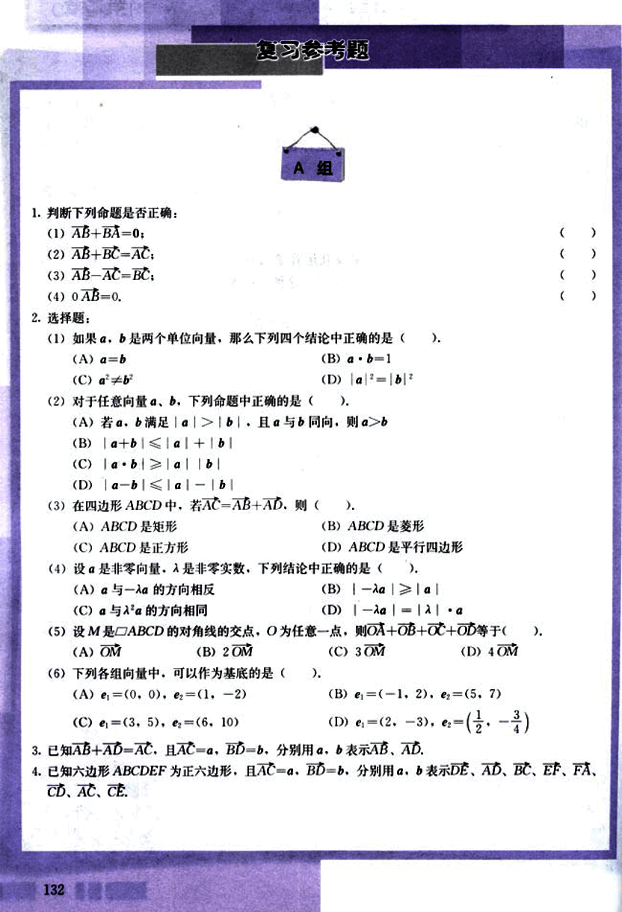
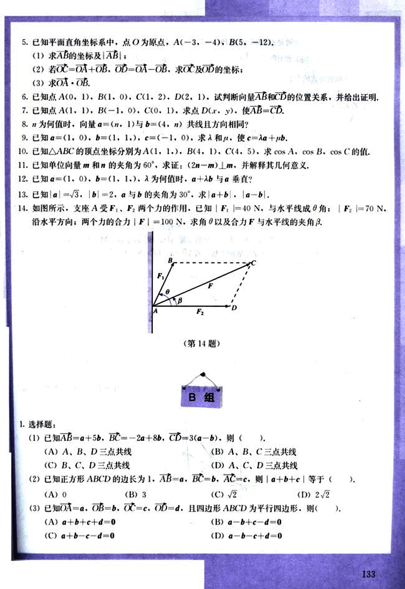
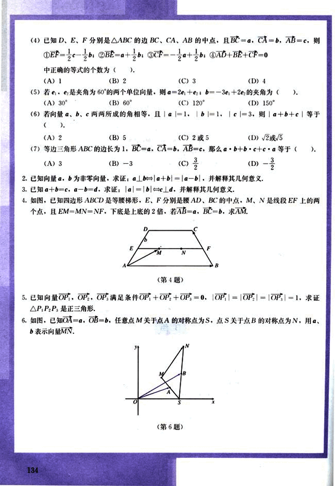
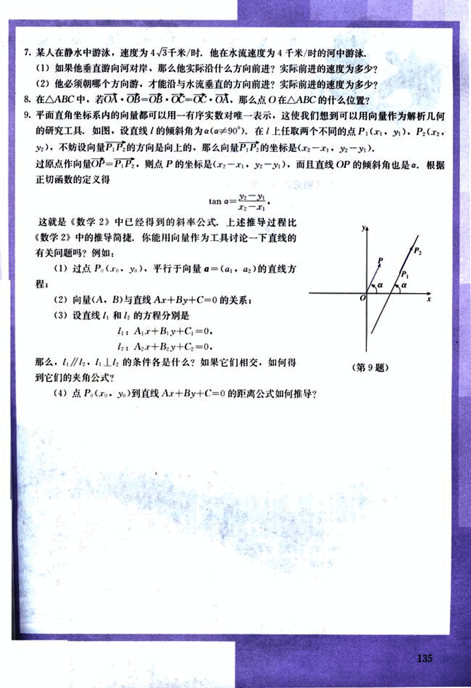

# 复习参考题

144

# 复习参考题

## A组

1. 判断下列命题是否正确:
(1) AB + BA = 0;
(2) AB + BC = AC;
(3) AB − AC = BC;
(4) 0 ⋅ AB = 0.

2. 选择题:

(1) 如果 a, b 是两个单位向量，那么下列四个结论中正确的是 (  ).
(A) a = b
(B) a ⋅ b = 1
(C) |a|² + |b|²
(D) |a| = |b|²

(2) 对于任意向量 a, b，下列命题中正确的是 (  ).
(A) 若 a, b 满足 |a| < |b|，且 a 与 b 同向，则 a > b
(B) |a + b| ≤ |a| + |b|
(C) |a ⋅ b| ≤ |a| |b|
(D) |a − b| ≥ ||a| − |b||

(3) 在四边形 ABCD 中，若 AC = AB + AD，则 (  ).
(A) ABCD 是矩形
(B) ABCD 是菱形
(C) ABCD 是正方形
(D) ABCD 是平行四边形

(4) 设 a 是非零向量，λ 是非零实数，下列结论中正确的是 (  ).
(A) a 与 −λa 的方向相反
(B) |−λa| ≥ |a|
(C) a 与 λa 的方向相同
(D) |−λa| = |λ| ⋅ |a|

(5) 设 M 是 ABCD 的对角线的交点，O 为任意一点，则 OA + OB + OC + OD 等于 (  ).
(A) OM
(B) 2OM
(C) 3OM
(D) 4OM

(6) 下列各组向量中，可以作为基底的是 (  ).
(A) e₁ = (0, 0), e₂ = (1, −2)
(B) e₁ = (−1, 2), e₂ = (5, 7)
(C) e₁ = (3, 5), e₂ = (6, 10)
(D) e₁ = (2, −3), e₂ = ($\frac{1}{2}$, $-\frac{3}{4}$)

3. 已知 AB + AD = AC，且 AC = a，BD = b，分别用 a, b 表示 AB，AD.

4. 已知六边形 ABCDEF 为正六边形，且 AC = a，BD = b，分别用 a, b 表示 DE，AD，BC，EF，FA，CD，AC，CE.

132

145

# 已知平面直角坐标系中，点O为原点，A(-3,-4)，B(5,-12)

(1) 求$\vec{AB}$的坐标及$|AB|$；

(2) 若$\vec{OC} = \vec{OA} + \vec{OB}$，$\vec{OD} = \vec{OA} - \vec{OB}$，求$\vec{OC}$及$\vec{OD}$的坐标；

(3) 求$\vec{OA} \cdot \vec{OB}$。

# 已知点A(0,1)，B(1,0)，C(1,2)，D(2,1)，试判断向量$\vec{AB}$和$\vec{CD}$的位置关系，并给出证明。

# 已知点A(1,1)，B(-1,0)，C(0,1)，求点D(x,y)，使$\vec{AB} = \vec{CD}$。

# λ为何值时，向量$\vec{a} = (n, 1)$与$\vec{b} = (4, n)$共线且方向相同？

# 已知$\vec{a} = (1, 0)$，$\vec{b} = (1, 1)$，$\vec{c} = (-1, 0)$，求λ和μ，使$\vec{c} = \lambda\vec{a} + \mu\vec{b}$。

# 已知△ABC的顶点坐标分别为A(1,1)，B(4,1)，C(1,5)，求cosA，cosB，cosC的值。

# 已知单位向量$\vec{m}$和$\vec{n}$的夹角为60°，求证：(2$\vec{n}$ - $\vec{m}$)⊥$\vec{m}$，并解释其几何意义。

# 已知$\vec{a} = (1, 0)$，$\vec{b} = (1, 1)$，λ为何值时，$\vec{a} + \lambda\vec{b}$与$\vec{a}$垂直？

# 已知$|\vec{a}| = \sqrt{3}$，$|\vec{b}| = 2$，$\vec{a}$与$\vec{b}$的夹角为30°，求$|\vec{a} + \vec{b}|$，$|\vec{a} - \vec{b}|$。

# 如图所示，支座A受$F_1$、$F_2$两个力的作用，已知$|F_1| = 40N$，与水平线成θ角；$|F_2| = 70N$，沿水平方向；两个力的合力$|F| = 100N$，求角θ以及合力F与水平线的夹角β。
[image](images/14.png)

# **B组**

## 选择题：

(1) 已知$\vec{AB} = \vec{a} + 5\vec{b}$，$\vec{BC} = -2\vec{a} + 8\vec{b}$，$\vec{CD} = 3(\vec{a} - \vec{b})$，则( )。

(A) A，B，D三点共线  (B) A，B，C三点共线  (C) B，C，D三点共线  (D) A，C，D三点共线

(2) 已知正方形ABCD的边长为1，$\vec{AB} = \vec{a}$，$\vec{BC} = \vec{b}$，$\vec{AC} = \vec{c}$，则$|\vec{a} + \vec{b} + \vec{c}|$等于( )。

(A) 0  (B) 3  (C) $\sqrt{2}$  (D) $2\sqrt{2}$

(3) 已知$\vec{OA} = \vec{a}$，$\vec{OB} = \vec{b}$，$\vec{OC} = \vec{c}$，$\vec{OD} = \vec{d}$，且四边形ABCD为平行四边形，则( )。

(A) $\vec{a} + \vec{b} + \vec{c} + \vec{d} = 0$  (B) $\vec{a} - \vec{b} + \vec{c} - \vec{d} = 0$  (C) $\vec{a} + \vec{b} - \vec{c} - \vec{d} = 0$  (D) $\vec{a} - \vec{b} - \vec{c} + \vec{d} = 0$

133

146

# 数学题

(4)已知D、E、F分别是△ABC的边BC、CA、AB的中点，且BC=a，CA=b，AB=c，则
①EF = $\frac{1}{2}$c - $\frac{1}{2}$b；②BE = $\frac{1}{2}$a + $\frac{1}{2}$b；③CF = -$\frac{1}{2}$a + $\frac{1}{2}$b；④AD + BE + CF = 0
其中正确的等式的个数为( )。
(A) 1
(B) 2
(C) 3
(D) 4

(5)若$\vec{e_1}$，$\vec{e_2}$是夹角为60°的两个单位向量，则$\vec{a}$ = 2$\vec{e_1}$ + $\vec{e_2}$；$\vec{b}$ = -3$\vec{e_1}$ + 2$\vec{e_2}$的夹角为( )。
(A) 30°
(B) 60°
(C) 120°
(D) 150°

(6)若向量$\vec{a}$，$\vec{b}$，$\vec{c}$两两所成的角相等，且|$|\vec{a}$|| = 1，|$|\vec{b}$|| = 1，|$|\vec{c}$|| = 3，则|$|\vec{a}$ + $\vec{b}$ + $\vec{c}$||等于( )。
(A) 2
(B) 5
(C) 2或5
(D) $\sqrt{2}$或$\sqrt{5}$

(7)等边三角形ABC的边长为1，BC = $\vec{a}$，CA = $\vec{b}$，AB = $\vec{c}$，那么$\vec{a}$·$\vec{b}$ + $\vec{b}$·$\vec{c}$ + $\vec{c}$·$\vec{a}$等于( )。
(A) 3
(B) -3
(C) $\frac{3}{2}$
(D) -$\frac{3}{2}$

2. 已知向量$\vec{a}$，$\vec{b}$为非零向量，求证：$\vec{a}$⊥$\vec{b}$↔|$|\vec{a}$ + $\vec{b}$|| = |$|\vec{a}$ - $\vec{b}$||，并解释其几何意义。

3. 已知$\vec{a}$ + $\vec{b}$ = $\vec{c}$，$\vec{a}$ - $\vec{b}$ = $\vec{d}$，求证：|$|\vec{a}$|| = |$|\vec{b}$||↔$\vec{c}$⊥$\vec{d}$，并解释其几何意义。

4. 如图，已知四边形ABCD是等腰梯形，E、F分别是腰AD、BC的中点，M、N是线段EF上的两个点，且EM = MN = NF，下底是上底的2倍，若AB = $\vec{a}$，BC = $\vec{b}$，求$\vec{AM}$。

[image4](images/image4.png)

5. 已知向量$\vec{OP_1}$，$\vec{OP_2}$，$\vec{OP_3}$满足条件$\vec{OP_1}$ + $\vec{OP_2}$ + $\vec{OP_3}$ = $\vec{0}$，|$|\vec{OP_1}$|| = |$|\vec{OP_2}$|| = |$|\vec{OP_3}$|| = 1，求证△$P_1P_2P_3$是正三角形。

6. 如图，已知OA = $\vec{a}$，OB = $\vec{b}$，任意点M关于点A的对称点为S，点S关于点B的对称点为N，用$\vec{a}$，$\vec{b}$表示向量$\vec{MN}$。

[image6](images/image6.png)

134

147

# 7.某人在静水中游泳，速度为4√3千米/时，他在水流速度为4千米/时的河中游泳。

(1)如果他垂直游向河对岸，那么他实际沿什么方向前进？实际前进的速度为多少？

(2)他必须朝哪个方向游，才能沿与水流垂直的方向前进？实际前进的速度为多少？

# 8.在△ABC中，若$\vec{OA} \cdot \vec{OB} - \vec{OB} \cdot \vec{OC} = \vec{OC} \cdot \vec{OA}$，那么点O在△ABC的什么位置？

# 9.平面直角坐标系内的向量都可以用一个有序实数对唯一表示，这使我们想到可以用向量作为解析几何的研究工具。如图，设直线的倾斜角为α(α≠90°)，在上任取两个不同的点$P_1(x_1, y_1)$，$P_2(x_2, y_2)$，不妨设向量$\vec{P_1P_2}$的方向是向上的，那么向量$\vec{P_1P_2}$的坐标是($x_2 - x_1, y_2 - y_1$)。过原点作向量$\vec{OP} = \vec{P_1P_2}$，则点P的坐标是($x_2 - x_1, y_2 - y_1$)，而且直线OP的倾斜角也是α。根据正切函数的定义得：

$tan α = \frac{y_2 - y_1}{x_2 - x_1}$

这就是《数学2》中已经得到的斜率公式。上述推导过程比《数学2》中的推导简捷，你能用向量作为工具讨论一下直线的有关问题吗？例如：

(1)过点$P(x_0, y_0)$，平行于向量$\vec{a} = (a_1, a_2)$的直线方程；

(2)向量(A, B)与直线Ax + By + C = 0的关系；

(3)设直线$l_1$和$l_2$的方程分别是：

$l_1: Ax + By + C_1 = 0$

$l_2: Ax + By + C_2 = 0$

那么，$l_1 // l_2$，$l_1 ⊥ l_2$的条件各是什么？如果它们相交，如何得到它们的夹角公式？

(4)点$P(x_0, y_0)$到直线Ax + By + C = 0的距离公式如何推导？

(第9题)

135

