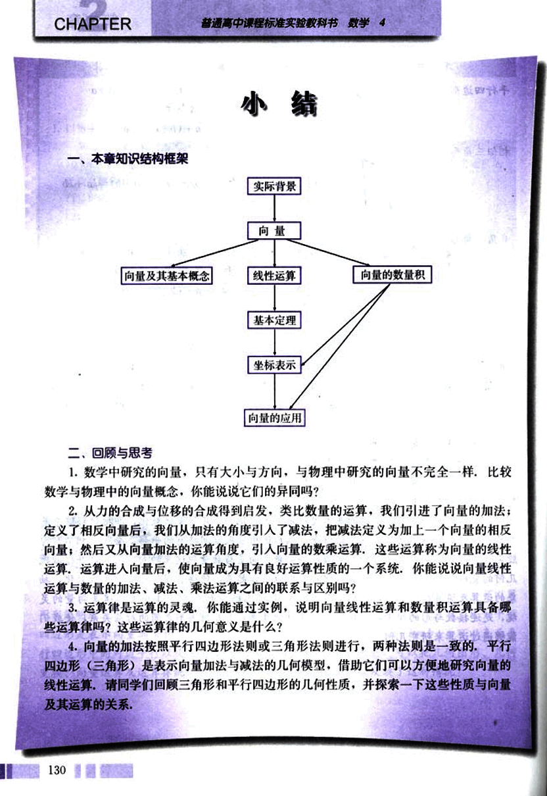
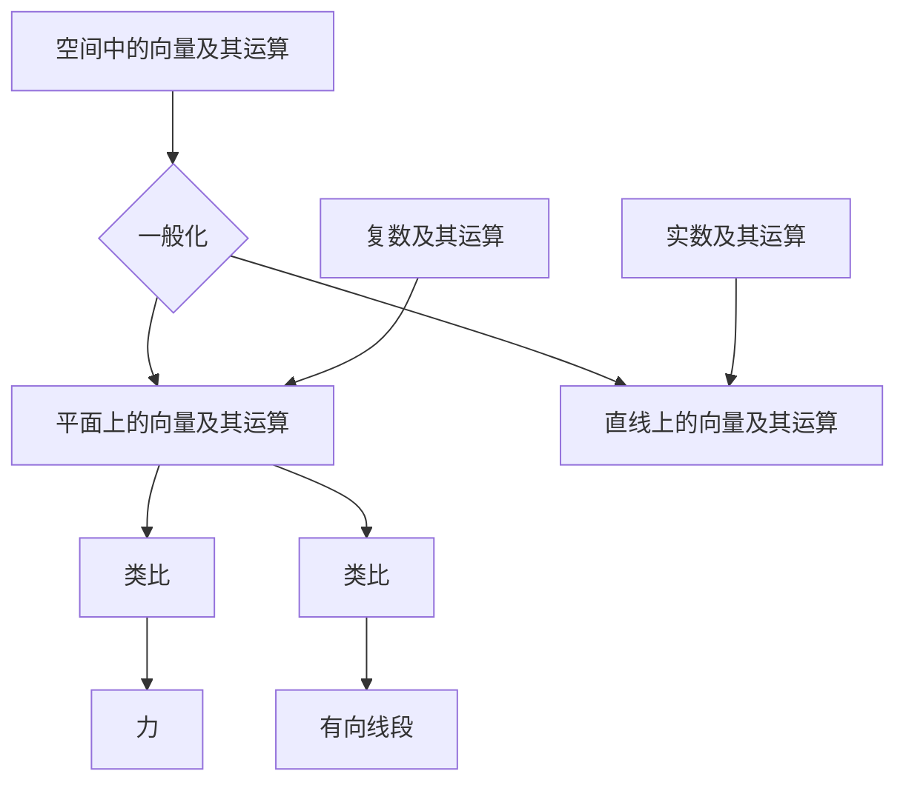
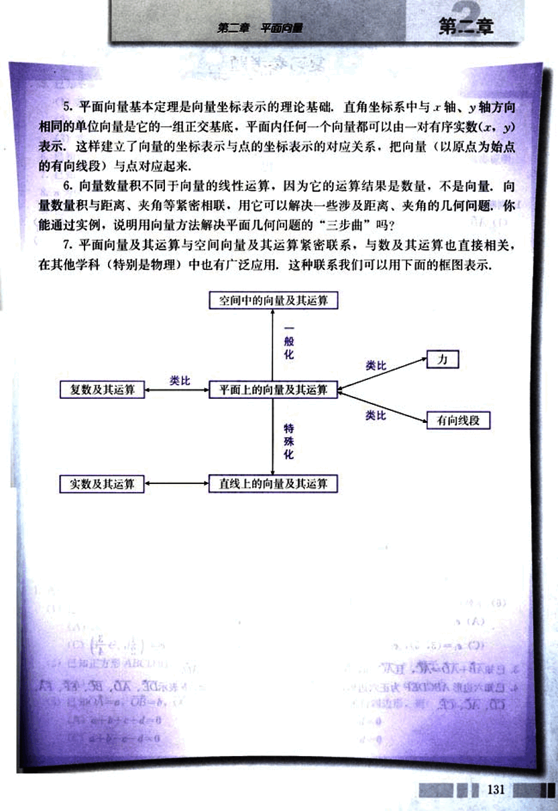

# 小结

142

# 小结

## 一、本章知识结构框架

```
实际背景
    向量
        向量及其基本概念
            线性运算
                基本定理
                    坐标表示
                        向量的应用
        向量的数量积

```

## 二、回顾与思考

1. 数学中研究的向量，只有大小与方向，与物理中研究的向量不完全一样，比较数学与物理中的向量概念，你能说说它们的异同吗？

2. 从力的合成与位移的合成得到启发，类比数量的运算，我们引进了向量的加法；定义了相反向量后，我们从加法的角度引入了减法，把减法定义为加上一个向量的相反向量；然后又从向量加法的运算角度，引入向量的数乘运算，这些运算称为向量的线性运算，运算进入向量后，使向量成为具有良好运算性质的一个系统，你能说说向量线性运算与数量的加法、减法、乘法运算之间的联系与区别吗？

3. 运算律是运算的灵魂，你能通过实例，说明向量线性运算和数量积运算具备哪些运算律吗？这些运算律的几何意义是什么？

4. 向量的加法按照平行四边形法则或三角形法则进行，两种法则是一致的，平行四边形（三角形）是表示向量加法与减法的几何模型，借助它们可以方便地研究向量的线性运算，请同学们回顾三角形和平行四边形的几何性质，并探索一下这些性质与向量及其运算的关系。

130


143

# 第二章 平面向量

5. 平面向量基本定理是向量坐标表示的理论基础，直角坐标系中与x轴、y轴方向相同的单位向量是它的一组正交基底，平面内任何一个向量都可以由一对有序实数(x, y)表示，这样建立了向量的坐标表示与点的坐标表示的对应关系，把向量（以原点为始点的有向线段）与点对应起来。

6. 向量数量积不同于向量的线性运算，因为它的运算结果是数量，不是向量，向量数量积与距离、夹角等紧密相联，用它可以解决一些涉及距离、夹角的几何问题。你能通过实例，说明用向量方法解决平面几何问题的“三步曲”吗？

7. 平面向量及其运算与空间向量及其运算紧密联系，与数及其运算也直接相关，在其他学科（特别是物理）中也有广泛应用，这种联系我们可以用下面的框图表示：

空间中的向量及其运算

131



