# 3.1　两角和与差的正弦、余弦和正切公式

150

# CHAPTER 3

## 3.1 两角和与差的正弦、余弦和正切公式

在章头图中，给出了这样一个问题：

某城市的电视发射塔建在市郊的一座小山上，如图 3.1-1 所示，小山高 BC 约为 30 米，在地平面上有一点 A，测得 A、C 两点间距离约为 67 米，从 A 观测电视发射塔的视角（∠CAD）约为 45°。求这座电视发射塔的高度。

设电视发射塔高 CD = x 米，∠CAB = α，则 $\sin \alpha = \frac{30}{67}$。

在 Rt△ABD 中，

$\tan(45° + \alpha) \approx \frac{x + 30}{60}$。

如果能由 $\sin \alpha = \frac{30}{67}$ 求得 $\tan(45° + \alpha)$ 的值，那么就会得到一个 x 的一元一次方程，由此解得电视发射塔的高就十分容易了。

能不能由 $\sin \alpha = \frac{30}{67}$ 求得 $\tan(45° + \alpha)$ 的值呢？或者说能不能用 $\sin \alpha$ 把 $\tan(45° + \alpha)$ 表示出来呢？

更一般地说，对于任意角 α，β，能不能用 α，β 的三角函数值把 α + β 或 α - β 的三角函数值表示出来呢？

下面我们来研究如何用任意角 α，β 的正弦、余弦值来表示 $\cos(\alpha - \beta)$ 的问题。

[图3.1-1](images/3.1-1.png)

有兴趣的同学也可以研究用任意角 α，β 的正弦、余弦值来表示 $\sin(\alpha + \beta)$ 或 $\cos(\alpha + \beta)$ 的问题。

138

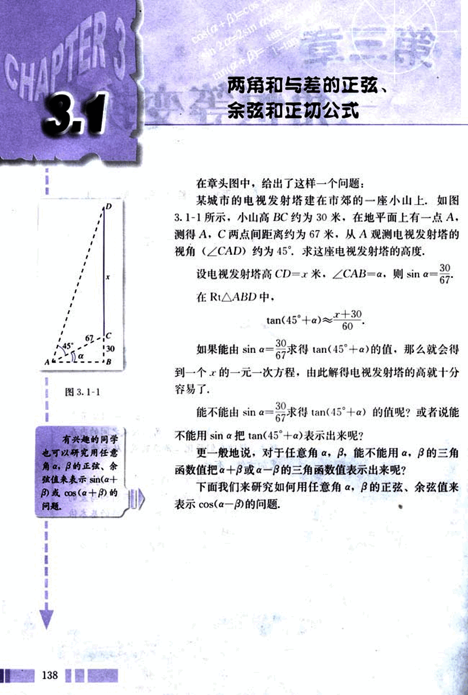
151

# 第三章 三角恒等变换

## 3.1.1 两角差的余弦公式

探究
如何用任意角α，β的正弦、余弦值来表示cos(α-β)呢？

探究的过程可以分两个步骤，第一步探求表示结果，第二步对结果的正确性加以证明。

你探究得到的结果是什么呢？你认为会是cos(α-β) = cosα-cosβ吗？

不妨以特例作验证，例如，当α=60°，β=30°时，动手算一算cos 60°-cos30°的值，再与cos30°的值作比较，

容易发现cos(60°-30°)≠cos 60°-cos 30°，因此，对任意角α，β，cos(α-β)=cosα-cosβ不成立。

显然，要得到正确的结果，需要联系已学过的其他知识。

思考
你认为要获得相应的表达式需要哪些已学过的知识？

由于这里涉及的是三角函数的问题，是α-β这个角的余弦问题，所以可以考虑联系单位圆上的三角函数线或向量的知识。

如图 [3.1-2](images/3.1-2.png)，设α的终边与单位圆的交点为P，∠POP₁=β，则∠POx=α-β。

过点P作PM垂直于x轴，垂足为M，那么OM就是角α-β的余弦线，这里就是要用角α，β的正弦线、余弦线来表示OM。

过点P作PA垂直于OP，垂足为A。过点A作AB垂直于x轴，垂足为B。过点P作PC垂直于AB，垂足为C。

139

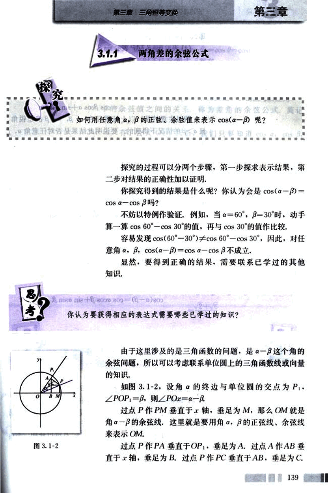
152

# CHAPTER 3

图3.1-3

运用向量工具
进行探索,过程多
么简洁啊!

那么

OA表示 cos β, AP表示 sinβ,并且∠PAC=∠POr=α,
于是

OM = OB + BM
= OB + CP
= OAcos α + APsin α
= cos βcos α + sin βsin α.

值得注意的是，以上结果是在α,β,α-β都是锐角，
且α>β的情况下得到的，要说明此结果是否对任意角α,β
都成立，还要做不少推广的工作，并且这项推广工作的过程
也是比较繁难的，同学们可以自己动手试一试。

下面再运用向量的知识进行探究，

如图3.1-3，在平面直角坐标系xOy内作单位圆，以
Ox为始边作角α,β，它们的终边与单位圆的交点分别为
A，B.

则 OA = (cos α, sin α), OB = (cos β, sin β).
由向量数量积的定义，有

OA · OB = |OA| · |OB| cos(α-β) = cos(α-β).

由向量数量积的坐标表示，有

OA · OB = (cos α, sin α) · (cos β, sin β)
= cos αcos β + sin αsin β.

于是

cos(α-β) = cos αcos β + sin αsin β.


思考

?

以上推导是否有不严谨之处？若有，请作出补充。

依据向量数量积的概念，角α-β必须符合条件 0 ≤ α-β ≤ π，即在此条件下，以上推导才是正确的。

由于α，β都是任意角，α-β也是任意角，因此就要研究当α-β是任意角时，以上推导是否正确的问题。

当α-β是任意角时，由诱导公式，总可以找到一个角
θ∈[0, 2π)，使 cos θ = cos(α-β).

若θ∈[0, π]，则OA·OB = cos θ = cos(α-β);

140

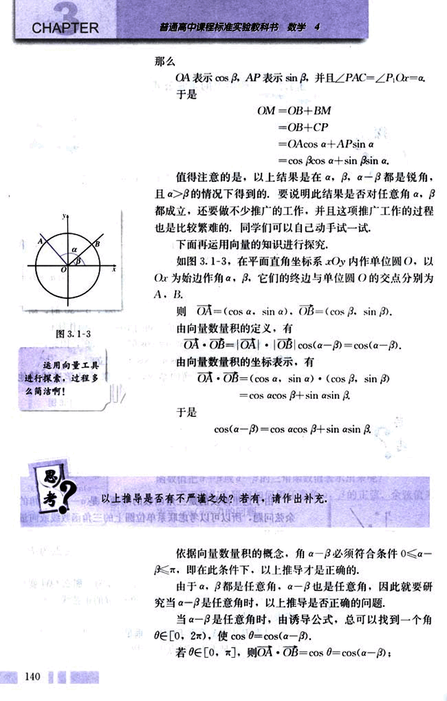
153
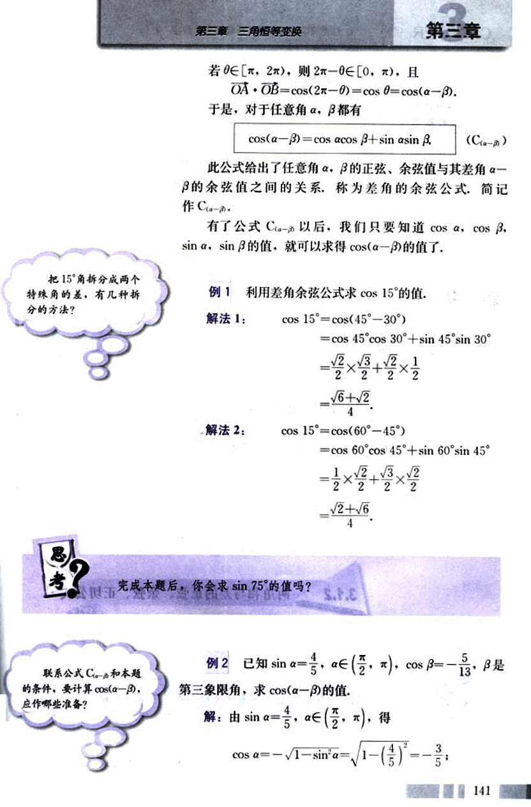
154

# CHAPTER 3

又由 $\cos\beta = -\frac{5}{13}$，$\beta$是第三象限角，得

$\sin\beta = -\sqrt{1-\cos^2\beta} = -\sqrt{1-(-\frac{5}{13})^2} = -\frac{12}{13}$

所以

$\cos(\alpha-\beta) = \cos\alpha\cos\beta + \sin\alpha\sin\beta$

$= (-\frac{3}{5})(-\frac{5}{13}) + (\frac{4}{5})(-\frac{12}{13})$

$= \frac{33}{65}$

## 练习

1. 利用公式 $C_{\alpha-\beta}$ 证明：

(1) $\cos(\frac{\pi}{2}-\alpha) = \sin\alpha$；

(2) $\cos(2\pi-\alpha) = \cos\alpha$.

2. 已知 $\cos\alpha = -\frac{3}{5}$，$\alpha\in(\frac{\pi}{2},\pi)$，求 $\cos(\frac{\pi}{4}-\alpha)$ 的值.

3. 已知 $\sin\theta = \frac{15}{17}$，$\theta$是第二象限角，求 $\cos(\theta-\frac{\pi}{3})$ 的值.

4. 已知 $\sin\alpha = -\frac{2}{3}$，$\alpha\in(\pi, \frac{3\pi}{2})$，$\cos\beta = \frac{3}{4}$，$\beta\in(\frac{3\pi}{2},2\pi)$，求 $\cos(\beta-\alpha)$ 的值.

## 3.1.2 两角和与差的正弦、余弦、正切公式

由公式 $C_{\alpha-\beta}$ 出发，你能推导出两角和与差的三角函数的其他公式吗？

下面以公式 $C_{\alpha-\beta}$ 为基础来推导其他公式，

142
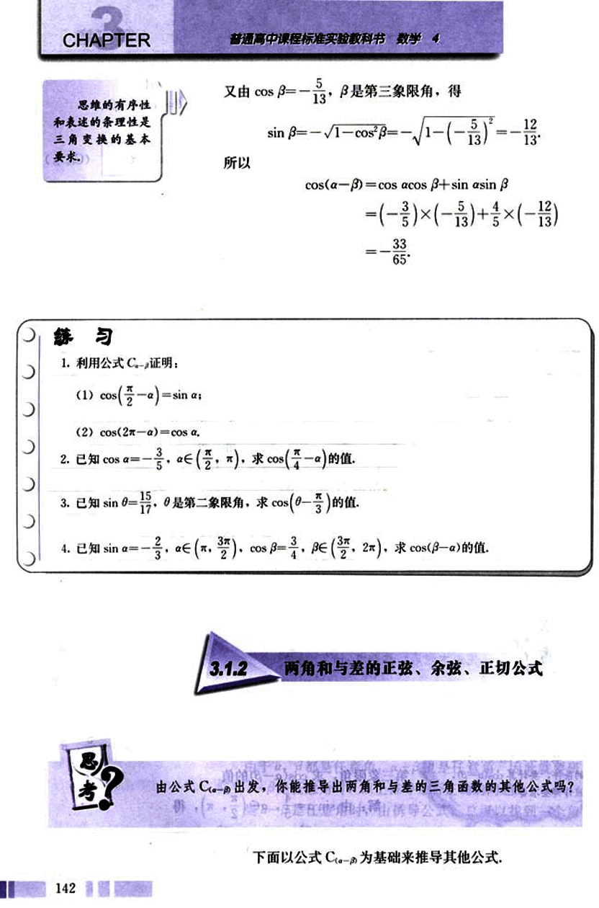
155

# 第三章 三角恒等变换

## 例如，比较 $\cos(\alpha-\beta)$ 与 $\cos(\alpha+\beta)$，并注意到 $\alpha+\beta$ 与 $\alpha-\beta$ 之间的联系：$\alpha+\beta = \alpha-(-\beta)$，则由公式 $C_{(\alpha-\beta)}$，有
$\cos(\alpha+\beta) = \cos[\alpha-(-\beta)]$
$= \cos\alpha\cos(-\beta)+\sin\alpha\sin(-\beta)$
$= \cos\alpha\cos\beta - \sin\alpha\sin\beta$
于是，我们得到了两角和的余弦公式，简记作 $C_{(\alpha+\beta)}$。
$\cos(\alpha+\beta) = \cos\alpha\cos\beta - \sin\alpha\sin\beta$  ($C_{(\alpha+\beta)}$)

上面我们得到了两角和与差的余弦公式，我们知道，用诱导公式五(或六)可以实现正弦、余弦的互化，你能根据 $C_{(\alpha+\beta)}$、$C_{(\alpha-\beta)}$ 及诱导公式五(或六)，推导出用任意角 $\alpha$，$\beta$ 的正弦、余弦值表示 $\sin(\alpha+\beta)$，$\sin(\alpha-\beta)$ 的公式吗？

把结果填入下面框中：
$\sin(\alpha+\beta)=$  ($S_{(\alpha+\beta)}$)
$\sin(\alpha-\beta)=$  ($S_{(\alpha-\beta)}$)

你能根据正切函数与正弦、余弦函数的关系，从 $C_{(\pm)}$、$S_{(\pm)}$ 出发，推导出用任意角 $\alpha$，$\beta$ 的正切表示 $\tan(\alpha+\beta)$，$\tan(\alpha-\beta)$ 的公式吗？

143

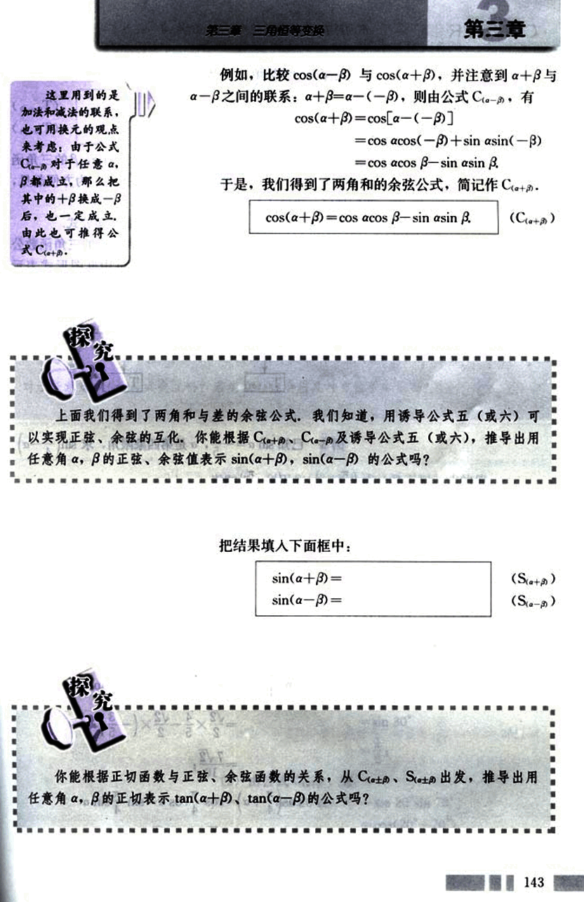
156

# CHAPTER 3

普通高中课程标准实验教科书 数学 4

把探究的结果填入下面框中.

tan(α+β)=

tan(α-β)=

(T<sub>(α+β)</sub>)
(T<sub>(α-β)</sub>)

公式S<sub>(α+β)</sub>，C<sub>(α+β)</sub>，T<sub>(α+β)</sub>给出了任意角α，β的三角函数数值与其和角α+β的三角函数值之间的关系，为方便起见，我们把这三个公式都叫做和角公式。

类似地，S<sub>(α-β)</sub>，C<sub>(α-β)</sub>，T<sub>(α-β)</sub>都叫做差角公式。

从以上推导过程可以看到，这6个和与差的三角函数公式之间具有紧密的逻辑联系，这种联系可用框图形式表示如下：

```
S<sub>(α+β)</sub> --> C<sub>(α+β)</sub> --> C<sub>(α-β)</sub> --> S<sub>(α-β)</sub>
          ↓
          T<sub>(α+β)</sub>
          ↑
          T<sub>(α-β)</sub>
```

例3  已知 sin α =$-\frac{3}{5}$，α是第四象限角，求 sin($\frac{\pi}{4}$-α)，cos($\frac{\pi}{4}$+α)，tan($\frac{\pi}{4}$-α)的值.

解：由 sin α =$-\frac{3}{5}$，α是第四象限角，得

cos α =$\sqrt{1-sin^2α}$=$\sqrt{1-(-\frac{3}{5})^2}$=$\frac{4}{5}$.

所以 tan α =$\frac{sin α}{cos α}$=$\frac{-\frac{3}{5}}{\frac{4}{5}}$=$-\frac{3}{4}$.

于是有

sin($\frac{\pi}{4}$-α) = sin$\frac{\pi}{4}$cos α - cos$\frac{\pi}{4}$sin α

=$\frac{\sqrt{2}}{2}$×$\frac{4}{5}$-$\frac{\sqrt{2}}{2}$×($-\frac{3}{5}$)

=$\frac{7\sqrt{2}}{10}$;

cos($\frac{\pi}{4}$+α) = cos$\frac{\pi}{4}$cos α - sin$\frac{\pi}{4}$sin α

=$\frac{\sqrt{2}}{2}$×$\frac{4}{5}$-$\frac{\sqrt{2}}{2}$×($-\frac{3}{5}$)


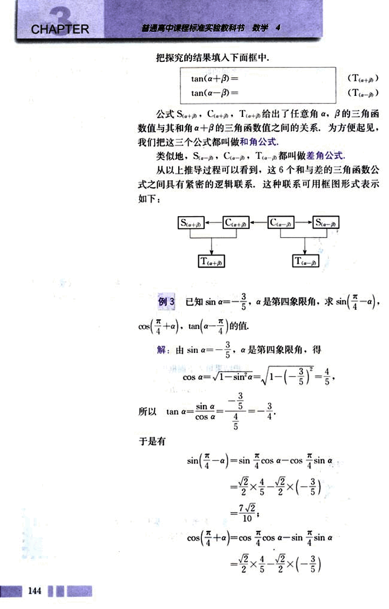
157

# 第三章 三角恒等变换

## 第三章

$\frac{-7\sqrt{2}}{10};$

$\tan(a - \frac{\pi}{4}) = \frac{\tan a - \tan \frac{\pi}{4}}{1 + \tan a \tan \frac{\pi}{4}} = \frac{\tan a - 1}{1 + \tan a}$

$= \frac{-\frac{3}{4} - 1}{1 + (-\frac{3}{4})} = -7.$


思考?

由以上解答可以看到，在本题条件下有$\sin(\frac{\pi}{4} - a) = \cos(\frac{\pi}{4} + a)$. 那么对于任意角$a$，此等式成立吗？若成立，你会用几种方法予以证明？


例4 利用和(差)角公式计算下列各式的值：

(1) $\sin 72^\circ \cos 42^\circ - \cos 72^\circ \sin 42^\circ$;

(2) $\cos 20^\circ \cos 70^\circ - \sin 20^\circ \sin 70^\circ$;

(3) $\frac{1 + \tan 15^\circ}{1 - \tan 15^\circ}$.

分析：和角与差角公式把$a \pm \beta$的三角函数式转化成了$a$, $\beta$的三角函数式，如果反过来，从右到左使用公式，我们就可以将上述三角函数式化简。

解：(1) 由公式$S_{a - \beta}$，得

$\sin 72^\circ \cos 42^\circ - \cos 72^\circ \sin 42^\circ$

$= \sin(72^\circ - 42^\circ)$

$= \sin 30^\circ$

$= \frac{1}{2}$

(2) 由公式$C_{a + \beta}$，得

$\cos 20^\circ \cos 70^\circ - \sin 20^\circ \sin 70^\circ$

$= \cos(20^\circ + 70^\circ)$

$= \cos 90^\circ$

145

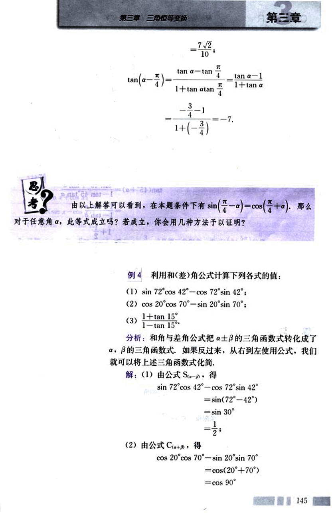
158

# CHAPTER 3

普通高中课程标准实验教科书 数学 4

(3) 由公式 $T_{(\alpha+\beta)}$ 及 $\tan 45^\circ = 1$ , 得
$\frac{1 + \tan 15^\circ}{1 - \tan 15^\circ} = \frac{\tan 45^\circ + \tan 15^\circ}{1 - \tan 45^\circ \tan 15^\circ}$
$= \tan (45^\circ + 15^\circ)$
$= \tan 60^\circ$
$= \sqrt{3}$ .

有了两角和与差的三角函数公式，我们就可以解决本章开头提出的问题了。

由 $\sin \alpha = \frac{30}{67}$ , 得 $\cos \alpha \approx \frac{60}{67}$ , 所以 $\tan \alpha \approx \frac{1}{2}$ . 于是
$\tan (45^\circ + \alpha) = \frac{\tan 45^\circ + \tan \alpha}{1 - \tan 45^\circ \tan \alpha}$
$= \frac{1 + \tan \alpha}{1 - \tan \alpha}$
$\approx \frac{1 + \frac{1}{2}}{1 - \frac{1}{2}} = 3$ .

解方程 $\frac{x + 30}{60} = 3$ , 得 $x = 150$ .

因此这座电视发射塔的高度大约为 150 米.

## 练习

1. 利用和(差)角公式, 求下列各式的值:

(1) $\sin 15^\circ$ ;

(3) $\sin 75^\circ$ ;

(2) $\cos 75^\circ$ ;

(4) $\tan 15^\circ$ .

2. 已知 $\cos \theta = -\frac{3}{5}, \theta \in (\frac{\pi}{2}, \pi)$ , 求 $\sin (\theta + \frac{\pi}{3})$ 的值.

3. 已知 $\sin \theta = -\frac{12}{13}$ , $\theta$ 是第三象限角, 求 $\cos (\frac{\pi}{6} + \theta)$ 的值.

4. 已知 $\tan \alpha = 3$ , 求 $\tan (\frac{\pi}{4} + \alpha)$ 的值.

146

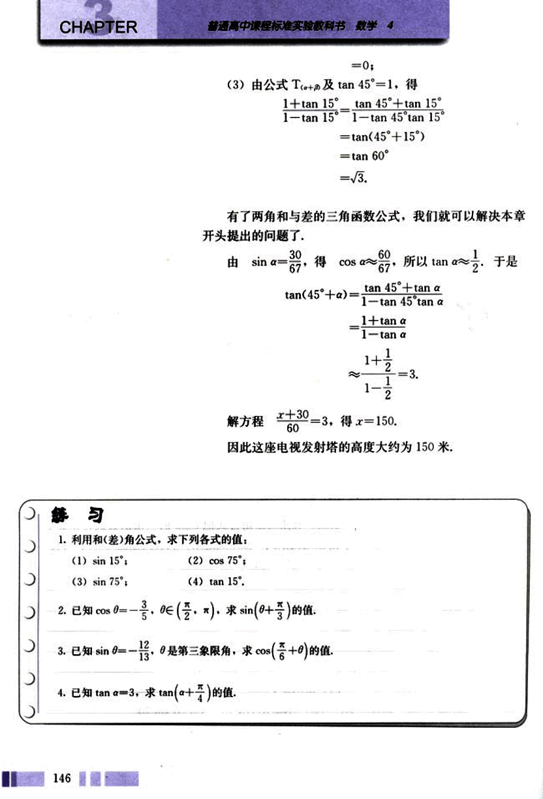
159

# 第三章 三角恒等变换
## 第三章

5. 求下列各式的值：

(1) sin 72°cos 18°+cos 72°sin 18°；

(2) cos 72°cos 12°+sin 72°sin 12°；

(3) $\frac{tan 12°+tan 33°}{1-tan 12°tan 33°}$

(4) cos 74°sin 14°-sin 74°cos 14°；

(5) sin 34°sin 26°-cos 34°cos 26°；

(6) sin 20°cos 110°+cos 160°sin 70°.

6. 化简：

(1) $\frac{1}{2}cos x - \frac{\sqrt{3}}{2}sin x$；

(2) $\sqrt{3}sin x + cos x$；

(3) $\sqrt{2}(sin x - cos x)$；

(4) $\sqrt{2}cos x - \sqrt{6}sin x$.

7. 已知 sin(α-β)cos α-cos(β-α)sin α=$\frac{3}{5}$，β是第三象限角，求 sin($\frac{\beta}{4} + \frac{5\pi}{4}$)的值.

## 3.1.3 二倍角的正弦、余弦、正切公式

以公式 C(α-β)为基础，我们已经得到六个和(差)角公式，下面将以和(差)角公式为基础来推导倍角公式。

你能利用 $Sin(α ± β)$，$Cos(α ± β)$，$Tan(α ± β)$ 推导出 sin 2α，cos 2α，tan 2α 的公式吗？

147

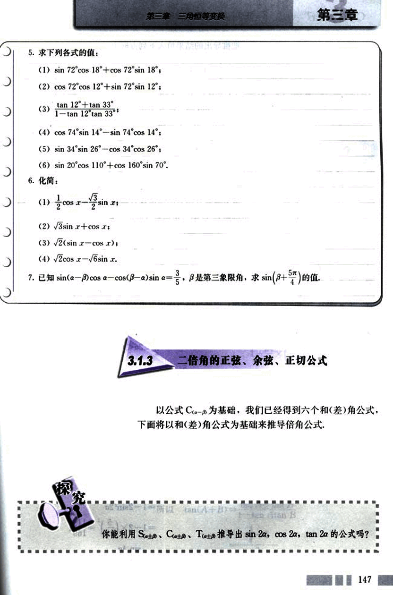
160

# CHAPTER 3

普通高中课程标准实验教科书 数学 4

把推导出的结果填入下列方框中:

sin 2a=  (S<sub>2α</sub>)
cos 2a=  (C<sub>2α</sub>)
tan 2a=  (T<sub>2α</sub>)


在以上得到的二倍角的余弦公式 ($C_{2α}$) 中，如果要求表示式仅含 a 的正弦（余弦），那么又可得到：

cos 2a=
cos 2a=


以上这些公式都叫做倍角公式。倍角公式给出了 a 的三角函数与 2a 的三角函数之间的关系。


## 例 5

已知 $sin 2a = \frac{5}{13}$，$\frac{\pi}{4} < a < \frac{\pi}{2}$，求 sin 4a，cos 4a，tan 4a 的值。

**分析:** 已知条件给出了 2a 的正弦值，由于 4a 是 2a 的二倍角，因此可以考虑用倍角公式。

**解:** 由 $\frac{\pi}{4} < a < \frac{\pi}{2}$，得 $\frac{\pi}{2} < 2a < \pi$。

又 $sin 2a = \frac{5}{13}$。

所以 $cos 2a = -\sqrt{1 - sin^2 2a} = -\sqrt{1 - (\frac{5}{13})^2} = -\frac{12}{13}$。

于是

$sin 4a = sin[2 \times (2a)]$
$= 2sin 2acos 2a$
$= 2 \times \frac{5}{13} \times (-\frac{12}{13}) = -\frac{120}{169}$；

$cos 4a = cos[2 \times (2a)]$
$= 1 - 2sin^2 2a$
$= 1 - 2 \times (\frac{5}{13})^2 = \frac{119}{169}$；

$tan 4a = \frac{sin 4a}{cos 4a}$


148

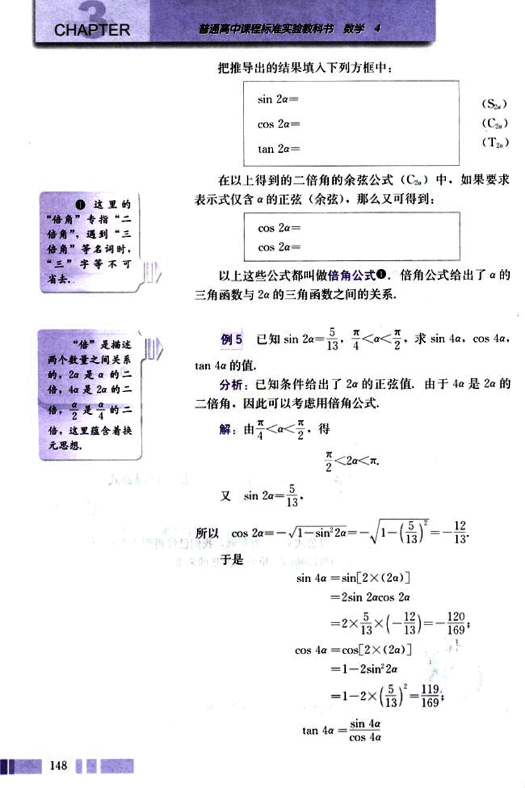
161

# 第三章 三角恒等变换

# 例6

在△ABC中，cos A = $\frac{4}{5}$，tan B = 2，求 tan(2A + 2B)的值.

## 解法 1:

在△ABC中，
由 cos A = $\frac{4}{5}$，0 < A < π，得
sin A = $\sqrt{1 - cos^2A} = \sqrt{1 - (\frac{4}{5})^2} = \frac{3}{5}$

所以 tan A = $\frac{sin A}{cos A} = \frac{3}{5} \times \frac{5}{4} = \frac{3}{4}$

tan 2A = $\frac{2tan A}{1 - tan^2A} = \frac{2 \times \frac{3}{4}}{1 - (\frac{3}{4})^2} = \frac{24}{7}$

又 tan B = 2,

所以 tan 2B = $\frac{2tan B}{1 - tan^2B} = \frac{2 \times 2}{1 - 2^2} = \frac{4}{-3}$

于是 tan(2A + 2B) = $\frac{tan 2A + tan 2B}{1 - tan 2A tan 2B} = \frac{\frac{24}{7} + \frac{4}{-3}}{1 - \frac{24}{7} \times \frac{-4}{3}} = \frac{44}{117}$


## 解法 2:

在△ABC中，
由 cos A = $\frac{4}{5}$，0 < A < π，得
sin A = $\sqrt{1 - cos^2A} = \sqrt{1 - (\frac{4}{5})^2} = \frac{3}{5}$

所以 tan A = $\frac{sin A}{cos A} = \frac{3}{5} \times \frac{5}{4} = \frac{3}{4}$

又 tan B = 2,

所以 tan(A + B) = $\frac{tan A + tan B}{1 - tan A tan B} = \frac{\frac{3}{4} + 2}{1 - \frac{3}{4} \times 2} = \frac{11}{-2}$

149

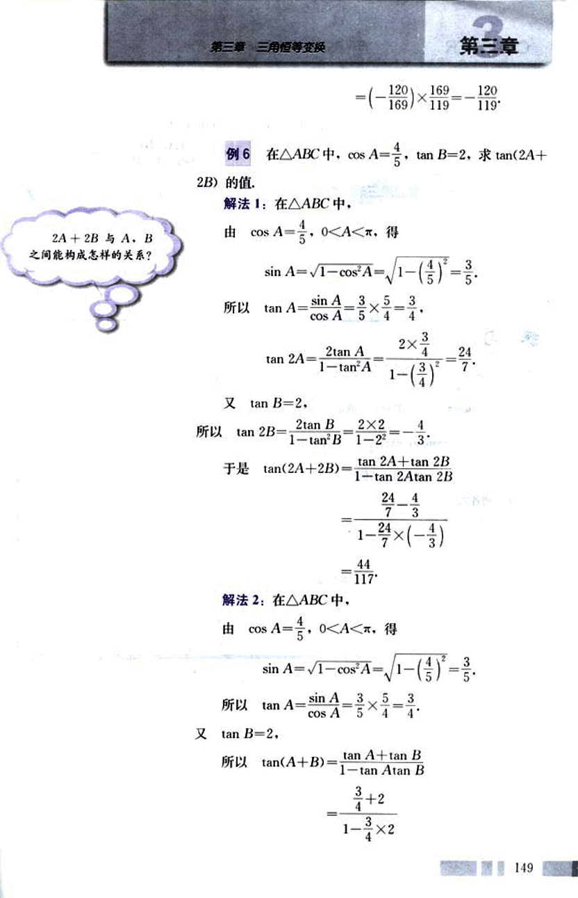
162

# CHAPTER 3

$\frac{-11}{2}$

于是 $\tan(2A+2B) = \tan[2(A+B)]$

$= \frac{\tan(A+B)}{1-\tan^2(A+B)}$

$= \frac{2 \times (-\frac{11}{2})}{1-(-\frac{11}{2})^2}$

$= \frac{-44}{117}$


# 练习

1. 已知 $\cos \frac{\alpha}{8} = -\frac{4}{5}$ , $8\pi < \alpha < 12\pi$ , 求 $\sin \frac{\alpha}{4}$ , $\cos \frac{\alpha}{4}$ , $\tan \frac{\alpha}{4}$ 的值.

2. 已知 $\sin(\alpha - \pi) = \frac{3}{5}$ , 求 $\cos 2\alpha$ 的值.

3. 已知 $\sin 2\alpha = -\sin \alpha$ , $\alpha \in (\frac{\pi}{2}, \pi)$ , 求 $\tan \alpha$ 的值.

4. 已知 $\tan 2\alpha = 1$ , 求 $\tan \alpha$ 的值.

5. 求下列各式的值:

(1) $\sin 15^\circ \cos 15^\circ$ ;

(2) $\cos \frac{\pi}{8} - \sin \frac{\pi}{8}$ ;

(3) $\frac{\tan 22.5^\circ}{1 - \tan^2 22.5^\circ}$ ;

(4) $\frac{3 \tan 22.5^\circ}{2 - 2 \tan^2 22.5^\circ}$ .

150

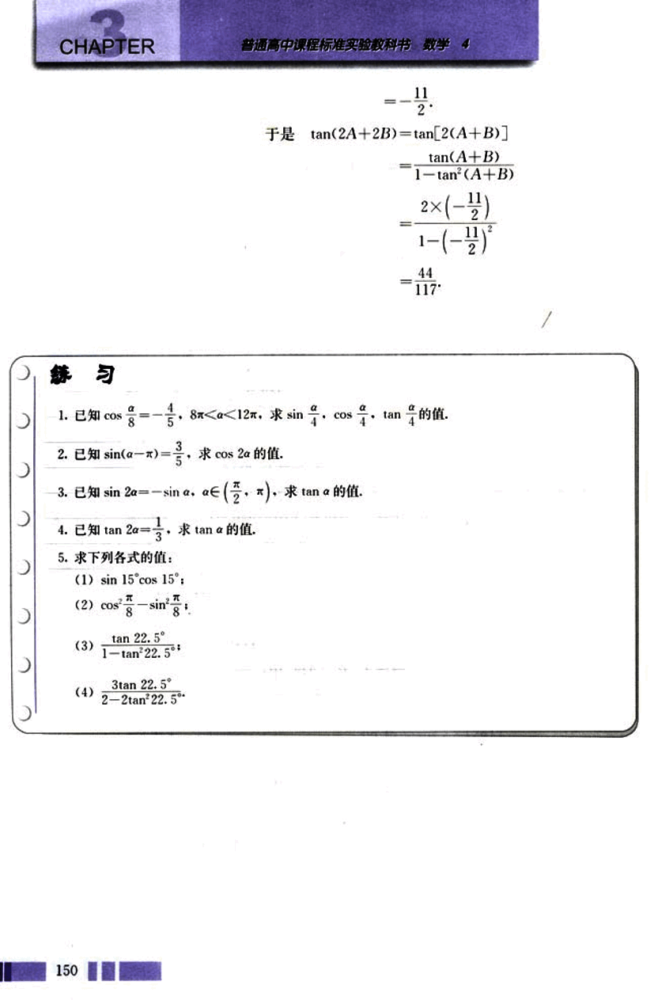
163

# 第三章 三角恒等变换

## 利用信息技术制作三角函数表

在《数学1》的阅读与思考“对数的发明”中曾经谈到，纳皮尔利用对数制作了0°~90°每隔1′的八位三角函数表。应当说，纳皮尔仅仅凭借手工运算得到这个三角函数表的工作量是非常大的，这也显示出他超人的毅力和为科学献身的精神。今天，我们可以利用已经学会的三角函数知识以及算法知识，借助计算机，容易地制作出非常精确的三角函数表。
下面我们借助计算机来作一个0°~90°每隔1′的八位三角函数表。

用科学计算器可得：
sin 1′=2.908 882 046×10⁻⁴≈0.000 290 888.

以此作为初始值，利用

cos 1′=√1-sin²1′;
aₙ=aₙ₋₁+1′,  n≥1;
sin aₙ=sin 1′cos aₙ₋₁+cos 1′sin aₙ₋₁;
cos aₙ=√1-sin²aₙ;

就可以写出一个算法（如右图所示），然后通过计算机而得到一个正弦函数的三角函数表。

请同学们根据上述思路，自己编写程序，得出一个三角函数表。

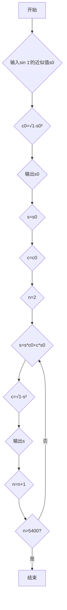
```mermaid
graph TD
    A[开始] --> B{输入sin 1′的近似值s0};
    B --> C{c0=√1-s0²};
    C --> D{输出s0};
    D --> E{s=s0};
    E --> F{c=c0};
    F --> G{n=2};
    G --> H{s=s*c0+c*s0};
    H --> I{c=√1-s²};
    I --> J{输出s};
    J --> K{n=n+1};
    K --> L{n>5400?};
    L -- 是 --> M[结束];
    L -- 否 --> H;
```

151

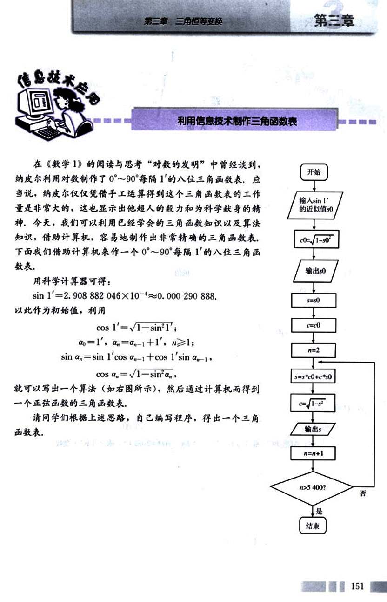
164

# CHAPTER 3

习题 3.1

A 组

1. 利用公式 $C_\alpha$、$S_\alpha$ 证明：

(1) $\cos(-\alpha) = \cos\alpha$;  (2) $\sin(-\alpha) = -\sin\alpha$;

(3) $\cos(\pi + \alpha) = -\cos\alpha$; (4) $\sin(\pi - \alpha) = \sin\alpha$.

2. 已知 $\cos\alpha = \frac{3}{5}$，$0 < \alpha < \frac{\pi}{2}$，求 $\cos(\frac{\pi}{6} - \alpha)$ 的值.

3. 已知 $\sin\alpha = \frac{2}{3}$，$\cos\beta = -\frac{3}{4}$，$\alpha \in (\frac{\pi}{2}, \pi)$，$\beta \in (\frac{3\pi}{2}, 2\pi)$，求 $\cos(\alpha - \beta)$ 的值.

4. 已知 $\alpha$，$\beta$ 都是锐角，$\cos\alpha = \frac{1}{7}$，$\cos(\alpha + \beta) = \frac{11}{14}$，求 $\cos\beta$ 的值. (提示：$\beta = (\alpha + \beta) - \alpha$.)

5. 已知 $\sin(30^\circ + \alpha) = \frac{3}{5}$，$60^\circ < \alpha < 150^\circ$，求 $\cos\alpha$ 的值.

6. 利用和(差)角公式求下列各三角函数的值：

(1) $\sin(-\frac{7\pi}{12})$;  (2) $\cos(-\frac{61\pi}{12})$;  (3) $\tan\frac{35\pi}{12}$.

7. 已知 $\sin\alpha = \frac{2}{3}$，$\cos\beta = -\frac{3}{4}$，$\alpha \in (\frac{\pi}{2}, \pi)$，$\beta$ 是第三象限角，求 $\cos(\alpha + \beta)$，$\sin(\alpha - \beta)$ 的值.

8. 在 $\triangle ABC$ 中，$\cos A = -\frac{12}{13}$，$\cos B = \frac{3}{5}$，求 $\cos C$ 的值.

9. 已知 $\sin\theta = \frac{3}{5}$，$\theta \in (0, \frac{\pi}{2})$，$\tan\varphi = \frac{1}{2}$，求 $\tan(\theta + \varphi)$，$\tan(\theta - \varphi)$ 的值.

10. 已知 $\tan\alpha$，$\tan\beta$ 是方程 $2x^2 + 3x - 7 = 0$ 的两个实数根，求 $\tan(\alpha + \beta)$ 的值.

11. 已知 $\tan(\alpha + \beta) = 3$，$\tan(\alpha - \beta) = 5$，求 $\tan2\alpha$，$\tan2\beta$ 的值.

12. 已知 $\sin\alpha = \frac{2}{3}$，$\cos\beta = -\frac{3}{4}$，$\alpha$ 是第二象限角，求 $\sin(\alpha + \beta)$ 的值.

13. 在 $\triangle ABC$ 中，$AD \perp BC$，垂足为 $D$，且 $BD:DC:AD = 2:3:6$，求 $\angle BAC$ 的度数.

14. 化简：

(1) $3\sqrt{15}\sin x + 3\sqrt{5}\cos x$;

(2) $\frac{2}{\cos x - \sin x}$;

(3) $\sqrt{3}\sin x + \cos x$;

(4) $\frac{\sqrt{2}}{4}\sin(\frac{\pi}{4} - x) + \frac{\sqrt{6}}{4}\cos(\frac{\pi}{4} - x)$;

152

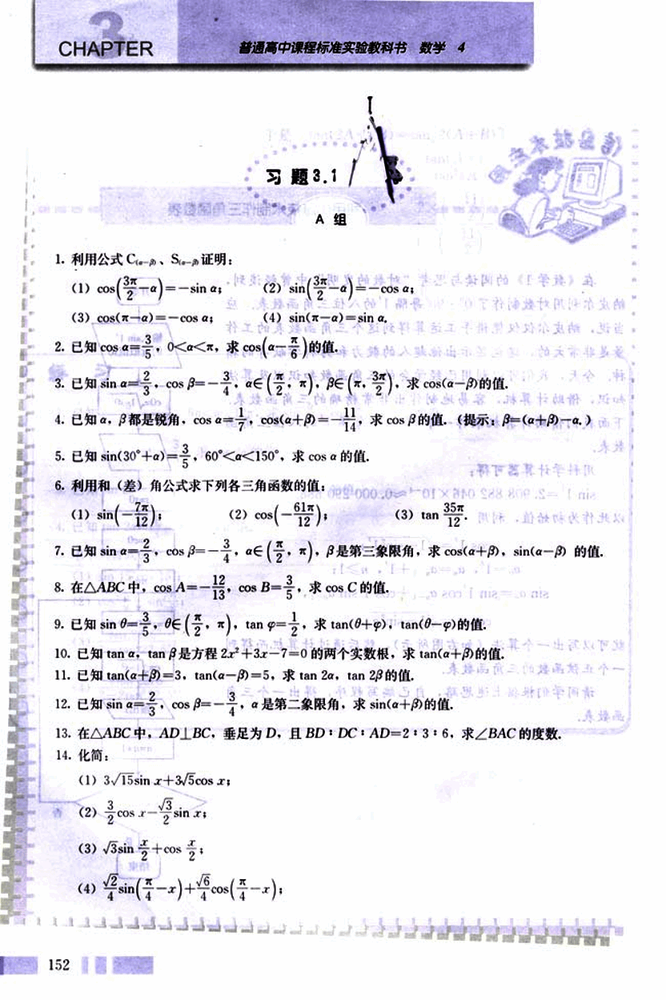
165

# 第三章 三角恒等变换

## 第三章

(5) sin 347°cos 148°+sin 77°cos 58°

(6) sin 164°sin 224°+sin 254°sin 314°

(7) sin(α+β)cos(γ-β)-cos(γ+α)sin(β-γ)

(8) sin(α-β)sin(β-γ)-cos(α-β)cos(γ-β)

(9) $\frac{\tan\frac{5\pi}{12}+\tan\frac{5\pi}{12}}{1-\tan\frac{5\pi}{12}\tan\frac{5\pi}{12}}$

(10) $\frac{\sin(\alpha+\beta)-2\sin\alpha\cos\beta}{2\sin\alpha\sin\beta+\cos(\alpha+\beta)}$

15. 已知 sin α=0.80，α∈(0, $\frac{\pi}{2}$)，求 sin 2α, cos 2α 的值（保留两个有效数字）。

16. 已知 cos φ=$-\frac{\sqrt{3}}{3}$，180°<φ<270°，求 sin 2φ，cos 2φ，tan 2φ 的值.

17. 已知等腰三角形一个底角的正弦值为$\frac{5}{13}$，求这个三角形的顶角的正弦、余弦及正切值.

18. 已知 tan α=$\frac{1}{7}$，tan β=$\frac{1}{3}$，求 tan(α+β)的值.

19. 已知 cos(α+β)cos β+sin(α+β)sin β=$\frac{1}{3}$，且 α∈($\frac{3\pi}{2}$, 2π)，求 cos($2\alpha+\frac{\pi}{4}$)的值.

20. 化简：

(1) (sin α+cos α)$^2$

(2) cos$^2$θ-sin$^2$θ

(3) sin xcos xcos 2x

(4) $\frac{1-\tan\theta}{1+\tan\theta}$

## B组

1. 证明：

(1) sin 3α=3sin α-4sin$^3$α

(2) cos 3α=4cos$^3$α-3cos α

2. 在△ABC中，已知 tan A，tan B 是 x 的方程 x$^2$+p(x+1)+1=0 的两个实根，求∠C 的度数.

3. 观察以下各等式：

sin$^2$30°+cos$^2$60°+sin 30°cos 60°=$\frac{3}{4}$

sin$^2$20°+cos$^2$50°+sin 20°cos 50°=$\frac{3}{4}$

sin$^2$15°+cos$^2$45°+sin 15°cos 45°=$\frac{3}{4}$

分析上述各式的共同特点，写出能反映一般规律的等式，并对等式的正确性作出证明.

153

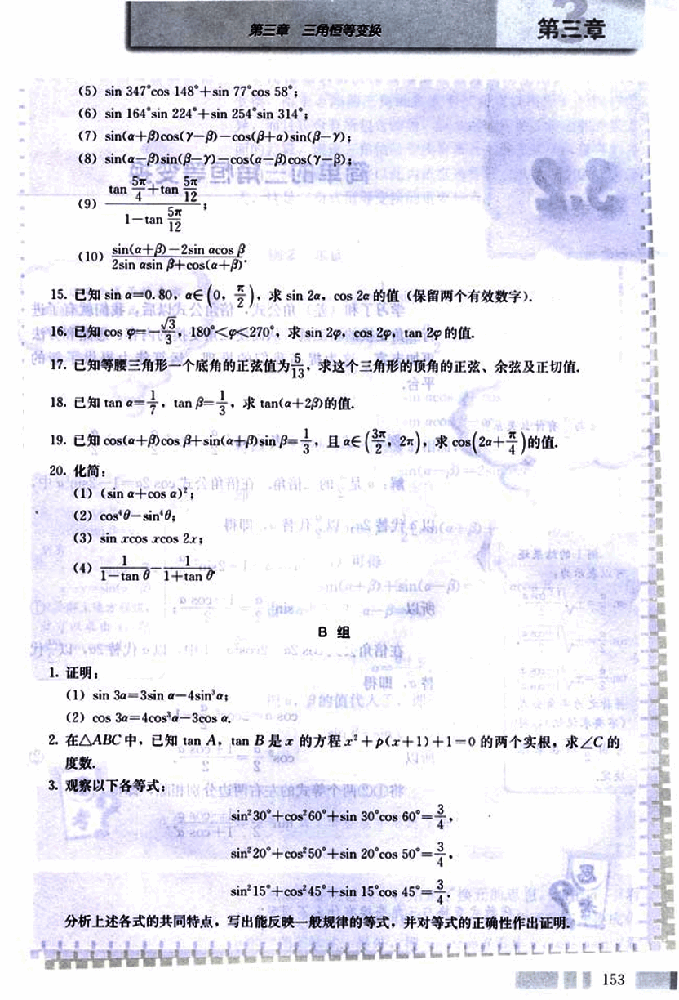
