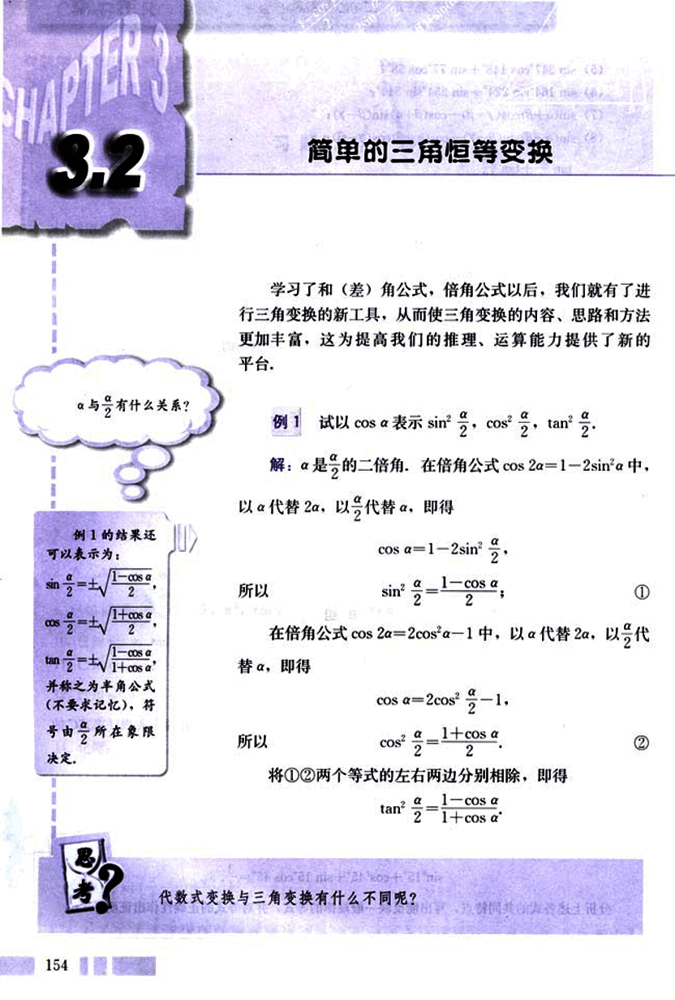
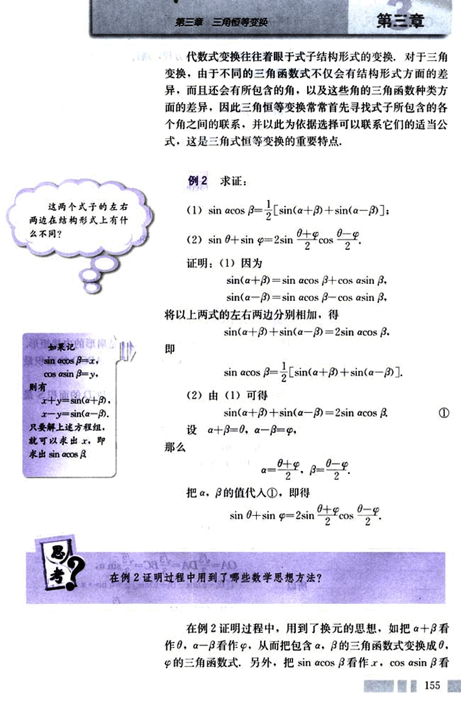
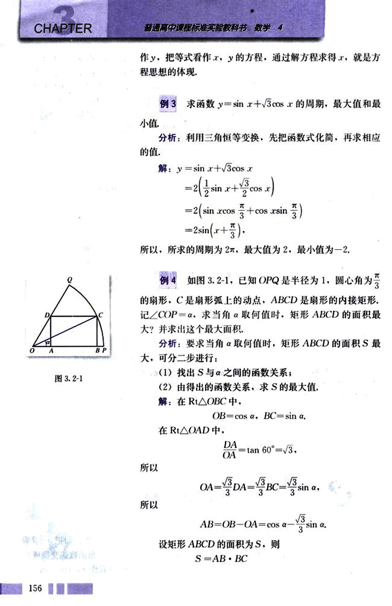
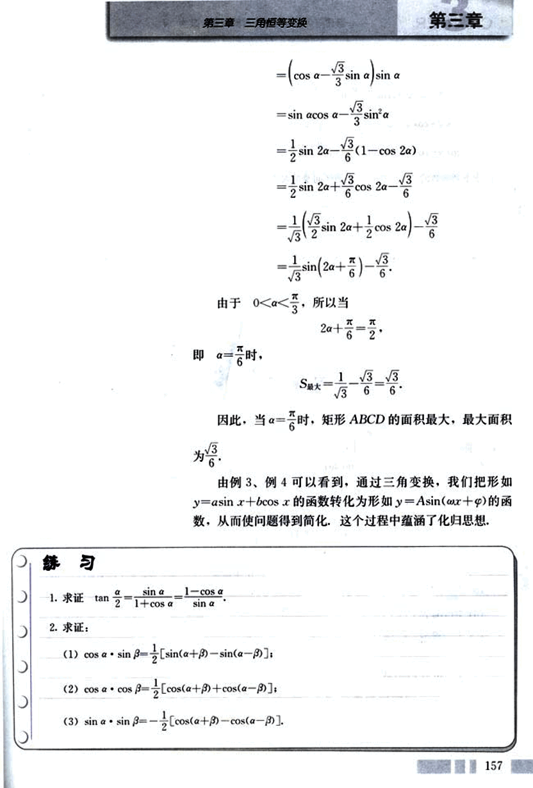
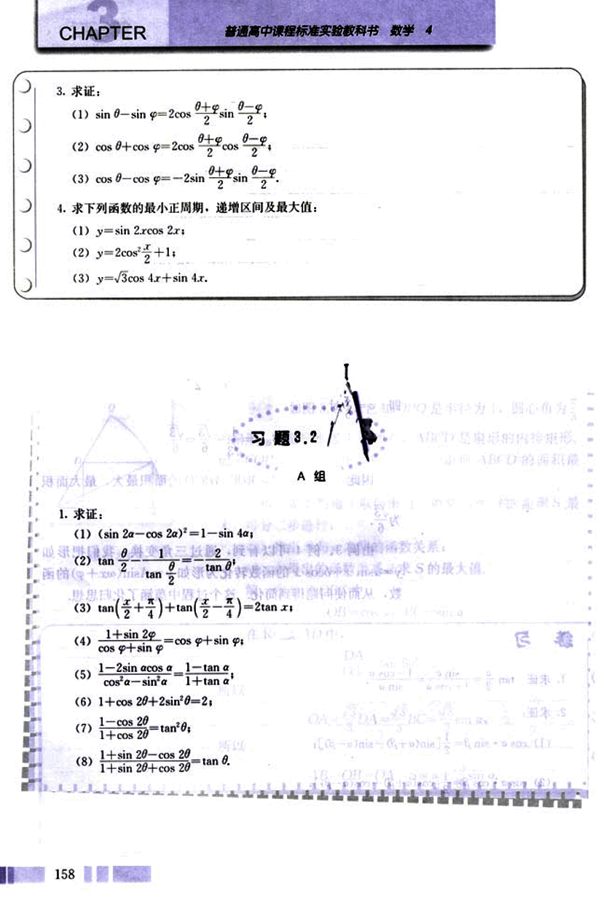
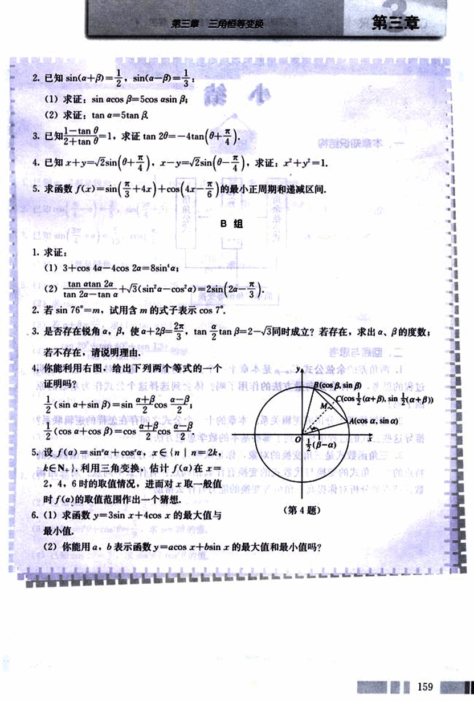

# 3.2　简单的三角恒等变换

166

# CHAPTER 3

## 3.2 简单的三角恒等变换

学习了和(差)角公式，倍角公式以后，我们就有了进行三角变换的新工具，从而使三角变换的内容、思路和方法更加丰富，这为提高我们的推理、运算能力提供了新的平台。

**例1** 试以cos α表示 sin²<binary data, 1 bytes><binary data, 1 bytes><binary data, 1 bytes>，cos²<binary data, 1 bytes><binary data, 1 bytes><binary data, 1 bytes>，tan²<binary data, 1 bytes><binary data, 1 bytes><binary data, 1 bytes>.

解：α/2是的二倍角，在倍角公式cos 2α = 1 - 2sin²α中，以α/2代替 2α，以α/2代替 α，即得

cos α = 1 - 2sin²<binary data, 1 bytes><binary data, 1 bytes><binary data, 1 bytes>

所以

sin²<binary data, 1 bytes><binary data, 1 bytes><binary data, 1 bytes> = (1 - cos α)/2     ①

在倍角公式 cos 2α = 2cos²α - 1中，以α/2代替 2α，以α/2代替 α，即得

cos α = 2cos²<binary data, 1 bytes><binary data, 1 bytes><binary data, 1 bytes> - 1

所以

cos²<binary data, 1 bytes><binary data, 1 bytes><binary data, 1 bytes> = (1 + cos α)/2     ②

将①②两个等式的左右两边分别相除，即得

tan²<binary data, 1 bytes><binary data, 1 bytes><binary data, 1 bytes> = (1 - cos α)/(1 + cos α)

思考

代数式变换与三角变换有什么不同呢？
154

167

# 第三章 三角恒等变换

## 代数式变换往往着眼于式子结构形式的变换，对于三角变换，由于不同的三角函数式不仅会有结构形式方面的差异，而且还会有所包含的角，以及这些角的三角函数种类方面的差异，因此三角恒等变换常常首先寻找式子所包含的各个角之间的联系，并以此为依据选择可以联系它们的适当公式，这是三角式恒等变换的重要特点。

## 例2 求证：

(1)  $\sin \alpha \cos \beta = \frac{1}{2}[\sin(\alpha + \beta) + \sin(\alpha - \beta)]$ ;

(2)  $\sin \theta + \sin \varphi = 2 \sin \frac{\theta + \varphi}{2} \cos \frac{\theta - \varphi}{2}$ .

### 证明：(1) 因为

$\sin(\alpha + \beta) = \sin \alpha \cos \beta + \cos \alpha \sin \beta$,

$\sin(\alpha - \beta) = \sin \alpha \cos \beta - \cos \alpha \sin \beta$,

将以上两式的左右两边分别相加，得

$\sin(\alpha + \beta) + \sin(\alpha - \beta) = 2 \sin \alpha \cos \beta$.

即

$\sin \alpha \cos \beta = \frac{1}{2}[\sin(\alpha + \beta) + \sin(\alpha - \beta)]$.

(2) 由 (1) 可得

$\sin(\alpha + \beta) + \sin(\alpha - \beta) = 2 \sin \alpha \cos \beta$. ①

设 $\alpha + \beta = \theta$, $\alpha - \beta = \varphi$,

那么

$\alpha = \frac{\theta + \varphi}{2}$,  $\beta = \frac{\theta - \varphi}{2}$.

把 $\alpha$, $\beta$ 的值代入 ①，即得

$\sin \theta + \sin \varphi = 2 \sin \frac{\theta + \varphi}{2} \cos \frac{\theta - \varphi}{2}$.

## 在例2证明过程中用到了哪些数学思想方法？

在例2证明过程中，用到了换元的思想，如把 $\alpha + \beta$ 看作 $\theta$，$\alpha - \beta$ 看作 $\varphi$，从而把包含 $\alpha$, $\beta$ 的三角函数式变换成 $\theta$, $\varphi$ 的三角函数式。另外，把 $\sin \alpha \cos \beta$ 看作 $x$，$\cos \alpha \sin \beta$ 看作 $y$。

155

168

# CHAPTER 3

普通高中课程标准实验教科书 数学 4

作 y，把等式看作 x，y 的方程，通过解方程求得 x，就是方程思想的体现。

## 例 3

求函数 $y = \sin x + \sqrt{3} \cos x$ 的周期，最大值和最小值。

分析：利用三角恒等变换，先把函数式化简，再求相应的值。

解：$y = \sin x + \sqrt{3} \cos x$

$= 2(\frac{1}{2} \sin x + \frac{\sqrt{3}}{2} \cos x)$

$= 2(\sin x \cos \frac{\pi}{3} + \cos x \sin \frac{\pi}{3})$

$= 2 \sin (x + \frac{\pi}{3})$

所以，所求的周期为 $2\pi$，最大值为 2，最小值为 -2。

## 例 4

如图 3.2-1，已知 OPQ 是半径为 1，圆心角为 $\frac{\pi}{3}$ 的扇形。C 是扇形弧上的动点，ABCD 是扇形的内接矩形，记 $\angle COP = \alpha$。求当 $\alpha$ 取何值时，矩形 ABCD 的面积最大？并求出这个最大面积。

分析：要求当 $\alpha$ 取何值时，矩形 ABCD 的面积 S 最大，可分二步进行：

(1) 找出 S 与 $\alpha$ 之间的函数关系；

(2) 由得出的函数关系，求 S 的最大值。

解：在 Rt$\triangle OBC$ 中，

$OB = \cos \alpha$，$BC = \sin \alpha$。

在 Rt$\triangle OAD$ 中，

$\frac{DA}{OA} = \tan 60^\circ = \sqrt{3}$。

所以

$OA = \frac{\sqrt{3}}{3} DA = \frac{\sqrt{3}}{3} BC = \frac{\sqrt{3}}{3} \sin \alpha$。

所以

$AB = OB - OA = \cos \alpha - \frac{\sqrt{3}}{3} \sin \alpha$。

设矩形 ABCD 的面积为 S，则

$S = AB \cdot BC$

[图 3.2-1](images/3.2-1.png)

156

169

# 第三章 三角恒等变换

## 第三章

$=(\cos a - \frac{\sqrt{3}}{3}\sin a)\sin a$

$= \sin a \cos a - \frac{\sqrt{3}}{3}\sin^2 a$

$= \frac{1}{2}\sin 2a - \frac{\sqrt{3}}{6}(1 - \cos 2a)$

$= \frac{1}{2}\sin 2a + \frac{\sqrt{3}}{6}\cos 2a - \frac{\sqrt{3}}{6}$

$= \frac{1}{\sqrt{3}}(\frac{\sqrt{3}}{2}\sin 2a + \frac{1}{2}\cos 2a) - \frac{\sqrt{3}}{6}$

$= \frac{1}{\sqrt{3}}\sin(2a + \frac{\pi}{6}) - \frac{\sqrt{3}}{6}.$

由于 $0 < a < \frac{\pi}{3}$，所以当 $2a + \frac{\pi}{6} = \frac{\pi}{2}$，

即 $a = \frac{\pi}{6}$ 时，

$S_{max} = \frac{1}{\sqrt{3}} - \frac{\sqrt{3}}{6} = \frac{\sqrt{3}}{6}.$

因此，当 $a = \frac{\pi}{6}$ 时，矩形 ABCD 的面积最大，最大面积为 $\frac{\sqrt{3}}{6}$。

由例 3、例 4 可以看到，通过三角变换，我们把形如 $y = a\sin x + b\cos x$ 的函数转化为形如 $y = A\sin(ωx + φ)$ 的函数，从而使问题得到简化。在这个过程中蕴涵了化归思想。

## 练习

1. 求证 $\tan \frac{a}{2} = \frac{\sin a}{1 + \cos a} = \frac{1 - \cos a}{\sin a}.$

2. 求证：

(1) $\cos a \cdot \sin \beta = \frac{1}{2}[\sin(a + \beta) - \sin(a - \beta)];$

(2) $\cos a \cdot \cos \beta = \frac{1}{2}[\cos(a + \beta) + \cos(a - \beta)];$

(3) $\sin a \cdot \sin \beta = \frac{1}{2}[\cos(a + \beta) - \cos(a - \beta)].$

157

170

# CHAPTER

普通高中课程标准实验教科书 数学 4

3. 求证:

(1) $\sin\theta - \sin\varphi = 2\cos\frac{\theta+\varphi}{2}\sin\frac{\theta-\varphi}{2}$;

(2) $\cos\theta + \cos\varphi = 2\cos\frac{\theta+\varphi}{2}\cos\frac{\theta-\varphi}{2}$;

(3) $\cos\theta - \cos\varphi = -2\sin\frac{\theta+\varphi}{2}\sin\frac{\theta-\varphi}{2}$.

4. 求下列函数的最小正周期，递增区间及最大值:

(1) $y = \sin2x\cos2x$;

(2) $y = 2\cos^2x + 1$;

(3) $y = \sqrt{3}\cos4x + \sin4x$.

# 习题 3.2

A 组

1. 求证:

(1) $(\sin2\alpha - \cos2\alpha)^2 = 1 - \sin4\alpha$;

(2) $\tan2\theta = \frac{2\tan\theta}{1-\tan^2\theta}$;

(3) $\tan(\frac{x}{4} + \frac{\pi}{2}) + \tan(\frac{x}{2} - \frac{\pi}{4}) = 2\tan x$;

(4) $\frac{1+\sin2\varphi}{\cos\varphi + \sin\varphi} = \cos\varphi + \sin\varphi$;

(5) $\frac{1-2\sin\alpha\cos\alpha}{\cos^2\alpha - \sin^2\alpha} = \frac{1-\tan\alpha}{1+\tan\alpha}$;

(6) $1 + \cos2\theta + 2\sin^2\theta = 2$;

(7) $\frac{1-\cos2\theta}{1+\cos2\theta} = \tan^2\theta$;

(8) $\frac{1+\sin2\theta - \cos2\theta}{1+\sin2\theta + \cos2\theta} = \tan\theta$.

158

171

# 第三章 三角恒等变换

## 第三章

2. 已知 $\sin(\alpha+\beta)=\frac{1}{2}$，$\sin(\alpha-\beta)=\frac{1}{3}$；

(1) 求证：$\sin\alpha\cos\beta=5\cos\alpha\sin\beta$；

(2) 求证：$\tan\alpha=5\tan\beta$.

3. 已知 $\frac{1-\tan\theta}{2+\tan\theta}=1$，求证 $\tan2\theta=-4\tan(\theta+\frac{\pi}{4})$.

4. 已知 $x+y=\sqrt{2}\sin(\theta+\frac{\pi}{4})$，$x-y=\sqrt{2}\sin(\theta-\frac{\pi}{4})$，求证：$x^2+y^2=1$.

5. 求函数 $f(x)=\sin(\frac{\pi}{3}+4x)+\cos(4x-\frac{\pi}{6})$ 的最小正周期和递减区间.

## B组

1. 求证：

(1) $3+\cos4\alpha-4\cos2\alpha=8\sin^2\alpha$；

(2) $\frac{\tan\alpha+\tan2\alpha}{\tan2\alpha-\tan\alpha}+\sqrt{3}(\sin\alpha-\cos\alpha)=2\sin(2\alpha-\frac{\pi}{3})$.

2. 若 $\sin76^\circ=m$，试用含 $m$ 的式子表示 $\cos7^\circ$.

3. 是否存在锐角 $\alpha$，$\beta$，使 $\alpha+2\beta=\frac{2\pi}{3}$，$\tan\alpha\tan\beta=2-\sqrt{3}$ 同时成立？若存在，求出 $\alpha$，$\beta$ 的度数；若不存在，请说明理由.

4. 你能利用右图，给出下列两个等式的一个证明吗？

$\frac{1}{2}(\sin\alpha+\sin\beta)=\sin\frac{\alpha+\beta}{2}\cos\frac{\alpha-\beta}{2}$；

$\frac{1}{2}(\cos\alpha+\cos\beta)=\cos\frac{\alpha+\beta}{2}\cos\frac{\alpha-\beta}{2}$.

[image](images/image.png)

5. 设 $f(\alpha)=\sin\alpha+\cos\alpha$，$x\in\{n|n=2k, k\in N^+\}$，利用三角变换，估计 $f(\alpha)$ 在 $x=2, 4, 6$ 时的取值情况，进而对 $x$ 取一般值时 $f(\alpha)$ 的取值范围作出一个猜想.

6. (1) 求函数 $y=3\sin x+4\cos x$ 的最大值与最小值.

(2) 能用 $a$，$b$ 表示函数 $y=a\cos x+b\sin x$ 的最大值和最小值吗？

159

