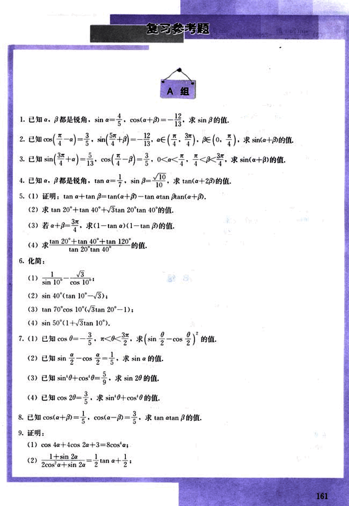
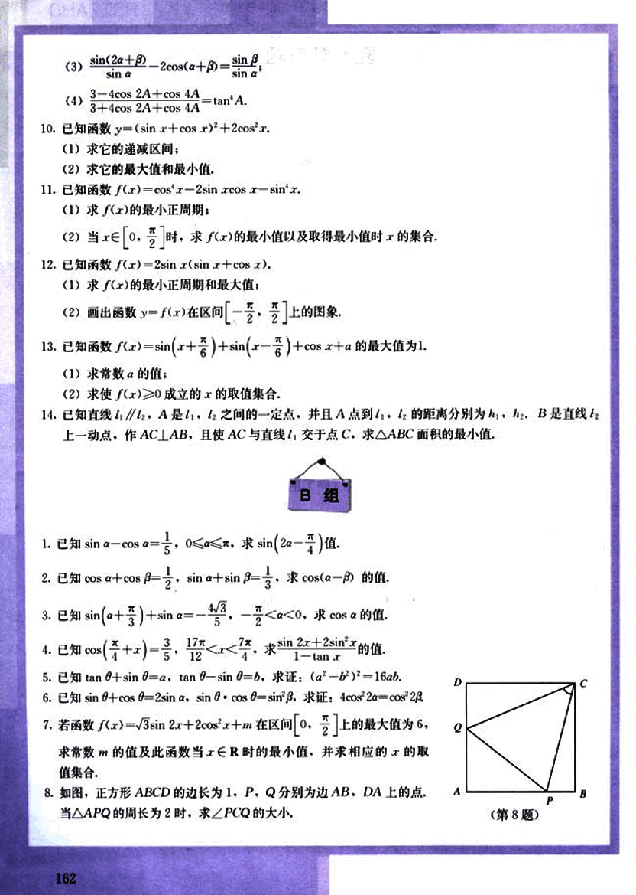
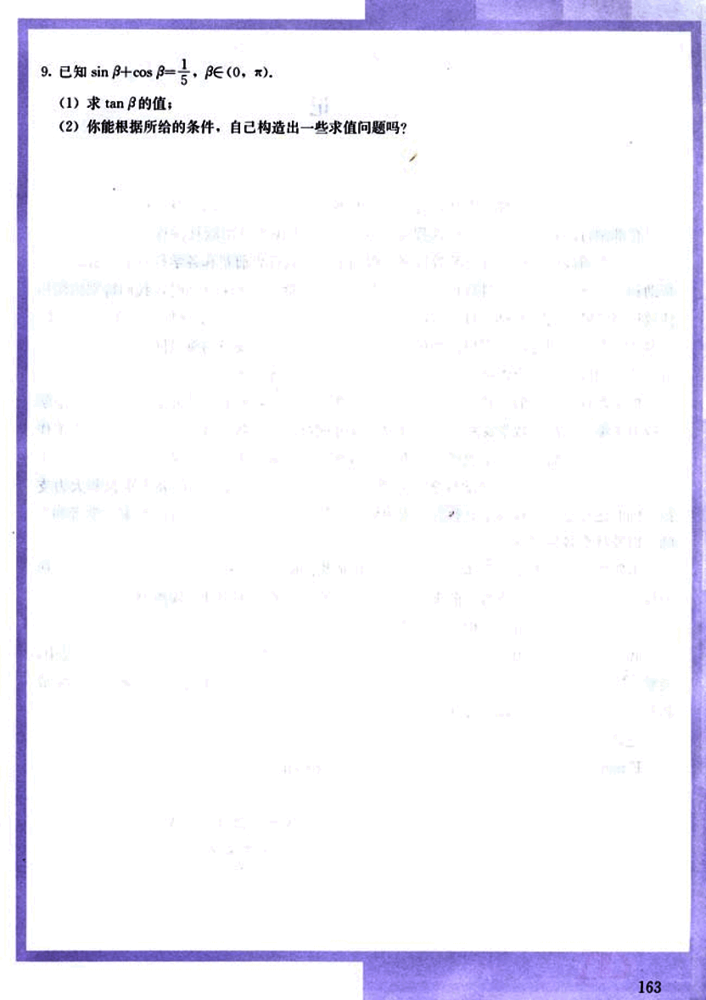

# 复习参考题

173

# 复习参考题
## A组

1. 已知α，β都是锐角，sin α = $\frac{4}{5}$，cos(α+β) = $-\frac{12}{13}$，求 sin β的值.

2. 已知 cos($\frac{\pi}{4}$-α) = $\frac{3}{5}$，sin($\frac{\pi}{4}$+β) = $\frac{12}{13}$，α∈($\frac{3\pi}{4}$, π)，β∈(0, $\frac{\pi}{4}$)，求 sin(α+β)的值.

3. 已知 sin($\frac{3\pi}{4}$+α) = $\frac{5}{13}$，cos($\frac{\pi}{4}$-β) = $\frac{3}{5}$，0 < α < $\frac{\pi}{4}$，$\frac{\pi}{4}$ < β < $\frac{3\pi}{4}$，求 sin(α+β)的值.

4. 已知α，β都是锐角，tan α = $\frac{1}{7}$，sin β = $\frac{\sqrt{10}}{10}$，求 tan(α+2β)的值.

5. (1) 证明：tan α + tan β = tan(α+β) - tan α tan β tan(α+β).

(2) 求 tan 20° + tan 40° + $\sqrt{3}$tan 20° tan 40°的值.

(3) 若 α+β = $\frac{3\pi}{4}$，求 (1-tan α)(1-tan β)的值.

(4) 求 $\frac{\tan 20^\circ + \tan 40^\circ + \tan 120^\circ}{\tan 20^\circ \tan 40^\circ}$ 的值.

6. 化简：

(1) $\frac{1}{\sin 10^\circ \cos 10^\circ}$

(2) sin 40°(tan 10° - $\sqrt{3}$)

(3) tan 70° cos 10°($\sqrt{3}$tan 20° - 1)

(4) sin 50°(1 + $\sqrt{3}$tan 10°)

7. (1) 已知 cos θ = $-\frac{3}{5}$，0 < θ < $\frac{3\pi}{2}$，求 (sin $\frac{\theta}{2}$ - cos $\frac{\theta}{2}$)$^2$ 的值.

(2) 已知 $\frac{\sin \alpha}{2}$ = $\frac{\cos \alpha}{2}$ = $\frac{1}{5}$，求 sin α的值.

(3) 已知 sin$^2$θ + cos$^2$θ = $\frac{9}{5}$，求 sin 2θ的值.

(4) 已知 cos 2θ = $\frac{20}{29}$，求 sin$^2$θ + cos$^2$θ的值.

8. 已知 cos(α+β) = $\frac{1}{5}$，cos(α-β) = $\frac{3}{5}$，求 tan α tan β的值.

9. 证明：

(1) cos 4α + 4cos 2α + 3 = 8cos$^4$α

(2) $\frac{1 + \sin 2\alpha}{2\cos^2 \alpha + \sin 2\alpha}$ = $\frac{1}{2}$ tan α + $\frac{1}{2}$

161

174

# B组

1. 已知 $\sin \alpha - \cos \alpha = \frac{1}{5}$，$0 < \alpha < \pi$，求 $\sin(2\alpha - \frac{\pi}{4})$ 值.

2. 已知 $\cos \alpha + \cos \beta = \frac{1}{2}$，$\sin \alpha + \sin \beta = \frac{1}{3}$，求 $\cos(\alpha - \beta)$ 的值.

3. 已知 $\sin(\alpha + \frac{\pi}{3}) + \sin \alpha = -\frac{4\sqrt{3}}{5}$，$-\frac{\pi}{2} < \alpha < 0$，求 $\cos \alpha$ 的值.

4. 已知 $\cos(\frac{\pi}{4} + x) = \frac{3}{5}$，$\frac{17\pi}{12} < x < \frac{7\pi}{4}$，求 $\sin 2x + 2\sin x$ 的值.

5. 已知 $\tan \theta + \sin \theta = a$，$\tan \theta - \sin \theta = b$，求证：$(a^2 - b^2)^2 = 16ab$.

6. 已知 $\sin \theta + \cos \theta = 2\sin \alpha$，$\sin \theta \cdot \cos \theta = \sin^2 \beta$，求证：$4\cos^2 2\alpha = \cos^2 2\beta$.

7. 若函数 $f(x) = \sqrt{3}\sin 2x + 2\cos^2 x + m$ 在区间 $[0, \frac{\pi}{2}]$ 上的最大值为 6，求常数 $m$ 的值及此函数当 $x \in R$ 时的最小值，并求相应的 $x$ 的取值集合.

8. 如图，正方形 ABCD 的边长为 1，P，Q 分别为边 AB，DA 上的点，当 $\triangle APQ$ 的周长为 2 时，求 $\angle PCQ$ 的大小.

[第8题](images/8.png)

175

# 9. 已知 $\sin\beta + \cos\beta = \frac{1}{5}$，$\beta \in (0, \pi)$.

(1) 求 $\tan\beta$ 的值;

(2) 你能根据所给的条件，自己构造出一些求值问题吗？

163

