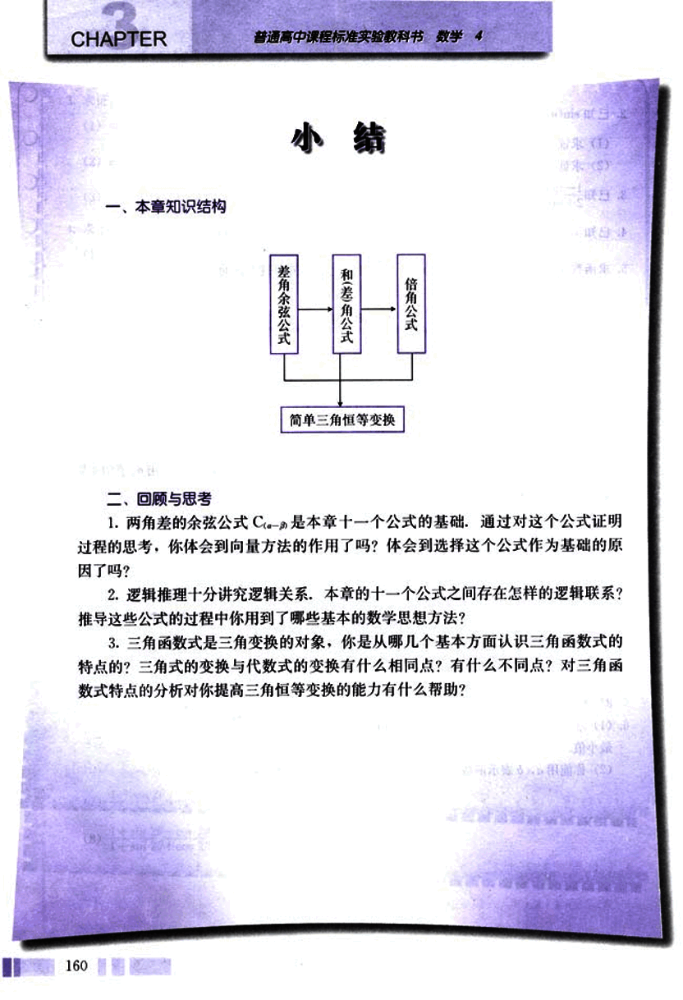

# 小结

172

# 小结

## 一、本章知识结构

```
        差角余弦公式   和(差)角公式    倍角公式
                      ↓
              简单三角恒等变换
```

## 二、回顾与思考

1. 两角差的余弦公式 $C_{\alpha-\beta}$ 是本章十一个公式的基础，通过对这个公式证明过程的思考，你体会到向量方法的作用了吗？体会到选择这个公式作为基础的原因了吗？

2. 逻辑推理十分讲究逻辑关系，本章的十一个公式之间存在怎样的逻辑联系？推导这些公式的过程中你用到了哪些基本的数学思想方法？

3. 三角函数式是三角变换的对象，你是从哪几个基本方面认识三角函数式的特点的？三角式的变换与代数式的变换有什么相同点？有什么不同点？对三角函数式特点的分析对你提高三角恒等变换的能力有什么帮助？



