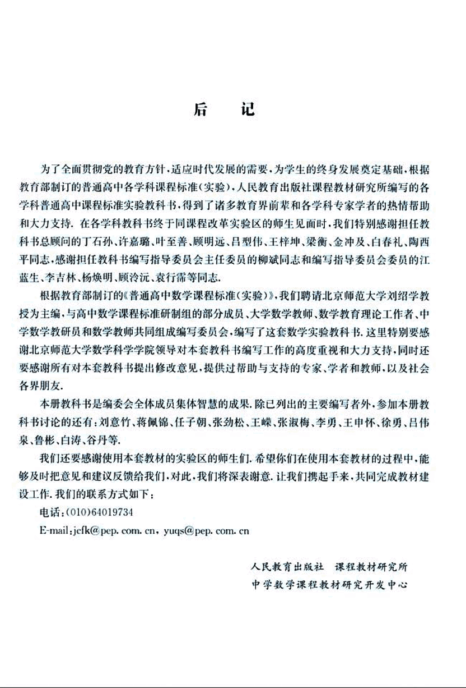

# 后记

130

# 后 记

为了全面贯彻党的教育方针，适应时代发展的需要，为学生的终身发展奠定基础，根据教育部制订的普通高中各学科课程标准(实验)，人民教育出版社课程教材研究所编写的各学科普通高中课程标准实验教科书，得到了诸多教育界前辈和各学科专家学者的热情帮助和大力支持。在各学科教科书终于同课程改革实验区的师生见面时，我们特别感谢担任教科书总顾问的丁石孙、许嘉璐、叶至善、顾明远、吕型伟、王梓坤、梁衡、金冲及、白春礼、陶西平同志，感谢担任教科书编写指导委员会主任委员的柳斌同志和编写指导委员会委员的江蓝生、李吉林、杨焕明、顾泠沅、袁行霈等同志。

根据教育部制订的《普通高中数学课程标准(实验)》，我们聘请北京师范大学刘绍学教授为主编，与高中数学课程标准研制组的部分成员、大学数学教师、数学教育理论工作者、中学数学教研员和数学教师共同组成编写委员会，编写了这套数学实验教科书。这里特别要感谢北京师范大学数学科学学院领导对本套教科书编写工作的高度重视和大力支持，同时还要感谢所有对本套教科书提出修改意见，提供过帮助与支持的专家、学者和教师，以及社会各界朋友。

本册教科书是编委会全体成员集体智慧的成果，除已列出的主要编写者外，参加本册教科书讨论的还有：刘意竹、蒋佩锦、任子朝、张劲松、王嵘、张淑梅、李勇、王申怀、徐勇、吕伟泉、鲁彬、白涛、谷丹等。

我们还要感谢使用本套教材的实验区的师生们，希望你们在使用本套教材的过程中，能够及时把意见和建议反馈给我们，对此，我们将深表谢意，让我们携起手来，共同完成教材建设工作。我们的联系方式如下：

电话：(010)64019734

E-mail: jcfk@pep.com.cn, yuqs@pep.com.cn

人民教育出版社 课程教材研究所
中学数学课程教材研究开发中心

