# 0 封面

2

# 数学 ⑤

**(Image of a laptop screen showing geometric shapes)**

not_working

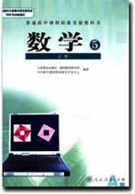
3

# 数学 5 必修

人民教育出版社 课程教材研究所 编著
中学数学课程教材研究开发中心

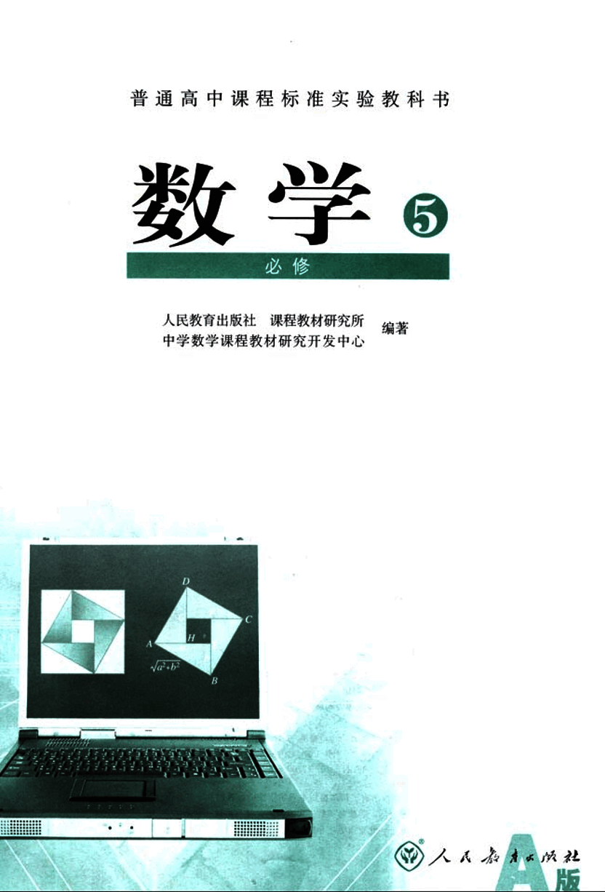
4

# 主编寄语

同学们，欢迎大家使用这套普通高中数学教科书，希望它能够成为你们学习数学的好朋友。

作为这套教科书的主编，在大家开始用这套书学习数学之前，对于为什么要学数学，如何才能学好数学等问题，我有一些想法与你们交流。

## 为什么要学数学呢？我想从以下两个方面谈谈认识。

### 数学是有用的。

在生活、生产、科学和技术中，在这套教科书中，我们都会看到数学的许多应用。实际上，“数量关系与空间形式”，在实践中，在理论中，在物质世界中，在精神世界中，处处都有，因而研究“数量关系与空间形式”的数学，处处都有用场，数学就在我们身边，她是科学的语言，是一切科学和技术的基础，是我们思考和解决问题的工具。

### 学数学能提高能力。

大家都觉得，数学学得好的人也容易学好其他理论。实际上，理论之间往往有彼此相通和共同的东西，而“数量关系与空间形式”、“逻辑结构及探索思维”等正是它们的支架或脉络，因而数学恰在它们的核心处。这样，在数学中得到的训练和修养会很好地帮助我们学习其他理论，数学素质的提高对于个人能力的发展至关重要。

## 那么，如何才能学好数学呢？我想首先应当对数学有一个正确的认识。

### 数学是自然的。

在这套教科书中出现的数学内容，是在人类长期的实践中经过千锤百炼的数学精华和基础，其中的数学概念、数学方法与数学思想的起源与发展都是自然的。如果有人感到某个概念不自然，是强加于人的，那么只要想一下它的背景，它的形成过程，它的应用，以及它与其他概念的联系，你就会发现它实际上是水到渠成、浑然天成的产物，不仅合情合理，甚至很有人情味，这将有助于大家的学习。

### 数学是清楚的。

清楚的前提，清楚的推理，得出清楚的结论，数学中的命题，对就是对，错就是错。

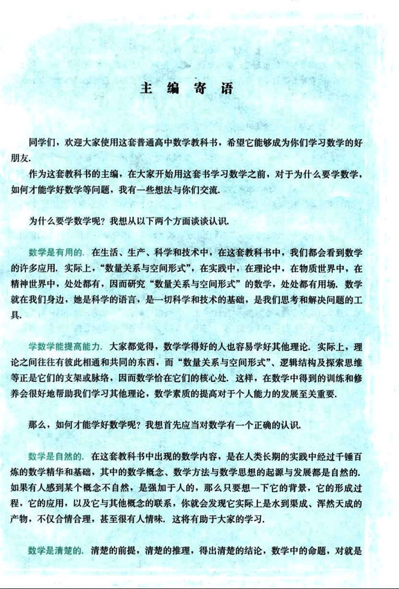
5

# 数学学习方法

对，错就是错，不存在丝毫的含糊。我们说，数学是易学的，因为它是清楚的，只要大家按照数学规则，按部就班地学，循序渐进地想，绝对可以学懂；我们又说，数学是难学的，也因为它是清楚的，如果有人不是按照数学规则去学去想，总想把“想当然”的东西强加给数学，在没有学会加法的时候就想学习乘法，那就要处处碰壁，学不下去了。

在对数学有一个正确认识的基础上，还需要讲究一点方法。

## 学习方法

学数学要摸索自己的学习方法。学习、掌握并能灵活应用数学的途径有千万条，每个人都可以有与众不同的数学学习方法。做习题、用数学解决各种问题是必需的；理解概念、学会证明、领会思想、掌握方法也是必需的；还要充分发挥问题的作用，问题使我们的学习更主动、更生动、更富探索性；要善于提问，学会提问，“凡事问个为什么”，用自己的问题和别人的问题带动自己的学习。在这套书中，我们一有机会就提问题，希望“看过问题三百个，不会解题也会问”。类比地学、联系地学，既要从一般概念中看到它的具体背景，不使概念“空洞”，又要在具体例子中想到它蕴含的一般概念，以使事物有“灵魂”。

## 数学学习的最佳时期

同学们，学数学趁年轻！你们正处在一生中接受数学训练、打好数学基础的最佳时期，这个时期下点功夫学数学，将会终生受益。我们构建了这片数学天地，期盼它有益于大家的成长。你们是这片天地的主人，希望大家在学习的过程中能对它提出宝贵的改进意见。预祝同学们愉快地生活在这片数学天地中。

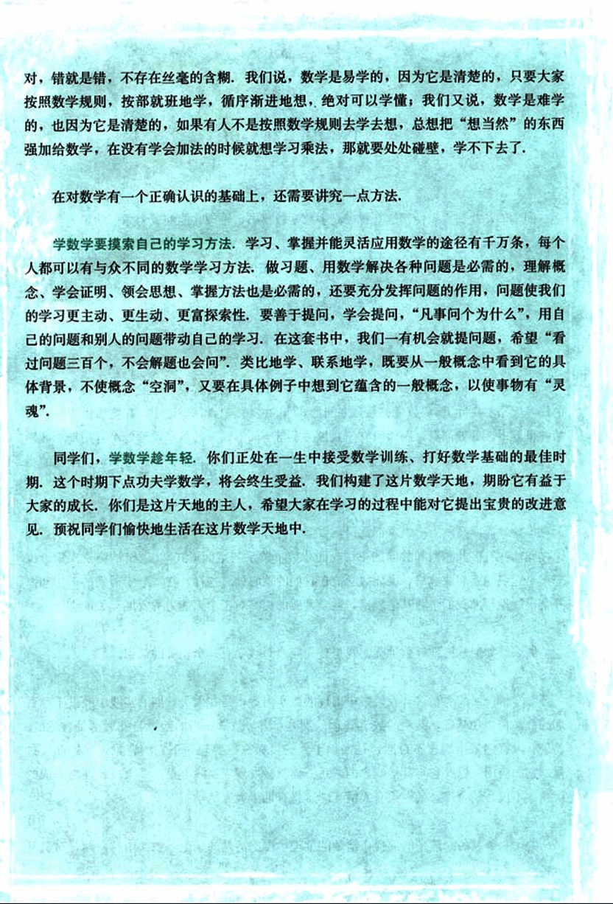
6

# 本册导引

我们根据《普通高中数学课程标准(实验)》编写了这套实验教科书，本书是高中数学必修课程5个模块中的一个，包括解三角形、数列与不等式等三章内容。

三角形是最基本的几何图形，三角形中的数量关系是最基本的数量关系，有着极其广泛的应用，我们将在以前学习的有关三角形、三角函数和解直角三角形知识的基础上，通过对于任意三角形边角关系的研究，发现并掌握三角形中的边长与角度之间的数量关系，并运用它们解决一些与测量和几何计算有关的实际问题。

数列可以看作是一种特殊的函数，它是反映自然规律的基本数学模型，尤其在计算机技术中扮演着重要角色，我们将通过对日常生活中大量实际问题的分析，建立等差数列和等比数列这两种数列模型，探索并掌握它们的一些基本数量关系，感受这两种数列模型的广泛应用，并利用它们解决一些实际问题。

不等关系与相等关系都是客观存在的基本数量关系，是数学研究的重要内容，建立不等观念、处理不等关系与处理等量问题是同样重要的，在本模块中，学生将通过具体情境，感受在现实世界和日常生活中存在着大量的不等关系，理解不等式(组)对于刻画不等关系的意义和价值；掌握求解一元二次不等式的基本方法，并能解决一些实际问题；能用二元一次不等式组表示平面区域，并尝试解决一些简单的二元线性规划问题；认识基本不等式及其简单应用；体会不等式、方程及函数之间的联系。

学习始于疑问，在本书中，我们将通过适当的问题情景，引出需要学习的数学内容，然后在“观察”“思考”“探究”等活动中，引导同学们自己发现问题、提出问题，通过亲身实践、主动思维，经历不断的从具体到抽象、从特殊到一般的抽象概括活动来理解和掌握数学基础知识，打下坚实的数学基础。

学而不思则罔，只有通过自己的独立思考才能真正学会数学，同时应当掌握科学的思维方法，在本书中，我们将利用数学内容之间的内在联系，特别是蕴涵在数学知识中的数学思想方法，启发和引导同学们学习类比、推广、特殊化、化归等数学思考的常用逻辑方法，使同学们学会数学思考与推理，不断提高数学思维能力。

学习的目的在于应用，在本书中，我们将努力为同学们提供应用数学知识解决各种数学内外问题的机会，以使同学们加深对数学概念本质的理解，认识数学知识与实际的联系，并学会用数学知识和方法解决一些实际问题，另外，我们还开辟了“观察与猜想”

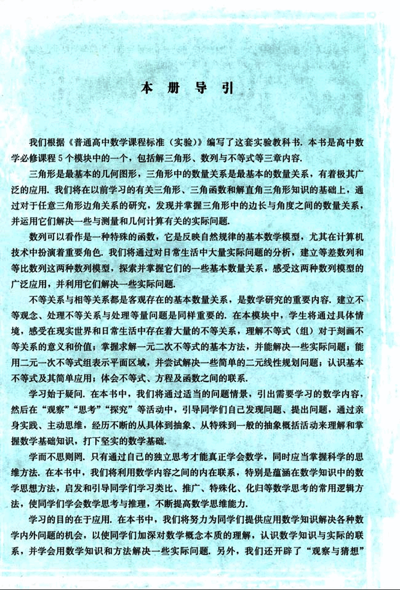
7

# “阅读与思考”“探究与发现”“信息技术应用”等拓展性栏目

“阅读与思考”“探究与发现”“信息技术应用”等拓展性栏目，为同学们提供选学素材，有兴趣的同学可以自主选择其中的一些内容进行探究。

祝愿同学们通过本册书的学习，不但学到更多的数学知识，而且在数学能力、用数学解决问题的能力等方面都有较大提高，并培养起更高的数学学习兴趣，形成对数学的更加全面的认识。

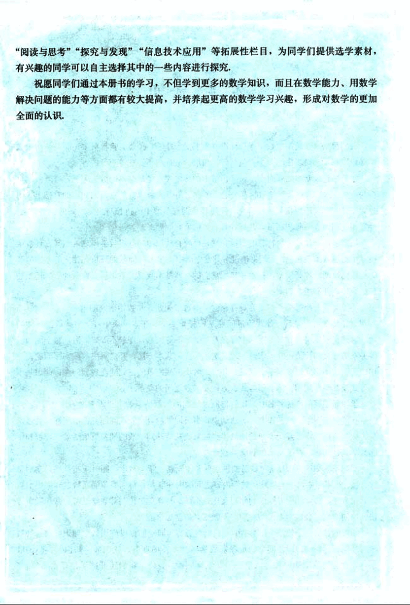
8

# 主编: 刘绍学
## 副主编: 钱珮玲 章建跃

# 本册主编: 李建华
## 主要编者: 俞求是 李建华 宋莉莉 薛彬 郭玉峰 张炜卓 杨照宇
## 责任编辑: 俞求是
## 美术编辑: 王俊宏
## 设计: 王艾
## 封面设计: 林荣桓

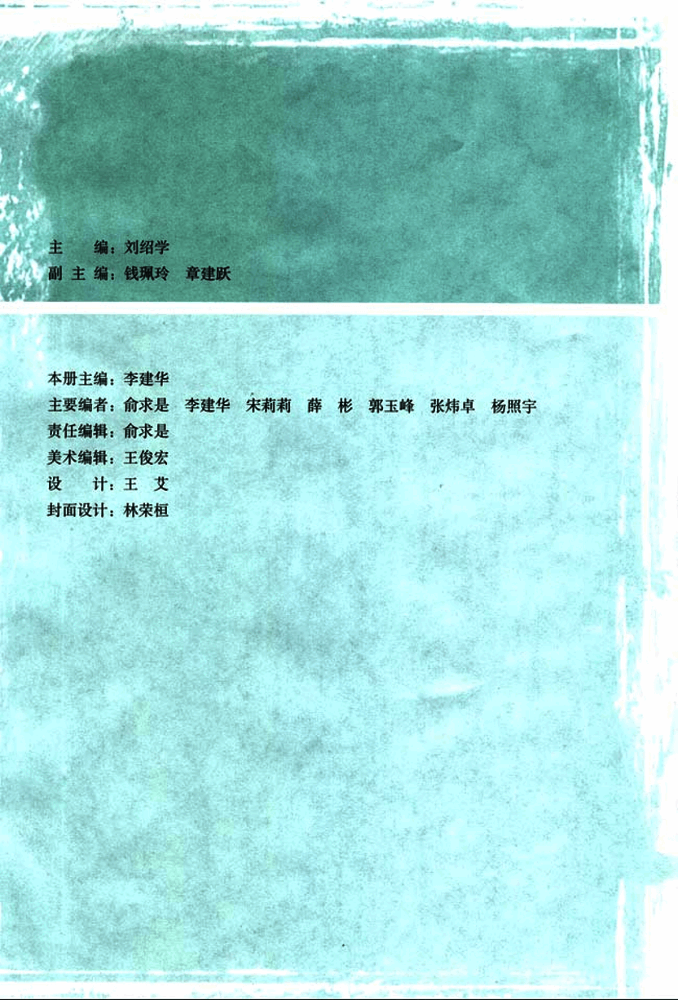
9

# 数学 5

## 必修

A版

人民教育出版社 课程教材研究所 编著
中学数学课程教材研究开发中心

人人文艺出版社 出版发行
(北京沙滩后街55号 邮编: 100009)
网址: http://www.pep.com.cn
北京四季青印刷厂印装 全国新华书店经销

开本: 890毫米×1240毫米 1/16  印张: 8  字数: 150000
2004年5月第1版 2004年10月第1次印刷
ISBN 7-107-17709-5
G・10798(课) 定价: 8.80元

著作权所有・请勿擅用本书制作各类出版物・违者必究
如发现印、装质量问题，影响阅读，请与出版社联系调换。
(联系地址: 北京市方庄小区芳城园三区13号楼 邮编: 100078)

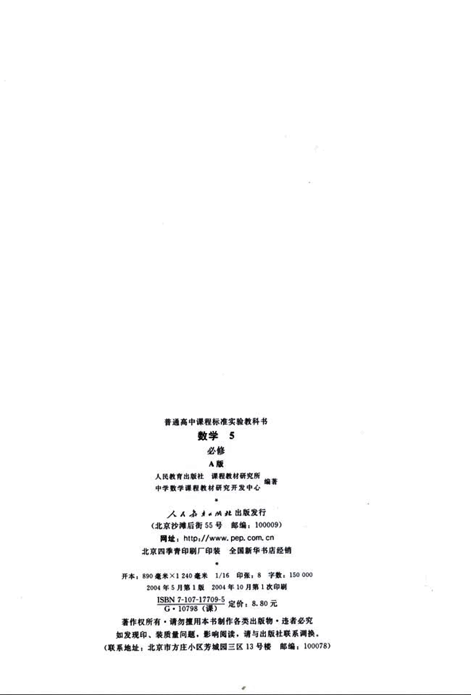
10

# 本书部分常用符号

| 符号 | 说明 |
|---|---|
| sin x | x 的正弦 |
| cos x | x 的余弦 |
| tan x | x 的正切 |
| cot x | x 的余切 |
| sin²x | sin x 的平方 |
| **a** | 向量 a |
| **N** | 正整数集 |
| $a_n$ | 数列 {$a_n$} 的第 n 项 |
| $S_n$ | 数列前 n 项的和 |
| d | 等差数列的公差 |
| q | 等比数列的公比 |
| > | 大于 |
| < | 小于 |
| ≥ | 大于或等于 |
| ≤ | 小于或等于 |

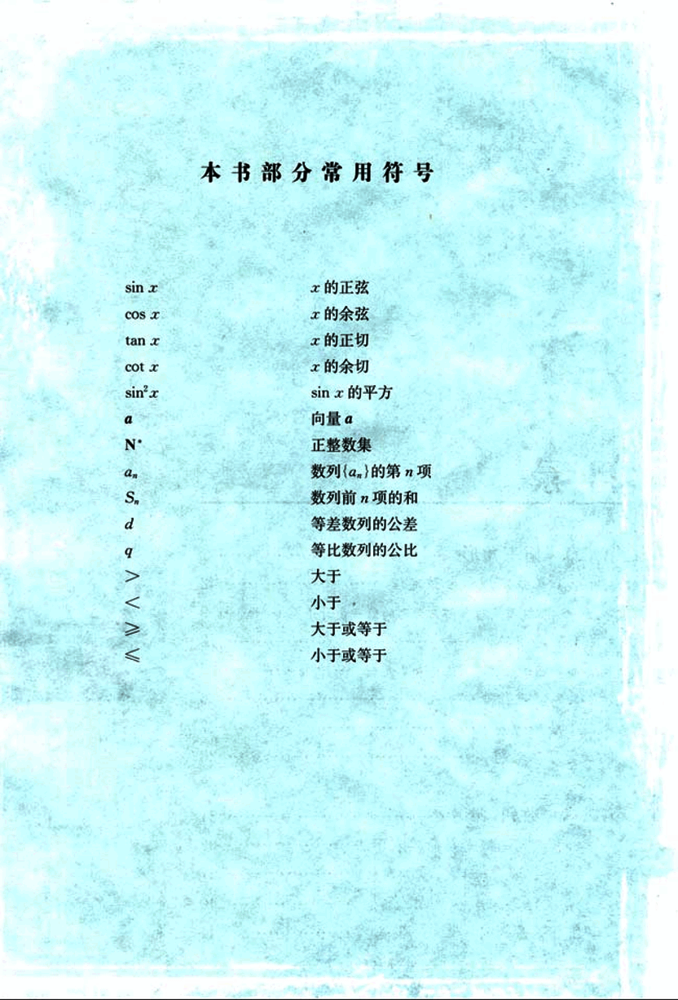
11

# 目录

# 第一章 解三角形 1

## 1.1 正弦定理和余弦定理 2

探究与发现 解三角形的进一步讨论 9

## 1.2 应用举例 12

阅读与思考 海伦和秦九韶 25

## 1.3 实习作业 26

小结 27

复习参考题 28

# 第二章 数列 31

## 2.1 数列的概念与简单表示法 32

阅读与思考 斐波那契数列 37

信息技术应用 估计√2的值 40

## 2.2 等差数列 41

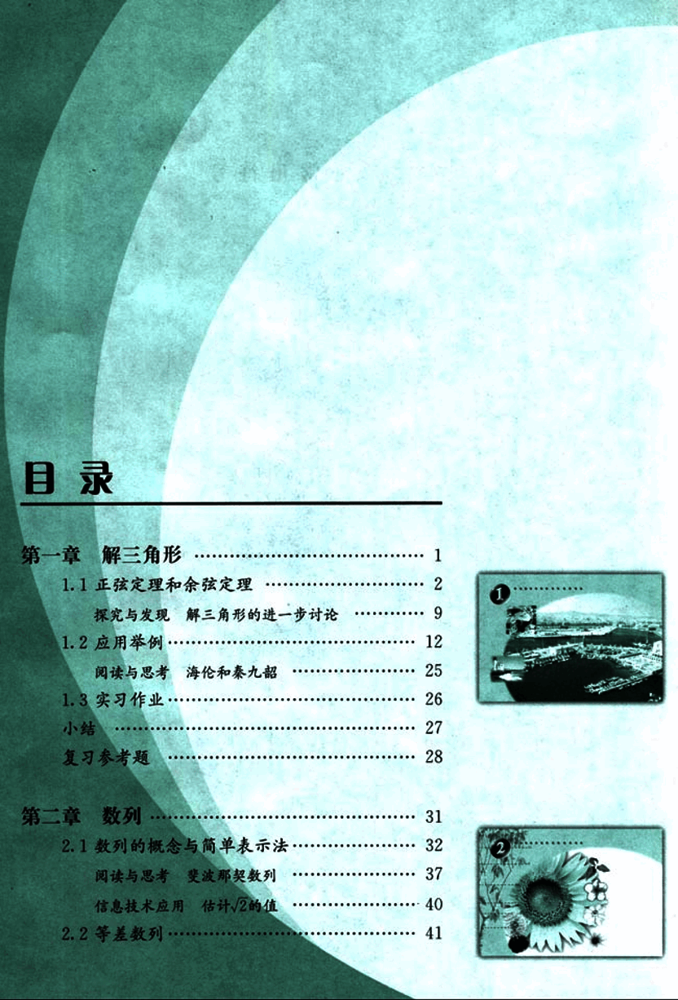
12

# 第三章 不等式

79

## 3.1 不等关系与不等式

80

## 3.2 一元二次不等式及其解法

84

## 3.3 二元一次不等式(组)与简单的线性规划问题

91

阅读与思考  错在哪儿  104

信息技术应用 用Excel 解线性规划问题举例 107

## 3.4 基本不等式: √ab ≤ $\frac{a+b}{2}$

109

小结  114

复习参考题  115

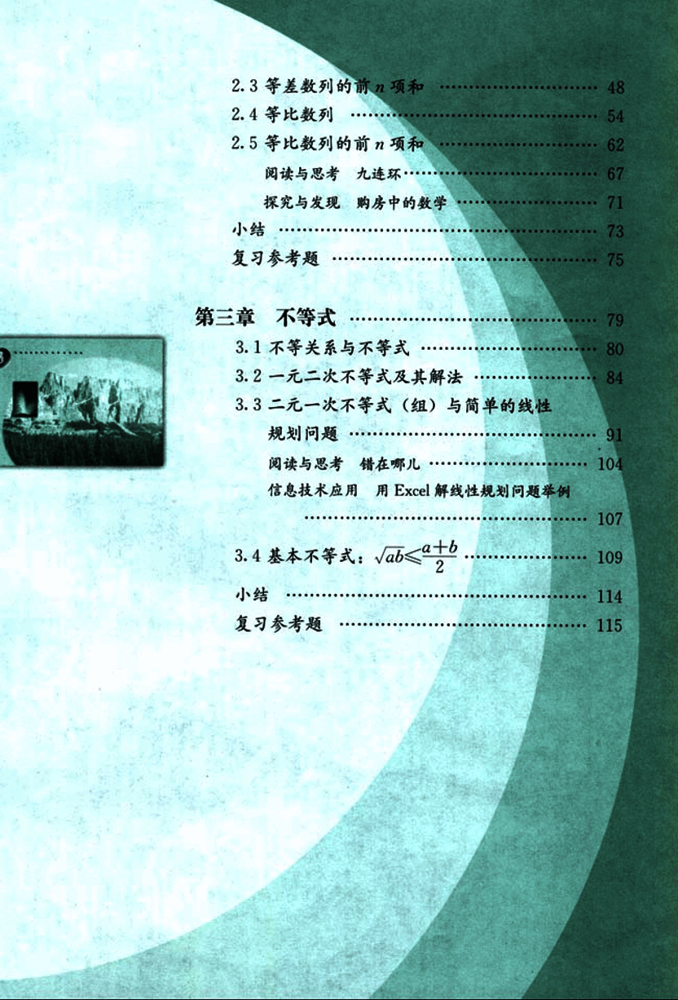
