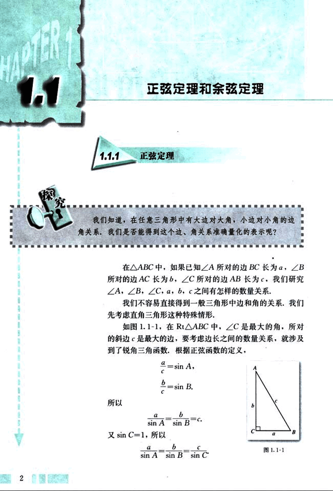
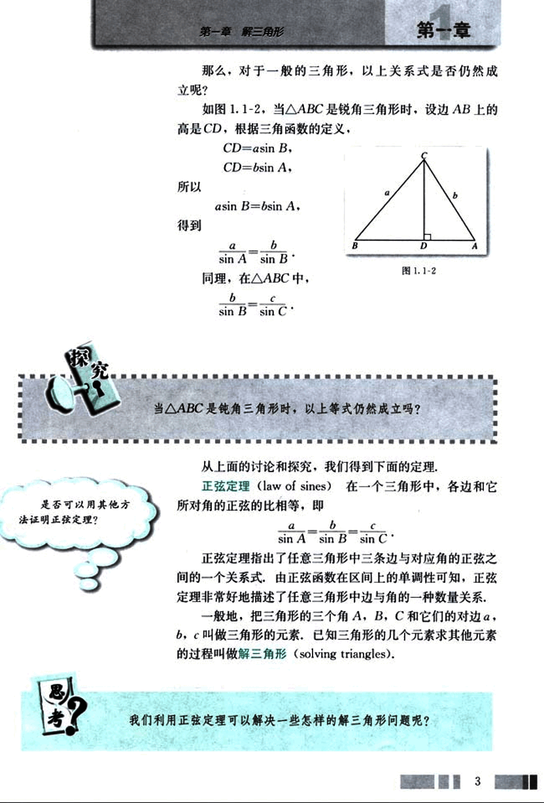
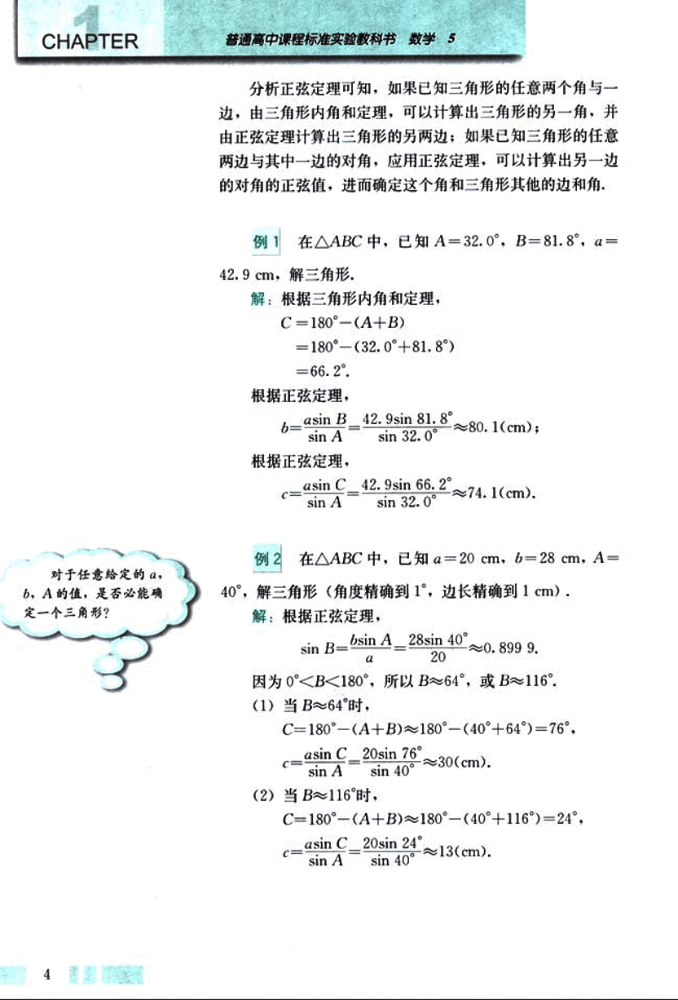
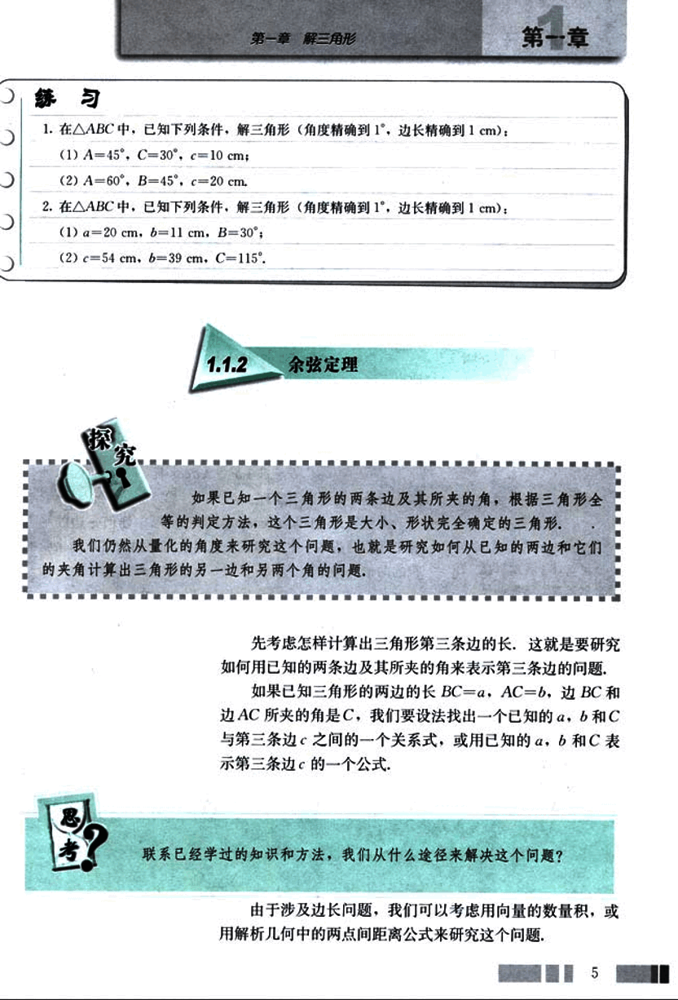
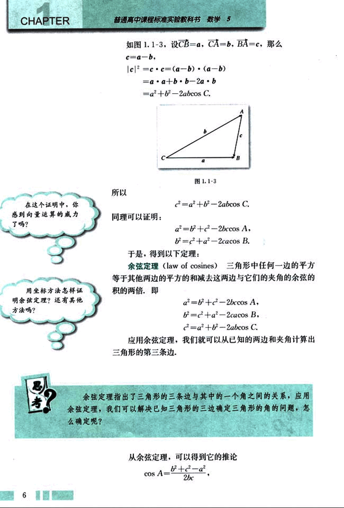
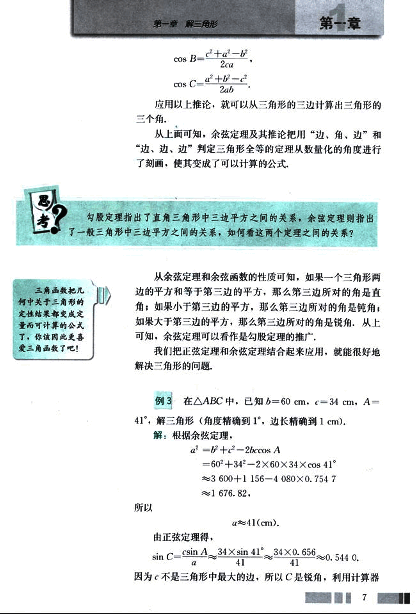
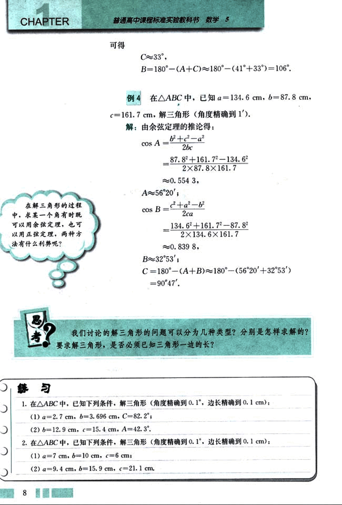
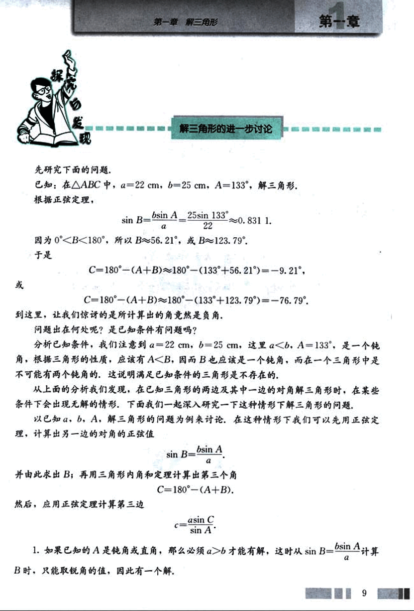
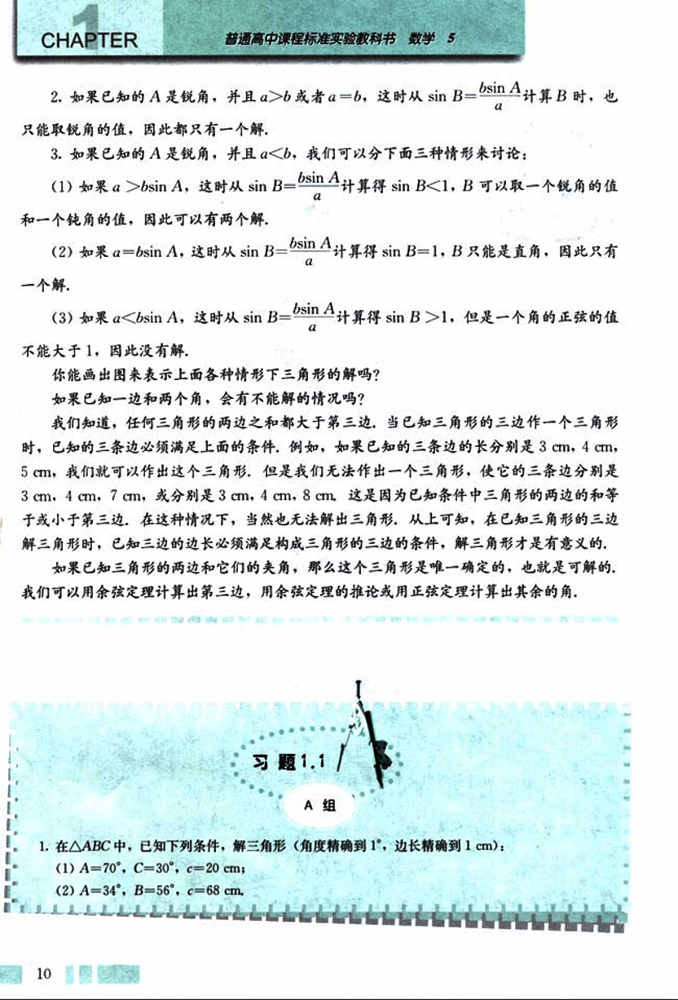
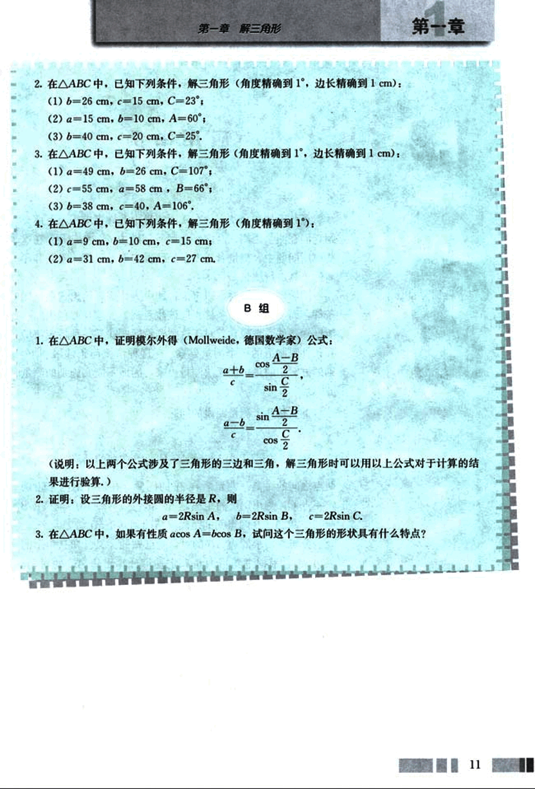

# 1.1 　正弦定理和余弦定理

15

# CHAPTER 1

## 1.1 正弦定理和余弦定理

### 1.1.1 正弦定理

我们知道，在任意三角形中有大边对大角，小边对小角的边角关系，我们是否能得到这个边、角关系准确量化的表示呢？

在 △ABC 中，如果已知 ∠A 所对的边 BC 长为 a，∠B 所对的边 AC 长为 b，∠C 所对的边 AB 长为 c，我们研究 ∠A，∠B，∠C，a，b，c 之间有怎样的数量关系。

我们不容易直接得到一般三角形中边和角的关系，我们先考虑直角三角形这种特殊情形。

如图 1.1-1，在 Rt△ABC 中，∠C 是最大的角，所对的斜边 c 是最大的边，要考虑边长之间的数量关系，就涉及到了锐角三角函数，根据正弦函数的定义，

$\frac{a}{c} = \sin A$

$\frac{b}{c} = \sin B$

所以

$\frac{a}{\sin A} = \frac{b}{\sin B} = c$

又$\sin C = 1$，所以

$\frac{a}{\sin A} = \frac{b}{\sin B} = \frac{c}{\sin C}$

[图 1.1-1](images/1.1-1.png)

2

16

# 第一章 解三角形

## 第一节

那么,对于一般的三角形,以上关系式是否仍然成立呢?

如图 1.1-2,当 △ABC 是锐角三角形时,设边 AB 上的高是 CD,根据三角函数的定义,

CD = asin B,

CD = bsin A,

所以

asin B = bsin A,

得到

$\frac{a}{\sin A} = \frac{b}{\sin B}$

同理,在 △ABC 中,

$\frac{b}{\sin B} = \frac{c}{\sin C}$

当 △ABC 是钝角三角形时,以上等式仍然成立吗?

从上面的讨论和探究,我们得到下面的定理,

**正弦定理**(law of sines) 在一个三角形中,各边和它所对角的正弦的比相等,即

$\frac{a}{\sin A} = \frac{b}{\sin B} = \frac{c}{\sin C}$

正弦定理指出了任意三角形中三条边与对应角的正弦之间的一个关系式,由正弦函数在区间上的单调性可知,正弦定理非常好地描述了任意三角形中边与角的一种数量关系. 一般地,把三角形的三个角 A,B,C 和它们的对边 a,b,c 叫做三角形的元素,已知三角形的几个元素求其他元素的过程叫做解三角形(solving triangles).

我们利用正弦定理可以解决一些怎样的解三角形问题呢?

3

17

# CHAPTER

普通高中课程标准实验教科书 数学 5

分析正弦定理可知,如果已知三角形的任意两个角与一边,由三角形内角和定理,可以计算出三角形的另一角,并由正弦定理计算出三角形的另两边;如果已知三角形的任意两边与其中一边的对角,应用正弦定理,可以计算出另一边的对角的正弦值,进而确定这个角和三角形其他的边和角。

## 例 1

在 △ABC 中,已知 A=32.0°, B=81.8°, a=42.9 cm,解三角形.

解:根据三角形内角和定理,

C = 180° - (A + B)

= 180° - (32.0° + 81.8°)

= 66.2°.

根据正弦定理,

$b = \frac{a \sin B}{\sin A} = \frac{42.9 \sin 81.8°}{\sin 32.0°} \approx 80.1 (cm);$

根据正弦定理,

$c = \frac{a \sin C}{\sin A} = \frac{42.9 \sin 66.2°}{\sin 32.0°} \approx 74.1 (cm).$

对于任意给定的 a, b, A 的值,是否必能确定一个三角形?

## 例 2

在 △ABC 中,已知 a=20 cm, b=28 cm, A=40°,解三角形(角度精确到 1°,边长精确到 1 cm).

解:根据正弦定理,

$\sin B = \frac{b \sin A}{a} = \frac{28 \sin 40°}{20} \approx 0.8999.$

因为 0°<B<180°,所以 B≈64°,或 B≈116°.

(1) 当 B≈64° 时,

C = 180° - (A + B) ≈ 180° - (40° + 64°) = 76°,

$c = \frac{a \sin C}{\sin A} = \frac{20 \sin 76°}{\sin 40°} \approx 30 (cm).$

(2) 当 B≈116° 时,

C = 180° - (A + B) ≈ 180° - (40° + 116°) = 24°,

$c = \frac{a \sin C}{\sin A} = \frac{20 \sin 24°}{\sin 40°} \approx 13 (cm).$

4

18

# 第一章 解三角形

## 练习

1. 在 △ABC 中，已知下列条件，解三角形（角度精确到 1°，边长精确到 1 cm）：
   (1) A=45°，C=30°，c=10 cm；
   (2) A=60°，B=45°，c=20 cm.

2. 在 △ABC 中，已知下列条件，解三角形（角度精确到 1°，边长精确到 1 cm）：
   (1) a=20 cm，b=11 cm，B=30°；
   (2) c=54 cm，b=39 cm，C=115°.

## 1.1.2 余弦定理

如果已知一个三角形的两条边及其所夹的角，根据三角形全等的判定方法，这个三角形是大小、形状完全确定的三角形。
我们仍然从量化的角度来研究这个问题，也就是研究如何从已知的两边和它们
的夹角计算出三角形的另一边和另两个角的问题。

先考虑怎样计算出三角形第三条边的长，这就是要研究如何用已知的两条边及其所夹的角来表示第三条边的问题。

如果已知三角形的两边的长 BC=a，AC=b，边 BC 和边 AC 所夹的角是 C，我们要设法找出一个已知的 a，b 和 C 与第三条边 c 之间的一个关系式，或用已知的 a，b 和 C 表示第三条边 c 的一个公式。

联系已经学过的知识和方法，我们从什么途径来解决这个问题？

由于涉及边长问题，我们可以考虑用向量的数量积，或用解析几何中的两点间距离公式来研究这个问题。

5

19

# CHAPTER 1

普通高中课程标准实验教科书 数学 5

如图 1.1-3,设 CB=a, CA=b, BA=c,那么

$c = a - b,$

$|c|^2 = c \cdot c = (a - b) \cdot (a - b)$

$= a \cdot a + b \cdot b - 2a \cdot b$

$= a^2 + b^2 - 2abcos C.$

图 1.1-3

所以

$c^2 = a^2 + b^2 - 2abcos C.$

同理可以证明:

$a^2 = b^2 + c^2 - 2bccos A,$

$b^2 = c^2 + a^2 - 2cacos B.$

于是，得到以下定理：

**余弦定理**(law of cosines): 三角形中任何一边的平方等于其他两边的平方的和减去这两边与它们的夹角的余弦的积的两倍，即

$a^2 = b^2 + c^2 - 2bccos A,$

$b^2 = c^2 + a^2 - 2cacos B,$

$c^2 = a^2 + b^2 - 2abcos C.$

应用余弦定理，我们就可以从已知的两边和夹角计算出三角形的第三条边。

**思考**

余弦定理指出了三角形的三条边与其中的一个角之间的关系，应用余弦定理，我们可以解决已知三角形的三边确定三角形的角的问题，怎么确定呢？

从余弦定理，可以得到它的推论

$cos A = \frac{b^2 + c^2 - a^2}{2bc},$

20

# 第一章 解三角形

## cos B = $\frac{c^2 + a^2 - b^2}{2ca}$, cos C = $\frac{a^2 + b^2 - c^2}{2ab}$

应用以上推论，就可以从三角形的三边计算出三角形的三个角。

从上面可知，余弦定理及其推论把用“边、角、边”和“边、边、边”判定三角形全等的定理从数量化的角度进行了刻画，使其变成了可以计算的公式。

思考

勾股定理指出了直角三角形中三边平方之间的关系，余弦定理则指出了一般三角形中三边平方之间的关系，如何看这两个定理之间的关系？

从余弦定理和余弦函数的性质可知，如果一个三角形两边的平方和等于第三边的平方，那么第三边所对的角是直角；如果小于第三边的平方，那么第三边所对的角是钝角；如果大于第三边的平方，那么第三边所对的角是锐角。从上可知，余弦定理可以看作是勾股定理的推广。

我们把正弦定理和余弦定理结合起来应用，就能很好地解决三角形的问题。

## 例 3

在 △ABC 中，已知 b = 60 cm，c = 34 cm，A = 41°，解三角形（角度精确到 1°，边长精确到 1 cm）。

解：根据余弦定理，

$a^2 = b^2 + c^2 - 2bc \cos A$

$= 60^2 + 34^2 - 2 × 60 × 34 × \cos 41°$

≈ 3 600 + 1 156 - 4 080 × 0.754 7

≈ 1 676.82，

所以

a ≈ 41(cm).

由正弦定理得，

$\sin C = \frac{c \sin A}{a} = \frac{34 \times \sin 41°}{41} \approx \frac{34 \times 0.656}{41} \approx 0.544 0$.

因为 c 不是三角形中最大的边，所以 C 是锐角，利用计算器

21

# CHAPTER 1

## 可得

C≈33°

B = 180° - (A + C) ≈ 180° - (41° + 33°) = 106°

## 例 4

在 △ABC 中，已知 a = 134.6 cm，b = 87.8 cm，c = 161.7 cm，解三角形（角度精确到 1′）。

解：由余弦定理的推论得：

cos A = $\frac{b^2 + c^2 - a^2}{2bc}$

= $\frac{87.8^2 + 161.7^2 - 134.6^2}{2 × 87.8 × 161.7}$

≈ 0.554 3

A ≈ 56°20′

cos B = $\frac{c^2 + a^2 - b^2}{2ca}$

= $\frac{134.6^2 + 161.7^2 - 87.8^2}{2 × 134.6 × 161.7}$

≈ 0.839 8

B ≈ 32°53′

C = 180° - (A + B) ≈ 180° - (56°20′ + 32°53′) = 90°47′

## 练习

1. 在 △ABC 中，已知下列条件，解三角形（角度精确到 0.1°，边长精确到 0.1 cm）：

(1) a = 2.7 cm, b = 3.696 cm, C = 82.2°；

(2) b = 12.9 cm, c = 15.4 cm, A = 42.3°。

2. 在 △ABC 中，已知下列条件，解三角形（角度精确到 0.1°，边长精确到 0.1 cm）：

(1) a = 7 cm, b = 10 cm, c = 6 cm；

(2) a = 9.4 cm, b = 15.9 cm, c = 21.1 cm。

22

# 第一章 解三角形

## 解三角形的进一步讨论

先研究下面的问题：

已知：在 △ABC 中，a=22 cm，b=25 cm，A=133°，解三角形。

根据正弦定理，

$\sin B = \frac{b \sin A}{a} = \frac{25 \sin 133^\circ}{22} \approx 0.831$

因为 0° < B < 180°，所以 B ≈ 56.21°，或 B ≈ 123.79°。

于是

C = 180° - (A + B) ≈ 180° - (133° + 56.21°) = -9.21°，

或

C = 180° - (A + B) ≈ 180° - (133° + 123.79°) = -76.79°。

到这里，让我们惊讶的是所计算出的角竟然是负角。

问题出在何处呢？是已知条件有问题吗？

分析已知条件，我们注意到 a = 22 cm，b = 25 cm，这里 a < b，A = 133°，是一个钝角，根据三角形的性质，应该有 A < B，因而 B 也应该是一个钝角，而在一个三角形中是不可能有两个钝角的，这说明满足已知条件的三角形是不存在的。

从上面的分析我们发现，在已知三角形的两边及其中一边的对角解三角形时，在某些条件下会出现无解的情形，下面我们一起深入研究一下这种情形下解三角形的问题。

以已知 a，b，A，解三角形的问题为例来讨论，在这种情形下我们可以先用正弦定理，计算出另一边的对角的正弦值

$\sin B = \frac{b \sin A}{a}$

并由此求出 B；再用三角形内角和定理计算出第三个角

C = 180° - (A + B)。

然后，应用正弦定理计算第三边

$c = \frac{a \sin C}{\sin A}$

1. 如果已知的 A 是钝角或直角，那么必须 a > b 才能有解，这时从 $\sin B = \frac{b \sin A}{a}$ 计算 B 时，只能取锐角的值，因此只有一个解。

9

23

# CHAPTER

普通高中课程标准实验教科书 数学 5

2. 如果已知的 A 是锐角,并且 a>b 或者 a=b,这时从$\sin B = \frac{b \sin A}{a}$计算 B 时,也只能取锐角的值,因此都只有一个解.

3. 如果已知的 A 是锐角,并且 a<b,我们可以分下面三种情形来讨论:

(1)如果 a>b$\sin A$,这时从 $\sin B = \frac{b \sin A}{a}$计算得 $\sin B$<1, B 可以取一个锐角的值和一个钝角的值,因此可以有两个解.

(2) 如果 a=b$\sin A$,这时从 $\sin B = \frac{b \sin A}{a}$计算得 $\sin B$=1, B 只能是直角,因此只有一个解.

(3) 如果 a<b$\sin A$,这时从$\sin B = \frac{b \sin A}{a}$计算得 $\sin B$>1,但是一个角的正弦的值不能大于 1,因此没有解.

你能画出图来表示上面各种情形下三角形的解吗?

如果已知一边和两个角,会有不能解的情况吗?

我们知道,任何三角形的两边之和都大于第三边,当已知三角形的三边作一个三角形时,已知的三条边必须满足上面的条件,例如,如果已知的三条边的长分别是 3cm, 4 cm, 5cm,我们就可以作出这个三角形,但是我们无法作出一个三角形,使它的三条边分别是 3 cm. 4cm,7cm,或分别是 3cm,4cm,8cm,这是因为已知条件中三角形的两边的和等于或小于第三边,在这种情况下,当然也无法解出三角形,从上可知,在已知三角形的三边解三角形时,已知三边的边长必须满足构成三角形的三边的条件,解三角形才是有意义的,

如果已知三角形的两边和它们的夹角,那么这个三角形是唯一确定的,也就是可解的,我们可以用余弦定理计算出第三边,用余弦定理的推论或用正弦定理计算出其余的角.

## 习题 1.1

**A 组**

1.在 △ABC 中,已知下列条件,解三角形(角度精确到 1°,边长精确到 1cm):

(1) A=70°, C=30°, c=20 cm;

(2) A=34°, B=56°, c=68 cm,

10

24

# 第一章 解三角形

2. 在 △ABC 中，已知下列条件，解三角形（角度精确到 1°，边长精确到 1cm）：
   (1) b=26 cm, c=15 cm, C=23°；
   (2) a=15 cm, b=10 cm, A=60°；
   (3) b=40 cm, c=20 cm, C=25°.

3. 在 △ABC 中，已知下列条件，解三角形（角度精确到 1°，边长精确到 1cm）：
   (1) a=49 cm, b=26 cm, C=107°；
   (2) c=55 cm, a=58 cm, B=66°；
   (3) b=38 cm, c=40, A=106°.

4. 在 △ABC 中，已知下列条件，解三角形（角度精确到 1°）：
   (1) a=9 cm, b=10 cm, c=15 cm；
   (2) a=31 cm, b=42 cm, c=27 cm.

## B 组

1. 在 △ABC 中，证明模尔外得(Mollweide，德国数学家)公式：
   $\frac{a+b}{c} = \frac{\cos \frac{A-B}{2}}{\sin \frac{C}{2}}$，
   $\frac{a-b}{c} = \frac{\sin \frac{A-B}{2}}{\cos \frac{C}{2}}$.

(说明：以上两个公式涉及了三角形的三边和三角，解三角形时可以用以上公式对于计算的结果进行验算。)

2. 证明：设三角形的外接圆的半径是 R，则
   a=2Rsin A, b=2Rsin B, c=2Rsin C.

3. 在 △ABC 中，如果有性质 acos A=bcos B，试问这个三角形的形状具有什么特点？

11

