# 1.2　应用举例

25

# 1.2 应用举例

正弦定理和余弦定理在实际测量中有许多应用，下面介绍它们在测量距离、高度、角度等问题中的一些应用。在这些应用问题中，测量者借助于经纬仪与钢卷尺等测量角和距离的工具进行测量。

同学们在学习时可以考虑，题中为什么要给出这些已知条件，而不是其他的条件？应该注意到，例题及习题中的一组已知条件，常隐含着对于这类测量问题在某一种特定情境和条件限制下的一个测量方案，在这种情境与条件限制下，别的方案中的量可能无法测量出来，因而不能实施别的测量方案。

下面是几个测量距离的问题。

## 例 1

如图 1.2-1，设 A、B 两点在河的两岸，要测量两点之间的距离，测量者在 A 的同侧，在所在的河岸边选定一点 C，测出 AC 的距离是 55 m，∠BAC = 51°，∠ACB = 75°。求 A、B 两点间的距离（精确到 0.1 m）。

分析：所求的边 AB 的对角是已知的，又已知三角形的一边 AC，根据三角形内角和定理可计算出边 AC 的对角，根据正弦定理，可以计算出边 AB。

[图 1.2-1](images/1.2-1.png)

---

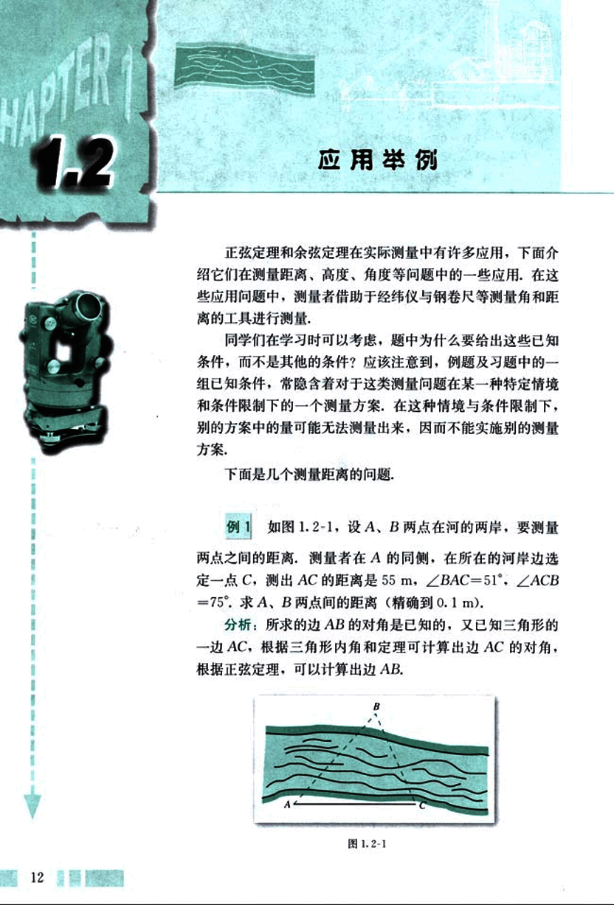
26

# 第一章 解三角形

解:根据正弦定理,得

$\frac{AB}{\sin \angle ACB} = \frac{AC}{\sin \angle ABC}$

$AB = \frac{AC \sin \angle ACB}{\sin \angle ABC}$

$= \frac{55 \sin \angle ACB}{\sin \angle ABC}$

$= \frac{55 \sin 75^\circ}{\sin (180^\circ - 51^\circ - 75^\circ)}$

$= \frac{55 \sin 75^\circ}{\sin 54^\circ}$

$\approx 65.7 (m).$

答:A、B两点间的距离为65.7米.

## 例2

如图1.2-2, A、B两点都在河的对岸(不可到达),设计一种测量A、B两点间距离的方法.

分析:用例1的方法,可以计算出河的这一岸的一点C到对岸两点的距离,再测出∠BCA的大小,借助于余弦定理可以计算出A、B两点间距离.

[图1.2-2](images/1.2-2.png)

解:测量者可以在河岸边选定两点C、D,测得CD=a,并且在C、D两点分别测得∠BCA=α, ∠ACD=β, ∠CDB=γ, ∠BDA=δ. 在△ADC和△BDC中,应用正弦定理得

$AC = \frac{a \sin(\gamma + \delta)}{\sin(180^\circ - (\beta + \gamma + \delta))} = \frac{a \sin(\gamma + \delta)}{\sin(\beta + \gamma + \delta)}$

$BC = \frac{a \sin \gamma}{\sin(180^\circ - (\alpha + \beta + \gamma))} = \frac{a \sin \gamma}{\sin(\alpha + \beta + \gamma)}$

计算出AC和BC后,再在△ABC中,应用余弦定理计算出AB两点间的距离

$AB = \sqrt{AC^2 + BC^2 - 2AC \times BC \cos \alpha}.$

13

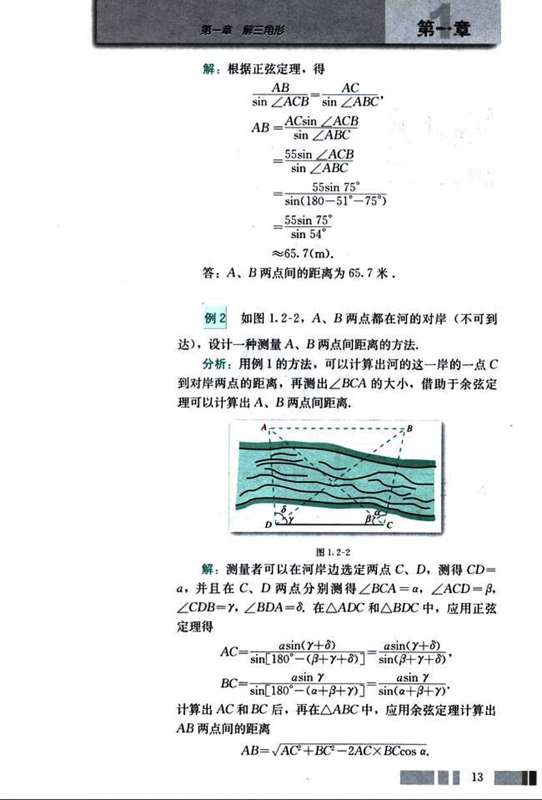
27

# CHAPTER

普通高中课程标准实验教科书 数学 5

请同学们想一想，还有没有别的测量方法。

在测量上，我们根据测量需要适当确定的线段叫做基线，如例1中的AC，例2中的CD。在测量过程中，要根据实际需要选取合适的基线长度，使测量具有较高的精确度，一般来说，基线越长，测量的精确度越高。例如，早在1671年，两位法国天文学家为了测量地球与月球之间的距离，利用几乎位于同一子午线的柏林与好望角，测量计算出α，β的大小和两地之间的距离AB，从而算出了地球与月球之间的距离约为385 400 km (图1.2-3)。我们在地球上所能用的最长的基线是地球椭圆轨道的长轴的长。当然，随着科学技术的发展，还有一些更加先进与准确的测量距离的方法。

## 练习

1. 如图，一艘船以32.2 n mile/h的速度向正北航行，在A处看灯塔S在船的北偏东20°的方向，30 min后航行到B处，在B处看灯塔在船的北偏东65°的方向，已知距离此灯塔6.5 n mile以外的海区为航行安全区域，这艘船可以继续沿正北方向航行吗？

2. 自动卸货汽车的车箱采用液压机构，设计时需要计算油泵顶杆BC的长度，已知车箱的最大仰角是60°，油泵顶点B与车箱支点A之间的距离为1.95 m，AB与水平线之间的夹角为6°20′，AC长为1.40 m，计算BC的长（精确到0.01 m）。

[图1](images/图1.png)
[图2](images/图2.png)
[图3](images/图3.png)

14
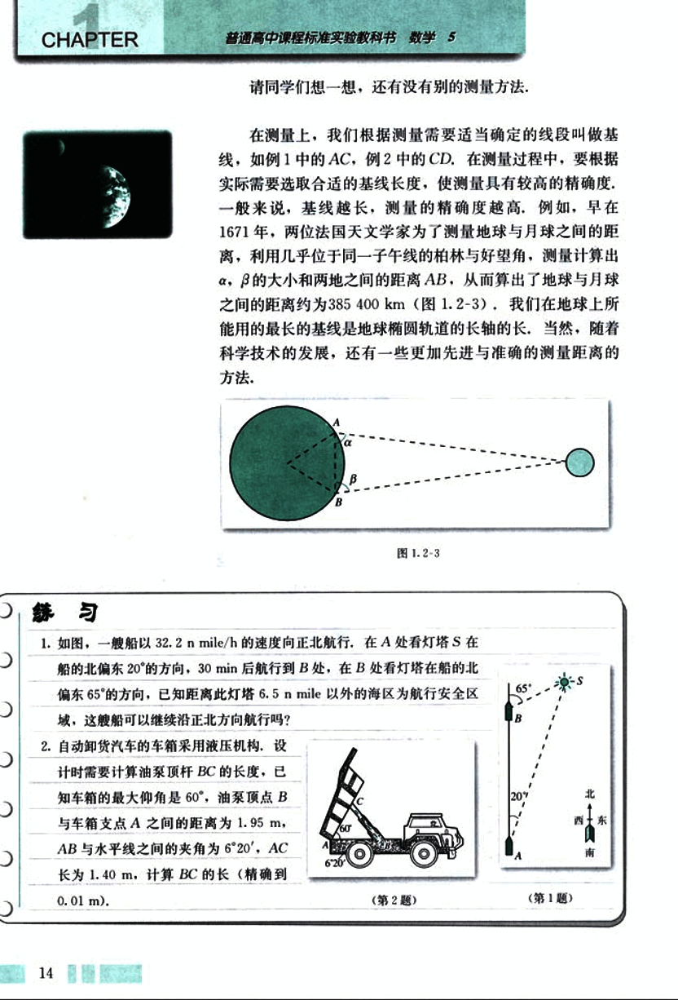
28

# 第一章 解三角形

我们再来看几个测量高度的问题。

## 例 3

AB是底部B不可到达的一个建筑物，A为建筑物的最高点，设计一种测量建筑物高度AB的方法。

[image](images/image.png)

**分析:** 由于建筑物的底部B是不可到达的，所以不能直接测量出建筑物的高，由解直角三角形的知识，只要能测出一点C到建筑物的顶部A的距离CA，并测出由点C观察A的仰角，就可以计算出建筑物的高，所以应该设法借助解三角形的知识测出CA的长。

**解:** 选择一条水平基线HG（图1.2-4），使H，G，B三点在同一条直线上，由在H，G两点用测角仪器测得A的仰角分别是α，β，CD=a，测角仪器的高是h。那么，在△ACD中，根据正弦定理可得

$AC = \frac{a \sin \beta}{\sin(\alpha - \beta)}$

$AB = AE + h$

$= AC \sin \alpha + h$

$= \frac{a \sin \alpha \sin \beta}{\sin(\alpha - \beta)} + h$

## 例 4

如图1.2-5，在山顶铁塔上B处测得地面上一点A的俯角α=54°40′，在塔底C处测得A处的俯角β=50°1′。已知铁塔BC部分的高为27.3m，求出山高CD（精确到1m）。

**分析:** 根据已知条件，应该设法计算出AB或AC的长。

**解:** 在△ABC中，∠BCA=90°+β，∠ABC=90°-α，∠BAC=α-β，∠BAD=α。根据正弦定理，

$\frac{BC}{\sin(\alpha - \beta)} = \frac{AB}{\sin(90° + \beta)}$

15

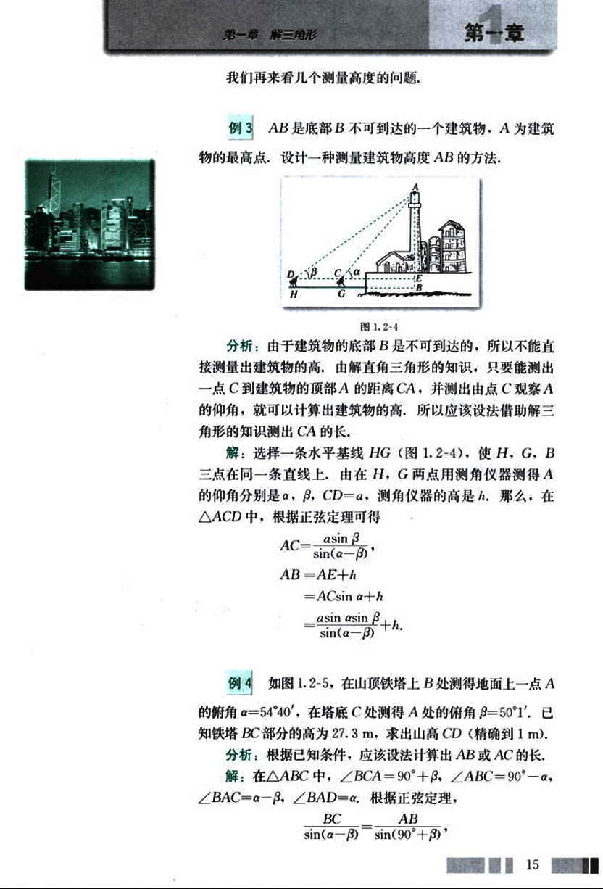
29

# CHAPTER

普通高中课程标准实验教科书 数学 5

所以

$AB = \frac{BCsin(90^\circ + \beta)}{sin(\alpha - \beta)} = \frac{BCcos\beta}{sin(\alpha - \beta)}$

解Rt△ABD，得

$BD = ABsin∠BAD$

$= \frac{BCcos\beta sin\alpha}{sin(\alpha - \beta)}$

把测量数据代入上式，得

$BD = \frac{27.3cos50^\circ1'sin54^\circ40'}{sin(54^\circ40'-50^\circ1')}$

$= \frac{27.3cos50^\circ1'sin54^\circ40'}{sin4^\circ39}$

$\approx 177(m)$

$CD = BD - BC \approx 177 - 27.3 \approx 150(m)$.

答：山的高度约为150米.

例5 如图1.2-6，一辆汽车在一条水平的公路上向正东行驶，到A处时测得公路南侧远处一山顶D在东偏南15°的方向上，行驶5km后到达B处，测得此山顶在东偏南25°的方向上，仰角为8°，求此山的高度CD.

[图1.2-6](images/1.2-6.png)

分析：要测出高CD，只要测出高所在的直角三角形的另一条直角边或斜边的长，根据已知条件，可以计算出BC的长。

解：在△ABC中，

∠A = 15°，∠C = 25° - 15° = 10°.

根据正弦定理，

$\frac{BC}{sinA} = \frac{AB}{sinC}$

---

16
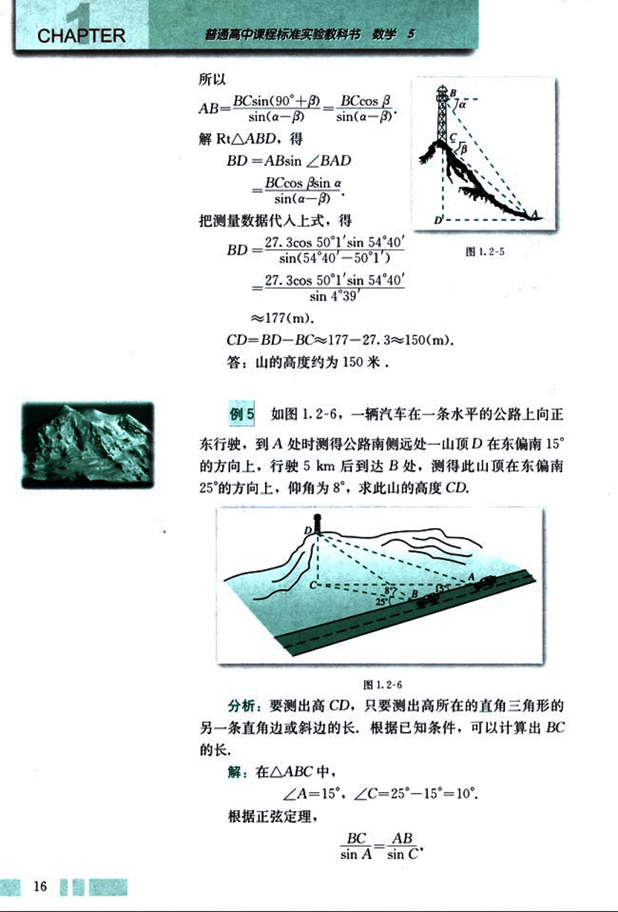
30

# 第一章 解三角形

## 第一节

$BC = \frac{ABsinA}{sinC} = \frac{5sin15^\circ}{sin10^\circ}$

$\approx7.452\ 4(km).$

$CD = BC \times tan\angle DBC \approx BC \times tan\ 8^\circ \approx 1047(m).$

答：山的高度约为1047米.

# 练习

1. 如图，在山脚A测得山顶P的仰角为α，沿倾斜角为β的斜坡向上走a米到B，在B处测得山顶P的仰角为γ，求证：山高 $h = \frac{asin\alpha sin(\gamma - \beta)}{sin(\gamma - \alpha)}$

[图1](images/图1.png)
[图2](images/图2.png)

2. 测山上石油钻井的井架BC的高，从山脚A测得AC=65.3 m，塔顶B的仰角是25°25′，已知山坡的倾斜角是17°38′，求井架的高BC.

3. 勘探队员朝一座山行进，在前后两处观察山顶的仰角分别是29°和38°，两个观察点之间的距离是200 m，求此山的高度.

[图3](images/图3.png)

下面是一个测量角度的问题.

## 例 6

如图1.2-7，一艘海轮从A出发，沿北偏东75°的方向航行67.5 n mile后到达海岛B，然后从B出发，沿北偏东32°的方向航行54.0 n mile后到达海岛C. 如果下次航行直接从A出发到达C，此船应该沿怎样的方向

[图4](images/图4.png)

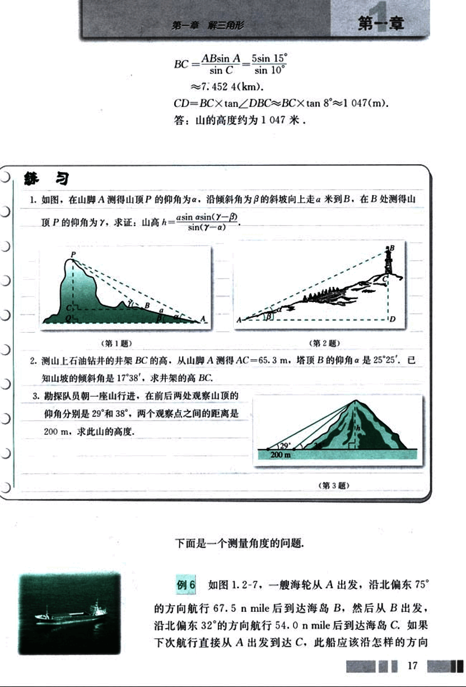
31

# CHAPTER

普通高中课程标准实验教科书 数学 5

航行，需要航行多少距离？（角度精确到0.1°，距离精确到0.01 n mile）

解：在△ABC中，∠ABC = 180° - 75° + 32° = 137°，根据余弦定理，

AC = $\sqrt{AB^2 + BC^2 - 2AB \times BC \times cos\angle ABC}$

= $\sqrt{67.5^2 + 54.0^2 - 2 \times 67.5 \times 54.0 \times cos 137°}$

≈ 113.15，

根据正弦定理，

$\frac{BC}{sin \angle CAB} = \frac{AC}{sin \angle ABC}$

$sin \angle CAB = \frac{BC sin \angle ABC}{AC}$

$= \frac{54.0 sin 137°}{113.15}$

≈ 0.325 5，

所以

∠CAB = 19.0°，

75° - ∠CAB = 56.0°。

答：此船应该沿北偏东56.1°的方向航行，需要航行113.15 n mile。

## 练习

3.5 m长的棒斜靠在石堤旁，棒的一端在离堤足1.2 m地面上，另一端在沿堤上2.8 m的地方，求堤对地面的倾斜角α。

18

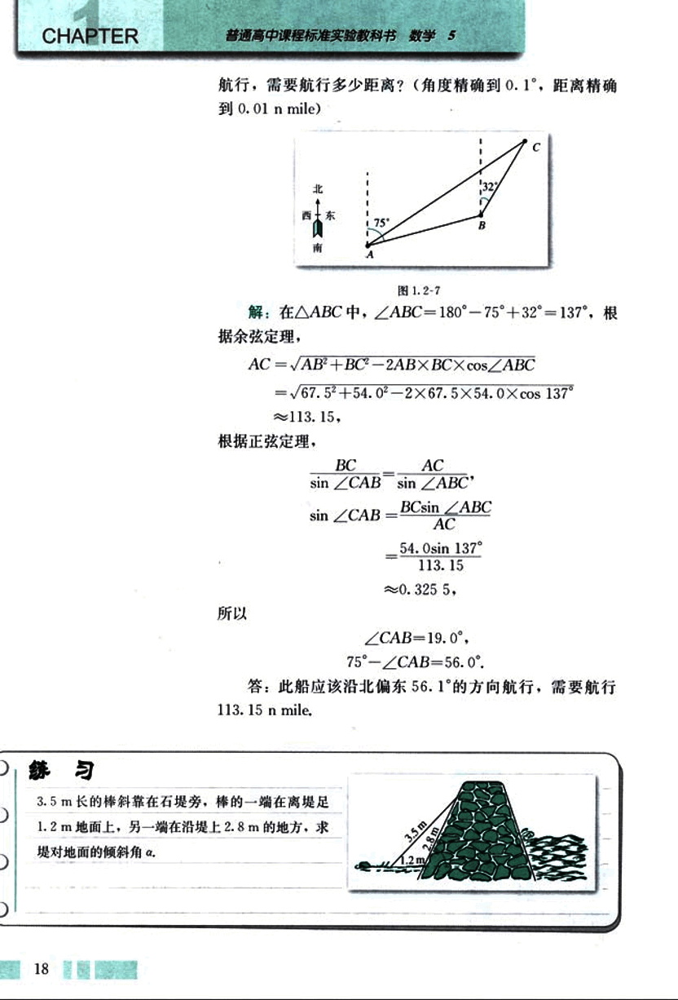
32

# 第一章 解三角形

## 第一章

借助于正弦定理和余弦定理，我们可以进一步解决一些有关三角形的计算问题。

在△ABC中，边BC，CA，AB上的高分别记为$h_a$，$h_b$，$h_c$，那么容易证明：

$h_a = b \sin C = c \sin B$，

$h_b = c \sin A = a \sin C$，

$h_c = a \sin B = b \sin A$。

根据三角形的面积公式$S = \frac{1}{2}ah_a$，应用以上高的公式$h_a = b \sin C$，可以推导出下面的三角形的面积公式：

$S = \frac{1}{2}ab \sin C$。

同理：

$S = \frac{1}{2}bc \sin A$，

$S = \frac{1}{2}ca \sin B$。

## 例7

在△ABC中，根据下列条件，求三角形的面积S（精确到0.1cm²）：

(1) 已知$a = 14.8 \ cm$，$c = 23.5 \ cm$，$B = 148.5^\circ$；

(2) 已知$B = 62.7^\circ$，$C = 65.8^\circ$，$b = 3.16 \ cm$；

(3) 已知三边的长分别为$a = 41.4 \ cm$，$b = 27.3 \ cm$，$c = 38.7 \ cm$。

解：

(1) 应用$S = \frac{1}{2}ca \sin B$，得

$S = \frac{1}{2} \times 23.5 \times 14.8 \times \sin 148.5^\circ \approx 90.9 (cm^2)$；

(2) 根据正弦定理，

$\frac{b}{\sin B} = \frac{c}{\sin C}$，

$c = \frac{b \sin C}{\sin B}$，

$S = \frac{1}{2}bc \sin A = \frac{1}{2}b^2 \frac{\sin C \sin A}{\sin B}$，

$A = 180^\circ - (B + C) = 180^\circ - (62.7^\circ + 65.8^\circ) = 51.5^\circ$，

$S = \frac{1}{2} \times 3.16^2 \times \frac{\sin 65.8^\circ \sin 51.5^\circ}{\sin 62.7^\circ} \approx 4.0 (cm^2)$；

19

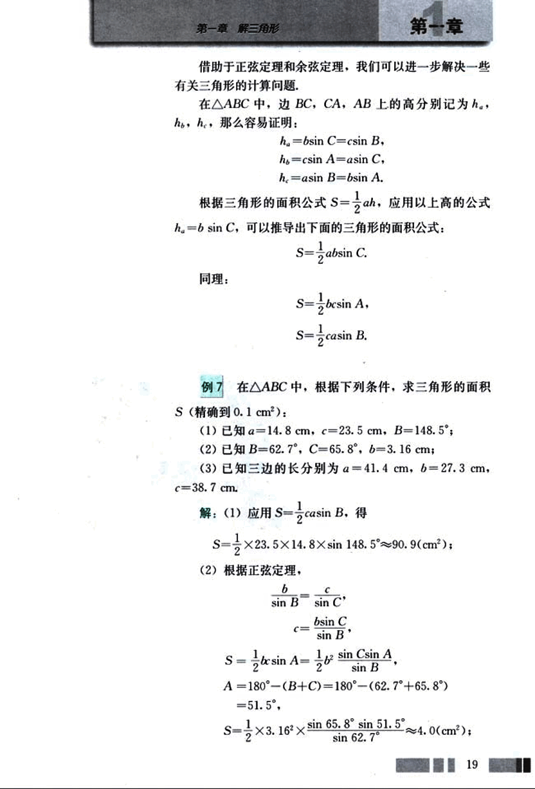
33

# CHAPTER 1

(3) 根据余弦定理的推论，得

cos B = $\frac{c^2 + a^2 - b^2}{2ca}$

= $\frac{38.7^2 + 41.4^2 - 27.3^2}{2 \times 38.7 \times 41.4}$

≈ 0.769 7,

sin B = $\sqrt{1 - cos^2 B} \approx \sqrt{1 - 0.7697^2} \approx 0.6384$.

应用 S = $\frac{1}{2}ca sin B$，得

S ≈ $\frac{1}{2} \times 38.7 \times 41.4 \times 0.6384 \approx 511.4 (cm^2)$.

## 例 8

如图 1.2-8，在某市进行城市环境建设中，要把一个三角形的区域改造成市内公园，经过测量得到这个三角形区域的三条边长分别为 68 m，88 m，127 m，这个区域的面积是多少？（精确到 0.1 cm²）

[图 1.2-8](images/1.2-8.png)

解：设 a = 68 m，b = 88 m，c = 127 m，根据余弦定理的推论，

cos B = $\frac{c^2 + a^2 - b^2}{2ca}$

= $\frac{127^2 + 68^2 - 88^2}{2 \times 127 \times 68}$

≈ 0.753 2,

sin B = $\sqrt{1 - 0.7532^2} \approx 0.6578$.

应用 S = $\frac{1}{2}ca sin B$，得

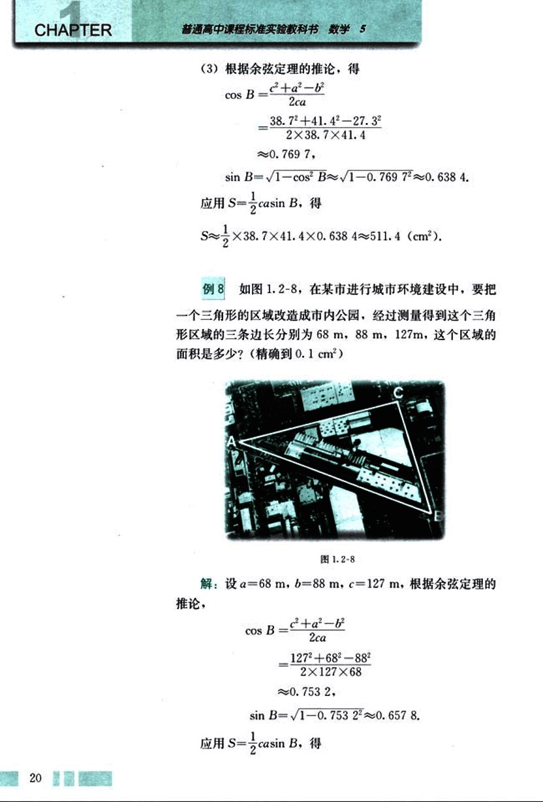
34

# 第一章 解三角形

## 第一章

S ≈ $\frac{1}{2}$ × 127 × 68 × 0.657 8 ≈ 2 840.38 (m²)

答：这个区域的面积是 2 840.38 m².

## 例9

在△ABC中，求证：

(1) $\frac{a^2+b^2}{c^2} = \frac{\sin^2A + \sin^2B}{\sin^2C}$

(2) $a^2+b^2+c^2 = 2(bc\cos A + ca\cos B + ab\cos C)$.

证明：(1) 根据正弦定理，可设

$\frac{a}{\sin A} = \frac{b}{\sin B} = \frac{c}{\sin C} = k$

显然 k≠0，所以

左边 = $\frac{a^2+b^2}{c^2} = \frac{k^2\sin^2A + k^2\sin^2B}{k^2\sin^2C} = \frac{\sin^2A + \sin^2B}{\sin^2C}$ = 右边.

(2) 根据余弦定理的推论，

右边 = 2($bc\frac{b^2+c^2-a^2}{2bc} + ca\frac{c^2+a^2-b^2}{2ca} + ab\frac{a^2+b^2-c^2}{2ab}$)

= (b²+c²-a²) + (c²+a²-b²) + (a²+b²-c²)

= a²+b²+c² = 左边.

## 练习

1. 在△ABC中，根据下列条件，求三角形的面积 S (精确到 1 cm²):

(1) 已知 a=18 cm，c=25 cm，B=48.5°；

(2) 已知 B=52.8°，C=75.8°，b=16 cm；

(3) 已知三边的长分别为 a=44 cm，b=23 cm，c=37 cm.

2. 有一块四边形土地的形状如图所示，它的三条边的长分别
是 50 m，60 m，70 m，两个内角是 127° 和 132°，求四边形的面积 (精确到 0.1 m²).

[image](images/image.png)

(第 2 题)

21

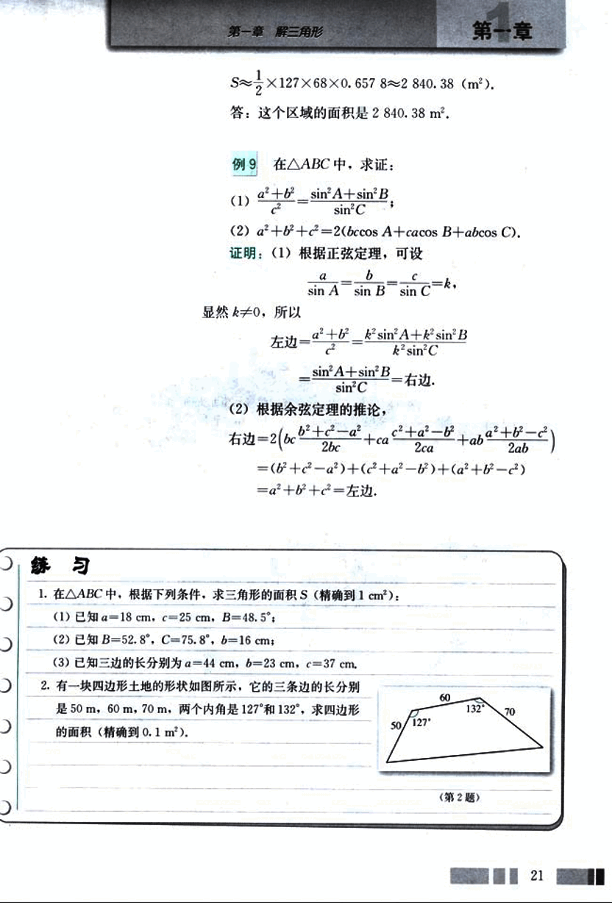
35

# CHAPTER 1

## 习题 1.2 A组

1. 如图，货轮在海上以 35 n mile/h 的速度沿着方位角（从指北方向顺时针转到目标方向线的水平角）为 148° 的方向航行，为了确定船位，在 B 点观察灯塔 A 的方位角是 126°，航行半小时后到达 C 点，观察灯塔 A 的方位角是 78°。求货轮到达 C 点时与灯塔 A 的距离（精确到 1 n mile）。

[图1](images/图1.png)

2. 轮船 A 和轮船 B 在中午 12 时离开海港 C，两艘轮船的航行方向之间的夹角为 120°，轮船 A 的航行速度是 25 n mile/h，轮船 B 的航行速度是 15 n mile/h，下午 2 时两船之间的距离是多少？

[图2](images/图2.png)

3. 如图，已知一艘船以 30 n mile/h 的速度往北偏东 10° 的 A 岛行驶，计划到达 A 岛后停留 10 min 后继续驶往 B 岛，B 岛在 A 岛的北偏西 60° 的方向上。船到达 C 处时是上午 10 时整，此时测得 B 岛在北偏西 30° 的方向，经过 20 min 到达 D 处，测得 B 岛在北偏西 45° 的方向，如果一切正常的话，此船何时能到达 B 岛？

[图3](images/图3.png)

4. 一架飞机在海拔 8000 m 的高度飞行，在空中测出前下方海岛两侧海岸俯角分别是 27° 和 39°，计算这个海岛的宽度。

[图4](images/图4.png)

3. 在△ABC 中，求证：

(1)  $\frac{a+b}{b-c} = \frac{\tan\frac{A+B}{2}}{\tan\frac{A-B}{2}}$

(2)  a = bcosC + ccosB;
     b = ccosA + acosC;
     c = acosB + bcosA;
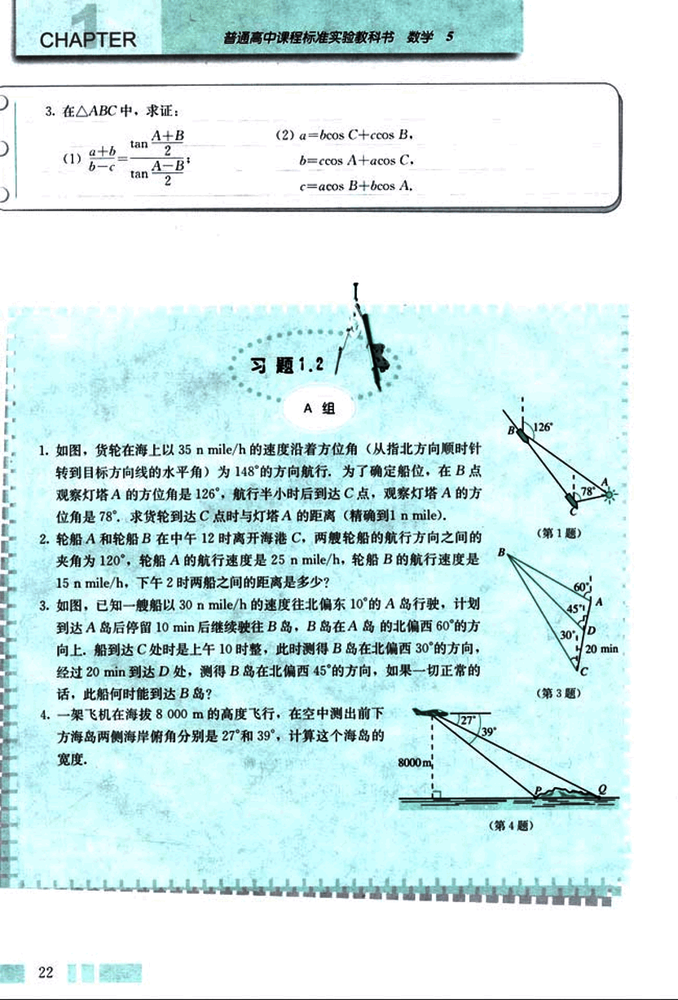
36

# 第一章 解三角形

## 第一章

5. 一架飞机从A地飞到B地，两地相距700km。飞行员为了避开某一区域的雷雨云层，从机场起飞以后，就沿与原来的飞行方向成21°角的方向飞行，飞行到中途，再沿与原来的飞行方向成35°角的方向继续飞行直到终点，这样飞机的飞行路程比原来的路程700km远了多少？

6. A、B两地相距2558m，从A、B两处发出的两束探照灯光照射在上方一架飞机的机身上（如图），飞机离两个探照灯的距离是多少？飞机的高度是多少？

7. 飞机的航线和山顶在同一个铅垂平面内，已知飞机的高度为海拔20 250 m，速度为1000 km/h，飞行员先看到山顶的俯角为18°30′，经过150 s后又看到山顶的俯角为81°，求山顶的海拔高度（精确到1 m）。

8. 为测量某塔的高度，在A、B两点进行测量的数据如图所示，求塔的高度。

9. 一架侦察机在海拔5000 m的高空飞行，观测到一艘潜艇的方位角是82°，俯角是23°，一艘货轮的方位角是145°，俯角是64°。潜艇与货轮之间的距离是多少？

10. 一架飞机以326 km/h的速度，沿北偏东75°的航向从城市A出发向城市B飞行，18 min以后，飞机由于天气原因按命令改飞另一个城市C，问收到命令时飞机应该沿什么航向飞行，此时离城市的距离是多少？

11. 同步通讯卫星在赤道上空35 800 km的轨道上，它每24小时绕地球一周，所以它定位于赤道上某一点的上空。如果此点与北京在同一条子午线上，北京的纬度是北纬39°54′，求在北京观察此卫星的仰角（取地球半径是6 400 km）？

12. 在△ABC中，根据下列条件，求三角形的面积S（精确到1 cm²）。

23

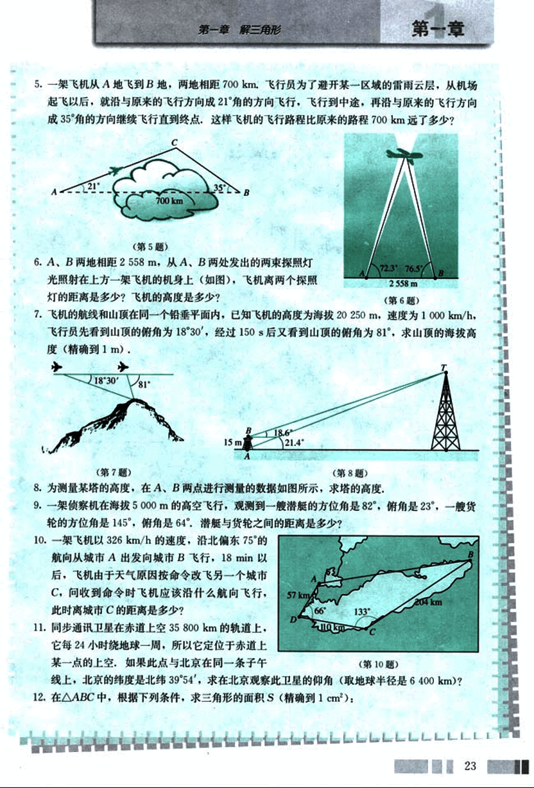
37

# CHAPTER

普通高中课程标准实验教科书 数学 5

(1)已知a=28 cm, c=33 cm, B=45°;

(2)已知A=32.8°, C=66.5°, a=36 cm;

(3)已知三边的长分别为a=54 cm, b=61 cm, c=71 cm.

13.求半径是R的圆内接正n边形的面积。

14.三角形△ABC的三边分别为a、b、c，边BC、CA、AB上的中线分别记为$m_a$、$m_b$、$m_c$，应用余弦定理证明:

$m_a = \frac{1}{2}\sqrt{2(b^2+c^2)-a^2}$，

$m_b = \frac{1}{2}\sqrt{2(a^2+c^2)-b^2}$，

$m_c = \frac{1}{2}\sqrt{2(a^2+b^2)-c^2}$。

15.在△ABC中，求证: $c(a \cos B - b \cos A) = a^2 - b^2$。

## B组

1.证明三角形的面积公式

$S = \frac{1}{2}a^2 \frac{\sin B \sin C}{\sin A}$

2.已知三角形的三边为a、b、c，设$p = \frac{1}{2}(a+b+c)$，求证:

(1)三角形的面积$S = \sqrt{p(p-a)(p-b)(p-c)}$;

(2)r为三角形的内切圆半径，则

$r = \sqrt{\frac{(p-a)(p-b)(p-c)}{p}}$;

(3)把边BC、CA、AB上的高分别记为$h_a$、$h_b$、$h_c$，则

$h_a = \frac{2}{a}\sqrt{p(p-a)(p-b)(p-c)}$，

$h_b = \frac{2}{b}\sqrt{p(p-a)(p-b)(p-c)}$，

$h_c = \frac{2}{c}\sqrt{p(p-a)(p-b)(p-c)}$。

[image](images/triangle.png)

(第2(2)题)

24

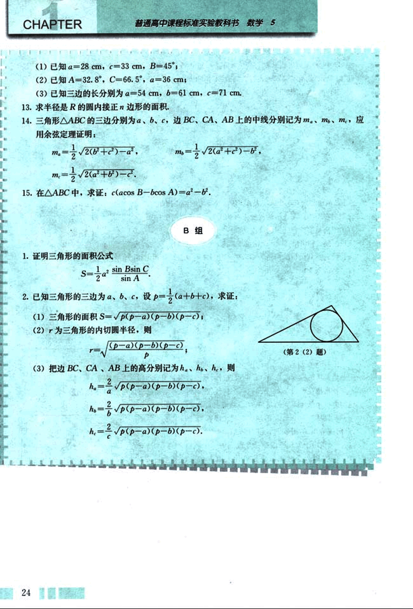
38

# 第一章 解三角形

## 海伦和秦九韶

古希腊的数学发展到亚历山大里亚时期，数学的应用性得到了很大的发展，其突出的
一点就是三角术的发展，三角术是由于人们想建立定量的天文学，以便用来预报天体的运
行路线和位置以帮助报时，计算日历，航海和研究地理而产生的。

在解三角形的问题中，其中一个比较困难的问题是如何由三角形的三边a、b、c直接
求出三角形的面积，据说这个问题最早是由古希腊数学家阿基米德解决的，他得到了公式

$S=\sqrt{p(p-a)(p-b)(p-c)}$，这里$p=\frac{1}{2}(a+b+c)$.

但现在人们常常以古希腊的数学家海伦(Heron)命名这个公式，称此公式为海伦公式，
因为这个公式最早出现在海伦的著作《测地术》中，并在海伦的著作《测量仪器》和《度
量术》中给出证明，海伦公式的特点是形式漂亮，便于记忆。

海伦是古希腊的数学家，他还是一位优秀的测绘工程师，生活的年代大约是一世纪，
他的代表作是《度量术》，讨论平面图形的面积、立体图形的体积以及把图形分成比例部
分，《测量仪器》是他的另一本代表作，其中描述的一种仪器，功能相当于现代的经纬仪，
在此书中他还讨论许多测量的问题，如怎样挖隧道，从山的两侧开始，找准方向，使隧道
准确会合；确定两点间高度的差；测量可望不可即的两点之间的距离；还有各种高度和距
离的测量问题，我国南宋著名数学家秦九韶（约1202—1261）也发现了与它等价的从三
角形三边求面积的公式，他把这种方法称为“三斜求积”，在他的著作《数书九章》卷五
“田域类”里有一个题目：“问有沙田一段，有三斜，其小斜一十三里，中斜一十四里，大
斜一十五里，里法三百步，欲知为田几何。”这道题实际上就是已知三角形的三边长，求
三角形的面积，《数书九章》中的求法是：“以小斜幂并大斜幂减中斜幂，余半之，自乘于
上，以小斜幂乘大斜幂减上，余四约之，为实，一为从隅，开平方得积，”如果把以上这
段文字写成公式，就是

$S=\sqrt{\frac{1}{4}\left[ c^2a^2-\left( \frac{c^2+a^2-b^2}{2} \right)^2 \right]}$.

秦九韶独立推出了“三斜求积”公式，它虽然与海伦公式形式上不一样，但两者是完
全等价的，实质是一样的，它填补了我国传统数学的一个空白，从中可以看到我国古代已
具有很高的数学水平。

秦九韶是我国古代数学家的杰出代表之一，他的《数书九章》概括了宋元时期中国传
统数学的主要成就，尤其是系统总结和发展了高次方程的数值解法与一次同余问题的解
法，提出了相当完备的“正负开方术”和“大衍求一术”，对数学发展产生了广泛的影响。

秦九韶是一位既重视理论又重视实践，既善于继承又勇于创新的数学家，他被国外科学史
家称为是“他那个民族，那个时代，并且确实也是所有时代最伟大的数学家之一”。

25

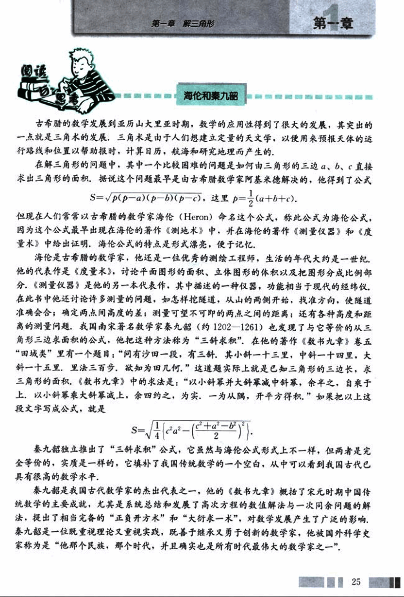
39

# 1.3 实习作业

根据实际需要，利用本章所学的知识做一个有关测量的实习作业，并写出实习报告。

## 实习报告

| 测量问题 |  |
|---|---|
| 附图 |  |
| 测量工具 |  |
| 测得数据 |  |
| 计算 |  |
| 负责人及参加者 |  |
| 计算者及复核者 |  |
| 指导教师 |  |
| 审核意见 |  |

26

