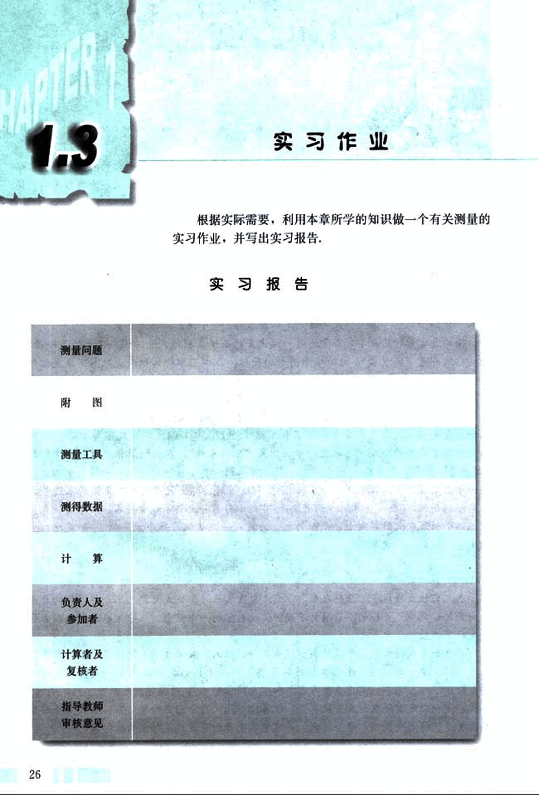

# 1.3　实习作业

39

# 1.3 实习作业

根据实际需要，利用本章所学的知识做一个有关测量的实习作业，并写出实习报告。

## 实习报告

| 测量问题 |  |
|---|---|
| 附图 |  |
| 测量工具 |  |
| 测得数据 |  |
| 计算 |  |
| 负责人及参加者 |  |
| 计算者及复核者 |  |
| 指导教师 |  |
| 审核意见 |  |

26

