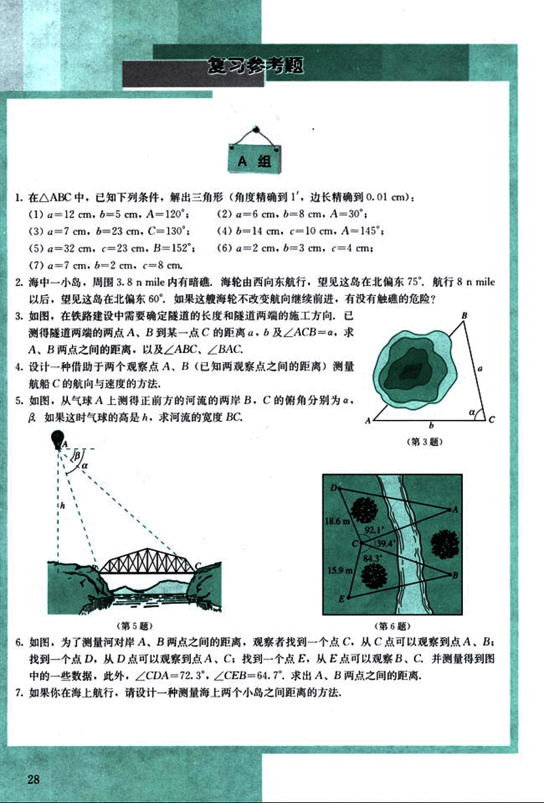

# 复习参考题

41

# 复习参考题

## A组

1. 在△ABC中，已知下列条件，解出三角形（角度精确到1'，边长精确到0.01 cm）：
(1) a=12 cm, b=5 cm, A=120°;
(2) a=6 cm, b=8 cm, A=30°;
(3) a=7 cm, b=23 cm, C=130°;
(4) b=14 cm, c=10 cm, A=145°;
(5) a=32 cm, c=23 cm, B=152°;
(6) a=2 cm, b=3 cm, c=4 cm;
(7) a=7 cm, b=2 cm, c=8 cm.

2. 海中一小岛，周围 3.8 n mile 内有暗礁，海轮由西向东航行，望见这岛在北偏东 75°，航行 8 n mile 以后，望见这岛在北偏东 60°。如果这艘海轮不改变航向继续前进，有没有触礁的危险？

3. 如图，在铁路建设中需要确定隧道的长度和隧道两端的施工方向，已测得隧道两端的两点 A、B 到某一点 C 的距离 a、b 及∠ACB=α，求 A、B 两点之间的距离，以及∠ABC、∠BAC。

4. 设计一种借助于两个观察点 A、B（已知两观察点之间的距离）测量航船 C 的航向与速度的方法。

5. 如图，从气球 A 上测得正前方的河流的两岸 B、C 的俯角分别为 α、β。如果这时气球的高是 h，求河流的宽度 BC。
[图5](images/图5.png)

6. 如图，为了测量河对岸 A、B 两点之间的距离，观察者找到一个点 C，从 C 点可以观察到点 A、B；找到一个点 D，从 D 点可以观察到点 A、C；找到一个点 E，从 E 点可以观察 B、C，并测量得到图中的一些数据，此外，∠CDA=72.3°，∠CEB=64.7°。求出 A、B 两点之间的距离。
[图6](images/图6.png)

7. 如果你在海上航行，请设计一种测量海上两个小岛之间距离的方法。

---
28

42

# B组

1. 已知地球半径为 R (约 6 371 km)，A 地在东经 °，北纬 °，B 地在东经 °，北纬 °，求这两地之间的球面距离。

2. 设 A、B 是两个底部不可到达的建筑物的尖顶，设计测量两者距离的方法。

3. 就三角形的面积计算问题作一探索，你现在已经学习了哪些计算公式，还可发现和证明一些新的计算公式吗？

4. 研究一下，是否存在一个三角形具有以下性质：
(1) 三边是连续的三个自然数；
(2) 最大角是最小角的 2 倍。

