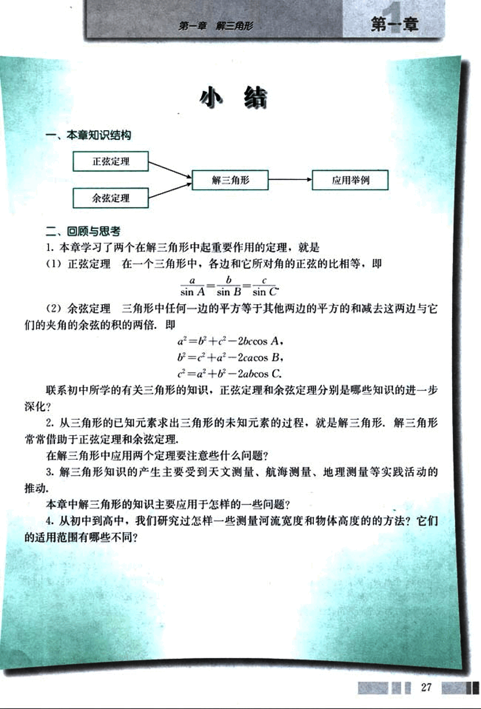

# 小结

40

# 第一章 解三角形

# 小结

## 一、本章知识结构

正弦定理 → 解三角形 → 应用举例
余弦定理

## 二、回顾与思考

1. 本章学习了两个在解三角形中起重要作用的定理，就是

(1) 正弦定理：在一个三角形中，各边和它所对角的正弦的比相等，即

$\frac{a}{\sin A} = \frac{b}{\sin B} = \frac{c}{\sin C}$

(2) 余弦定理：三角形中任何一边的平方等于其他两边的平方的和减去这两边与它们的夹角的余弦的积的两倍，即

$a^2 = b^2 + c^2 - 2bc \cos A$ ,
$b^2 = c^2 + a^2 - 2ca \cos B$ ,
$c^2 = a^2 + b^2 - 2ab \cos C$ .

联系初中所学的有关三角形的知识，正弦定理和余弦定理分别是哪些知识的进一步深化？

2. 从三角形的已知元素求出三角形的未知元素的过程，就是解三角形。解三角形常常借助于正弦定理和余弦定理。

在解三角形中应用两个定理要注意些什么问题？

3. 解三角形知识的产生主要受到天文测量、航海测量、地理测量等实践活动的推动。

本章中解三角形的知识主要应用于怎样的一些问题？

4. 从初中到高中，我们研究过怎样一些测量河流宽度和物体高度的方法？它们的适用范围有哪些不同？

27

