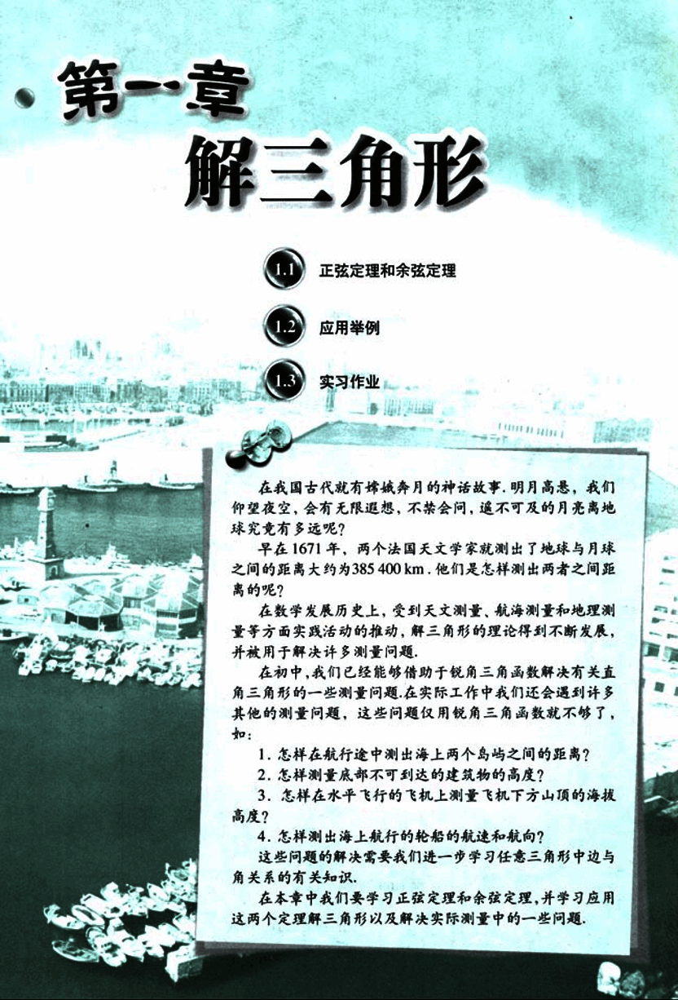

# 第1章　解三角形

13

# 1

天文观测，航海和地理测量是人类认识自然的重要方面，解三角形的理论在其中发挥了重要作用.

14

# 第一章 解三角形

## 1.1 正弦定理和余弦定理
## 1.2 应用举例
## 1.3 实习作业

在我国古代就有嫦娥奔月的神话故事，明月高悬，我们仰望夜空，会有无限遐想，不禁会问，遥不可及的月亮离地球究竟有多远呢？

早在1671年，两个法国天文学家就测出了地球与月球之间的距离大约为385 400 km，他们是怎样测出两者之间距离的呢？

在数学发展历史上，受到天文测量、航海测量和地理测量等方面实践活动的推动，解三角形的理论得到不断发展，并被用于解决许多测量问题。

在初中，我们已经能够借助于锐角三角函数解决有关直角三角形的一些测量问题，在实际工作中我们还会遇到许多其他的测量问题，这些问题仅用锐角三角函数就不够了，如：

1. 怎样在航行途中测出海上两个岛屿之间的距离？
2. 怎样测量底部不可到达的建筑物的高度？
3. 怎样在水平飞行的飞机上测量飞机下方山顶的海拔高度？
4. 怎样测出海上航行的轮船的航速和航向？

这些问题的解决需要我们进一步学习任意三角形中边与角关系的有关知识。

在本章中我们要学习正弦定理和余弦定理，并学习应用这两个定理解三角形以及解决实际测量中的一些问题。

