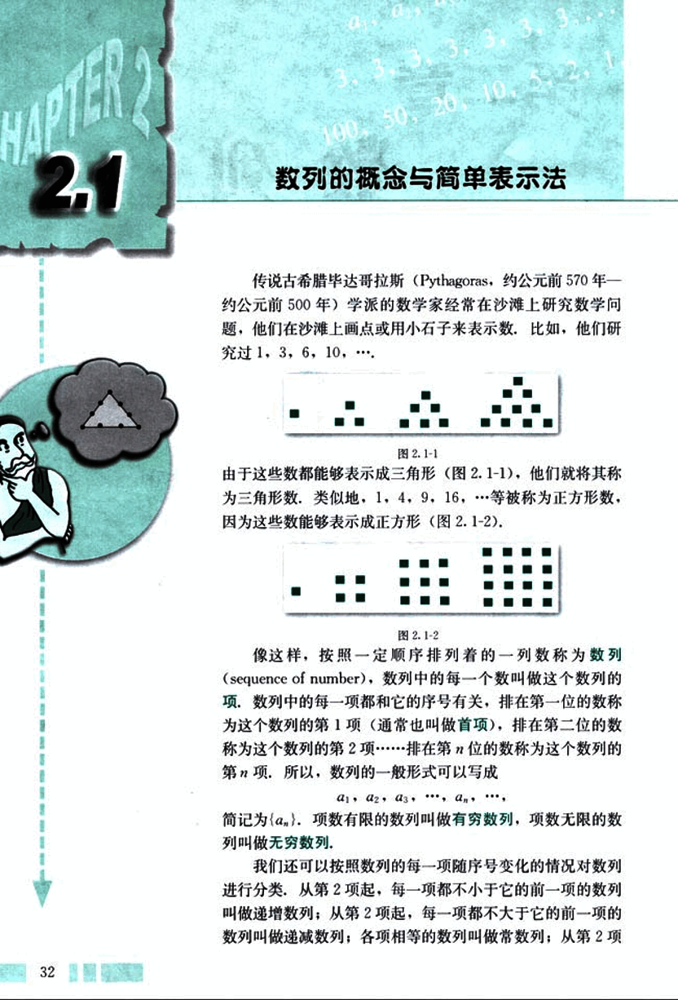
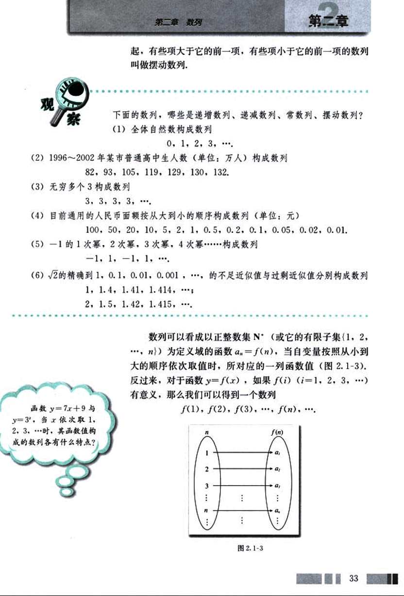
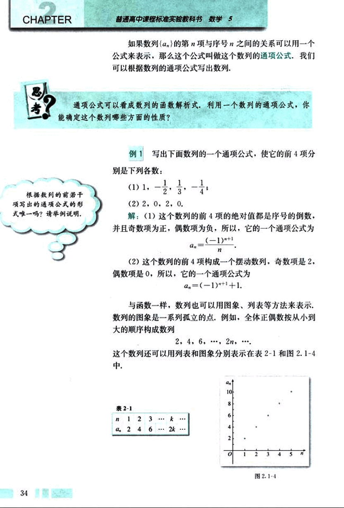
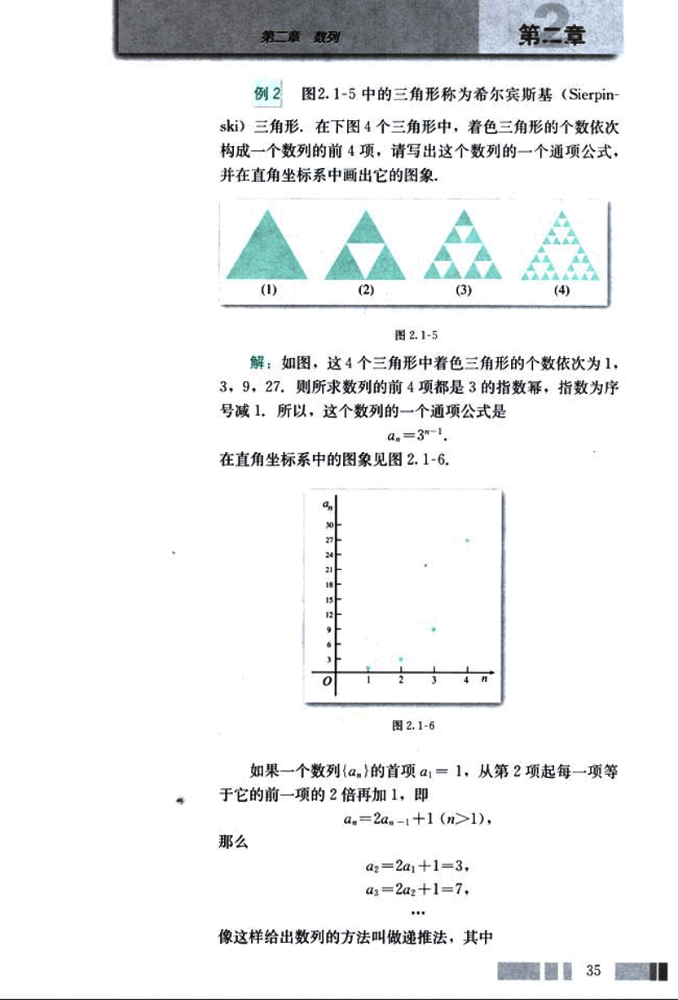
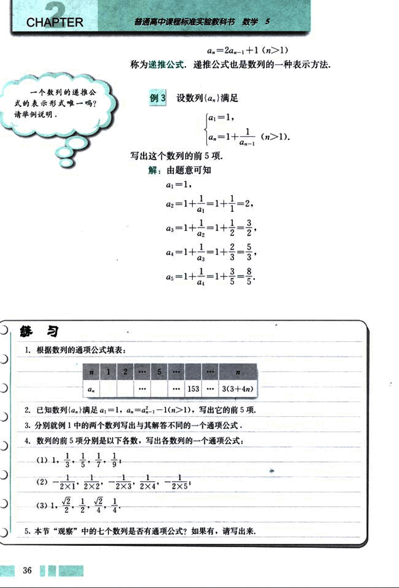
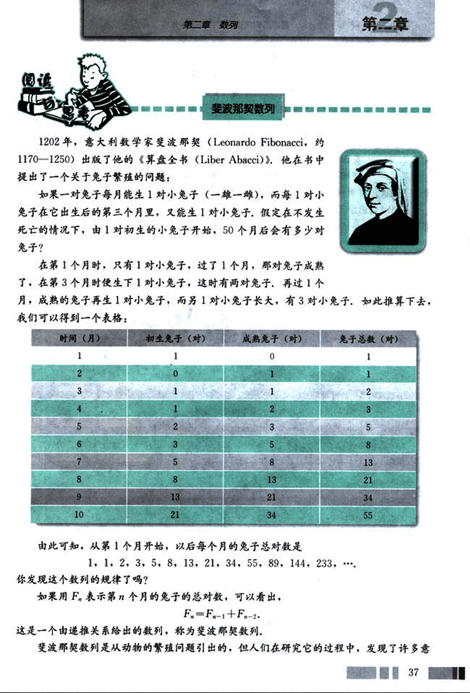
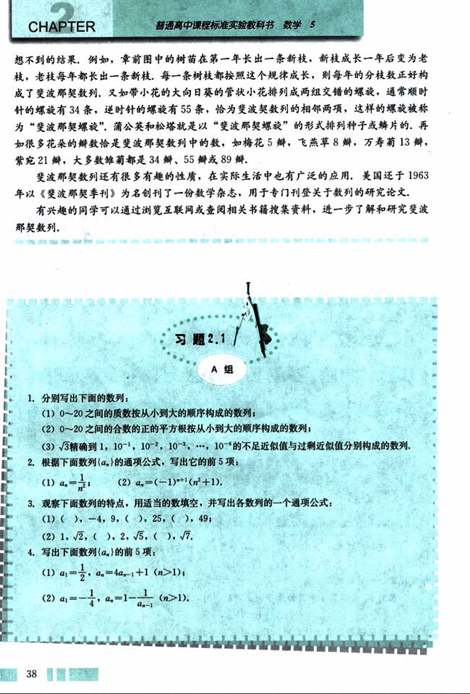
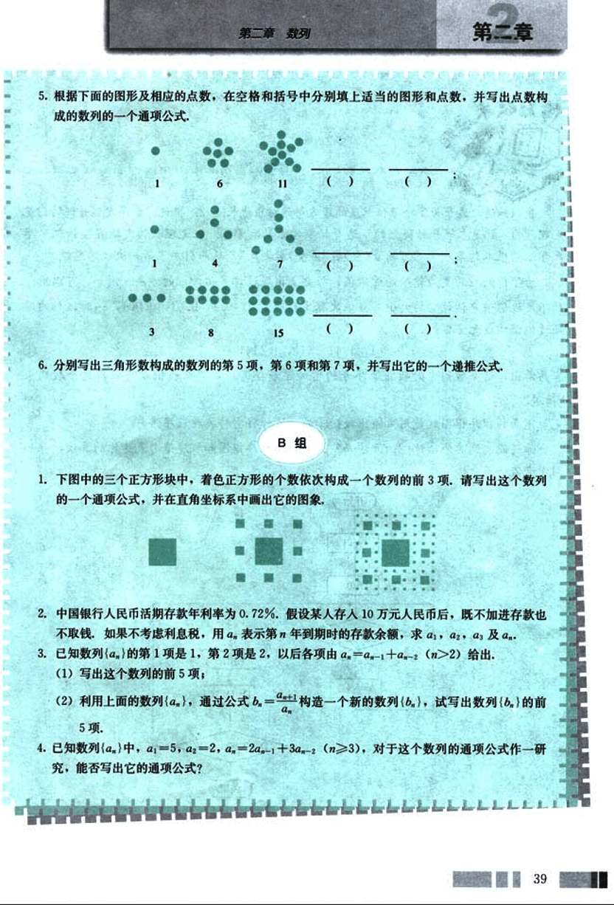
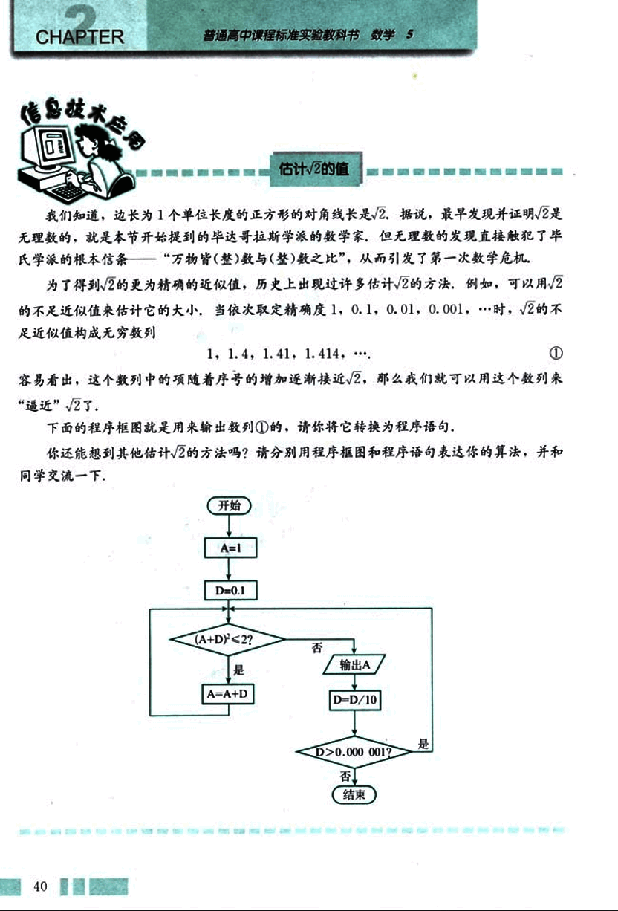

# 2.1 　数列的概念与简单表示法

45

# CHAPTER 2

## 2.1 数列的概念与简单表示法

传说古希腊毕达哥拉斯(Pythagoras,约公元前 570 年—约公元前 500 年)学派的数学家经常在沙滩上研究数学问题,他们在沙滩上画点或用小石子来表示数,比如,他们研究过 1, 3, 6, 10, ....


由于这些数都能够表示成三角形(图 2.1-1),他们就将其称为三角形数,类似地,1, 4, 9, 16,……等被称为正方形数,因为这些数能够表示成正方形(图 2.1-2).


像这样,按照一定顺序排列着的一列数称为数列(sequence of number),数列中的每一个数叫做这个数列的项,数列中的每一项都和它的序号有关,排在第一位的数称为这个数列的第 1 项(通常也叫做首项),排在第二位的数称为这个数列的第 2 项………………排在第 n 位的数称为这个数列的第 n 项,所以,数列的一般形式可以写成

$a_1, a_2, a_3, ..., a_n, ...$

简记为{$a_n$}.项数有限的数列叫做有穷数列,项数无限的数列叫做无穷数列.

我们还可以按照数列的每一项随序号变化的情况对数列进行分类,从第 2 项起,每一项都不小于它的前一项的数列叫做递增数列;从第 2 项起,每一项都不大于它的前一项的数列叫做递减数列;各项相等的数列叫做常数列;从第 2 项


46

# 第二章 数列

起，有些项大于它的前一项，有些项小于它的前一项的数列叫做摆动数列。

## 观察

下面的数列，哪些是递增数列、递减数列、常数列、摆动数列？

(1) 全体自然数构成数列
0, 1, 2, 3, …

(2) 1996 ～ 2002 年某市普通高中生人数（单位：万人）构成数列
82, 93, 105, 119, 129, 130, 132.

(3) 无穷多个 3 构成数列
3, 3, 3, 3, …

(4) 目前通用的人民币面额按从大到小的顺序构成数列（单位：元）
100, 50, 20, 10, 5, 2, 1, 0.5, 0.2, 0.1, 0.05, 0.02, 0.01.

(5) -1 的 1 次幂，2 次幂，3 次幂，4 次幂……构成数列
-1, 1, -1, 1, …

(6) $\sqrt{2}$ 的精确到 1, 0.1, 0.01, 0.001, … 的不足近似值与过剩近似值分别构成数列
1, 1.4, 1.41, 1.414, …;
2, 1.5, 1.42, 1.415, …

函数 $y = 7x + 9$ 与 $y = 3^x$, 当 x 依次取 1, 2, 3, … 时，其函数值构成的数列各有什么特点？

数列可以看成以正整数集 N（或它的有限子集 {1, 2, …, n}）为定义域的函数 $a_n = f(n)$，当自变量按照从小到大的顺序依次取值时，所对应的一列函数值（图 2.1-3）。反过来，对于函数 $y = f(x)$，如果 $f(i)$ ($i = 1, 2, 3, …$) 有意义，那么我们可以得到一个数列 $f(1), f(2), f(3), …, f(n), …$

[图 2.1-3](images/2.1-3.png)

33


47

# CHAPTER 2

普通高中课程标准实验教科书 数学 5

如果数列{$a_n$}的第$n$项与序号之间的关系可以用一个公式来表示，那么这个公式叫做这个数列的通项公式，我们可以根据数列的通项公式写出数列。

## 思考？

通项公式可以看成数列的函数解析式，利用一个数列的通项公式，你能确定这个数列哪些方面的性质？

根据数列的前若干项写出的通项公式的形式唯一吗？请举例说明。

## 例 1

写出下面数列的一个通项公式，使它的前 4 项分别
是下列各数：

(1) 1, -$\frac{1}{2}$, $\frac{1}{3}$, -$\frac{1}{4}$；

(2) 2, 0, 2, 0.

解：(1) 这个数列的前 4 项的绝对值都是序号的倒数，并且奇数项为正，偶数项为负，所以，它的一个通项公式为

$a_n = \frac{(-1)^{n+1}}{n}$

(2) 这个数列的前 4 项构成一个摆动数列，奇数项是 2，偶数项是 0，所以，它的一个通项公式为

$a_n = (-1)^{n+1} + 1$.

与函数一样，数列也可以用图象、列表等方法来表示，数列的图象是一系列孤立的点，例如，全体正偶数按从小到大的顺序构成数列

2, 4, 6, …, 2n, …

这个数列还可以用列表和图象分别表示在表 2-1 和图 2.1-4 中.

表 2-1

| n     | 1   | 2   | 3   | …   | k   |
| ----- | --- | --- | --- | --- | --- |
| $a_n$ | 2   | 4   | 6   | …   | 2k  |

[图 2.1-4](images/2.1-4.png)

34


48

# 第二章 数列

## 例 2

图 2.1-5 中的三角形称为希尔宾斯基(Sierpinski)三角形,在下图 4 个三角形中,着色三角形的个数依次构成一个数列的前 4 项,请写出这个数列的一个通项公式,并在直角坐标系中画出它的图象.

(1) (2) (3) (4)

图 2.1-5

解:如图,这 4 个三角形中着色三角形的个数依次为 1, 3, 9, 27.则所求数列的前 4 项都是 3 的指数幂,指数为序号减 1.所以,这个数列的一个通项公式是

$a_n = 3^{n-1}$.

在直角坐标系中的图象见图 2.1-6.

[图 2.1-6](images/2.1-6.png)

如果一个数列{$a_n$}的首项$a_1=1$,从第 2 项起每一项等于它的前一项的 2 倍再加 1,即

$a_n = 2a_{n-1} + 1$ (n>1),

那么

$a_2 = 2a_1 + 1 = 3,$
$a_3 = 2a_2 + 1 = 7,$
...

像这样给出数列的方法叫做递推法,其中

35


49

# CHAPTER 2

普通高中课程标准实验教科书 数学 5

$a_n = 2a_{n-1} + 1\ (n > 1)$

称为递推公式，递推公式也是数列的一种表示方法。

## 例 3

设数列$\{a_n\}$满足

$\begin{cases}
a_1 = 1, \\
a_n = 1 + \frac{1}{a_{n-1}} \ (n > 1).
\end{cases}$

写出这个数列的前 5 项。

解：由题意可知

$a_1 = 1,$

$a_2 = 1 + \frac{1}{a_1} = 1 + 1 = 2,$

$a_3 = 1 + \frac{1}{a_2} = 1 + \frac{1}{2} = \frac{3}{2},$

$a_4 = 1 + \frac{1}{a_3} = 1 + \frac{2}{3} = \frac{5}{3},$

$a_5 = 1 + \frac{1}{a_4} = 1 + \frac{3}{5} = \frac{8}{5}.$

## 练习

1. 根据数列的通项公式填表：

| $n$   | 1   | 2   | ... | 5   | ... | ... | $n$         |
| ----- | --- | --- | --- | --- | --- | --- | ----------- |
| $a_n$ |     |     | ... |     | ... | 153 | $3(3 + 4n)$ |

2. 已知数列$\{a_n\}$满足$a_1 = 1, a_n = a_{n-1}^2 - 1 (n > 1)$，写出它的前 5 项。

3. 分别就例 1 中的两个数列写出与其解答不同的一个通项公式。

4. 数列的前 5 项分别是以下各数，写出各数列的一个通项公式：

(1) $1, \frac{3}{5}, \frac{5}{7}, \frac{7}{9}, \frac{9}{11}, ...$

(2) $- \frac{1}{2 \times 1}, \frac{1}{2 \times 2}, - \frac{1}{2 \times 3}, \frac{1}{2 \times 4}, - \frac{1}{2 \times 5}, ...$

(3) $1, \frac{\sqrt{2}}{2}, \frac{1}{2}, \frac{\sqrt{2}}{4}, \frac{1}{4}, ...$

5. 本节“观察”中的七个数列是否有通项公式？如果有，请写出来。

36


50

# 第二章 数列

## 斐波那契数列

1202 年，意大利数学家斐波那契(Leonardo Fibonacci，约 1170-1250)出版了他的《算盘全书》(Liber Abacci)。他在书中提出了一个关于兔子繁殖的问题：

如果一对兔子每月能生 1 对小兔子(一雄一雌)，而每 1 对小兔子在它出生后的第三个月里，又能生 1 对小兔子，假定在不发生死亡的情况下，由 1 对初生的小兔子开始，50 个月后会有多少对兔子？

在第 1 个月时，只有 1 对小兔子，过了 1 个月，那对兔子成熟了，在第 3 个月时便生下 1 对小兔子，这时有两对兔子，再过 1 个月，成熟的兔子再生 1 对小兔子，而另 1 对小兔子长大，有 3 对小兔子，如此推算下去，我们可以得到一个表格：

| 时间(月) | 初生兔子(对) | 成熟兔子(对) | 兔子总数(对) |
| -------- | ------------ | ------------ | ------------ |
| 1        | 1            | 0            | 1            |
| 2        | 0            | 1            | 1            |
| 3        | 1            | 1            | 2            |
| 4        | 1            | 2            | 3            |
| 5        | 2            | 3            | 5            |
| 6        | 3            | 5            | 8            |
| 7        | 5            | 8            | 13           |
| 8        | 8            | 13           | 21           |
| 9        | 13           | 21           | 34           |
| 10       | 21           | 34           | 55           |

由此可知，从第 1 个月开始，以后每个月的兔子总对数是 1, 1, 2, 3, 5, 8, 13, 21, 34, 55, 89, 144, 233,…

你发现这个数列的规律了吗？

如果用$F_n$表示第 n 个月的兔子的总对数，可以看出，$F_n = F_{n-1} + F_{n-2}$。

这是一个由递推关系给出的数列，称为斐波那契数列。

斐波那契数列是从动物的繁殖问题引出的，但人们在研究它的过程中，发现了许多意…37


51

# CHAPTER 2

普通高中课程标准实验教科书 数学 5

想不到的结果，例如，章前图中的树苗在第一年长出一条新枝，新枝成长一年后变为老枝，老枝每年都长出一条新枝，每一条树枝都按照这个规律成长，则每年的分枝数正好构成了斐波那契数列，又如带小花的大向日葵的管状小花排列成两组交错的螺旋，通常顺时针的螺旋有 34 条，逆时针的螺旋有 55 条，恰为斐波契数列的相邻两项，这样的螺旋被称为“斐波那契螺旋”，蒲公英和松塔就是以“斐波那契螺旋”的形式排列种子或鳞片的，再如很多花朵的瓣数恰是斐波那契数列中的数，如梅花 5 瓣，飞燕草 8 瓣，万寿菊 13 瓣，紫宛 21 瓣，大多数雏菊都是 34 瓣、55 瓣或 89 瓣。

斐波那契数列还有很多有趣的性质，在实际生活中也有广泛的应用，美国还于 1963 年以《斐波那契季刊》为名创刊了一份数学杂志，用于专门刊登关于数列的研究论文。

有兴趣的同学可以通过浏览互联网或查阅相关书籍搜集资料，进一步了解和研究斐波那契数列。

## 习题 2.1

### A 组

1. 分别写出下面的数列：
   (1) 0 ～ 20 之间的质数按从小到大的顺序构成的数列；
   (2) 0 ～ 20 之间的合数的正的平方根按从小到大的顺序构成的数列；
   (3) $\sqrt{3}$精确到 1, 10⁻¹, 10⁻², 10⁻³, …, 10⁻⁵ 的不足近似值与过剩近似值分别构成的数列。

2. 根据下面数列{$a_n$}的通项公式，写出它的前 5 项：
   (1) $a_n = \frac{1}{n}$；
   (2) $a_n = (-1)^{n+1}(n^2 + 1)$。

3. 观察下面数列的特点，用适当的数填空，并写出各数列的一个通项公式：
   (1) ( ), -4, 9, ( ), 25, ( ), 49；
   (2) 1, √2, ( ), √5, ( ), √7。

4. 写出下面数列{$a_n$}的前 5 项：
   (1) $a_1 = \frac{1}{2}$, $a_n = 4a_{n-1} + 1$ ($n > 1$)；
   (2) $a_1 = -\frac{1}{4}$, $a_n = 1 - \frac{1}{a_{n-1}}$ ($n > 1$)。

38


52

# 第二章 数列

## 5.

根据下面的图形及相应的点数，在空格和括号中分别填上适当的图形和点数，并写出点数构成的数列的一个通项公式。

...

1 6 11 ( ) ( )

1 4 7 ( ) ( )

3 8 15 ( ) ( )

## 6.

分别写出三角形数构成的数列的第 5 项，第 6 项和第 7 项，并写出它的一个递推公式。

## B 组

## 1.

下图中的三个正方形块中，着色正方形的个数依次构成一个数列的前 3 项，请写出这个数列的一个通项公式，并在直角坐标系中画出它的图像。

## 2.

中国银行人民币活期存款年利率为 0.72%。假设某人存入 10 万元人民币后，既不加进存款也不取钱，如果不考虑利息税，用$a_n$表示第 n 年到期时的存款余额，求$a_1$，$a_2$，$a_3$及$a_n$。

## 3.

已知数列{$a_n$}的第 1 项是 1，第 2 项是 2，以后各项由$a_n = a_{n-1} + a_{n-2}$ (n>2)给出。

(1) 写出这个数列的前 5 项；

(2) 利用上面的数列{$a_n$}，通过公式$b_n = \frac{a_{n+1}}{a_n}$构造一个新的数列{$b_n$}，试写出数列{$b_n$}的前 5 项。

## 4.

已知数列{$a_n$}中，$a_1 = 5$，$a_2 = 2$，$a_n = 2a_{n-1} + 3a_{n-2}$ (n≥3)，对于这个数列的通项公式作一研究，能否写出它的通项公式？

39


53

# CHAPTER 2

普通高中课程标准实验教科书 数学 5

## 估计$\sqrt{2}$的值

我们知道，边长为 1 个单位长度的正方形的对角线长是$\sqrt{2}$。据说，最早发现并证明$\sqrt{2}$是无理数的，就是本节开始提到的毕达哥拉斯学派的数学家，但无理数的发现直接触犯了毕氏学派的根本信条——“万物皆(整)数与(整)数之比”，从而引发了第一次数学危机。

为了得到$\sqrt{2}$的更为精确的近似值，历史上出现过许多估计$\sqrt{2}$的方法，例如，可以用$\sqrt{2}$的不足近似值来估计它的大小，当依次取定精确度 1，0.1，0.01，0.001，……时，$\sqrt{2}$的不足近似值构成无穷数列

1, 1.4, 1.41, 1.414,… ①

容易看出，这个数列中的项随着序号的增加逐渐接近$\sqrt{2}$，那么我们就可以用这个数列来“逼近”$\sqrt{2}$了。

下面的程序框图就是用来输出数列 ① 的，请你将它转换为程序语句。

你还能想到其他估计$\sqrt{2}$的方法吗？请分别用程序框图和程序语句表达你的算法，并和同学交流一下。

```mermaid
graph TD
    A[开始] --> B{A=1};
    B --> C{D=0.1};
    C --> D{(A+D)²<2?};
    D -- 是 --> E{A=A+D};
    E --> C;
    D -- 否 --> F{输出A};
    F --> G{D=D/10};
    G --> H{D>0.000 001?};
    H -- 是 --> I[结束];
    H -- 否 --> F;

```

40


