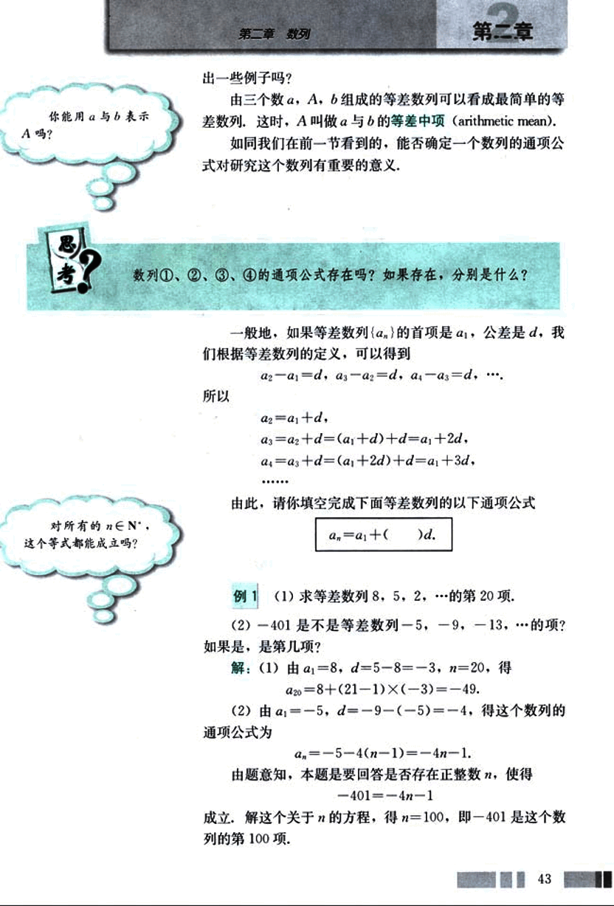
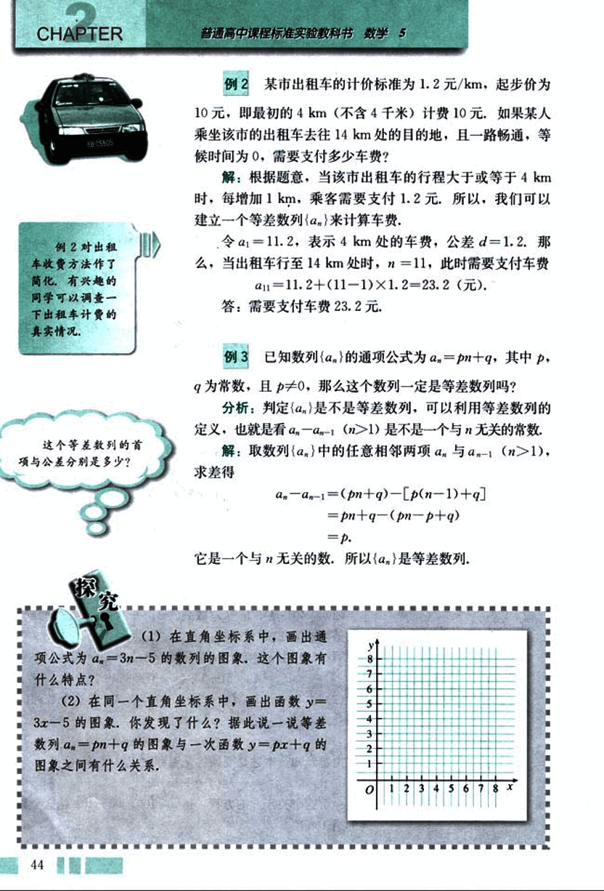
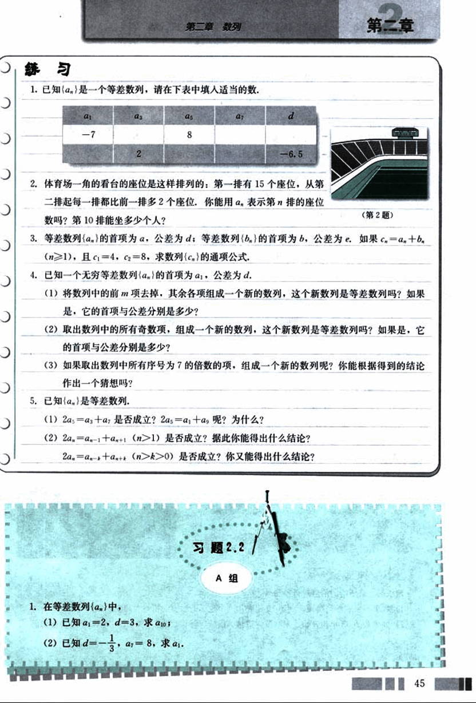
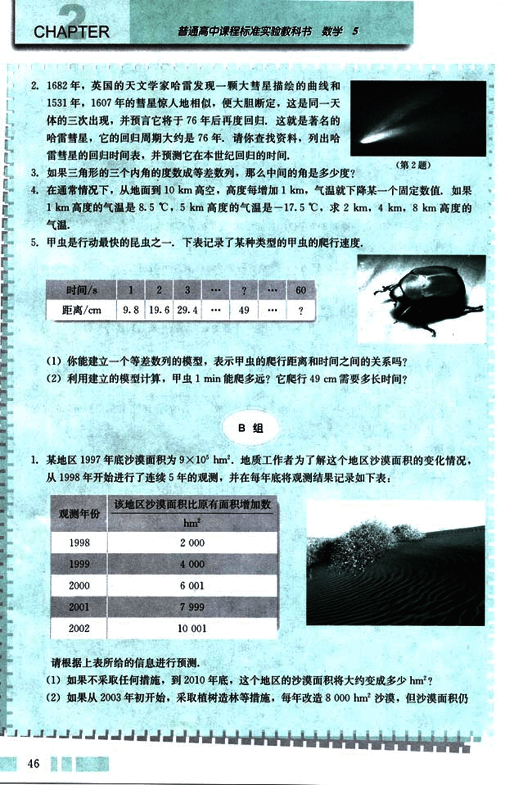
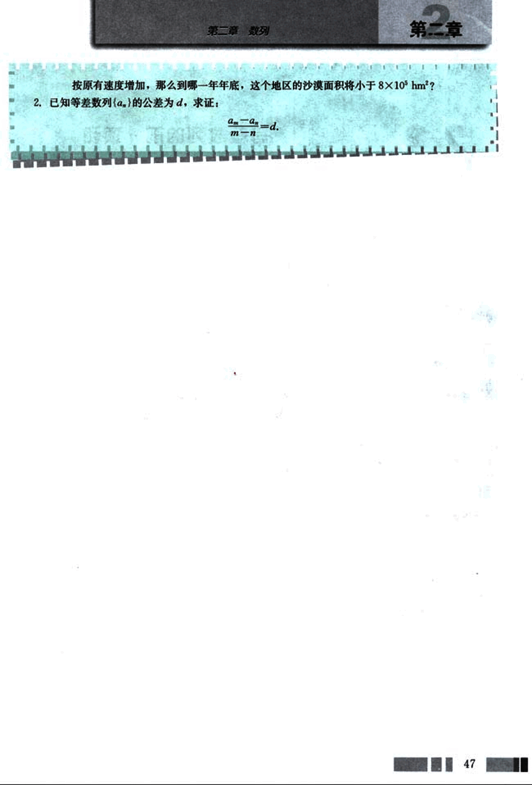

# 2.2　等差数列

54

# CHAPTER 2

## 2.2 等差数列

从特殊入手，研究数学对象的性质，再逐步扩展到一般，这是数学常用的研究方法。

我们在初中学习了实数，研究了它的一些运算与性质（如加、减、乘、除运算，能被3、5、7整除的数的特征等）。现在，我们面对数列（一列数），能不能也像研究实数一样，研究它的项与项之间的关系，运算与性质呢？

为此，我们先从一些特殊的数列入手来研究这些问题。

在现实生活中，我们会遇到下面的特殊数列。

我们经常这样数数，从0开始，每隔5数一次，可以得到数列：

0, 5, …

① 2000年，在澳大利亚悉尼举行的奥运会上，女子举重被正式列为比赛项目，该项目共设置了7个级别，其中较轻的4个级别体重组成数列（单位：kg）：

48, 53, 58, 63.

② 水库的管理人员为了保证优质鱼类有良好的生活环境，用定期放水清库的办法清理水库中的杂鱼。如果一个水库的水位为18 m，自然放水每天水位降低2.5 m，最低降至5 m。那么从开始放水算起，到可以进行清理工作的那天，水库每天的水位组成数列（单位：m）：

18, 15.5, 13, 10.5, 8, 5.5.

③ 我国现行储蓄制度规定银行支付存款利息的方式为单利，即不把利息加入本金计算下一期的利息。按照单利计算本利和的公式是：

本利和 = 本金 × (1 + 利率 × 存期)

例如，按活期存入10 000元钱，年利率是0.72%，那么按照单利，5年内各年末的本利和分别是：

41

55

# CHAPTER 2

普通高中课程标准实验教科书 数学 5

##  假设5年既不加进存款也不取款,且不扣除利息税。

| 时间 | 年初本金(元) | 年末本利和(元) |
|---|---|---|
| 第1年 | 10 000 | 10 072 |
| 第2年 | 10 000 | 10 144 |
| 第3年 | 10 000 | 10 216 |
| 第4年 | 10 000 | 10 288 |
| 第5年 | 10 000 | 10 360 |

各年末的本利和(单位:元)组成了数列:

10 072, 10 144, 10 216, 10 288, 10 360. ④

上面的数列①、②、③、④有什么共同特点?

可以看到:

对于数列①,从第2项起,每一项与前一项的差都等于____;

对于数列②,从第2项起,每一项与前一项的差都等于____;

对于数列③,从第2项起,每一项与前一项的差都等于____;

对于数列④,从第2项起,每一项与前一项的差都等于____;

也就是说，这些数列有一个共同特点：从第2项起，每一项与前一项的差都等于同一个常数。

一般地，如果一个数列从第2项起，每一项与它的前一项的差等于同一个常数，那么这个数列就叫做等差数列(arithmetic sequence)，这个常数叫做等差数列的公差(common difference)，公差通常用字母 *d* 表示。

上面的四个数列都是等差数列，公差依次是_____,_____,_____,_____.

日常生活中，人们常常用到等差数列，例如，在给各种产品的尺寸划分级别时，当其中的最大尺寸与最小尺寸相差不大时，常按等差数列进行分级(如衬衫的尺码)，你能举

42

56

# 第二章 数列

## 第二节

出一些例子吗？

你能用 *a* 与 *b* 表示 *A* 吗？

由三个数 *a*, *A*, *b* 组成的等差数列可以看成最简单的等差数列，这时，*A* 叫做 *a* 与 *b* 的等差中项 (arithmetic mean).

如同我们在前一节看到的，能否确定一个数列的通项公式对研究这个数列有重要的意义。

数列①、②、③、④的通项公式存在吗？如果存在，分别是什么？

一般地，如果等差数列 $\{a_n\}$ 的首项是 $a_1$，公差是 *d*，我们根据等差数列的定义，可以得到

$a_2 = a_1 + d$ ,  $a_3 = a_2 + d$ , $a_4 = a_3 + d$ , ...

所以

$a_2 = a_1 + d$,

$a_3 = a_2 + d = (a_1 + d) + d = a_1 + 2d$,

$a_4 = a_3 + d = (a_1 + 2d) + d = a_1 + 3d$,

...

由此，请你填空完成下面等差数列的以下通项公式

$a_n = a_1 + ( \underline{\qquad} )d$.

对所有的 $n \in N^*$，这个等式都能成立吗？

## 例 1

(1) 求等差数列 8, 5, 2, … 的第 20 项.

(2) -401是不是等差数列 -5, -9, -13, … 的项？如果是，是第几项？

解：(1) 由 $a_1 = 8$ , $d = 5 - 8 = -3$ , $n = 20$ , 得

$a_{20} = 8 + (21 - 1) \times (-3) = -49$.

(2) 由 $a_1 = -5$ , $d = -9 - (-5) = -4$ , 得这个数列的通项公式为

$a_n = -5 - 4(n - 1) = -4n - 1$.

由题意知，本题是要回答是否存在正整数 *n*，使得

$-401 = -4n - 1$

成立。解这个关于 *n* 的方程，得 $n = 100$，即 -401 是这个数列的第 100 项.

43

57

# CHAPTER 2

## 例 2

某市出租车的计价标准为 1.2 元/km，起步价为 10 元，即最初的 4 km（不含 4 千米）计费 10 元。如果某人乘坐该市的出租车去往 14 km 处的目的地，且一路畅通，等待时间为 0，需要支付多少车费？

解：根据题意，当该市出租车的行程大于或等于 4 km 时，每增加 1 km，乘客需要支付 1.2 元。所以，我们可以建立一个等差数列 $\{a_n\}$ 来计算车费。

令 $a_1 = 11.2$，表示 4 km 处的车费，公差 $d = 1.2$。那么，当出租车行至 14 km 处时，$n = 11$，此时需要支付车费

$a_{11} = 11.2 + (11 - 1) \times 1.2 = 23.2$ (元)。

答：需要支付车费 23.2 元。

## 例 3

已知数列 $\{a_n\}$ 的通项公式为 $a_n = pn + q$，其中 $p$，$q$ 为常数，且 $p \ne 0$，那么这个数列一定是等差数列吗？

分析：判定 $\{a_n\}$ 是否是等差数列，可以利用等差数列的定义，也就是看 $a_n - a_{n-1} (n > 1)$是不是一个与 $n$ 无关的常数。

解：取数列 $\{a_n\}$ 中的任意相邻两项 $a_n$ 与 $a_{n-1} (n > 1)$，求差得

$a_n - a_{n-1} = (pn + q) - [p(n - 1) + q]$

$= pn + q - (pn - p + q)$

$= p$。

它是一个与 $n$ 无关的数，所以 $\{a_n\}$ 是等差数列。

## 探究

(1) 在直角坐标系中，画出通项公式为 $a_n = 3n - 5$ 的数列的图象，这个图象有什么特点？

(2) 在同一个直角坐标系中，画出函数 $y = 3x - 5$ 的图象，你发现了什么？据此说一说等差数列 $a_n = pn + q$ 的图象与一次函数 $y = px + q$ 的图象之间有什么关系。

[graph](images/graph.png)

44

58

# 第二章 数列

## 练习

1. 已知{$a_n$}是一个等差数列，请在下表中填入适当的数。

| $a_1$ | $a_3$ | $a_5$ | $a_7$ | $d$ |
|---|---|---|---|---|
| -7 |  | 8 |  | -6.5 |
|  | 2 |  |  |  |

2. 体育场一角的看台的座位是这样排列的：第一排有 15 个座位，从第二排起每一排都比前一排多 2 个座位，你能用 $a_n$ 表示第 $n$ 排的座位数吗？第 10 排能坐多少个人？

[stadium](images/stadium.png)

(第2题)

3. 等差数列{$a_n$}的首项为 $a_1$，公差为 $d$；等差数列{$b_n$}的首项为 $b$，公差为 $e$。如果 $c_n = a_n + b_n$ ($n \ge 1$)，且 $c_1 = 4$，$c_2 = 8$，求数列{$c_n$}的通项公式。

4. 已知一个无穷等差数列{$a_n$}的首项为 $a_1$，公差为 $d$。

(1) 将数列中的前 $m$ 项去掉，其余各项组成一个新的数列，这个新数列是等差数列吗？如果是，它的首项与公差分别是多少？

(2) 取出数列中的所有奇数项，组成一个新的数列，这个新数列是等差数列吗？如果是，它的首项与公差分别是多少？

(3) 如果取出数列中所有序号为 7 的倍数的项，组成一个新的数列呢？你能根据得到的结论作出一个猜想吗？

5. 已知{$a_n$}是等差数列。

(1) $2a_3 = a_1 + a_5$ 是否成立？$2a_5 = a_1 + a_9$ 呢？为什么？

(2) $2a_n = a_{n-1} + a_{n+1}$ ($n > 1$) 是否成立？据此你能得出什么结论？

$2a_n = a_{n-k} + a_{n+k}$ ($n > k > 0$) 是否成立？你又能得出什么结论？

## 习题 2.2 / A组

1. 在等差数列{$a_n$}中，

(1) 已知 $a_1 = 2$，$d = 3$，求 $a_{10}$；

(2) 已知 $d = -\frac{1}{3}$，$a_5 = 8$，求 $a_1$。

45

59

# CHAPTER 2

## 2.

1682年，英国的天文学家哈雷发现一颗大彗星描绘的曲线和1531年，1607年的彗星惊人地相似，便大胆断定，这是同一天体的三次出现，并预言它将于76年后再度回归，这就是著名的哈雷彗星，它的回归周期大约是76年。请你查找资料，列出哈雷彗星的回归时间表，并预测它在本世纪回归的时间。

## 3.

如果三角形的三个内角的度数成等差数列，那么中间的角是多少度？

## 4.

在通常情况下，从地面到10km高空，高度每增加1km，气温就下降某一个固定数值。如果1km高度的气温是8.5℃，5km高度的气温是-17.5℃，求2 km，4 km，8 km高度的气温。

## 5.

甲虫是行动最快的昆虫之一，下表记录了某种类型的甲虫的爬行速度：

| 时间/s | 1 | 2 | 3 | ... | ? | ... | 60 |
|---|---|---|---|---|---|---|---|
| 距离/cm | 9.8 | 19.6 | 29.4 | ... | 49 | ... | ? |

(1)你能建立一个等差数列的模型，表示甲虫的爬行距离和时间之间的关系吗？

(2)利用建立的模型计算，甲虫1min能爬多远？它爬行49cm需要多长时间？

## B组

## 1.

某地区1997年底沙漠面积为$9 \times 10^5 hm^2$，地质工作者为了解这个地区沙漠面积的变化情况，从1998年开始进行了连续5年的观测，并在每年底将观测结果记录如下表：

| 观测年份 | 该地区沙漠面积比原有面积增加数 ($hm^2$) |
|---|---|
| 1998 | 2 000 |
| 1999 | 4 000 |
| 2000 | 6 001 |
| 2001 | 7 999 |
| 2002 | 10 001 |

请根据上表所给的信息进行预测：

(1)如果不采取任何措施，到2010年底，这个地区的沙漠面积将大约变成多少$hm^2$?

(2)如果从2003年初开始，采取植树造林等措施，每年改造8 000 $hm^2$沙漠，但沙漠面积仍

46

60

# 第二章 数列

## 第二章

按原有速度增加，那么到哪一年年底，这个地区的沙漠面积将小于 8 × 105 hm2？

2. 已知等差数列{$a_n$}的公差为d，求证：
$\frac{a_m - a_n}{m - n} = d$

47

