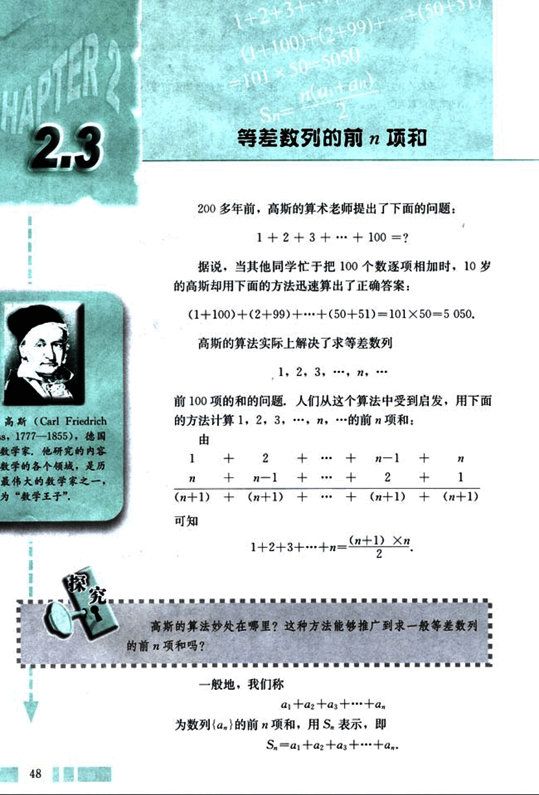
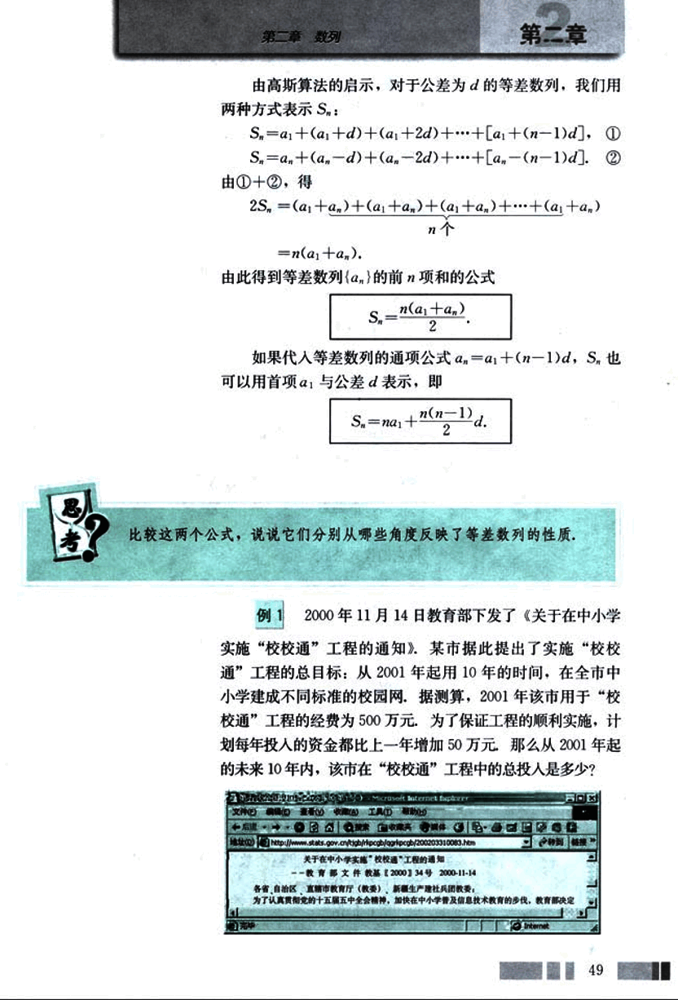
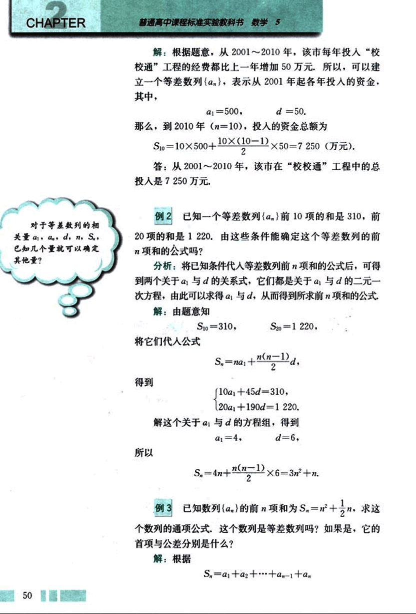
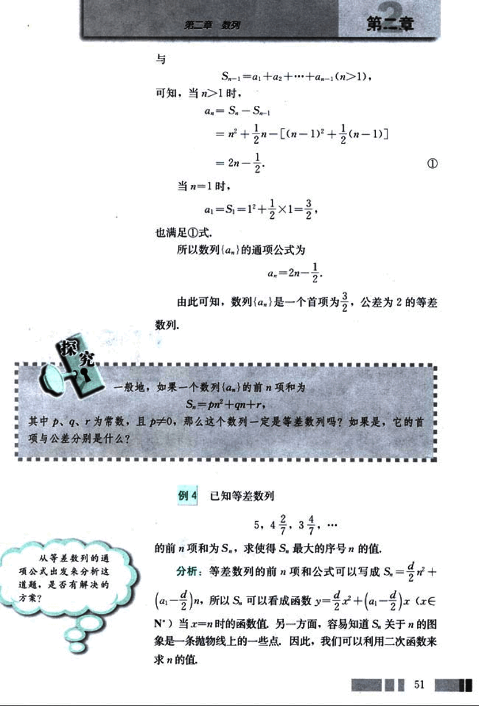
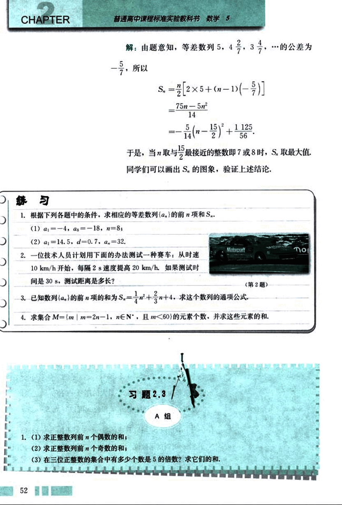
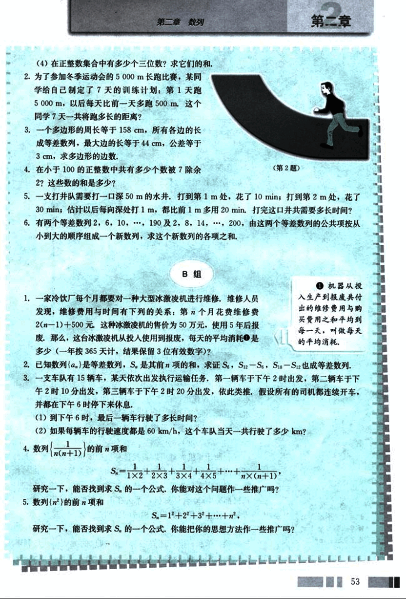

# 2.3　等差数列的前n项和

61

# 等差数列的前n项和

200多年前，高斯的算术老师提出了下面的问题：

1 + 2 + 3 + ... + 100 = ?

据说，当其他同学忙于把100个数逐项相加时，10岁的高斯却用下面的方法迅速算出了正确答案：

(1+100) + (2+99) + ... + (50+51) = 101 × 50 = 5050.

高斯的算法实际上解决了求等差数列

1, 2, 3, ..., *n*, ...

前100项和的问题。人们从这个算法中受到启发，用下面的方法计算1, 2, 3, ..., *n*, ... 的前*n*项和：

由

$\frac{1}{n} + \frac{2}{n-1} + ... + \frac{n-1}{2} + \frac{n}{1}$

+

$\frac{(n+1)}{n} + \frac{(n+1)}{n-1} + ... + \frac{(n+1)}{2} + \frac{(n+1)}{1}$

可知

$1 + 2 + 3 + ... + n = \frac{(n+1) \times n}{2}$.

高斯的算法妙处在哪里？这种方法能够推广到求一般等差数列的前*n*项和吗？

一般地，我们称

$a_1 + a_2 + a_3 + ... + a_n$

为数列{$a_n$}的前*n*项和，用$S_n$表示，即

$S_n = a_1 + a_2 + a_3 + ... + a_n$.

---
48

62

# 第二章 数列

## 由高斯算法的启示

由高斯算法的启示，对于公差为d的等差数列，我们用两种方式表示Sn:

Sn = a1 + (a1+d) + (a1+2d) + ··· + [a1+(n-1)d]. ①

Sn = an + (an-d) + (an-2d) + ··· + [an-(n-1)d]. ②

由①+②，得

2Sn = (a1+an) + (a1+an) + (a1+an) + ··· + (a1+an)

= n(a1+an).

由此得到等差数列{an}的前n项和的公式

$S_n = \frac{n(a_1+a_n)}{2}.$

如果代入等差数列的通项公式 an = a1+(n-1)d，Sn 也可以用首项a1与公差d表示，即

$S_n = na_1 + \frac{n(n-1)}{2}d.$

## 思考

比较这两个公式，说说它们分别从哪些角度反映了等差数列的性质。

## 例 1

2000年11月14日教育部下发了《关于在中小学实施“校校通”工程的通知》，某市据此提出了实施“校校通”工程的总目标：从2001年起用10年的时间，在全市中小学建成不同标准的校园网，据测算，2001年该市用于“校校通”工程的经费为500万元，为了保证工程的顺利实施，计划每年投入的资金都比上一年增加50万元，那么从2001年起的未来10年内，该市在“校校通”工程中的总投入是多少？

[image](images/image.png)

49

63

# CHAPTER 2

普通高中课程标准实验教科书 数学 5

解：根据题意，从 2001～2010 年，该市每年投入“校校通”工程的经费都比上一年增加 50 万元，所以，可以建立一个等差数列{$a_n$}，表示从 2001 年起各年投入的资金，其中，

$a_1=500$，  $d=50$。

那么，到 2010 年 ($n=10$)，投入的资金总额为

$S_{10} = 10 \times 500 + \frac{10 \times (10-1)}{2} \times 50 = 7250$ (万元)。

答：从 2001～2010 年，该市在“校校通”工程中的总投入是 7250 万元。

## 例 2

已知一个等差数列 {$a_n$} 前 10 项的和是 310，前 20 项的和是 1220。由这些条件能确定这个等差数列的前 n 项和的公式吗？

分析：将已知条件代入等差数列前 n 项和的公式后，可得到两个关于 $a_1$ 与 $d$ 的关系式，它们都是关于 $a_1$ 与 $d$ 的二元一次方程，由此可以求得 $a_1$ 与 $d$，从而得到所求前 n 项和的公式。

解：由题意知

$S_{10} = 310$，  $S_{20} = 1220$。

将它们代入公式

$S_n = na_1 + \frac{n(n-1)}{2}d$，

得到

$\begin{cases} 10a_1 + 45d = 310 \\ 20a_1 + 190d = 1220 \end{cases}$

解这个关于 $a_1$ 与 $d$ 的方程组，得到

$a_1 = 4$，  $d = 6$。

所以

$S_n = 4n + \frac{n(n-1)}{2} \times 6 = 3n^2 + n$。

## 例 3

已知数列 {$a_n$} 的前 n 项和为 $S_n = n^2 + \frac{1}{2}n$，求这个数列的通项公式。这个数列是等差数列吗？如果是，它的首项与公差分别是什么？

解：根据

$S_n = a_1 + a_2 + \dots + a_{n-1} + a_n$

64

# 第二章 数列

与

$S_n = a_1 + a_2 + \dots + a_{n-1} \quad (n>1)$，

可知，当 $n>1$ 时，

$a_n = S_n - S_{n-1}$

$= n^2 + \frac{1}{2}n - [(n-1)^2 + \frac{1}{2}(n-1)]$

$= 2n - \frac{1}{2}$

当 $n=1$ 时，

$a_1 = S_1 = 1^2 + \frac{1}{2} \times 1 = \frac{3}{2}$，

也满足①式.

所以数列 $\{a_n\}$ 的通项公式为

$a_n = 2n - \frac{1}{2}$

由此可知，数列 $\{a_n\}$ 是一个首项为 $\frac{3}{2}$，公差为 2 的等差数列.

一般地，如果一个数列 $\{a_n\}$ 的前 n 项和为

$S_n = pn^2 + qn + r$，

其中 p，q，r 为常数，且 $p \ne 0$，那么这个数列一定是等差数列吗？如果是，它的首项与公差分别是什么？

例 4 已知等差数列

5, 4, 2, $\frac{3}{7}$, $\dots$

的前 n 项和为 $S_n$，求使得 $S_n$ 最大的序号 n 的值.

分析：等差数列的前 n 项和公式可以写成 $S_n = \frac{d}{2}n^2 + (a_1 - \frac{d}{2})n$，所以 $S_n$ 可以看成函数 $y = \frac{d}{2}x^2 + (a_1 - \frac{d}{2})x \quad (x \in N^*)$ 当 $x = n$ 时的函数值. 另一方面，容易知道 $S_n$ 关于 n 的图像是一条抛物线上的一些点，因此，我们可以利用二次函数来求 n 的值.

51

65

# CHAPTER 2

普通高中课程标准实验教科书 数学 5

解：由题意知，等差数列 5，$\frac{2}{7}$，4，3，$\frac{4}{7}$，… 的公差为$-\frac{5}{7}$，所以

$S_n = \frac{n}{2}[2 \times 5 + (n-1)(-\frac{5}{7})]$

$= \frac{75n - 5n^2}{14}$

$= -\frac{5}{14}(n - \frac{15}{2})^2 + \frac{1125}{56}$

于是，当n取与$\frac{15}{2}$最接近的整数即7或8时，$S_n$取最大值.

同学们可以画出$S_n$的图象，验证上述结论.

## 练习

1. 根据下列各题中的条件，求相应的等差数列{$a_n$}的前n项和$S_n$.

(1) $a_1 = -4$，$a_5 = 18$，$n = 8$;

(2) $a_1 = 14.5$，$d = -0.7$，$a_n = 32$.

2. 一位技术人员计划用下面的办法测试一种赛车：从时速 10 km/h 开始，每隔 2s 速度提高 20 km/h. 如果测试时间是 30s，测试距离是多长？

[第2题](images/2.png)

3. 已知数列{$a_n$}的前n项和为 $S_n = \frac{1}{4}n^2 + \frac{2}{3}n + 4$，求这个数列的通项公式.

4. 求集合 $M = \{m | m = 2n - 1, n \in N^*, 且 m < 60\}$ 的元素个数，并求这些元素的和.

## 习题 2.3  A 组

1. (1) 求正整数列前n个偶数的和;

(2) 求正整数列前n个奇数的和;

(3) 在三位正整数的集合中有多少个数是5的倍数？求它们的和.

52

66

# 第二章 数列

(4)在正整数集合中有多少个三位数？求它们的和。

2. 为了参加冬季运动会的 5000 m 长跑比赛，某同学给自己制定了 7 天的训练计划：第 1 天跑 5000 m，以后每天比前一天多跑 500 m。这个同学 7 天一共将跑多长的距离？

3. 一个多边形的周长等于 158 cm，所有各边的长成等差数列，最大边的长等于 44 cm，公差等于 3 cm，求多边形的边数。

4. 在小于 100 的正整数中共有多少个数被 7 除余 2？这些数的和是多少？

5. 一支打井队需要打一口深 50 m 的水井，打到第 1 m 处，花了 10 min；打到第 2 m 处，花了 30 min；估计以后每向深处打 1 m，都比前 1 m 多用 20 min，打完这口井共需要多长时间？

6. 有两个等差数列 2，6，10，……，190 及 2，8，14，……，200，由这两个等差数列的公共项按从小到大的顺序组成一个新数列，求这个新数列的各项之和。

## B 组

1. 一家冷饮厂每个月都要对一种大型冰激凌机进行维修，维修人员发现，维修费用与时间有下列的关系：第 n 个月花费维修费 2(n-1)+500 元，这种冰激凌机的售价为 50 万元，使用 5 年后报废，那么，这台冰激凌机从投入使用到报废，每天的平均消耗是多少（一年按 365 天计，结果保留 3 位有效数字）？

2. 已知数列 {$a_n$} 是等差数列，$S_n$ 是其前 n 项的和，求证 $S_6$，$S_{12} - S_6$，$S_{18} - S_{12}$ 也成等差数列。

3. 一支车队有 15 辆车，某天依次出发执行运输任务，第一辆车于下午 2 时出发，第二辆车于下午 2 时 10 分出发，第三辆车于下午 2 时 20 分出发，依此类推，假设所有的司机都连续开车，并都在下午 6 时停下来休息。

(1) 到下午 6 时，最后一辆车行驶了多长时间？

(2) 如果每辆车的行驶速度都是 60 km/h，这个车队当天一共行驶了多少 km？

4. 数列 $\frac{1}{n(n+1)}$ 的前 n 项和

$S_n = \frac{1}{1\times2} + \frac{1}{2\times3} + \frac{1}{3\times4} + \frac{1}{4\times5} + ... + \frac{1}{n\times(n+1)}$

研究一下，能否找到求 $S_n$ 的一个公式，你能对这个问题作一些推广吗？

5. 数列 {$n^2$} 的前 n 项和

$S_n = 1^2 + 2^2 + 3^2 + ... + n^2$

研究一下，能否找到求 $S_n$ 的一个公式，你能把你的思想方法作一些推广吗？

53

