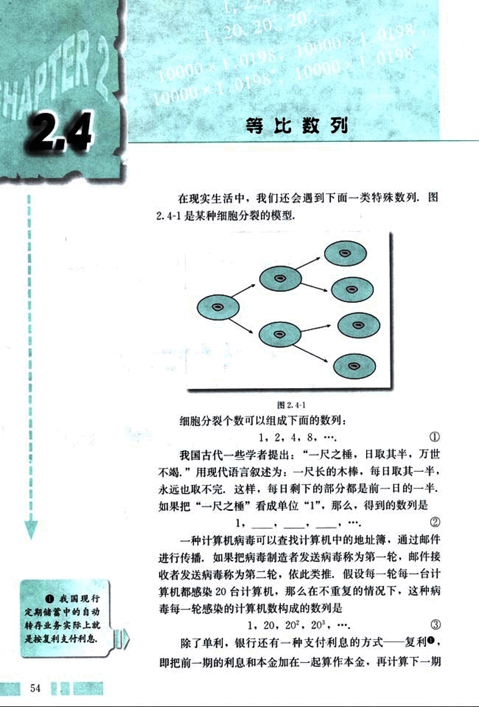
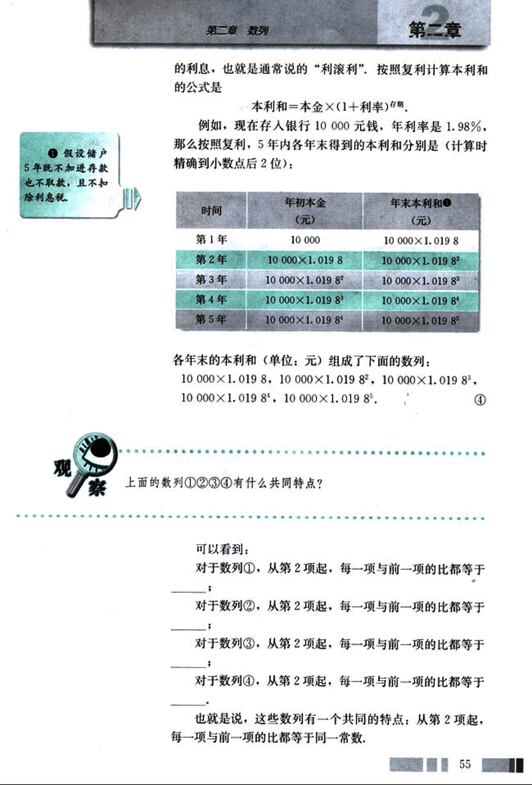
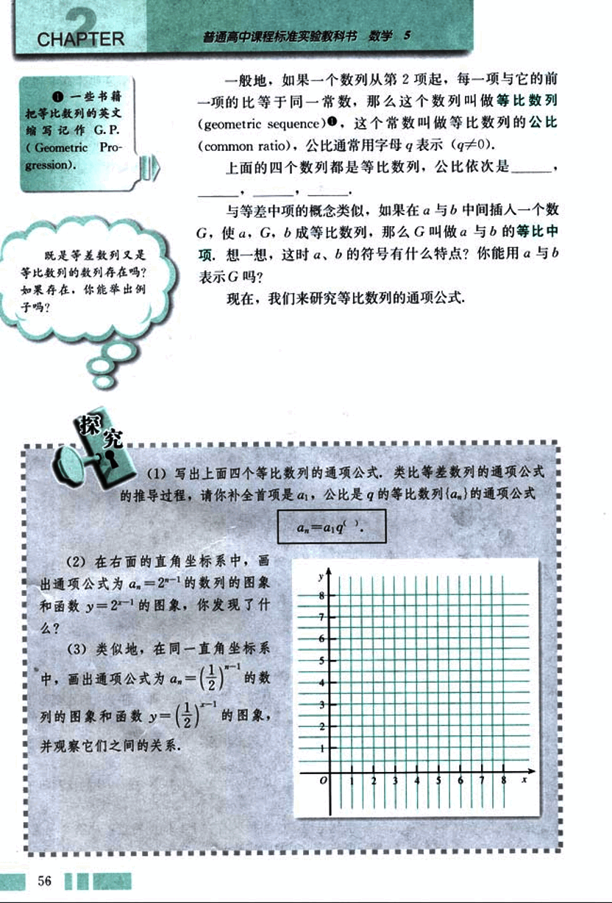
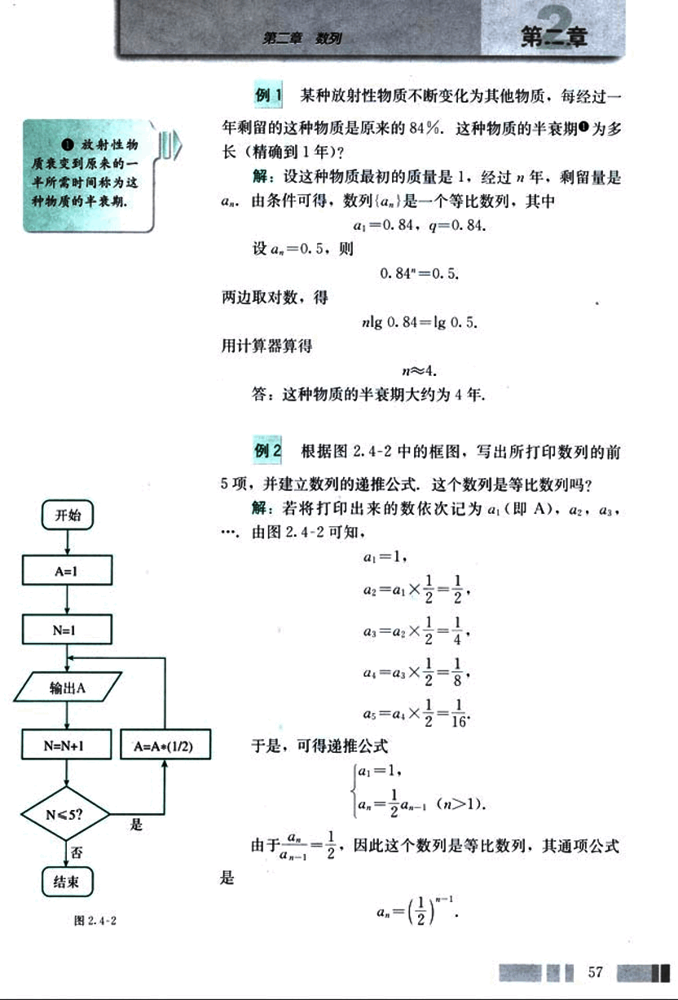
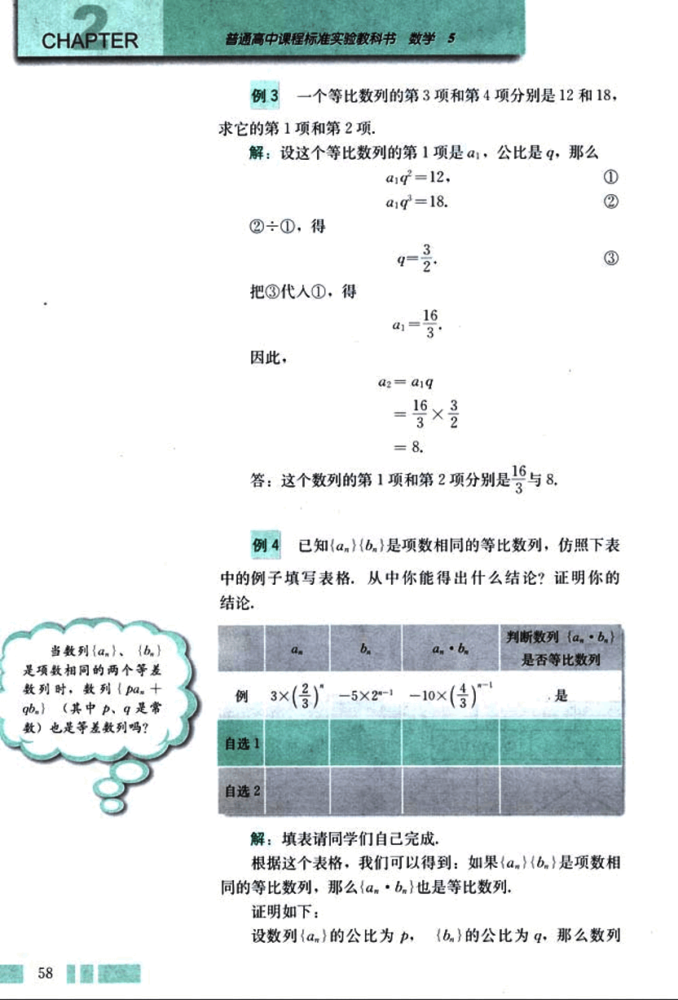
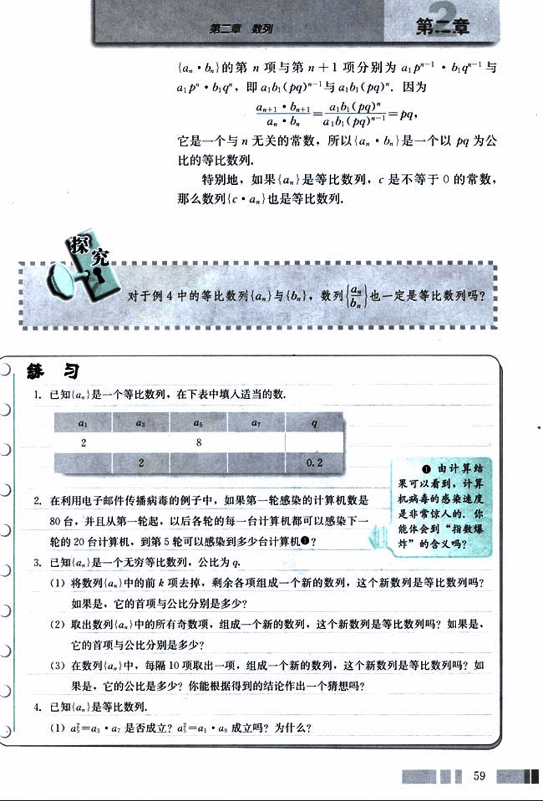
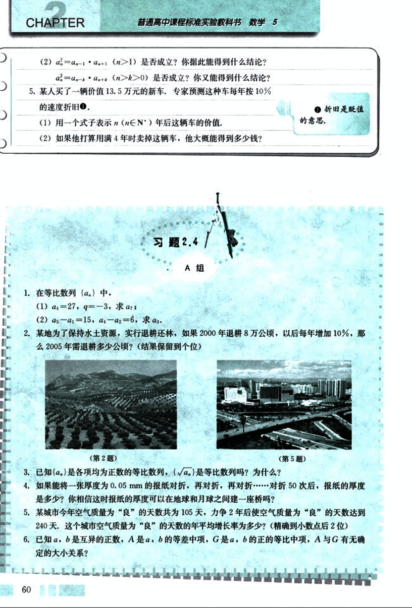
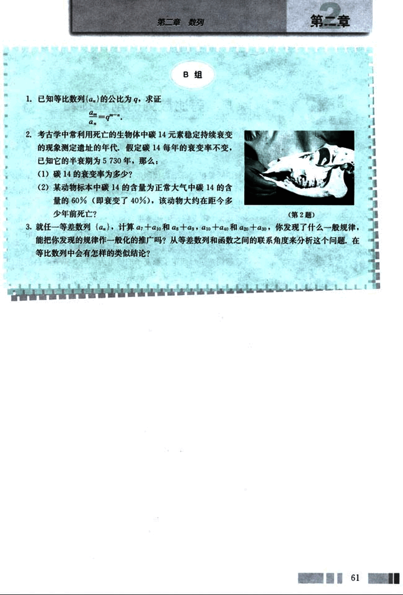

# 2.4　等比数列

67

# CHAPTER 2

## 2.4 等比数列

在现实生活中，我们还会遇到下面一类特殊数列，图 2.4-1 是某种细胞分裂的模型。

[图2.4-1](images/2.4-1.png)

细胞分裂个数可以组成下面的数列：

1, 2, 4, 8, … ①

我国古代一些学者提出：“一尺之棰，日取其半，万世不竭，”用现代语言叙述为：一尺长的木棒，每日取其一半，永远也取不完，这样，每日剩下的部分都是前一日的一半，如果把“一尺之棰”看成单位“1”，那么，得到的数列是

1,  ②

一种计算机病毒可以查找计算机中的地址簿，通过邮件进行传播，如果把病毒制造者发送病毒称为第一轮，邮件接收者发送病毒称为第二轮，依此类推，假设每一轮每一台计算机都感染20台计算机，那么在不重复的情况下，这种病毒每一轮感染的计算机数构成的数列是

1, 20, 202, 203, … ③

除了单利，银行还有一种支付利息的方式——复利，即把前一期的利息和本金加在一起算作本金，再计算下一期

68

# 第二章 数列

## 利滚利

的利息，也就是通常说的“利滚利”，按照复利计算本利和的公式是：

本利和=本金×(1+利率)$^{存期}$

例如，现在存入银行10 000元钱，年利率是1.98%，那么按照复利，5年内各年末得到的本利和分别是（计算时精确到小数点后2位）：

| 时间 | 年初本金 (元) | 年末本利和 (元) |
|---|---|---|
| 第1年 | 10 000 | 10 000×1.019 8 |
| 第2年 | 10 000×1.019 8 | 10 000×1.019 82 |
| 第3年 | 10 000×1.019 82 | 10 000×1.019 83 |
| 第4年 | 10 000×1.019 83 | 10 000×1.019 84 |
| 第5年 | 10 000×1.019 84 | 10 000×1.019 85 |

各年末的本利和（单位：元）组成了下面的数列：

10 000×1.019 8，10 000×1.019 82，10 000×1.019 83，10 000×1.019 84，10 000×1.019 85

上面的数列①②③④有什么共同特点？

可以看到：

对于数列①，从第2项起，每一项与前一项的比都等于___；

对于数列②，从第2项起，每一项与前一项的比都等于___；

对于数列③，从第2项起，每一项与前一项的比都等于___；

对于数列④，从第2项起，每一项与前一项的比都等于___；

也就是说，这些数列有一个共同的特点：从第2项起，每一项与前一项的比都等于同一个常数，

55

69

# CHAPTER 2

## ● 一些书籍把等比数列的英文缩写记作 G. P. (Geometric Progression).

既是等差数列又是等比数列的数列存在吗？如果存在，你能举出例子吗？

一般地，如果一个数列从第2项起，每一项与它的前一项的比等于同一常数，那么这个数列叫做等比数列 (geometric sequence)，这个常数叫做等比数列的公比 (common ratio)，公比通常用字母 $q$ 表示 ($q \ne 0$).

上面的四个数列都是等比数列，公比依次是 ________，________，________，________。

与等差中项的概念类似，如果在 $a$ 与 $b$ 中间插入一个数 $G$，使 $a$，$G$，$b$ 成等比数列，那么 $G$ 叫做 $a$ 与 $b$ 的等比中项。想一想，这时 $a$、$b$ 的符号有什么特点？你能用 $a$ 与 $b$ 表示 $G$ 吗？

现在，我们来研究等比数列的通项公式。

(1) 写出上面四个等比数列的通项公式，类比等差数列的通项公式的推导过程，请你补全首项是 $a_1$，公比是 $q$ 的等比数列 $\{a_n\}$ 的通项公式

$a_n = a_1 q^{n-1}$

(2) 在右面的直角坐标系中，画出通项公式为 $a_n = 2^{n-1}$ 的数列的图象和函数 $y = 2^{n-1}$ 的图象，你发现了什么？

[image](images/graph.png)

(3) 类似地，在同一直角坐标系中，画出通项公式为 $a_n = (\frac{1}{2})^{n-1}$ 的数列的图象和函数 $y = (\frac{1}{2})^{n-1}$ 的图象，并观察它们之间的关系。

56

70

# 第二章 数列

## 例1

●放射性物质
质衰变到原来的一
半所需时间称为这
种物质的半衰期,

某种放射性物质不断变化为其他物质，每经过一年剩留的这种物质是原来的84%。这种物质的半衰期为多长（精确到1年）？

解：设这种物质最初的质量是1，经过$n$年，剩留量是$a_n$。由条件可得，数列{$a_n$}是一个等比数列，其中$a_1$=0.84, $q$=0.84.

设$a_n$=0.5，则  $0.84^n$=0.5.

两边取对数，得  $nlg$ 0.84 = $lg$ 0.5.

用计算器算得  $n$≈4.

答：这种物质的半衰期大约为4年。

## 例2

根据图2.4-2中的框图，写出所打印数列的前5项，并建立数列的递推公式，这个数列是等比数列吗？

解：若将打印出来的数依次记为$a_1$(即A),$a_2$, $a_3$,……由图2.4-2可知，

$a_1$=1,

$a_2$=$a_1$×$\frac{1}{2}$=$\frac{1}{2}$,

$a_3$=$a_2$×$\frac{1}{2}$=$\frac{1}{4}$,

$a_4$=$a_3$×$\frac{1}{2}$=$\frac{1}{8}$,

$a_5$=$a_4$×$\frac{1}{2}$=$\frac{1}{16}$.

于是，可得递推公式

$a_1$=1,

$\begin{cases} a_1=1, \\ a_n=\frac{1}{2}a_{n-1} \end{cases}$ ($n$>1).

由于$\frac{a_n}{a_{n-1}}$=$\frac{1}{2}$，因此这个数列是等比数列，其通项公式是

$a_n$=($\frac{1}{2}$)$^{n-1}$.

[图2.4-2](images/2.4-2.png)

57

71

# CHAPTER 2

## 例 3

一个等比数列的第 3 项和第 4 项分别是 12 和 18，求它的第 1 项和第 2 项。

解：设这个等比数列的第 1 项是 $a_1$，公比是 q，那么

$a_1q^2 = 12$ ①

$a_1q^3 = 18$ ②

② ÷ ①，得

$q = \frac{3}{2}$ ③

把 ③ 代入 ①，得

$a_1 = \frac{16}{3}$

因此，

$a_2 = a_1q = \frac{16}{3} \times \frac{3}{2} = 8$

答：这个数列的第 1 项和第 2 项分别是 $\frac{16}{3}$ 与 8。

## 例 4

已知 $\{a_n\}$，$\{b_n\}$ 是项数相同的等比数列，仿照下表中的例子填写表格，从中你能得出什么结论？证明你的结论。

| $a_n$             | $b_n$             | $a_n \cdot b_n$ | 判断数列 $\{a_n \cdot b_n\}$ 是否等比数列 |
|-----------------|-----------------|-----------------|---------------------------------|
| 例 $3 \times (\frac{2}{3})^n$ | $-5 \times 2^{n-1}$ | $-10 \times (\frac{4}{3})^{n-1}$ | 是                                 |
| 自选 1           |                   |                 |                                 |
| 自选 2           |                   |                 |                                 |

解：填表请同学们自己完成。

根据这个表格，我们可以得到：如果 $\{a_n\}$，$\{b_n\}$ 是项数相同的等比数列，那么 $\{a_n \cdot b_n\}$ 也是等比数列。

证明如下：

设数列 $\{a_n\}$ 的公比为 p，$\{b_n\}$ 的公比为 q，那么数列

---
58
---

72

# 第二章 数列

## {*an*•*bn*}的第 *n* 项与第 *n*+1 项分别为 *a1pn-1*•*b1qn-1* 与 *a1pn*•*b1qn*,  因为
$\frac{a_{n+1}b_{n+1}}{a_nb_n} = \frac{a_1b_1(pq)^n}{a_1b_1(pq)^{n-1}} = pq$,

它是一个与 *n* 无关的常数，所以 {*anbn*} 是一个以 *pq* 为公比的等比数列。

特别地，如果 {*an*} 是等比数列，*c* 是不等于 0 的常数，那么数列 {*can*} 也是等比数列。

## 练习

1. 已知 {*an*} 是一个等比数列，在下表中填入适当的数：

| *a1* | *a3* | *a5* | *a7* | *q* |
|---|---|---|---|---|
| 2 | 2 | 8 |  | 0.2 |

2. 在利用电子邮件传播病毒的例子中，如果第一轮感染的计算机数是 80 台，并且从第一轮起，以后各轮的每一台计算机都可以感染下一轮的 20 台计算机，到第 5 轮可以感染到多少台计算机？

3. 已知 {*an*} 是一个无穷等比数列，公比为 *q*。

(1) 将数列 {*an*} 中的前 *m* 项去掉，剩余各项组成一个新的数列，这个新数列是等比数列吗？如果是，它的首项与公比分别是多少？

(2) 取出数列 {*an*} 中的所有奇数项，组成一个新的数列，这个新数列是等比数列吗？如果是，它的首项与公比分别是多少？

(3) 在数列 {*an*} 中，每隔 10 项取出一项，组成一个新的数列，这个新数列是等比数列吗？如果是，它的公比是多少？你能根据得到的结论作出一个猜想吗？

4. 已知 {*an*} 是等比数列。

(1) $a_1 = a_3 \cdot a_5$ 是否成立？$a_1^3 = a_3 \cdot a_5$ 成立吗？为什么？

59

73

# CHAPTER 2

普通高中课程标准实验教科书 数学 5

(2) $a_n = a_1 \cdot q^{n-1}$ (n>1) 是否成立？你据此能得到什么结论？

$a_n = a_k \cdot q^{n-k}$ (n>k>0) 是否成立？你又能得到什么结论？

5. 某人买了一辆价值 13.5 万元的新车，专家预测这种车每年按 10% 的速度折旧。

(1) 用一个式子表示 n (n∈N*) 年后这辆车的价值。

(2) 如果他打算用满 4 年时卖掉这辆车，他大概能得到多少钱？

## 习题 2.4

A 组

1. 在等比数列 {an} 中，

(1) a1 = 27, q = 3, 求 a6;

(2) a5 - a1 = 15, a4 - a2 = 6, 求 a5.

2. 某地为了保持水土资源，实行退耕还林，如果 2000 年退耕 8 万公顷，以后每年增加 10%，那么 2005 年需退耕多少公顷？（结果保留到个位）

3. 已知 {an} 是各项均为正数的等比数列，{$\sqrt{a_n}$} 是等比数列吗？为什么？

4. 如果能将一张厚度为 0.05 mm 的报纸对折，再对折，再对折……对折 50 次后，报纸的厚度是多少？你相信这时报纸的厚度可以在地球和月球之间建一座桥吗？

5. 某城市今年空气质量为“良”的天数共为 105 天，力争 2 年后使空气质量为“良”的天数达到 240 天，这个城市空气质量为“良”的天数的年平均增长率为多少？（精确到小数点后 2 位）

6. 已知 a, b 是互异的正数，A 是 a, b 的等差中项，G 是 a, b 的正的等比中项，A 与 G 有无确定的大小关系？

60

74

# 第二章 数列

## B组

1. 已知等比数列{$a_n$}的公比为q，求证
$\frac{a_n}{a_m} = q^{n-m}$

2. 考古学中常利用死亡的生物体中碳14元素稳定持续衰变的现象测定遗址的年代，假定碳14每年的衰变率不变，已知它的半衰期为5730年，那么：
(1) 碳14的衰变率为多少？
(2) 某动物标本中碳14的含量为正常大气中碳14含量的60%（即衰变了40%），该动物大约在距今多少年前死亡？

[skull](images/skull.png)

(第2题)

3. 设任一等差数列{$a_n$}，计算$a_7$+$a_{10}$和$a_5$+$a_9$，$a_{10}$+$a_{40}$和$a_{20}$+$a_{30}$，你发现了什么一般规律，能把你发现的规律作一般化的推广吗？从等差数列和函数之间的联系角度来分析这个问题，在等比数列中会有怎样的类似结论？

61

