# 2.5　等比数列的前n项和

75

# CHAPTER 2

## 2.5 等比数列的前 *n* 项和

国际象棋起源于古代印度，相传国王要奖赏国际象棋的发明者，问他想要什么。发明者说：“请在棋盘的第1个格子里放上1颗麦粒，第2个格子里放上2颗麦粒，第3个格子里放上4颗麦粒，依此类推，每个格子里放的麦粒数都是前一个格子里放的麦粒数的2倍，直到第64个格子，请给我足够的麦粒以实现上述要求。”国王觉得这个要求不高，就欣然同意了。假定千粒麦子的质量为40g，据查，目前世界年度小麦产量约6亿t，根据以上数据，判断国王是否能实现他的诺言。

让我们一起来分析一下，如果把各格所放的麦粒数看成一个数列，我们可以得到一个等比数列。它的首项是1，公比是2。求第1个格子到第64个格子各格所放的麦粒数总和就是求这个等比数列前64项的和。

一般地，对于等比数列 $a_1, a_2, a_3, \dots, a_n, \dots$

它的前 *n* 项和是

$S_n = a_1 + a_2 + a_3 + \dots + a_n$

根据等比数列的通项公式，上式可写成

$S_n = a_1 + a_1q + a_1q^2 + \dots + a_1q^{n-1}$  ①

我们发现，如果用公比q乘①的两边，可得

$qS_n = a_1q + a_1q^2 + \dots + a_1q^{n-1} + a_1q^n$  ②

① ② 的右边有很多相同的项，用①的两边分别减去②的两边，就可以消去这些相同的项，得

$(1 - q)S_n = a_1 - a_1q^n$

当 $q \ne 1$ 时，等比数列的前 *n* 项和的公式为

$S_n = \frac{a_1(1 - q^n)}{1 - q} \quad (q \ne 1)$

当q=1时，等比数列的前n项和$S_n$等于多少？

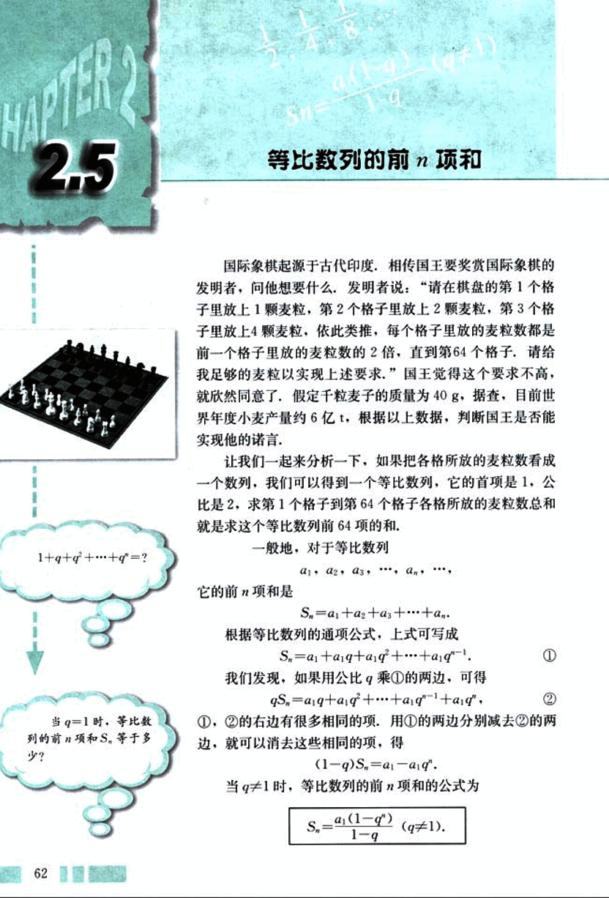
76

# 第二章 数列

## 对于等比数列的相关量 $a_1$, $a_n$, $q$, $n$, $S_n$，已知几个量，就可以确定其他量？

因为 $a_n = a_1 q^{n-1}$，所以上面的公式还可以写成

$S_n = \frac{a_1 - a_1 q^n}{1 - q} (q \ne 1)$.

有了上述公式，就可以解决本节开头提出的问题。由 $a_1 = 1$, $q = 2$, $n = 64$，可得

$S_n = \frac{a_1 (1 - q^n)}{1 - q}$

$= \frac{1 \times (1 - 2^{64})}{1 - 2}$

$= 2^{64} - 1$.

$2^{64} - 1$ 这个数很大，超过了 $1.84 \times 10^{19}$。假定千粒麦子的质量为 40 g，那么麦粒的总质量超过了 7000 亿吨，因此，国王不能实现他的诺言。

## 例 1  求下列等比数列前 8 项的和：

(1) $\frac{1}{2}, \frac{1}{4}, \frac{1}{8}, \dots$

(2) $a_1 = 27$, $a_3 = \frac{1}{243}$, $q < 0$.

### 解：

(1) 因为 $a_1 = 1$, $q = \frac{1}{2}$，所以当 $n = 8$ 时，

$S_n = \frac{\frac{1}{2} [1 - (\frac{1}{2})^8]}{1 - \frac{1}{2}} = \frac{255}{256}$.

(2) 由 $a_1 = 27$, $a_3 = \frac{1}{243}$，可得

$\frac{1}{243} = 27 \cdot q^2$.

又由 $q < 0$，可得

$q = -\frac{1}{3}$.

于是当 $n = 8$ 时，

$S_8 = \frac{27 [1 - (-\frac{1}{3})^8]}{1 - (-\frac{1}{3})} = \frac{1640}{81}$.

63

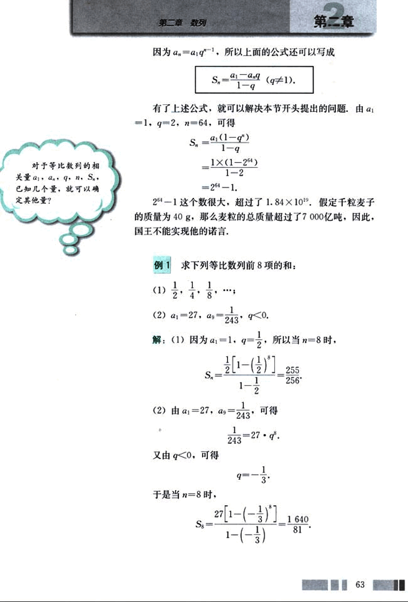
77

# CHAPTER 2

## 例 2

某商场今年销售计算机 5 000 台。如果平均每年 的销售量比上一年的销售量增加 10%，那么从今年起，大约几年可使总销售量达到 30 000 台（结果保留到个位）？

**解:** 根据题意，每年销售量比上一年增加的百分率相同，所以，从今年起，每年的销售量组成一个等比数列 {$a_n$}，其中

$a_1 = 5000$，$q = 1 + 10\% = 1.1$，$S_n = 30000$。

于是得到

$\frac{5000(1 - 1.1^n)}{1 - 1.1} = 30000$。

整理，得

$1.1^n \approx 1.6$。

两边取对数，得

$n \lg 1.1 = \lg 1.6$。

用计算器算得

$n = \frac{\lg 1.6}{\lg 1.1} \approx \frac{0.20}{0.041} \approx 5$(年)。

答：大约 5 年可以使总销量达到 30 000 台。

实际上，数列 {$a_n$} 的前 n 项和 $S_n$ 构成了一个新的数列：

$S_1, S_2, S_3, ..., S_n, ...$

请你完成这个新数列的递推关系：

$\begin{cases} S_1 = \_\_\_\_\_\_\_\_\_\_\_\_ \\ S_n = S_{n-1} + \_\_\_\_\_\_\_\_\_\_\_\_ \end{cases} (n > 1)$。

计算机可以帮助我们求一般数列的前 n 项和，请看下面的例子。

## 例 3

如图 [图2.5-1](images/2_5_1.png) ，为了估计函数 $y = 9 - x^2$ 在第一象限的图象与 x 轴、y 轴围成的区域的面积 X，把 x 轴上的区间 $[0, 3]$ 分成 n 等份，从各分点作 y 轴的平行线与函数图象相交，再从各交点向左作 x 轴的平行线，构成 (n - 1) 个矩形，下面的程序用来计算这 (n - 1) 个矩形的面积的和 S。

---
64
---
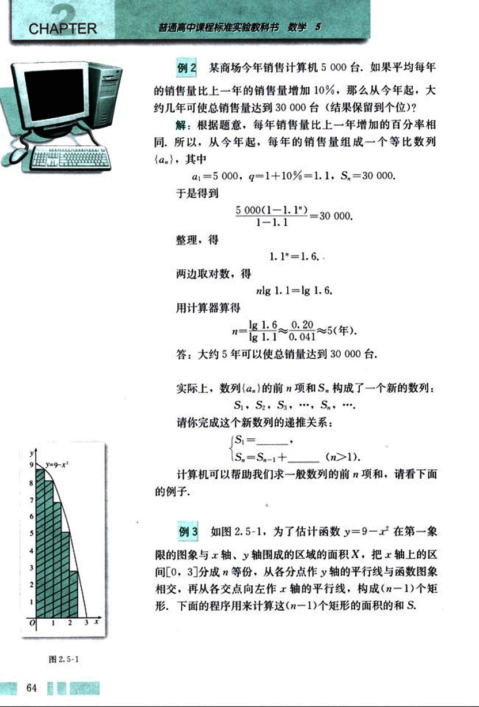
78

# 第二章 数列

## SUM = 0
k=1
INPUT“请输入将[0,3]分成的份数n:”; N
WHILE k<=N-1
AN=(9-(k*3/N)^2)*3/N
SUM=SUM+AN
PRINT k, AN, SUM
k=k+1
WEND
END

## 阅读程序，回答下列问题：

(1)程序中的AN、SUM分别表示什么，为什么？

(2)请根据程序分别计算当n=6, 11, 16时，各个矩形的面积的和（不必在计算机上运行程序）。

### 解：

(1)当把x轴上的区间[0,3]分成n等份时，各等份的长都是$\frac{3}{n}$，即各矩形的底都是$\frac{3}{n}$，显然分点的横坐标分别是$\frac{3}{n}$，$\frac{3×2}{n}$，…，$\frac{3×(n-1)}{n}$，从各分点作y轴的平行线与y=9-$x^2$的图象相交，交点的纵坐标分别是9-$(\frac{3}{n})^2$，9-$(\frac{3×2}{n})^2$，…，9-$[\frac{3×(n-1)}{n}]^2$，它们分别是相应矩形的 高。这样，各个矩形的面积分别是[9-$(\frac{3}{n})^2$]×$\frac{3}{n}$，…，[9-$[\frac{3×(n-1)}{n}]^2$]×$\frac{3}{n}$。所以，程序中的AN表示第k个矩形的面积，SUM表示前k个矩形面积的和。

(2)根据程序，当n=6时，5个矩形的面积的和就是输入N=6时，SUM的最后一个输出值，即SUM=15.625（这里精确到小数点后3位）。

同理，当n=11时，10个矩形的面积的和就是输入N=11时，SUM的最后一个输出值，即SUM=16.736；当n=16时，我们得到15个矩形的面积的和SUM=17.139.

65

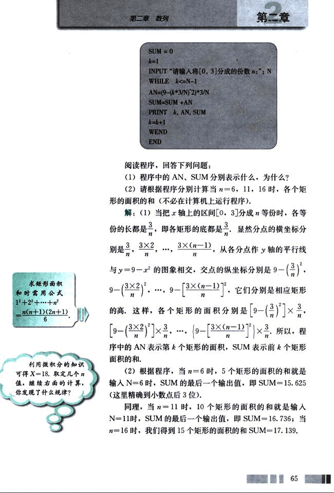
79

# CHAPTER 2

## 练习

1. 根据下列各题中的条件，求相应的等比数列{$a_n$}的前n项和$S_n$。
    (1) $a_1 = 3$, $q = 2$, $n = 6$;
    (2) $a_1 = -2.7$, $q = -\frac{1}{3}$, $a_n = \frac{1}{90}$

2. 如果一个等比数列前5项的和等于10，前10项的和等于50，那么它前15项的和等于多少？

3. 某市近10年的国内生产总值从2 000亿元开始以10%的速度增长，这个城市近10年的国内生产总值一共是多少？

66

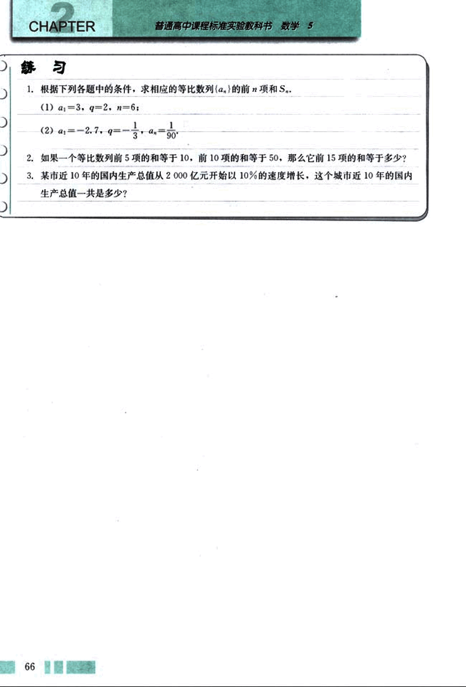
80

# 第二章 数列

## 九连环

九连环是中国的一种古老智力游戏，它环环相扣，趣味无穷。

九连环的结构如图：[图](images/图.png) 9个大小相同的圆环（一般由较粗的铁丝制成），依次排开，每一个圆环上都连有一个较细的铁丝直杆，各直杆在后一个圆环内穿过，九个直杆的另一端都插在一个木板的一排小孔里，直杆的末端都弯成一个小圈，使它们能在小孔里上下移动，但不会脱出。另外有一个粗铁丝做成的框架，圆环可以从框架上解下或套上。玩九连环就是要把这九个圆环全部从框架上解下或套上，但无论是解下还是套上圆环，都要遵循一定的规则，例如我们可以按照下面的方法进行：为了解下第 $i$ 个圆环，必须先解下前 ($i-2$) 个圆环，这是因为：如果前 ($i-1$) 个圆环已经被解下，第 $i$ 个圆环就无法再解下；如果前 ($i-1$) 个圆环已经被解下，第 ($i+1$) 个圆环就可以很容易解下，相反地，要套上第 $i$ 个圆环，必须先套上前 ($i-2$) 个圆环，套上一个圆环与解下一个圆环的过程正好相反，所需要的次数相同。如果按照这个规则解开九连环，最少需要移动圆环多少次呢？

我们不妨考虑 $n$ 个圆环的情况，用 $K(n)$ 表示解下 $n$ 个圆环所需的最少移动次数，显然，解下第 1 个圆环需 $K(1)=1$(次)，当 $n=2$ 时，必须先解下第 2 个圆环，再解下第 1 个圆环，所以解下第 2 个圆环需 $K(2)=2$(次)。

若要解下第 $n$ 个圆环，就必须先解下第 ($n-2$) 个圆环，需要 $K(n-2)$ 次，然后再移动 1 次即可将第 $n$ 个圆环解下，则只剩下第 ($n-1$) 个圆环。

若我们用 $k(n)$ 表示前 ($n-1$) 个圆环都已经解下后，再解下第 $n$ 个圆环所需的次数，则可得下式：

$K(n) = K(n-2) + 1 + k(n-1)$。

接着，我们求 $k(n)$ 的表达式，由前面显然可知，若要将第 $n$ 个圆环解下，必须先将第 ($n-1$) 个圆环套回框架，这个过程需 $k(n-1)$ 次，这时再移动 1 次，就可以解下第 $n$ 个圆环，然后再将第 ($n-1$) 个圆环解下，又需 $k(n-1)$ 次，所以可得

$k(1) = 1$， $k(n) = 2k(n-1) + 1$。

由此得到

$k(n) = 2^2k(n-2) + 2 + 1$

$= 2^3k(n-3) + 2^2 + 2 + 1$

$= ...$

67

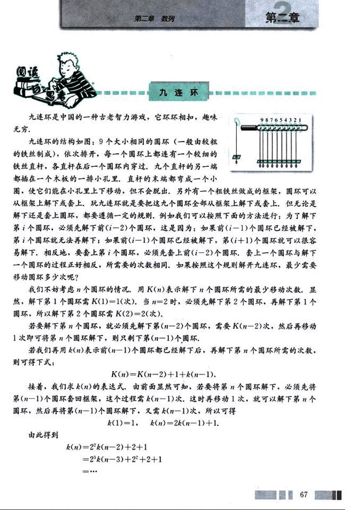
81

# CHAPTER 2

普通高中课程标准实验教科书 数学 5

$=2^{n-1}(1)+2^{n-2}+2^{n-3}+...+2+1$

$=2^{n-1}+2^{n-2}+2^{n-3}+...+2+1$

$=2^n-1.$

现在可以确定公式 $K(n)$ 了,

$K(n) = K(n-2)+2^{n-1}.$

由于 $K(1)=1$, $K(2)=2$, 所以当 $n$ 为偶数时,

$K(n) = K(n-2)+2^{n-1}$

$=K(n-4)+2^{n-1}+2^{n-3}$

$=K(n-6)+2^{n-1}+2^{n-3}+2^{n-5}$

$=...$

$=K(2)+2^{n-1}+2^{n-3}+2^{n-5}+...+2^3$

$=2^{n-1}+2^{n-3}+2^{n-5}+...+2^3+2$

$= \frac{2(1-2^{\frac{n}{2}})}{1-2^2}$

$= \frac{1}{3}(2^{n+1}-2);$

当 $n$ 为奇数时,

$K(n)=K(n-2)+2^{n-1}$

$=K(n-4)+2^{n-1}+2^{n-3}$

$=K(n-6)+2^{n-1}+2^{n-3}+2^{n-5}$

$=...$

$=K(1)+2^{n-1}+2^{n-3}+2^{n-5}+...+2^2$

$=2^{n-1}+2^{n-3}+2^{n-5}+...+2^2+1$

$= \frac{2(1-2^{\frac{n+1}{2}})}{1-2^2}$

$= \frac{1}{3}(2^{n+1}-1).$

于是, $K(9)=\frac{1}{3}(2^{9+1}-1)=341.$

所以, 解九连环最少需要移动圆环 341 次.

68

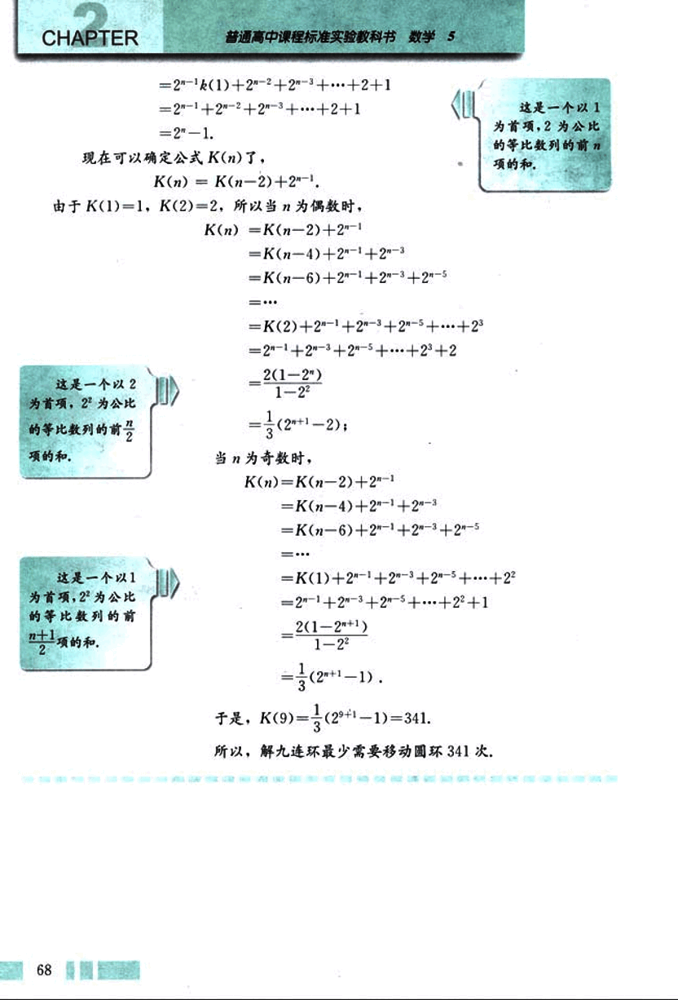
82

# 第二章 数列

## 习题 2.5  A组

1. 在等比数列{$a_n$}中：

(1) 已知 $a_1 = -1$，$a_4 = 64$，求 q 与 $S_4$；

(2) 已知 $a_3 = \frac{3}{2}$，$S_3 = 9$，求 $a_1$ 与 q。

2. 某企业去年的产值是 138 万元，计划在今后 5 年内每年比上一年产值增长 10%，这 5 年的总产值是多少？

3. 如图，画一个边长为 2 cm 的正方形，再将这个正方形各边的中点相连得到第 2 个正方形，依此类推，这样一共画了 10 个正方形，求：

(1) 第 10 个正方形的面积；

(2) 这 10 个正方形的面积的和。

4. 求和：

(1) $(a - 1) + (a^2 - 2) + \dots + (a^n - n)$；

(2) $(2 - 3 \times 5^{-1}) + (4 - 3 \times 5^{-2}) + \dots + (2n - 3 \times 5^{-n})$；

(3) $1 + 2x + 3x^2 + \dots + nx^{n-1}$

5. 一个球从 100 m 高处自由落下，每次着地后又跳回到原高度的一半再落下，

(1) 当它第 10 次着地时，经过的路程共是多少？

(2) 当它第几次着地时，经过的路程共是 293.75 m？

[第5题](images/diagram5.png)

6. 已知 $S_n$ 是等比数列 {$a_n$} 的前 n 项和，$S_3$，$S_4$，$S_5$ 成等差数列，求证 $a_2$，$a_3$，$a_4$ 成等差数列。

[第3题](images/diagram3.png)

69

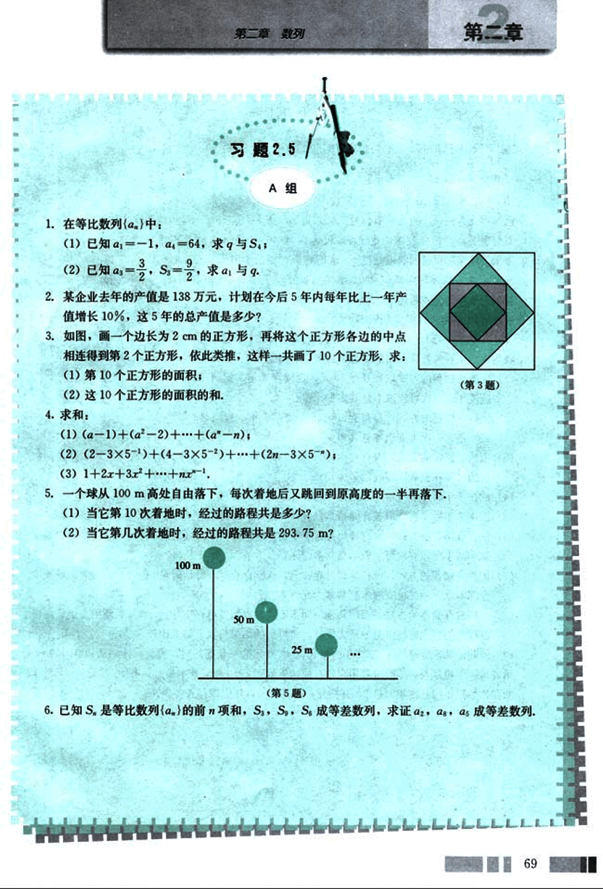
83

# CHAPTER 2

## B组

1. 利用等比数列的前n项和的公式证明
$a + ab + a b^2 + ... + ab^{n-1} + b^n = \frac{a(1-b^{n+1})}{1-b}$

其中$n∈N$，a，b是不为0的常数，且$a≠b$。

2. 已知等比数列{$a_n$}的前n项和为$S_n$，求证$S_1$，$S_2-S_1$，$S_3-S_2$，$S_4-S_3$也成等比数列。

3. 资料表明，2000年我国工业废弃垃圾达$7.4×10^6t$，每t占地1平方米。环保部门每回收或处理1t废旧物资，相当于消灭4t工业废弃垃圾。如果环保部门2002年共回收处理了100t废旧物资，且以后每年的回收量递增20%。

(1) 2010年能回收多少废旧物资？

(2) 从2002年到2010年底，可节约土地多少m²(精确到1m²)?

4. 收集本地区有关教育储蓄的信息，思考以下问题。

(1) 依教育储蓄的方式，每月存50元，连续存3年，到期（3年）或6年时一次可支取本息共多少元？

(2) 依教育储蓄的方式，每月存a元，连续存3年，到期（3年）或6年时一次可支取本息共多少元？

(3) 依教育储蓄的方式，每月存50元，连续存3年，到期（3年）时一次可支取本息比同档次的“零存整取”多收益多少元？

(4) 欲在3年后一次支取教育储蓄本息合计1万元，每月应存入多少元？

(5) 欲在3年后一次支取教育储蓄本息合计a万元，每月应存入多少元？

(6) 依教育储蓄的方式，原打算每月存100元，连续存6年，可是到4年时，学生需要提前支取全部本息，一次可支取本息共多少元？

(7) 依教育储蓄的方式，原打算每月存a元，连续存6年，可是到6年时，学生需要提前支取全部本息，一次可支取本息共多少元？

(8) 不用教育储蓄的方式，而用其他的储蓄形式，以每月可存100元，6年后使用为例，探讨以现行的利率标准可能的最大收益，将得到的结果与教育储蓄比较。

5. 购房问题：某家庭打算在2010年的年底花40万元购一套商品房，为此，计划从2004年初开始，每年年初存入一笔购房专用存款，使这笔款到2010年底连本带息共有40万元。如果每年的存款数额相同，按年利息2%并按复利计算，问每年应该存入多少钱？

[image](images/image.png)

70

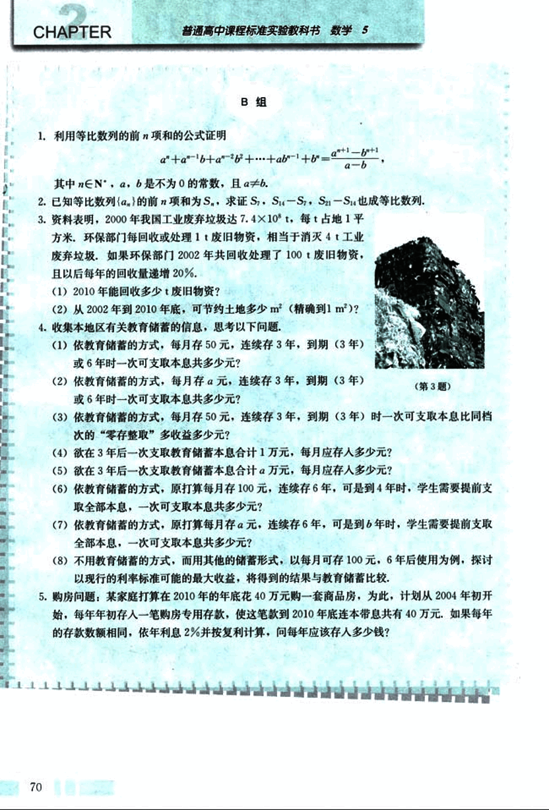
84

# 第二章 数列

## 购房中的数学

数列在实际生活中有很多应用，例如人们在贷款、储蓄、购房、购物等经济生活中就大量用到数列的知识。某地一位居民为了改善家庭的住房条件，决定在2003年重新购房。某日，他来到了一个房屋交易市场，面对着房地产商林林总总的宣传广告，是应该买商品房还是买二手房呢，他一时拿不定主意。

经过一番调查，这位居民搜集了一些住房信息，然后在下表中列出了他的家庭经济状况和可供选择的方案，准备向专家咨询。

| 家庭经济状况 | 家庭每月总收入3000元，也就是年收入3.6万元，现有存款6万元，但是必须留2万元~3万元以备急用。 |
|---|---|
| 预选方案 | 1. 买商品房：一套面积为80 m²的住宅，每平方米售价为1500元。  2. 买二手房：一套面积为110 m²左右的二手房，售价为14.2万元，要求首付4万元。 |

购房还需要贷款，这位居民选择了一家银行申请购房贷款。该银行的贷款评估员根据表格中的信息，向他提供了下列信息和建议：

申请商业贷款，贷款期限为15年比较合适，年利率为5.04%。购房的首期付款应不低于实际购房总额的20%，贷款额应不高于实际购房总额的80%。还款方式为等额本金还款，如果按季还款，每季还款额可以分成本金部分和利息部分，其计算公式分别为：

本金部分 = 贷款本金 ÷ 贷款期季数

利息部分 = (贷款本金 - 已归还贷款本金累计额) × 季利率

同学们今后也可能面临这样的问题，现在，就用我们学过的数列知识帮这位居民算一算这笔经济账，根据以上购房贷款方式，你认为预选方案1、2到底哪个是他的最佳选择？

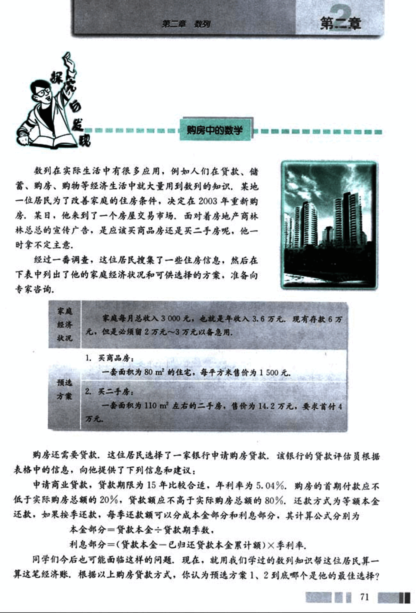
85

# CHAPTER 2

和同学交流你的想法，然后给他写一封信，阐述你的建议，并说明理由。

你可以借助报纸或互联网查找、整理有关房地产和购房贷款的资料，还可以请教老师或到相关机构咨询。

## 参考资料

1. 贷款买房时，购房者首先与房地产开发商签订房屋购买合同，然后与银行签订贷款合同，用这套住房作为抵押，向银行申请贷款，银行在审查同意你的申请后，通常会将住房总价值的 70% 或 80% 直接划给房地产开发商，这时候，购房者只需要拿出住房总价值的 30% 或 20%（通常叫做首期），就可以搬进新房了，其余的款项，购房者以一定的利率，逐月偿还给银行，偿还期限短则 3～5 年，长则 15 年、20 年，甚至 30 年。

2. 二手房即旧房，新建的商品房进行第一次交易时称为“一手”，第二次交易称为“二手”，二手房贷款是向购买二手房的购房者提供贷款，由借款人分期还款的贷款方式。

3. 目前购房贷款可以采用三种贷款类型：商业贷款、公积金贷款和商业公积金组合贷款。商业贷款 1～5 月月利率为 0.397 5%，年利率为 4.77%；6～20 月月利率为 0.425%，年利率为 5.04%。公积金贷款 1～5 月月利率为 0.3%，年利率为 3.6%；6～20 年月利率为 0.337 5%，年利率为 4.05%。

4. 目前银行规定有两种还款方式：（1）等额本息还款法；（2）等额本金还款法。等额本金还款法的特点是：每期还款额递减，利息总支出比等额本息还款法少，这种方式 1999 年 1 月正式推出，正被各银行逐渐采用，等额本金还款法可以是按月还款和按季还款，由于银行结息惯例的要求，一般采用按季还款的方式。

5. 对于家庭经济收入的分配，国内外经济学家提供了下述参考标准：家庭收入的 30% 用于偿还购房贷款，30% 用于投资储蓄，20% 用于子女教育，20% 用于日常开销，因此，偿还购房贷款的金额占家庭总收入的 20%～30% 为宜。

72

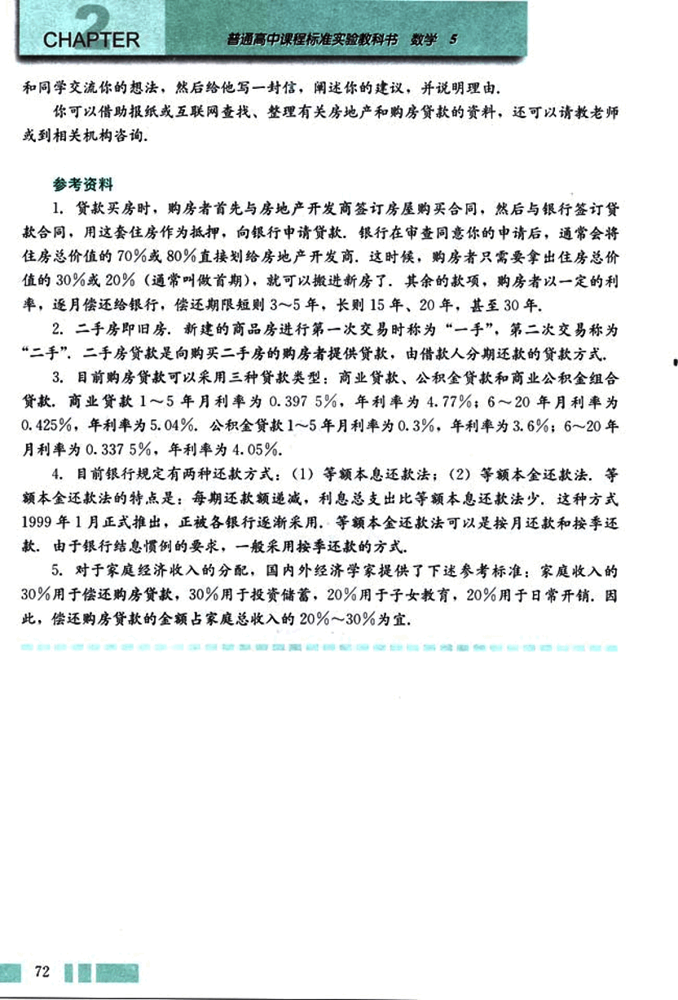

