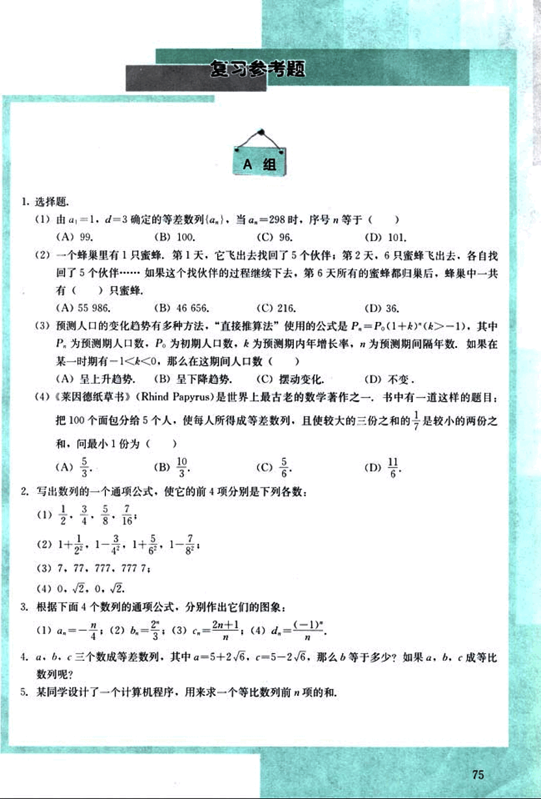
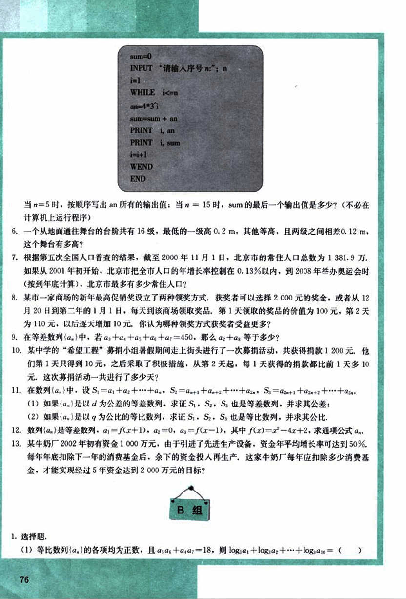
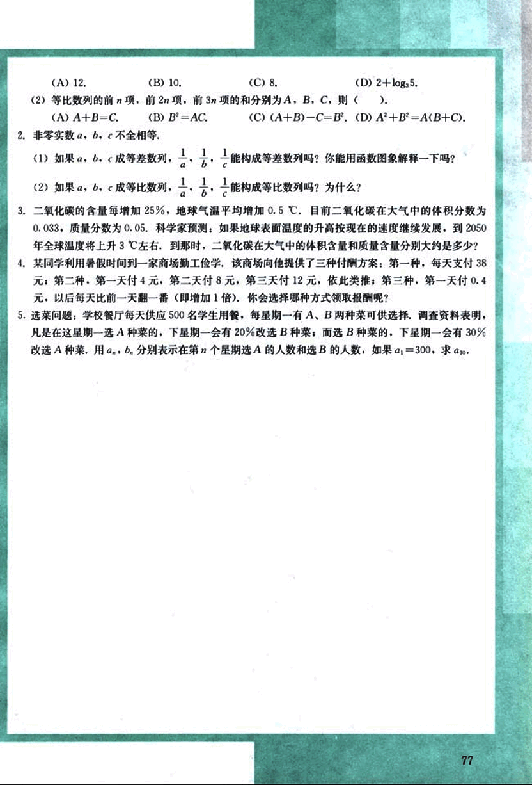

# 复习参考题

88

# 复习参考题

## A组

1. 选择题.

(1) 由 $a_1 = 1$，$d = 3$ 确定的等差数列 $\{a_n\}$，当 $a_n = 298$ 时，序号 $n$ 等于 ( )
(A) 99.  (B) 100.  (C) 96.  (D) 101.

(2) 一个蜂巢里有 1 只蜜蜂，第 1 天，它飞出去找回了 5 个伙伴；第 2 天，6 只蜜蜂飞出去，各自找回了 5 个伙伴……如果这个找伙伴的过程继续下去，第 6 天所有的蜜蜂都归巢后，蜂巢中一共 有 ( ) 只蜜蜂。
(A) 55 986.  (B) 46 656.  (C) 216.  (D) 36.

(3) 预测人口的变化趋势有多种方法，“直接推算法”使用的公式是 $P_n = P_0(1 + k)^{n-1}$，其中 $P_0$ 为预测期人口数，$P_0$ 为初期人口数，$k$ 为预测期内年增长率，$n$ 为预测期间隔年数。如果在某一时期有 $-1 < k < 0$，那么在这期间人口数 ( )
(A) 呈上升趋势.  (B) 呈下降趋势.  (C) 摆动变化.  (D) 不变.

(4) 《莱因德纸草书》(Rhind Papyrus) 是世界上最古老的数学著作之一，书中有一道这样的题目：把 100 个面包分给 5 个人，使每人所得成等差数列，且使较大的三份之和的 $\frac{1}{7}$ 是较小的两份之和，问最小一份为 ( )
(A) $\frac{5}{3}$.  (B) $\frac{10}{3}$.  (C) $\frac{5}{6}$.  (D) $\frac{11}{6}$.

2. 写出数列的一个通项公式，使它的前 4 项分别是下列各数：
(1) $\frac{1}{2}$, $\frac{3}{4}$, $\frac{5}{8}$, $\frac{7}{16}$;
(2) $1 + \frac{1}{2}$, $1 - \frac{1}{4}$, $1 + \frac{5}{8}$, $1 - \frac{7}{8}$;
(3) 7, 77, 777, 7777;
(4) 0, $\sqrt{2}$, 0, $\sqrt{2}$.

3. 根据下面 4 个数列的通项公式，分别作出它们的图象：
(1) $a_n = -n$;  (2) $b_n = \frac{2}{n}$;  (3) $c_n = 2n + 1$;  (4) $d_n = \frac{(-1)^n}{n}$.

4. $a, b, c$ 三个数成等差数列，其中 $a = 5 + 2\sqrt{6}$，$c = 5 - 2\sqrt{6}$，那么 $b$ 等于多少？如果 $a, b, c$ 成等比数列呢？

5. 某同学设计了一个计算机程序，用来求一个等比数列前 $n$ 项的和.

75


89

# B组

1. 选择题。

(1) 等比数列{$a_n$}的各项均为正数，且$a_1a_5 + a_2a_4 = 18$，则$\log_3a_1 + \log_3a_2 + ... + \log_3a_{10} = $ (  )

6. 一个从地面通往舞台的台阶共有16级，最低的一级高0.2 m，其他等高，且两级之间相差0.12 m。这个舞台有多高？

7. 根据第五次全国人口普查的结果，截至2000年11月1日，北京市的常住人口总数为1 381.9万。如果从2001年初开始，北京市把全市人口的年增长率控制在0.13%以内，到2008年举办奥运会时（按到年底计算），北京市最多有多少常住人口？

8. 某市一家商场的新年最高促销奖设立了两种领奖方式，获奖者可以选择2000元的奖金，或者从12月20日到第二年的1月1日，每天到该商场领取奖品，第1天领取的奖品的价值为100元，第2天为110元，以后逐天增加10元，你认为哪种领奖方式获奖者受益更多？

9. 在等差数列{$a_n$}中，若$a_3 + a_4 + a_5 + a_6 + a_7 = 450$，那么$a_2 + a_8$等于多少？

10. 某中学的“希望工程”募捐小组暑假期间走上街头进行了一次募捐活动，共获得捐款1200元，他们第1天只得到10元，之后采取了积极措施，从第2天起，每1天获得的捐款都比前1天多10元，这次募捐活动一共进行了多少天？

11. 在数列{$a_n$}中，设$S_1 = a_1 + a_2 + ... + a_n$，$S_2 = a_{n+1} + a_{n+2} + ... + a_{2n}$，$S_3 = a_{2n+1} + a_{2n+2} + ... + a_{3n}$。
(1) 如果{$a_n$}是以d为公差的等差数列，求证$S_1$，$S_2$，$S_3$也是等差数列，并求其公差；
(2) 如果{$a_n$}是以q为公比的等比数列，求证$S_1$，$S_2$，$S_3$也是等比数列，并求其公比。

12. 数列{$a_n$}是等差数列，$a_1 = f(x+1)$，$a_2 = 0$，$a_3 = f(x-1)$，其中$f(x) = x^2 - 4x + 2$，求通项公式$a_n$。

13. 某牛奶厂2002年初有资金1000万元，由于引进了先进生产设备，资金年平均增长率可达到50%。每年年底扣除下一年的消费基金后，余下的资金投入再生产，这家牛奶厂每年应扣除多少消费基金，才能实现经过5年资金达到2000万元的目标？

```
sum=0
INPUT“请输入序号n:”;n
i=1
WHILE i<=n
an=4*3^i
sum=sum + an
PRINT i, an
PRINT i, sum
i=i+1
WEND
END
```

当n=5时，按顺序写出an所有的输出值；当n=15时，sum的最后一个输出值是多少？（不必在计算机上运行程序）


90

# 试题

(A) 12.  (B) 10.  (C) 8.  (D) 2+log<sub>3</sub>5.

(2)等比数列的前 *n* 项，前 2*n* 项，前 3*n* 项的和分别为 A，B，C，则 ( ).
(A) A+B=C.  (B) B<sup>2</sup>=AC.  (C) (A+B)-C=B<sup>2</sup>.  (D) A<sup>2</sup>+B<sup>2</sup>=A(B+C).

2. 非零实数 *a*, *b*, *c* 不全相等，

(1)如果 *a*, *b*, *c* 成等差数列，$\frac{1}{a}$, $\frac{1}{b}$, $\frac{1}{c}$ 能构成等差数列吗？你能用函数图像解释一下吗？

(2)如果 *a*, *b*, *c* 成等比数列，$\frac{1}{a}$, $\frac{1}{b}$, $\frac{1}{c}$ 能构成等比数列吗？为什么？

3. 二氧化碳的含量每增加 25%，地球气温平均增加 0.5℃。目前二氧化碳在大气中的体积分数为 0.033，质量分数为 0.05。科学家预测：如果地球表面温度的升高按现在的速度继续发展，到 2050 年全球温度将上升 3℃左右，到那时，二氧化碳在大气中的体积含量和质量含量分别大约是多少？

4. 某同学利用暑假时间到一家商场勤工俭学，该商场向他提供了三种付酬方案：第一种，每天支付 38 元；第二种，第一天付 4 元，第二天付 8 元，第三天付 12 元，依此类推；第三种，第一天付 0.4 元，以后每天比前一天翻一番（即增加 1 倍），你会选择哪种方式领取报酬呢？

5. 选菜问题：学校餐厅每天供应 500 名学生用餐，每星期一有 A、B 两种菜可供选择，调查资料表明，凡是在这星期一选 A 种菜的，下星期一会有 20% 改选 B 种菜；而选 B 种菜的，下星期一会有 30% 改选 A 种菜。用 $a_n$，$b_n$ 分别表示在第 *n* 个星期选 A 的人数和选 B 的人数，如果 $a_1$=300，求 $a_{10}$。


