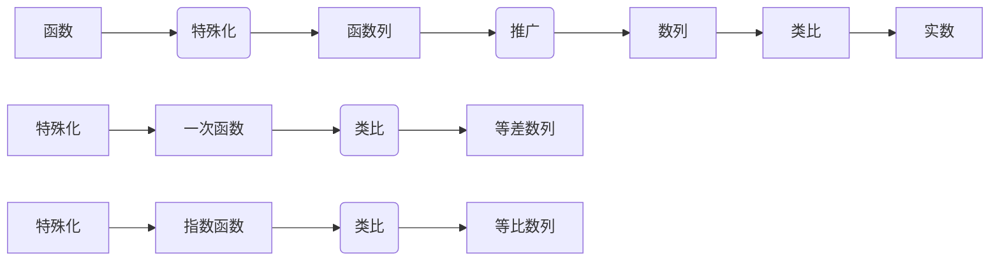
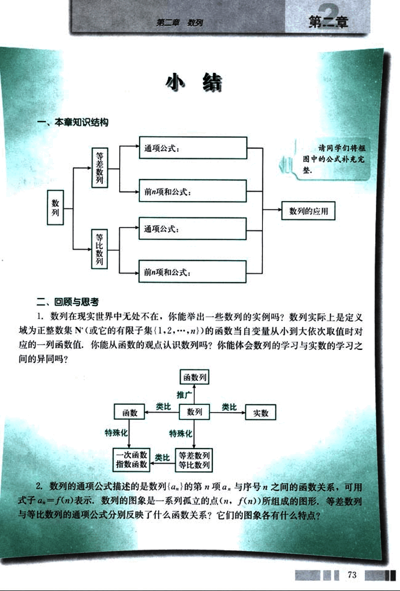
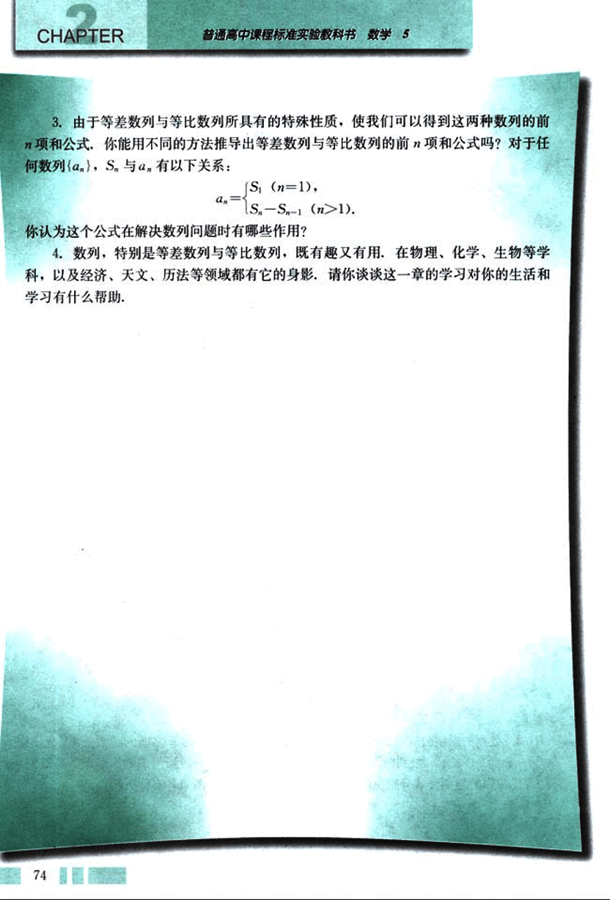

# 小结

86

# 第二章 数列

## 小结

### 一、本章知识结构

```mermaid
graph LR
A[数列] --> B(等差数列);
A --> C(等比数列);
B --> D{通项公式:};
B --> E{前n项和公式:};
C --> F{通项公式:};
C --> G{前n项和公式:};
D --> H[数列的应用];
E --> H;
F --> H;
G --> H;
subgraph ""
H --> I{请同学们将框图中的公式补充完整.}
end
```

### 二、回顾与思考

1. 数列在现实世界中无处不在，你能举出一些数列的实例吗？数列实际上是定义域为正整数集（或它的有限子集{1,2,…,n}）的函数当自变量从小到大依次取值时对应的一列函数值，你能从函数的观点认识数列吗？你能体会数列的学习与实数的学习之间的异同吗？



2. 数列的通项公式描述的是数列{$a_n$}的第n项$a_n$与序号n之间的函数关系，可用式子$a_n=f(n)$表示，数列的图象是一系列孤立的点(n, f(n))所组成的图形，等差数列与等比数列的通项公式分别反映了什么函数关系？它们的图象各有什么特点？

73


87

# CHAPTER 2

普通高中课程标准实验教科书 数学 5

3. 由于等差数列与等比数列所具有的特殊性质，使我们可以得到这两种数列的前 $n$ 项和公式，你能用不同的方法推导出等差数列与等比数列的前 $n$ 项和公式吗？对于任何数列 $\{a_n\}$，$S_n$ 与 $a_n$ 有以下关系：

$a_n = \begin{cases} S_1 & (n=1), \\ S_n - S_{n-1} & (n>1). \end{cases}$

你认为这个公式在解决数列问题时有哪些作用？

4. 数列，特别是等差数列与等比数列，既有趣又有用，在物理、化学、生物等学科，以及经济、天文、历法等领域都有它的身影，请你谈谈这一章的学习对你的生活和学习有什么帮助.

74


