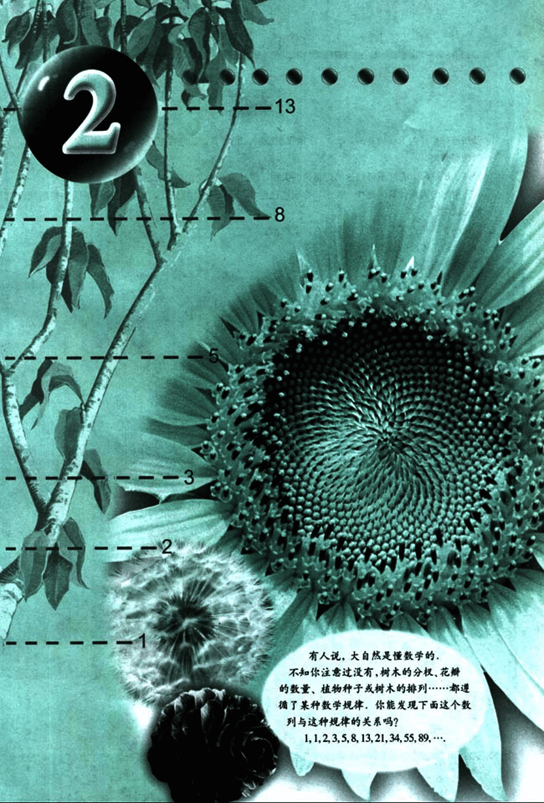
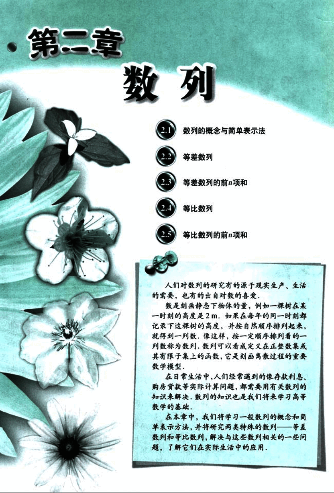

# 第2章　数列

43

# 2

-13
---
-8
---
-5
---
-3
---
-2
---
-1

有人说，大自然是懂数学的，
不知你注意过没有，树木的分枝、花瓣
的数量、植物种子或树木的排列……都遵循
了某种数学规律，你能发现下面这个数
列与这种规律的关系吗？
1, 1, 2, 3, 5, 8, 13, 21, 34, 55, 89,…

44

# 第二章 数列

## 2.1 数列的概念与简单表示法

## 2.2 等差数列

## 2.3 等差数列的前n项和

## 2.4 等比数列

## 2.5 等比数列的前n项和

人们对数列的研究有的源于现实生产、生活的需要，也有的出自对数的喜爱。

数是刻画静态下物体的量，例如一棵树在某一时刻的高度是2 m。如果在每年的同一时刻都记录下这棵树的高度，并按自然顺序排列起来，就得到一列数，像这样，按一定顺序排列着的一列数称为数列，数列可以看成定义在正整数集或其有限子集上的函数，它是刻画离散过程的重要数学模型。

在日常生活中，人们经常遇到的像存款利息、购房贷款等实际计算问题，都需要用有关数列的知识来解决，数列的知识也是我们将来学习高等数学的基础。

在本章中，我们将学习一般数列的概念和简单表示方法，并将研究两类特殊的数列——等差数列和等比数列，解决与这些数列相关的一些问题，了解它们在实际生活中的应用。

